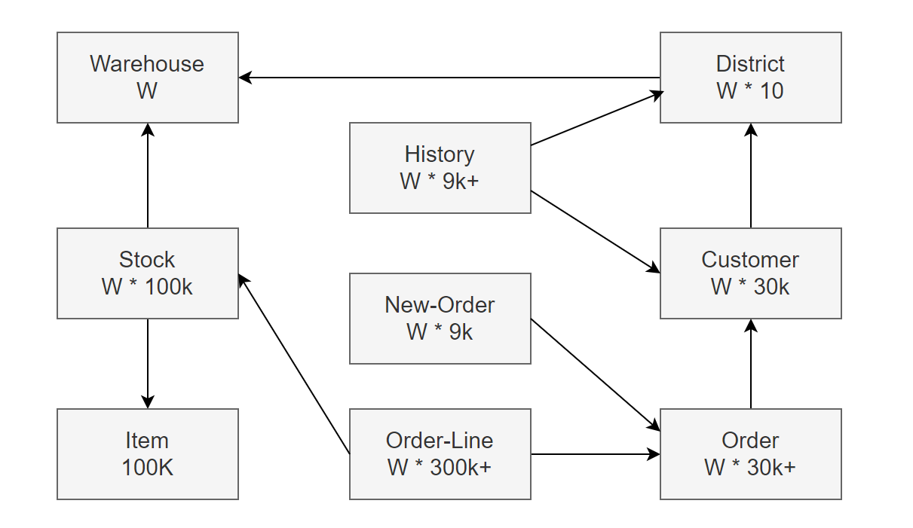
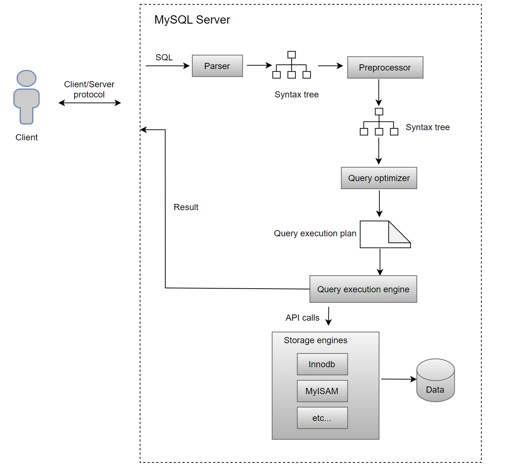
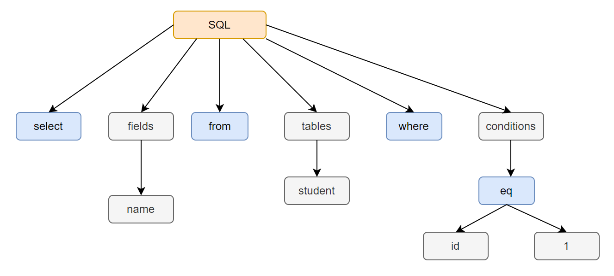
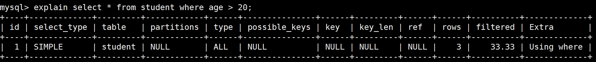
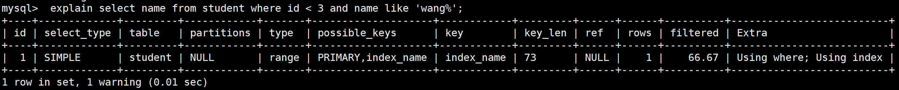
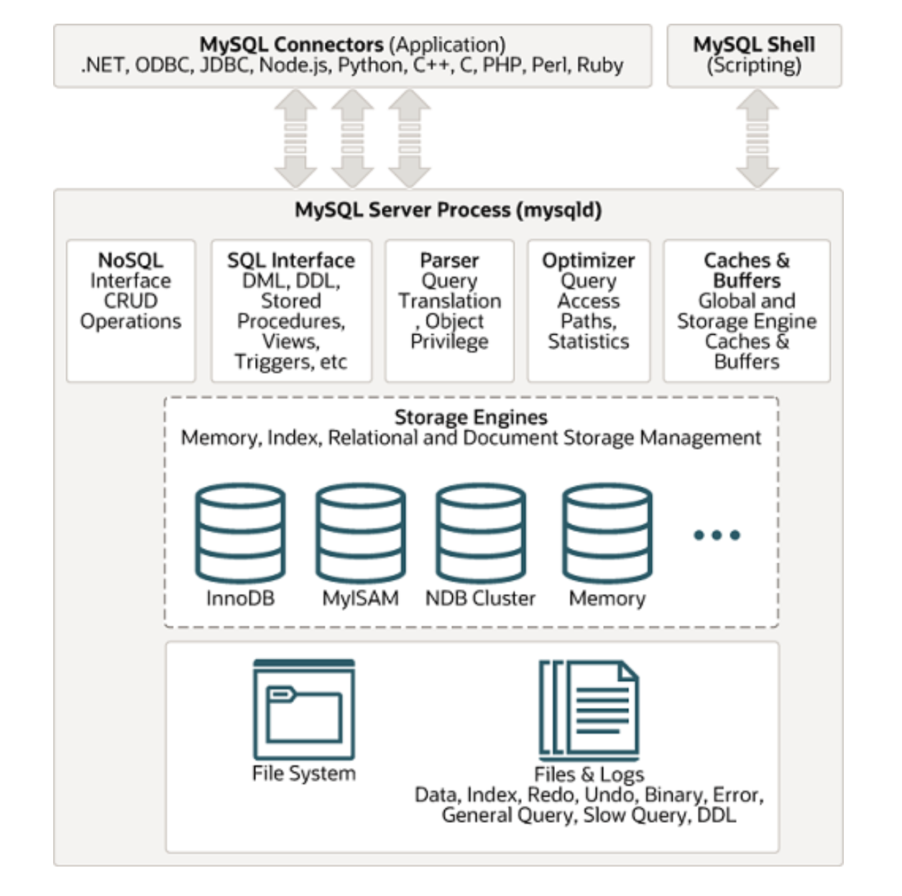
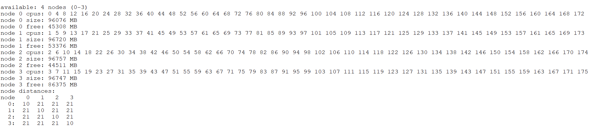
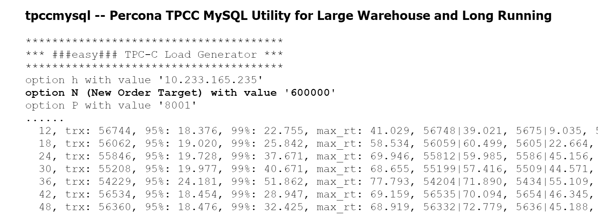

# Appendix

## Glossary

This book includes numerous terms. Familiarizing yourself with their meanings in advance will help you better understand the problems discussed.

**1 Achieving Strong Consistency in Read/Write Operations**

MySQL Group Replication ensures strong consistency with two mechanisms:

**Strong Consistency Read (Before Mechanism)**:

A read-write (RW) transaction waits for all prior transactions to complete before being applied. A read-only (RO) transaction waits for all prior transactions before execution. This guarantees that the transaction reads the latest value, affecting only the read latency.

**Strong Consistency Write (After Mechanism):**

A RW transaction waits until its changes are applied to all group members. This ensures that once committed on the local member, any subsequent reads on any member will see the committed value or a more recent one. RO transactions are unaffected.

**2 AI**

Artificial intelligence (AI) enables machines to exhibit intelligent behavior by developing methods and software for perception, learning, and goal-oriented actions. Machine learning (ML), a subset of AI, creates algorithms that learn from data to perform tasks without explicit instructions. Advances in neural networks have significantly improved performance in many areas.

Deep learning, a prominent ML direction, has greatly enhanced fields like computer vision, speech recognition, and natural language processing, thanks to increased computational power (especially GPUs) and extensive training datasets like ImageNet.

In databases, AI can automate operations, tune performance parameters, and construct SQL statements, enhancing efficiency and functionality. MySQL HeatWave combines transactions, analytics, and machine learning into a single managed service.

**3 Algorithms**

Design algorithms are instructions for solving specific problems. Logical reasoning is essential, as it involves creating a logically organized sequence of steps to achieve the desired outcome. Programmers must consider control flow, data flow, and interactions to ensure the algorithm is efficient, correct, and meets requirements.

**4 Balanced Replay Speed**

For MySQL secondary replay, balanced replay speed is the point at which the secondary matches the primary's speed under normal conditions. If the primary's speed is at or below this threshold, there is minimal lag. However, if the primary's speed exceeds this threshold, the secondary begins to lag in transaction replay progress.

**5 Causality**

Causality is the relationship where one event or state (the cause) leads to the production of another event or state (the effect). The cause is partly responsible for the effect, and the effect depends on the cause.

**6 Crash Recovery**

Transactions in a database can be interrupted unexpectedly. If a failure occurs before all changes in a transaction are completed and committed, the database may become inconsistent and unusable. Crash recovery is the process of restoring the database to a consistent and usable state.

**7 Data Structure**

In computer science, a data structure is a data organization, and storage format that is usually chosen for efficient access to data. It consists of data values, their relationships, and the operations that can be performed on them, forming an algebraic structure.

**8 Doublewrite**

The doublewrite buffer is a storage area where InnoDB writes pages from the buffer pool before writing them to their final positions in the data files. If an unexpected failure occurs during a page write, InnoDB can use the copy in the doublewrite buffer to recover the page during crash recovery.

**9 Dual One**

Binlog is a logical log that records transaction modifications for data replication and disaster recovery in MySQL. In contrast, the redo log is a physical log that captures modifications to data pages, essential for recovering committed data after a crash. Both logs are crucial for MySQL crash recovery. To prevent data loss during unexpected failures, 'dual one' protection is essential, which involves ensuring timely disk flushing for both the binlog and redo log.

**10 Fault Tolerance**

Fault tolerance is a system's ability to continue operating correctly despite failures or faults in its components.

**11 GTID**

Global Transaction Identifiers (GTIDs) simplify replication by uniquely identifying each transaction, eliminating the need to refer to log files or positions when setting up new secondaries or handling failovers. With GTID-based replication, tracking transactions directly ensures easy verification of consistency: if all transactions committed on the primary are present on the secondary, consistency is guaranteed.

GTIDs are maintained between primary and secondary, enabling you to trace any transaction's origin through the binary log. Once a transaction with a specific GTID is committed on a server, duplicate transactions with the same GTID are ignored, ensuring that each transaction is applied only once on the secondary, thus preserving consistency.

In this book, MySQL Server is configured with the following settings before running:

```
gtid_mode=ON
enforce_gtid_consistency=ON
```

This configuration ensures that each MySQL node uses GTID, simplifying the process of tracing and troubleshooting problems.

**12 High Availability**

High availability is a network resilience property that ensures an acceptable level of service despite faults and operational challenges.

**13 Idempotence**

Idempotence is a property of certain operations in computer science where applying the operation multiple times has the same effect as applying it once.

**14 Latch vs. Lock: Key Differences**

In computer science, a latch or mutex (short for mutual exclusion) is a synchronization primitive that prevents simultaneous access to state by multiple threads. Locking is a technique used to prevent concurrent access to data in a database, ensuring consistent results.

Latch is similar to mutex, while the lock structure in MySQL is as follows:

```c++
/** Lock struct; protected by lock_sys latches */
struct lock_t {
  /** transaction owning the lock */
  trx_t *trx;
  /** list of the locks of the transaction */
  UT_LIST_NODE_T(lock_t) trx_locks;
  /** Index for a record lock */
  dict_index_t *index;
  /** Hash chain node for a record lock. The link node in a singly
  linked list, used by the hash table. */
  lock_t *hash;
  union {
    /** Table lock */
    lock_table_t tab_lock;
    /** Record lock */
    lock_rec_t rec_lock;
  };
  ...
```

So, what distinguishes these two concepts? Consider this metaphor [19]:

-   A **latch** secures a door, gate, or window in place but does not offer protection against unauthorized access.
-   A **lock**, however, restricts entry to those without the key, ensuring security and control.

In MySQL, a global latch is employed to serialize specific processing procedures. For instance, the following is MySQL's description of the role of a global latch.

```c++
All of the steps above (except 2, as we usually know the page already) are
accomplished with the help of single line:
    locksys::Shard_latches_guard guard{*block_a, *block_b};
And to "stop the world" one can simply x-latch the global latch by using:
    locksys::Global_exclusive_latch_guard guard{};
This class does not expose too many public functions, as the intention is to
rather use friend guard classes, like the Shard_latches_guard demonstrated.
*/
class Latches {
 private:
  using Lock_mutex = ib_mutex_t;
 ...
```

In MySQL, locks are integral to the transaction model, with common types including row locks and table locks. Deadlock detection in MySQL is related to locks, not latches.

Understanding locks is crucial for:

-   Implementing large-scale, busy, or highly reliable database applications
-   Tuning MySQL performance

Familiarity with InnoDB locking and the InnoDB transaction model is essential for these tasks.

It is worth noting that lock objects in MySQL require latch protection to ensure correctness, as seen in the following code.

```c++
/** Grants a lock to a waiting lock request and releases the waiting
transaction. The caller must hold lock_sys latch for the shard containing the
lock, but not the lock->trx->mutex.
@param[in,out]    lock    waiting lock request
 */
static void lock_grant(lock_t *lock) {
  ut_ad(locksys::owns_lock_shard(lock));
  ut_ad(!trx_mutex_own(lock->trx));
  trx_mutex_enter(lock->trx);
  if (lock_get_mode(lock) == LOCK_AUTO_INC) {
    dict_table_t *table = lock->tab_lock.table;
    if (table->autoinc_trx == lock->trx) {
      ib::error(ER_IB_MSG_637) << "Transaction already had an"
                               << " AUTO-INC lock!";
    } else {
      ut_ad(table->autoinc_trx == nullptr);
      table->autoinc_trx = lock->trx;
      ib_vector_push(lock->trx->lock.autoinc_locks, &lock);
    }
  }
  ...
```


**15 Maintaining Transaction Order with replica_preserve_commit_order**

In MySQL, the *replica_preserve_commit_order* configuration ensures that transactions on secondary databases are committed in the same order as they appear in the relay log. This setting lays the foundation for maintaining the causal relationship between transactions: if transaction A commits before transaction B on the primary, transaction A will also commit before transaction B on the secondary. This prevents inconsistencies where transactions could be read in the reverse order on the secondary.

**16 MVCC**

Multiversion Concurrency Control (MVCC) is a non-locking concurrency control method used by database management systems to enable concurrent access to the database.

**17 Network Latency**

Network latency in packet-switched networks is typically measured as round-trip delay time, which includes the latency from source to destination and back. This latency significantly affects the performance of MySQL.

**18 Network Partition**

A network partition divides a computer network into separate subnets, either intentionally for optimization or due to device failures. Distributed software must be partition-tolerant, meaning it should continue to function correctly even when the network is partitioned.

**19 NUMA**

Non-uniform memory access (NUMA) is a computer memory design used in multiprocessing, where the memory access time depends on the memory location relative to the processor. NUMA extends the scaling of symmetric multiprocessing (SMP) architectures. SMP struggles with scalability because it allows only one processor to access memory at a time, leading to bottlenecks. NUMA, now the mainstream server architecture, mitigates these problems. However, binding a MySQL instance to a single NUMA node essentially makes it function as a pure SMP architecture.

**20 OLTP**

Online Transaction Processing (OLTP) refers to database systems used in transaction-oriented applications, such as operational systems. These systems are designed to process and respond to user requests in real-time. This is in contrast to Online Analytical Processing (OLAP), which focuses on data analysis rather than transaction processing.

**21 Paxos Algorithm**

Paxos is a family of protocols for solving consensus in a network of unreliable or fallible processors.

**22 Pipelining**

In computing, pipelining, or pipeline processing, is akin to a manufacturing assembly line where different stages of a process are executed concurrently, even if some stages depend on the completion of others. This approach allows multiple operations to proceed simultaneously, improving overall efficiency and reducing processing time.

**23 PGO**

Profile-Guided Optimization (PGO) is a compiler technique that uses profiling data to improve program runtime performance. As a dynamic optimization method, PGO improves code based on runtime information.

**24 Read Committed Isolation Level**

Put simply, the Read Committed isolation level ensures that any data read during a transaction is committed at the time of reading. It prevents the reader from seeing uncommitted or 'dirty' data. However, it doesn¡¯t guarantee that if the transaction reads the same data again, it will be the same; the data can change after being read.

**25 Replication**

Replication relies on the primary server tracking all database changes (updates, deletes, etc.) in its binary log. This log records all events that alter the database's structure or content from server startup. SELECT statements are not recorded, as they do not modify the database. Replication functions by reading events from the binary log on the primary server and processing them on the secondary server. Events are recorded in various formats within the binary log, depending on the type of event.

**26 Response Time**

In computing, response time measures how long a system takes to respond to a service request, indicating the service's responsiveness.

**27 Row-based Replication**

When using row-based logging, the primary writes events to the binary log that detail changes to individual table rows. Replication to the secondary involves copying these row change events to the secondary, a process known as row-based replication.

**28 State Machine Replication**

In computer science, state machine replication (SMR) is a method for implementing fault-tolerant services by replicating servers and coordinating client interactions with these replicas. In a MySQL Group Replication cluster, SMR is employed using the Paxos algorithm.

**29 Thread Pool**

In computer programming, a thread pool is a design pattern used to achieve concurrent execution. It maintains a pool of threads that are ready to execute tasks as they become available. This approach improves performance by reducing the overhead associated with frequently creating and destroying threads. The number of threads in the pool is adjusted based on the program's computing resources, optimizing task execution and resource utilization.

**30 Throughput**

Throughput measures the number of requests a system processes within a unit of time. Common statistical indicators include:

1.  **Transactions Per Second (TPS):** The number of database transactions performed per second.
2.  **Queries Per Second (QPS):** The number of database queries performed per second.
3.  **tpmC for TPC-C:** The rate of New-Order transactions executed per minute in TPC-C benchmarks.

**31 Thundering Herd**

In computer science, the thundering herd problem occurs when many processes or threads are awakened by an event, but only one can handle it. This leads to excessive competition for resources, potentially freezing the system.

**32 TPC-C**

TPC-C is an OLTP benchmark that measures performance based on the rate of New-Order transactions executed per minute. This rate is reported as the tpmC (transactions per minute C), which serves as the benchmark's primary performance metric.

**33 Transaction**

In a database management system, a transaction is a logical unit of work, often comprising multiple operations. Transactions not only simplify the complexity of application coding but are also one of the core functionalities of database management systems.

**34 Transaction Throttling**

In MySQL, transaction throttling manages high concurrency by limiting the number of user threads entering the transaction system at once. This approach helps reduce system pressure and enhances stability by controlling the load on the system.

**35 View Change**

A view represents the active members of a MySQL Group Replication configuration at a given time. A view change occurs when the group configuration changes, such as when a member joins or leaves, and is communicated to all members simultaneously. Each view is uniquely identified by a view identifier, which is generated with each view change.

## **Testing Tool**

### 1 SysBench

SysBench is a widely used open-source benchmark tool for testing open-source database management systems (DBMSs). It provides a quick assessment of system performance without the need for elaborate benchmark setups. The tool supports various tests, including conventional read-write and write-only tests, as well as conflict-type tests based on Pareto distribution.

SysBench's main advantages are its simplicity, ease of use, and user-friendliness. However, this simplicity can also be a significant drawback. The oversimplification of the testing process may lead to distortions, potentially missing critical problems and failing to accurately represent online processing capabilities. Therefore, while SysBench offers a straightforward approach to benchmarking, it may not fully capture the complexities of database performance.

### 2 TPC-C Testing Tool

The TPC-C benchmark, defined by the Transaction Processing Council, is an OLTP test involving 9 tables with 10 foreign key relationships. All tables, except the Item table, scale in cardinality based on the number of warehouses (W) specified during the initial database load.



This schema is used by five different transactions, each creating varied access patterns:

1.  **Item:** Read-only.
2.  **Warehouse, District, Customer, Stock:** Read/write.
3.  **New-Order:** Insert, read, and delete.
4.  **Order and Order-Line:** Inserts with time-delayed updates, causing rows to become stale and infrequently read.
5.  **History:** Insert-only.

The diverse access patterns of this small schema with a limited number of transactions contribute to TPC-C's ongoing significance as a major database benchmark. In this book, BenchmarkSQL is primarily employed to evaluate TPC-C performance in MySQL.

## How MySQL Processes SQL?

In computer science, the request-response or request-reply model is a fundamental communication method in networks. It involves a computer sending a request for data, and another computer responding to that request. Specifically, this pattern involves a request or sending a message to a replier system, which processes the request and returns a response.

MySQL uses the classic request-response model: clients send SQL queries to the MySQL Server, which processes these queries and sends the responses back to the clients. The following figure illustrates the standard SQL query processing flow in MySQL Server 8.0.



Here¡¯s how MySQL Server processes a SQL request with a detailed example. Suppose a user sends the following SQL statement from a MySQL client to MySQL Server:

```
select name from student where id=1;
```

Before executing the SQL query, MySQL Server first parses the SQL statement using the "parser", which performs two essential tasks:

**1. Lexical Analysis**

MySQL Server scans the SQL string you input and converts it into tokens, identifying keywords and other elements.


**2. Syntax Analysis**

Using the tokens from lexical analysis, the syntax parser checks whether the SQL statement adheres to MySQL syntax rules. Upon successful validation, it constructs an SQL syntax tree. This tree structure helps subsequent modules extract key components like SQL types (e.g., SELECT, INSERT), table names, field names, and conditions from the WHERE clause. For example, the SQL statement provided will generate a syntax tree representing these components:



This captures the core of the parsing process, where MySQL Server uses a Bison parser to build the syntax tree.

After parsing, MySQL Server undertakes several steps to optimize query performance before actual execution begins:

**1. Preprocessor**

The preprocessor performs preliminary tasks such as verifying the existence of tables or fields and expanding wildcard characters like \`\*\` in \`select \*\` to include all table columns.

**2. Query Optimizer**

The query optimizer determines the execution plan for the SQL query. This phase includes:

-   **Logical Query Rewrites:** Transforming queries into logically equivalent forms.
-   **Cost-Based Join Optimization:** Evaluating different join methods to minimize execution cost.
-   **Rule-Based Access Path Selection:** Choosing the best data access paths based on predefined rules.

The query optimizer generates the execution plan, which is then used by the query executor engine.

With the execution plan finalized, the query executor engine starts executing the SQL statement, interacting with the storage engine on a record-by-record basis.

Here are two types of execution processes: full table scan and index query.

**1. Full Table Scan**

Suppose a query is made to retrieve all information about students older than 20:

```
select * from student where age > 20;
```

Since this query condition does not use an index, the optimizer chooses a full table scan by setting the access type to ALL.



The execution process for the executor and storage engine is as follows:

1.  The Server layer calls the storage engine's full scan interface to start reading records from the table.
2.  The executor checks if the age of the retrieved record exceeds 20. Records that meet this condition are dispatched to the network write buffer if there is available space.
3.  The executor requests the next record from the storage engine in a loop. Each record is evaluated against the query conditions, and those that meet the criteria are sent to the network write buffer, provided the buffer is not full.
4.  Once the storage engine has read all records from the table, it notifies the executor that reading is complete.
5.  Upon receiving the completion signal, the executor exits the loop and flushes the query results to the client.

To optimize performance, MySQL minimizes frequent write system calls by checking if the network buffer is full before sending records to the client. Records are sent only when the buffer is full or when the completion signal is received.

**2. Index Query**

Consider the following SQL query:

```
select name from student where id < 3 and name like 'wang%';
```

Before executing this query, add a secondary index on the name field in the student table:

```
alter table student add index index_name(name);
```

The execution plan for this SQL query can be viewed using the *'explain'* statement, which shows that the query now utilizes the newly created index.



The execution process with an index is as follows:

1.  The executor requests the storage engine to locate the first index record matching the query condition (e.g., name LIKE 'wang%').
2.  The storage engine retrieves and returns the matching index record to the Server layer.
3.  The executor checks if the record meets the additional query conditions (e.g., id \< 3).

    If conditions are met, the corresponding name is added to the network buffer, unless it is full. If conditions are not met, the executor skips the record and requests the next one from the storage engine.

4.  This cycle continues as the executor repeatedly requests and evaluates the next index record that matches the query condition until all relevant index records are processed.
5.  Once the storage engine indicates that all relevant index records have been processed, the executor exits the loop and sends the collected results to the client.

Using an index allows the storage engine to quickly locate necessary records, bypassing the need to scan the entire table. In general, this significantly improves execution efficiency and speeds up the query.

## MySQL Architecture

The following picture illustrates the client-server architecture:



MySQL follows the client-server architecture, which divides the system into two main components: Client and Server.

### 1 Client

1.  The client is an application that interacts with the MySQL database server.
2.  It can be a standalone application, a web application, or any program requiring a database.
3.  The client sends SQL queries to the MySQL server for processing.

### 2 Server

1.  The server is the MySQL database management system responsible for storing, managing, and processing data.
2.  It receives SQL queries, processes them, and returns the result sets.
3.  It manages data storage, security, and concurrent access for multiple clients.

The client communicates with the server over the network using the MySQL protocol, enabling multiple clients to interact concurrently. Applications use MySQL connectors to connect to the database server. MySQL also provides client tools, such as the terminal-based MySQL client, for direct interaction with the server.

The MySQL database server includes several daemon processes:

1.  **SQL Interface**: Provides a standardized interface for applications to interact with the database using SQL queries.
2.  **Query Parser**: Analyzes SQL queries to understand their structure and syntax, breaking them down into components for further processing.
3.  **Query Optimizer**: Evaluates various execution plans for a given query and selects the most efficient one to improve performance.

In MySQL, a storage engine is responsible for storage, retrieval, and management of data. MySQL's pluggable storage engine architecture allows selecting different storage engines, such as InnoDB and MyISAM, to meet specific performance and scalability requirements while maintaining a consistent SQL interface.

The file system organizes and stores various file types, including data and index files. MySQL uses log files, such as binary logs and redo logs, to maintain transactional consistency and support recovery mechanisms.

Overall, MySQL follows a client-server architecture where clients send SQL queries to the server for processing. MySQL supports a pluggable storage engine architecture, allowing for the management of data storage and retrieval with various features and performance characteristics.

## MySQL Cluster

The most common way to create a fault-tolerant system is to use redundant components, allowing the system to continue operating if one component fails.

Replication in MySQL copies data from one server (primary) to one or more servers (secondaries), offering several advantages:

1.  **Scale-out solutions**: Spreads the load among multiple secondaries to improve performance. All writes and updates occur on the primary server, while reads can occur on secondaries, enhancing read speed.
2.  **Analytics**: Permits analysis on secondaries without impacting primary performance.
3.  **Long-distance data distribution**: Creates local data copies for remote sites without needing constant access to the primary.

The original synchronization type is one-way asynchronous replication. The advantage of asynchronous replication is that user response time is unaffected by secondaries. However, there is a significant risk of data loss if the primary server fails and secondaries are not fully synchronized.

Semisynchronous replication, in addition to asynchronous replication, requires a commit on the primary server to wait until at least one secondary acknowledges and logs the transaction events. This ensures up-to-date data on secondaries but impacts user response time and introduces high-availability complexities.

Replication introduces significant complexity, as it requires managing multiple servers instead of one. This involves addressing classic distributed systems problems like network partitioning and split-brain scenarios. The main challenge is to coordinate these servers consistently, ensuring they agree on system and data states with each change. Essentially, servers must function as a distributed state machine, either progressing as a single entity or eventually converging to the same state.

MySQL Group Replication provides distributed state machine replication with strong server coordination. Servers within a group automatically maintain a consistent view through a built-in membership service, updating when servers join or leave. If a server fails, the failure detection mechanism alerts the group.

Transaction commits require a majority consensus on the global transaction sequence, ensuring uniform commit or abort decisions. In split-brain scenarios, network partitions halt progress until solved. The Group Communication System (GCS) protocols ensure consistent data replication through failure detection, membership management, and ordered message delivery, all powered by the Paxos algorithm as the core communication engine.

MySQL Group Replication can run in single-primary mode with automatic primary election, allowing only one server to accept updates at a time. Alternatively, advanced users can deploy the group in multi-primary mode, where all servers can accept concurrent updates. However, this requires applications to manage the limitations of such deployments.

Generally, a simpler cluster setup is easier to configure but may become more challenging when problems arise. In contrast, a more complex cluster is harder to configure initially but offers more elegant solutions for handling problems. The choice of replication mechanism should be based on the specific use case.

## Testing Related Materials

Here are the detailed hardware configurations, operating systems, and various test scripts provided to help readers replicate some of the test results presented in this book.

### 1 Hardware Configurations

Intel(R) Xeon(R) Gold 6238 CPU @ 2.10GHz

cache_alignment : 64

cpu MHz : 3700.000

cache size : 30976 KB

Node details in a NUMA environment on x86 architecture:



The disks are all NVMe SSDs.

Unless otherwise specified, most tests are conducted under these hardware conditions.

### 2 Operating System

The operating system kernel version is Linux 5.19.8.

### 3 BenchmarkSQL Script

The script for creating TPC-C tables can be found at the following address:

https://github.com/advancedmysql/mysql_8.0.27/blob/main/tableCreates.sql_base_for_test

The script for creating relevant indexes can be found at the following address:

https://github.com/advancedmysql/mysql_8.0.27/blob/main/indexCreates.sql_base_for_test

The main configuration script for BenchmarkSQL testing is as follows:

```
warehouses=1000
loadWorkers=100
terminals=300
warehouses-begin=1
warehouses-end=1000
//To run specified transactions per terminal- runMins must equal zero
runTxnsPerTerminal=0
//To run for specified minutes- runTxnsPerTerminal must equal zero
runMins=5
//Number of total transactions per minute
limitTxnsPerMin=0
//Set to true to run in 4.x compatible mode. Set to false to use the
//entire configured database evenly.
terminalWarehouseFixed=true
//The following five values must add up to 100
//The default percentages of 45, 43, 4, 4 & 4 match the TPC-C spec
newOrderWeight=45
paymentWeight=43
orderStatusWeight=4
deliveryWeight=4
stockLevelWeight=4
```

From the figure, it can be seen that there are typically 1000 warehouses, and each test lasts for 5 minutes.

### 4 SysBench Script

SysBench testing is quite simple; here are just the key parameters.

SysBench test parameters: *-table_size=1000000 --tables=1*

For tests with low contention, use the parameter *--rand-type=uniform*; for tests with high contention, use the parameter *--rand-type=pareto*.

### 5 Using the tpcc-mysql Script for Benchmarking

Download link for the tpcc-mysql improvement tool: http://www.anysql.net/



How to use the tpcc-mysql tool?

Assuming the username is xxx and the password is yyy, the steps are as follows:

The data loading command is as follows:

```
./tpcc_load -h127.0.0.1 -d tpcc200 -u xxx -p "yyy" -P 3306 -w 200
```

The testing command is as follows:

```
./tpcc_start -h127.0.0.1 -P 3306 -d tpcc200 -u xxx -p "yyy" -w 200 -c 100 -r 0 -l 60 -F 1
```


### 6 Configuration Parameters

Due to numerous tests, only typical configurations are listed here. Special configurations require corresponding parameter modifications.

For specific details on the typical configuration parameters for a standalone MySQL instance, please refer to the following address:

https://github.com/advancedmysql/mysql_8.0.27/blob/main/my.cnf_base_for_test

It should be noted that by default, the tests are conducted under the *Read Committed* transaction isolation level, with *binary logging* enabled, *'dual one'* configuration, and *doublewrite* enabled.

For Group Replication, The primary server configuration parameters in the native MySQL version are as follows:

```
# for mgr
plugin_load_add='group_replication.so'
enforce-gtid-consistency
gtid-mode=on
loose-group_replication_member_expel_timeout=3
loose-group_replication_start_on_boot= OFF
loose-group_replication_group_name="aaaaaaaa-aaaa-aaaa-aaaa-baaaaaaaaaab"
loose-group_replication_local_address=127.0.0.1:63318
loose-group_replication_group_seeds= "127.0.0.1:63318,127.0.0.1:53318,127.0.0.1:43318"
loose-group_replication_member_weight=50
loose-group_replication_flow_control_mode=disabled
slave_parallel_workers=256
slave_parallel_type=LOGICAL_CLOCK
slave_preserve_commit_order=on
```

It should be noted that readers should modify the IP addresses to match their specific environment.

For Group Replication, the configuration parameters for the secondary server in the native MySQL version are as follows:

```
# for mgr
plugin_load_add='group_replication.so'
enforce-gtid-consistency
gtid-mode=on
loose-group_replication_member_expel_timeout=3
loose-group_replication_start_on_boot= OFF
loose-group_replication_group_name="aaaaaaaa-aaaa-aaaa-aaaa-baaaaaaaaaab"
loose-group_replication_local_address=127.0.0.1:53318
loose-group_replication_group_seeds= "127.0.0.1:63318,127.0.0.1:53318,127.0.0.1:43318"
loose-group_replication_member_weight=50
loose-group_replication_flow_control_mode=disabled
slave_parallel_workers=256
slave_parallel_type=LOGICAL_CLOCK
slave_preserve_commit_order=on
```

Regarding the improved Group Replication, the configuration parameters for the primary server are as follows:

```
# for mgr
plugin_load_add='group_replication.so'
enforce-gtid-consistency
gtid-mode=on
loose-group_replication_member_expel_timeout=3
loose-group_replication_start_on_boot= OFF
loose-group_replication_group_name="aaaaaaaa-aaaa-aaaa-aaaa-baaaaaaaaaab"
loose-group_replication_local_address=127.0.0.1:63318
loose-group_replication_group_seeds= "127.0.0.1:63318,127.0.0.1:53318,127.0.0.1:43318"
loose-group_replication_member_weight=50
loose-group_replication_applier_batch_size_threshold=10000
loose-group_replication_single_primary_fast_mode=1
loose-group_replication_flow_control_mode=disabled
loose-group_replication_broadcast_gtid_executed_period=1000
slave_parallel_workers=256
slave_parallel_type=LOGICAL_CLOCK
slave_preserve_commit_order=on
```

The parameter *group_replication_single_primary_fast_mode*=1 disables the traditional database certification mode. For the improved Group Replication, the configuration parameters for the secondary server are as follows:

```
# for mgr
plugin_load_add='group_replication.so'
enforce-gtid-consistency
gtid-mode=on
loose-group_replication_member_expel_timeout=3
loose-group_replication_start_on_boot= OFF
loose-group_replication_group_name="aaaaaaaa-aaaa-aaaa-aaaa-baaaaaaaaaab"
loose-group_replication_local_address=127.0.0.1:53318
loose-group_replication_group_seeds= "127.0.0.1:63318,127.0.0.1:53318,127.0.0.1:43318"
loose-group_replication_member_weight=50
loose-group_replication_applier_batch_size_threshold=10000
loose-group_replication_single_primary_fast_mode=1
loose-group_replication_flow_control_mode=disabled
loose-group_replication_broadcast_gtid_executed_period=1000
slave_parallel_workers=256
slave_parallel_type=LOGICAL_CLOCK
slave_preserve_commit_order=on
```

The details related to semisynchronous replication can be found at the following address:

https://github.com/advancedmysql/mysql_8.0.27/blob/main/semisynchronous.txt

### 7 Source Code Repository

The patch address for "Percona Server for MySQL 8.0.27-18" is as follows:

https://github.com/advancedmysql/mysql_8.0.27/blob/main/book_8.0.27_single.patch

Please note that this patch focuses on optimizing a standalone MySQL instance. The cluster patch will be open-sourced on August 1, 2025.

For a MySQL standalone instance, the patch includes optimizations such as MVCC ReadView enhancements, binlog group commit improvements, and query execution plan optimizations. For cluster versions, the patch adds optimizations for Group Replication and MySQL secondary replay.

## About the Author

In earlier years, Bin Wang worked at an internet company focused on developing high-performance computing and high-concurrency systems. He also contributed to open-source projects like TCPCopy [60] and MySQL Proxy [61], gaining valuable experience in problem-solving, particularly in logical thinking.

After leaving the internet company, he concentrated on MySQL-related development, successfully contributing to projects such as Group Replication, secondary replay, InnoDB storage engines, and query optimization. He has accumulated extensive experience in problem-solving within the MySQL domain.
