# Chapter 10: Major Improvements for MySQL Secondary Replay

## 10.1 The Mechanism of MySQL Secondary Replay

MySQL supports primary/secondary replication, typically using log shipping. A replicated MySQL instance consists of a primary and one or more secondaries. Transactions are first executed on the primary. The primary generates logs recording the operations performed by these transactions and ships the log entries to the secondaries. Secondaries replay the log entries in serial order to reach the same state as the primary [16].

It should be noted that the MySQL secondary replay mechanism discussed above refers to replaying transactions in the order they were committed. Transactions that do not conflict with each other before committing can be executed in parallel.

Whether using asynchronous replication, semisynchronous replication, or Group Replication, they all follow the same replay process. MySQL secondary replay must ensure correct replay, support consistent reads, and be fast for high availability. Therefore, the ability of MySQL secondary instances to replay transactions with high quality is crucial for the cluster's performance.

### 10.1.1 Ensuring Replay Correctness

To ensure correct replay, it is necessary to establish dependencies between transactions. If there are conflicts between two transactions, the replay order must be determined—specifically, which transaction should be replayed first and which should follow. These dependencies are based on the transaction order in the binlog or relay log files.

Once the dependencies are established, ensuring the idempotence of replay is crucial. This property is essential, especially in scenarios like crash recovery, to guarantee that transactions can be replayed correctly and consistently without unintended side effects.

To ensure idempotence in GTID-based MySQL secondary replay, see the specific code below:

```c++
  const bool skip_transaction = is_already_logged_transaction(thd);
  if (gtid_next_list == nullptr) {
    if (skip_transaction) {
      skip_statement(thd);
      return GTID_STATEMENT_SKIP;
    }
    return GTID_STATEMENT_EXECUTE;
  } else {
```

Specific details of the *is_already_logged_transaction* function are explained below:

```c++
/**
  Check if current transaction should be skipped, that is, if GTID_NEXT
  was already logged.
  @param  thd    The calling thread.
  @retval true   Transaction was already logged.
  @retval false  Transaction must be executed.
*/
bool is_already_logged_transaction(const THD *thd);
```

Essentially, it checks if the GTID transaction has already been executed and skips it if it has.

Besides establishing the replay relationship between different transactions and maintaining idempotence, MySQL transaction replay also needs to support a retry process. In extreme cases, replay can sometimes cause deadlocks due to conflicting lock strategies. When this happens, the transaction that was killed needs to be replayed again, involving the execution of the retry process.

### 10.1.2 Supporting Consistent Reads

To ensure consistency when reading from a MySQL secondary, consider the following:

1.  **Optimize Replay Speed**: Accelerate transaction replay on the MySQL secondary to reduce the lag behind the primary.
2.  **Preserve Commit Order**: To maintain causality, MySQL secondary commits transactions in the order they are written to the relay log. This is controlled by setting the parameter *replica_preserve_commit_order=on*.
3.  **Read Your Writes Consistency**: To meet the 'read your writes' consistency requirement, check if the GTID of the most recently replayed transaction has reached the specified GTID value. If not, wait until it does. This ensures that reads reflect the most recent writes.

### 10.1.3 Efficiency of MySQL Secondary Replay

The execution process for MySQL secondary replay differs from that of the primary. While secondary replay focuses on executing transaction events and commit operations (primarily dealing with write operations), the primary handles both read and write operations for transaction SQL.

The figure below compares CPU consumption between MySQL primary and secondary during a standard TPC-C test.

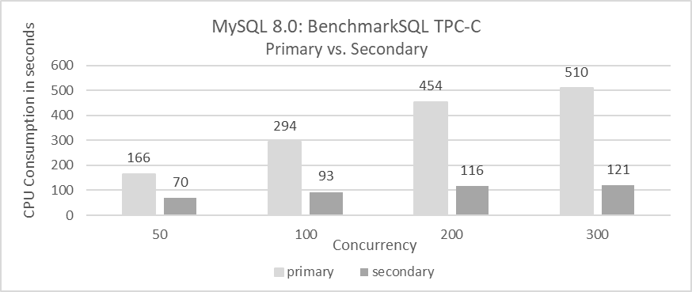

Figure 10-1. Secondary CPU consumption significantly lower than primary.

Based on the figure, the following conclusions can be drawn:

1. **CPU Consumption Comparison**:

   MySQL secondary replay consistently consumes significantly less CPU compared to MySQL primary, regardless of concurrency levels. This is due to:

   -   MySQL secondary replay involves only write operations, avoiding read operations.
   -   Event-based replay enhances execution efficiency.

2. **Concurrency Impact**:

   The CPU consumption difference between the primary and secondary is smaller at low concurrency but becomes more pronounced at high concurrency. 


The above statistics are based on standard TPC-C test results and do not include large transactions. The following figure compares time consumption during the TPC-C data loading process.

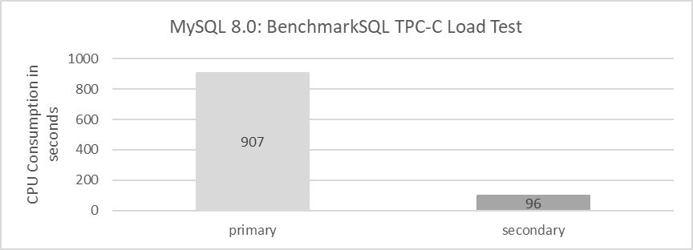

Figure 10-2. Secondary CPU usage is much lower than primary when processing large transactions.

From the figure, it is evident that CPU consumption on the MySQL primary is significantly higher than on the MySQL secondary. This indicates that for data loading, including processing large transactions, the MySQL secondary shows very high execution efficiency. In contrast, there may be further optimization opportunities for handling large transactions on the MySQL primary.

Next, let's examine the time required for the MySQL primary to load TPC-C data for 1000 warehouses. Specific statistical results are shown in the following figure:

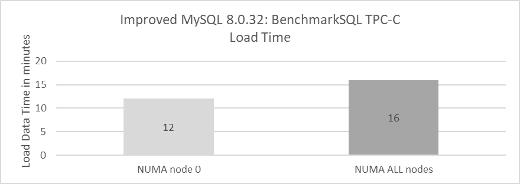

Figure 10-3. Binding MySQL primary to a single NUMA node improves BenchmarkSQL data loading speed.

From the figure, it can be inferred that there is considerable potential for improving NUMA compatibility in handling large transactions on the MySQL primary.

Based on the series of comparative tests, the following conclusions can be drawn:

1.  The efficiency of MySQL secondary replay significantly surpasses that of MySQL primary in handling user transactions.
2.  MySQL primary shows NUMA compatibility problems when handling large transactions.

### 10.1.4 The Theoretical Maximum Replay Speed of MySQL Secondary

The paper "Scalable Replay-Based Replication For Fast Databases" describes the replay barrier [18]:

A big challenge is that the secondary ensures consistency with the primary by replaying the database log in serial order. This replay is hard to perform concurrently, and so the secondary performance may not scale with the primary performance.

The transaction replay process on a MySQL secondary consists of two main stages:

1.  **Replay of Transaction Events:** This involves executing the transaction events received from the primary.
2.  **Commit:** This stage completes the transaction by committing the changes.

Please refer to the figure below for more details.

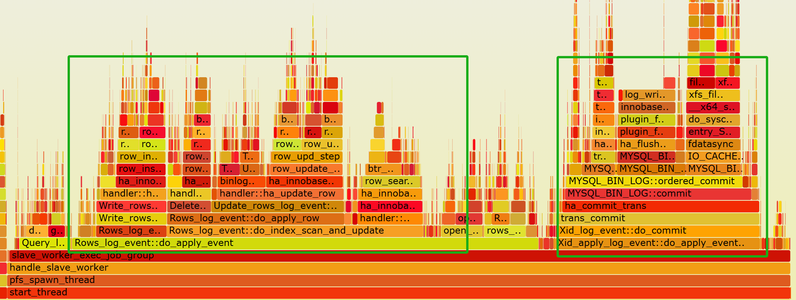

Figure 10-4. The transaction replay process on a MySQL secondary.

To ensure read consistency, it is crucial that commit operations on MySQL secondaries are executed sequentially. Specifically:

-   **Parallel Replay:** Concurrent transactions can be replayed in parallel if they do not conflict with each other.
-   **Sequential Commit:** During the commit phase, transactions must be committed in the order they were originally executed.

In terms of performance, the queue model for MySQL secondary replay can be simplified as shown in the figure below.

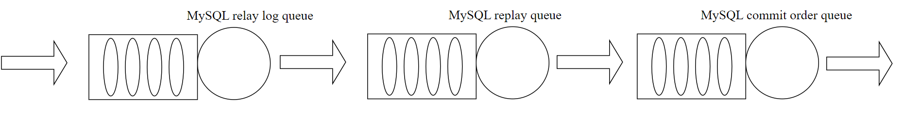

Figure 10-5. The queue model for MySQL secondary replay.

In MySQL secondary replay, multi-queue stages—such as for relay log flushing, transaction event replay (including reading, parsing, and queueing events), and commit operations—restrict the theoretical maximum replay speed. These serialized processes create inherent limits on how quickly the replay can proceed.

## 10.2 Root Cause Analysis of Slow MySQL Replay

### 10.2.1 The queue model for MySQL Secondary Replay

Here further refines the queue model for MySQL secondary replay, as follows:

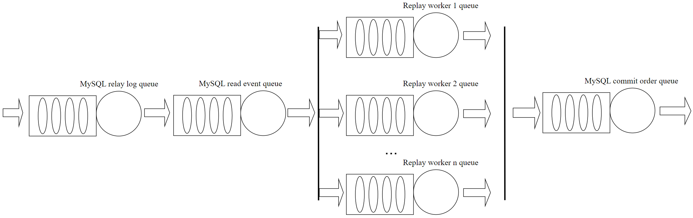

Figure 10-6. More detailed queue model for MySQL secondary replay.

MySQL secondary replay employs a staged model where different processing stages are interconnected via queues. This model is used consistently across asynchronous replication, semisynchronous replication, and Group Replication.

Initially, the MySQL secondary writes received transaction events to the relay log. The SQL thread then reads these events from the relay log and distributes them to respective worker queues.

Why are these processes of writing and reading relay log events necessary instead of being skipped? If the MySQL secondary cannot keep up with replaying events, the imbalance in the queue causes the queue size to grow larger. Using relay log events on disk leverages files as a queue, avoiding problems like Out-Of-Memory (OOM) that could occur with an in-memory queue.

The speed of the SQL thread needs to be flexible; if it's too slow, events cannot be replayed in time, and if it's too fast, unreplayed transactions may accumulate in the worker queues, increasing memory usage overhead. Therefore, flow control may be necessary when needed.

Within the worker queues, MySQL imposes limits on queue sizes, which are not conducive to replaying large transactions efficiently. With modern servers having larger memory capacities, limiting the worker queue size to 16,384 is often insufficient to meet replay demands. To keep up with the pace of the MySQL primary, increasing the worker queue size is essential; otherwise, queues can fill up quickly, causing the SQL thread to wait unnecessarily.

In terms of commit operations during MySQL secondary replay, committing according to the order of entry into the relay log lays the foundation for consistent read operations. This fundamentally distinguishes MySQL secondary replay from the execution of user SQL on the MySQL primary: the primary server needs to parse SQL, generate execution plans, and handle a series of read and write operations, which incurs significant CPU overhead but is not constrained by the queue model mentioned above. In contrast, MySQL secondary replay only needs to replay based on transaction events, resulting in lower CPU overhead, but it is subject to the constraints imposed by the queue model described above.

### 10.2.2 Bottleneck Analysis

In MySQL asynchronous replication, the secondary has two threads: the IO thread reads log entries from the primary and stores them on local disk, while the SQL thread reads the log from the local disk and replays the events. A single thread parses and executes the log, executing log events consecutively. When a row event is parsed, it includes operation types and row images, which are stored as raw bytes. The SQL thread must "unpack" these bytes into fields, requiring knowledge of the table schema before performing operations. This unpacking and examination of log events before sending them to multiple threads for replay is expensive and can become a bottleneck if handled by a single thread [18]. Specifically, unpacking row images consumes a significant amount of CPU resources for the SQL thread, severely constraining MySQL secondary replay performance.

For example, during Group Replication secondary replay, one of the main bottlenecks captured is the SQL thread, specifically seen in the *rpl_rca_sql-0* thread as shown in the figure below.

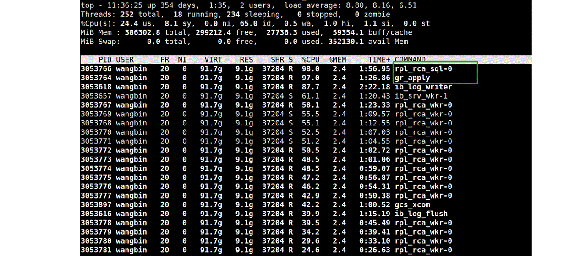

Figure 10-7. Top two CPU-consuming threads in Group Replication secondary replay.

Capturing performance data for the SQL thread and generating a flame graph can provide insights into where the CPU resources are being consumed. Please refer to the graph below for specifics.

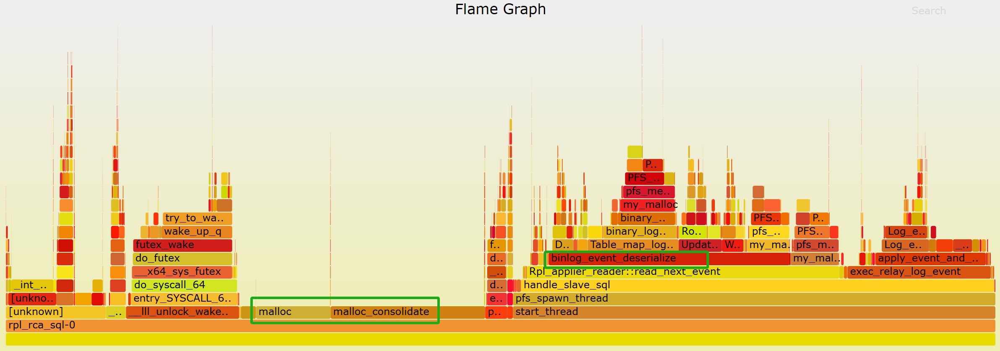

Figure 10-8. Bottlenecks identified in the flame graph for the SQL thread.

From the graph, it can be observed that the SQL thread encounters two major bottlenecks. One significant bottleneck is in the event parsing process (as seen in the *binlog_event_deserialize* function in the graph), and the other major bottleneck is in *malloc* calls.

After switching to jemalloc 4.5 as the memory allocation tool, not only did the MySQL secondary replay speed increase, but also the CPU overhead of the SQL thread itself decreased. Please refer to the figure below for details.

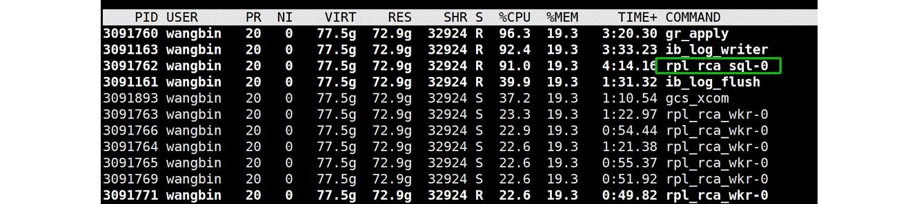

Figure 10-9. Reduced CPU overhead for the SQL thread with improved jemalloc.

Continuing with the new flame graph below, it's evident that the SQL thread has significantly reduced their overhead in terms of memory allocation.

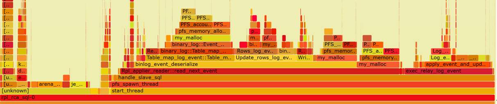

Figure 10-10. Memory bottleneck solved for SQL thread.

From the graph, it's clear that *binlog_event_deserialize* constitutes approximately 45% of the workload. The speed of event parsing directly affects the maximum replay speed. To address this bottleneck, parallelizing event parsing across multiple threads could significantly improve performance.

Once the *binlog_event_deserialize* bottleneck is addressed, the next step is to identify other potential bottlenecks impacting replay speed. Reviewing the relevant source code for the worker queue reveals that its size is limited to 16,384.

```c++
/*
  MTS load-balancing parameter.
  Max length of one MTS Worker queue. The value also determines the size
  of Relay_log_info::gaq (see @c slave_start_workers()).
  It can be set to any value in [1, ULONG_MAX - 1] range.
*/
const ulong mts_slave_worker_queue_len_max = 16384;
```

It's clear that the worker queue can hold a maximum of 16,384 events. While this capacity usually suffices for standard transaction volumes, it becomes inadequate for larger transactions. Extensive testing shows that this limitation significantly restricts replay speeds, especially for tasks like loading TPC-C warehouse data. The following code demonstrates that a full worker queue can block the execution of the SQL thread.

```c++
  // possible WQ overfill
  while (worker->running_status == Slave_worker::RUNNING && !thd->killed &&
         (ret = worker->jobs.en_queue(job_item)) ==
             Slave_jobs_queue::error_result) {
    thd->ENTER_COND(&worker->jobs_cond, &worker->jobs_lock,
                    &stage_replica_waiting_worker_queue, &old_stage);
    worker->jobs.overfill = true;
    worker->jobs.waited_overfill++;
    rli->mts_wq_overfill_cnt++;
    // wait if worker queue is full
    mysql_cond_wait(&worker->jobs_cond, &worker->jobs_lock);
    mysql_mutex_unlock(&worker->jobs_lock);
    thd->EXIT_COND(&old_stage);
    mysql_mutex_lock(&worker->jobs_lock);
  }
```

Large transactions can quickly fill up the worker queue, causing the SQL thread to remain idle and miss the opportunity to replay other transactions efficiently.

Not only does the SQL thread block when the worker queue is full, but it also waits if a transaction pending replay depends on a prior transaction that hasn't finished replaying. For details, see the specific code below:

```c++
bool Mts_submode_logical_clock::wait_for_last_committed_trx(
    Relay_log_info *rli, longlong last_committed_arg) {
  THD *thd = rli->info_thd;
  ...
  if ((!rli->info_thd->killed && !is_error) &&
      !clock_leq(last_committed_arg, get_lwm_timestamp(rli, true))) {
    PSI_stage_info old_stage;
    struct timespec ts[2];
    set_timespec_nsec(&ts[0], 0);
    assert(rli->gaq->get_length() >= 2);  // there's someone to wait
    thd->ENTER_COND(&rli->logical_clock_cond, &rli->mts_gaq_LOCK,
                    &stage_worker_waiting_for_commit_parent, &old_stage);
    do {
      // wait if LWM is less than last committed
      mysql_cond_wait(&rli->logical_clock_cond, &rli->mts_gaq_LOCK);
    } while ((!rli->info_thd->killed && !is_error) &&
             !clock_leq(last_committed_arg, estimate_lwm_timestamp()));
    min_waited_timestamp.store(SEQ_UNINIT);  // reset waiting flag
    mysql_mutex_unlock(&rli->mts_gaq_LOCK);
    thd->EXIT_COND(&old_stage);
    set_timespec_nsec(&ts[1], 0);
    rli->mts_total_wait_overlap += diff_timespec(&ts[1], &ts[0]);
  } else {
    min_waited_timestamp.store(SEQ_UNINIT);
    mysql_mutex_unlock(&rli->mts_gaq_LOCK);
  }
  return rli->info_thd->killed || is_error;
}
```

The code describes a mechanism where the SQL thread waits if the recorded low-water-mark (LWM)—which signifies that a transaction and all prior transactions have been committed—is less than the last committed value of the transaction being replayed. In MySQL, it is the SQL thread that waits, rather than the worker threads. This waiting mechanism significantly restricts the replay speed.

Finally, let's examine the problems related to MySQL secondary replay in a NUMA environment. The following figure shows the test results of MySQL secondary replay:

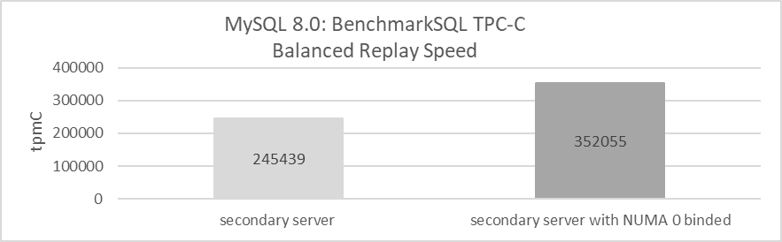

Figure 10-11. Binding MySQL secondary to a single NUMA node improves replay speed.

Utilizing all NUMA nodes achieves a balanced replay speed of approximately 245,000 tpmC. This means that if the throughput of the MySQL primary exceeds this value, the MySQL secondary generally cannot keep pace.

In contrast, when the MySQL secondary is bound to NUMA node 0, the balanced replay speed increases to 352,000 tpmC, a 43.7% improvement. This improvement is attributed to the significant global latch contention observed during MySQL secondary replay. In a NUMA environment, this contention leads to frequent cache migration between different NUMA nodes, reducing replay efficiency. Binding the MySQL secondary to NUMA node 0 mitigates this inefficiency by avoiding cache migration between NUMA nodes, resulting in a substantial performance improvement.

## 10.3 MySQL Secondary Replay Optimization

### 10.3.1 Parallelization of Transaction Event Parsing

Here, a new model for splitting the SQL thread is implemented.

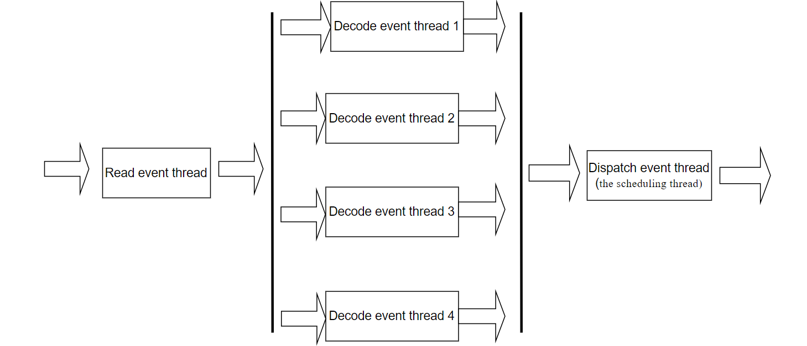

Figure 10-12. A new model for splitting the SQL thread.

In MySQL, the SQL thread for secondary replay is divided into six threads: one for reading events, four for decoding events, and one for handling scheduling (the scheduling thread). These threads are connected through queues. To manage excessive memory usage, flow control is applied to the event-reading thread when the queue size becomes too large.

Below is the *'top'* screenshot of the MySQL secondary running process.

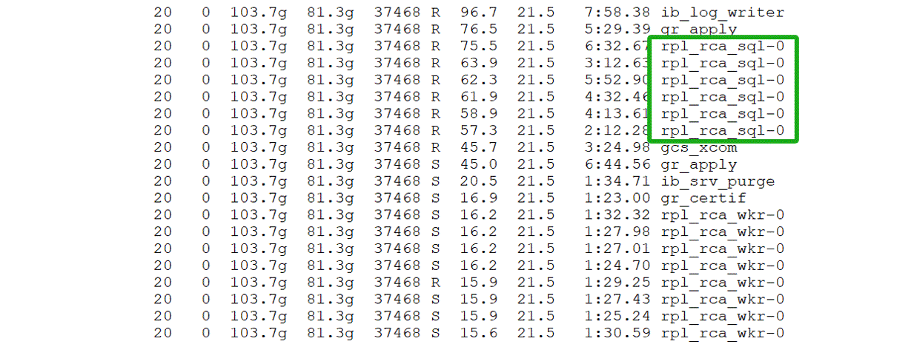

Figure 10-13. SQL thread appears as six separate threads in *'top'* display.

By splitting the SQL thread, the problem of limited processing capacity in a single thread has been solved, effectively eliminating the bottleneck of event parsing.

### 10.3.2 Improving Parallel Replay of Large Transactions

For large transaction replays, the main problem lies in the worker queue being too small, causing frequent waiting for the SQL thread.

To address this problem, a larger queue size can be set, as demonstrated in the code below.

```c++
/*
  MTS load-ballancing parameter.
  Max length of one MTS Worker queue. The value also determines the size
  of Relay_log_info::gaq (see @c slave_start_workers()).
  It can be set to any value in [1, ULONG_MAX - 1] range.
*/
const ulong mts_slave_worker_queue_len_max = 16384 << 6;
```

Increasing the worker queue size by 64 times to 1,048,576 transaction events accommodates large transactions with many events, allowing MySQL secondary to fully utilize its capacity for replaying these large transactions. However, this increase may raise concerns about memory usage. The following figure illustrates the memory consumption of MySQL secondary processes with different worker queue sizes and varying numbers of workers. The horizontal axis represents the number of workers, while the vertical axis shows the actual memory usage of the MySQL secondary process.

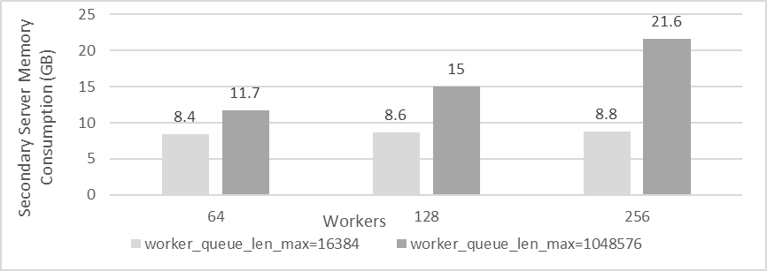

Figure 10-14. Memory consumption of MySQL secondary processes with different worker queue sizes and varying numbers of workers.

From the figure, it's evident that the actual memory consumption of MySQL secondary is influenced both by the *worker_queue_len_max* and the number of workers. On high-end machines, the additional memory usage may not be a major concern. However, on lower-end machines, reducing the number of workers can help manage memory consumption more effectively.

Currently, MySQL does not offer a configuration option to adjust the *worker_queue_len_max* parameter. Nonetheless, on high-end machines, this parameter plays a crucial role in improving the replay speed of large transactions.

### 10.3.3 Optimizing the Scheduling Thread Mechanism

If two transactions occurring close together in time modify the same data in MySQL, they can create dependencies during replay on the secondary. Specifically, the *last_committed* value of the latter transaction might match the *sequence_number* of the preceding one. During MySQL secondary replay, if a later transaction depends on a preceding one that hasn't finished replaying yet, the scheduling thread will block itself. This approach is inefficient because the worker replay thread should ideally handle such waits, not the scheduling thread. The scheduling thread itself has plenty of other tasks to handle, and there's no guarantee that the subsequent transaction couldn't be replayed promptly.

To better understand this problem, consider the following case:

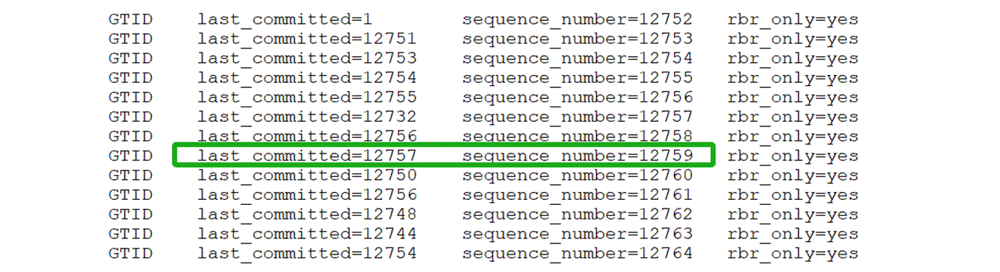

Figure 10-15. Typical examples of *sequence_number* and *last_committed*.

Assuming the MySQL secondary has completed transaction 12756 (*LWM*=12756), when the scheduling thread schedules transaction 12759 (highlighted in the green box in the figure), it finds that the dependent transaction 12757 has not yet completed replay. As a result, the scheduling thread blocks itself until transaction 12757 finishes. Meanwhile, transactions 12760, 12761, 12762, 12763, and 12764 could be allocated to workers for replay. The waiting for transaction 12757 could be handled by the worker replay thread, allowing the scheduling thread to continue with other tasks. This presents an opportunity for optimization.

The following figure illustrates TPC-C tests conducted with BenchmarkSQL at various concurrency levels to evaluate whether the MySQL secondary can match the MySQL primary's speed. The horizontal axis represents the concurrency level, and the vertical axis shows tpmC values. Light gray regions indicate that the MySQL secondary keeps pace with the MySQL primary, while Dark gray regions signify that it does not.

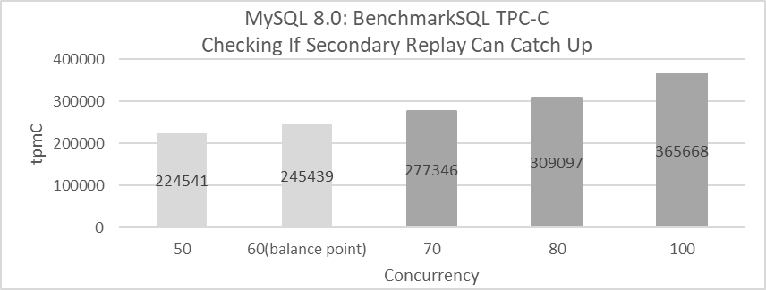

Figure 10-16. If the processing speed of the MySQL primary exceeds the balanced replay speed, the secondaries may not keep up.

From the figure, it's evident that when concurrency reaches 70, the MySQL secondary falls behind the MySQL primary's processing speed. This inefficiency is primarily due to the scheduling thread waiting unnecessarily, which disrupts the normal replay process. The MySQL secondary can keep pace with the primary as long as the throughput is below 245,439 tpmC. However, once this threshold is exceeded, the MySQL secondary struggles to match the primary's speed. Essentially, the MySQL secondary replay cannot support high throughput effectively.

To address this, allowing workers to handle the waiting for **last_committed** transactions independently can completely relieve the scheduling thread. This adjustment provides a solid foundation for future improvements in MySQL secondary replay performance.

### 10.3.4 Effect of Memory Allocation Tools on Replay Performance

Utilizing advanced memory allocation tools can improve the replay speed of MySQL secondaries. The figure below shows the impact of two jemalloc versions on MySQL secondary replay performance under the x86 architecture.

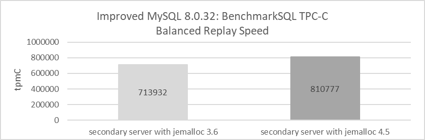

Figure 10-17. Achieve better replay speed with jemalloc 4.5.

From the figure, it is evident that using jemalloc 4.5 markedly improves the replay speed of MySQL secondaries. Under the same conditions, jemalloc 3.6 achieves a balanced replay speed of just over 710,000 tpmC, while jemalloc 4.5 reaches 810,000 tpmC, representing a 14% improvement in performance.

### 10.3.5 Addressing Unfriendliness Problems in NUMA Environments

In a scenario where NUMA is disabled at the BIOS level, the efficiency of the MySQL secondary replay process is evaluated. Refer to the figure below for details.

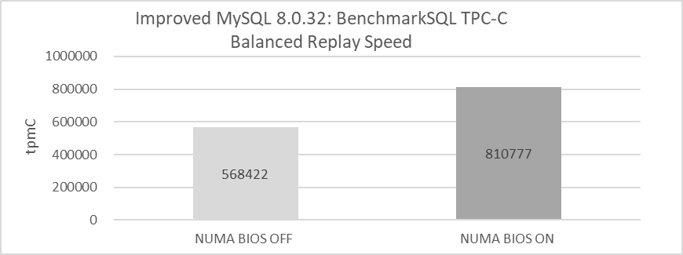

Figure 10-18. Comparison of balanced replay speed before and after disabling NUMA in the BIOS.

Disabling NUMA in the BIOS leads to a significant decrease in replay speed. While this change affects memory allocation methods, it does not alter the underlying NUMA hardware architecture.

The decision to disable NUMA should be made based on a thorough analysis. Testing on x86 architecture shows that disabling NUMA negatively impacts MySQL secondary replay but may benefit MySQL primary operations. Further investigation into NUMA's incompatibility with MySQL secondary replay could reveal deeper problems within MySQL itself.

Based on MySQL's Performance Schema, statistics on latch operations are gathered. See the results in the following figure:

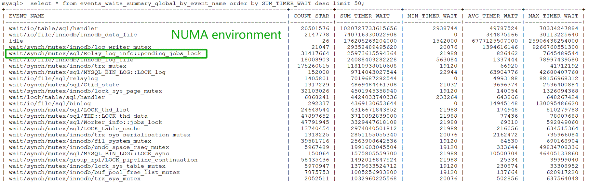

Figure 10-19. The bottleneck of pending_jobs_lock has been exposed in the Performance Schema.

From the figure, it can be seen that in a NUMA environment, *Relay_log_info::pending_jobs_lock* ranks fifth in importance in relation to replay. Binding the MySQL secondary instance to NUMA node 0, the test evaluates whether the Performance Schema statistics change under an SMP environment. The specific test results are shown in the following figure:

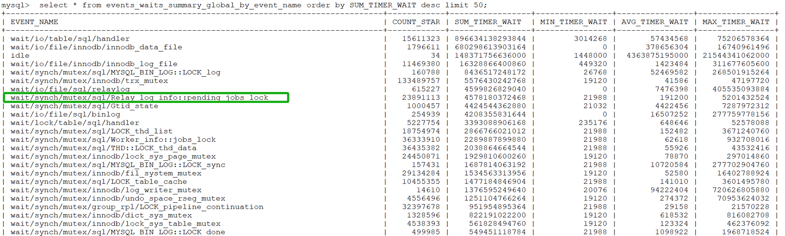

Figure 10-20. The bottleneck of pending_jobs_lock has been alleviated in an SMP environment.

From the figure, it can be observed that *Relay_log_info::pending_jobs_lock* has moved to the eighth position, indicating that under the scenario of binding to NUMA node 0, the contention related to *Relay_log_info::pending_jobs_lock* has been alleviated.

In the MySQL source code, the relevant code for *pending_jobs_lock* is frequently invoked in two places. The first occurrence is in the *remove_item_from_jobs* function, as illustrated in the code snippet below:

```c++
/**
  Remove a job item from the given workers job queue. It also updates related
  status.
  param[in] job_item The job item will be removed
  param[in] worker   The worker which job_item belongs to.
  param[in] rli      slave's relay log info object.
 */
static void remove_item_from_jobs(slave_job_item *job_item,
                                  Slave_worker *worker, Relay_log_info *rli) {
  Log_event *ev = job_item->data;
  mysql_mutex_lock(&worker->jobs_lock);
  worker->jobs.de_queue(job_item);
  /* possible overfill */
  if (worker->jobs.get_length() == worker->jobs.capacity - 1 &&
      worker->jobs.overfill == true) {
    worker->jobs.overfill = false;
    // todo: worker->hungry_cnt++;
    mysql_cond_signal(&worker->jobs_cond);
  }
  mysql_mutex_unlock(&worker->jobs_lock);
  /* statistics */
  const auto jobs_length = worker->jobs.get_length();
  /* todo: convert to rwlock/atomic write */
  mysql_mutex_lock(&rli->pending_jobs_lock);
  rli->pending_jobs--;
  rli->mts_pending_jobs_size -= ev->common_header->data_written;
  assert(rli->mts_pending_jobs_size < rli->mts_pending_jobs_size_max);
  ...
```

The other is in the **append_item_to_jobs** function, as shown in the code snippet below:

```c++
/**
   Coordinator enqueues a job item into a Worker private queue.
   @param job_item  a pointer to struct carrying a reference to an event
   @param worker    a pointer to the assigned Worker struct
   @param rli       a pointer to Relay_log_info of Coordinator
   @return false Success.
           true  Thread killed or worker stopped while waiting for
                 successful enqueue.
*/
bool append_item_to_jobs(slave_job_item *job_item, Slave_worker *worker,
                         Relay_log_info *rli) {
  THD *thd = rli->info_thd;
  size_t ret = Slave_jobs_queue::error_result;
  size_t ev_size = job_item->data->common_header->data_written;
  ulonglong new_pend_size;
  PSI_stage_info old_stage;
  assert(thd == current_thd);
  mysql_mutex_lock(&rli->pending_jobs_lock);
  new_pend_size = rli->mts_pending_jobs_size + ev_size;
  bool big_event = (ev_size > rli->mts_pending_jobs_size_max);
  ...
```

The *remove_item_from_jobs* and *append_item_to_jobs* functions primarily utilize the *pending_jobs_lock* latch for managing job queues. The *append_item_to_jobs* function, executed by the scheduling thread, is called once per event to enqueue it into the worker queue. In contrast, *remove_item_from_jobs*, executed by worker threads, is called once per event removal.

In high-throughput scenarios, the scheduling thread frequently calls *append_item_to_jobs* to enqueue events, while numerous worker threads concurrently call *remove_item_from_jobs* to dequeue them. This leads to significant latch contention, as both functions involve acquiring and releasing the latch. With event processing rates reaching several hundred thousand per second, latch contention between the scheduling thread and worker threads may become severe.

Frequent acquisition and release of latches cause context switches. In NUMA environments, these context switches lead to cache migration between NUMA nodes, resulting in decreased replay efficiency.

After addressing the latch bottleneck related to *pending_jobs_lock* and applying the configuration parameters of the online MySQL secondary, the focus shifts to evaluating whether disabling NUMA in the BIOS improves MySQL secondary replay performance. The following figure compares the balanced replay speeds of MySQL secondaries under different NUMA configurations.

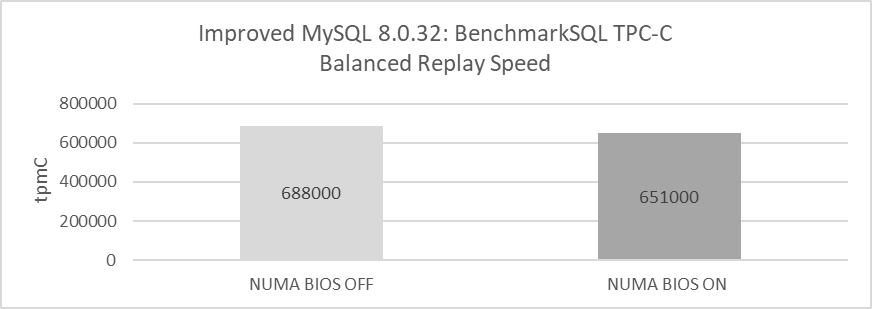

Figure 10-21. Disabling NUMA in the BIOS improves MySQL secondary replay speed by addressing the NUMA incompatibility bottleneck.

From the figure, it is evident that after addressing the NUMA incompatibility bottleneck, disabling NUMA in the BIOS on x86 architecture improves the speed of MySQL secondary replay.

### 10.3.6 Impact of 'Dual One' on Replay Performance

'Dual one' refers to the real-time disk flushing of binlog and redo logs, a critical technology for MySQL crash recovery. Testing revealed that 'dual one' significantly affects MySQL secondary replay speeds. The following figure shows that, under identical conditions, disabling 'dual one' increased the balanced replay speed to 810,000 tpmC, while enabling it reduced the replay speed to approximately 700,000 tpmC. Disabling 'dual one' thus led to a 15.7% improvement in replay speed.


Figure 10-22. Achieve better replay speed with 'dual one' closed.

### 10.3.7 Effect of Binlog Row Image Format on Replay Performance

Reducing the size of the binlog theoretically helps improve MySQL replay speed. The following figure shows the comparison between using *binlog_row_image=minimal* and *binlog_row_image=full* in terms of balanced replay speed:

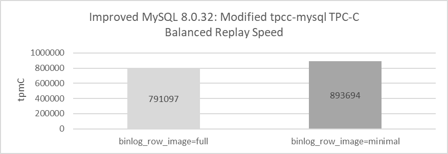

Figure 10-23. Achieve better replay speed with binlog_row_image=minimal.

When using full mode for binlog, MySQL achieves a balanced replay speed of just over 790,000 tpmC. Switching to minimal mode, however, increases this speed to over 890,000 tpmC, representing a significant 13% improvement. This improvement highlights that setting *binlog_row_image=minimal*—which substantially reduces the binlog size—boosts the replay speed of MySQL secondaries. However, it's important to note that this setting may also pose a risk of incomplete data restoration in certain scenarios.

### 10.3.8 Impact of Performance Schema on Replay Performance

Enabling Performance Schema significantly impacts the replay speed of MySQL secondaries due to the extensive interaction with large amounts of memory involved in secondary replay. Here's the flame graph captured after enabling Performance Schema.

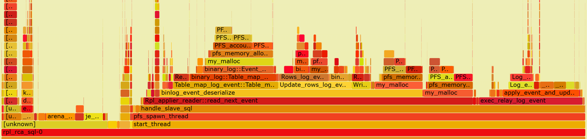

Figure 10-24. Substantial overhead from my_malloc calling PFS-related functions.

From the graph, it is evident that the overhead associated with my_malloc calling PFS-related functions is substantial and distributed across multiple areas, highlighting a significant bottleneck. Extensive testing results indicate that enabling Performance Schema has a much greater impact on MySQL secondary replay compared to MySQL primary execution. For more detailed information, refer to Section 11.5.5.

## 10.4 Exploration of Maximum Replay Speed in Group Replication

Using the modified tpcc-mysql, high throughput tests can identify when Group Replication secondaries fall behind MySQL primary. The following figure presents detailed test results. The test setup includes: disabling 'dual one' using jemalloc 4.5, deploying MySQL secondaries and primary on separate machines, setting binlog row image format to minimal, and running the test for 300 seconds.

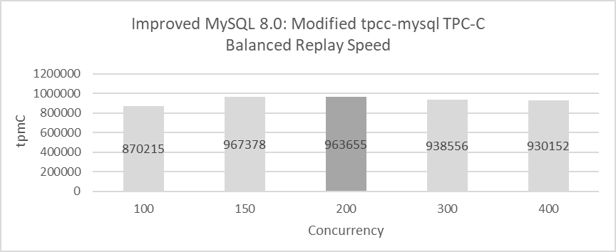

Figure 10-25. Maximum replay speed in Group Replication.

The figure illustrates the throughput of the MySQL primary at concurrency levels of 100, 150, 200, 300, and 400. In the figure, light gray indicates that the MySQL primary and secondaries are synchronized in speed, while dark gray signifies a slight lag of the MySQL secondaries behind the MySQL primary. Except for the case at 200 concurrency, where a 2-second delay was observed, the MySQL secondaries generally keep pace with the primary.

Notably, maximum replay speed is directly correlated with concurrency. At 150 concurrency, throughput is high with nearly zero delay, whereas at 200 concurrency, throughput is slightly reduced with a 2-second delay.

With better hardware, further improvements in maximum replay speed might be possible, but the test results are already very close to the achievable maximum.

[Next](Part4.md)
