# Chapter 11: Performance Tuning

This chapter primarily addresses methods for improving MySQL application performance without altering the MySQL source code.

## 11.1 PGO

Profile-guided optimization (PGO) typically improves program execution efficiency. The following figure illustrates how PGO improves the throughput of a standalone MySQL instance under various concurrency levels, following the resolution of MySQL MVCC ReadView scalability problems.

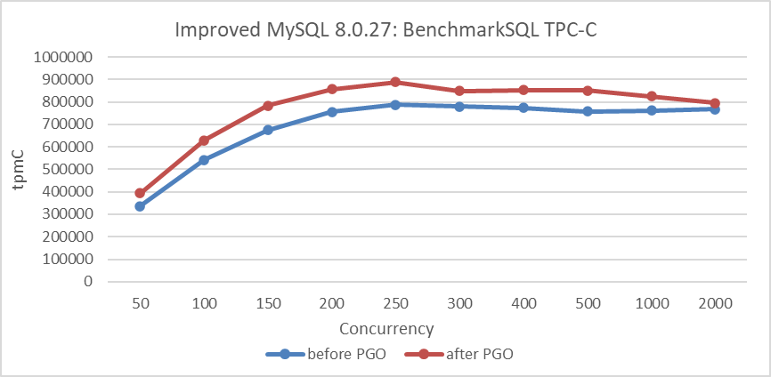

Figure 11-1. Impact of PGO after solving MVCC ReadView scalability problems.

From the figure, it is evident that PGO has a notable impact.

For MySQL 8.0.27 with PGO, throughput decreases under high concurrency conditions. The specific details are shown in the figure below:

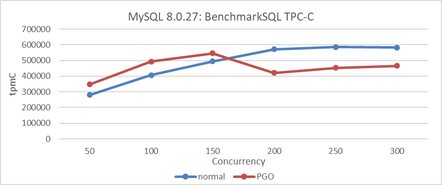

Figure 11-2. Performance comparison tests before and after using PGO in MySQL 8.0.27.

The test results above indicate that PGO for MySQL's improvement requires addressing scalability problems before its full potential can be realized. It should be noted that both comparative tests above were conducted in mainstream NUMA environments. When MySQL is bound to a single NUMA node, creating an SMP environment, the following figure shows the relationship between TPC-C throughput and concurrency levels before and after PGO.

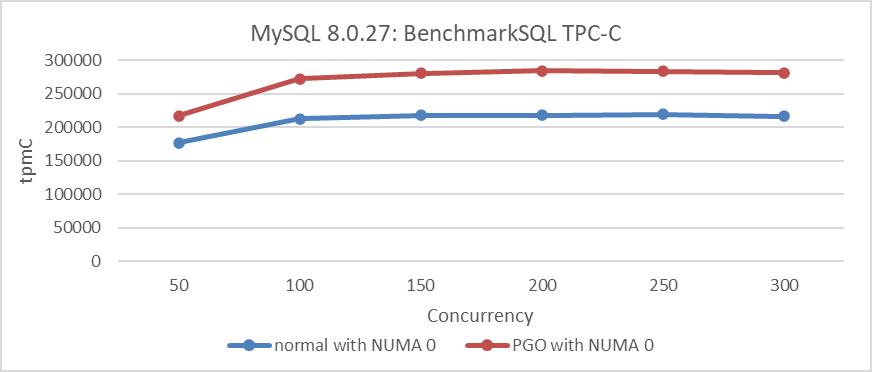

Figure 11-3. Performance comparison tests before and after using PGO in MySQL 8.0.27 under SMP.

From the figure, it can be seen that PGO consistently improves throughput in SMP environments, without decreasing as concurrency levels increase. The following figure compares the performance improvement of PGO between NUMA and SMP environments.

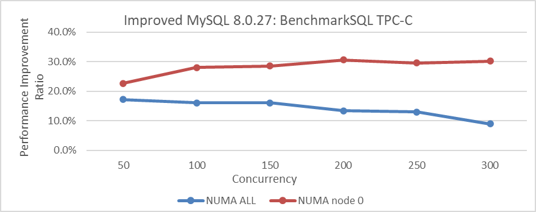

Figure 11-4. Performance of PGO optimization in different environments.

From the figure, it is evident that PGO achieves a maximum performance improvement of up to 30% in SMP environments, whereas in NUMA environments, the performance improvement decreases as concurrency increases. This suggests that PGO has greater potential in SMP environments.

Continuing the analysis, the performance of PGO in a Group Replication cluster environment compared to a single MySQL instance is examined. The following diagram depicts a simplified queue model of Group Replication.

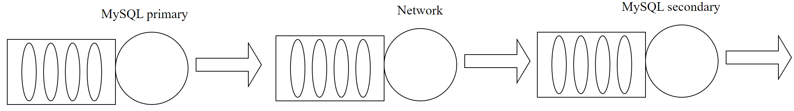

Figure 11-5. A simplified queue model of Group Replication.

Because the network portion cannot be optimized by PGO, the MySQL primary consumes a lower proportion of time compared to a single MySQL instance. According to Amdahl's Law, the performance gains from PGO will be less pronounced compared to those of a standalone MySQL instance. Generally, as network latency increases, the improvement from PGO tends to diminish.

The following figure compares the throughput improvement of a standalone MySQL instance and Group Replication using PGO.

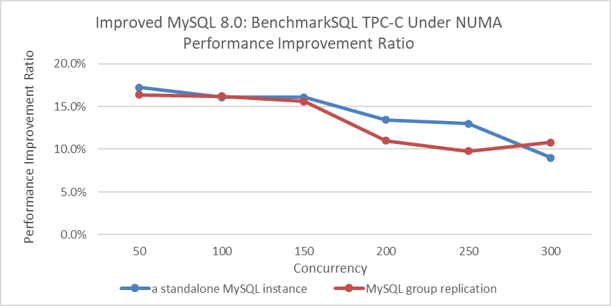

Figure 11-6. PGO Performance Improvement in Group Replication vs. Standalone MySQL.

From the figure, it can be observed that the performance improvement from PGO in a Group Replication cluster environment is generally less than that of a standalone MySQL instance.

In conclusion, PGO can be summarized as follows:

1.  For MySQL, PGO is a worthwhile optimization that theoretically improves performance comprehensively, especially in SMP environments.
2.  In NUMA environments, addressing scalability problems is necessary to achieve significant benefits from PGO.
3.  PGO is less effective in a Group Replication cluster compared to a standalone MySQL instance.

## 11.2 Minimize Network Interactions

To improve MySQL application performance without compromising the correctness of TPC-C testing, modify the SQL interaction method to reduce the number of network interactions between the client and MySQL. This optimization indirectly improves performance.

The following example uses an optimized tpcc-mysql testing tool to determine the maximum throughput supported by Group Replication under specific software and hardware conditions.

```
 [warehouse]: 200
[connection]: 200
    [rampup]: 0 (sec.)
   [measure]: 60 (sec.)
RAMP-UP TIME.(0 sec.)
MEASURING START.
  10, trx: 179372, 95%: 7.134, 99%: 9.097, max_rt: 16.857, 178944|16.256, 17941|5.395, 17932|25.313, 17943|14.180
  20, trx: 181215, 95%: 7.216, 99%: 9.228, max_rt: 20.587, 180703|433.405, 18123|4.086, 18122|29.192, 18124|4.922
  30, trx: 180596, 95%: 7.410, 99%: 9.463, max_rt: 16.930, 180110|16.705, 18061|3.146, 18056|25.658, 18060|7.392
  40, trx: 179032, 95%: 7.594, 99%: 10.575, max_rt: 18.047, 178513|16.862, 17906|3.861, 17900|27.482, 17904|5.724
  50, trx: 173856, 95%: 8.199, 99%: 12.705, max_rt: 31.777, 173412|30.990, 17388|9.501, 17388|37.472, 17385|5.538
  60, trx: 171950, 95%: 8.499, 99%: 13.721, max_rt: 31.584, 171546|31.808, 17200|9.185, 17188|35.098, 17202|13.781
STOPPING THREADS........................................................................................................................................................................................................
<Raw Results>
  [0] sc:481189 lt:584832  rt:0  fl:0 avg_rt: 5.3 (5)
  [1] sc:915412 lt:147816  rt:0  fl:0 avg_rt: 4.4 (5)
  [2] sc:106614 lt:5  rt:0  fl:0 avg_rt: 0.8 (5)
  [3] sc:106586 lt:0  rt:0  fl:0 avg_rt: 11.9 (80)
  [4] sc:106619 lt:0  rt:0  fl:0 avg_rt: 2.1 (20)
 in 60 sec.
<Raw Results2(sum ver.)>
  [0] sc:481239  lt:585014  rt:0  fl:0 
  [1] sc:918008  lt:148245  rt:0  fl:0 
  [2] sc:106622  lt:5  rt:0  fl:0 
  [3] sc:106622  lt:0  rt:0  fl:0 
  [4] sc:106628  lt:0  rt:0  fl:0 
<Constraint Check> (all must be [OK])
 [transaction percentage]
        Payment: 43.41% (>=43.0%) [OK]
   Order-Status: 4.35% (>= 4.0%) [OK]
       Delivery: 4.35% (>= 4.0%) [OK]
    Stock-Level: 4.35% (>= 4.0%) [OK]
 [response time (at least 90% passed)]
      New-Order: 45.14%  [NG] *
        Payment: 86.10%  [NG] *
   Order-Status: 100.00%  [OK]
       Delivery: 100.00%  [OK]
    Stock-Level: 100.00%  [OK]
<TpmC>
                 1066021.000 TpmC   
```

The data indicates that, in the given software and hardware testing environment, Group Replication achieved a peak throughput of 1.066 million tpmC, setting a new record.

This highlights that reducing the number of network interactions with MySQL during application development can significantly improve performance.

## 11.3 Utilize Advanced Memory Allocation Tools

MySQL defaults to using the jemalloc memory allocation tool, specifically version 3.6. Test data indicates that jemalloc 3.6 is not optimal for performance. The following figure shows the throughput improvements of jemalloc 4.5 compared to jemalloc 3.6 on x86 architecture.

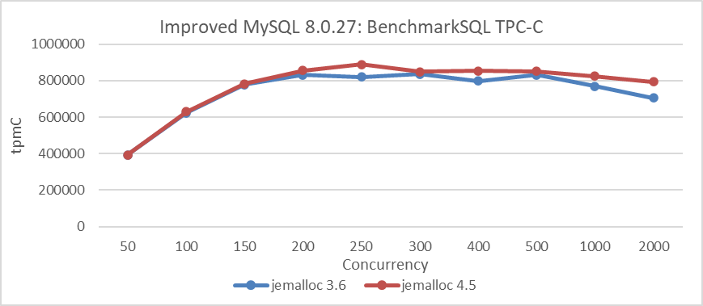

Figure 11-7. Jemalloc 4.5 outperforms jemalloc 3.6 in terms of performance.

From the figure, it is evident that jemalloc 4.5 outperforms jemalloc 3.6 in terms of performance.

For MySQL secondary replay, please refer to the figure below:

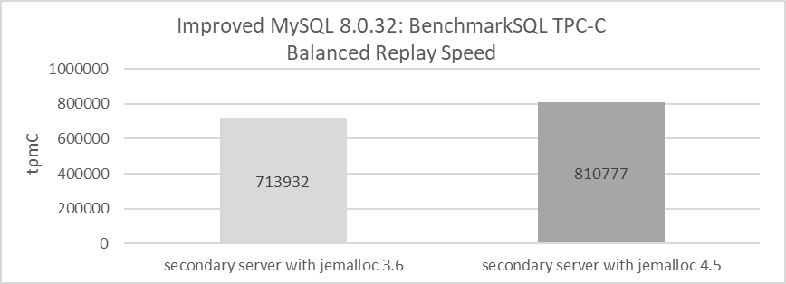

Figure 11-8. Achieve better replay speed with jemalloc 4.5.

Tests with optimized MySQL replay showed a notable difference between jemalloc 3.6 and jemalloc 4.5. The figure illustrates a significant improvement in balanced replay speed with jemalloc 4.5.

An effective memory allocation tool not only boosts MySQL primary server performance but also improves the replay speed of MySQL secondaries.

## 11.4 Indexes and Performance

Section 4.10.6 provides detailed information on this topic.

## 11.5 Key MySQL Parameters Influencing Performance

Databases feature numerous tunable system parameters that control crucial aspects such as memory allocation, I/O management, and logging. The impact of these parameters can vary greatly depending on the configuration, ranging from significant to minimal effects. This variability is due to the multitude of factors influencing MySQL performance, which complicates the prediction of performance outcomes. However, it is possible to identify specific factors that lead to abnormal throughput. The following sections detail commonly used parameters that affect performance.

### 11.5.1 Impact of 'Dual One' on Performance

The 'dual one' configuration parameters include two parameters: *sync_binlog* and *innodb_flush_log_at_trx_commit*.

The *sync_binlog* parameter is described as follows:

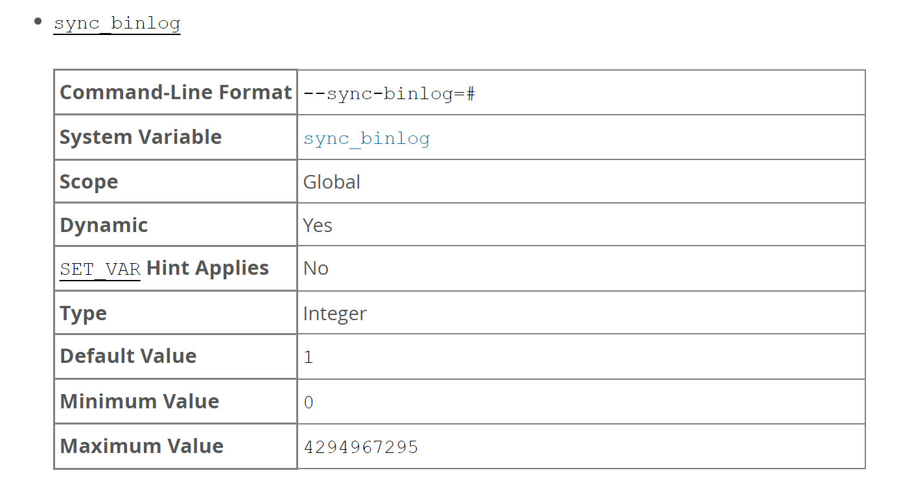

The following configuration controls how often the MySQL Server synchronizes the binary log to disk.

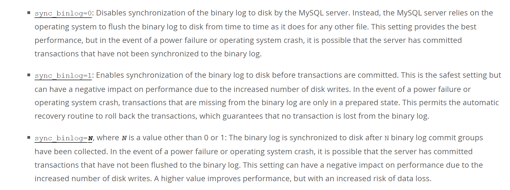

The *innodb_flush_log_at_trx_commit* parameter is described as follows:

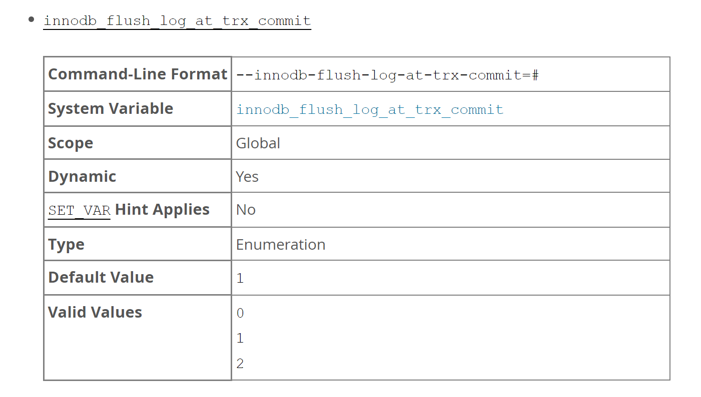

The following configuration balances strict ACID compliance for commit operations with the higher performance achievable by rearranging and batching commit-related I/O operations. Adjusting the default value can improve performance but may result in transaction loss in the event of a crash.


It's important to note that with the improved scalability in MySQL 8.0 and optimizations in redo log handling, the effect of disabling 'dual one' settings on throughput for MySQL primary servers in high-concurrency test scenarios has diminished.

Comparative tests were first conducted using MySQL 8.0.27. The figure below illustrates the relationship between throughput and concurrency with 'dual one' enabled and disabled.

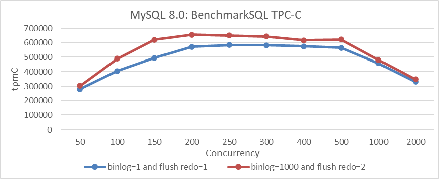

Figure 11-9. Achieve better performance with 'dual one' disabled.

Based on the figure, it is evident that with MySQL 8.0.27, disabling 'dual one' significantly improves throughput. However, this performance gain diminishes as concurrency increases.

Based on the improved version of MySQL with PGO, the performance improvement after disabling 'dual one' is less significant, as shown in the figure below:

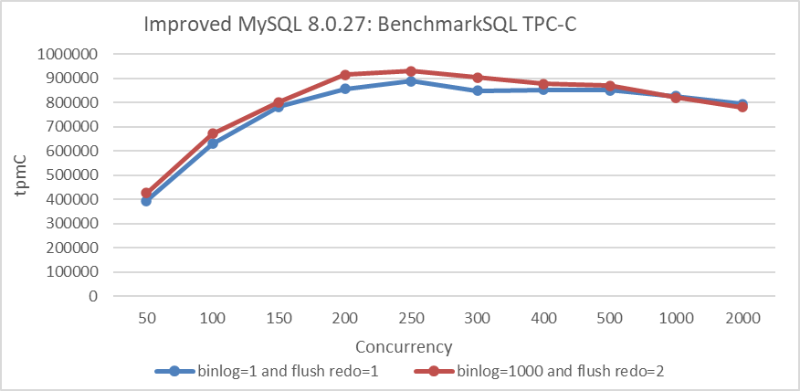

Figure 11-10. Less performance gain with 'dual one' disabled after addressing scalability bottlenecks in MySQL.

It can also be observed that the extent of performance improvement varies with throughput and is not constant. As scalability bottlenecks in MySQL are addressed, the impact of 'dual one' diminishes.

The impact of 'dual one' on MySQL secondary replay is more pronounced due to mechanisms such as the re*plica_preserve_commit_order* queueing. The figure below compares the balanced replay speeds of MySQL secondaries before and after disabling 'dual one' using an optimized MySQL version.

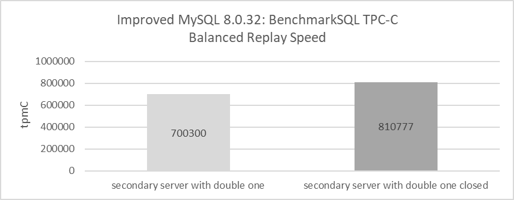

Figure 11-11. Achieve better replay speed with 'dual one' closed.

Under equivalent conditions, disabling  'dual one' achieved a balanced replay speed of 810,000 tpmC for MySQL secondaries, while enabling 'dual one' reduced this speed to approximately 700,000 tpmC. Thus, disabling 'dual one' significantly improves the replay speed of MySQL secondaries.

### 11.5.2 Performance Effects of Disabling Binlog

With binary logging enabled, the server logs all statements that modify data to the binary log, which is utilized for backup and replication purposes. Disabling binlog can theoretically eliminate queue wait times, thereby improving throughput and reducing response times.

The figure below compares TPC-C throughput at identical concurrency levels before and after disabling binlog, using BenchmarkSQL.

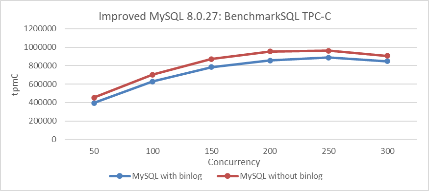

Figure 11-12. Achieve better performance with binlog disabled

From the figure, it is evident that disabling binlog noticeably impacts performance.

### 11.5.3 Understanding the Spin Delay Parameter's Effect on Performance

Contending threads must wait for a lock when it's unavailable. Several waiting policies exist, with unbounded spinning (or busy waiting) being the simplest. In this approach, threads repeatedly check a memory location until the value changes. This method consumes resources and may lead to preemption in an oversubscribed system with more threads than CPUs [3].

**Advantages of Spinning:**

-   In an unloaded system, spinning offers high performance with minimal overhead, as it avoids OS coordination and incurs only a few cache miss latencies per lock handoff. On chip multiprocessors with shared caches, lock acquisition and release latencies can be as low as 150 ns.

**Disadvantages of Spinning:**

-   When the system is loaded, spinning can degrade performance as it reduces the number of processors available for useful work, leading to suboptimal performance when runnable threads exceed hardware contexts. Additionally, since spinning isn't coordinated with the OS, it doesn't account for lock holders or spinners in scheduling decisions.

The spin delay parameter helps address NUMA (Non-Uniform Memory Access) compatibility problems. Generally, better MySQL scalability reduces the impact of the spin delay parameter. Conversely, in cases of poor scalability, the spin delay parameter noticeably affects performance, although its effectiveness has an upper limit.

Based on the MySQL 8.0.21 version with lock-sys optimization, the figure below compares TPC-C throughput at various concurrency levels.

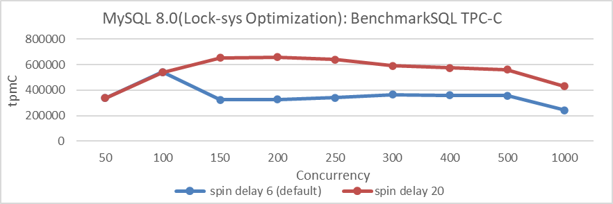

Figure 11-13. Achieve better performance with spin delay 20 in MySQL 8.0.21.

The figure shows that setting *spin_delay=20* significantly mitigates the scalability problems of MySQL 8.0.21 with lock-sys optimization. However, in high-concurrency scenarios, the spin delay parameter can substantially increase CPU overhead. According to the paper "Locking Made Easy", simple spinlocks are very efficient under low contention but do not scale well [63].

Further analysis of the spin delay parameter in MySQL versions prior to MVCC ReadView optimization, with PGO compilation, is detailed in the following figure.


Figure 11-14. Achieve better performance with spin delay 20 before MVCC ReadView optimization.

From the figure, it's evident that with the default *spin_delay* parameter set to 6, throughput sharply declines at 200 concurrency. However, setting *spin_delay=20* leads to a substantial improvement in throughput.

Let's continue with MVCC ReadView optimization to further enhance MySQL scalability. The figure below shows the comparison of throughput between MVCC ReadView optimization and *spin delay=20*:

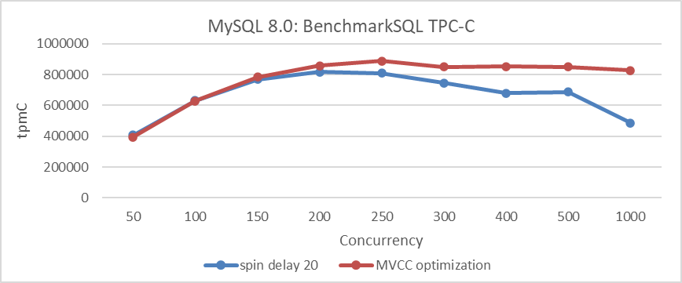

Figure 11-15. Comparison of throughput between MVCC ReadView optimization and spin delay 20.

From the figure, it can be seen that while spin delay can mitigate scalability problems to some extent, its effect is noticeably less pronounced compared to the benefits of adopting MVCC ReadView optimization.

After MVCC ReadView optimization, the impact of  *spin_delay* was tested again. See the specific results in the figure below:

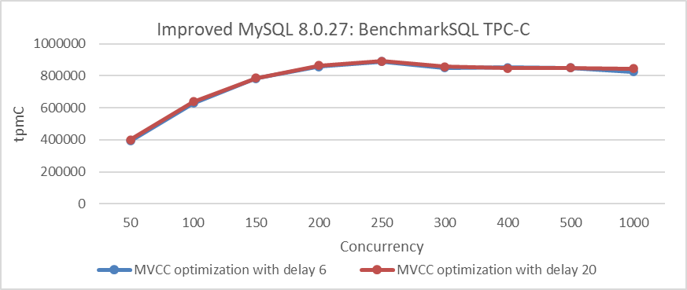

Figure 11-16. Spin delay 20 has no effect after addressing MVCC ReadView scalability problems.

The figure shows that after addressing MVCC ReadView scalability problems, the impact of the *spin_delay* parameter is minimal.

### 11.5.4 Effect of Binlog Commit Order on Performance

Here's a brief introduction to the *binlog_order_commits* parameter:


When this variable is enabled on a replication source server (default), transaction commit instructions to storage engines are serialized on a single thread, ensuring transactions commit in the same order as they are written to the binary log. Disabling this variable permits transaction commit instructions to be issued using multiple threads. Used in combination with binary log group commit, this prevents the commit rate of a single transaction being a bottleneck to throughput, and might therefore produce a performance improvement [13].

Based on the MySQL 8.0.27 version, examining whether enabling the *binlog_order_commit* parameter affects TPC-C throughput. See the specific comparison in the figure below:


Figure 11-17. Achieve better performance with binlog_order_commits off before binlog group commit optimization.

From the figure, it can be observed that disabling *binlog_order_commits* results in a noticeable improvement in TPC-C throughput under different concurrency levels.

The following figure is based on the improved MySQL version, optimized with PGO settings. Disabling *binlog_order_commits* shows less pronounced improvement in TPC-C throughput. Addressing problems like the thundering herd problem caused by binlog group commit has improved MySQL efficiency and mitigated the performance degradation observed when *binlog_order_commits* is enabled.

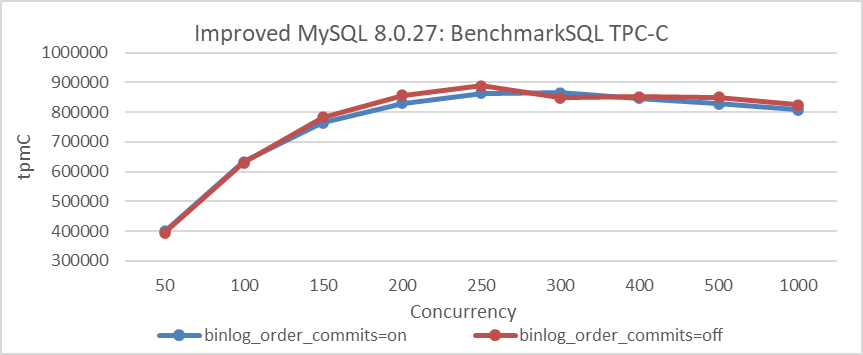

Figure 11-18. Less performance gain with binlog_order_commits off after binlog group commit optimization.

MySQL defaults to enabling *binlog_order_commits*. Notably, disabling *binlog_order_commits* will affect MySQL's clone functionality.

### 11.5.5 Comprehensive Understanding of the Performance Schema on Performance

The Performance Schema helps DBAs tune performance by taking real measurements instead of making guesses. Unfortunately, in NUMA environments, enabling the Performance Schema impacts MySQL's performance, especially affecting MySQL secondary replay. The figure below compares TPC-C throughput across different concurrency levels using BenchmarkSQL to analyze this impact.

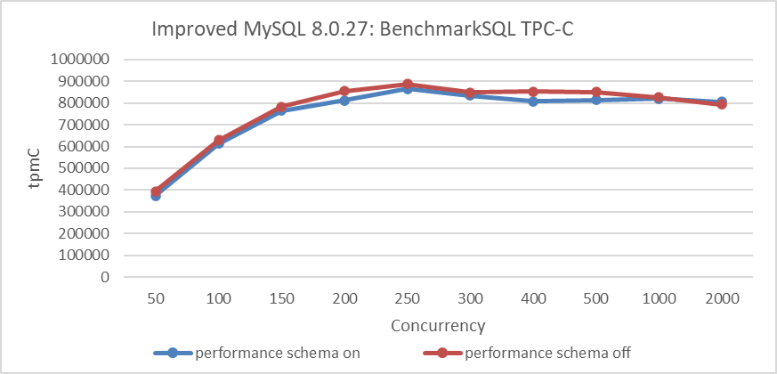

Figure 11-19. Achieve better performance with performance_schema off.

From the figure, it can be seen that the Performance Schema has a relatively minor impact on MySQL primary performance, which is generally acceptable to users. However, enabling the Performance Schema significantly affects the replay speed of MySQL secondaries. The following figure shows the change in the replay queue size of Group Replication after enabling the Performance Schema.

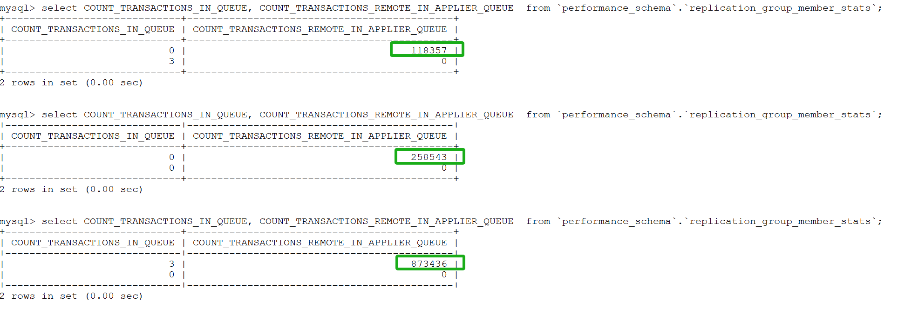

Figure 11-20. The replay queue size in Group Replication increases after enabling the Performance Schema.

From the figure, it can be observed that the replay queue size is increasing, indicating that the MySQL secondary is unable to keep up with the processing speed of the MySQL primary. The throughput results after executing on the MySQL primary are as follows:

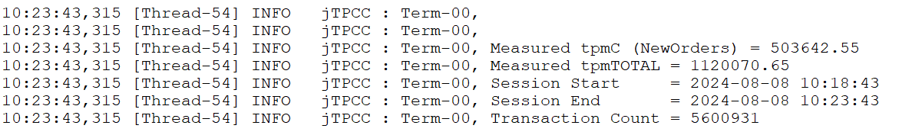

After the MySQL primary completes execution, here are the performance screenshots captured during the replay process on the MySQL secondary:

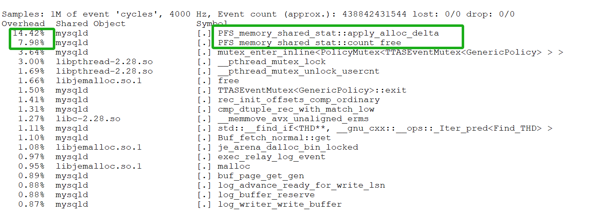

Figure 11-21. Significant bottlenecks related to the Performance Schema.

From the highlighted green box, it is apparent that there are significant bottlenecks related to the Performance Schema.

To summarize the test results above: When the MySQL primary achieves a throughput of 500,000 tpmC, the MySQL secondary, with the Performance Schema enabled, shows clear bottlenecks. Additionally, the MySQL secondary cannot keep up with the speed of the MySQL primary during the replay process.

Now, with the Performance Schema disabled, conduct the same concurrency test. See the specific results in the figure below:


Figure 11-22. The replay queue size in Group Replication does not increase after disabling the Performance Schema.

The figure indicates that the number of transactions awaiting replay did not increase significantly over time. The throughput results after MySQL primary completes execution are as follows:

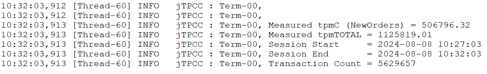

When MySQL primary testing completes, the MySQL secondary also finishes replay nearly simultaneously. This indicates that in mainstream NUMA environments, Performance Schema is highly detrimental to MySQL secondary replay. The NUMA compatibility problems with Performance Schema remain unsolved and will be a focus for future optimization.

### 11.5.6 Effect of Doublewrite on Performance

Here's a brief introduction to the *innodb_doublewrite* parameter:

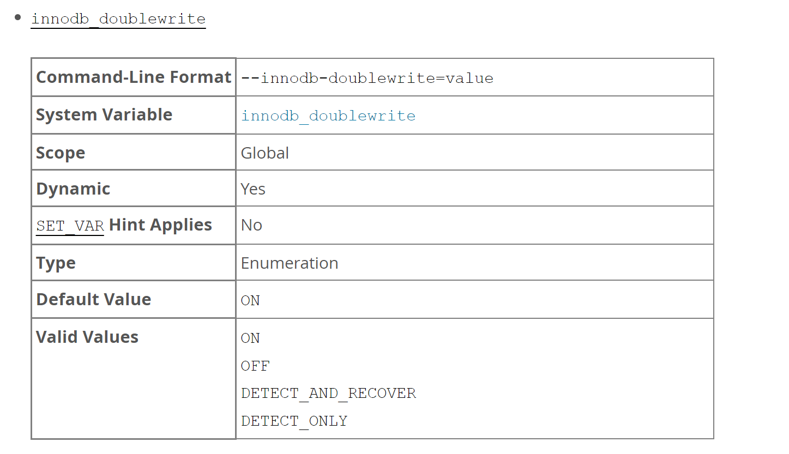

The doublewrite buffer is a storage area where InnoDB writes pages from the buffer pool before committing them to the data files. This mechanism ensures data integrity during crash recovery by providing a reliable page copy in case of failures. However, since the default InnoDB page size is 16 KB while file systems can only guarantee atomicity up to 4 KB, only part of the page may be recoverable. Enabling doublewrite helps InnoDB recover the full page by writing it twice.

The impact of enabling doublewrite on performance is assessed using the improved MySQL 8.0.27 with PGO. The figure below shows the effect of disabling doublewrite on TPC-C throughput across different concurrency levels.

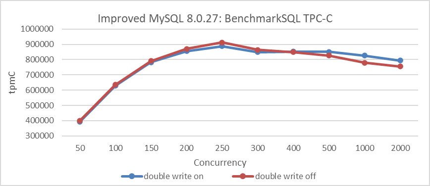

Figure 11-23. Achieve higher peak throughput with doublewrite disabled.

From the figure, it is evident that disabling the doublewrite parameter can increase peak throughput. While extensive testing and statistical analysis indicate that this parameter has a limited overall impact on performance, it does help to improve peak throughput. However, disabling doublewrite may compromise recovery safety in the event of a database crash, so it should be used with caution.

### 11.5.7 Effect of Binlog Row Image Format on Performance

Here's a brief introduction to the *binlog_row_image* parameter:

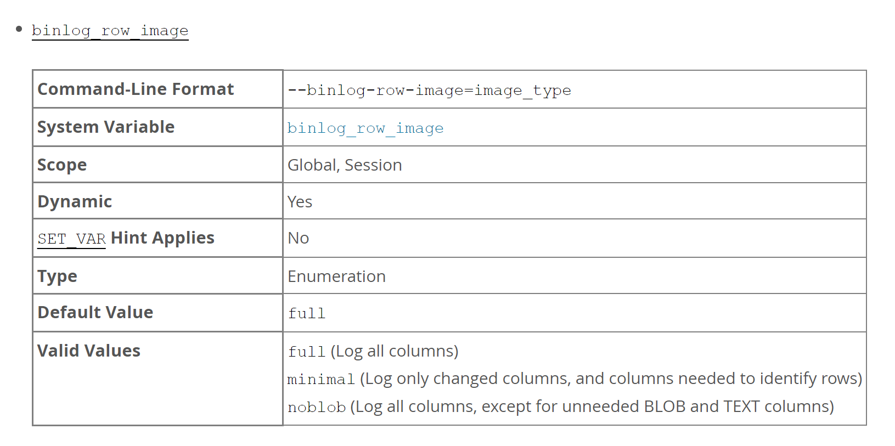

For MySQL row-based replication, this variable controls how row images are recorded in the binary log [13]. Each row change event consists of two images: a "before" image, which represents the row's state before the change, and an "after" image, which reflects the updated state. Typically, MySQL logs all columns for both images. However, it is possible to log only the necessary columns, which can reduce disk, memory, and network usage.

Based on the improved version of MySQL 8.0.27 with PGO, the impact of the *binlog_row_image* parameter on TPC-C throughput at various concurrency levels is analyzed. See the figure below:

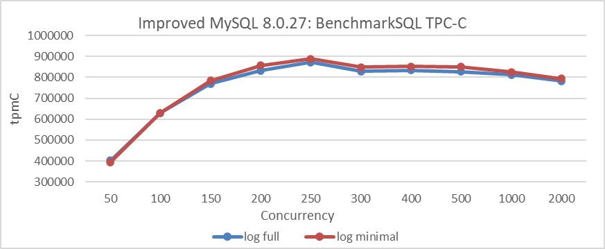

Figure 11-24. Achieve improved throughput with minimal logging.

From the figure, it can be observed that using *binlog_row_image=minimal* provides a moderate improvement in throughput for the MySQL primary, but the increase is not substantial. Regarding MySQL secondary replay, specific details can be found in section 10.3.7.

### 11.5.8 Understanding the Effect of Binlog Compression Settings on Performance

Here's a brief introduction to the *binlog_transaction_compression* parameter:

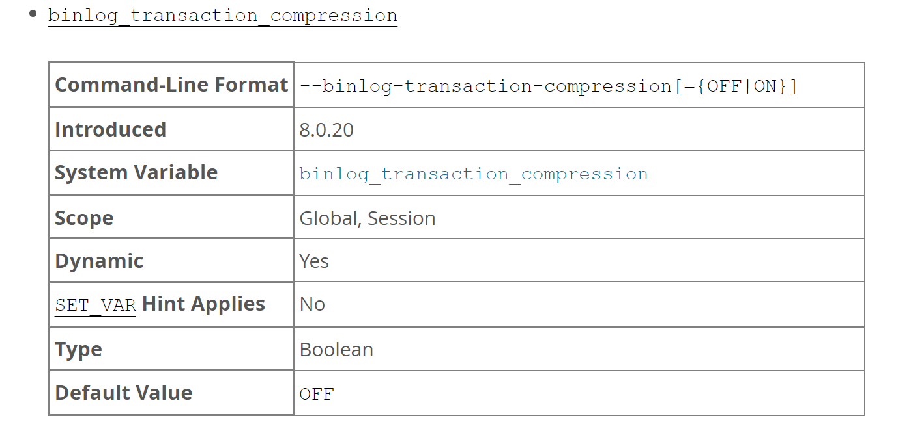

When binary log transaction compression is enabled, transaction payloads are compressed and written to the binary log as a single event. These compressed payloads remain compressed in the replication stream and relay logs, reducing storage requirements and saving network bandwidth for both the originator and recipients of the transactions [13].

In a Group Replication cluster within the same data center, with *binlog_transaction_compression* enabled for MySQL primary and secondaries, let's analyze the effect of binary log compression on TPC-C throughput. Refer to the figure below for detailed results:

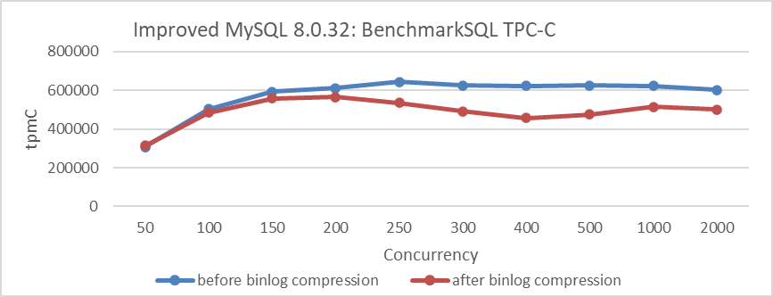

Figure 11-25. Binlog compression may negatively impact performance in LAN environments.

From the figure, it is evident that enabling binlog compression results in a significant decrease in throughput for the Group Replication cluster, particularly under high concurrency. This decline occurs when the network benefits from compression are outweighed by the computational costs involved.

To investigate whether increasing network latency could improve throughput after compression, a simulated network latency of 10ms was used. The comparison of TPC-C throughput versus concurrency levels, before and after binlog compression, is shown in the following figure.

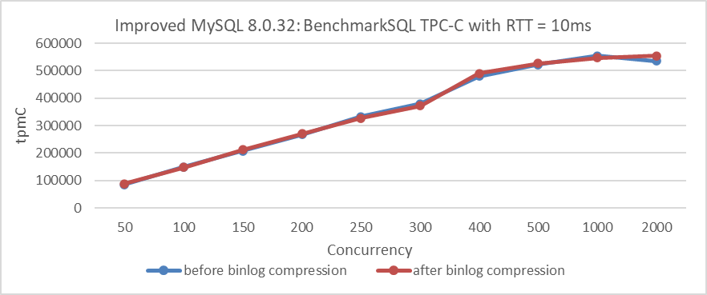

Figure 11-26. Binlog compression does not affect performance in WAN environments.

From the figure, it is evident that with a 10ms network latency, the throughput after compression is similar to that before compression. This suggests that increased network latency can help alleviate the performance degradation associated with MySQL compression.

Users should weigh the trade-off between storage cost reduction and performance improvement based on their specific needs.

### 11.5.9 Understanding the Effect of InnoDB Buffer Pool Size on Performance

Here's a brief introduction to the *innodb_buffer_pool_size* parameter:

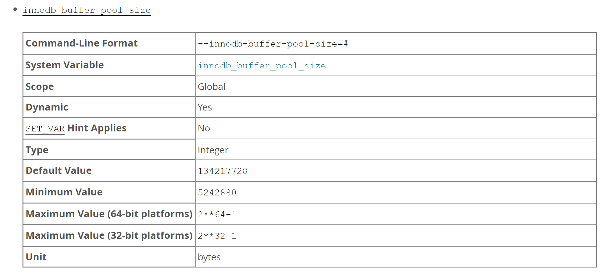

The larger buffer pool retains more data in memory, reducing page evictions, I/O operations, and contention within the buffer pool [13].

Based on the improved MySQL 8.0.27 version with PGO, the impact of the *innodb_buffer_pool_size* parameter on TPC-C throughput at various concurrency levels is analyzed. The results, with a warehouse count of 1000, are shown in the figure below.

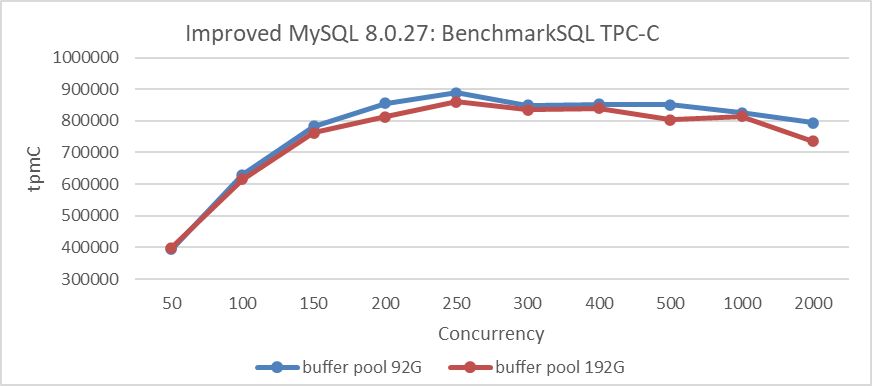

Figure 11-27. innodb_buffer_pool_size: optimal size is key to performance, not just larger.

From the figure, it is evident that increasing the buffer pool size does not always lead to higher throughput. For 1000 warehouses, occupying around 92GB of I/O space in the test, setting *innodb_buffer_pool_size* to 92GB performs better than setting it to 192GB.

Notably, the *innodb_buffer_pool_size* parameter is well-suited for dynamic adaptive tuning using AI.

## 11.6 Summary

This chapter focuses on optimizing MySQL application performance without modifying MySQL source code. Key methods include using PGO, minimizing network interactions, employing advanced memory allocation tools, and improving indexing and parameter configurations.

The effectiveness of these optimization methods varies depending on the MySQL version, configuration parameters, hardware environment, and specific application characteristics. While a parameter might significantly impact performance in one scenario, its effectiveness may decrease in another. This variability arises from the complex interactions between multiple performance-affecting queues and potential bottlenecks, making performance testing particularly challenging.

​                                                                  [Next](Part5.md)
