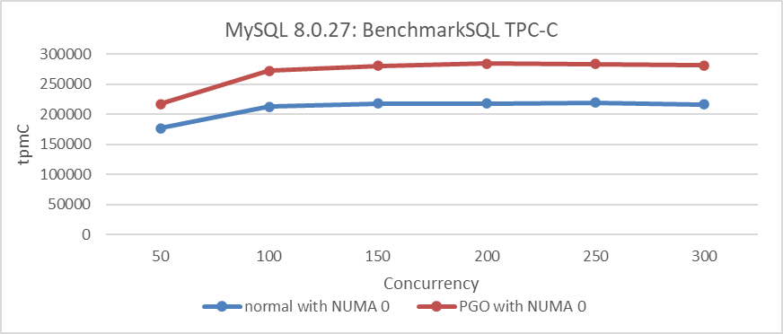
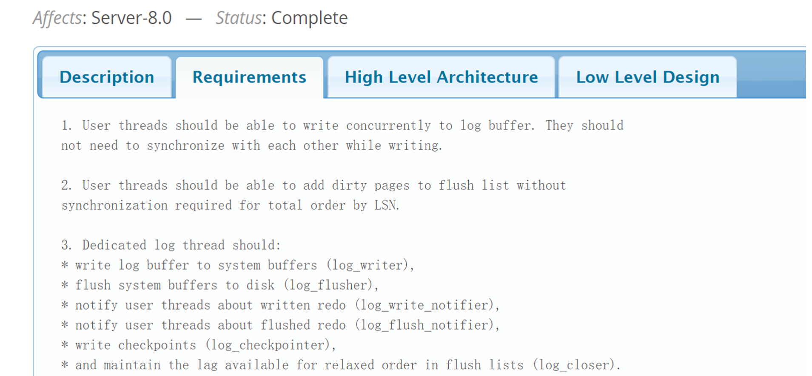
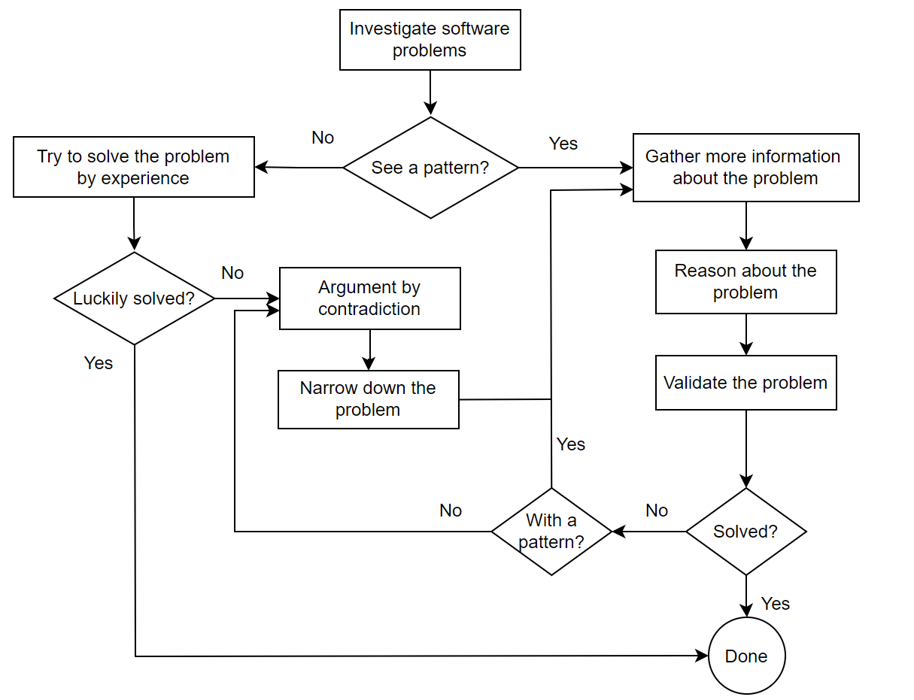

# Chapter 3: How to Solve Software Problems Effectively

When encountering challenging problems, software professionals often rely on experience to find solutions. However, especially with the numerous MySQL problems discussed in this book, it is challenging to identify the root cause of problems based solely on experience. Therefore, scientific methods are needed to analyze and solve these problems.

This chapter discusses how to analyze and solve problems from two different levels: strategy and tactics [1].

## 3.1 Analysis Strategies

There are many analysis strategies, including psychological strategies, simplification strategies, pattern-finding strategies, strategies to increase reproducibility, and strategies to find key evidence.

### 3.1.1 Psychological Strategies

Many people often feel overwhelmed by problems, especially when they seem mysterious or difficult to solve. When they encounter such challenges, their first instinct is to seek help from others if they cannot solve them on their own. However, relying solely on others can hinder the opportunity to develop and strengthen one's own logical thinking skills through problem-solving.

When faced with difficulties, particularly those that seem complex, it is crucial to approach them with confidence. These challenges can serve as opportunities to unlock one's potential and enhance problem-solving abilities. MySQL, as a complex database software, presents numerous such challenges.

Firstly, encountering these challenges leads to a deeper understanding of MySQL over time. Secondly, they offer invaluable opportunities to tackle complex problems, thereby improving developers' problem-solving capabilities. Lastly, the historical problems associated with MySQL are invaluable; without them, books like this one would not exist. Each challenge contributes to expanding our knowledge base and refining our approach to solving MySQL-related problems.

### 3.1.2 Simplification Strategies

When a problem occurs and reproducing the original conditions is very complex, it's essential to simplify the reproduction environment step by step. This approach allows you to check if the problem still occurs. If it does, you continue simplifying until the problem no longer manifests. This strategy significantly simplifies the difficulty of problem analysis. For instance, when troubleshooting problems with a MySQL cluster, begin by checking if the problem occurs on a single MySQL instance. If it does, there's no need to set up the entire cluster; you can troubleshoot using the single instance.

### 3.1.3 Pattern-finding Strategies

When a problem recurs, it often reveals underlying characteristics, facilitating the statistical aggregation of patterns and regularities associated with it. This data supports problem reproduction and inference-making. For instance, after PGO, instead of increasing, peak performance decreased. Testing at various concurrency levels showed a significant decline under high concurrency, with improvement observed at lower levels. This insight lays the groundwork for addressing subsequent problems and reinforces confidence in PGO's potential to improve throughput in high concurrency scenarios.

### 3.1.4 Strategies to Increase Reproducibility

Many problems are environment-specific, often manifesting sporadically, especially under high concurrency. The challenge lies in addressing these infrequent occurrences, which may happen just once every few months. Increasing the frequency of problem reproduction—from every few months to every few hours or minutes—significantly simplifies their resolution.

How can this be achieved? Capturing patterns in problem occurrence is crucial. For example, when addressing simultaneous failures in Group Replication that sporadically freeze views, analyzing statistical patterns reveals critical insights. These problems often cluster around specific thresholds. Adjusting lower-level communication timeout settings to align with network interruption durations enables more frequent problem reproduction. Once these critical factors are understood, the likelihood of reproducing problems increases significantly, laying a solid foundation for effective problem resolution.

Therefore, the ability to reproduce problems often proves crucial in solving challenging problems. Improving the reproducibility by capturing the characteristics of problem recurrence is key to expediting problem resolution.

### 3.1.5 Strategies to Find Key Evidence

Sometimes, revealing the characteristics of a problem directly is challenging; it necessitates creating conditions that fully manifest the problem. Let's revisit the figure below, using PGO as an example.


Figure 3-1. Performance comparison tests before and after using PGO in MySQL 8.0.27.

PGO (Profile-Guided Optimization) is effective in improving throughput under low concurrency. However, there is a strong belief that interference from other factors in high concurrency scenarios limits PGO's ability to achieve its intended effectiveness.

Based on the above analysis, binding the MySQL instance to NUMA node 0 allowed us to explore whether PGO can achieve its performance potential in an SMP environment. For specific comparative test results, please refer to the following figure:



Figure 3-2. Performance comparison tests before and after using PGO in MySQL 8.0.27 under SMP.

From the figure, binding to a single NUMA node demonstrates that PGO significantly improves performance across all concurrency scenarios shown. This finding underscores PGO's ability to boost MySQL throughput, establishing a strong basis for improving performance in NUMA environments.

Regarding the sharp decline in TPC-C throughput discussed in section 2.4, users encountered this problem during regression testing after upgrading to MySQL 8.0.29. Notably, this performance drop was absent in MySQL 8.0.25. User feedback on this discrepancy is pivotal, greatly facilitating the resolution process.

## 3.2 Logical Thinking

At the core of programming lies problem-solving. Logical reasoning empowers programmers to break down complex problems into manageable components and devise practical solutions by analyzing requirements, understanding relationships between elements, and planning logically and efficiently. This structured approach enables programmers to think critically and innovate creatively [56]. Logical reasoning is crucial in computer engineering for creating justifiable inferences. Enhanced use of logical thinking in workplaces boosts productivity by refining decision-making and minimizing errors. Rooted in sequential thought, logic underpins all systematic analysis, solution design, error correction, and performance optimization in programming. It utilizes deductive, inductive, abductive reasoning, and reductio ad absurdum to gather key evidence, identify contradictions, and ensure software reliability

### 3.2.1 Deductive Reasoning

Deductive reasoning involves deriving conclusions from premises, often structured as syllogisms. A syllogism typically comprises a major premise, a minor premise, and a conclusion. For instance:

-   Major premise: All cluster databases cannot simultaneously meet the three requirements of CAP (consistency, availability, and partition tolerance).
-   Minor premise: Group Replication is a type of cluster database.
-   Conclusion: Therefore, Group Replication also cannot meet the three requirements of CAP.

Given Group Replication's inability to meet these requirements, it should be chosen based on user-specific needs rather than attempting to satisfy all criteria.

Here's another example:

-   Major premise: Asynchronous network systems struggle to differentiate between slow response and system outage.
-   Minor premise: TCP communication relies on asynchronous networks.
-   Conclusion: Thus, TCP communication systems also encounter challenges in distinguishing between slow response and actual system failure.

Due to these challenges, TCP design must incorporate specific features such as robust timeout mechanisms and support for idempotency.

### 3.2.2 Inductive Reasoning

Inductive reasoning extrapolates from specific instances to general conclusions. For instance:

-   On x86 NUMA platforms, native MySQL 8.0.32 shows poor scalability under the Read Committed isolation level.
-   On ARM NUMA platforms, native MySQL 8.0.32 similarly demonstrates poor scalability under the Read Committed isolation level.

Therefore, on various NUMA platforms, native MySQL 8.0.32 consistently exhibits poor scalability under the Read Committed isolation level. Inductive reasoning is crucial for problem analysis and holds practical significance across diverse applications.

### 3.2.3 Abductive Reasoning

Abductive reasoning, also known as backward reasoning, involves deriving the best explanation from observed facts. It is a widely employed method in solving programming problems, especially when symptoms are evident but the underlying cause is unclear. For example, after optimizing MySQL with PGO (Profile-Guided Optimization), if throughput peaks decrease rather than increase, abductive reasoning may reveal that poor MySQL handling in NUMA environments is causing this outcome.

### 3.2.4 Reductio ad Absurdum

"Reductio ad absurdum" is a method of disproving a proposition by demonstrating that its logical conclusion leads to an absurd or contradictory outcome. This approach aims to show that a statement or hypothesis must be false because accepting it would result in an illogical or unacceptable result. It is a common method used to refute arguments, characterized by the strategy of "*retreating to advance*", where introducing absurdity exposes flaws in reasoning.

For example, Group Replication often reports network unreachable errors. To verify the reliability of these error messages, consider them accurate. However, deploying Group Replication in a controlled localhost environment, where external network access isn't necessary, should not result in the same network errors. Yet, during the normal TPC-C data loading process, frequent network unreachable errors persist. This inconsistency indicates that the error messages cannot be relied upon.

### 3.2.5 Utilizing Various Methods Comprehensively

The challenges in software problem-solving differ significantly from those in mathematical problems, often influenced by human misjudgments and numerous external factors, leading to frequent errors in judgment. The theoretical foundation in this area is relatively underdeveloped, heightening the complexity of problem-solving.

Utilizing logical thinking methods is crucial for solving complex programming problems. These methods often necessitate synthesizing diverse approaches to address challenges, occasionally incorporating probability information.

## 3.3 Tactics for Solving Problems

Strategies themselves rarely directly solve problems; more powerful methods are needed to solve them.

### 3.3.1 Balancing Different Options

Once the root cause of the problem is identified, there are often multiple options to choose from, requiring a careful balance of their pros and cons. For example, when addressing the poor compatibility of InnoDB with NUMA, there are two solutions: the first is latch-free modification, which is complex, error-prone, and costly to maintain; the second is improving the speed of accessing critical latch resources, a simpler solution but not a definitive fix as it still exhibits problems under extremely high concurrency. Given the need to maintain compatibility with MySQL's official releases during modification, the second option was chosen, which was a prudent decision. As for scalability problems under high concurrency, implementing transaction throttling mechanisms can improve performance comparable to latch-free solutions.

### 3.3.2 Decompose the Problem

Complex problems often bring multiple associated problems that can significantly interfere with analysis and judgment. To effectively solve such problems, it's crucial to eliminate these disturbances, simplify the problem, and minimize the risk of misjudgment. For instance, when optimizing the Paxos algorithm in Group Replication, addressing other performance problems beforehand is essential to accurately gauge the impact of Paxos algorithm optimization.

Once all disturbances are eliminated, if the core problem remains overly complex, decomposing it further becomes necessary. An example of redo log optimization is shown in the figure below:


Figure 3-3. Description of the official worklog for redo log optimization.

To address the scalability problems of redo log, developers have subdivided this problem into the following sub-problems:



Figure 3-4. Requirements of the official worklog for redo log optimization.

This involves latch-free concurrent writing to the log buffer, dedicated threads for handling write and flush processes, and so on.

### 3.3.3 Seeking Theoretical Support

In the process of enhancing Group Replication, rooted in State Machine Replication (SMR) theory, it's crucial to begin by acquiring a substantial amount of theoretical knowledge through thorough paper reviews. This approach fosters a deeper understanding and maintains clarity throughout the enhancement process, ensuring a comprehensive grasp of the concepts and preventing deviation from the intended path.

The book "Designing Data-Intensive Applications" discusses theory very well, specifically as follows [28]:

*Although the theoretical papers and proofs are not always easy to understand, and sometimes make unrealistic assumptions, they are incredibly valuable for informing practical work in this field: they help us reason about what can and cannot be done, and help us find the counterintuitive ways in which distributed systems are often flawed. If you have the time, the references are well worth exploring.*

It is worth mentioning that this book includes a large amount of scholarly material as the basis for deductive reasoning and theoretical support.

### 3.3.4 Logic-based Testing

To assess the performance improvement potential of a new feature, rigorous iterative testing and validation across various perspectives and environments are essential. Reliable conclusions ensure predictable outcomes in subsequent tests. Any deviations observed during validation must be thoroughly investigated to identify potential interfering factors.

For instance, consider the thread pool mechanism's impact on performance, particularly under high-concurrency testing conditions. Previous validations on MySQL 5.7 demonstrated significant throughput improvements with the thread pool. However, subsequent modifications in MySQL 8.0 have revealed a different scenario. Case studies in Chapter 2.3 indicate a negative scalability impact of the Percona thread pool. MySQL's official technical blog reports a decline in the thread pool's effectiveness over time [31].


When conducting performance comparison tests, it's crucial to eliminate human errors such as changes in the environment or configurations. To mitigate this problem, repeating the initial test and comparing its results with those of the first test can help identify significant changes. If there are no noticeable differences, it suggests that the intermediate tests are relatively reliable. For example, incorporating an additional test, depicted in the following figure, to compare its performance variance from the initial test.


Figure 3-5. Additional test for comparing performance variance from the initial test.

Repeating the initial test can significantly mitigate problems of testing uncertainty and environmental contamination. However, this alone is not sufficient; it's also necessary to explain any abnormal results from each test. If an explanation cannot be provided and the problem is reproducible, it often presents a new opportunity for optimization.

For instance, during TPC-C testing, an anomaly in throughput was observed, which was later found to be due to omitting the use of jemalloc. It was discovered that performance was actually better without jemalloc. Extensive testing uncovered that MySQL's jemalloc 3.6 did not deliver optimal performance, prompting exploration into alternative jemalloc versions. These tests underscored the significant influence of memory allocation tools on overall performance.

## 3.4 Principles of Logical Reasoning

Here are principles of logical reasoning [15], which can provide some assistance in how to conduct logical inference:

```
1.  ask for reasons before accepting a conclusion,
2.  give an argument to support your conclusion,
3.  design your reasons to imply the conclusion,
4.  recognize the value of having more relevant information,
5.  weigh the pros and cons,
6.  consider the possible courses of action,
7.  look at the consequences of these various courses of action,
8.  evaluate the consequences,
9.  consider the probabilities that those various consequences will actually occur,
10.  delay making important decisions when practical,
11.  assess what is said in light of the situation,
12.  use your background knowledge and common sense in drawing conclusions,
13.  remember that extraordinary statements require extraordinarily good evidence,
14.  defer to the expert,
15.  remember that firmer conclusions require better reasons,
16.  be consistent in your own reasoning,
17.  be on the lookout for inconsistency in the reasoning of yourself and others,
18.  check to see whether explanations fit all the relevant facts,
19.  you can make your opponent's explanation less believable by showing that there are 
     alternative explanations that haven't been ruled out,
20.  stick to the subject,
21.  don't draw a conclusion until you've gotten enough evidence.
```

## 3.5 Logical Reasoning: Key to Solving Complex Problems

Many complex software problems arise from confusion in information and logic. To resolve these, it's crucial to clarify the logical relationships through precise data and systematic reasoning to trace the root cause. Harnessing this logical approach can significantly enhance a programmer's problem-solving skills.

While data structures and algorithms are central to programming, solving programmatic problems goes beyond merely being familiar or proficient in them. It requires logical reasoning skills. Therefore, the content of this chapter forms the foundation for subsequent topics.

## 3.6 The Difference Between Solving Difficult Problems and Doing Exercises

During exercises, essential information is typically provided, allowing students to apply textbook knowledge and logical reasoning to find solutions. This process helps develop problem-solving skills. However, upon entering the workforce and facing real programming challenges, individuals often feel unprepared. Schools rarely teach how to handle complex problems in programs like MySQL, leaving beginners bewildered and unsure where to start or how to find necessary information.

Complex problems can make programmers feel as if they are encountering supernatural phenomena, especially when the information they obtain is conflicting or misleading. In practice, solving challenging programming problems is markedly different from solving exercise problems. Even skilled teams may spend months sifting through distracting information to identify the root cause, which can lead to increasing frustration.

The main similarity between solving exercises and addressing real-world problems is logical reasoning. The difference lies in information accessibility: exercises provide essential details upfront, while real-world problems require reasoning to uncover crucial, often obscured information. This process involves distinguishing truth from falsehood, filtering out distractions, and identifying genuinely relevant conditions for effective problem-solving.

In many cases, the difficulty of obtaining critical problem-solving information far surpasses the challenge of solving the problem itself.

## 3.7 Common Problem-Solving Frameworks

In the software industry, when faced with problems, the initial instinct is often to check if others have encountered similar problems. However, during the problem-solving process, individuals frequently rely on personal experience to propose solutions, sometimes without a solid foundation. Suspicions may point to network faults or configuration problems, prompting various actions that may only temporarily alleviate the problem without addressing its root cause. Both questioners and solvers often prioritize quick fixes, potentially neglecting the crucial role of logical reasoning.

Consider a real-life scenario: a DBA conducting MySQL performance tests uncovers unstable and low throughput. They provide details on CPU, memory, and configurations, noting thread-level IO with significant dirty page activity but omitting specific IO device information. Speculation about network problems is dismissed through DBA-conducted tests. Suggestions regarding spin delay configuration are similarly disproven. Such speculative approaches prove inefficient, failing to uncover underlying problems.

Professional problem-solving necessitates logical deduction based on observed phenomena to systematically narrow down the problem's scope. This involves analyzing usage patterns across varying levels of concurrency, attempting to replicate problems on different machine types, and reviewing past software versions for similar problems. These insights contribute to precise logical reasoning.

Returning to the DBA's case study, binding NUMA nodes on a high-spec machine adjusted CPU and memory resources to match user hardware specifications, while maintaining a high-spec disk. Tests subsequently demonstrated significantly improved and stable throughput. Ultimately, the critical problem was pinpointed to disparities in IO devices. This method effectively identifies root causes instead of relying solely on experiential or speculative methods.

Effective software problem-solving relies on logical reasoning. Below is a figure illustrating a common problem-solving framework.



Figure 3-6. A general framework for solving program problems.

The figure integrates logical reasoning and information retrieval. Maintaining logical thinking ensures each step's reliability. Without it, one risks falling into traps that hinder effective software problem-solving.
