# Chapter 4: Fundamentals of Computer Science

To effectively address MySQL's myriad problems, a solid foundation in computer science is indispensable. MySQL not only encapsulates a wealth of computer science principles but also presents learners with diverse challenges, offering valuable practical experience. This chapter centers on essential computer science fundamentals necessary for solving MySQL problems. The emphasis is on applying this foundational knowledge in practical scenarios, rather than theoretical teaching.

## 4.1 System Architecture

System architecture defines the high-level structure of a software or hardware system, detailing its components, their interrelationships, and how they collaborate to fulfill system objectives.

### 4.1.1 SMP

In an SMP (Symmetric Multiprocessing) system, multiple tightly-coupled processors share all resources such as bus, memory, and I/O system. This architecture facilitates equal access to memory, peripherals, and the operating system across all CPUs without distinction, emphasizing shared resource utilization among processors.

The following is a typical SMP architecture diagram.

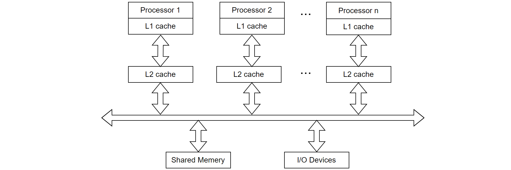

Figure 4-1. A typical SMP architecture.

In this setup, access to local L1 and L2 caches is extremely fast, and the overhead of CPU switching is minimal compared to NUMA architecture. SMP architecture typically supports moderate throughput under normal conditions. However, it is the inability of SMP to scale effectively for higher throughput demands that led to the development of NUMA architecture.

### 4.1.2 NUMA

In the era of increasingly multicore systems, memory hierarchy is evolving towards non-uniform distributed architectures. Non-uniform memory architecture (NUMA) systems, which offer superior scalability compared to SMP counterparts, feature multiple memory nodes distributed throughout the system. Each node is physically adjacent to a subset of cores, but the entire physical address space of all nodes is globally visible, allowing cores to access memory locally or remotely. Consequently, data access times are non-uniform and vary based on data location. Accessing data from a remote node can lead to performance degradation due to latency and interconnect contention if many cores access large amounts of data remotely. These problems can be mitigated by co-locating threads with their data whenever possible, facilitated by NUMA-aware scheduling algorithms.

The throughput of the cross-chip interconnect is typically lower than that of on-chip memory controllers. Remote memory accesses that traverse this interconnect also experience higher latencies compared to local memory accesses. Due to the diversity in their memory interfaces, these multiprocessors are categorized as NUMA systems. The performance impact of remote memory accesses can be significant; in current implementations, the NUMA factor can result in up to a 2X slowdown for certain applications.

NUMA nodes are interconnected within the same physical server. When a CPU needs to access remote memory, it incurs a wait time. This limitation is fundamental to why NUMA servers struggle to achieve linear performance scalability as CPUs increase [52].

Here is the classic architecture figure of NUMA.

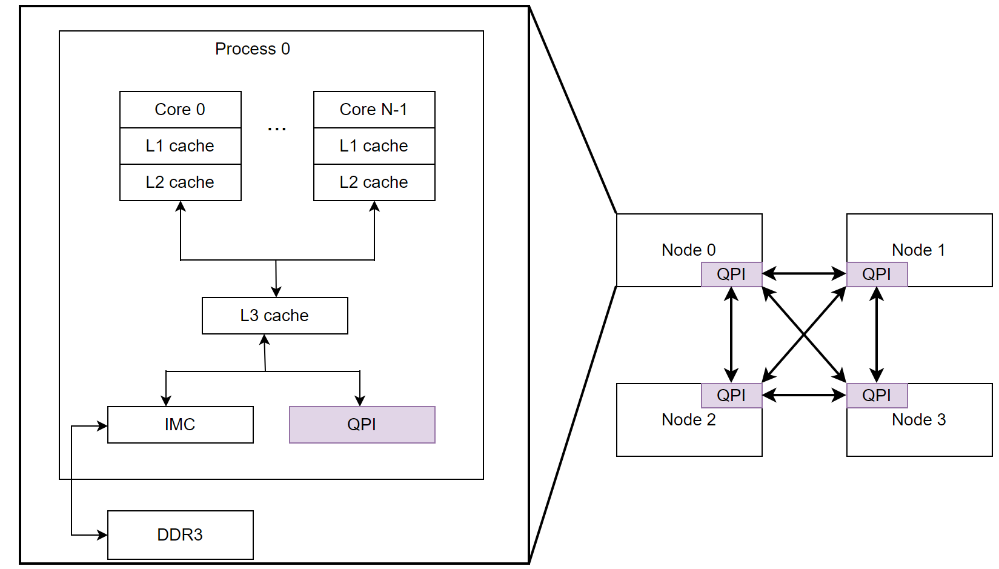

Figure 4-2. A typical NUMA architecture.

Access within the same NUMA node can be compared to a specialized form of SMP access, where its efficiency primarily comes from reduced CPU switching costs within the NUMA node. However, a drawback is that memory bandwidth within the same NUMA node can quickly become a bottleneck, constraining scalability. Accessing memory between different NUMA nodes involves higher costs, but it offers greater overall memory bandwidth. Effectively managing memory access in a NUMA environment poses a significant challenge.

The figure below illustrates the comparison results of TPC-C tests across different concurrency levels. The dark blue curve shows tests conducted with NUMA node 0 fixed, while the deep red curve represents tests utilizing all 4 NUMA nodes of the machine. The testing employed an improved version of MySQL, operating with 1000 warehouses and using the widely adopted Read Committed transaction isolation level.

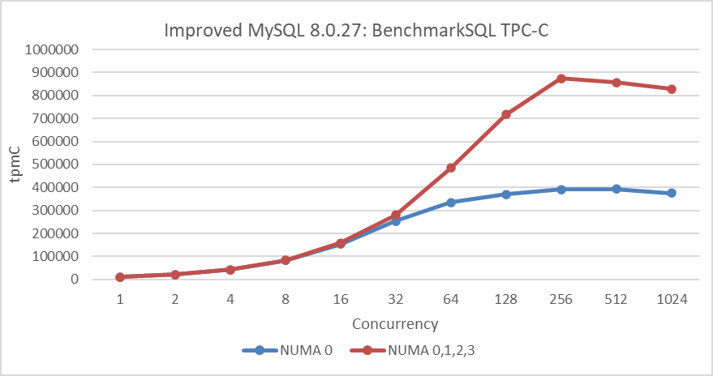

Figure 4-3. Performance Comparison in SMP vs. NUMA.

In the scenario where NUMA node 0 is bound, the throughput versus concurrency curve is notably smooth. Even under high concurrency, there is only a slight decline in throughput, indicating low thread context switching costs. However, throughput consistently remains below 400,000 tpmC due to significant limitations in memory bandwidth, characteristic of traditional SMP architecture.

In contrast, when utilizing all NUMA nodes, the throughput curve is relatively worse. This is attributed to reduced memory efficiency and increased context switching costs when accessing across NUMA nodes, resulting in less stable throughput. Nevertheless, scalability is greatly improved, with peak throughput increasing by 123% compared to using a single NUMA node.

Using 4 NUMA nodes does not result in four times the throughput; instead, it is approximately 2.x times that of a single NUMA node. This non-linear scaling is inherent to NUMA architecture and is compounded by MySQL's challenges in linear scalability.

MySQL's difficulties in achieving linear scalability arise from several factors, including the Read Committed transaction isolation mechanism based on MVCC ReadView. This involves copying a global ReadView to a local one, leading to contention among threads for global ReadView updates. Moreover, in NUMA environments, frequent cross-NUMA node accesses are necessary, further complicating scalability.

Many pieces of code are not suitable for NUMA environments. For example, frequent latch contention in critical sections can lead to frequent cross-NUMA node context switches. Slow operations within critical sections can cause inefficient program execution due to frequent cache migrations across NUMA nodes.

To achieve optimal performance on NUMA systems [4], the following strategies are crucial:

1.  Maximize the proportion of memory accesses routed to local nodes.
2.  Balance traffic across nodes and interconnect links.

An unbalanced distribution of memory requests can significantly increase memory access latency on overloaded controllers, sometimes reaching up to 1000 cycles compared to approximately 200 cycles on non-overloaded controllers.

While Microsoft SQL Server and Oracle DBMS are NUMA-aware, MySQL is not [5]. Therefore, large-scale applications like MySQL, which lack NUMA awareness, offer significant optimization potential in NUMA environments.

Interestingly, for MySQL, disabling NUMA can potentially improve performance. According to a case study in Section 2.9, disabling NUMA configuration in the BIOS improved performance for the MySQL primary. This adjustment impacts memory allocation strategies, leading to more consistent memory access between NUMA nodes. This aligns with optimization strategy 2 mentioned above, benefiting MySQL's throughput and stability.

### 4.1.3 X86 Architecture

X86 uses a complex system called CISC (Complex Instruction Set Computing). This can do a lot of tasks at once but makes the processor more complicated and expensive to create. X86 architectures allow more direct interaction with memory, facilitating a depth of computational tasks at the expense of higher power consumption [45]. Overall, x86 has higher performance capabilities, ideal for demanding computational tasks.

For mainstream NUMA machines utilizing the x86 architecture, please refer to the figure below for an analysis of memory access overhead between different NUMA nodes on a specific machine:


Figure 4-4. Node distances in a typical x86 architecture.

From the figure, it is evident that under the x86 architecture, the access overhead is 10 units for accessing the local node and 21 units for accessing remote NUMA nodes. Below are the TPC-C test results of improved MySQL 8.0.27 with BenchmarkSQL:


Figure 4-5. Performance comparison under different NUMA bindings in a typical x86 architecture.

Under the x86 architecture, the addition of each NUMA node results in a noticeable increase in high-concurrency throughput. This highlights the robust performance capabilities of x86 architecture in effectively managing memory access across NUMA nodes, thereby leveraging its full potential for high-performance computing.

### 4.1.4 ARM Architecture

Historically, ARM processors have prioritized power efficiency, dominating the mobile systems market, whereas x86 processors have led in high-performance computing. The primary distinction between ARM and x86 processors lies in their instruction sets: ARM utilizes the RISC (Reduced Instruction Set Computing) architecture, which simplifies instructions to enhance speed and energy efficiency. This simplicity makes ARM ideal for battery-powered devices like smartphones [47]. In contrast, x86 employs the CISC (Complex Instruction Set Computing) architecture, which supports a wider range of complex operations but typically consumes more power.

Regarding memory handling, ARM processors focus on register-based processing to minimize direct memory access, thereby improving energy efficiency. In contrast, x86 architectures allow for more direct interaction with memory, enabling a broader range of computational tasks at the cost of higher power consumption. Servers based on ARM architecture are renowned for their low power consumption and cost-effectiveness. However, they generally exhibit lower overall performance compared to x86 architecture and may have limitations in memory access scalability.

For mainstream NUMA machines utilizing the ARM architecture, please refer to the figure below to observe the memory access overhead between different NUMA nodes on a specific machine:


Figure 4-6. Node distances in a typical ARM architecture.

The memory access overhead between different NUMA nodes under the ARM architecture is notably more complex and varies significantly compared to the x86 architecture.

Here are the test results on an ARM machine, using MySQL code and configuration similar to those on an x86 machine, with approximately the same settings, including 1000 warehouses.

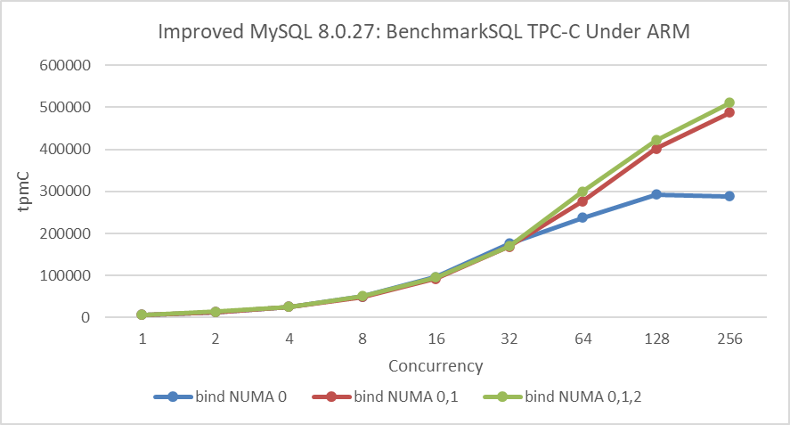

Figure 4-7. Performance comparison under different NUMA bindings in a typical ARM architecture.

From the figure, it is evident that binding NUMA node 0 and 1 significantly improves throughput. However, adding NUMA node 2 does not noticeably improve throughput, primarily due to NUMA node distances inherent in the ARM architecture. Extensive testing has revealed that MySQL demonstrates better scalability on x86 architecture compared to ARM.

## 4.2 Data Structure

This section explores the fundamental data structures in MySQL, encompassing arrays, linked lists, queues, heaps, hash tables, red-black trees, B+ trees, and hybrid data structures. These data structures do not inherently possess advantages or disadvantages; their effectiveness depends on their application tailored to specific system architectures and the characteristics of practical data.

### 4.2.1 Array

An array consists of elements arranged in a specific order, typically of the same type. Elements are accessed via an integer index to specify the required item. Arrays are usually implemented with contiguous memory allocation and can be either fixed-length or resizable [45]. In MySQL, arrays commonly used include dynamic vectors and fixed-length arrays, with the choice depending on specific needs. Vectors can dynamically resize, while fixed-length arrays have a predetermined size.

In the MySQL InnoDB storage engine, MVCC ReadView uses a data structure similar to a vector to store the transaction IDs of all active transactions. This dynamic array supports varying lengths, adapting to changes in the active transaction list despite size fluctuations. For the Read Committed transaction isolation level, each read operation utilizes its own ReadView.

Here are some details about the ReadView object.

```c++
private:
  // Disable copying
  ReadView(const ReadView &);
  ReadView &operator=(const ReadView &);
 private:
  /** The read should not see any transaction with trx id >= this
  value. In other words, this is the "high water mark". */
  trx_id_t m_low_limit_id;
  /** The read should see all trx ids which are strictly
  smaller (<) than this value.  In other words, this is the
  low water mark". */
  trx_id_t m_up_limit_id;
  /** trx id of creating transaction, set to TRX_ID_MAX for free
  views. */
  trx_id_t m_creator_trx_id;
  /** Set of RW transactions that was active when this snapshot
  was taken */
  ids_t m_ids;
  /** The view does not need to see the undo logs for transactions
  whose transaction number is strictly smaller (<) than this value:
  they can be removed in purge if not needed by other views */
  trx_id_t m_low_limit_no;
```

The variable *m_ids* is a data structure of type *ids_t*, which closely resembles *std::vector*. For more details, see below:

```c++
  /** This is similar to a std::vector but it is not a drop
  in replacement. It is specific to ReadView. */
  class ids_t {
    typedef trx_ids_t::value_type;
    /**
    Constructor */
    ids_t() : m_ptr(), m_size(), m_reserved() {}
    /**
    Destructor */
    ~ids_t() { ut::delete_arr(m_ptr); }
    /** Try and increase the size of the array. Old elements are copied across.
    It is a no-op if n is < current size.
    @param n            Make space for n elements */
    void reserve(ulint n);
```

Do fixed-length arrays have practical value? In MySQL, buffer pool chunks are organized using fixed-length arrays. Details are provided below:

```c++
/** @brief The buffer pool structure.
NOTE! The definition appears here only for other modules of this
directory (buf) to see it. Do not use from outside! */
struct buf_pool_t {
  ...
  /** Number of buffer pool chunks */
  volatile ulint n_chunks;
  /** New number of buffer pool chunks */
  volatile ulint n_chunks_new;
  /** buffer pool chunks */
  buf_chunk_t *chunks;
  /** old buffer pool chunks to be freed after resizing buffer pool */
  buf_chunk_t *chunks_old;
  /** Current pool size in pages */
  ulint curr_size;
  /** Previous pool size in pages */
  ulint old_size;
  /** Size in pages of the area which the read-ahead algorithms read
  if invoked */
  page_no_t read_ahead_area;
```

Above, the array name and type are defined, while below, dynamic memory allocation is carried out based on the array's member type.

```c++
 buf_pool->chunks = reinterpret_cast<buf_chunk_t *>(ut::zalloc_withkey(
        UT_NEW_THIS_FILE_PSI_KEY, buf_pool->n_chunks * sizeof(*chunk)));
```

From a practical standpoint, leveraging fixed-length arrays can offer substantial performance benefits. Their stability prevents performance fluctuations due to memory reallocation, and their cache-friendliness further improves efficiency. Subsequent chapters will include several examples where the use of fixed-length arrays significantly improves performance or alleviates performance bottlenecks.

### 4.2.2 Linked List

A linked list (or simply "list") is a linear collection of data elements, called nodes, where each node contains a value and a reference to the next node in the sequence. The primary advantage of linked lists over arrays is their efficiency in inserting and removing elements without relocating the entire list. However, operations like random access to a specific element are generally slower with linked lists compared to arrays [45].

MySQL commonly uses the list from the standard library, which typically implements a doubly linked list to facilitate easy insertion and deletion, though it often suffers from poor query performance. In mainstream NUMA architectures, linked lists are generally inefficient for querying due to non-contiguous memory access patterns. Consequently, linked lists are best suited as auxiliary data structures or for scenarios involving smaller data volumes.

Below is the list data structure used by *undo*. As the *undo* list grows longer, MVCC efficiency is significantly reduced.

```c++
  using Recs = std::list<rec_t, mem_heap_allocator<rec_t>>;
  ...
  /** Undo recs to purge */
  Recs *recs;
```

To address this problem, some databases adopt centralized storage for undo history versions, which significantly reduces the cost of garbage collection.

### 4.2.3 Queue

In computer science, a queue is a collection of entities organized in a sequence, where entities can be added at one end and removed from the other. The operation of adding an element to the rear is called enqueue, while removing an element from the front is called dequeue. This makes a queue a first-in-first-out (FIFO) data structure, meaning the first element added will be the first one removed. In other words, elements are processed in the order they are added.

Queues are linear data structures, or sequential collections, and are commonly used in computer programs. They can be implemented using circular buffers or linked lists. In MySQL, queues are often encapsulated with additional functionalities, such as synchronized queues and double-ended queues, for FIFO processing needs. For instance, the *incoming* member shown below uses a synchronized queue to store Group Replication's applier packets, serving as a cache for data related to Paxos network interactions and relay log disk writes. This buffering helps manage data when relay log writing lags behind.

```c++
  /* The incoming event queue */
  Synchronized_queue<Packet *> *incoming;
```

Double-ended queues are commonly used in various applications. For instance, MySQL utilizes *std::deque* to implement a general-purpose *mem_root_deque*. Details are provided below:

```c++
/**
  A (partial) implementation of std::deque allocating its blocks on a MEM_ROOT.
  This class works pretty much like an std::deque with a Mem_root_allocator,
  and used to be a forwarder to it. However, libstdc++ has a very complicated
  implementation of std::deque, leading to code blowup (e.g., operator[] is
  23 instructions on x86-64, including two branches), and we cannot easily use
  libc++ on all platforms. This version is instead:
   - Optimized for small, straight-through machine code (few and simple
     instructions, few branches).
   - Optimized for few elements; in particular, zero elements is an important
     special case, much more so than 10,000.
  ...
 */
template <class Element_type>
class mem_root_deque {
```


### 4.2.4 Heap

In computer science, a heap is a tree-based data structure that maintains the heap property and is typically implemented using an array [45]. It serves as an efficient implementation of the abstract data type known as a priority queue. Priority queues are often referred to as "heaps" regardless of their underlying implementation. In a heap, the element with the highest (or lowest) priority is always at the root. However, unlike a sorted structure, a heap is partially ordered.

Heaps are particularly useful when there is a need to repeatedly access and remove the element with the highest or lowest priority, or when insertions and removals of the root node occur frequently. Priority queues, which are frequently implemented with heaps, are also used in MySQL. For instance, in MySQL 8.0.34, the data structure *purge_pg_t* (detailed below) utilizes the *priority_queue* from the standard library to efficiently find the oldest transaction ID.

```c++
typedef std::priority_queue<
    TrxUndoRsegs, std::vector<TrxUndoRsegs, ut::allocator<TrxUndoRsegs>>,
    TrxUndoRsegs>
purge_pq_t;
```

From a mathematical perspective, heap data structures have a balanced tree structure with minimal theoretical tree levels. However, in modern architectures, they present notable drawbacks. Heaps have a non-sequential access pattern, moving from the root to the leaves, which is not cache-friendly. This makes heaps suitable for relatively small datasets but less efficient as data scales up. Inefficient cache access may explain why heap-based algorithms, like *heap sort*, don't outperform *quicksort* in average performance, despite their theoretical advantages.

### 4.2.5 Hash Table

A hash table, also known as a hash map, is a data structure designed for fast value retrieval based on keys. It uses a hashing function to map keys to indices in an array, allowing for average constant-time access. Hash tables are commonly used in dictionaries, caches, and database indexing. Despite their efficiency, hash collisions can degrade performance, and techniques such as chaining and open addressing are used to manage them.

The primary advantage of hash tables is their rapid query speed, but they can be less cache-friendly due to the dispersed memory pointers stored in hash slots. This dispersion can lead to inefficiencies during frequent access operations.

In MySQL, hash tables are widely used, leveraging both STL types like *unordered_set* and *unordered_map*, as well as custom-designed hash tables tailored to specific use cases. For instance, the *hash_table_t* data type, used in the buffer pool for page management, exemplifies such specialized implementations.

```c++
  /** Hash table of buf_page_t or buf_block_t file pages, buf_page_in_file() ==
  true, indexed by (space_id, offset).  page_hash is protected by an array of
  mutexes. */
  hash_table_t *page_hash;
```

The data members of *hash_table_t* are as follows:

```c++
/* The hash table structure */
class hash_table_t {
 public:
  hash_table_t(size_t n) {
    const auto prime = ut::find_prime(n);
    cells = ut::make_unique<hash_cell_t[]>(prime);
    set_n_cells(prime);

    /* Initialize the cell array */
    hash_table_clear(this);
  }
  ~hash_table_t() { ut_ad(magic_n == HASH_TABLE_MAGIC_N); }
  /** Returns number of cells in cells[] array.
   If type==HASH_TABLE_SYNC_RW_LOCK it can be used:
  - without any latches to peek a value, before hash_lock_[sx]_confirm
  - when holding S-latch for at least one n_sync_obj to get the "real" value
  @return value of n_cells
  */
  size_t get_n_cells() { return n_cells.load(std::memory_order_relaxed); }
  /** Returns a helper class for calculating fast modulo n_cells.
   If type==HASH_TABLE_SYNC_RW_LOCK it can be used:
  - without any latches to peek a value, before hash_lock_[sx]_confirm
  - when holding S-latch for at least one n_sync_obj to get the "real" value */
  const ut::fast_modulo_t get_n_cells_fast_modulo() {
    return n_cells_fast_modulo.load();
  }
  ...
```

The certification database of Group Replication uses the *std::unordered_map* hash table to handle a large volume of certification information.

```c++
  typedef std::unordered_map<
      std::string, Gtid_set_ref *, std::hash<std::string>,
      std::equal_to<std::string>,
      Malloc_allocator<std::pair<const std::string, Gtid_set_ref *>>>
      Certification_info;
  ...
  /**
    Certification database.
  */
  Certification_info certification_info;
```

Despite utilizing efficient data structures like hash tables, the certification database faces performance challenges due to frequent access to elements. This problem arises because the memory access pattern in the certification database is non-contiguous, leading to inefficient memory access. Consequently, while hash tables offer advantages, they are not always the optimal choice for performance in this context.

### 4.2.6 Red-Black Tree

In computer science, a red-black tree is a self-balancing binary search tree known for efficient storage and retrieval of ordered data. Each node in a red-black tree has an additional "color" bit, typically red or black, which helps maintain the tree's balanced structure. MySQL frequently uses the *map* from the STL (Standard Template Library), which implements a red-black tree to preserve order. In contrast, *unordered_map* in the STL is a hash table and does not maintain order, which is why it is called an "unordered map".

The Pages below illustrates the use of a map data structure for efficient lookup, modification, and sequential traversal.

```c++
 /* Assuming a page size, read the space_id from each page and store it
  in a map. Find out which space_id is agreed on by majority of the
  pages.  Choose that space_id. */
  for (uint32_t page_size = UNIV_ZIP_SIZE_MIN; page_size <= UNIV_PAGE_SIZE_MAX;
       page_size <<= 1) {
    /* map[space_id] = count of pages */
    typedef std::map<space_id_t, ulint, std::less<space_id_t>,
                     ut::allocator<std::pair<const space_id_t, ulint>>>
        Pages;
    Pages verify;
    ulint page_count = 64;
    ulint valid_pages = 0;
    /* Adjust the number of pages to analyze based on file size */
    while ((page_count * page_size) > file_size) {
      --page_count;
}
```

MySQL has also implemented a red-black tree tailored to its specific needs. For instance, the code snippet below shows *SEL_ROOT*, a red-black tree utilized to store key ranges.

```c++
/**
  A graph of (possible multiple) key ranges, represented as a red-black
  binary tree. There are three types (see the Type enum); if KEY_RANGE,
  we have zero or more SEL_ARGs, described in the documentation on SEL_ARG.
  As a special case, a nullptr SEL_ROOT means a range that is always true.
  This is true both for keys[] and next_key_part.
*/
class SEL_ROOT {
 ...
  /**
    Insert the given node into the tree, and update the root.
    @param key The node to insert.
  */
  void insert(SEL_ARG *key);
  /**
    Delete the given node from the tree, and update the root.
    @param key The node to delete. Must exist in the tree.
  */
  void tree_delete(SEL_ARG *key);
  /**
    Find best key with min <= given key.
    Because of the call context, this should never return nullptr to get_range.
    @param key The key to search for.
  */
  SEL_ARG *find_range(const SEL_ARG *key) const;
  ...
```

Generally, red-black trees offer advantages such as low insertion and update costs and support for sequential traversal. However, their non-sequential memory access can reduce cache efficiency, making them less ideal for high-performance, compute-intensive tasks.

### 4.2.7 B+ Tree

A B+ tree is an m-ary tree characterized by a large number of children per node, including a root, internal nodes, and leaves. The root may either be a leaf or a node with two or more children [45].

B+ trees excel in block-oriented storage contexts, such as filesystems, due to their high fanout (typically around 100 or more pointers per node). This high fanout reduces the number of I/O operations needed to locate an element, making B+ trees especially efficient when data cannot fit into memory and must be read from disk.

InnoDB employs B+ trees for its indexing, leveraging their ability to ensure a fixed maximum number of reads based on the tree's depth, which scales efficiently. For specific details on B+ tree implementation in MySQL, refer to the file *btr/btr0btr.cc*.

### 4.2.8 Hybrid Data Structure

In various application scenarios, relying on a single data structure may not always yield optimal performance. Combining different data structures can often lead to significant improvements. For instance, in MySQL, the MVCC ReadView initially uses a dynamic array (*vector*) to maintain the active transaction list, utilizing binary search for querying. However, in high-concurrency environments, this list can grow excessively, making it less efficient in NUMA environments. To mitigate this problem, a hybrid approach is employed: recent transactions are stored in a static array for quick access, while long-running transactions are placed in a dynamic array. This dual-array strategy, managed by multiple variables, improves access speed and efficiency. For further details, see below:


Figure 4-8. A new hybrid data structure suitable for active transaction list in MVCC ReadView.

To better illustrate the concept of hybrid data structures, consider the following example:

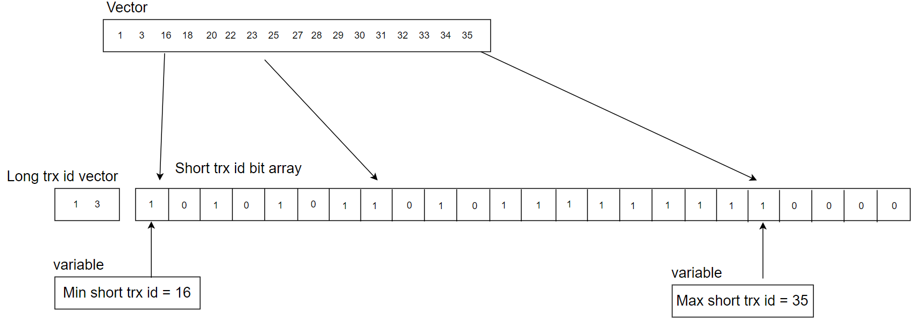

Figure 4-9. A detailed example for the new hybrid data structure for active transaction list.

The active transaction list length is 17, with each transaction ID requiring 8 bytes. Storing this using a dynamic array (vector) would necessitate at least 17 \* 8 = 136 bytes. By switching to a hybrid data structure, most transaction IDs are stored in a static array using a 3-byte bit representation, while a dynamic array holds two transaction IDs (1 and 3), occupying 16 bytes. Additionally, two auxiliary variables consume 16 bytes. Consequently, the hybrid data structure totals 3 + 16 + 16 = 35 bytes, which is 101 bytes less than the original approach.

Regarding query efficiency, the hybrid data structure offers substantial improvements. For instance, to check if transaction ID=24 is in the active transaction list:

-   In the original approach, a binary search is needed, with a time complexity of O(log n).
-   With the hybrid structure, using the minimum short transaction ID as a baseline allows direct querying through the static data, achieving a time complexity of O(1).

In NUMA environments, as shown in the figure below, it can be seen that simply changing the data structure can significantly increase the throughput of TPC-C under high-concurrency conditions, greatly alleviating scalability problems related to MVCC ReadView.

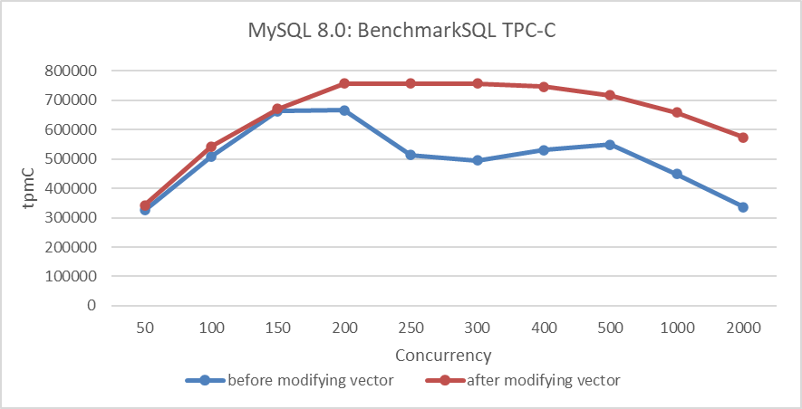

Figure 4-10. Performance improvement with new hybrid data structure in NUMA.

## 4.3 Algorithm

This section covers various problem-solving algorithms in MySQL, including search algorithms, sorting algorithms, greedy algorithms, dynamic programming, amortized analysis, and the Paxos series of algorithms.

### 4.3.1 Search Algorithm

In computer science, a search algorithm is designed to locate information within a specific data structure or search space [45].

MySQL commonly employs several search algorithms, including binary search, red-black tree search, B+ tree search, and hash search. Binary search is effective for searching datasets without special characteristics or when dealing with smaller datasets. For instance, binary search is used to determine if a record is visible in the active transaction list, as detailed below:

```c++
/** Check whether the changes by id are visible.
  @param[in]    id      transaction id to check against the view
  @param[in]    name    table name
  @return whether the view sees the modifications of id. */
  [[nodiscard]] bool changes_visible(trx_id_t id,
                                     const table_name_t &name) const {
    ut_ad(id > 0);
    if (id < m_up_limit_id || id == m_creator_trx_id) {
      return (true);
    }
    check_trx_id_sanity(id, name);
    if (id >= m_low_limit_id) {
      return (false);
    } else if (m_ids.empty()) {
      return (true);
    }
    const ids_t::value_type *p = m_ids.data();
    return (!std::binary_search(p, p + m_ids.size(), id));
  }
```

The B+ tree search, implemented in *btr/btr0btr.cc*, is a well-established method ideal for indexing scenarios. Hash lookup, another prevalent search method in MySQL, is frequently used, such as in Group Replication for certification databases, as detailed below:

```c++
bool Certifier::add_item(const char *item, Gtid_set_ref *snapshot_version,
                         int64 *item_previous_sequence_number) {
  DBUG_TRACE;
  mysql_mutex_assert_owner(&LOCK_certification_info);
  bool error = true;
  std::string key(item);
  Certification_info::iterator it = certification_info.find(key);
  snapshot_version->link();
  if (it == certification_info.end()) {
    std::pair<Certification_info::iterator, bool> ret =
        certification_info.insert(
            std::pair<std::string, Gtid_set_ref *>(key, snapshot_version));
    error = !ret.second;
  } else {
    *item_previous_sequence_number =
        it->second->get_parallel_applier_sequence_number();
    if (it->second->unlink() == 0) delete it->second;
    it->second = snapshot_version;
    error = false;
  }
  ...
  return error;
}
```

The choice of search algorithm is flexible and usually adjusted based on performance bottlenecks. For example, the hash-based search algorithm mentioned earlier became the primary bottleneck in the Group Replication applier thread operations, as illustrated by the specific performance flame graph below:

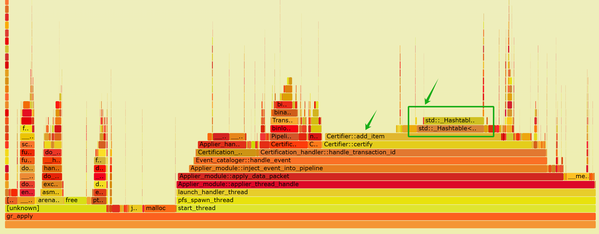

Figure 4-11. An example of bottlenecks in hash-based search algorithm.

The figure shows that hash search in *Certify::add_item* accounts for half of the total time, highlighting a significant bottleneck. This suggests the need to explore alternative search algorithms. Further details on potential solutions are discussed in the following chapters.

### 4.3.2 Sorting Algorithm

In computer science, a sorting algorithm arranges elements of a list into a specific order, with the most frequently used orders being numerical and lexicographical, either ascending or descending. Efficient sorting is crucial for optimizing the performance of other algorithms, such as search and merge algorithms, which require sorted input data [45].

Commonly used sorting algorithms do not inherently have a distinction of superiority or inferiority; each serves its own purpose. For example, consider *std::sort* from the C++ Standard Library. It employs different sorting algorithms based on the data's characteristics. When the data is mostly ordered, it uses *insertion sort*. See details below:

```c++
// sort
template <typename _RandomAccessIterator, typename _Compare>
_GLIBCXX20_CONSTEXPR inline void __sort(_RandomAccessIterator __first,
                                        _RandomAccessIterator __last,
                                        _Compare __comp) {
  if (__first != __last) {
    std::__introsort_loop(__first, __last, std::__lg(__last - __first) * 2,
                          __comp);
    std::__final_insertion_sort(__first, __last, __comp);
  } 
}
```

*Insertion sort* is used in cases where the data is mostly ordered because it has a time complexity close to linear in such scenarios. More importantly, *insertion sort* accesses data sequentially, which significantly improves cache efficiency. This cache-friendly nature makes insertion sort highly suitable for sorting small amounts of data.

For instance, in the *std::sort* function, when calling the *__introsort_loop* function, if the number of elements is less than or equal to 16, sorting is skipped, and control returns to the *sort* function. The *sort* function then utilizes *insertion sort* for sorting.

```c++
/**
   *  @doctodo
   *  This controls some aspect of the sort routines.
  */
  enum { _S_threshold = 16 };
/// This is a helper function for the sort routine.
template <typename _RandomAccessIterator, typename _Size, typename _Compare>
_GLIBCXX20_CONSTEXPR void __introsort_loop(_RandomAccessIterator __first,
                                           _RandomAccessIterator __last,
                                           _Size __depth_limit,
                                           _Compare __comp) {
  while (__last - __first > int(_S_threshold)) {
    if (__depth_limit == 0) {
      std::__partial_sort(__first, __last, __last, __comp);
      return;
    }   
    --__depth_limit;
    _RandomAccessIterator __cut =
        std::__unguarded_partition_pivot(__first, __last, __comp);
    std::__introsort_loop(__cut, __last, __depth_limit, __comp);
    __last = __cut;
  } 
}
```

Within the *__introsort_loop* function, if the recursion depth exceeds a threshold, the *partial_sort* function, which is based on *heap* data structures and offers stable performance, is utilized. Overall, the main part of *__introsort_loop* employs an improved version of *quicksort*, eliminating left recursion and reducing the overhead of function calls.

Discussing sorting algorithms is essential not only because MySQL extensively uses these standard library sort algorithms but also to draw insights on optimization strategies from their implementations. This involves selecting different algorithms based on specific circumstances to leverage their respective strengths, thereby improving the overall performance of the algorithm.

In MySQL code, similar optimization principles are applied. For instance, in the *sort_buffer* function, when the *key_len* value is small, it uses the *Mem_compare* function, which is suitable for short keys. When *prefilter_nth_element* \> 0, it employs *nth_element* (similar to the partitioning idea of *quicksort*), selecting the required elements for subsequent sorting.

```c++
size_t Filesort_buffer::sort_buffer(Sort_param *param, size_t num_input_rows,
                                    size_t max_output_rows) {
  ...
  if (num_input_rows <= 100) {
    if (key_len < 10) {
      param->m_sort_algorithm = Sort_param::FILESORT_ALG_STD_SORT;
      if (prefilter_nth_element) {
        nth_element(it_begin, it_begin + max_output_rows - 1, it_end,
                    Mem_compare(key_len));
        it_end = it_begin + max_output_rows;
      }
      sort(it_begin, it_end, Mem_compare(key_len));
      ...
      return std::min(num_input_rows, max_output_rows);
    }
    param->m_sort_algorithm = Sort_param::FILESORT_ALG_STD_SORT;
    if (prefilter_nth_element) {
      nth_element(it_begin, it_begin + max_output_rows - 1, it_end,
                  Mem_compare_longkey(key_len));
      it_end = it_begin + max_output_rows;
    }
    sort(it_begin, it_end, Mem_compare_longkey(key_len));
    ...
    return std::min(num_input_rows, max_output_rows);
  }
  param->m_sort_algorithm = Sort_param::FILESORT_ALG_STD_STABLE;
  // Heuristics here: avoid function overhead call for short keys.
  if (key_len < 10) {
    if (prefilter_nth_element) {
      nth_element(it_begin, it_begin + max_output_rows - 1, it_end,
                  Mem_compare(key_len));
      it_end = it_begin + max_output_rows;
    }
    stable_sort(it_begin, it_end, Mem_compare(key_len));
    ...
  } else {
    ...
  }
  return std::min(num_input_rows, max_output_rows);
}
```

In general, when using sorting algorithms, the key principles are flexibility in application and cache-friendliness. By considering the algorithm's complexity, one can find the most suitable sorting algorithm.

### 4.3.3 Greedy Algorithm

A greedy algorithm follows the heuristic of making the locally optimal choice at each stage. Although it often does not produce an optimal solution for many problems, it can yield locally optimal solutions that approximate a globally optimal solution within a reasonable amount of time.

One of the most challenging problems in generating an execution plan based on SQL is selecting the join order. Currently, MySQL's execution plan uses a straightforward greedy algorithm for join order, which performs well in certain scenarios. See the details below for more information:

```c++
/**
  Find a good, possibly optimal, query execution plan (QEP) by a greedy search.
  ...
  @note
    The following pseudocode describes the algorithm of 'greedy_search':
    @code
    procedure greedy_search
    input: remaining_tables
    output: pplan;
    {
      pplan = <>;
      do {
        (t, a) = best_extension(pplan, remaining_tables);
        pplan = concat(pplan, (t, a));
        remaining_tables = remaining_tables - t;
      } while (remaining_tables != {})
      return pplan;
    }
  ...
*/
bool Optimize_table_order::greedy_search(table_map remaining_tables) {
```

Determining the optimal join order is an NP-hard problem, making it prohibitively costly in terms of computational resources for complex joins. Consequently, MySQL uses a greedy algorithm. Although this approach may not always yield the absolute best join order, it balances computational efficiency with decent overall performance.

In some join operations, the greedy algorithm's join order selection can result in poor performance, which may explain why users occasionally criticize MySQL's performance.

### 4.3.4 Dynamic Programming

Dynamic programming simplifies a complex problem by breaking it down into simpler sub-problems recursively. A problem exhibits optimal substructure if it can be solved optimally by solving its sub-problems and combining their solutions. Additionally, if sub-problems are nested within larger problems and dynamic programming methods are applicable, there is a relationship between the larger problem's value and the sub-problems' values. Two key attributes for applying dynamic programming are optimal substructure and overlapping sub-problems [45].

In the context of execution plan optimization, MySQL 8.0 has explored using dynamic programming algorithms to determine the optimal join order. This approach can greatly improve the performance of complex joins, though it remains experimental in its current implementation.

It is important to note that, due to potentially inaccurate cost estimation, the join order determined by dynamic programming algorithms may not always be the true optimal solution. Dynamic programming algorithms often provide the best plan but can have high computational overhead and may suffer from large costs due to incorrect cost estimation [55]. For a deeper understanding of the complex mechanisms involved, readers can refer to the paper "Dynamic Programming Strikes Back".

### 4.3.5 Amortized Analysis

In computer science, amortized analysis is a method for analyzing an algorithm's complexity, specifically how much of a resource, such as time or memory, it takes to execute. The motivation for amortized analysis is that considering the worst-case runtime can be overly pessimistic. Instead, amortized analysis averages the running times of operations over a sequence [45].

This section discusses applying amortized analysis to address MySQL problems. While it differs from traditional amortized analysis, the underlying principles are similar and find many practical applications in addressing MySQL performance problems. For example, during the refactoring of Group Replication, significant jitter was observed when cleaning up outdated certification database information in multi-primary scenarios. The figure below shows read-write tests in MySQL's multi-primary mode with Group Replication, using SysBench at 100 concurrency levels over 300 seconds.


Figure 4-12. Performance fluctuation in MySQL Group Replication.

To address this problem, an amortization strategy was adopted for cleaning up outdated certification database information. See the specific details in the following figure:

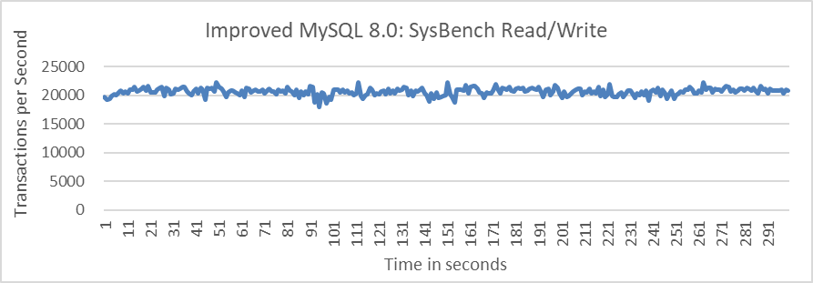

Figure 4-13. Eliminated performance fluctuations in enhanced MySQL Group Replication.

MySQL experienced severe performance fluctuations primarily due to cleaning outdated certification database information every 60 seconds. After redesigning the strategy to clean every 0.2 seconds, resulting in performance fluctuations on the order of milliseconds (ms), these fluctuations became imperceptible during testing. The improved version of MySQL has eliminated sudden performance drops, mainly by applying the amortized approach to reduce significant fluctuations.

It is important to note that cleaning every 0.2 seconds requires each MySQL node to promptly send its GTID information at intervals of approximately 0.2 seconds. This high-frequency sending is challenging to meet using traditional Multi-Paxos algorithms because these algorithms typically require leader stability over a period of time. Therefore, a single-leader based Multi-Paxos algorithm struggles to handle sudden performance drops effectively, as the underlying algorithm lacks support for such frequent operations.

### 4.3.6 Paxos

Maintaining consistency among replicas in the face of arbitrary failures has been a major focus in distributed systems for several decades. While naive solutions may work for simple cases, they often fail to provide a general solution. Paxos is a family of protocols designed to achieve consensus among unreliable or fallible processors. Consensus involves agreeing on a single result among multiple participants, a task that becomes challenging when failures or communication problems arise. The Paxos family is widely regarded as the only proven solution for achieving consensus with three or more replicas, as it addresses the general problem of reaching agreement among 2F + 1 replicas while tolerating up to F failures. This makes Paxos a fundamental component of State Machine Replication (SMR) and one of the simplest algorithms for ensuring high availability in clustered environments [26].

The mathematical foundation of Paxos is rooted in set theory, specifically the principle that the intersection of a majority of sets must be non-empty. This principle is key to solving high availability problems in complex scenarios.

However, the pure Paxos protocol often falls short in meeting practical business needs, particularly in environments with significant network latency. To address this, various strategies and enhancements have been developed, leading to several Paxos variants, such as Multi-Paxos, Raft, and Mencius in Group Replication. The following figure illustrates an idealized sequence of Multi-Paxos, where a stable leader allows a proposal message to achieve consensus and return a result to the user within a single Round-trip Time (RTT) [45].

```
Client      Servers
   X-------->|  |  |  Request
   |         X->|->|  Accept!(N,I+1,W)
   |         X<>X<>X  Accepted(N,I+1)
   |<--------X  |  |  Response
   |         |  |  |
```

Starting with MySQL 8.0.27, Group Replication incorporates two Paxos variant algorithms: Mencius and the traditional Multi-Paxos. Mencius was designed to address the challenge of multiple leaders in Paxos and was initially developed for wide-area network applications. It allows each node to directly send propose messages, enabling any MySQL secondary to communicate with the cluster at any time without burdening a single Paxos leader. This approach supports consistency in reads and writes and improves the multi-primary functionality of Group Replication. In contrast, the Multi-Paxos algorithm employs a single-leader approach. Non-leader nodes must request a sequence number from the leader before sending messages to the cluster. Frequent requests to the leader can create a bottleneck, potentially limiting performance.

To achieve high throughput with either Mencius or Multi-Paxos, leveraging batching and pipelining technologies is essential. These optimizations, commonly used in state machine replication [49], significantly enhance performance. For instance, the figure below illustrates how batching improves Group Replication throughput in local area network scenarios.

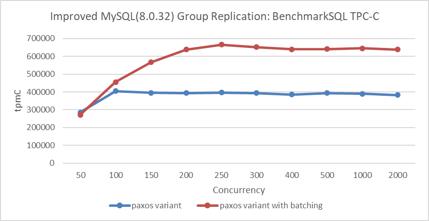

Figure 4-14. Effect of batching on Paxos algorithm performance in LAN environments.

## 4.4 Operating system

An operating system (OS) is system software that manages computer hardware and software resources and provides common services for computer programs [45].

MySQL is primarily deployed on the Linux operating system. To maintain focus, the discussions here are based on scenarios within the Linux operating system environment. This includes CPU scheduling, process and thread models, staged models, memory allocation, and system calls, all of which are closely related to MySQL performance.

### 4.4.1 CPU Scheduling

The job of allocating CPU time to different tasks within an operating system is known as CPU scheduling. The organizational structure of Linux CPUs is illustrated in the figure below [53].

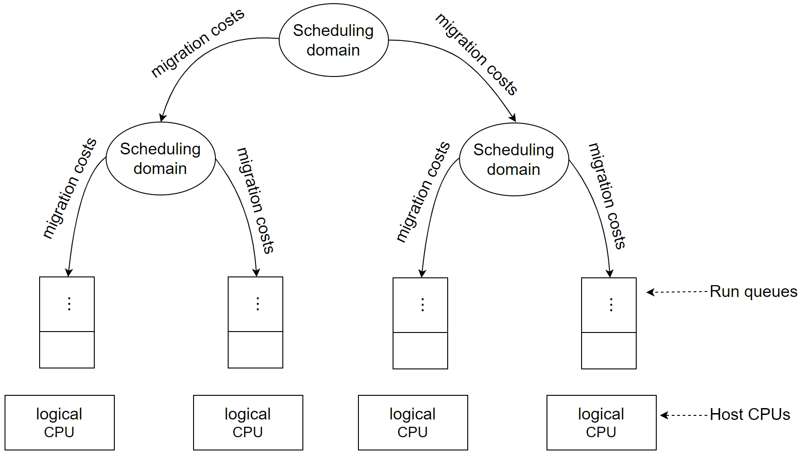

Figure 4-15. Linux CPU scheduling.

Based on the hardware layout of physical cores, the Linux scheduler maintains hierarchically ordered scheduling domains. Basic scheduling domains consist of processes running on physically adjacent cores, such as those on the same chip. Higher-level scheduling domains group these basic domains, such as chips on the same motherboard.

The Linux scheduler operates as a multi-queue scheduler, meaning that each logical host CPU has its own run queue of processes waiting to be executed. Each virtual CPU is queued in one of these run queues. Moving a virtual CPU from one run queue to another is referred to as CPU migration. The scheduler may decide to migrate a virtual CPU when the estimated wait time is too long, the current run queue is full, or another run queue needs to be filled.

Migrating a virtual CPU within the same scheduling domain incurs less cost compared to moving it to a different domain due to the proximity of caches between cores. The Linux scheduler uses detailed information about migration costs between different scheduling domains or CPUs to determine if a migration is beneficial.

Understanding CPU scheduling details is crucial for diagnosing MySQL performance problems. A key question is whether Linux's scheduling mechanisms can effectively manage thousands of concurrent threads in MySQL. Since MySQL operates on a thread-based model, it's important to assess how the Linux scheduler handles such a high volume of threads. Does it simply allocate CPU time evenly among them?

Consider a scenario where there are *N* user threads and *C* CPU cores, with each core supporting dual hyper-threading. Ideally, without considering context switch overhead, each user thread should receive the following CPU execution time per second. 
$$
\frac{2C}{N}
$$
As *N* increases, the average CPU allocation per thread decreases. For example, if *N=100000* and *C=3*, each thread would only receive about 60 microseconds of CPU time per second. Given that context switches typically incur costs in the tens of microseconds range, a significant portion of CPU time would be lost to context switching, thereby reducing overall CPU efficiency.

As the number of user threads increases, the Linux scheduler struggles to manage CPU time effectively, resulting in inefficiencies and performance degradation due to frequent context switches. To address this, the system enforces a minimum execution granularity, ensuring that each process runs for at least 100 microseconds before being preempted. This approach minimizes the inefficiencies of short scheduling intervals. The Completely Fair Scheduler (CFS) uses this minimum granularity to prevent excessive switching costs as the number of runnable processes grows.

At the same time, increasing the number of CPU cores ensures that each user thread receives sufficient execution time. Coupled with maintaining a minimum execution granularity, the cost of context switching can be significantly mitigated.

Next, let's examine the cost of thread blocking. The disadvantage of blocking is the cost of context switching—typically 12-20 microseconds—which must be performed twice per lock handoff (once to sleep, and again to wake) [3]. In general, under the condition of maintaining minimum execution times, the cost of context switching compared to current mainstream hardware environments is already quite minimal. Therefore, employing blocking methods has practical value.

Further examining how Linux CPU schedules threads for running programs, specifics can be seen in the figure below:

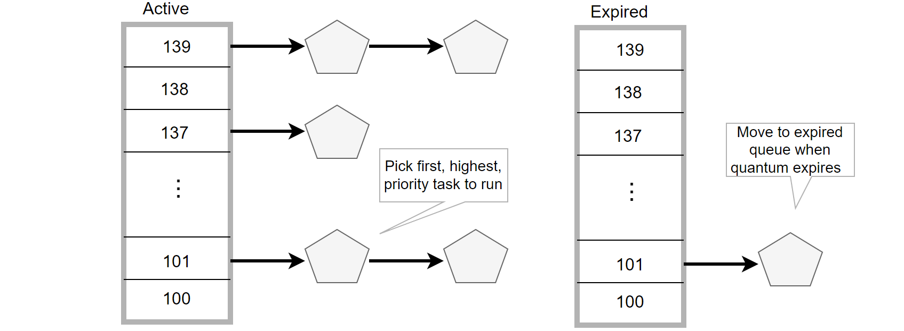

Figure 4-16. How Linux CPU schedules threads for running programs.

The smaller the number, the higher the priority level. The scheduler prioritizes threads with higher priority levels, and after a thread's time slice expires, it is placed in the "expired" queue.

MySQL internal threads can be in different states such as running, waiting for I/O, or waiting for locks. Threads waiting for disk I/O are placed into the corresponding disk wait queue and are not scheduled by the Linux scheduler into the active or expired queues.


Figure 4-17. Linux CPU scheduling of threads waiting for I/O.

This means that these threads waiting for I/O have little impact on other active threads. In MySQL, transaction lock waits function similarly to I/O waits—threads voluntarily block themselves and wait to be activated, which is generally manageable in cases where conflicts are not severe.

It is worth mentioning that it is advisable to avoid having a large number of threads waiting for the same global latch or lock, as this can lead to frequent context switches. In NUMA environments, it can also cause frequent cache migrations, thereby affecting MySQL's scalability.

With the increasing number of CPU cores and larger memory sizes available today, the impact of thread creation costs on MySQL has become smaller. Except for special scenarios such as short connection applications, MySQL can handle a large number of threads given sufficient memory. The key is to limit the number of active threads running concurrently. In theory, MySQL can support thousands of concurrent threads.

Using principles of CPU scheduling, MySQL implements transaction throttling mechanisms, such as limiting the number of threads entering the InnoDB transaction system. This ensures that the concurrency of transactions remains manageable. Too many threads entering InnoDB can lead to latch contention, significantly reducing efficiency.

The following figure illustrates the use of transaction throttling mechanisms to limit a maximum of 512 threads entering the InnoDB storage engine, depicting MySQL's single-instance throughput from 50 to 10,000 concurrency.


Figure 4-18. Maximum TPC-C throughput in BenchmarkSQL with transaction throttling mechanisms.

As illustrated in the figure, TPC-C throughput exceeds 800,000 tpmC even at 10,000 concurrency, showing only a slight decrease from the peak value.

### 4.4.2 Process Model

In Linux, processes and threads are fundamental to multitasking and parallel execution. A process is an independent execution unit with its own memory space, while a thread is a smaller execution unit within a process, sharing its memory space.

**Key differences include:**

-   **Memory Consumption:** Processes require separate memory space, making them more memory-intensive compared to threads, which share the memory of their parent process. A process typically consumes around 10 megabytes, whereas a thread uses about 1 megabyte.
-   **Concurrency Handling:** Given the same amount of memory, systems can support significantly more threads than processes. This makes threads more suitable for applications requiring high concurrency.

When building a concurrent database system, memory efficiency is critical. MySQL's use of a thread-based model offers an advantage over traditional PostgreSQL's process-based model, particularly in high concurrency scenarios. While PostgreSQL's model can lead to higher memory consumption, MySQL's threading model is more efficient in handling large numbers of concurrent connections.

Additionally, although Nginx uses a multi-process model, it achieves scalability through asynchronous programming techniques.

### 4.4.3 Thread Model

For MySQL, the thread-based model is advantageous over the process model due to its theoretical support for tens of thousands of concurrent threads. However, the paper "A Case for Staged Database Systems" highlights some shortcomings of this model [21].

**Challenges of the Thread-Based Model:**

1.  **Cache Performance:** The thread-based execution model often results in poor cache performance with multiple clients.
2.  **Complexity:** The monolithic design of modern DBMS software leads to complex, hard-to-maintain systems.

**Pitfalls of Thread-Based Concurrency:**

1.  **Thread Management:** There is no optimal number of preallocated worker threads for varying workloads. Too many threads can waste resources, while too few restrict concurrency.
2.  **Context Switching:** Context switches during operations can evict a large working set from the cache, causing delays when the thread resumes.
3.  **Cache Utilization:** Round-robin scheduling does not consider the benefit of shared cache contents, leading to inefficiencies.

Despite ongoing improvements in operating systems, the thread model continues to face significant challenges in optimization.

In MySQL, a significant problem occurs when a large number of threads enter the InnoDB transaction system. This increases latch contention and extends the MVCC ReadView global active transaction list, causing frequent cache migrations. This problem is especially pronounced in ultra-high concurrency scenarios. For example, the figure below shows how Group Replication throughput varies with concurrency in a network environment with 10ms latency.

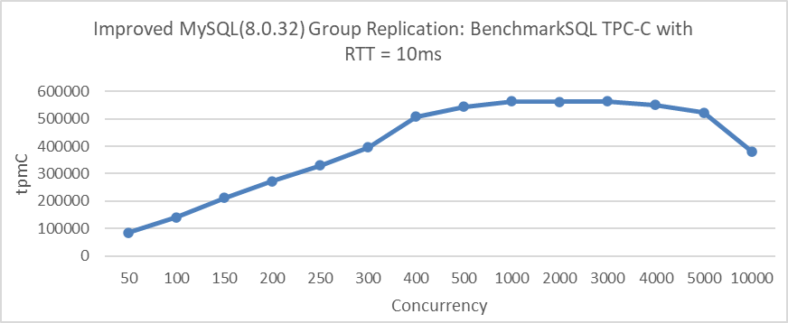

Figure 4-19. Maximum thread scalability of Group Replication under 10ms network latency.

At 5000 concurrency, throughput remains relatively stable. However, beyond this point, throughput declines sharply. In extremely high concurrency scenarios, severe latch conflicts and frequent cache migrations significantly reduce MySQL's efficiency.

### 4.4.4 Staged Model

The staged model is a specialized type of thread model that minimizes some of the drawbacks associated with handling numerous concurrent threads. This model involves breaking the database system into distinct modules, each encapsulated into self-contained stages interconnected through queues. By addressing both hardware and software challenges, the staged model provides effective solutions to the limitations of traditional DBMS designs [21].

**Benefits of the Staged Model**

1.  **Targeted Thread Allocation**: Each stage allocates worker threads based on its specific functionality and I/O frequency, rather than the number of concurrent clients. This approach allows for more precise thread management tailored to the needs of different database tasks, compared to a generic thread pool size.
2.  **Voluntary Thread Yielding**: Instead of preempting a thread arbitrarily, a stage thread voluntarily yields the CPU at the end of its stage code execution. This reduces cache eviction during the shrinking phase of the working set, minimizing the time needed to restore it. This technique can also be adapted to existing database architectures.
3.  **Exploiting Stage Affinity**: The thread scheduler focuses on tasks within the same stage, which helps to exploit processor cache affinity. The initial task brings common data structures and code into higher cache levels, reducing cache misses for subsequent tasks.
4.  **CPU Binding Efficiency**: The singular nature of thread operations in the staged model allows for improved efficiency through CPU binding, which is especially effective in NUMA environments.

The staged model is extensively used in MySQL for tasks such as secondary replay, Group Replication, and improvements to the Redo log in MySQL 8.0. However, it is not well-suited for handling user requests due to increased response times caused by various queues. MySQL primary servers prioritize low latency and high throughput for user-facing operations, while tasks like secondary replay, which do not interact directly with users, can afford higher latency in exchange for high throughput.

The figure below illustrates the processing flow of Group Replication. In this design, Group Replication is divided into multiple subprocesses connected through queues. This staged approach offers several benefits, including:

-   **High Efficiency**: By breaking down tasks into discrete stages, Group Replication can process tasks more effectively.
-   **Cache-Friendly Access**: The design minimizes cache misses by ensuring that related tasks are executed in sequence.
-   **Pipelined Processing**: Tasks are handled in a pipelined manner, allowing for improved throughput

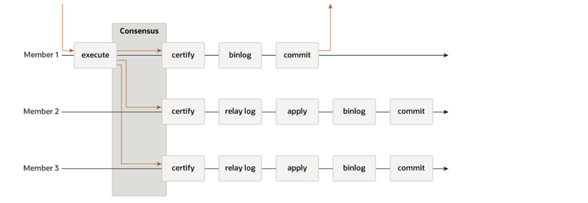

Figure 4-20. MySQL Group Replication protocol.

In the staged model, using a single thread can become a bottleneck when processing large amounts of data. For instance, in the apply replay process shown in the figure, the thread is responsible for both CPU-intensive tasks, such as reading and decoding the relay log, and for scheduling and coordination. This can significantly hinder the performance of MySQL secondary replay, limiting its ability to process data efficiently and quickly.

### 4.4.5 Memory Allocation

The Linux memory management subsystem oversees virtual memory, demand paging, and memory allocation for both kernel structures and user programs. Memory hot-spots often arise from improper data initialization [4], especially under the default first-touch policy, which can lead to uneven memory distribution across NUMA nodes. To mitigate this, initialize data in the computation-partition where it will be used.

Modern CPUs generate high memory request rates that can overwhelm the interconnect or memory controller. NUMA systems, with their numerous hardware threads, face scalability problems due to concurrent memory allocation requests. Solutions include overriding the memory allocator, defining thread placement and affinity schemes, and adjusting OS configurations. Efficient memory allocators are particularly beneficial in NUMA systems where performance penalties from inefficient memory or cache use can be significant.

Linux prioritizes local node allocation and minimizes thread migrations across nodes using scheduling domains. This reduces inter-domain migrations but may affect load balance and performance. To optimize memory usage:

1.  Identify memory-intensive threads.
2.  Distribute them across memory domains.
3.  Migrate memory with threads.

Understanding these memory management principles is crucial for diagnosing and solving MySQL performance problems. Linux aims to reduce process interference by minimizing CPU switches and cache migrations across NUMA nodes.

The figure below illustrates a comparative experiment. The deep blue curve shows the total throughput of running four MySQL instances on a NUMA system without node binding. In contrast, the deep red curve represents the total throughput when each MySQL instance is bound to different NUMA nodes. This latter setup reflects the ideal throughput, as it minimizes CPU scheduling interference between MySQL instances.

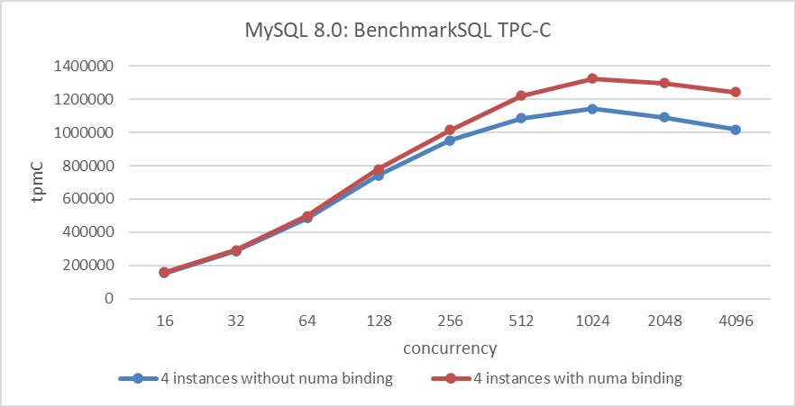

Figure 4-21. Comparing ideal NUMA scheduling with actual Linux scheduling of multiple instances.

Based on the figure, it's evident that while the operating system strives to approach the ideal throughput under low concurrency, the gap widens as concurrency increases. This widening gap occurs because memory scheduling becomes more complex with a higher number of threads.

For MySQL applications, effectively utilizing NUMA-based memory allocation is crucial. Test results indicate that for TPC-C type workloads, disabling NUMA at the BIOS level can improve throughput for MySQL primary servers. This improvement is due to the more favorable memory allocation configuration provided by this setup for MySQL primary and similar applications.

### 4.4.6 System Call

Traditionally, the performance cost of system calls is primarily due to mode switch time. This time includes executing the system call instruction in user mode, transitioning to kernel mode, and eventually returning to user mode. Modern processors handle this mode switch as a processor exception, which involves flushing the user-mode pipeline, saving registers to the kernel stack, changing the protection domain, and directing execution to the exception handler. After this, a return from exception is needed to resume execution in user mode [17].

Frequent system calls can significantly impact MySQL's performance. For example, Percona's thread pool relies on system calls that introduce significant overhead, potentially reducing some of the performance gains from the thread pool.

## 4.5 Compiler Theory

Compiler Theory is a crucial computer science course that covers the fundamental principles and methods of compiler construction. It includes topics such as language and grammar, lexical analysis, syntax analysis, syntax-directed translation, intermediate code generation, memory management, code optimization, and target code generation. Central to the course is the finite state machine.

### 4.5.1 Finite State Machine

A finite state machine (FSM) is a mathematical model used to represent a finite number of states, transitions, and actions within a system. FSMs are essential in various fields such as compilers, network protocols, and game engines, where they describe complex systems, algorithms, and event responses. The core concept of FSMs is state transition, which defines the relationships and actions between different states.

In MySQL, FSMs play a crucial role in lexical and syntax analysis, as well as in Group Replication. For example, in Group Replication, FSMs help manage decisions during Paxos handling, such as whether to continue processing or to exit with an error if memory allocation fails. Typically, if a state cannot continue processing, it exits with an error to prevent Byzantine faults.

FSMs are also used in TCP/IP protocols to detect abnormal states. For instance, a high number of *CLOSE WAIT* states on server-side TCP connections can indicate that many connections have not been closed properly.

### 4.5.2 MySQL Parser

The MySQL Parser, implemented in C/C++, uses GNU Bison and Flex for parsing SQL queries. Flex generates tokens, while Bison handles syntax parsing. SQL parsing is crucial for operations like read/write evaluations by MySQL proxy and translating SQL into syntax trees.

With the increase in CPU core count, the CPU overhead for MySQL parsing has become a smaller proportion of overall usage. This reduction in overhead might explain why MySQL 8.0 removed the query cache.

### 4.5.3 PGO

Profile-guided optimization (PGO) is a compiler technique that improves program performance by using profiling data from test runs of the instrumented program. Rather than relying on programmer-supplied frequency information, PGO leverages profile data to optimize the final generated code, focusing on frequently executed areas of the program. This method reduces reliance on heuristics and can improve performance, provided the profiling data accurately represents typical usage scenarios.

Extensive practice has shown that MySQL's large codebase is especially well-suited for PGO. However, the effectiveness of PGO can be influenced by I/O storage devices and network latency. On systems with slower I/O devices, like hard drives, I/O becomes the primary bottleneck, limiting PGO's performance gains due to Amdahl's Law. In contrast, on systems with faster I/O devices such as SSDs, PGO can lead to substantial performance improvements. Network latency also affects PGO effectiveness, with higher latency generally reducing the benefits.

In summary, while MySQL 8.0's PGO capabilities can greatly improve computational performance, the actual improvement depends on the balance between computational and I/O bottlenecks in the server setup. The following figure demonstrates that with SSD hardware configuration and NUMA binding, PGO can significantly improve the performance of MySQL.

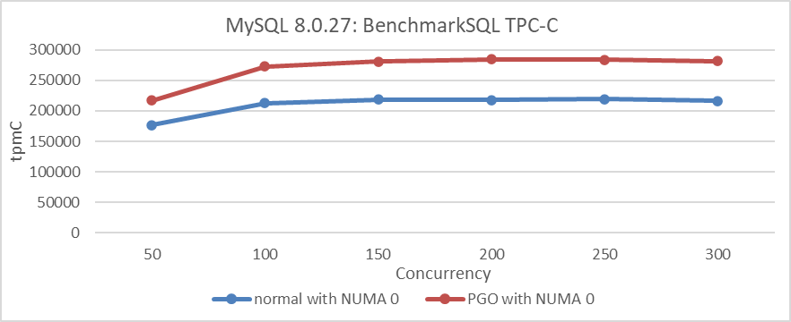

Figure 4-22. Performance comparison tests before and after using PGO in MySQL 8.0.27 under SMP.

## 4.6 Queueing Theory

Queueing theory is the mathematical study of waiting lines or queues, used to predict queue lengths and waiting times [45]. It is widely applied in computer science and information technology. For example, in networking, routers and switches rely on queues to manage packet transmission. By applying queueing theory, designers can optimize these systems for responsive performance and efficient resource utilization. Although queueing theory is not specifically designed to improve software performance, it serves as a model for evaluating system efficiency by examining how resources, both physical and logical, are utilized. According to queueing theory, almost any resource can be viewed as a queue, and bottleneck resources can be analyzed this way to better understand their characteristics.

### 4.6.1 Single Queue Bottleneck

The following figure depicts a scenario where MySQL primary and MySQL secondary form a two-node cluster under a network latency of 10ms.

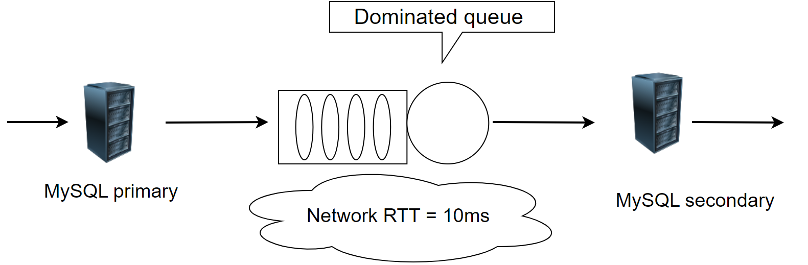

Figure 4-23. Testing architecture for Group Replication with pure Paxos protocol

The cluster's Paxos algorithm employs a modified Mencius approach, removing batching and pipelining, making it similar to pure Paxos. Tests were conducted at various concurrency levels under a network latency of 10ms, as illustrated in the following figure:

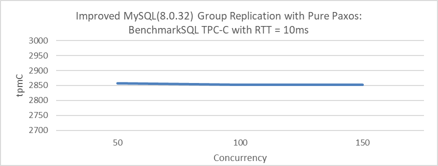

Figure 4-24. Results of testing Group Replication with pure Paxos protocol

In a WAN testing scenario, the throughput remains nearly constant across different concurrency levels—50, 100, or 150—because the time MySQL takes to process TPC-C transactions is negligible compared to the network latency of 10ms. This network latency dominates the overall transaction time, making the impact of concurrency changes relatively insignificant.

The throughput calculation formula in such scenarios simplifies to:

$$
tpmTOTAL ≈ 60 × \frac{1}{N e t w o r k \  L a t e n c y} = 60 × \frac{1}{0 . 0 1} = 6000
$$

$$
tpmC≈tpmTOTAL×0.45=6000×0.45=2700
$$

This closely matches the test results above, where 0.45 is an empirical factor derived from extensive testing that represents the ratio of tpmC to tpmTOTAL. The tests indicate that, under a 10ms network latency with no additional bottlenecks, throughput remains consistent across different concurrency levels. This consistency is due to the serial nature of Paxos communication, as batching and pipelining are not employed. Confirmation of these findings is supported by packet capture analysis.


Figure 4-25. Insights into the pure Paxos protocol from packet capture data.

In the figure, the network latency between the two Paxos instances is approximately 10ms, matching the exact network delay. Numerous examples suggest that pure Paxos communication is inherently serial. In scenarios where network latency is the predominant factor, it acts as a single queue bottleneck. Consequently, regardless of concurrency levels, the throughput of pure Paxos is limited by this network latency.

### 4.6.2 Multiple Queue Bottlenecks

A complex program often involves multiple queues, and unless one queue dominates, several bottlenecks can exist simultaneously. The figure below illustrates a basic server queue model with a single CPU and two disks. When the CPU is busy, requests are queued, and the same happens when accessing the disks. In this model, queueing theory can be applied to calculate the server's throughput capacity.

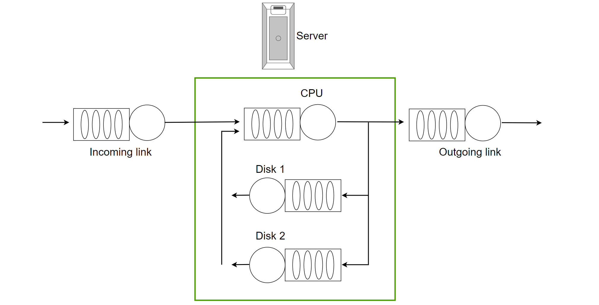

Figure 4-26. A basic server queue model with single CPU and dual Disks.

In modern NUMA environments with abundant CPUs and cross-NUMA access interference, directly calculating system throughput using queueing theory can be challenging. For instance, the following figure illustrates the latch queue model of MySQL 5.7.


Figure 4-27. The latch queue model in MySQL 5.7.

This involves the latch queue bottlenecks within the InnoDB storage engine, a significant scalability problem in MySQL 5.7. In this queue model, addressing individual bottlenecks alone is insufficient to solve scalability problems, and accurately assessing the impact of these queue bottlenecks on throughput remains challenging.

### 4.6.3 The Mutual Influence Between Different Queue Bottlenecks

The following figure is a simplified example of a multi-queue model in a NUMA environment.

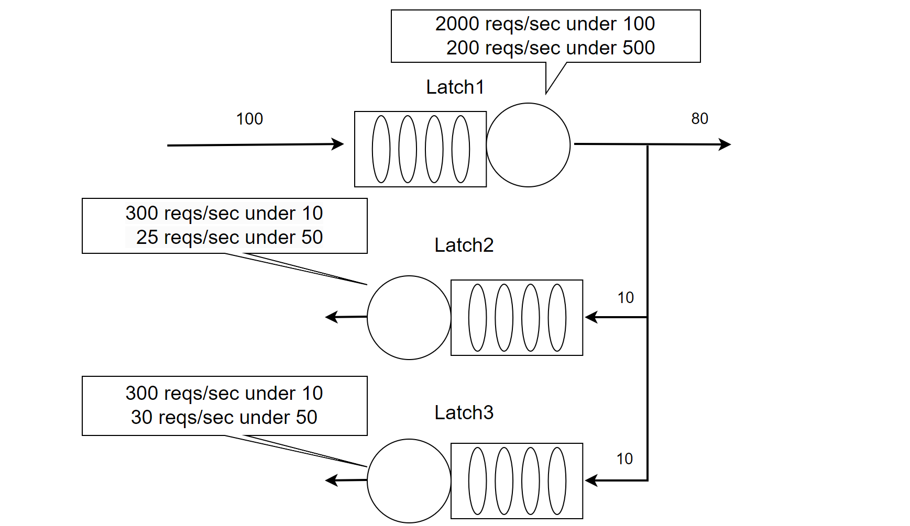

Figure 4-28. A multi-queue model in a NUMA Environment.

In the case of 100 concurrent threads, the latch1 queue can handle 2,000 requests per second. However, with 500 concurrent threads, its throughput drops to only 200 requests per second. This discrepancy arises because increased conflicts lead to significant context switching, causing cache content to migrate across NUMA nodes, which sharply reduces memory access efficiency. As concurrency rises, this inefficiency grows, leading to a notable decline in throughput.

Under normal conditions, with 100 concurrent threads passing through latch1, 10 threads typically proceed to latch2 and another 10 to latch3. Both latch2 and latch3 can handle 300 requests per second with 10 concurrent threads, meaning that no bottlenecks are encountered.

When 500 concurrent threads interact with latch1, the increased conflicts result in fewer requests successfully passing through, leading to reduced throughput. After identifying and optimizing latch1 (as shown in the figure below), its throughput capacity increased significantly: it can now handle 1,000 requests per second with 500 concurrent threads. This optimization has effectively mitigated the previous performance degradation caused by latch1 conflicts.

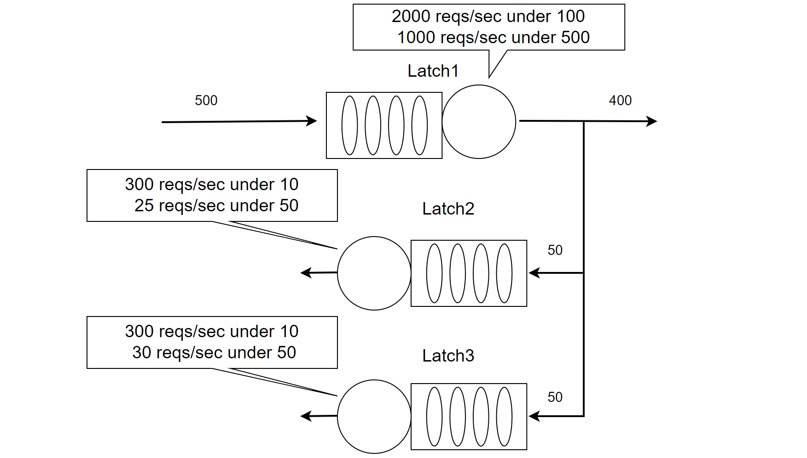

Figure 4-29. A multi-queue model mitigating latch1 bottleneck in NUMA environments.

With 500 concurrent threads reaching the latch1 queue, the improved processing efficiency allows 50 threads to progress to latch2 and another 50 to latch3. However, severe conflicts at both latch2 and latch3 reduce their processing capacities to just 25 and 30 requests per second, respectively. This disrupts the balance of latch2 and latch3 queues, which were stable before optimizing latch1.

In the scenario of multi-queue bottlenecks, optimizing one bottleneck may not necessarily lead to an increase in overall throughput; it could potentially even decrease throughput. Real-life examples of this include instances where Profile-Guided Optimization (PGO) led to decreased throughput under high concurrency, illustrating this phenomenon.

Let's review again the throughput situation under high concurrency after applying PGO:

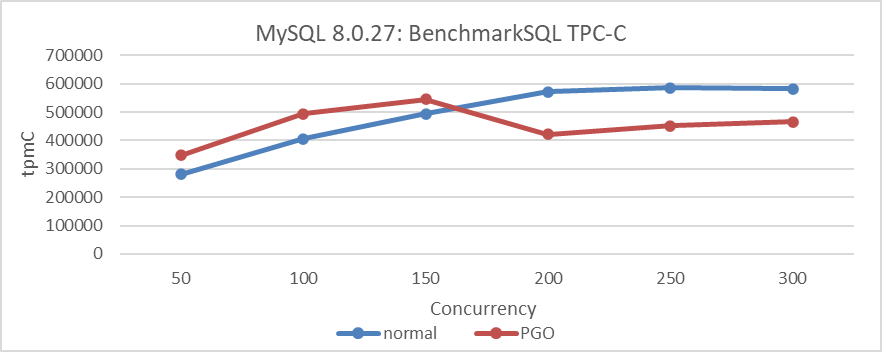

Figure 4-30. Performance comparison tests before and after using PGO in MySQL 8.0.27.

Profile-Guided Optimization (PGO) accelerates CPU computation efficiency, enabling a larger number of threads to enter the latch queue earlier under high concurrency. This exacerbates latch conflicts compared to the pre-optimization state, leading to decreased throughput. Interestingly, when PGO is disabled, throughput decreases under low concurrency but increases under high concurrency. This counterintuitive phenomenon is common when multi-queue bottlenecks coexist.

Let's examine the performance comparison before and after redo log optimization:

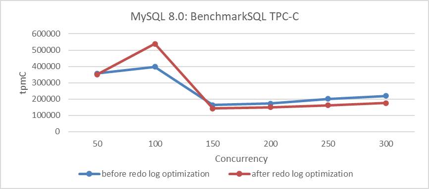

Figure 4-31. Performance comparison tests before and after redo log optimization in MySQL 8.0.

The figure shows that performance improves under low concurrency but decreases under high concurrency. This repeatedly tested phenomenon indicates that not all optimizations show immediate results; eliminating disturbances is crucial to observe true effectiveness. These problems often occur in NUMA environments, so mitigating NUMA compatibility problems is essential to avoid misjudgments in performance optimization. Developers' reliance on data can overlook the real reasons for performance declines, leading to missed optimization opportunities.

### 4.6.4 The Relationship Between Resource Utilization and Response Time

According to queueing theory, as resource utilization increases, average response time also increases, and as utilization approaches 100%, average response time deteriorates sharply. The following figure shows concurrent tests on CPU resources using SysBench, displaying the relationship between average response time and CPU utilization. Initially, the average response time increases slowly. However, around 60% CPU utilization, the curve sharply rises, reaching over 13 milliseconds at 96% utilization.

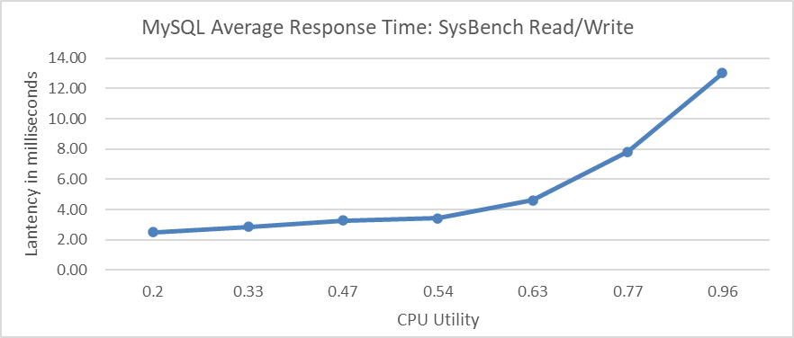

Figure 4-32. Relationship between average response time and CPU utilization.

If resources are depleted, such as running out of memory, the machine's response time can become very slow. Therefore, controlling resource utilization is essential. According to queueing theory, for MySQL OLTP systems, maintaining response times requires keeping utilization within certain limits. Finding the optimal utilization point is crucial to maintain efficiency, which is the basis of transaction throttling theory. While queueing theory doesn't directly solve problems, it provides guidance for performance optimization and deepens the understanding of system performance.

### 4.6.5 Transaction Throttling Mechanism

To prevent performance degradation, controlling resource usage is crucial. For MySQL OLTP applications, managing concurrency entering the transaction system is key due to multiple latch queue bottlenecks and the replication of global active transaction lists.

A practical transaction throttling mechanism for MySQL is as follows:

1.  Before entering the transaction system, check if the number of concurrent processing threads exceeds the limit.
2.  If the limit is exceeded, block the user thread until other threads activate this thread.
3.  If the limit is not exceeded, allow the thread to proceed with processing within the transaction system.
4.  Upon transaction completion, activate the first transaction in the waiting queue.

This approach helps maintain performance by controlling concurrency and managing resource usage effectively. The following figure illustrates the relationship between TPC-C throughput and concurrency under transaction throttling conditions, with 1000 warehouses.


Figure 4-33. Maximum TPC-C throughput in BenchmarkSQL with transaction throttling mechanisms.

From the figure, it is evident that implementing transaction throttling mechanisms significantly improves MySQL's scalability.

## 4.7 Computer Networking

Computer networking can be considered a branch of computer science, computer engineering, and telecommunications, as it relies on the theoretical and practical application of these disciplines. The field has been shaped by numerous technological developments and historical milestones [45].

In schools, networking courses often teach the theory, but they don't usually show students how to actually analyze and solve network problems. Consequently, when problems arise, many feel lost and lack the logical thinking skills needed for effective problem-solving. While network knowledge can be acquired at any time, identifying the correct approach to problem-solving requires extensive practice. A correct approach ensures smooth problem resolution, whereas a wrong direction can significantly increase the difficulty of solving problems.

This section discusses common theories, techniques, network partitioning, and logical reasoning used to address MySQL-related problems in the context of networking.

### 4.7.1 FLP Impossibility Theory

In a fully asynchronous message-passing distributed system with potential process crash failures, the 1985 FLP impossibility result by Fischer, Lynch, and Paterson proves that achieving consensus with a deterministic algorithm is impossible. However, practitioners often disregard this result because real systems usually exhibit some level of synchrony. The worst-case scheduling scenarios posited by the FLP result are unlikely to occur in practice, except in adversarial situations like an intelligent denial-of-service attack [46].

The FLP impossibility theorem is valuable in problem-solving as it highlights the challenge of distinguishing between lost and delayed messages in a network. In practice, while message delays are typically bounded, delays in systems like MySQL can be prolonged, making it difficult to tell if a node's information is lost or simply delayed. Misjudgments here can lead to errors, such as Group Replication incorrectly reporting nodes as unreachable.

The Mencius algorithm used in Group Replication addresses the FLP impossibility by using a failure detector oracle to bypass the result. Like Paxos, it relies on the failure detector only for liveness. Mencius requires that eventually, all and only faulty servers are suspected by the failure detector. This can be achieved by implementing failure detectors with exponentially increasing timeouts [32].

To avoid the problems posed by the FLP impossibility, careful design is needed. TCP, for example, addresses this with timeout retransmission and idempotent design, ensuring that even if duplicate messages are received due to transmission errors, they can be safely discarded.

### 4.7.2 TCP/IP Protocol Stack

The Internet protocol suite, commonly known as TCP/IP, organizes the set of communication protocols used in the Internet and similar computer networks [45]. It provides end-to-end data communication, specifying how data should be packetized, addressed, transmitted, routed, and received. The suite is divided into four abstraction layers, each classifying related protocols based on their networking scope:

1.  **Link Layer**: Handles communication within a single network segment (link).
2.  **Internet Layer**: Manages internetworking between independent networks.
3.  **Transport Layer**: Facilitates host-to-host communication.
4.  **Application Layer**: Enables process-to-process data exchange for applications.

An implementation of these layers for a specific application forms a protocol stack. The TCP/IP protocol stack is one of the most widely used globally, having operated successfully for many years since its design. The following figure illustrates how a client program interacts with a MySQL Server using the TCP/IP protocol stack.


Figure 4-34. A client program interacts with a MySQL Server using the TCP/IP protocol stack.

Due to the layered design of the TCP/IP protocol stack, a client program typically interacts only with the local TCP to access a remote MySQL server. This design is elegant in its simplicity:

1.  **Client-Side TCP**: Handles sending SQL queries end-to-end to the remote MySQL server. It manages retransmission if packets are lost.
2.  **Server-Side TCP**: Receives the SQL queries from the client-side TCP and forwards them to the MySQL server application. After processing, it sends the response back through its TCP stack.
3.  **Routing and Forwarding**: TCP uses the IP layer for routing and forwarding, while the IP layer relies on the data link layer for physical transmission within the same network segment.

Although TCP ensures reliable transmission, it cannot guarantee that messages will always reach their destination due to potential network anomalies. For example, SQL requests might be blocked by a network firewall, preventing them from reaching the MySQL server. In such cases, the client application might not receive a response, leading to uncertainty about whether the request was processed or still in transit.

To address these problems, additional tools like packet capture can help determine if SQL requests have reached the MySQL server, thereby clarifying the situation.

### 4.7.3 TCP State Machine

The following figure depicts the classic TCP state machine used for transitions between TCP states.

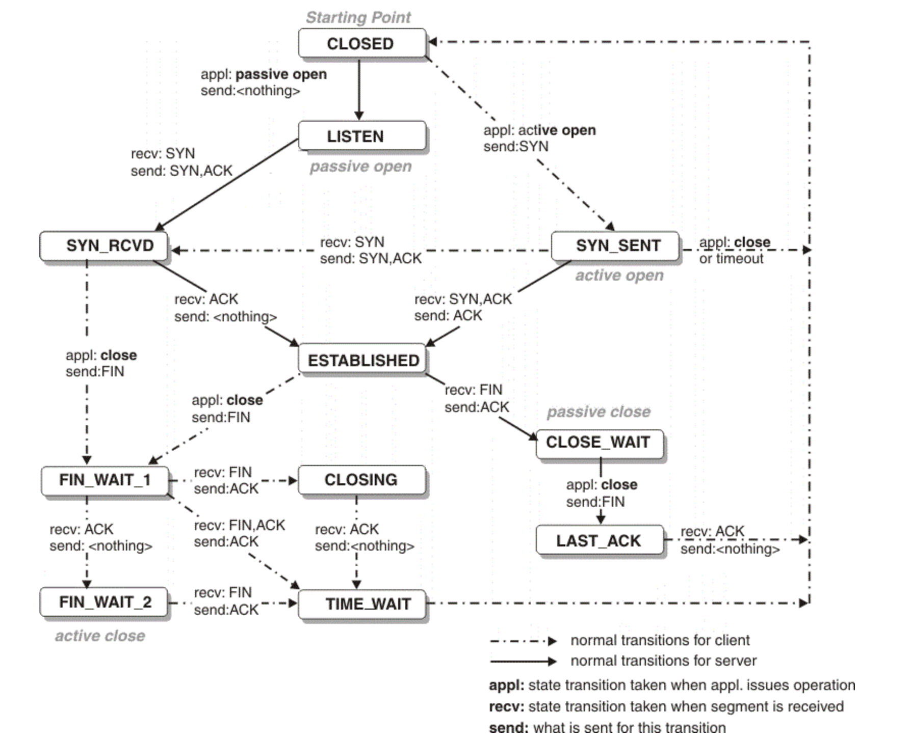

Figure 4-35. Classic TCP state machine overview.

A flexible understanding of state transitions is crucial for troubleshooting MySQL network problems. For example:

-   **CLOSE_WAIT State**: A large number of *CLOSE_WAIT* states on the server indicates that the application did not close connections promptly or failed to initiate the close process, causing connections to linger in this state.
-   **SYN_RCVD State**: Numerous *SYN_RCVD* states may suggest a SYN flood attack, where an excessive number of SYN requests overwhelm the server's capacity to handle them effectively.

Understanding these state transitions helps in diagnosing and addressing network-related problems more effectively.

### 4.7.4 Will Data Content Be Corrupted During Network Transmission?

Many software professionals analyzing MySQL network problems often suspect data corruption during transmission, leading to questions about TCP reliability.

In the TCP/IP protocol stack, IP networks are unreliable, while TCP ensures reliability. How does TCP ensure reliable transmission to the user program? There are two main scenarios: packet loss and data corruption. When facing packet loss in an IP network, TCP employs a mechanism called timeout and retransmission. According to the FLP impossibility theorem, even if intermediate devices introduce delays, retransmitted data packets, including those from before, are likely to reach the destination. TCP achieves idempotency in receiving information based on sequence numbers and payload lengths, effectively solving problems caused by packet loss and delay. For data corruption, TCP uses checksum verification. If a discrepancy is detected, corrupted data is discarded, and the sender retransmits the data.

However, TCP transmission is not immune to security risks. Checksum verification is provided, but it can't ensure security against intentional tampering by intermediate devices that alter both payload and checksum simultaneously. This is why TLS/SSL protocols were developed to enhance data security, though they can complicate problem analysis in typical situations.

### 4.7.5 Batching and Pipelining

Paxos is a widely used state machine replication protocol, and its performance can be significantly enhanced through batching and pipelining optimizations. However, tuning these optimizations for optimal performance can be complex, as their effectiveness is influenced by various factors including network latency and bandwidth, node speeds, and application properties.

Below is a comparison test in LAN environments using BenchmarkSQL for TPC-C. There are 1000 warehouses, and concurrency ranges from 50 to 2000. Deep blue represents throughput without batching, while deep red represents throughput with batching.


Figure 4-36. Effect of batching on Paxos algorithm performance in LAN environments.

From the figure, it is clear that batching significantly increases throughput under high concurrency. In a LAN environment, does pipelining also have a similar effect? The following figure presents comparative tests conducted without batching to evaluate whether pipelining alone can also substantially boost throughput.


Figure 4-37. Effect of pipelining on Paxos algorithm performance in LAN environments.

From the figure, it is clear that while pipelining does improve TPC-C throughput in LAN environments, the improvement is relatively modest. Interestingly, in LAN environments with batching already enabled, adding pipelining offers little additional benefit, as shown in the following figure.


Figure 4-38. Effect of pipelining on batched Paxos algorithm performance in LAN environments.

How does pipelining perform in WAN environments? Let's explore its impact. The following figure shows the throughput of 1000 concurrency under different numbers of pipelining, with a network latency of 10ms and Paxos algorithm enabling batching.


Figure 4-39. Effect of pipelining on batched Paxos algorithm performance in WAN environments.

From the figure, it is clear that with just one pipelining, throughput is relatively low at 60,051 tpmC. With ten pipelinings, throughput increases significantly to 476,783 tpmC. However, increasing the pipelining to twenty shows little difference compared to having 10 pipelinings.

Let's continue delving into batching in WAN environments. The following figure shows the comparison of throughput for 1000 concurrency before and after enabling batching, with pipelining disabled and a network latency of 10ms.


Figure 4-40. Effect of batching on Paxos algorithm performance in WAN environments.

From the figure, it is evident that with both pipelining and batching disabled, throughput drops to just 2833 tpmC. This figure reflects the performance of the pure Paxos algorithm in WAN environments, where throughput is notably low.

Why does pure Paxos perform poorly in WAN environments? Refer to the packet capture details in the following figure for insights.


Figure 4-41. Insights into the pure Paxos protocol from packet capture data.

From the figure, it is evident that the delay between two Paxos instances is around 10ms, matching the network latency. The low throughput of pure Paxos stems from its serial interaction nature, where network latency primarily determines throughput.

In general, the test conclusions of pipelining and batching are consistent with the conclusions in the following paper [48]:

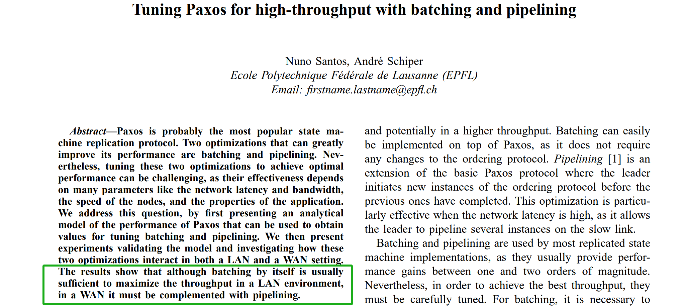

Figure 4-42. Impact of pipelining and batching on Paxos performance.

### 4.7.6 Impact of Network Latency on Performance

Network latency critically affects MySQL performance. In a localhost test case with 1000 warehouses, the MySQL instance bound to NUMA nodes 0, 1, and 2, and BenchmarkSQL on NUMA node 3, latency's impact on throughput is examined across concurrency levels of 50, 100, and 150.


Figure 4-43. Impact of network latency on performance.

Testing in a localhost scenario can significantly reduce network latency. From the figure, it can be seen that reducing network latency has a noticeable impact on MySQL throughput, reaching 800,000 tpmC at 150 concurrency. Higher concurrency was not tested because MySQL throughput was nearing its bottleneck with the utilization of three NUMA nodes. This bottleneck would interfere with assessing the impact of network latency on throughput.

### 4.7.7 Network Partition

Network partitioning is a network failure that splits members into groups, preventing direct communication between groups [45].

Network partitioning can be categorized into three main types [6], as shown in the figure below.


Figure 4-44. Network partitioning types.

The figure categorizes network partitions into three types:

1.  **Complete Network Partition (a)**: Two partitions are completely disconnected from each other, widely recognized as a complete network partition.
2.  **Partial Network Partition (b)**: Group 1 and Group 2 are disconnected from each other, but Group 3 can still communicate with both. This is termed a partial network partition.
3.  **Simplex Network Partition (c)**: Communication is possible in one direction but not the other, known as a simplex network partition.

The most complex type is the partial network partition. Partial partitions isolate a set of nodes from some, but not all, nodes in the cluster, leading to a confusing system state where nodes disagree on whether a server is up or down. These disagreements are poorly understood and tested, even by expert developers [6].

For high-availability components like Group Replication, testing is extremely challenging. Without theoretical support, one might not even consider that network partitions come in three types. The second and third types of scenarios are generally the most problematic because they are often either untested or not thoroughly tested. Networks are complex, and diagnosing problems, especially with network partitions, can be especially challenging. However, there is logic behind it, and solving network partition problems typically requires gathering information and logical reasoning.

### 4.7.8 RDMA

Remote Direct Memory Access (RDMA) enables direct memory access between two computers without involving the operating system, cache, or storage. Unlike traditional IP communication, RDMA bypasses kernel intervention, reducing CPU overhead. The RDMA protocol allows the host adapter to place network packets directly into the application's memory space, bypassing kernel processing and copying. This requires applications to implement the InfiniBand Verbs API.

While RDMA significantly reduces TCP processing latency and increases MySQL throughput in LAN scenarios, its effectiveness is limited in cross-datacenter environments due to network latency. Additionally, the high cost of modifying MySQL limits RDMA's adoption in practical use cases.

### 4.7.9 The Importance of Packet Capture Information

Due to the complexity of network problems and the lack of effective information support for software professionals, there is a continuous risk of misjudgment and falling into traps of obscure problems. To effectively solve MySQL-related network problems, reliable and accurate information is essential for confidently moving towards a successful resolution. Mastering packet capture analysis is crucial for tackling these obscure network problems and can often play a decisive role in the resolution process.

To capture packets specifically for MySQL interactions, the following command can be used, assuming 3306 is MySQL's listening port:

```
tcpdump -i any tcp and port 3306 -s 250 -w mysql.pcap -v
```

For more advanced features, refer to the *tcpdump* documentation for detailed commands. While solving complex network problems can be challenging, packet capture itself remains relatively straightforward.

### 4.7.10 Logical Reasoning in Network Problems

Many software professionals lack in-depth knowledge of TCP/IP logic reasoning, which often leads to misidentifying problems as mysterious problems. Some are discouraged by the complexity of TCP/IP networking literature, while others are misled by confusing details in Wireshark. For instance, a DBA facing performance problems might misinterpret packet capture data in Wireshark, erroneously concluding that TCP retransmissions are the cause.

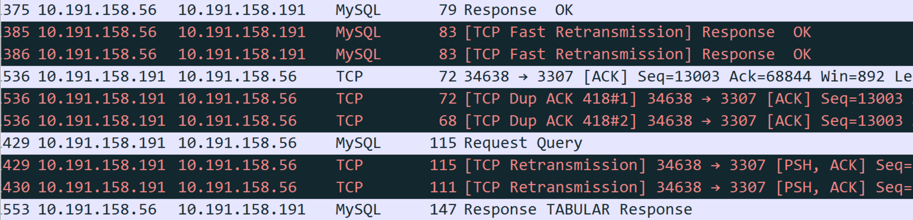

Figure 4-45. Packet capture screenshot provided by DBA suspecting retransmission problems.

Since retransmission is suspected, it's essential to understand its nature. Retransmission fundamentally involves timeout retransmission. To confirm if retransmission is indeed the cause, time-related information is necessary, which is not provided in the screenshot above. After requesting a new screenshot from the DBA, the timestamp information was included.


Figure 4-46. Packet capture screenshots with time information added.

When analyzing network packets, timestamp information is crucial for accurate logical reasoning. A time difference in the microsecond range between two duplicate packets suggests either a timeout retransmission or duplicate packet capture. In a typical LAN environment with a Round-trip Time (RTT) of around 100 microseconds, where TCP retransmissions require at least one RTT, a retransmission occurring at just 1/100th of the RTT likely indicates duplicate packet capture rather than an actual timeout retransmission.

Another classic case illustrates the importance of logical reasoning in network problem analysis.

One day, one business developer came rushing over, saying that a scheduled script using the MySQL database middleware had failed in the early morning hours with no response. Upon hearing about the problem, I checked the error logs of the MySQL database middleware but found no valuable clues. So, I asked the developers if they could reproduce the problem, knowing that once reproducible, a problem becomes easier to solve.

The developers tried multiple times to reproduce the problem but were unsuccessful. However, they made a new discovery: they found that executing the same SQL queries during the day resulted in different response times compared to the early morning. They suspected that when the SQL response was slow, the MySQL database middleware was blocking the session and not returning results to the client.

Based on this insight, the database operations team were asked to modify the script's SQL to simulate a slow SQL response. As a result, the MySQL database middleware returned the results without encountering the hang problem seen in the early morning hours.

For a while, the root cause couldn't be identified, and developers discovered a functional problem with the MySQL database middleware. Therefore, developers and DBA operations became more convinced that the MySQL database middleware was delaying responses. In reality, these problems were not related to the response times of the MySQL database middleware.

From the events of the first day, the problem did indeed occur. Everyone involved tried to pinpoint the cause, making various guesses, but the true reason remained elusive.

The next day, developers reported that the script problem reoccurred in the early morning, yet they couldn't reproduce it during the day. Developers, feeling pressured as the script was soon to be used online, complained about the situation. My only suggestion was for them to use the script during the day to avoid problems in the early morning. With all suspicions focused on the MySQL database middleware, it was challenging to analyze the problem from other perspectives.

As a developer responsible for the MySQL database middleware, such mysterious problems cannot be easily overlooked. Ignoring them could impact subsequent use of the MySQL database middleware, and there is also pressure from leadership to solve the problem promptly. Finally, it was decided to implement a low-cost packet capture analysis solution: during the execution of the script in the early morning, packet captures would be performed on the server to analyze what was happening at that time. The goal was to determine if the MySQL database middleware either failed to send a response at all or if it did send a response that the client script did not receive. Once it could be confirmed that the MySQL database middleware did send a response, the problem would not be attributed to the MySQL database middleware developers.

On the third day, developers reported that the early morning problem did not recur, and packet capture analysis confirmed that the problem did not occur. After careful consideration, it seemed unlikely that the problem was solely with the MySQL database middleware: frequent occurrences in the early morning and rare occurrences during the day were puzzling. The only course of action was to wait for the problem to occur again and analyze it based on the packet captures.

On the fourth day, the problem did not surface again.

However, on the fifth day, the problem finally reappeared, bringing hope for resolution.

The packet capture files are numerous. First, ask the developers to provide the timestamp when the problem occurred, then search through the extensive packet capture data to identify the SQL query that caused the problem. The final result is as follows:


Figure 4-47. Key packet information captured for problem resolution.

From the packet capture content above (captured from the server), it appears that the SQL query was sent at 3 AM. The MySQL database middleware took 630 seconds (03:10:30.899249-03:00:00.353157) to return the SQL response to the client, indicating that the MySQL database middleware did indeed respond to the SQL query. However, just 238 microseconds later (03:10:30.899487-03:10:30.899249), the server's TCP layer received a reset packet, which is suspiciously quick. It's important to note that this reset packet cannot be immediately assumed to be from the client.

Firstly, it is necessary to confirm who sent the reset packet—either it was sent by the client or by an intermediate device along the way. Since packet capture was performed only on the server side, information about the client's packet situation is not available. By analyzing the packet capture files from the server side and applying logical reasoning, the aim is to identify the root cause of the problem.

If the assumption is made that the client sent a reset, it would imply that the client's TCP layer no longer recognizes the TCP state of this connection—transitioning from an established state to a nonexistent one. This change in TCP state would notify the client application of a connection problem, causing the client script to immediately error out. However, in reality, the client script is still waiting for the response to come back. Therefore, the assumption that the client sent a reset does not hold true—the client did not send a reset. The client's connection is still active, but on the server side, the corresponding connection has been terminated by the reset.

Who sent the reset, then? The primary suspect is Amazon's cloud environment. Based on this packet capture analysis, the DBA operations queried Amazon customer service and received the following information:


Figure 4-48. Final response from Amazon customer service.

Customer service's response aligns with the analysis results, indicating that Amazon's ELB (Elastic Load Balancer, similar to LVS) forcibly terminated the TCP session. According to their feedback, if a response exceeds the 350-second threshold (as observed in the packet capture as 630 seconds), Amazon's ELB device sends a reset to the responding party (in this case, the server). The client scripts deployed by the developers did not receive the reset and mistakenly assumed the server connection was still active. Official recommendations for such problems include using TCP keepalive mechanisms to mitigate these problems.

With the official response obtained, the problem was considered fully solved.

This specific case illustrates how online problems can be highly complex, requiring the capture of critical information—in this instance, packet capture data—to understand the situation as it occurred. Through logical reasoning and the application of reductio ad absurdum, the root cause was identified.

## 4.8 Performance Optimization

Optimizing code performance requires logical reasoning. Programmers must analyze efficiency, evaluate trade-offs, and make informed decisions to improve performance. This helps identify bottlenecks, optimize algorithms, and efficiently use resources [56]. Inefficient code sequences, or performance bugs, cause significant degradation and resource waste, reducing throughput, increasing latency, and frustrating users, leading to financial losses. Diagnosing these bugs is challenging due to non-fail-stop symptoms, often requiring months of expert effort [62].

### 4.8.1 Performance Optimization Flowchart

For performance optimization, the process can be simplified into the following flowchart [40]:


Figure 4-49. Performance optimization flowchart.

When assessing a new performance optimization feature, first test its impact in an SMP environment. If there is no improvement in an SMP environment but an overall improvement in a NUMA environment, the feature may be related to scalability. Conduct theoretical analysis to understand the improvement mechanism. If it can be theoretically explained, the optimization is valid; if not, it is likely ineffective. If the feature doesn't improve performance, look for new optimization opportunities through extensive testing and comparisons. Both performance gains and losses can reveal potential optimization areas. For instance, if a new memory allocation tool causes a performance drop, this indicates its significant impact, necessitating finding the optimal tool. Upon identifying substantial optimization opportunities, evaluate the trade-offs to determine the best method. For example, if PGO decreases throughput under high concurrency, this presents an optimization opportunity. Solutions might include reducing processing time in critical sections through better data structures and algorithms or completely eliminating latches, which involves extensive code modifications and complex logic, making maintenance challenging.

If optimization opportunities are still not captured, redesign may be necessary. For example, Group Replication adopts an architecture based on the "bucket principle", as illustrated in the figure below:


Figure 4-50. Illustration of the "bucket principle".

The "bucket principle" refers to a barrel made up of multiple staves of wood, where the amount of water it can hold is determined by its shortest stave, not the longest. For Group Replication, according to the "bucket principle", performance is determined by the slowest node in the cluster, often leading to performance that falls short of semisynchronous replication. Without altering the design, finding optimization points becomes difficult. Therefore, a redesign of Group Replication is necessary to fully address the performance deficiencies inherent in the certification database based on the "bucket principle".

### 4.8.2 Throughput vs. Response Time

Throughput and response time have a generally reciprocal but subtly complex relationship [33]. Throughput focuses on resource utilization, examining how effectively server resources process tasks. Response time emphasizes user request responsiveness, impacting user experience.

In performance optimization, two main goals are:

1.  **Optimal response time:** Minimize waiting for task completion.
2.  **Maximal throughput:** Handle as many simultaneous tasks as possible.

These goals are contradictory: optimizing for response time requires minimizing system load, while optimizing for throughput requires maximizing it. Balancing these conflicting objectives is key to effective performance optimization.

Analyzing the relationship between MySQL semisynchronous throughput and concurrency using the SysBench tool, as illustrated in the figure below, provides insight into how these metrics interact in testing environments.


Figure 4-51. Semisynchronous throughput vs. concurrency relationship using SysBench.

The figure shows that throughput peaks at 500 concurrency. Similarly, the subsequent figure indicates that response time also peaks at 500 concurrency.


Figure 4-52. Semisynchronous response time vs. concurrency relationship using SysBench.

It is common to observe that high throughput is accompanied by high response times. With increasing computational resources, resource utilization efficiency may decrease and throughput may still gradually increase. Pursuing higher throughput without considering quality and efficiency is shortsighted. Instead, finding the optimal balance between response time and throughput is crucial.

This balance point, known as the "knee", represents the optimal load level where throughput is maximized with minimal negative impact on response times. For systems handling randomly timed service requests, exceeding the knee value can lead to severe fluctuations in response times and throughput due to minor changes in load. Thus, managing load to remain below the knee value is essential [33].

For the semisynchronous test mentioned above, both throughput and response time are favorable at 100 concurrency. Implementing a transaction throttling mechanism can effectively limit MySQL's maximum concurrent transactions to 100.

### 4.8.3 Amdahl's Law

In computer architecture, Amdahl's Law provides a formula to predict the theoretical speedup in latency for a task with a fixed workload when system resources are improved [45].

Although Amdahl's Law theoretically holds, it often struggles to explain certain phenomena in the practical performance improvement process of MySQL. For instance, the same program shows a 10% improvement in SMP environments but a 50% improvement in NUMA environments. Measurements were conducted in SMP environments where the optimized portion, accounting for 20% of execution time, was improved by a factor of 2 through algorithm improvements. According to Amdahl's Law, the theoretical improvement should be calculated as follows: 
$$
\frac{1}{0.8 + (\frac {0.2} {2}) } = \frac{1}{0.8 + 0.1 } = \frac{1}{0.9 } ≈ 1.11 \ times
$$
In practice, the 10% improvement in SMP environments aligns with theoretical expectations. However, the 50% improvement in NUMA environments significantly exceeds these predictions. This discrepancy is not due to a flaw in the theory or an error but rather because performance improvements in NUMA environments cannot be directly compared with those in SMP environments. Amdahl's Law is applicable strictly within the same environment.

Accurate measurement data is also challenging to obtain [11]. Developers typically use tools like *perf* to identify bottlenecks. The larger the bottleneck displayed by *perf*, the greater the potential for improvement. However, some bottlenecks are distributed or spread out, making it difficult to pinpoint them using *perf* and, consequently, challenging to identify optimization opportunities. For example, Profile-Guided Optimization (PGO) may not highlight specific bottlenecks causing poor performance in *perf*, yet PGO can still significantly improve performance.

Taking the optimization of the MVCC ReadView data structure as an example illustrates the challenges in statistical measurements by tools. As depicted in the following figure, this optimization demonstrates substantial improvements in throughput under high concurrency scenarios.


Figure 4-53. Performance comparison before and after adopting the new hybrid data structure.

Let's continue to analyze the *perf* statistics before optimizing the MVCC ReadView data structure with 300 concurrency, as shown in the specific figure below


Figure 4-54. The *perf* statistics before optimizing the MVCC ReadView data structure.

*Perf* analysis reveals that the first and second bottlenecks together account for about 33% of the total. After optimizing the MVCC ReadView, this percentage drops to approximately 5.7%, reflecting a reduction of about 28%, or up to 30% considering measurement fluctuations. According to Amdahl's Law, theoretical performance improvement could be up to around 43%. However, actual throughput has increased by 53%.

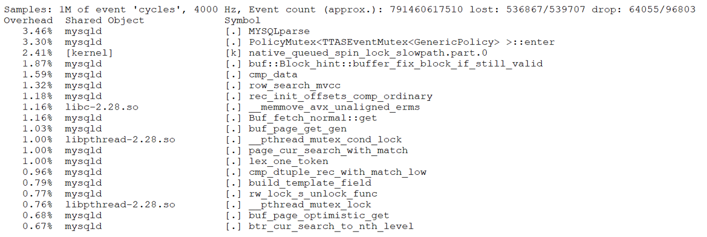


Figure 4-55. The *perf* statistics after optimizing the MVCC ReadView data structure.

Based on extensive testing, it is concluded that the root cause of discrepancies lies in the inherent inaccuracies of *perf* statistics. Amdahl's Law itself does not cause misunderstandings under ideal conditions. However, due to measurement errors and human mistakes, applying this law to directly assess performance improvements requires caution. Additionally, Amdahl's Law may vary with changes in the environment.

### 4.8.4 Performance Modeling

MySQL's complexity makes performance modeling challenging, but focusing on specific subsystems can offer valuable insights into performance problems. For instance, when modeling the performance of major latches in MySQL 5.7, it's found that executing a transaction (with a transaction isolation level of Read Committed) involves certain operations:

-   **Read Operations:** Pass through the trx-sys subsystem, potentially involving global latch queueing.
-   **Write Operations:** Go through the lock-sys subsystem, which involves global latch queueing for lock scheduling.
-   **Redo Log Operations:** Write operations require updates to the redo log subsystem, which also involves global latch queueing.


Figure 4-56. The latch queue model in MySQL 5.7.

In MySQL 5.7, poor scalability is mainly due to intense global latch contention among the **trx-sys**, **lock-sys**, and **redo log** subsystems. For instance, the TPC-C performance test, illustrated in the figure below, reveals poor scalability.


Figure 4-57. Scalability problems in MySQL 5.7.39 during BenchmarkSQL testing.

### 4.8.5 Challenges in the Limitations of Performance Analysis Tools

When facing performance problems in a program, the typical approach is to use a profiler to identify hot methods and optimize them to improve performance. If the expected improvements are not realized, the usual suspects are poor memory system interactions or hardware misunderstandings, but the profiler is rarely questioned [12].

Conventional wisdom suggests that PMU sampling provides more reliable results for hot procedures (those with more samples) while colder procedures (with fewer samples) tend to be noisier. This discrepancy arises due to the inherent delays, or "skid", between the PMU overflow interrupt and signal delivery to the performance tool. This problem is prevalent across various architectures, including x86 and ARM, and is a significant source of measurement inaccuracies. In out-of-order processors, the delay in PMU counter overflow interrupts can be particularly pronounced [11].

Profiling alone may not suffice to pinpoint the root cause of performance problems, especially those with complex propagation or computation time wastage at function boundaries. Therefore, performance tools should be used strategically: when a clear bottleneck is identified, a deep analysis should be conducted to address it. However, the absence of an obvious bottleneck does not rule out the existence of underlying problems; alternative methods may be necessary to uncover them.

For instance, Profile-Guided Optimization (PGO) might not highlight optimization opportunities in *perf* tools, yet it can still result in substantial performance gains by comprehensively optimizing computational code. Similarly, the trx-sys subsystem may exhibit severe latch bottlenecks due to poorly designed data structures that extend critical section durations. This problem, initially rooted in data structure design, can escalate into intense latch contention, creating a cascading effect.

### 4.8.6 Mitigating Scalability Problems

Saturated latches degrade multithreaded application performance, causing scalability collapse, particularly on oversubscribed systems (more threads than hardware cores). As threads circulate through a saturated latch, overall performance fades or drops abruptly due to competition over shared system resources like computing cores and last level cache (LLC). Increased threads lead to cache pressure, cache misses, and resource consumption by waiting threads, further exacerbating contention.

To address these scalability problems, consider the following measures:

-   Improve critical resource access speed.
-   Use latch sharding to reduce conflicts.
-   Minimize unnecessary wake-up processes.
-   Implement latch-free mechanisms.
-   Design the architecture thoughtfully.
-   Implement transaction throttling Mechanism.

#### 4.8.6.1 Improve Critical Resource Access Speed

Using a hybrid data structure to improve MVCC ReadView reduces time spent in critical sections, significantly improving MySQL's scalability in NUMA environments. The figure 4.10 demonstrates that speeding up access to critical sections within the trx-sys substantially increases high-concurrency throughput in NUMA environments.

#### 4.8.6.2 Latch Sharding to Reduce Latch Conflicts

In MySQL 8.0, latch sharding was implemented for the lock-sys to reduce latch overhead in the lock scheduling subsystem. The figure below compares performance before and after this improvement


Figure 4-58. Comparison of BenchmarkSQL tests before and after lock-sys optimization.

#### 4.8.6.3 Minimize Unnecessary Wake-up Processes

Binlog group commit adopts an inefficient activation mechanism, resulting in an problem similar to the thundering herd problem. When all waiting threads are activated, only some continue processing while others continue to wait. This leads to the activation of many unnecessary threads, causing significant CPU resource wastage.

The following figure shows the throughput comparison before and after optimizing binlog group commit:


Figure 4-59. Impact of group commit optimization with innodb_thread_concurrency=128.

From the figure, it can be seen that optimizing this activation mechanism has noticeably improved throughput under high-concurrency conditions. For more detailed information, please refer to Section 8.1.2.

#### 4.8.6.4 Latch-Free Processing

MySQL redo log optimization uses latch-free processing to significantly enhance the scalability of the redo log and greatly improve the performance of concurrent writes. The following figure shows the TPC-C throughput comparison before and after redo log optimization. There is a noticeable improvement in low-concurrency scenarios. However, in high-concurrency situations, throughput decreases instead of increasing, mainly due to mutual interference among multi-queue bottlenecks.


Figure 4-60. Comparison of BenchmarkSQL tests before and after redo log optimization.

For more detailed information, please refer to Section 7.1.1.

#### 4.8.6.5 Implement Transaction Throttling Mechanism

This part is detailed in Chapter 8.3.

#### 4.8.6.6 Design the Architecture Thoughtfully

Architecture design needs to consider long-term needs to avoid difficult future redesigns. For example, MySQL secondaries face numerous design problems, performing poorly in NUMA environments and suffering from architectural shortcomings that delay relay log file handling. These problems, compounded by historical problems, make improving MySQL secondary replay quite difficult.

### 4.8.7 Optimize Response Time

Only after significantly alleviating scalability problems can response times for user requests be effectively reduced under high-concurrency conditions. Here are the methods to achieve reduced response times.

#### 4.8.7.1 Optimize Data Structures and Algorithms

When addressing performance bottlenecks, leveraging the power of data structures and algorithms is often necessary. In performance analysis, if problems stemming from data structures are identified, significant gains can be achieved by optimizing based on the data's characteristics. Such optimizations tend to be relatively straightforward; for example, optimizing the MVCC ReadView data structure is a typical case.

Regarding algorithms, optimization opportunities are generally hard to find in mature modules. However, in less mature modules, numerous opportunities for optimization often exist. For instance, within Group Replication, there are many opportunities for algorithmic improvements. Two classic examples include optimizing the Paxos algorithm and improving the search algorithm in the last committed replay calculation, which will be detailed in subsequent chapters.

#### 4.8.7.2 Emphasize Cache Friendliness

Cache has a significant impact on performance, and maintaining cache-friendliness primarily involves the following principles:

1.  **Sequential Memory Access:** Access memory data sequentially whenever possible. Sequential access benefits cache efficiency. For example, algorithms like direct insertion sort, which operate on small data sets, are highly cache-friendly.
2.  **Avoid False Sharing:** False sharing occurs when different threads modify parts of the same cache line simultaneously, leading to frequent cache invalidations and performance degradation. This often happens when different members of the same struct are modified by different threads concurrently.

False sharing is a well-known problem in multiprocessor systems, causing performance degradation in multi-threaded programs running in such environments. The figure below shows an example of false sharing.


Figure 4-61. Illustrative example of false sharing.

Threads 0 and 1 update variables adjacent to each other on the same cache line. Although each thread modifies different variables, the cache line is invalidated with each iteration. Specifically, when CPU 1 writes a new value, it invalidates CPU 0's cache, causing a write-back to main memory. Similarly, when CPU 0 updates its variable, it invalidates CPU 1's cache by writing back CPU 1's cache line to main memory. If both CPUs repeatedly write new values to their variables, constant invalidations will occur between their caches and main memory. This significantly increases main memory access and causes substantial delays due to the high latency in data transfers between memory hierarchy levels [36].

In MySQL code, specific preventive measures have been implemented to address cache false sharing problems. For example, cache padding improvements for the Performance Schema are detailed in the following git log description.

```c++
commit 4d46b7560a4d91c85d10ef68ee349e4b1b4a7e17
Author: Marc Alff <marc.alff@oracle.com>
Date:   Fri Nov 8 20:58:48 2013 +0100
    Bug#17766582 PERFORMANCE SCHEMA OVERHEAD IN PFS_LOCK

    This fix is a general cleanup for code involving atomic operations in the
    performance schema, to reduce overhead and improve code clarity.

    Changes implemented:
    ...
    Added missing PFS_cacheline_uint32 to atomic counters,
    to enforce no false sharing happens.
    
    This is a performance improvement.
```

Removing these cache padding optimizations, as shown in the figure below, serves as the version before cache optimization.

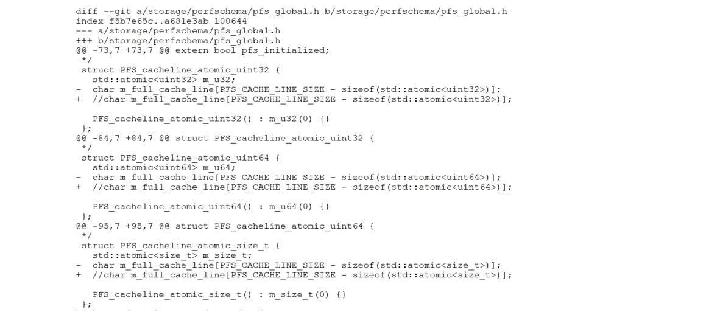

Figure 4-62. Partial reversion of cache padding optimizations.

The performance before and after cache optimization is compared to determine if there is a noticeable difference. For accurate results, MySQL should be started with the Performance Schema enabled during the tests.


Figure 4-63. Comparison of BenchmarkSQL tests before and after cache optimization.

From the figure, it is evident that the cache padding optimizations show minimal impact under low concurrency conditions but do have an effect under high concurrency. It's worth noting that MySQL has implemented cache padding optimizations in multiple places, and the cumulative performance improvement can be significant.

#### 4.8.7.3 PGO

This part is detailed in Chapter 11.1.

#### 4.8.7.4 Using better memory allocation tools

In NUMA environments, effective memory allocation tools are crucial for performance, both for MySQL primary and secondaries. For more detailed information, please refer to Section 11.3.

#### 4.8.7.5 Reduce Network Latency

For more detailed information, please refer to Section 4.7.6.

#### 4.8.7.6 Summary

To optimize response times, not only can the general techniques discussed above be employed, but also business-specific optimizations can be made. For example, for MySQL, optimizing indexes can reduce response times. Detailed information on this can be found in the next chapter.

### 4.8.8 Tail Behavior of Response Time: Challenges for SLAs

Another important metric is the tail behavior of response time, defined as the probability that the response time exceeds a certain level x, or P{T \> x}. Understanding this behavior is crucial for setting Service Level Agreements (SLAs), where a company might ensure that response times stay below x with 95% probability. Unfortunately, deriving tail behavior is often difficult [10].

Reducing response times at very high percentiles is challenging because they are easily affected by random events outside of your control, and the benefits are diminishing. Queueing delays contribute significantly to high-percentile response times. A server's limited parallel processing capacity (e.g., limited by CPU cores) means a few slow requests can hold up subsequent ones, causing head-of-line blocking. Even fast subsequent requests will appear slow to the client due to the wait. Therefore, it's essential to measure response times on the client side.

### 4.8.9 Performance Problems in NUMA Systems

NUMA architectures are commonly used in multi-socket systems to scale memory bandwidth. However, without a NUMA-aware design, programs can experience significant performance degradation due to inter-socket bandwidth contention [12].

MySQL performs poorly in NUMA environments: transactions with the Read Committed isolation level suffer, and MySQL secondary replay is severely impacted by intense latch contention. These problems will be addressed in subsequent chapters.

### 4.8.10 Performance Gains Aren't Always Additive

Performance optimization is complex; the improvements from various optimizations do not simply add up. Apart from the non-additive performance case discussed in section 4.7.5, here is an additional example. The following figure shows the performance improvement of MySQL before optimizing MVCC ReadView, with the MySQL spin delay set to 20. There is a significant increase in throughput under high concurrency conditions.


Figure 4-64. Comparison of BenchmarkSQL tests before and after spin delay optimization.

Here is the improvement in MVCC ReadView optimization itself, as shown in the figure below. It can be seen that there is a more pronounced increase in throughput under high concurrency conditions.


Figure 4-65. Comparison of BenchmarkSQL tests before and after MVCC optimization.

The following figure illustrates the combined effect of these two optimizations on the TPC-C throughput as concurrency increases.


Figure 4-66. Comparison of BenchmarkSQL tests before and after spin delay optimization with MVCC improvements.

From the figure, it can be observed that after setting the MySQL spin delay parameter to 20, the throughput is similar to that with the default MySQL spin delay of 6. The MySQL spin delay parameter uses busy-waiting to reduce thread NUMA cross-node switches in critical sections. With fewer opportunities for NUMA cross-node switches in critical sections due to MVCC ReadView optimization, the effect of the MySQL spin delay parameter naturally diminishes.

## 4.9 Distributed Theory

A MySQL cluster functions as a distributed database, governed by principles of distributed theory such as the CAP theorem and consistency.

### 4.9.1 CAP Theorem

A distributed database has three very desirable properties:

1\. Tolerance towards Network Partition

2\. Consistency

3\. Availability

The CAP theorem states: You can have at most two of these properties for any shared-data system

Theoretically there are three options:

1. Forfeit Partition Tolerance

   The system does not have a defined behavior in case of a network partition.

2. Forfeit Consistency

   In case of partition data can still be used, but since the nodes cannot communicate with each other there is no guarantee that the data is consistent.

3. Forfeit Availability

   Data can only be used if its consistency is guaranteed, which implies the need for pessimistic locking. This requires locking any updated object until the update has been propagated to all nodes. In the event of a network partition, it may take a considerable amount of time for the database to return to a consistent state, thereby compromising the guarantee of high availability.

Forfeiting Partition Tolerance is not feasible in realistic environments, as network partitions are inevitable. Therefore, it becomes necessary to make a choice between Availability and Consistency [20].

The proof process of the CAP theorem is a typical example of logical reasoning. The specific proof process is described below [20]:

```
First Gilbert and Lynch defined the three properties:

1. Consistency (atomic data objects) 
A total order must exist on all operations such that each operation looks as if it were completed at a single instance. For distributed shared memory this means (among other things) that all read operations that occur after a write operation completes must return the value of this (or a later) write operation. 

2. Availability 
Every request received by a non-failing node must result in a response. This means, any algorithm used by the service must eventually terminate. 

3. Partition Tolerance 
The network is allowed to lose arbitrarily many messages sent from one node to another. 

With this definition, the theorem was proven by contradiction:

Assume all three criteria (atomicity, availability and partition tolerance) are fulfilled. Since any network with at least two nodes can be divided into two disjoint, non-empty sets {G1,G2}, we define our network as such. An atomic object o has the initial value v0. We define a1 as part of an execution consisting of a single write on the atomic object to a value v1 ≠ v0 in G1. Assume a1 is the only client request during that time. Further, assume that no messages from G1 are received in G2, and vice versa. 

Because of the availability requirement we know that a1 will complete, meaning that the object o now has value v1 in G1.

Similarly a2 is part of an execution consisting of a single read of o in G2. During a2 again no messages from G2 are received in G1 and vice versa. Due to the availability requirement we know that a2 will complete.

If we start an execution consisting of a1 and a2, G2 only sees a2 since it does not receive any messages or requests concerning a1. Therefore the read request from a2 still must return the value v0. But since the read request starts only after the write request ended, the atomicity requirement is violated, which proves that we cannot guarantee all three requirements at the same time. q.e.d.
```

Understanding the CAP theorem lays a foundation for comprehending problems in distributed systems. For instance, in a Group Replication cluster, achieving strong consistency on every node may require sacrificing availability. The "after" mechanism of Group Replication can meet this requirement. Conversely, prioritizing availability means that during network partitions, MySQL secondaries might read stale data since distributed consistency in reads cannot be guaranteed.

### 4.9.2 Read Consistency

MySQL secondaries can handle read tasks, but they may not keep up with the pace of the MySQL primary. This can lead to problems with read consistency.

In a distributed environment, the paper "Replicated Data Consistency Explained Through Baseball" [37] describes various types of read operation consistency. Below is a detailed outline of common types of read operation consistency.

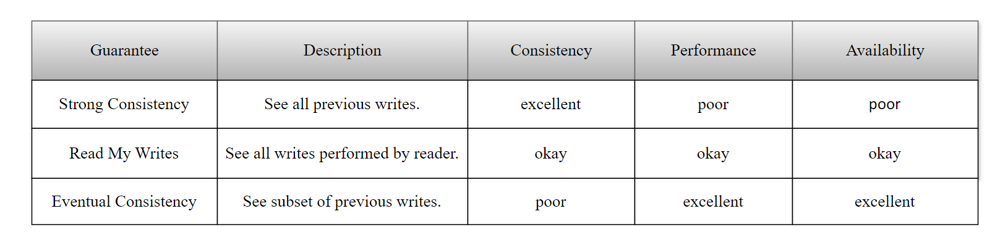

Figure 4-67. Common types of read operation consistency.

The figure describes the three most common types of consistency: strong consistency, read-your-writes consistency, and eventual consistency. The pattern observed is that the stronger the consistency, the poorer the performance, and the lower the availability.

When reading data from multiple MySQL secondaries, various consistency read problems can easily arise. These can be mitigated using MySQL proxies. For instance, for the same user session, read operations can be directed to a single MySQL secondary. If the data on that MySQL secondary is not up-to-date, the operation waits, thus avoiding typical consistency read problems.

MySQL has made significant efforts to ensure consistent reads in clustered environments. During MySQL secondary replay, it is crucial to maintain the transaction commit order consistent with the relay log entry order. This means that a transaction can only commit once all preceding transactions have been committed. The **replica_preserve_commit_order** parameter in MySQL helps enforce this constraint.

To effectively mitigate consistency read problems, MySQL secondaries should ideally keep up with the pace of the MySQL primary. If the MySQL primary and its secondaries operate at similar speeds, users can quickly access the most recent data from the secondaries. Therefore, combining fast replay on MySQL secondaries with addressing consistency read problems can significantly ease these challenges.

### 4.9.3 Consensus

For decades, the Paxos algorithm has been synonymous with distributed consensus. Despite its widespread deployment in production systems, Paxos is often misunderstood and proves to be heavyweight, unscalable, and unreliable in practice. Extensive research has been conducted to better understand the algorithm, optimize its performance, and mitigate its limitations [29]. Over time, numerous variants of Paxos have emerged, each tailored to different application scenarios based on majority-based consensus. It is important to keep these variants distinct.

For example, Group Replication in MySQL supports both single-primary and multi-primary modes, requiring consistent read and write operations in single-primary mode. This necessitates a multi-leader Paxos algorithm for consensus. The MySQL's original Mencius algorithm faced performance problems in certain scenarios, leading to the introduction of a single-leader Multi-Paxos algorithm to address these concerns. Maintaining two different variants of the Paxos algorithm simultaneously poses challenges in code maintenance, and numerous regression problems discovered later have validated this viewpoint.

### 4.9.4 Distributed Transaction

In MySQL, the XA protocol can be used to implement the two-phase commit protocol, ensuring atomicity in distributed environments. Many database products use XA to implement distributed transactions with various transaction isolation levels. However, response times in this context are often not ideal.

As highlighted in "Designing Data-Intensive Applications" [28]: "XA has poor fault tolerance and performance characteristics, which severely limit its usefulness." MySQL XA transactions not only negatively impact response times but also pose challenges for MySQL secondary replay. The second phase of an XA transaction depends on the first phase, affecting concurrent replay on MySQL secondaries, as different phases must proceed serially.

Therefore, it is advisable for MySQL users to avoid XA transactions when possible. It's important to note that while the XA two-phase commit protocol bears some similarities to Paxos algorithms, the XA protocol cannot utilize batching techniques and requires all participants to agree before proceeding with subsequent operations.

## 4.10 Database Fundamentals

Database management platforms are expected to provide application programmers with an abstraction of ACID transactions, freeing them from concerns about anomalies that might arise from concurrency or failure [19]. This section provides a brief introduction to the fundamentals of general relational databases. Advanced fundamentals of MySQL will be covered in the next chapter.

### 4.10.1 Relational Model and SQL Language

The relational model, based on predicate logic and set theory, is a fundamental data model in databases. SQL (Structured Query Language) is a highly successful programming language, simplifying database interaction by allowing users to specify their requirements without needing to understand the underlying implementation.

The relational model and SQL are elegantly designed. Their invention required significant imagination to use a relational model and SQL for solving data storage problems, as is common today. Their success is largely due to their scalability and ease of use.

SQL is relatively easy to use and widely accepted in database systems. However, it lacks some complex processing patterns (e.g., iterative training) compared to other high-level machine learning languages. Fortunately, SQL can be extended to support AI models, and user-friendly tools can be designed to support AI models in SQL statements [55].

Using AI to generate SQL queries is also a promising direction for the continued development of SQL.

### 4.10.2 Database Security

Security and ease of use often present a trade-off for users, requiring corresponding decisions based on their needs. To enhance security, MySQL utilizes TLS/SSL encrypted communication, ensuring that client-server interactions are encrypted. This increases security but adds complexity to problem analysis. For instance, analyzing encrypted SQL content captured using packet sniffing tools can be challenging.

### 4.10.3 Database Integrity

Database integrity refers to the logical consistency, correctness, validity, and compatibility of data within a database. It is ensured through various integrity constraints, making database integrity design synonymous with the design of these constraints.

For a standalone MySQL instance, maintaining database integrity is relatively straightforward compared to implementing it in Group Replication multi-primary mode. For instance, as noted in [13], Group Replication does not support the following features.

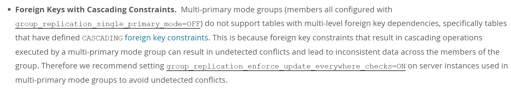

### 4.10.4 SQL Rewrite

Many database users, especially those in the cloud, may not write high-quality SQL queries. SQL rewriters aim to transform these queries into more efficient forms, such as pushing down filters or transforming nested queries into join queries [55]. Transforming SQL queries into equivalent high-quality versions is thus a very meaningful endeavor.

### 4.10.5 SQL Injection

SQL injection is a common and harmful vulnerability to databases. Attackers can exploit this vulnerability to modify or view data beyond their privileges by bypassing authentication or interfering with SQL statements, resulting in actions such as retrieving hidden data, subverting application logic, and performing union attacks [55].

For MySQL, preventing SQL injection involves several strategies. Besides using encrypted communication, users could employ prepared statements to avoid SQL injection. Prepared statements ensure that SQL code is separated from data inputs, significantly reducing the risk of injection attacks.

### 4.10.6 The Significant Impact of Indexes on Performance

In DBMS, indexes are vital for speeding up query execution, and selecting appropriate indexes is crucial for achieving high performance [55]. Below are the additional indexes created for BenchmarkSQL TPC-C testing, on top of the default indexes:

```
create index bmsql_oorder_index on bmsql_oorder (o_c_id);
```

The additional indexes are created to improve TPC-C throughput. The figure below shows the relationship between TPC-C throughput and concurrency before and after index addition.

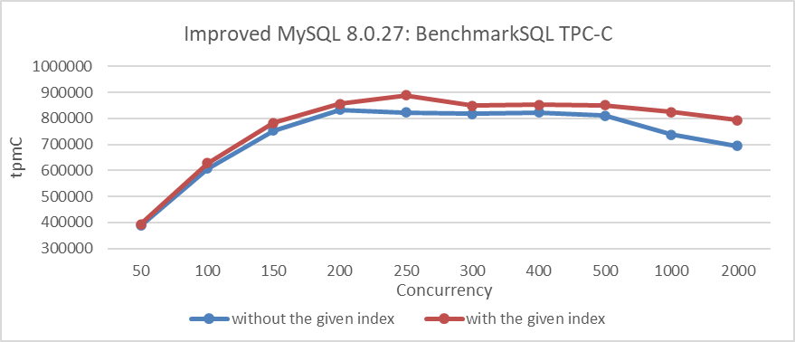

Figure 4-68. Comparison of BenchmarkSQL tests before and after index addition.

From the figure, it can be seen that establishing an effective index can significantly improve MySQL TPC-C throughput.

### 4.10.7 State-Machine Replication

The most general approach to providing a highly available service is to use a replicated state machine architecture. With a deterministic service, the state and function are replicated across servers, and an unbounded sequence of consensus instances agrees upon the commands executed. This approach offers strong consistency guarantees and is broadly applicable [32].

State-machine replication is a well-established method for fault tolerance. It replicates a service on multiple servers, maintaining availability despite server failures. However, it has two performance limitations: it introduces overhead in response time due to the need to totally order commands, and service throughput cannot be increased by adding more replicas.

Group Replication is an implementation of state-machine replication. Extensive fixes and improvements have been made based on native MySQL, significantly enhancing stability and performance. Subsequent chapters will detail these improvements to Group Replication.

## 4.11 Software Architecture Design

Common software architectures include layered architecture, primary-secondary/multi-primary architecture, and event-driven architecture. A standalone MySQL instance processing employs a layered architecture, while a cluster utilizes either primary-secondary or multi-primary architecture. At the lower level of communication, Paxos employs an event-driven architecture. Therefore, MySQL can be described as a hybrid of multiple architectural styles.

### 4.11.1 Layered Architecture

Layered architecture is a widely adopted architectural style that separates different concerns into layers to address varying requirements independently. For example, the TCP/IP protocol stack is one of the most successful layered architectures, widely used in the Internet domain. MySQL itself is based on a layered architecture, enabling it to support various types of storage engines. The processing model of Group Replication similarly follows a layered architecture, as depicted in the diagram [13].

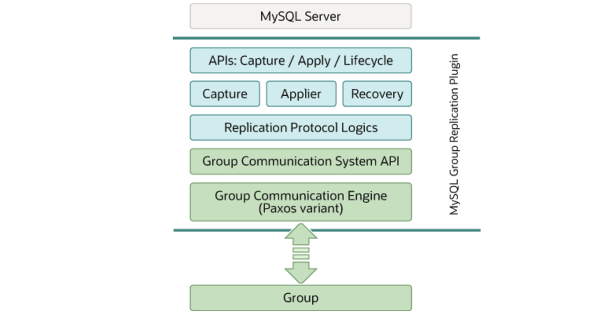

Figure 4-69. Group Replication plugin block diagram.

MySQL Server interacts with the Group Replication plugin through API calls. When a transaction needs to go through the Group Replication process, MySQL Server sends the transaction information to a designated queue via the Group Communication System API. Subsequently, the user thread enters a wait state, waiting for activation by threads responsible for Group Replication. The underlying Paxos layer (referred to as the Group Communication Engine in the diagram) is responsible for broadcasting the queue contents to group members. Once consensus is reached through the Paxos protocol, the upper layers are notified to proceed with further processing.

How is the scalability of this architecture? The following figure illustrates the relationship between Group Replication throughput and concurrency. Additionally, transaction throttling mechanisms are utilized to improve the scalability of InnoDB under scenarios with 2000+ concurrency, ensuring that too many user threads do not enter the InnoDB transaction system.


Figure 4-70. Group Replication TPC-C throughput in BenchmarkSQL with transaction throttling mechanisms.

From the figure, it can be seen that the architecture of Group Replication exhibits good inherent scalability, as the throughput does not sharply decrease with an increase in the number of threads.

### 4.11.2 Primary-Secondary/Multi-Primary Architecture

MySQL asynchronous replication, semisynchronous replication, and Group Replication single-primary all employ primary-secondary architectures. In MySQL, the primary executes transactions while the secondary replays them, and there is no need for synchronous coordination of writes between the primary and the secondary.

In a Group Replication multi-primary architecture, although transactions can be executed on any node, there are several known shortcomings:

1.  Lack of a global transaction manager.
2.  Limited transaction isolation levels.
3.  Potential for traffic skew under heavy write pressure.

According to user feedback, users often utilize Group Replication multi-primary in the following ways:

1.  They require that transactions between nodes do not conflict with each other.
2.  Despite being multi-primary, transactions are executed on only one node to avoid the overhead of switching primaries.

The following figure shows SysBench's read-write performance over time, where each node accesses the same database and handles both read and write tasks.

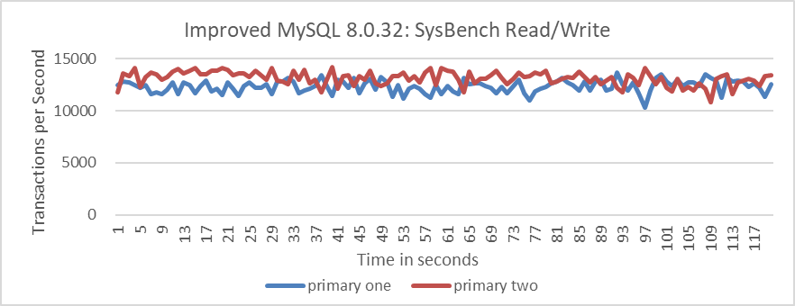

Figure 4-71. Group Replication throughput in SysBench read-write tests over time.

From the figure, it can be seen that the read-write tests between nodes coexist relatively harmoniously. The following figure shows SysBench write-only tests over time, where the Group Replication multi-primary architecture exhibits unstable throughput.

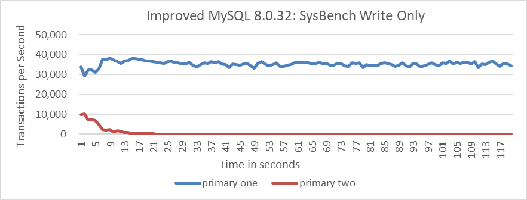

Figure 4-72. Group Replication throughput in SysBench write only tests over time.

Next, let's continue to examine the testing scenario in the Group Replication multi-primary architecture, where transactions between nodes do not conflict. Testing is conducted on primary one for Database one and on primary two for Database two. This setup ensures that transactions executed by primary one and primary two have no possibility of conflict. The specific results are shown in the following figure:

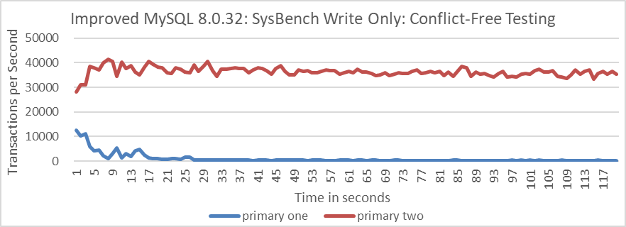

Figure 4-73. Group Replication throughput in SysBench write only tests: high concurrency and no conflicts over time.

From the figure, it can be seen that even without conflicts between transactions on different nodes, there is still throughput skew. The "primary one" node is primarily replaying transactions, severely limiting its capacity to accept new transactions.

Notably, these tests were conducted with 100 concurrency. Reducing the pressure to 10 concurrency alleviates the uneven traffic skew, as shown in the figure below.

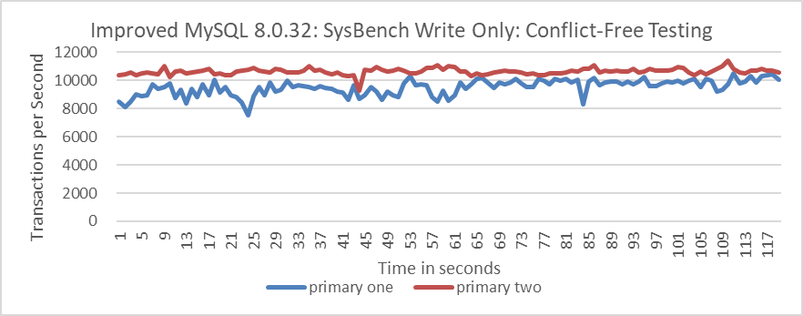

Figure 4-74. Group Replication throughput in SysBench write only tests: low concurrency and no conflicts over time.

The tests indicate that the scalability of the Group Replication multi-primary architecture is problematic and can only support small-scale traffic.

### 4.11.3 Event-Driven Architecture

Based on event-driven architecture, common in web servers like Nginx, Percona's thread pool can be seen as a rough approximation of event-driven systems. However, event-driven architecture isn't free—it incurs overhead from system calls, and this additional overhead constitutes the cost of using a thread pool.

MySQL's underlying Paxos communication can also be viewed as asynchronous event-driven. This communication operates in a single-threaded mode, requiring the avoidance of any synchronous communication processes. Unfortunately, MySQL has gradually violated these principles in its ongoing feature expansion, leading to throughput problems in certain scenarios due to prolonged synchronous processes dropping to zero. For problems related to Group Replication synchronization, refer to the highlighted code snippet below.

```c++
/* Try to connect to another node */
static int dial(server *s) {
  DECL_ENV
  int dummy;
  ENV_INIT
  END_ENV_INIT
  END_ENV;
  TASK_BEGIN
  IFDBG(D_BUG, FN; STRLIT(" dial "); NPUT(get_nodeno(get_site_def()), u);
        STRLIT(s->srv); NDBG(s->port, u));
  // Delete old connection
  reset_connection(s->con);
  X_FREE(s->con);
  s->con = nullptr;
  s->con = open_new_connection(s->srv, s->port, 1000); // synchronous call
  if (!s->con) {
    s->con = new_connection(-1, nullptr);
  }
```

## 4.12 Software Testing

### 4.12.1 The Importance of Testing for MySQL Developers

Testing and development are inseparable for MySQL developers. Due to the complex internal mechanisms of MySQL, external testers often struggle to grasp its logic and typically can only conduct black-box testing. Given MySQL's complexity, as many test cases as possible are generally required to reduce the workload of regression testing. Therefore, MySQL developers need to understand how to effectively utilize test cases to test their own programs.

### 4.12.2 Balancing Test Cases and Development Efficiency

Not every problem necessitates designing test cases; sometimes, the complexity of designing test cases exceeds that of fixing the code. For example, with Paxos-based communication within MySQL, there are no specific test cases, primarily relying on extensive manual testing by developers.

The principle of test case design should be to provide test cases where the cost is reasonable, avoiding them where the cost is excessive. Balancing this relationship effectively improves development efficiency.

It's worth noting that the test cases for Group Replication have been found to be too lax, leading to significant challenges in regression testing after refactoring. Excessive and lax test cases can consume substantial development time, making it difficult to determine whether the problem lies with the test cases themselves or with the refactored code.

### 4.12.3 Ensuring Consistency in the Testing Environment

Testing results can fluctuate due to various environmental factors, necessitating consistent environments to ensure fairness. The introduction of SSDs has significantly reduced MySQL's I/O wait times; however, if SSD performance degradation is not monitored during testing, results may diverge from expectations. Using commands such as ***fstrim -a*** can mitigate SSD degradation effects, ensuring tests are less affected.

Linux operating systems utilize I/O caching, which can lead to variability in test results, especially over long intervals between tests. Therefore, it's advisable to minimize the time gap between two tests and repeat the initial test to assess fluctuations. If significant, the test results may become invalid.

In this book, testing tools like BenchmarkSQL or SysBench are typically employed. BenchmarkSQL increases data volume over time, so for fairness and comparability of performance, tests commence after database refactoring to ensure reproducibility of results.

### 4.12.4 How to Test Efficiently?

The most efficient testing method is to utilize real online traffic for evaluation directly. However, this can be too risky for databases. A safer approach is to replicate online traffic into a dedicated testing environment.

In Oracle, Database Replay enables testing a system with real production workloads, helping identify potential problems before implementing changes on the production system. Any workload period can be captured with little overhead and used to drive a test system, maintaining the concurrency and load characteristics of the real workload. Maintaining these characteristics is crucial, as current testing solutions often lack synchronization based on data dependencies. Without proper synchronization, the workload does not perform as required, leading to poor coverage and inadequate load, leaving many problems undetected. Database Replay's data-based synchronization makes testing realistic and helps discover potential problems [34].

In MySQL, a common strategy involves taking a MySQL secondary instance offline for testing, configuring the necessary cluster, and replicating online MySQL requests to this new testing primary. The closer the testing primary resembles the production environment, the more accurate the test results. There are various methods to replicate online MySQL requests. This book recommends the open-source tool TCPCopy [60]. By using TCPCopy, many online problems have been successfully mitigated, laying a solid foundation for MySQL proxy enhancements [61]. For testing a MySQL cluster, replicating online requests to the testing system using TCPCopy allows us to evaluate whether the modifications achieve the expected outcomes, such as performance improvements, and robustness.

### 4.12.5 Is Testing About Discovering Problems or Verifying Them?

Testing serves not only to verify known problems but also to uncover new ones. Verification of problems is the initial step to ensure that the software behaves as expected. Subsequently, the focus shifts to actively discovering potential problems within the program, preempting their discovery by testers. Adopting this strategy during the process of improving MySQL fundamentally ensures the quality of MySQL modifications. Practical experience has validated this approach as highly effective. Where possible, replicating online traffic for testing provides a robust means to identify potential problems within the software, further enhancing its overall quality.

[Next](Chapter5.md)
