## 4.8 Performance Optimization

Optimizing code performance requires logical reasoning. Programmers must analyze efficiency, evaluate trade-offs, and make informed decisions to improve performance. This helps identify bottlenecks, optimize algorithms, and efficiently use resources [56]. Inefficient code sequences, or performance bugs, cause significant degradation and resource waste, reducing throughput, increasing latency, and frustrating users, leading to financial losses. Diagnosing these bugs is challenging due to non-fail-stop symptoms, often requiring months of expert effort [62].

### 4.8.1 Performance Optimization Flowchart

For performance optimization, the process can be simplified into the following flowchart [40]:

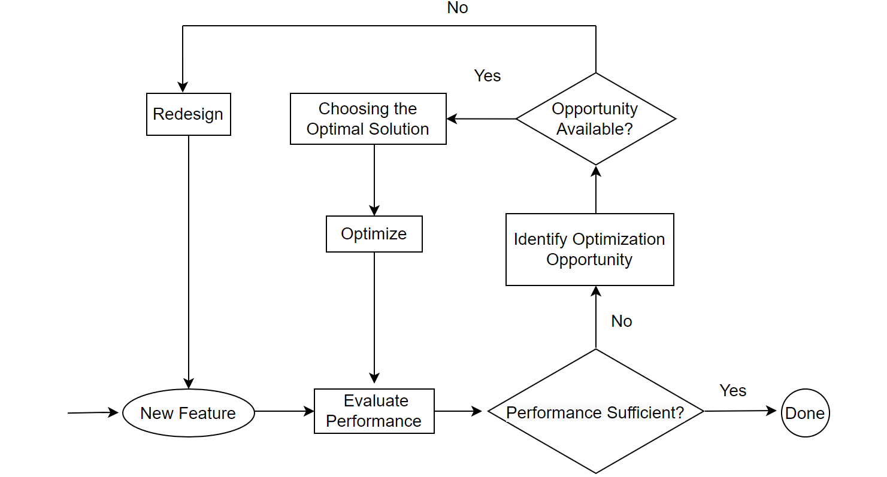

Figure 4-49. Performance optimization flowchart.

When assessing a new performance optimization feature, first test its impact in an SMP environment. If there is no improvement in an SMP environment but an overall improvement in a NUMA environment, the feature may be related to scalability. Conduct theoretical analysis to understand the improvement mechanism. If it can be theoretically explained, the optimization is valid; if not, it is likely ineffective. If the feature doesn't improve performance, look for new optimization opportunities through extensive testing and comparisons. Both performance gains and losses can reveal potential optimization areas. For instance, if a new memory allocation tool causes a performance drop, this indicates its significant impact, necessitating finding the optimal tool. Upon identifying substantial optimization opportunities, evaluate the trade-offs to determine the best method. For example, if PGO decreases throughput under high concurrency, this presents an optimization opportunity. Solutions might include reducing processing time in critical sections through better data structures and algorithms or completely eliminating latches, which involves extensive code modifications and complex logic, making maintenance challenging.

If optimization opportunities are still not captured, redesign may be necessary. For example, Group Replication adopts an architecture based on the "bucket principle", as illustrated in the figure below:

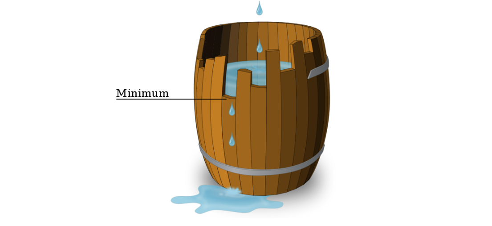

Figure 4-50. Illustration of the "bucket principle".

The "bucket principle" refers to a barrel made up of multiple staves of wood, where the amount of water it can hold is determined by its shortest stave, not the longest. For Group Replication, according to the "bucket principle", performance is determined by the slowest node in the cluster, often leading to performance that falls short of semisynchronous replication. Without altering the design, finding optimization points becomes difficult. Therefore, a redesign of Group Replication is necessary to fully address the performance deficiencies inherent in the certification database based on the "bucket principle".

### 4.8.2 Throughput vs. Response Time

Throughput and response time have a generally reciprocal but subtly complex relationship [33]. Throughput focuses on resource utilization, examining how effectively server resources process tasks. Response time emphasizes user request responsiveness, impacting user experience.

In performance optimization, two main goals are:

1.  **Optimal response time:** Minimize waiting for task completion.
2.  **Maximal throughput:** Handle as many simultaneous tasks as possible.

These goals are contradictory: optimizing for response time requires minimizing system load, while optimizing for throughput requires maximizing it. Balancing these conflicting objectives is key to effective performance optimization.

Analyzing the relationship between MySQL semisynchronous throughput and concurrency using the SysBench tool, as illustrated in the figure below, provides insight into how these metrics interact in testing environments.


Figure 4-51. Semisynchronous throughput vs. concurrency relationship using SysBench.

The figure shows that throughput peaks at 500 concurrency. Similarly, the subsequent figure indicates that response time also peaks at 500 concurrency.

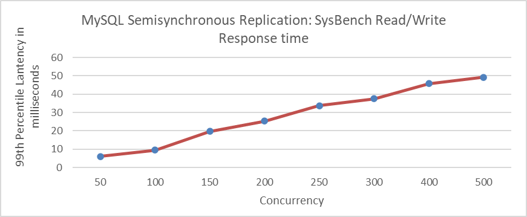

Figure 4-52. Semisynchronous response time vs. concurrency relationship using SysBench.

It is common to observe that high throughput is accompanied by high response times. With increasing computational resources, resource utilization efficiency may decrease and throughput may still gradually increase. Pursuing higher throughput without considering quality and efficiency is shortsighted. Instead, finding the optimal balance between response time and throughput is crucial.

This balance point, known as the "knee", represents the optimal load level where throughput is maximized with minimal negative impact on response times. For systems handling randomly timed service requests, exceeding the knee value can lead to severe fluctuations in response times and throughput due to minor changes in load. Thus, managing load to remain below the knee value is essential [33].

For the semisynchronous test mentioned above, both throughput and response time are favorable at 100 concurrency. Implementing a transaction throttling mechanism can effectively limit MySQL's maximum concurrent transactions to 100.

### 4.8.3 Amdahl's Law

In computer architecture, Amdahl's Law provides a formula to predict the theoretical speedup in latency for a task with a fixed workload when system resources are improved [45].

Although Amdahl's Law theoretically holds, it often struggles to explain certain phenomena in the practical performance improvement process of MySQL. For instance, the same program shows a 10% improvement in SMP environments but a 50% improvement in NUMA environments. Measurements were conducted in SMP environments where the optimized portion, accounting for 20% of execution time, was improved by a factor of 2 through algorithm improvements. According to Amdahl's Law, the theoretical improvement should be calculated as follows: 


In practice, the 10% improvement in SMP environments aligns with theoretical expectations. However, the 50% improvement in NUMA environments significantly exceeds these predictions. This discrepancy is not due to a flaw in the theory or an error but rather because performance improvements in NUMA environments cannot be directly compared with those in SMP environments. Amdahl's Law is applicable strictly within the same environment.

Accurate measurement data is also challenging to obtain [11]. Developers typically use tools like *perf* to identify bottlenecks. The larger the bottleneck displayed by *perf*, the greater the potential for improvement. However, some bottlenecks are distributed or spread out, making it difficult to pinpoint them using *perf* and, consequently, challenging to identify optimization opportunities. For example, Profile-Guided Optimization (PGO) may not highlight specific bottlenecks causing poor performance in *perf*, yet PGO can still significantly improve performance.

Taking the optimization of the MVCC ReadView data structure as an example illustrates the challenges in statistical measurements by tools. As depicted in the following figure, this optimization demonstrates substantial improvements in throughput under high concurrency scenarios.

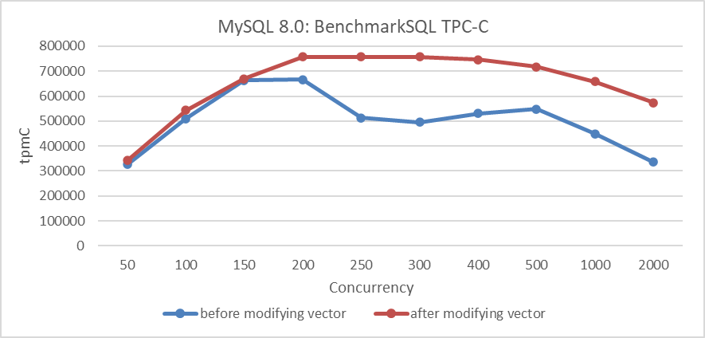

Figure 4-53. Performance comparison before and after adopting the new hybrid data structure.

Let's continue to analyze the *perf* statistics before optimizing the MVCC ReadView data structure with 300 concurrency, as shown in the specific figure below

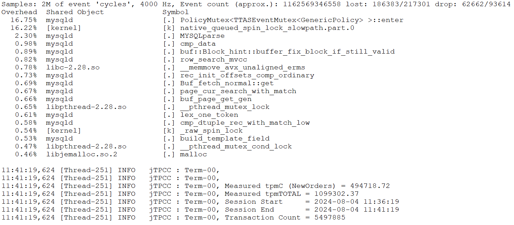

Figure 4-54. The *perf* statistics before optimizing the MVCC ReadView data structure.

*Perf* analysis reveals that the first and second bottlenecks together account for about 33% of the total. After optimizing the MVCC ReadView, this percentage drops to approximately 5.7%, reflecting a reduction of about 28%, or up to 30% considering measurement fluctuations. According to Amdahl's Law, theoretical performance improvement could be up to around 43%. However, actual throughput has increased by 53%.

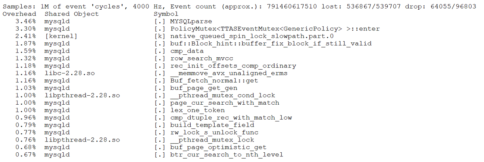

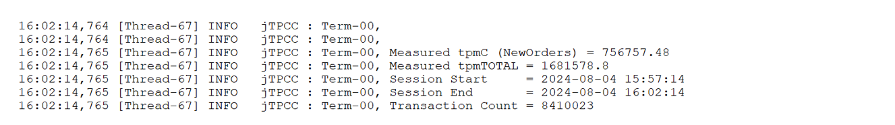

Figure 4-55. The *perf* statistics after optimizing the MVCC ReadView data structure.

Based on extensive testing, it is concluded that the root cause of discrepancies lies in the inherent inaccuracies of *perf* statistics. Amdahl's Law itself does not cause misunderstandings under ideal conditions. However, due to measurement errors and human mistakes, applying this law to directly assess performance improvements requires caution. Additionally, Amdahl's Law may vary with changes in the environment.

### 4.8.4 Performance Modeling

MySQL's complexity makes performance modeling challenging, but focusing on specific subsystems can offer valuable insights into performance problems. For instance, when modeling the performance of major latches in MySQL 5.7, it's found that executing a transaction (with a transaction isolation level of Read Committed) involves certain operations:

-   **Read Operations:** Pass through the trx-sys subsystem, potentially involving global latch queueing.
-   **Write Operations:** Go through the lock-sys subsystem, which involves global latch queueing for lock scheduling.
-   **Redo Log Operations:** Write operations require updates to the redo log subsystem, which also involves global latch queueing.


Figure 4-56. The latch queue model in MySQL 5.7.

In MySQL 5.7, poor scalability is mainly due to intense global latch contention among the **trx-sys**, **lock-sys**, and **redo log** subsystems. For instance, the TPC-C performance test, illustrated in the figure below, reveals poor scalability.


Figure 4-57. Scalability problems in MySQL 5.7.39 during BenchmarkSQL testing.

### 4.8.5 Challenges in the Limitations of Performance Analysis Tools

When facing performance problems in a program, the typical approach is to use a profiler to identify hot methods and optimize them to improve performance. If the expected improvements are not realized, the usual suspects are poor memory system interactions or hardware misunderstandings, but the profiler is rarely questioned [12].

Conventional wisdom suggests that PMU sampling provides more reliable results for hot procedures (those with more samples) while colder procedures (with fewer samples) tend to be noisier. This discrepancy arises due to the inherent delays, or "skid", between the PMU overflow interrupt and signal delivery to the performance tool. This problem is prevalent across various architectures, including x86 and ARM, and is a significant source of measurement inaccuracies. In out-of-order processors, the delay in PMU counter overflow interrupts can be particularly pronounced [11].

Profiling alone may not suffice to pinpoint the root cause of performance problems, especially those with complex propagation or computation time wastage at function boundaries. Therefore, performance tools should be used strategically: when a clear bottleneck is identified, a deep analysis should be conducted to address it. However, the absence of an obvious bottleneck does not rule out the existence of underlying problems; alternative methods may be necessary to uncover them.

For instance, Profile-Guided Optimization (PGO) might not highlight optimization opportunities in *perf* tools, yet it can still result in substantial performance gains by comprehensively optimizing computational code. Similarly, the trx-sys subsystem may exhibit severe latch bottlenecks due to poorly designed data structures that extend critical section durations. This problem, initially rooted in data structure design, can escalate into intense latch contention, creating a cascading effect.

### 4.8.6 Mitigating Scalability Problems

Saturated latches degrade multithreaded application performance, causing scalability collapse, particularly on oversubscribed systems (more threads than hardware cores). As threads circulate through a saturated latch, overall performance fades or drops abruptly due to competition over shared system resources like computing cores and last level cache (LLC). Increased threads lead to cache pressure, cache misses, and resource consumption by waiting threads, further exacerbating contention.

To address these scalability problems, consider the following measures:

-   Improve critical resource access speed.
-   Use latch sharding to reduce conflicts.
-   Minimize unnecessary wake-up processes.
-   Implement latch-free mechanisms.
-   Design the architecture thoughtfully.
-   Implement transaction throttling Mechanism.

#### 4.8.6.1 Improve Critical Resource Access Speed

Using a hybrid data structure to improve MVCC ReadView reduces time spent in critical sections, significantly improving MySQL's scalability in NUMA environments. The figure 4.10 demonstrates that speeding up access to critical sections within the trx-sys substantially increases high-concurrency throughput in NUMA environments.

#### 4.8.6.2 Latch Sharding to Reduce Latch Conflicts

In MySQL 8.0, latch sharding was implemented for the lock-sys to reduce latch overhead in the lock scheduling subsystem. The figure below compares performance before and after this improvement

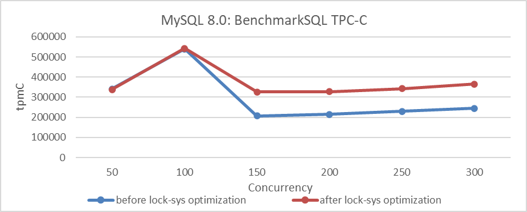

Figure 4-58. Comparison of BenchmarkSQL tests before and after lock-sys optimization.

#### 4.8.6.3 Minimize Unnecessary Wake-up Processes

Binlog group commit adopts an inefficient activation mechanism, resulting in an problem similar to the thundering herd problem. When all waiting threads are activated, only some continue processing while others continue to wait. This leads to the activation of many unnecessary threads, causing significant CPU resource wastage.

The following figure shows the throughput comparison before and after optimizing binlog group commit:

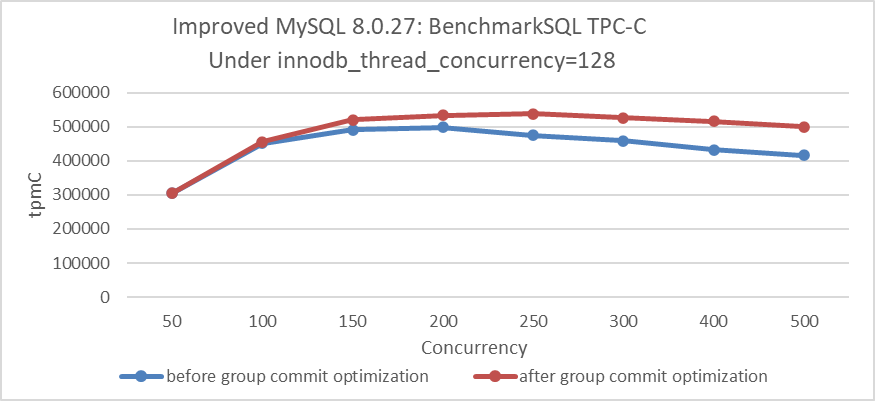

Figure 4-59. Impact of group commit optimization with innodb_thread_concurrency=128.

From the figure, it can be seen that optimizing this activation mechanism has noticeably improved throughput under high-concurrency conditions. For more detailed information, please refer to Section 8.1.2.

#### 4.8.6.4 Latch-Free Processing

MySQL redo log optimization uses latch-free processing to significantly enhance the scalability of the redo log and greatly improve the performance of concurrent writes. The following figure shows the TPC-C throughput comparison before and after redo log optimization. There is a noticeable improvement in low-concurrency scenarios. However, in high-concurrency situations, throughput decreases instead of increasing, mainly due to mutual interference among multi-queue bottlenecks.

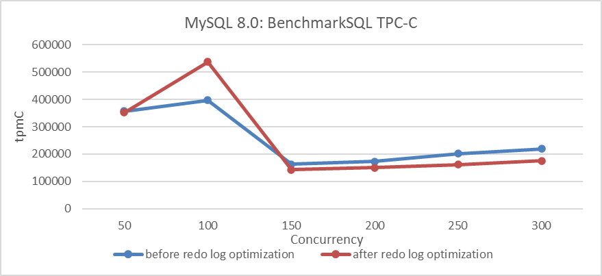

Figure 4-60. Comparison of BenchmarkSQL tests before and after redo log optimization.

For more detailed information, please refer to Section 7.1.1.

#### 4.8.6.5 Implement Transaction Throttling Mechanism

This part is detailed in Chapter 8.3.

#### 4.8.6.6 Design the Architecture Thoughtfully

Architecture design needs to consider long-term needs to avoid difficult future redesigns. For example, MySQL secondaries face numerous design problems, performing poorly in NUMA environments and suffering from architectural shortcomings that delay relay log file handling. These problems, compounded by historical problems, make improving MySQL secondary replay quite difficult.

### 4.8.7 Optimize Response Time

Only after significantly alleviating scalability problems can response times for user requests be effectively reduced under high-concurrency conditions. Here are the methods to achieve reduced response times.

#### 4.8.7.1 Optimize Data Structures and Algorithms

When addressing performance bottlenecks, leveraging the power of data structures and algorithms is often necessary. In performance analysis, if problems stemming from data structures are identified, significant gains can be achieved by optimizing based on the data's characteristics. Such optimizations tend to be relatively straightforward; for example, optimizing the MVCC ReadView data structure is a typical case.

Regarding algorithms, optimization opportunities are generally hard to find in mature modules. However, in less mature modules, numerous opportunities for optimization often exist. For instance, within Group Replication, there are many opportunities for algorithmic improvements. Two classic examples include optimizing the Paxos algorithm and improving the search algorithm in the last committed replay calculation, which will be detailed in subsequent chapters.

#### 4.8.7.2 Emphasize Cache Friendliness

Cache has a significant impact on performance, and maintaining cache-friendliness primarily involves the following principles:

1.  **Sequential Memory Access:** Access memory data sequentially whenever possible. Sequential access benefits cache efficiency. For example, algorithms like direct insertion sort, which operate on small data sets, are highly cache-friendly.
2.  **Avoid False Sharing:** False sharing occurs when different threads modify parts of the same cache line simultaneously, leading to frequent cache invalidations and performance degradation. This often happens when different members of the same struct are modified by different threads concurrently.

False sharing is a well-known problem in multiprocessor systems, causing performance degradation in multi-threaded programs running in such environments. The figure below shows an example of false sharing.


Figure 4-61. Illustrative example of false sharing.

Threads 0 and 1 update variables adjacent to each other on the same cache line. Although each thread modifies different variables, the cache line is invalidated with each iteration. Specifically, when CPU 1 writes a new value, it invalidates CPU 0's cache, causing a write-back to main memory. Similarly, when CPU 0 updates its variable, it invalidates CPU 1's cache by writing back CPU 1's cache line to main memory. If both CPUs repeatedly write new values to their variables, constant invalidations will occur between their caches and main memory. This significantly increases main memory access and causes substantial delays due to the high latency in data transfers between memory hierarchy levels [36].

In MySQL code, specific preventive measures have been implemented to address cache false sharing problems. For example, cache padding improvements for the Performance Schema are detailed in the following git log description.

```c++
commit 4d46b7560a4d91c85d10ef68ee349e4b1b4a7e17
Author: Marc Alff <marc.alff@oracle.com>
Date:   Fri Nov 8 20:58:48 2013 +0100
    Bug#17766582 PERFORMANCE SCHEMA OVERHEAD IN PFS_LOCK

    This fix is a general cleanup for code involving atomic operations in the
    performance schema, to reduce overhead and improve code clarity.

    Changes implemented:
    ...
    Added missing PFS_cacheline_uint32 to atomic counters,
    to enforce no false sharing happens.
    
    This is a performance improvement.
```

Removing these cache padding optimizations, as shown in the figure below, serves as the version before cache optimization.

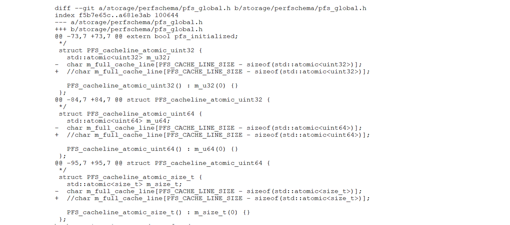

Figure 4-62. Partial reversion of cache padding optimizations.

The performance before and after cache optimization is compared to determine if there is a noticeable difference. For accurate results, MySQL should be started with the Performance Schema enabled during the tests.

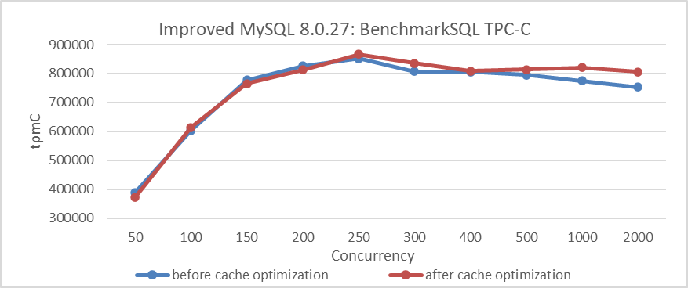

Figure 4-63. Comparison of BenchmarkSQL tests before and after cache optimization.

From the figure, it is evident that the cache padding optimizations show minimal impact under low concurrency conditions but do have an effect under high concurrency. It's worth noting that MySQL has implemented cache padding optimizations in multiple places, and the cumulative performance improvement can be significant.

#### 4.8.7.3 PGO

This part is detailed in Chapter 11.1.

#### 4.8.7.4 Using better memory allocation tools

In NUMA environments, effective memory allocation tools are crucial for performance, both for MySQL primary and secondaries. For more detailed information, please refer to Section 11.3.

#### 4.8.7.5 Reduce Network Latency

For more detailed information, please refer to Section 4.7.6.

#### 4.8.7.6 Summary

To optimize response times, not only can the general techniques discussed above be employed, but also business-specific optimizations can be made. For example, for MySQL, optimizing indexes can reduce response times. Detailed information on this can be found in the next chapter.

### 4.8.8 Tail Behavior of Response Time: Challenges for SLAs

Another important metric is the tail behavior of response time, defined as the probability that the response time exceeds a certain level x, or P{T \> x}. Understanding this behavior is crucial for setting Service Level Agreements (SLAs), where a company might ensure that response times stay below x with 95% probability. Unfortunately, deriving tail behavior is often difficult [10].

Reducing response times at very high percentiles is challenging because they are easily affected by random events outside of your control, and the benefits are diminishing. Queueing delays contribute significantly to high-percentile response times. A server's limited parallel processing capacity (e.g., limited by CPU cores) means a few slow requests can hold up subsequent ones, causing head-of-line blocking. Even fast subsequent requests will appear slow to the client due to the wait. Therefore, it's essential to measure response times on the client side.

### 4.8.9 Performance Problems in NUMA Systems

NUMA architectures are commonly used in multi-socket systems to scale memory bandwidth. However, without a NUMA-aware design, programs can experience significant performance degradation due to inter-socket bandwidth contention [12].

MySQL performs poorly in NUMA environments: transactions with the Read Committed isolation level suffer, and MySQL secondary replay is severely impacted by intense latch contention. These problems will be addressed in subsequent chapters.

### 4.8.10 Performance Gains Aren't Always Additive

Performance optimization is complex; the improvements from various optimizations do not simply add up. Apart from the non-additive performance case discussed in section 4.7.5, here is an additional example. The following figure shows the performance improvement of MySQL before optimizing MVCC ReadView, with the MySQL spin delay set to 20. There is a significant increase in throughput under high concurrency conditions.

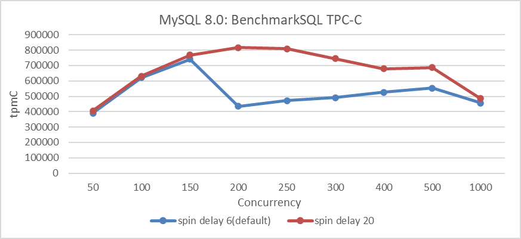

Figure 4-64. Comparison of BenchmarkSQL tests before and after spin delay optimization.

Here is the improvement in MVCC ReadView optimization itself, as shown in the figure below. It can be seen that there is a more pronounced increase in throughput under high concurrency conditions.

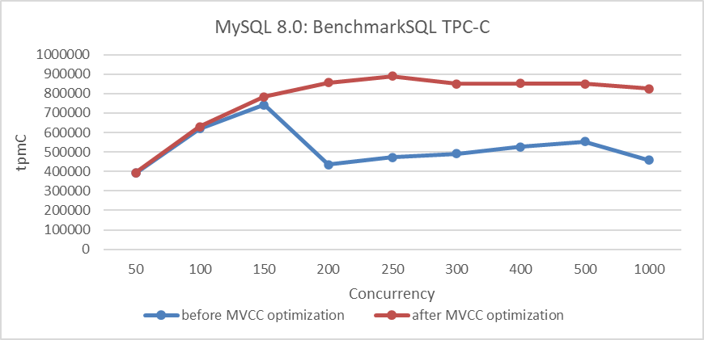

Figure 4-65. Comparison of BenchmarkSQL tests before and after MVCC optimization.

The following figure illustrates the combined effect of these two optimizations on the TPC-C throughput as concurrency increases.

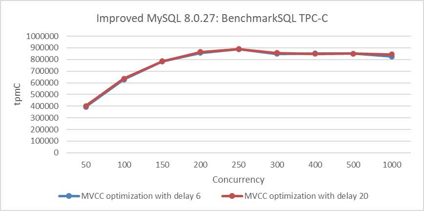

Figure 4-66. Comparison of BenchmarkSQL tests before and after spin delay optimization with MVCC improvements.

From the figure, it can be observed that after setting the MySQL spin delay parameter to 20, the throughput is similar to that with the default MySQL spin delay of 6. The MySQL spin delay parameter uses busy-waiting to reduce thread NUMA cross-node switches in critical sections. With fewer opportunities for NUMA cross-node switches in critical sections due to MVCC ReadView optimization, the effect of the MySQL spin delay parameter naturally diminishes.

[Next](Chapter4_9.md)
