# Chapter 5: MySQL Internals

To address the numerous problems inherent in MySQL, it is essential to have a solid foundation of knowledge related to MySQL. This chapter provides detailed explanations of MySQL core fundamentals.

## 5.1 The "Storage Stack" of InnoDB

The following figure depicts the InnoDB storage stack from a developer's perspective. The upper layer primarily consists of the SQL layer, while the lower layer comprises the InnoDB storage engine layer with transaction capabilities. Interaction between the SQL layer and the InnoDB storage engine layer occurs through interfaces. The InnoDB storage engine primarily includes the transaction layer and the mini-transaction layer. InnoDB interacts with the operating system through system functions, and the operating system interacts with the hardware.

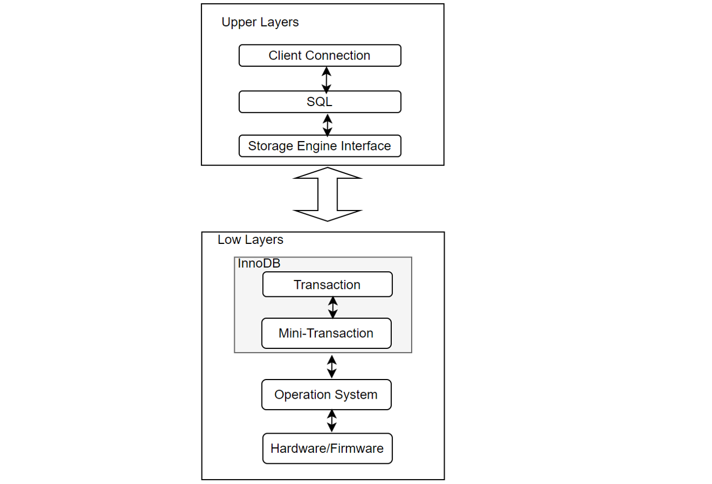

Figure 5-1. The InnoDB Storage Stack.

In the InnoDB storage engine, changes are applied through mini-transactions (mtr), which enable atomic modifications across multiple pages. This approach maintains data consistency during concurrent transactions and database anomalies. Since a single transaction often involves changes to multiple pages, mini-transactions ensure page-level consistency, meaning a single transaction typically comprises multiple mini-transactions.

The figure below illustrates the function call stack relationship between transactions and mini-transactions, showing how transactions use mini-transactions to execute low-level operations.


Figure 5-2. Call stack relationship between transactions and mini-transactions.

It should be emphasized that the transaction layer and the mini-transaction layer together implement the functionality of a complete transaction.

## 5.2 Transactions

The ACID model outlines key database design principles essential for business data and mission-critical applications. MySQL, with components like the InnoDB storage engine, adheres closely to the ACID model to ensure data integrity and prevent corruption during exceptional conditions such as software crashes and hardware failures. Relying on ACID-compliant features eliminates the need for custom consistency checking and crash recovery mechanisms. However, in cases where additional safeguards exist, ultra-reliable hardware is used, or minor data loss or inconsistency is acceptable, MySQL settings can be adjusted to trade some ACID reliability for increased performance or throughput [13].

To implement a transaction, the following ACID properties must be satisfied:

1. **Atomicity**: Ensures "all or nothing" semantics, meaning either all operations of a transaction are completed, or none are. This aspect mainly involves InnoDB transactions.
2. **Consistency**: Requires every transaction to maintain the predetermined integrity rules of the database, transforming it from one consistent state to another. Consistency is ensured by the DBMS and involves internal InnoDB processing to protect data from crashes.
3. **Isolation**: Prevents transactions from interfering with each other, ensuring incomplete transactions are not visible to others. Isolation is primarily managed through InnoDB transactions and the isolation level applied to each transaction.
4. **Durability**: Guarantees that once a transaction is committed, it remains so, even in the event of a crash. This aspect involves MySQL software features and the hardware configuration, and it is the most complex to provide specific guidelines for.

In the InnoDB storage engine:

- **Transaction Layer**:
  - **Atomicity, Consistency, and Isolation**: Achieved through locks and ReadView.
  - **Cross-Engine Atomic Commits**: Implemented using XA Two-Phase Commit (2PC), ensuring atomicity between SQL layer binlogs and InnoDB redo logs, forming the basis for crash recovery.
- **Mini-Transaction Layer**:
  - **Atomic, Consistent, and Durable Modifications**: Managed through interactions with redo/undo logs across multiple pages, supporting crash recovery.

Overall, atomicity, consistency, and durability are jointly achieved through both the mini-transaction and transaction layers, while isolation is mainly managed at the transaction layer.

In InnoDB, each transaction is assigned a transaction ID that strictly increases in chronological order. Transaction IDs are generated not only by external transactions but also by various internal operations within MySQL, such as GTID updates triggering internal transactions for persistence.

## 5.3 Concurrency Control

High-performance transactional systems require concurrent transactions to meet performance demands. Without concurrency control, these systems cannot provide correct results or maintain consistent databases [45].

Concurrency control allows end-users to access a database simultaneously while maintaining the illusion that each transaction runs independently on a dedicated system, ensuring atomicity and isolation.

Two-phase locking (2PL) was the first proven method for ensuring the correct execution of concurrent transactions in a database system. Under 2PL, transactions must acquire locks on database elements before reading or writing them. A transaction needs a read lock to read an element and a write lock to modify it.

Online Transaction Processing (OLTP) systems rely on concurrency control protocols to ensure the serializability of concurrently executed transactions. When two parallel transactions attempt to access the same data item, the concurrency control protocol coordinates their accesses to maintain serializability. Different protocols achieve this in various ways. Locking-based protocols, such as two-phase locking (2PL), associate a lock with each data item. A transaction must acquire all necessary locks (shared or exclusive) before releasing any. Validation-based protocols, such as optimistic concurrency control (OCC), execute a transaction with potentially stale or uncommitted data and validate for serializability before committing [51].

It is worth noting that concurrency control is only one of the several aspects of a DBMS that affects scalability [51].

## 5.4 Transaction Isolation Level

Transaction isolation is fundamental to database processing. Isolation, the "I" in ACID, balances performance, reliability, consistency, and reproducibility when multiple transactions occur simultaneously [45]. In InnoDB, the traditional four transaction isolation levels are implemented, focusing here on Repeatable Read (RR), Read Committed (RC), and Serializable levels.

MySQL's default isolation level is Repeatable Read. In this level, a ReadView is obtained at the start of the transaction, ensuring consistent data reads throughout. The mechanism uses transaction ID information from ReadView to fetch the specified data version from the undo log, maintaining data consistency.

The most commonly used isolation level in MySQL is Read Committed, which is also Oracle's default. All TPC-C tests in this book use the Read Committed level. In Read Committed, each read operation in a transaction acquires a corresponding ReadView, potentially resulting in different data for identical reads if concurrent modifications occur.

Serializable isolation provides the strongest form of isolation, similar to serial execution. However, Serializable isolation does not mandate serial execution; transactions can execute in parallel if they do not conflict.

## 5.5 MVCC

Due to performance and other considerations, databases rarely implement isolation levels based solely on locks. The MVCC + lock method is the most popular implementation, as it allows read requests without locking.

Under MVCC (Multi-Version Concurrency Control), each write operation creates a new version of a tuple, tagged with the transaction's timestamp. The DBMS maintains a list of versions for each element, determining which version a transaction will access during read operations. This ensures a serializable ordering of operations and prevents the rejection of read operations due to overwritten data.

InnoDB, a multi-version storage engine, keeps old versions of changed rows to support concurrency and rollback. This information is stored in undo tablespaces within rollback segments, which contain insert and update undo logs. Insert undo logs are needed only for transaction rollbacks and can be discarded upon commit. Update undo logs are used for consistent reads and can be discarded only when no transaction requires them for building an earlier version of a row.

Regularly committing transactions, including those with consistent reads, is recommended to prevent the rollback segment from growing excessively and filling up the undo tablespace in which it resides [13].

## 5.6 InnoDB Architecture

The following diagram illustrates the in-memory and on-disk structures that comprise the InnoDB storage engine architecture.

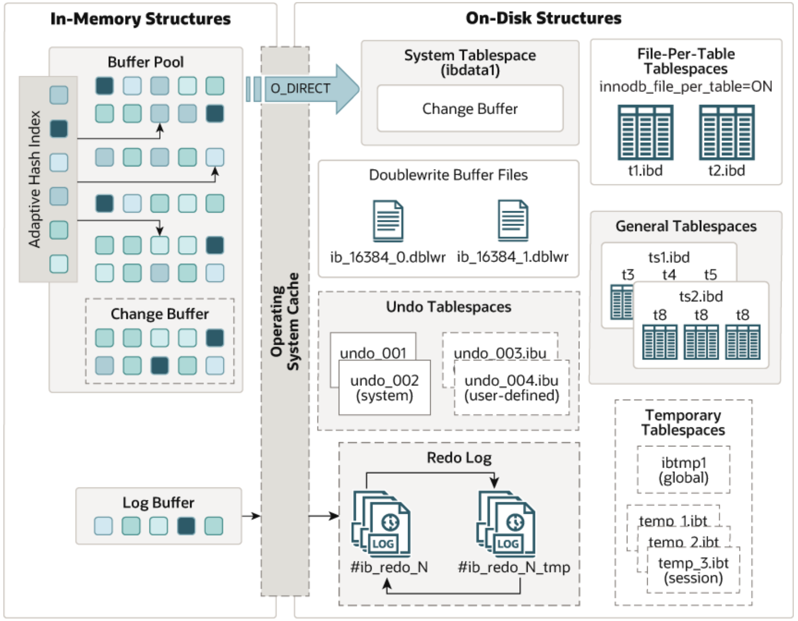

Figure 5-3. InnoDB Architecture borrowed from the official MySQL documentation.

**In-Memory Structures**

1. **Buffer Pool**:
   - Caches table and index data in main memory, allowing frequently accessed data to be read directly from memory, speeding up processing.
   - Divided into pages to hold multiple rows, managed using a linked list and a variation of the least recently used (LRU) algorithm.
   - Key aspect of MySQL tuning for efficient high-volume read operations.
2. **Log Buffer**:
   - Holds data to be written to the log files on disk, periodically flushed to disk.
   - A larger log buffer allows large transactions to run without writing redo log data to disk before committing, reducing disk I/O.
   - Controlled by the **innodb_flush_log_at_trx_commit** variable.

**On-Disk Structures**

1. **Doublewrite Buffer**:
   - An intermediate storage area where pages from the buffer pool are written before their final position in InnoDB data files.
   - Ensures recovery from partial writes due to system crashes or unexpected shutdowns.
   - Efficient as it doesn't double the I/O overhead despite data being written twice.
2. **Redo Log**:
   - Disk-based structure used for crash recovery, correcting data from incomplete transactions.
   - Encodes changes from SQL statements or low-level API calls; replayed automatically during initialization after a crash.
   - Optimizes random writes into sequential log writes (ARIES algorithm) [2], improving performance.
   - Redo log files are crucial for acknowledging transaction completion.
3. **Undo Log**:
   - Part of undo log segments within rollback segments, residing in undo tablespaces and the global temporary tablespace.
   - Essential for transaction rollbacks and MVCC (Multi-Version Concurrency Control) reads.

By effectively managing these structures, InnoDB achieves a balance of high reliability and performance.

## 5.7 Log Manager

The log manager is a critical component of modern DBMSs, often prone to bottlenecks due to its centralized design and dependence on I/O. Long flush times, log-induced latch contention, and contention for log buffers in main memory all impact scalability, with no single bottleneck solely responsible for suboptimal performance. Modern systems can achieve transaction rates of 100 ktps or higher, exacerbating the log bottleneck. Existing research offers partial solutions to these bottlenecks, but none provide a fully scalable log manager for today's multicore hardware [3].

The log manager was a major scalability bottleneck in MySQL 5.7. However, MySQL 8.0 underwent significant restructuring in this area, leading to substantial improvements in scalability.

## 5.8 Lock Scheduling Algorithms

In computing, scheduling is the action of assigning resources to perform tasks [45]. Scheduling algorithms are resource allocation strategies determined by the system's needs, such as FIFO (First In, First Out), Round Robin, and Shortest Job First (SJF). These algorithms are used in operating systems, databases, and networks.

MySQL 5.7 utilized the classic FIFO lock scheduling algorithm. Later versions, starting with MySQL 8.0.20, adopted the CATS (Contention-Aware Transaction Scheduling) lock scheduling algorithm. The purpose of this change was to improve the overall efficiency of MySQL operations and improve throughput.

Let's analyze the CATS algorithm used in MySQL 8.0. The core idea of the CATS algorithm is to prioritize locks for transactions with higher weighted costs when locks are released. The figure below illustrates the principle mechanism of CATS [57]. Despite transaction t1 having a deeper subgraph, CATS allocates the lock to t2 because completing t2 allows triggering more concurrent transactions to execute.

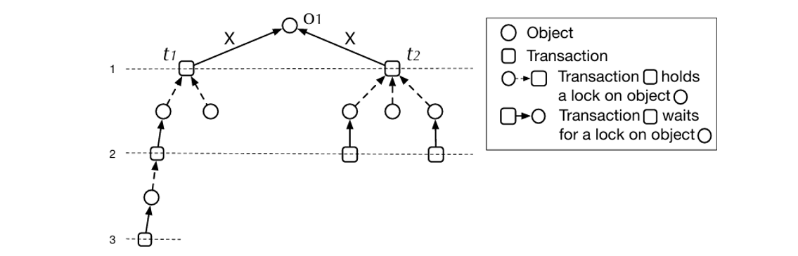

Figure 5-4. Lock scheduling example borrowed from the Paper 'Contention-Aware Lock Scheduling for Transactional Databases'.

The CATS algorithm theoretically has significant effectiveness in scenarios with severe lock contention. It has shown some impact in SysBench Pareto distribution test scenarios, but the exact extent of its effectiveness depends on specific circumstances.

Chapter 7 will subsequently provide a detailed discussion of the CATS scheduling algorithm.

## 5.9 Binlog File

MySQL improves its versatility by introducing binlog files at the SQL layer to record transaction modifications, facilitating data replication and disaster recovery. For MySQL transactions, changes are first written to the binlog files and then to the redo log files, with atomicity ensured through the XA Two-Phase Commit (2PC) mechanism.

Binlog files are crucial for data replication and high availability, supporting asynchronous replication, semisynchronous replication, and Group Replication.

This book focuses on row-based binlog, where transactions are stored as events.

With the advent of fast solid-state drives and techniques like group commit, the impact of log flush I/O times has lessened.

## 5.10 Group Commit Mechanism

MySQL introduced the binlog group commit mechanism to reduce the number of disk I/O operations by combining multiple binlog flush operations when multiple transactions are committed simultaneously. This approach reduces disk I/O by postponing log access to stable storage, gathering multiple commits in memory, and issuing a single write and flush for a set of transactions.

Group commit strategies improve disk performance by aggregating multiple log flush requests into a single I/O operation, reducing the frequency of disk accesses. However, group commit does not eliminate unwanted context switches, as transactions block pending notification from the log rather than blocking directly on I/O requests [3]. Efficient activation mechanisms are needed to reduce context switches, but the current MySQL implementation is inefficient. This problem will be thoroughly explored in Chapter 8.

## 5.11 Execution Plan

An execution plan details how a SQL statement is executed after optimization by the MySQL query optimizer. Depending on the table structure, indexes, and WHERE clause conditions, the optimizer considers various techniques to perform efficient lookups. Queries on large tables can be executed without reading all rows, and joins can be performed without comparing every row combination.

The MySQL query optimizer is designed for simple, OLTP-type queries and has limitations with complex queries. For instance, join order optimization in practical applications uses only left-deep plans and a greedy algorithm. The figure below illustrates MySQL query optimization and execution architecture [44]. The Parser and Solver layers handle syntax checking, name resolution, access control, data types, and string collations. During the Prepare phase, logical transformations occur, such as merging derived tables, predicate pushdown, and converting subqueries.

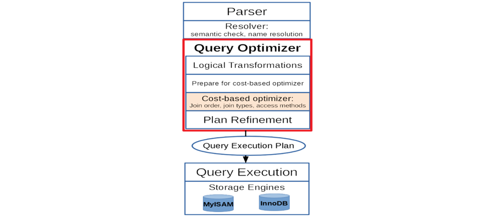

Figure 5-5. MySQL query optimization and execution architecture borrowed from the Paper 'Integrating the Orca Optimizer into MySQL'.

Cost-based Optimization, which is limited to one SELECT block at a time, determines the best join order, join method, and table access method. The optimizer generally considers only left-deep plans and performs aggregation after all tables are joined. Plan Refinement involves pushing selection conditions into tables and indexes, avoiding sorts if index scans deliver sorted rows, and adding aggregations, group-level filtering, and row limit enforcement.

Heuristics might miss the optimal plan, leading to higher execution times. Join Order Optimization has been extensively studied, with parallel approaches developed for multicore architectures. Due to the NP-hard nature of join order optimization, heuristic solutions and limited search spaces are used.

In general, there is still a lot of optimization potential in MySQL's execution plans. MySQL continues to explore new approaches, which have been reflected in MySQL 8.0.

## 5.12 Partitioning

Partitioning allows you to distribute table data across a file system based on rules you define, effectively storing different parts of a table as separate tables in various locations. This division, governed by a partitioning function, can use modulus, range or list matching, internal hashing, or linear hashing. The function, specified by the user, takes a user-supplied expression as its parameter, which can be a column value, a function acting on one or more column values, or a set of column values [13].

The benefits of using partitioning are as follows:

1. Enabling storage of more data than a single disk or file system partition can hold.
2. Simplifying data management by allowing easy removal of obsolete data through dropping partitions, and facilitating the addition of new data by adding partitions.
3. Optimizing queries by limiting searches to specific partitions that contain relevant data.

MySQL partitioning not only offers these benefits but also reduces latch contention for large tables under high concurrency. The following figure shows the impact on TPC-C throughput after partitioning a large table in BenchmarkSQL.

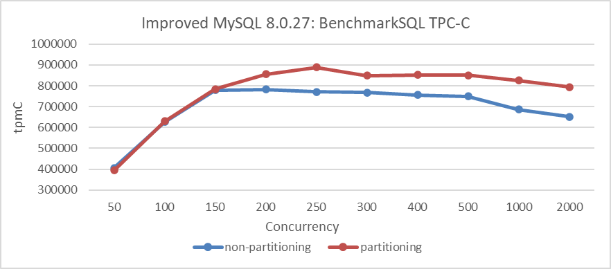

Figure 5-6. Comparison of BenchmarkSQL tests before and after partitioning.

The figure shows that partitioning has minimal impact under low concurrency. However, when concurrency exceeds 150, partitioning significantly improves throughput by alleviating latch conflicts in large tables.

Unless stated otherwise, all TPC-C tests in this book use partitioned large tables. Each table has its own latch, and partitioning employs latch sharding to reduce latch conflicts under high concurrency, preventing latch contention from affecting performance tests on large tables.

## 5.13 Coordination Avoidance

Minimizing coordination between concurrently executing operations is crucial for maximizing scalability, availability, and performance in database systems. However, coordination-free execution can compromise application correctness and consistency. While serializable transactions maintain correctness, they are not necessary for all applications and can limit scalability [25].

## 5.14 Disaster Recovery

Disaster recovery ensures a database can be brought back online after an outage. For MySQL, this involves timely flushing of binlog and redo logs, as well as writing to the doublewrite buffer to prevent recovery problems caused by damaged data pages.

## 5.15 Idempotence

Database code that creates or alters tables and routines should be idempotent to avoid problems if applied multiple times. Idempotence prevents duplicate data creation during sync failures by recording progress by batch, rather than by individual record. When a sync is interrupted, the process must often restart at the beginning of the last batch, leading to reprocessing some data.

Here's an example of MySQL secondary replay. In the following code snippet, MySQL achieves idempotence during the replay process on the secondary.

```c++
  const bool skip_transaction = is_already_logged_transaction(thd);
  if (gtid_next_list == nullptr) {
    if (skip_transaction) {
      skip_statement(thd);
      return GTID_STATEMENT_SKIP;
    }     
    return GTID_STATEMENT_EXECUTE;
  } else {
```

The *is_already_logged_transaction* function is called to determine if a transaction has already been executed. If it has, *skip_transaction* is set to true. Consequently, the subsequent process immediately returns *GTID_STATEMENT_SKIP*, halting further replay of the transaction.

## 5.16 Thread Pool

MySQL executes statements using one thread per client connection. As the number of connections increases beyond a certain threshold, performance degrades. The following figure shows the TPC-C throughput versus concurrency testing for MySQL 5.7.36.

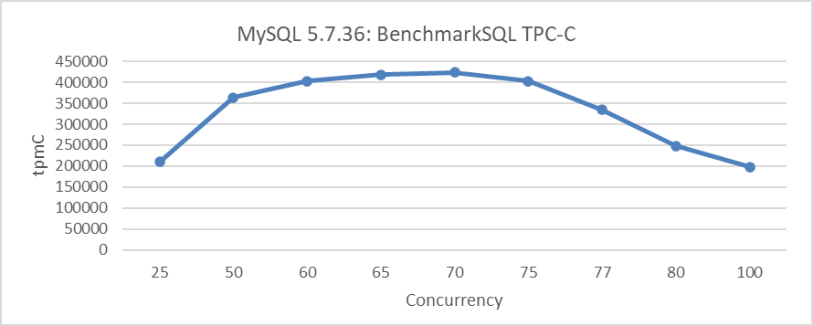

Figure 5-7. TPC-C throughput vs. concurrency in MySQL 5.7.36.

After a concurrency level of 75, the throughput sharply declines, confirming the above conclusion.

Thread pooling reuses a fixed number of threads to handle multiple client connections, reducing overhead and avoiding contention and context switching [31]. The MySQL thread pool separates user connections from threads. Each user connection no longer has a dedicated OS thread. Instead, the thread pool consists of thread groups, with a default of *n* groups. User connections are assigned to a thread group in a round-robin fashion. Each thread group manages a subset of connections, with one or more threads executing queries from those connections.

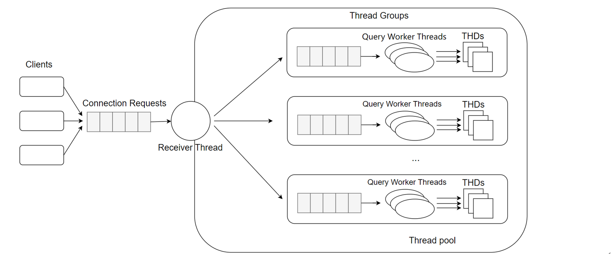

Figure 5-8. Thread pool model borrowed from the MySQL blog.

The Percona thread pool was widely used in MySQL 5.7, but with MySQL 8.0's improved scalability, its role has diminished. MySQL 8.0 introduced new thread pool modes designed to prevent performance degradation as user connections increase. The "Max Transaction Limit" feature limits the number of concurrently executing transactions, which improves overall throughput by reducing data locks and deadlocks on heavily loaded systems [31]. Thus, controlling user thread entry into the InnoDB storage engine is key to alleviating MySQL scalability problems.

## 5.17 Traditional Cluster

Traditional MySQL cluster relies on asynchronous and semisynchronous replication, which are straightforward and easy for maintenance personnel to manage.

### 5.17.1 Asynchronous Replication

Traditional MySQL replication uses a simple source to replica approach, with the primary applying transactions and then asynchronously sending them to the secondaries to be applied. This shared-nothing system ensures all servers have a full copy of the data by default [13].

Asynchronous replication offers better write scalability but at the cost of lower data coherence. The following figure is the flowchart of asynchronous replication [13]. The primary continues executing without waiting for acknowledgment from the secondary, resulting in user SQL query response times comparable to a single server. However, this can lead to data loss if the primary fails before the secondary has received the latest data.


Figure 5-9. MySQL asynchronous replication borrowed from the official MySQL documentation.

When asynchronous replication is used, if the primary fails and a new leader is chosen, unreplicated writes from the old leader may be lost. This can cause conflicts and durability problems. Often, the solution is to discard the old leader's unreplicated writes, which may not meet clients' durability expectations. If both leaders accept writes without conflict resolution, there's a risk of both nodes shutting down if not properly managed [28].

### 5.17.2 Semisynchronous Replication

To address data loss in asynchronous replication, MySQL introduced semisynchronous replication. With semisynchronous replication, a transaction commit requires the corresponding binlog to be delivered to at least one MySQL secondary before proceeding. This ensures that at least one secondary has the most recent data.

In MySQL semisynchronous replication, the secondary sends an ACK reply to the primary only after the relay log is written to disk. The primary waits for at least one ACK reply before continuing the transaction. This introduces extra latency from network time, as well as the secondary processing binlog events and writing them to disk.

In traditional high availability setups, semisynchronous replication can be cumbersome and complex. Meta, for instance, has highlighted these problems in their implementation of high availability based on the Raft protocol [38].

Since semisynchronous replication alone doesn't fully address high availability problems, many third-party tools have emerged, and MySQL has introduced Group Replication.

### 5.17.3 How Scalable is Semisynchronous Replication?

Here is the relevant code showing the process semisynchronous replication goes through before sending an ACK response:

```c++
      while (!io_slave_killed(thd, mi)) {
        ulong event_len;
        ...
        THD_STAGE_INFO(thd, stage_waiting_for_source_to_send_event);
        event_len = read_event(mysql, &rpl, mi, &suppress_warnings);
        ...
        THD_STAGE_INFO(thd, stage_queueing_source_event_to_the_relay_log);
        event_buf = (const char *)mysql->net.read_pos + 1;
        ...
        if (RUN_HOOK(binlog_relay_io, after_read_event,
                     (thd, mi, (const char *)mysql->net.read_pos + 1, event_len,
                      &event_buf, &event_len))) {
          mi->report(ERROR_LEVEL, ER_REPLICA_FATAL_ERROR,
                     ER_THD(thd, ER_REPLICA_FATAL_ERROR),
                     "Failed to run 'after_read_event' hook");
          goto err;
        }
        ...
        QUEUE_EVENT_RESULT queue_res = queue_event(mi, event_buf, event_len);
        if (queue_res == QUEUE_EVENT_ERROR_QUEUING) {
          mi->report(ERROR_LEVEL, ER_REPLICA_RELAY_LOG_WRITE_FAILURE,
                     ER_THD(thd, ER_REPLICA_RELAY_LOG_WRITE_FAILURE),
                     "could not queue event from source");
          goto err;
        }
        ...
        if (RUN_HOOK(binlog_relay_io, after_queue_event,
                     (thd, mi, event_buf, event_len, synced))) {
          mi->report(ERROR_LEVEL, ER_REPLICA_FATAL_ERROR,
                     ER_THD(thd, ER_REPLICA_FATAL_ERROR),
                     "Failed to run 'after_queue_event' hook");
          goto err;  
        } 
        ...
        thd->mem_root->ClearForReuse();
      } 
```

In the binlog file, a transaction consists of multiple events. For a TPC-C transaction, it is normal to have dozens of events. Each event goes through processes like *read event*, *after_read_event*, *queue event*, and *after_queue_event*. The more events a transaction contains, the longer the processing time, and all these events are processed by a single thread. This limitation in single-threaded processing, coupled with event-based handling, means that semisynchronous replication has limited computational capacity and poor scalability.

The following figure shows the TPC-C throughput versus concurrency testing for semisynchronous replication. It can be observed that the scalability of semisynchronous replication is very weak, far inferior to that of refactored Group Replication.

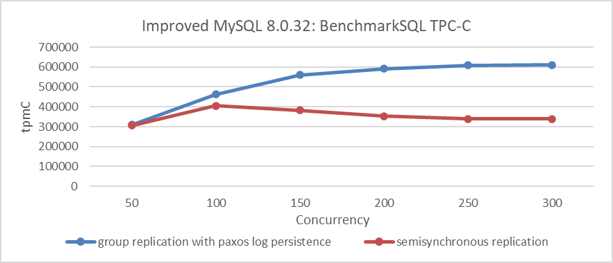

Figure 5-10. Performance comparison between Group Replication with Paxos log persistence and semisynchronous replication.

## 5.18 Group Replication

For continuous operation, a business requires high availability of its databases. To ensure continuous availability, a database must be fault-tolerant and robust to withstand failures. These qualities are achieved by Group Replication [13].

### 5.18.1 Why Implement Group Replication?

Asynchronous and semisynchronous replication cannot fully address high availability complexities. To achieve high availability, MySQL uses state machine replication based on the Paxos algorithm, known as Group Replication. This method theoretically solves the high availability problems that other replication methods cannot. Despite its potential, Group Replication faces numerous challenges, which is why it hasn't gained widespread popularity.

### 5.18.2 Why Was Mencius Initially Adopted?

Mencius is a multi-leader state machine replication protocol derived from Paxos [32]. It is designed to achieve high throughput under high client load and low latency under low client load, adapting to changing network and client environments. Mencius partitions the sequence of consensus protocol instances among servers, amortizing the leader load and increasing throughput when CPU-bound. It also fully utilizes available bandwidth and reduces latency by allowing clients to use a local server as the leader. Due to these advantages, Mencius aligns with the multi-primary mode design of Group Replication, where each MySQL node can perform write operations at any time, and was initially adopted by MySQL.

### 5.18.3 Why Introduce the Single-Leader Multi-Paxos Algorithm?

The single leader Multi-Paxos algorithm has the following characteristics [13]:

- It relies on a single leader to choose the request sequence.
- This simplicity results in high throughput and low latency for clients near the leader but higher latency for clients further away.
- The leader becomes a bottleneck, limiting throughput and creating an unbalanced communication pattern that underutilizes available network bandwidth.

MySQL introduced the single leader Multi-Paxos algorithm to improve performance and resilience in single-primary mode, especially when some secondary members are unreachable [13].

Tests in cross-datacenter scenarios show that using the single leader Multi-Paxos algorithm significantly improves Group Replication performance in single-primary mode. However, it has the drawback of high latency for other nodes needing to send data, as they must obtain the request sequence from the leader.

### 5.18.4 Does Group Replication Lose Data?

Group Replication implements state machine replication but does not inherently include durable state machine replication, meaning Paxos messages are not persisted. This design choice implies that while consensus can be reached within the cluster, data loss is possible in extreme cases. For instance, if all Group Replication nodes crash simultaneously and the MySQL primary cannot be restarted, the cluster formed by the remaining nodes may lose transaction data that had not been written to disk.

### 5.18.5 Will Group Replication Outperform Semisynchronous Replication?

The Mencius algorithm theoretically enables Group Replication to reach in-memory consensus, bypassing the need to parse transaction events at the Paxos layer. Additionally, batching mechanisms can merge several transactions into a single message for Paxos communication. Based on this, the throughput of Group Replication is expected to surpass that of semisynchronous replication.

### 5.18.6 Is a Single Thread Sufficient for Underlying Paxos Communication?

Paxos operates serially, but with pipelining and batching, it significantly improves throughput. Therefore, even with multi-threaded Paxos communication, Group Replication's overall system throughput is generally unaffected. However, large transactions can overwhelm a single thread, making multiple threads necessary to reduce wait times and speed up processing. In summary, while a single thread is sufficient for typical transactions, handling a large volume of large transactions may require multiple threads.

### 5.18.7 Paxos Single Leader vs. Group Replication Single-Primary Mode

Group Replication uses two Paxos variants: single leader Multi-Paxos and multiple leader Mencius. In single-primary mode, only one node handles transactional updates, while in multi-primary mode, all nodes can perform updates. The figure below illustrates the relationship between these algorithms and Group Replication's application modes:

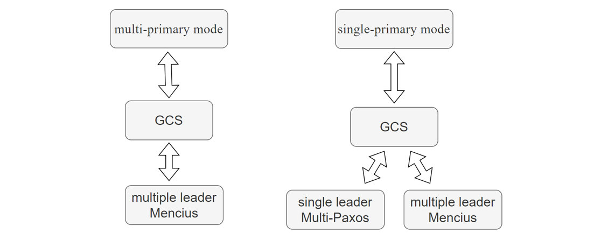

Figure 5-11. Relationship between Paxos variant algorithms and Group Replication modes.

In single-primary mode, both the Mencius algorithm and the single-leader Multi-Paxos algorithm can be used. However, in multi-primary mode, only the Mencius algorithm is applicable. This is because using the single-leader Multi-Paxos algorithm in multi-primary mode would severely degrade performance, as every non-leader node would need to request sequences from the leader node.

Group Replication in single-primary mode adopts the single-leader Multi-Paxos algorithm, assuming the leader node primarily sends messages while non-leader nodes have minimal roles. This allows efficient use of the single-leader Multi-Paxos algorithm, ensuring effective coordination and consensus among nodes.

### 5.18.8 Is Single Leader Multi-Paxos Universally Applicable in Single-Primary Mode?

In Group Replication's single-primary mode, consistent read operations require each MySQL node to send 'before' messages, while consistent write operations require 'after' messages. Using the single-leader Multi-Paxos algorithm in this context would significantly degrade performance.

The following figure illustrates SysBench's throughput for 100 concurrent read/write operations over time, with MySQL configured for strong consistency writes using the "after" mechanism.

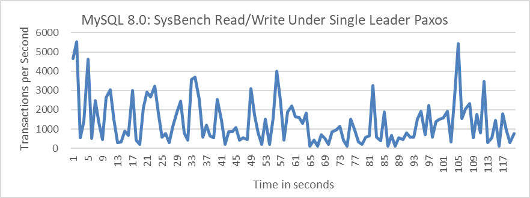

Figure 5-12. Performance of strong consistency writes using the "after" mechanism under single leader Paxos variant.

From the figure, it can be observed that after adopting the single leader Multi-Paxos, the throughput of MySQL's primary with strong consistency writes is significantly low. The following figure shows a partial screenshot of SysBench test results, indicating an average response time of 73ms.

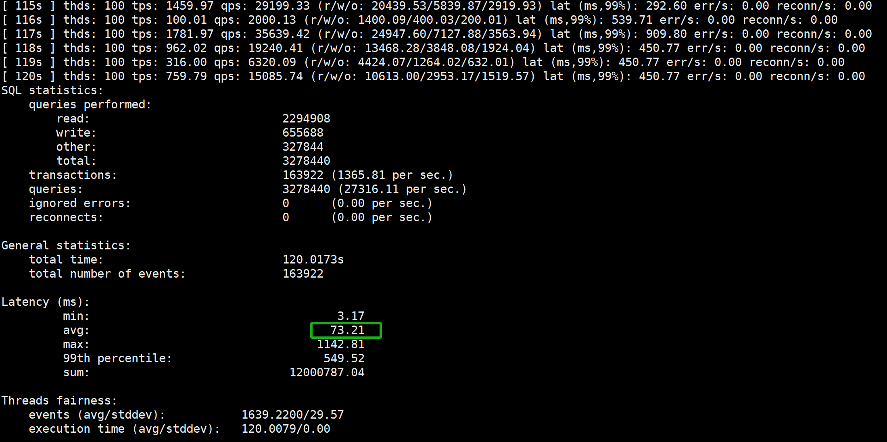

Figure 5-13. Partial screenshot of SysBench test results using the "after" mechanism under single leader Paxos variant.

Users reading official documentation might assume that the single leader Multi-Paxos algorithm can accelerate access. However, in reality, this algorithm is not suitable for consistent read/write operations.

## 5.19 MySQL Secondary Replay

### 5.19.1 Introduction to MySQL Secondary Replay

MySQL supports primary/secondary replication, typically using log shipping. In this setup, a primary instance generates logs for transactions, which are then shipped to one or more secondary instances. The secondaries replay these logs to mirror the primary's state, but may lag behind, affecting read-only queries' accuracy [16].

As server failures become common, replication for high availability is crucial. However, the need for high concurrency in transaction processing on multicore systems conflicts with traditional replication methods. This tension can lead to secondaries falling behind under heavy primary loads, increasing the risk of data loss or requiring throttling of the primary, thus impacting performance.

### 5.19.2 The Difference Between Replay and Transaction Execution

In MySQL's row-based logging, each operation is a log event. Row changes are recorded as insert, update, or delete events. These row events, along with transaction start and end events, define transaction boundaries. Insert events log new row images, update events log both before and after row images, and delete events log deleted row images.

During transactions, the primary writes updates to the log, which the secondary then fetches and replays. Secondaries can handle more read requests than the primary because replaying updates incurs only about half the workload of executing the original query. Additionally, read queries on the primary can conflict with update transactions, causing slowdowns, which supports dispatching read requests to secondaries [16].

### 5.19.3 The Role of Speeding Up MySQL Secondary Replay

The faster the MySQL secondary replay speed, the lower the likelihood of reading stale data from the MySQL secondary. For Group Replication, the speed of MySQL secondary replay is closely tied to high availability. If the MySQL secondary replay speed is fast enough, during a high availability switch, the new primary can immediately start serving new requests. Otherwise, it typically needs to wait until MySQL secondary replay is completed before it can serve new requests.

### 5.19.4 The Architecture of MySQL Secondary Replay

The architecture of MySQL secondary replay is shown in the figure below:

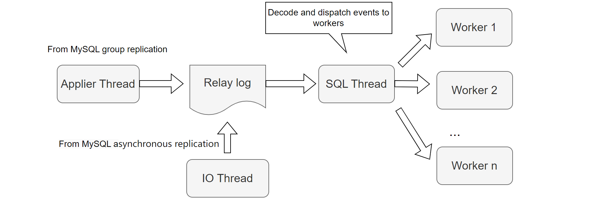

Figure 5-14. MySQL secondary replay architecture.

Asynchronous and semisynchronous replication both utilize an IO thread to read and store transaction events into the relay log. When Group Replication operates normally, it uses the applier thread to store applier events into the relay log. The SQL thread is crucial for MySQL secondary replay, responsible for parsing events and scheduling them. During MySQL secondary replay, multiple workers handle the replay process, each with its own worker queue where the SQL thread places pending events.

For MySQL secondary replay, the SQL thread acts not only as the scheduler but also reads and parses transaction events from the relay log files. When the relay log volume is small, the SQL thread can manage, but as the relay log grows, the SQL thread becomes the primary bottleneck. It struggles to keep up with the workload of parsing events and managing scheduling tasks. Moreover, the SQL thread encounters waiting situations under the following conditions:

1. Each worker queue has a fixed size with no adjustable parameters. If a transaction contains numerous events (e.g., large transactions), the worker queue quickly fills up, causing the SQL thread to wait.
2. If there aren't enough workers available, the SQL thread waits.
3. If the SQL thread finds a new transaction with a last committed value greater than the minimum logical timestamp (low-water-mark) of committed transactions (LWM value), it also needs to wait.

For example, the following code snippet illustrates how the SQL thread enters a waiting state when the worker queue is full.

```c++
  // possible WQ overfill
  while (worker->running_status == Slave_worker::RUNNING && !thd->killed &&
         (ret = worker->jobs.en_queue(job_item)) ==
             Slave_jobs_queue::error_result) {
    thd->ENTER_COND(&worker->jobs_cond, &worker->jobs_lock,
                    &stage_replica_waiting_worker_queue, &old_stage);
    worker->jobs.overfill = true;
    worker->jobs.waited_overfill++;
    rli->mts_wq_overfill_cnt++;
    // wait if worker queue is full
    mysql_cond_wait(&worker->jobs_cond, &worker->jobs_lock);
    mysql_mutex_unlock(&worker->jobs_lock);
    thd->EXIT_COND(&old_stage);
    mysql_mutex_lock(&worker->jobs_lock);
  }
```

Here is another example of code where the SQL thread needs to wait if it detects a newly started transaction with a last committed value greater than the currently calculated LWM value:

```c++
bool Mts_submode_logical_clock::wait_for_last_committed_trx(
    Relay_log_info *rli, longlong last_committed_arg) {
  THD *thd = rli->info_thd;
  ...
  if ((!rli->info_thd->killed && !is_error) &&
      !clock_leq(last_committed_arg, get_lwm_timestamp(rli, true))) {
    PSI_stage_info old_stage;
    struct timespec ts[2];
    set_timespec_nsec(&ts[0], 0);
    assert(rli->gaq->get_length() >= 2);  // there's someone to wait
    thd->ENTER_COND(&rli->logical_clock_cond, &rli->mts_gaq_LOCK,
                    &stage_worker_waiting_for_commit_parent, &old_stage);
    do {
      // wait if LWM is less than last committed
      mysql_cond_wait(&rli->logical_clock_cond, &rli->mts_gaq_LOCK);
    } while ((!rli->info_thd->killed && !is_error) &&
             !clock_leq(last_committed_arg, estimate_lwm_timestamp()));
    min_waited_timestamp.store(SEQ_UNINIT);  // reset waiting flag
    mysql_mutex_unlock(&rli->mts_gaq_LOCK);
    thd->EXIT_COND(&old_stage);
    set_timespec_nsec(&ts[1], 0);
    rli->mts_total_wait_overlap += diff_timespec(&ts[1], &ts[0]);
  } else {
    min_waited_timestamp.store(SEQ_UNINIT);
    mysql_mutex_unlock(&rli->mts_gaq_LOCK);
  }
  return rli->info_thd->killed || is_error;
}
```

Therefore, the SQL thread is often busy and encounters many waiting situations, which is actually one of the main reasons for slow MySQL secondary replay.

## 5.20 The Integration of AI with Databases

Traditional database design relies on empirical methods and specifications, requiring human involvement (e.g., DBAs) for tuning and maintenance. AI techniques alleviate these limitations by exploring more design space than humans and replacing heuristics to solve complex problems. The existing AI techniques for optimizing databases can be categorized as follows [55].

### 5.20.1 Learning-based Database Configuration

1. **Knob Tuning**
   
   Databases have numerous knobs that need to be tuned by DBAs for different scenarios. This approach is not scalable for millions of cloud database instances. Recently, learning-based techniques have been used to automatically tune these knobs, exploring more combinations and recommending high-quality settings, often outperforming DBAs.

2. **Index/View Advisor**
   
   Indexes and views are essential for high performance, traditionally managed by DBAs. Given the vast number of column/table combinations, recommending and building appropriate indexes/views is costly. Recently, learning-based approaches have emerged to automate the recommendation and maintenance of indexes and views.

3. **SQL Rewriter**
   
   Many SQL programmers struggle to write high-quality queries, necessitating rewrites for performance improvement. For example, nested queries may be rewritten as joins for optimization. Existing methods use rule-based strategies, relying on predefined rules, which are limited by the quality and scalability of the rules. Deep reinforcement learning can be used to select and apply rules effectively.

### 5.20.2 Learning-based Database Optimization

1. **Cardinality/Cost Estimation**
   
   Traditional database optimizers struggle to capture correlations between different columns/tables, leading to suboptimal cost and cardinality estimations. Recently, deep learning techniques have been proposed to improve these estimations by using neural networks to better capture correlations.

2. **Join Order Selection**
   
   SQL queries can have millions or even billions of possible execution plans. Efficiently finding a good plan is crucial, but traditional optimizers struggle with large tables due to the high cost of exploring vast plan spaces. Deep reinforcement learning methods have been developed to automatically select efficient plans.

3. **End-to-End Optimizer**
   
   A comprehensive optimizer must consider cost/cardinality estimation, join order, indexes, and views. Learning-based optimizers use deep neural networks to optimize SQL queries holistically, improving overall query performance.

### 5.20.3 Learning-based Database Design

Traditional databases are designed by architects based on experience, which limits the exploration of design spaces. Recently, learning-based self-design techniques have emerged [55]:

1. **Learned indexes**: These reduce index size and improve performance.
2. **Learned data structure design**: Different data structures suit different environments (e.g., hardware, read/write applications). Data structure alchemy creates an inference engine to recommend and design suitable structures.
3. **Learning-based Transaction Management**: Traditional techniques focus on protocols like OCC, PCC, MVCC, 2PC. New studies use AI to predict and schedule transactions, balancing conflict rates and concurrency by learning from data patterns and predicting future workload trends.

### 5.20.4 Learning-based Database Monitoring

Database monitoring captures runtime metrics such as read/write latency and CPU/memory usage, alerting administrators to anomalies like performance slowdowns and attacks. Traditional methods rely on administrators to monitor activities and report problems, which is inefficient. Machine learning techniques optimize this process by determining when and how to monitor specific metrics.

### 5.20.5 Learning-based Database Security

Traditional database security techniques, such as data masking and auditing, rely on user-defined rules and cannot automatically detect unknown vulnerabilities. AI-based algorithms address this by:

1. **Sensitive Data Discovery**: Automatically identifying sensitive data using machine learning.
2. **Anomaly Detection**: Monitoring database activities to detect vulnerabilities.
3. **Access Control**: Automatically estimating data access actions to prevent data leaks.
4. **SQL Injection Prevention**: Using deep learning to analyze user behavior and identify SQL injection attacks.

### 5.20.6 Performance Prediction

Query performance prediction is crucial for meeting service level agreements (SLAs), especially for concurrent queries. Traditional methods focus only on logical I/O metrics, neglecting many resource-related features, leading to inaccurate results.

Marcus et al. used deep learning to predict query latency under concurrency, accounting for interactions between child/parent operators and parallel plans. However, their pipeline structure caused information loss and failed to capture operator-to-operator relations like data sharing and conflict features.

To address this, Zhou et al. proposed a method using graph embedding. They modeled concurrent queries with a graph where vertices represent operators and edges capture operator correlations (e.g., data passing, access conflicts, resource competition). A graph convolution network was used to embed the workload graph, extract performance-related features, and predict performance based on these features [55].

### 5.20.7 AI Challenges

AI models require large-scale, high-quality, diversified training data for optimal performance, but obtaining such data in AI4DB is challenging due to security concerns and reliance on DBAs. For instance, in database knob tuning, training samples depend on DBA experience, making it difficult to gather sufficient samples. Effective models also need data covering various scenarios, hardware environments, and workloads, necessitating methods that perform well with small training datasets.

Adaptability is a major challenge, including adapting to dynamic data updates, different datasets, new hardware environments, and other database systems [55]. Key questions include:

- How to adapt a trained model (e.g., optimizer, cost estimation) to other datasets?
- How to adapt a model to different hardware environments?
- How to adapt a model across different databases?
- How to support dynamic data updates?

Model convergence is crucial. If a model doesn't converge, alternative solutions are needed to avoid delays and inaccuracies, such as in knob tuning where non-converged models can't provide reliable online suggestions.

Traditional OLAP focuses on relational data analytics, but big data introduces new types like graph, time-series, and spatial data. New techniques are required to analyze these multi-model data types and integrate AI with DB techniques for enhanced analytics, such as image analysis.

Transaction modeling and scheduling are critical for OLTP systems due to potential conflicts between transactions. Learning techniques can optimize OLTP queries, like consistent snapshots. However, efficient models are needed to instantly model and schedule transactions across multiple cores and machines.

### 5.20.8 AI Summary

Integrating AI into MySQL offers many impactful opportunities and is one of the main focuses for future development.

## 5.21 How MySQL Internals Work in a Pipeline Fashion?

Database engines like MySQL excel at medium concurrency, interleaving the execution of many transactions, most of which are idle at any given moment [3]. However, as the number of cores per chip increases with Moore's law, MySQL must exploit high parallelism to benefit from new hardware. Despite high concurrency in workloads, internal bottlenecks often prevent MySQL from achieving the needed parallelism.

MySQL's internal operations follow a pipelining approach, where each component functions methodically. To ensure correctness, MySQL uses latches and locks to prevent interference between concurrent operations. For crash-safe recovery, MySQL employs mechanisms like redo log, undo log, idempotence, and double write.

To support concurrent read and write operations, MySQL implements transaction isolation levels and MVCC. These mechanisms enable efficient handling of concurrent operations.

To mitigate single-server failure risks, MySQL uses clustering and high availability solutions. Some operations, such as redo log flushing and MVCC ReadView replication, are serialized. Fast execution of these processes supports high throughput, but slow serialization can hinder scalability.

MySQL manages various processes, including SQL parsing, execution plan generation, redo log writing, transaction subsystem operations, lock subsystem operations, binlog group commit, and network interactions. Effective throughput is achieved when these processes are handled by different threads without overlap. However, thread aggregation in a serialized process can lead to conflicts and performance problems.

Optimizing MySQL's efficiency involves faster response times, reduced CPU consumption, and enhanced scalability.

## 5.22 Why MySQL Needs to Support High Concurrency?

The inability to achieve high throughput is primarily due to the constraints of guaranteeing ACID. More cores lead to more concurrent transactions accessing the same contended data, requiring serialized access to ensure isolation. The maximum throughput of a database system depends on factors like hardware and software implementation. While better hardware and software can improve performance, throughput is fundamentally limited by contended operations. Contended operations vary with transaction isolation levels, multiversioning capabilities, and operation commutativity. Regardless, some operations will always require serialization, limiting throughput. Adding more processors only increases throughput if additional transactions do not conflict with existing ones [23].

In high-conflict scenarios, linear scalability of throughput is unachievable. However, scalability improves in low conflict scenarios, as evidenced by TPC-C tests with numerous warehouses. In practical MySQL operations, short bursts of high concurrency are common. Supporting high concurrency helps maintain MySQL stability during runtime.

Subsequently, the significance of supporting high concurrency specifically for TPC-C testing is analyzed. The figure below illustrates the relationship between throughput and concurrency for MySQL 5.7.39 under a 1ms thinking time scenario. In this context, 1ms thinking time means the user waits 1ms before sending the next request after receiving the response from the previous one.

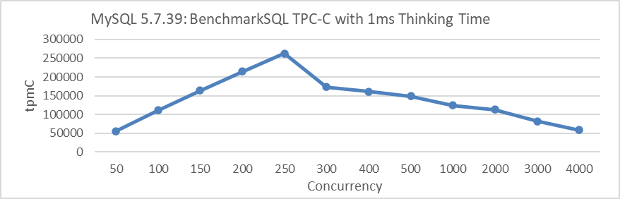

Figure 5-15. MySQL 5.7.39 poor scalability with 1ms thinking time.

From the figure, it can be observed that under a 1ms thinking time scenario, the throughput of MySQL 5.7.39 increases linearly at low concurrency levels. However, once it reaches 250 concurrency, the throughput sharply declines.

The following figure shows the relationship between throughput and concurrency for improved MySQL 8.0.27 under the same 1ms thinking time scenario:

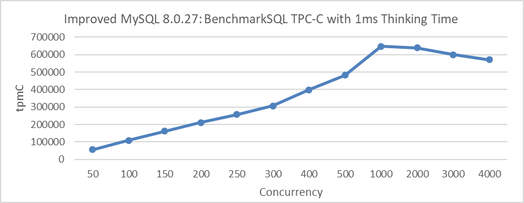

Figure 5-16. Excellent scalability of improved MySQL 8.0.27 with 1ms thinking time.

From the figure, it can be seen that the peak throughput is reached at 1000 concurrency, and this peak significantly exceeds the peak of MySQL 5.7.39 version.

High concurrency support in MySQL is not only crucial for scenarios with thinking time but also essential for deployments across multiple cities (geographically distributed deployments).

The following figure illustrates the relationship between throughput and concurrency for improved MySQL 8.0.27 under different network latency scenarios.

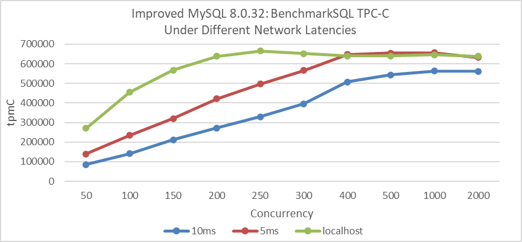

Figure 5-17. Excellent scalability of improved MySQL 8.0.27 under different network latencies.

In scenarios with network latency in the tens of microseconds range for localhost access, peak throughput is achieved at 250 concurrency. With a network latency of 5ms, peak throughput is reached at 500 concurrency, and with a 10ms latency, it requires 1000 concurrency.

Therefore, enhancing MySQL's scalability is highly meaningful. In low-conflict scenarios, enhancing scalability significantly improves throughput and has profound implications across various application contexts. However, in high-conflict situations, transaction throttling strategies are necessary to mitigate scalability problems.

## 5.23 Understanding MySQL Cluster Scalability

First, let's examine the scalability of asynchronous replication. The following figure illustrates the relationship between throughput and concurrency for both a standalone MySQL instance and asynchronous replication.

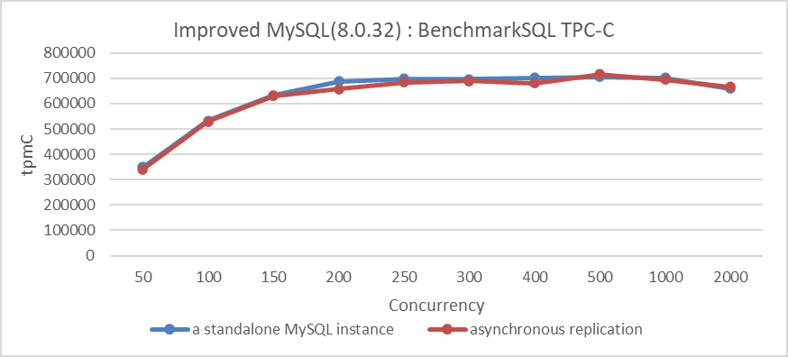

Figure 5-18. Excellent scalability of MySQL asynchronous replication.

From the figure, it can be seen that with asynchronous replication, the MySQL secondary does not significantly impact the throughput of the MySQL primary.

Let's now examine the scalability of semisynchronous replication. For example, the following figure illustrates the relationship between throughput and concurrency for semisynchronous replication.

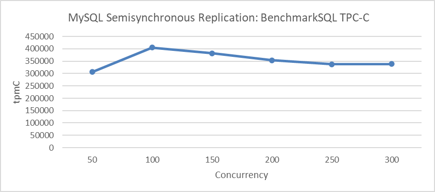

Figure 5-19. Poor scalability of MySQL semisynchronous replication.

From the figure, it is clear that the throughput of semisynchronous replication struggles to increase further. After reaching 100 concurrency, the throughput gradually declines, suggesting a barrier that limits additional scaling. For more details, please refer to section 5.17.3.

Finally, let's examine the scalability of Group Replication. Before delving into that, it's important to understand the performance drawbacks of state machine replication [41], as explained below:

*However, the communication and synchronization cost of agreement entails that state-machine replication adds a considerable overhead to the system's performance, i.e., typical state-machine replication request rates are lower than the request rates of non-replicated systems.*

Subsequently, the maximum scalability of Group Replication is tested, including the implementation of transaction throttling mechanisms to ensure that only a specified number of threads can access the transaction system.

The following figure shows the relationship between Group Replication throughput and concurrency:

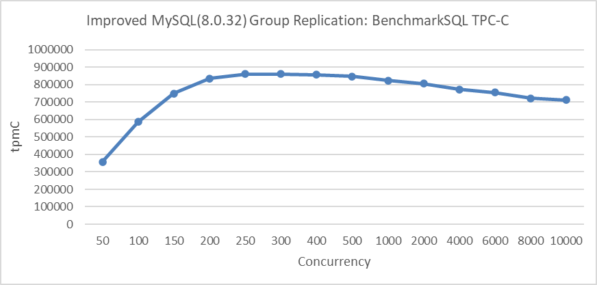

Figure 5-20. Excellent scalability of improved Group Replication with transaction throttling mechanisms.

When throughput peaks at 250 concurrency and then slowly declines, it clearly demonstrates that Group Replication exhibits excellent scalability under the transaction throttling mechanism. Compared to semisynchronous replication, Group Replication's design is significantly superior.

It is important to note that transaction throttling is implemented to manage the broad range of concurrency. An excessive number of transactions entering the InnoDB storage engine can degrade performance and interfere with the evaluation of Group Replication's scalability.

## 5.24 MySQL Problem Diagnosis

Bugs are an inevitable part of programming. Logical reasoning is crucial for identifying and fixing these bugs. It involves systematically analyzing the code, diagnosing the causes of problems, and devising a plan to address them based on logical deductions and inferences. This approach helps programmers debug and troubleshoot in a structured and effective manner [56].

In addition to the commonly used GDB debugging, another approach is to use logging to assist in troubleshooting problems. There will be case studies introducing this method in the subsequent chapters.

Besides the methods mentioned above, MySQL itself also provides several debugging solutions, which are described as follows:

1）MySQL is compiled with debug mode enabled, and trace output can be added in the command terminal (refer to the example below).

```
set global debug= 'd:T:t:i:o,/tmp/mysql.trace';
```

Executing specific SQL statements will output MySQL's internal function call relationships to the trace file, as shown in the   example below:

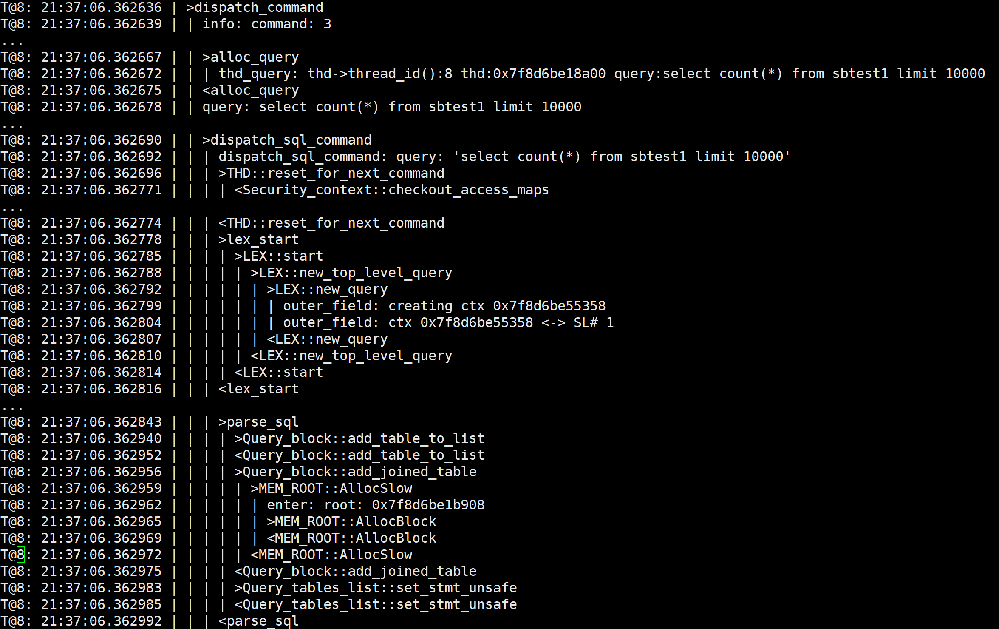

Trace information is very helpful for understanding how MySQL operates, but this method is only suitable for scenarios with very low traffic volume.

2）The Performance Schema collects statistics on various types of information, including memory usage information, locks, and statistics on condition variables, among others.

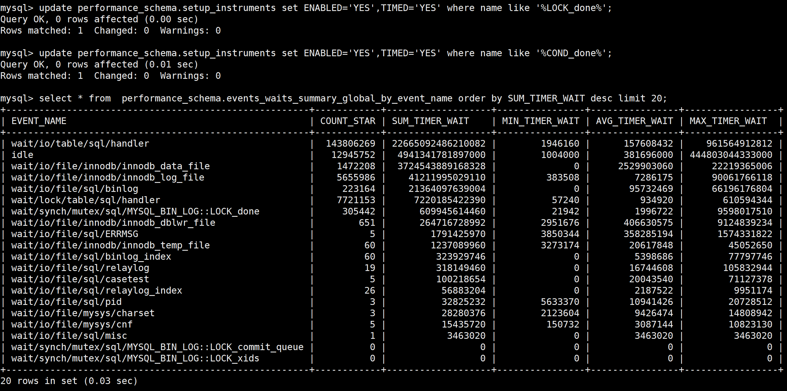

The figure above uses Performance Schema to perform statistical analysis on mutexes and other elements, making it easy to identify which ones incur higher costs.

## 5.25 The Significant Differences Between BenchmarkSQL and SysBench

Using the case of optimizing lock-sys as an example, this section evaluates the significant differences between the SysBench tool and BenchmarkSQL in MySQL performance testing.

First, use SysBench's standard read/write tests to evaluate the optimization of lock-sys.

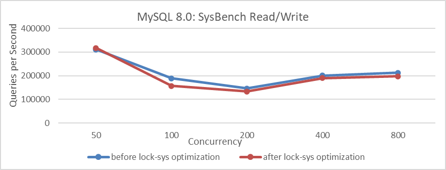

Figure 5-21. Comparison of SysBench read-write tests before and after lock-sys optimization.

From the figure, it can be observed that after optimization, the overall performance of the SysBench tests has actually decreased.

Next, using BenchmarkSQL to test this optimization, the results are shown in the following figure.

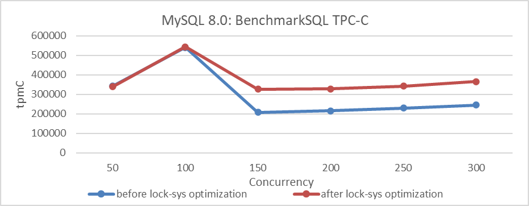

Figure 5-22. Comparison of BenchmarkSQL tests before and after lock-sys optimization.

From the figure, it can be seen that the results of BenchmarkSQL's TPC-C test indicate that the lock-sys optimization is effective. Why does such a significant difference occur? Let's analyze the differences in characteristics between these testing tools to understand why their tests differ.

SysBench RW testing is characterized by its speed and simplicity with SQL queries. Under the same concurrency conditions, SysBench typically handles fewer concurrent transactions compared to BenchmarkSQL. Therefore, in the face of latch queue bottlenecks like lock-sys, high concurrency in SysBench may equate to low concurrency in BenchmarkSQL. Consequently, lock-sys optimizations may not have a significant impact in scenarios where BenchmarkSQL operates at lower concurrency levels.

BenchmarkSQL, a widely used TPC-C testing tool, distributes user threads more evenly across various modules, reducing susceptibility to aggregation effects. In high-concurrency situations, optimizing lock-sys can significantly reduce latch conflicts and minimize impact on other queues, thereby improving throughput. BenchmarkSQL's TPC-C testing is better suited for uncovering deeper concurrency problems in MySQL compared to SysBench.

This analysis uses deductive reasoning to explore the differences between SysBench and BenchmarkSQL. It demonstrates that poor performance in SysBench tests does not necessarily indicate poor performance in production environments, and vice versa. This discrepancy arises because SysBench test environments often differ significantly from real-world production environments. Consequently, SysBench test results should be used for scenario-specific performance comparisons rather than as comprehensive indicators of production capabilities.

It is worth noting that the main basis for performance testing and comparison in this book, mainly based on TPC-C, is as follows [50]:

*TPC benchmark C also known as TPC-C which is the leading online transaction processing (OLTP) benchmark has been used to perform the comparison.*

In this book, BenchmarkSQL is predominantly used for TPC-C testing. This choice is based not only on BenchmarkSQL's representative TPC-C testing capabilities but also on its higher alignment with real-world online environments.

 [Next](Chapter6.md)
