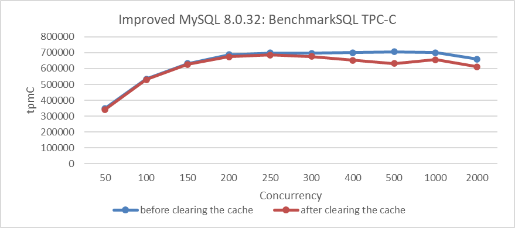
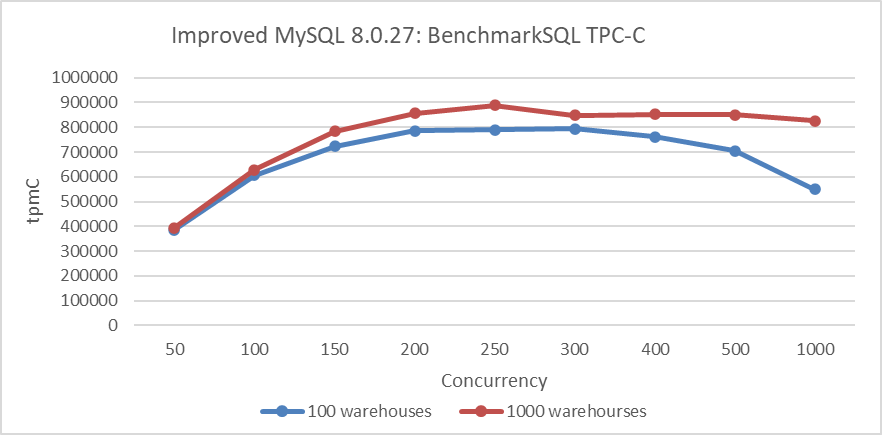
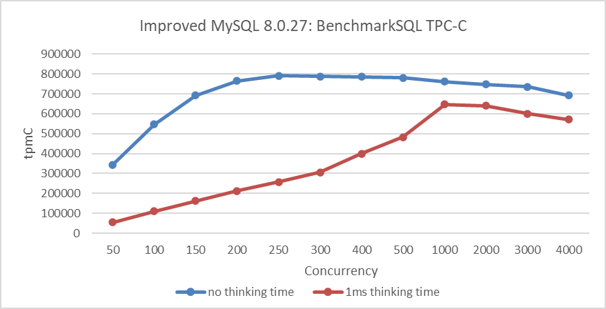
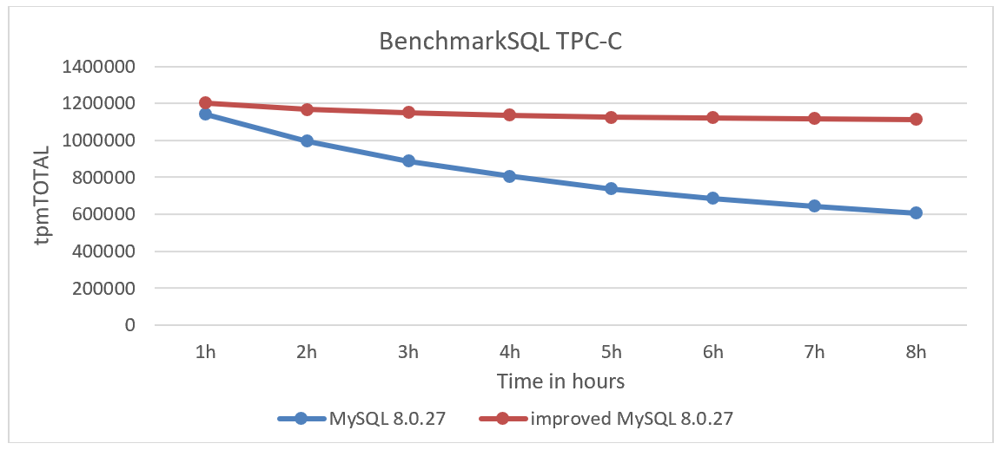
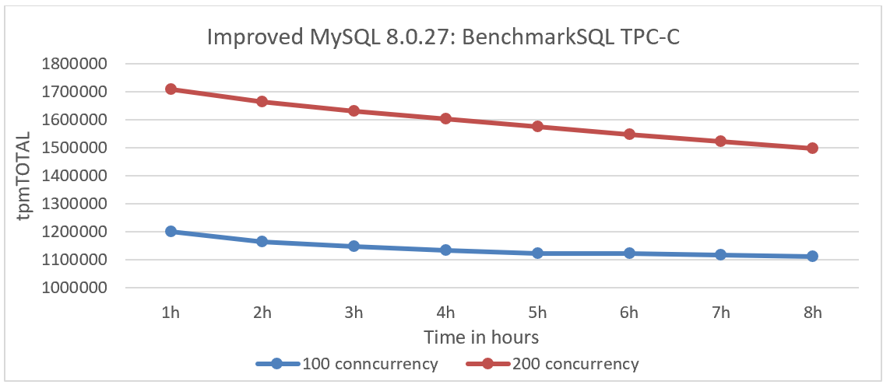
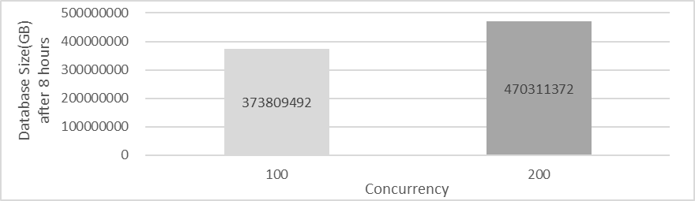
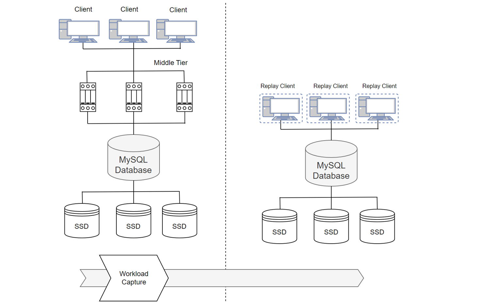

# Chapter 6: How to Scientifically Test MySQL Performance?

Performance benchmarking is commonly used to compare different systems or algorithms in both scientific literature and industrial publications. Although performance measurements might seem objective, various factors can influence benchmark results, intentionally or accidentally, favoring one system over another. There is a fundamental conflict of interest in performance benchmarking, especially when evaluations are made against previous versions or competitors' systems. Some results, often referred to as "benchmarketing", misrepresent performance data. Fair performance benchmarking is challenging, and it's easy to misrepresent data, either by accident or on purpose [9].

This book explores common pitfalls in MySQL performance benchmarking and describes how to avoid them to ensure fair performance comparisons.

## 6.1 Common Pitfalls

This section discusses common pitfalls encountered when performing performance comparisons.

### 6.1.1 Non-Reproducibility

Reproducibility is a cornerstone of scientific research, allowing others to verify results and identify errors. Without reproducibility, claims and numbers in experiments cannot be validated. Conducting reproducible experiments is relatively straightforward and cost-effective compared to larger scientific studies. However, many database research papers lack reproducibility due to closed-source code, undisclosed data, or proprietary systems.

To enable reproducibility, all configuration parameters must be provided, including minor details like the operating system, server installation, version, setup, and configuration flags. Additionally, source code for any algorithms or implementations should be made available [9].

Most tests in this book will include source code, MySQL configuration files, testing tool details, hardware specifications, and OS versions to ensure reproducibility and verification of the test results.

### 6.1.2 Failure To Optimize

Benchmarks are commonly used to compare systems or assess the effectiveness of new algorithms. Typically, experiments involve comparing a newly proposed system against an existing one to demonstrate superior performance.

This setup, however, can disincentivize proper optimization of the existing system, as poor performance of the current system can make the new system appear better. This problem is significant for systems that depend on proper configuration, as an improperly configured system can perform much worse than a well-configured one.

Optimizing a DBMS for a specific workload is complex and often requires expertise. Even minor optimizations can improve fairness in performance comparisons. Following optimization guidelines for benchmarks or involving representatives from the compared systems can also help achieve more accurate results [9].

For performance testing in this book, the following strategies are applied:

1. **Conduct Pre- and Post-Optimization Comparisons:** Where feasible, perform performance comparisons before and after optimization, aiming for minimal variation.
2. **Match Configuration Parameters:** Align configuration parameters as closely as possible with the production environment.
3. **Conduct Performance Comparisons on Identical Hardware**: Perform tests on the same x86 machine in a NUMA environment with identical configurations. Reinitialize MySQL data directories and clean SSDs (via TRIM) to avoid interference. Test across a range of concurrency levels to assess throughput and determine whether optimizations improve performance or scalability.
4. **Repeat Testing with NUMA Node Binding**: After binding to NUMA node 0, repeat the tests to compare performance in an SMP environment.
5. **Test on x86 Machines with NUMA Disabled**: Conduct comparative performance testing on x86 machines with identical hardware but with NUMA disabled (in the BIOS).
6. **Evaluate Performance on ARM Machines**: Test comparative performance on ARM machines in a NUMA environment with similar MySQL configurations.
7. **Verify Consistency with Different Tools**: Use various testing tools to compare results and ensure consistency. For example, employ BenchmarkSQL and modified versions of tpcc-mysql for TPC-C testing.
8. **Assess Performance Under Varying Network Latency**: Examine performance effects under different network latency conditions.
9. **Test Performance with Different "Thinking Time" Scenarios**: Evaluate how performance varies with different "thinking time" scenarios to gauge consistency.
10. **Perform Closed-Loop Testing**: Ensure no interference during testing by repeating the initial tests and comparing results with the first round. Small differences in test results indicate that the environment is relatively stable.
11. **Verify Bottleneck Interference**: Confirm whether interference from other bottlenecks under high concurrency has distorted the performance comparison.
12. **Analyze Theoretical Basis and Anomalies**: Evaluate whether the performance optimization has a theoretical basis and if any anomalies can be explained. Analyze the type of optimization, its general applicability, and which environments benefit most. Investigate anomalies to determine their causes.

### 6.1.3 Overly-specific Tuning

These problems can be mitigated by conducting a range of experiments beyond standardized benchmarks. While standardized benchmarks provide a useful baseline, some systems may be heavily optimized for them, reducing their effectiveness for comparison. Thus, additional queries should be tested and measured [9].

To address these problems, MySQL configuration should meet the following criteria:

1. **Minimize Impact of Configuration Parameters**: Ensure parameters, like buffer pool size, do not hinder other optimizations.
2. **Use Default Configurations**: Apply default settings for uncertain parameters, such as spin delay.
3. **Match Production Configurations**: Align test settings with production configurations, e.g., sync_binlog=1 and innodb_flush_log_at_trx_commit=1.

To overcome the limitations of single-type testing, employ a variety of test scenarios. For TPC-C, include tests with varying conflict severity, thinking time, and network latency. For SysBench, use tests with Pareto distributions, read/write, and write-only operations.

These strategies ensure a comprehensive evaluation of MySQL performance optimizations under various conditions, resulting in more robust and reliable results.

### 6.1.4 Cold vs. Hot Runs

It's crucial to differentiate between 'hot' and 'cold' runs. Cold runs, which occur when relevant data is being loaded from persistent storage and queries are being parsed, are typically slower than hot runs where data is already cached. Performance measurements for cold and hot runs should be recorded and reported separately due to these differences [9].

For TPC-C testing, all test operations follow a standardized process to ensure consistency, and tests are conducted in an environment free from human interference. Additionally, to mitigate performance disturbances caused by different environments, closed-loop testing is employed to maximize the reliability of the test results as much as possible.

### 6.1.5 Cold vs. Warm Runs

Measuring cold runs requires caution to avoid accidentally recording warm runs. Proper measurement involves more than just restarting the database server and running a query, as operating systems may cache data in memory. The correct method is to stop the database server, clear all OS caches, restart the server, and then run the queries

An evaluation test was conducted to assess these impacts. For instance, the following figure compares TPC-C throughput and concurrency before and after clearing the cache.

Figure 6-1. Comparison of BenchmarkSQL tests before and after clearing the cache.

From the figure, it can be observed that the throughput after clearing the cache is indeed lower compared to the previous throughput.

To mitigate such problems, closed-loop testing was employed, which effectively detects anomalies in the environment.

### 6.1.6 Human Error

When evaluating the performance of a newly designed algorithm, it is crucial to verify the correctness of the implementation to avoid overlooking bugs that may produce incorrect results. A bug might lead to performance metrics being based on faulty outcomes, potentially making the algorithm appear more efficient due to, for example, less data being processed. This problem is compounded if the benchmark is not reproducible, as incorrect implementations may be mistakenly accepted as valid.

Additionally, a program might work correctly for specific datasets but fail in general cases due to problems like inadequate overflow handling or hardcoding dataset properties. Always verify that the program produces correct results by comparing outputs against reference answers from benchmark specifications and checking results with varying data [9].

For performance testing, it's essential to consider whether optimization results are influenced by other factors. For example, in MySQL 8.0 with the CATS lock scheduling algorithm, the performance evaluation could be impacted by extensive deadlock logs generated by MySQL.

## 6.2 Comprehensive Testing

Performance testing is an extremely complex process. Only through comprehensive testing and analysis can errors during the testing process be minimized, allowing for a scientific assessment of the value of an optimization.

### 6.2.1 Testing with Multiple Tools

SysBench, BenchmarkSQL, and a modified tpcc-mysql tool are primarily used for testing. SysBench tests read/write, write-only, and Pareto distribution scenarios. BenchmarkSQL is used for TPC-C testing across various concurrency levels. The modified tpcc-mysql tool tests MySQL under extreme conditions.

### 6.2.2 Identifying Contention-Intensive Tests

The more concurrent threads accessing the same data, the greater the contention. SysBench Pareto distribution tests are considered high-contention, while SysBench uniform distribution tests are low-contention. In modified BenchmarkSQL, testing with 1000 warehouses represents low contention, while testing with 10 warehouses under the same concurrency level indicates high contention.

### 6.2.3 Understanding TPC-C Testing Characteristics

The TPC-C benchmark is the gold standard for database concurrency control in both research and industry [25].

Experiment settings can significantly impact evaluation results. In TPC-C:

- Introducing wait time makes experiments I/O intensive.
- Removing wait time makes experiments CPU/memory intensive.
- Reducing the number of warehouses makes experiments contention intensive.

TPC-C can stress test almost every key component of a computer system, but this versatility poses challenges for fair comparisons between different systems [8].

At a high level, the following factors reduce contention:

- More warehouses
- Fewer cross-warehouse transactions
- Fewer workers/users per warehouse
- Adding wait time
- Short or no I/Os within a critical section

In low-contention settings, throughput is limited by the system's slowest component:

- Disk I/O if data exceeds DRAM size
- Network I/O if using traditional TCP stack and data fits in DRAM
- Centralized sequencers or global dependency graphs may also cause scalability bottlenecks

Conversely, the following factors increase contention:

- Fewer warehouses
- More cross-warehouse transactions
- More workers/users per warehouse
- No wait time
- Long I/Os within a critical section

In high-contention settings, throughput is determined by the concurrency control mechanism. Systems that can release locks earlier or reduce aborts will have advantages [8].

The following figure shows the relationship between TPC-C throughput and concurrency for different numbers of warehouses. The dark blue curve represents 100 warehouses, while the deep red curve represents 1000 warehouses. The figure illustrates that throughput for 100 warehouses is significantly lower than for 1000 warehouses due to more severe contention in the former scenario.

Figure 6-2. More warehouses indicate less severe contention.

### 6.2.4 Incorporating Thinking Time in Testing

TPC-C includes a wait time, simulating user behavior with keying and think times before each transaction. Each warehouse has ten terminals, one per district, allowing a maximum of ten concurrent transactions per warehouse. The vanilla TPC-C does not allow tuning these parameters, except for the number of warehouses.

Due to the wait time and the ten concurrent user limit per warehouse, the maximal throughput per warehouse is limited. To achieve higher throughput, many warehouses must be used, which is why systems like OceanBase and Oracle use millions of warehouses. For workloads storing large data with low throughput per GB, SSDs can meet throughput requirements more cost-effectively than DRAM, aligning with the hardware configurations of OceanBase and Oracle. Thus, vanilla TPC-C is an I/O intensive benchmark with low contention, as long wait times and limited concurrent users per warehouse mean low simultaneous access probability.

Most research addresses contentions, necessitating the removal of wait time for higher throughput and contention levels per warehouse. Fewer warehouses are used to maintain contention. TPC-C numbers with and without wait time are not comparable due to stress testing different system components [8].

TPC-C testing with a 1ms thinking time (pause before requests) is shown in the following figure, illustrating the throughput-concurrency relationship.

Figure 6-3. Impact of 1ms thinking time on throughput.

From the figure, it can be observed that with a 1ms thinking time, the peak throughput is achieved at 1000 concurrency, whereas in normal TPC-C testing, the peak is reached at 250 concurrency. Testing with thinking time introduces significant differences compared to regular BenchmarkSQL testing and also requires MySQL to have better scalability.

### 6.2.5 Impact of I/O on Testing

A fully-featured database system must handle network I/Os for protocols like 2PC, data replication, or Paxos, and disk I/Os for data persistence. Many studies omit these I/Os, raising questions about their impact.

Results may vary with hardware and implementation, but generally, TCP alone can support millions of transactions per second if only one packet is needed per TPC-C transaction. However, adding protocols like 2PC and replication increases packet requirements significantly. For instance, standard Paxos replication to three replicas requires at least four packets per transaction, which can overwhelm the TCP stack and become a bottleneck for high transaction rates.

Network and disk latency also impact throughput in contended workloads. Longer latencies in critical sections will reduce maximum throughput, with I/O latency having a more significant effect.

However, no solution is perfect: RDMA, for example, involves costly hardware and complex software and does not significantly aid in geo-distributed environments [8].

### 6.2.6 Long-Term Stability Testing

According to the TPC-C benchmark, the database must operate in a steady state for eight hours and exceed two hours in the performance collection phase. Additionally, the benchmark requires the database to maintain less than 2% jitter over two hours of testing [14].

To meet these stability requirements in MySQL testing, the following measures were implemented:

1. Regularly cleaning the binlog to prevent SSD performance degradation due to I/O space constraints.
2. Utilizing a larger number of warehouses.
3. Adding indexes.
4. Deploying multiple SSDs.

Following these measures, TPC-C testing was performed using BenchmarkSQL. The figure below illustrates the stability test comparison between MySQL 8.0.27 and the improved MySQL 8.0.27.

Figure 6-4. Comparison of stability tests: MySQL 8.0.27 vs. improved MySQL 8.0.27.

From the figure, it is evident that although MySQL and the improved MySQL start with similar throughput, the throughput of MySQL decreases more rapidly over time than expected, while the improved MySQL remains significantly more stable.

Additionally, comparisons were made for the improved MySQL at different concurrency levels. The figure below shows the throughput over time: the deep blue curve represents 100 concurrency, while the deep red curve represents 200 concurrency.

Figure 6-5. Stability test comparison: 100 vs. 200 concurrency.

From the figure, it can be observed that throughput is more stable at 100 concurrency. At 200 concurrency, the increased data processing leads to a faster decline in throughput, as the larger database scale on a single server results in slower access times.

The following figure compares the size of MySQL database files after completing an 8-hour test at 100 and 200 concurrency levels.

Figure 6-6. Database size comparison: 100 vs. 200 concurrency after 8 hours.

From the figure, it is evident that at 200 concurrency, the database size is significantly larger than at 100 concurrency. Generally, higher throughput tends to reduce stability, and various factors influence stability testing, making broad generalizations challenging.

### 6.2.7 Online Traffic Testing

Performance testing often fails to reflect real-world use cases and is typically reported with insufficient detail for replication or drawing accurate conclusions [39].

TCPCopy [60] can capture a production workload and replay it on a test system, preserving the exact timing, concurrency, and transaction characteristics of the original workload. This allows for testing the impact of system changes without affecting the production environment.

The following figure illustrates the mechanism of replicating MySQL traffic from the online system to the MySQL testing system.

Figure 6-7. Mechanism for replicating MySQL traffic from production to testing systems.

Testing real-world online traffic is crucial for MySQL, as it effectively reveals potential problems such as performance stability, memory leaks, and the robustness of new MySQL versions.

[Next](Part3.md)
