# Chapter 7: Key Improvements of MySQL 8.0 Over MySQL 5.7

MySQL 8.0 has introduced substantial improvements over MySQL 5.7. It not only enhances functionality and adds support for hash joins in execution plans but, more importantly, greatly improves scalability. These advancements lay a solid foundation for future improvements.

## 7.1 Scaling Up: InnoDB Improvements

Early open-source DBMS code often used a coarse-grained latch for the entire kernel. In contrast, InnoDB has adopted a more refined approach, employing separate latches for different kernel components, such as the lock manager and buffer pool [19].

MySQL 8.0 introduced additional improvements to enhance the scalability of the InnoDB storage engine. Here are the related improvements:

1.  **Redo Log Optimization:** Enhancements to the redo log have facilitated subsequent performance improvements.
2.  **Lock-sys Latch Sharding:** The lock-sys latch has been sharded, akin to read-write locks, to improve transactional locking.
3.  **Trx-sys Latch Splitting and Sharding:** While contention for latches persists, optimizations in trx-sys lay a strong foundation for future improvements in MVCC ReadView.

These significant scalability improvements will be discussed in detail below.

### 7.1.1 Redo Log Optimization

Write-ahead logging is a fundamental, omnipresent component in ARIES-style concurrency and recovery, and it represents a significant potential bottleneck, especially in OLTP workloads making frequent small changes to data. Two logging-related impediments to database system scalability are identified, each challenging different levels of the software architecture [3]:

1.  The high volume of small-sized I/O requests may saturate the disk.
2.  Contention arises as transactions serialize access to in-memory log data structures.

The above potential bottlenecks are reflected in MySQL 5.7. Detailed information on redo log optimization can be found in "*MySQL 8.0: New Lock-Free, Scalable WAL Design*", where the complexity lies in how the sequential order of Log Sequence Numbers (LSN) is ensured in the new design. The article also highlights the following improvements [27]:

*We have introduced dedicated threads for particular tasks related to the redo log writes. User threads no longer do writes to the redo files themselves. They simply wait when they need redo flushed to disk and it is not flushed yet.*

This improvement completely changed the previous mechanism and laid a solid foundation for scalability. The following git log details the specific optimizations made to the redo log.

```c++
commit 6be2fa0bdbbadc52cc8478b52b69db02b0eaff40
Author: Paweł Olchawa <pawel.olchawa@oracle.com>
Date:   Wed Feb 14 09:33:42 2018 +0100
    
    WL#10310 Redo log optimization: dedicated threads and concurrent log buffer.

    0. Log buffer became a ring buffer, data inside is no longer shifted.
    1. User threads are able to write concurrently to log buffer. 
    2. Relaxed order of dirty pages in flush lists - no need to synchronize
       the order in which dirty pages are added to flush lists.
    3. Concurrent MTR commits can interleave on different stages of commits.
    4. Introduced dedicated log threads which keep writing log buffer: 
        * log_writer: writes log buffer to system buffers,
        * log_flusher: flushes system buffers to disk.
       As soon as they finished writing (flushing) and there is new data to 
       write (flush), they start next write (flush).
    5. User threads no longer write / flush log buffer to disk, they only
       wait by spinning or on event for notification. They do not have to 
       compete for the responsibility of writing / flushing.
    6. Introduced a ring buffer of events (one per log-block) which are used
       by user threads to wait for written/flushed redo log to avoid:
        * contention on single event
        * false wake-ups of all waiting threads whenever some write/flush
          has finished (we can wake-up only those waiting in related blocks)
    7. Introduced dedicated notifier threads not to delay next writes/fsyncs:
        * log_write_notifier: notifies user threads about written redo,
        * log_flush_notifier: notifies user threads about flushed redo.
    8. Master thread no longer has to flush log buffer.
    ...
    30. Mysql test runner received a new feature (thanks to Marcin):
        --exec_in_background.
    Review: RB#15134
    Reviewers:
        - Marcin Babij <marcin.babij@oracle.com>,
        - Debarun Banerjee <debarun.banerjee@oracle.com>.
    Performance tests:
        - Dimitri Kravtchuk <dimitri.kravtchuk@oracle.com>,
        - Daniel Blanchard <daniel.blanchard@oracle.com>,
        - Amrendra Kumar <amrendra.x.kumar@oracle.com>.
    QA and MTR tests:
        - Vinay Fisrekar <vinay.fisrekar@oracle.com>.
```

The new mechanism employs dedicated threads to flush redo log files, supports concurrent writes to the log buffer, removes global latches in the code, and introduces latch-free processing, significantly enhancing scalability.

A test comparing TPC-C throughput with different levels of concurrency before and after optimization was conducted. Specific details are shown in the following figure:

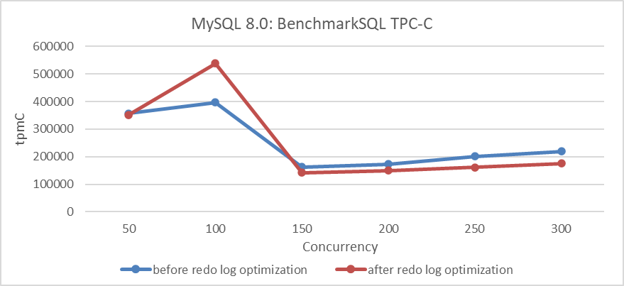

Figure 7-1. Impact of redo log optimization under different concurrency levels.

The results in the figure show a significant improvement in throughput at low concurrency levels but a decrease at high concurrency levels. This decrease can be attributed to two potential reasons:

1.  **Unsolved Foundational Flaws:** During the transformation process, foundational problems may not have been fully addressed.
2.  **Interference from Multiple Queue Bottlenecks:** Problems similar to multi-queue bottlenecks interfering with each other may arise. Although performance in some areas has improved, other bottlenecks have worsened under high concurrency.

Extensive research suggests that the optimization should theoretically enhance throughput. The redo log optimization uses a group commit-like mechanism to reduce I/O overhead. Instead of immediately flushing redo log contents, user threads write to a log buffer and wait, while a dedicated thread batches and flushes the log to disk, notifying user threads when the process is complete. This approach is expected to significantly decrease I/O operations under high concurrency. Therefore, the most likely cause of performance problems is exacerbated bottlenecks in other queues.

Implementing redo log optimization is highly challenging, and without it, achieving throughput levels in the millions of tpmC would be nearly impossible.

Extensive testing revealed that the optimizations performed well under low concurrency conditions and significantly accelerated the TPC-C data loading process. Specific details are shown in the following figure:

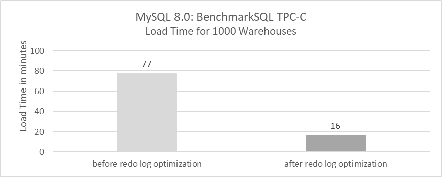

Figure 7-2. Impact of redo log optimization for TPC-C data loading time.

The TPC-C data loading process involves large transactions of up to 100MB. Previously, loading 1000 warehouses took 77 minutes, but with the optimization, it now takes only 16 minutes. This demonstrates that redo log optimization is highly effective for handling large transactions.

To assess the true value of this optimization, scalability enhancements were applied to MySQL 5.7.36. This process involved first applying the trx-sys patch, followed by the lock-sys patch, to evaluate the extent of throughput improvement. Specific details are shown in the following figure:

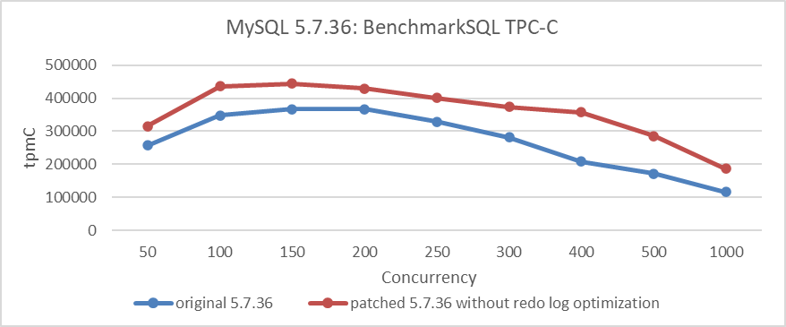

Figure 7-3. Indirect impact of redo log optimization.

From the figure, it can be seen that after applying the trx-sys and lock-sys scalability patches, MySQL 5.7.36 experienced an improvement in throughput. However, it did not fundamentally solve scalability problems, especially when compared to the improved MySQL 8.0.27 version. The gap remains significant. To identify the bottleneck at 250 concurrency, the following screenshot from the *perf* tool can be examined.

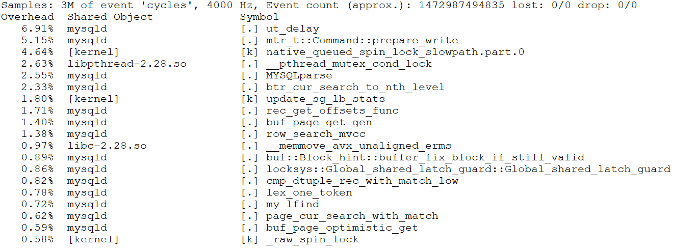

Figure 7-4. Screenshot from the *perf* tool at 250 concurrency.

From the figure, it is evident that the bottleneck is **prepare_write**, which precisely corresponds to the bottleneck of writing redo log buffer in MySQL 5.7.36 version.

```c++
/** Prepare to write the mini-transaction log to the redo log buffer.
@return number of bytes to write in finish_write() */
ulint mtr_t::Command::prepare_write() {
  switch (m_impl->m_log_mode) {
    case MTR_LOG_SHORT_INSERTS:
      ut_d(ut_error);
      /* fall through (write no redo log) */
      [[fallthrough]];
    case MTR_LOG_NO_REDO:
    case MTR_LOG_NONE:
      ut_ad(m_impl->m_log.size() == 0);
      return 0;
    case MTR_LOG_ALL:
      break;
    default:
      ut_d(ut_error);
      ut_o(return 0);
  }
  ...
```

Let's analyze this function by examining its call stack relationship.


Figure 7-5. Call stack relationship revealing bottleneck in redo log writing.

The figure clearly shows that the bottleneck lies in redo log writing. Without the redo log optimization patch, the scalability problems in MySQL 5.7.36 cannot be fundamentally solved, underscoring the significant impact of redo log optimization.

Does redo log optimization currently have any side effects? Test data indicates that under low concurrency conditions, the number of flush operations increases significantly. Using SysBench read-write tests, the relationship between the average number of I/O flushes per transaction and concurrency was statistically analyzed. Specific details are shown in the following figure:


Figure 7-6. Side effects of redo log optimization at low concurrency: more I/O flushes.

From the figure, it can be observed that with 3 concurrent read-write operations, each transaction averages over 9 flushes, while at 200 concurrency, it decreases to around 1 flush per transaction. These average flush counts can be further optimized, but it requires finding a balance: timely flushing activates user threads more quickly but incurs higher I/O overhead, whereas delaying flushing reduces I/O costs but may increase user response times.

### 7.1.2 Optimizing Lock-Sys Through Latch Sharding

In MySQL 5.7, the lock system experienced significant latch contention problems, which severely impacted throughput under high concurrency. During transaction execution, frequent locking and unlocking operations require acquiring a global latch. When many user threads compete for this global latch, MySQL's scalability becomes a major concern.

Lock-sys optimization is the second major improvement made in MySQL 8.0. The following git log describes the specific details of the lock-sys optimization.

```c++
commit 1d259b87a63defa814e19a7534380cb43ee23c48
Author: Jakub Łopuszański <jakub.lopuszanski@oracle.com>
Date:   Wed Feb 5 14:12:22 2020 +0100
    
    WL#10314 - InnoDB: Lock-sys optimization: sharded lock_sys mutex

    The Lock-sys orchestrates access to tables and rows. Each table, and each row,
    can be thought of as a resource, and a transaction may request access right for
    a resource. As two transactions operating on a single resource can lead to
    problems if the two operations conflict with each other, Lock-sys remembers
    lists of already GRANTED lock requests and checks new requests for conflicts in
    which case they have to start WAITING for their turn.
    
    Lock-sys stores both GRANTED and WAITING lock requests in lists known as queues.
    To allow concurrent operations on these queues, we need a mechanism to latch
    these queues in safe and quick fashion.
    
    In the past a single latch protected access to all of these queues.
    This scaled poorly, and the managment of queues become a bottleneck.
    In this WL, we introduce a more granular approach to latching.
    
    Reviewed-by: Pawel Olchawa <pawel.olchawa@oracle.com>
    Reviewed-by: Debarun Banerjee <debarun.banerjee@oracle.com>
      RB:23836

```

Sharding the global latch theoretically can significantly improve scalability under high concurrency situations. Based on the program before and after optimizing with lock-sys, using BenchmarkSQL to compare TPC-C throughput with concurrency, the specific results are as shown in the following figure:

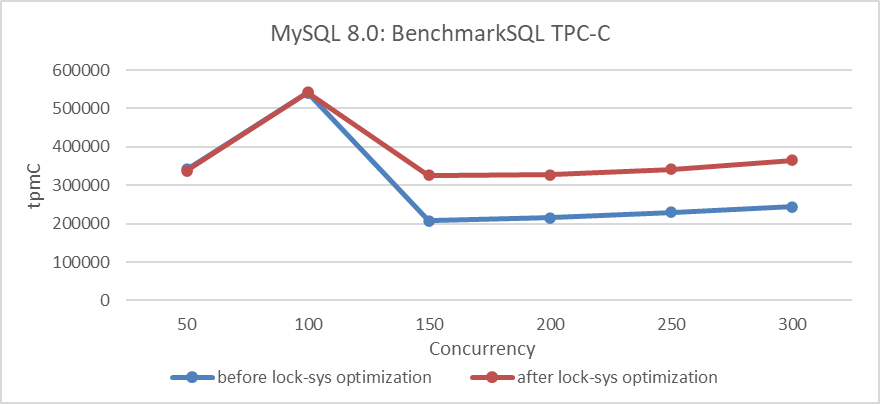

Figure 7-7. Impact of lock-sys optimization under different concurrency levels.

From the figure, it can be seen that optimizing lock-sys significantly improves throughput under high concurrency conditions, while the effect is less pronounced under low concurrency due to fewer conflicts.

### 7.1.3 Latch Splitting in trx-sys

The trx-sys subsystem in MySQL, closely related to MVCC, primarily involves read operations. Improvements to redo log and lock-sys are mainly associated with write operations.

MySQL 5.7 utilized a global latch to synchronize various operations within trx-sys. To enhance read capabilities, it was crucial to address this latch bottleneck. However, the intertwined logic made modification challenging.

In MySQL 8.0, the global latch was initially split. A new latch was introduced for the *serialization_list*, allowing bypass of the global latch and reducing the contention pressure on it. The following git log describes the specific details of these optimizations.

```c++
commit e66d48b0c73d5fec278f81784bd5697502990263
Author: Paweł Olchawa <pawel.olchawa@oracle.com>
Date:   Mon Mar 1 15:52:30 2021 +0100
    
    BUG#27933068 USE DIFFERENT MUTEX TO PROTECT TRX_SYS->SERIALISATION_LIST
    
    This is an optimization patch, which reduces contention on the trx_sys_t::mutex
    by introducing a new mutex - the trx_sys_t::serialisation_mutex.
    
    The new mutex protects the trx_sys_t::serialisation_list and replaces the
    trx_sys_t::mutex when trx->no is being assigned.
    
    This is a modified version of the contribution patch which was created by Zhai Weixiang.
    Modifications:
    1. Periodical write of max_trx_id to the transaction system header page is modified.
    2. The trx_get_serial_no() is called when we do not hold trx_sys_t::mutex.
    3. Members in trx_sys_t are rearranged, so they are grouped by mutex that protects them.
    4. The new mutex received its own latch_id.
    5. InnoDB relies on rw_trx_max_id instead of max_trx_id in few places.
    6. The min_active_id is updated only when it really changes.
    
    RB: 19712
    Reviewed-by: Debarun Banerjee debarun.banerjee@oracle.com

```

Based on this optimization before and after, using BenchmarkSQL to compare TPC-C throughput with concurrency, the specific results are shown in the following figure:

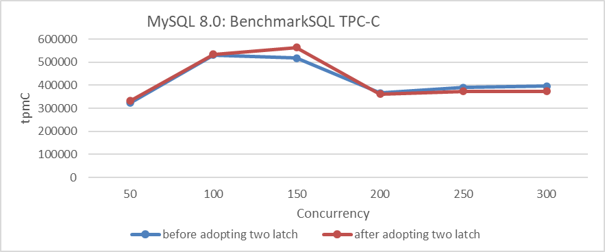

Figure 7-8. Impact of latch splitting in trx-sys under different concurrency levels.

From the figure, it can be seen that the optimization is effective at 150 concurrency. However, beyond 200 concurrency, throughput not only fails to increase but actually decreases. This decline at high concurrency levels is primarily due to interference from other queue bottlenecks.

### 7.1.4 Latch Sharding for trx-sys

In MySQL 8.0, further scalability improvements are made to the trx-sys subsystem. The *rw_trx_set* has been divided into shards, each with its own latch. This significantly reduces global latch contention for read operations. The following git log describes the specific details of these optimizations.

```c++
commit bc95476c0156070fd5cedcfd354fa68ce3c95bdb
Author: Paweł Olchawa <pawel.olchawa@oracle.com>
Date:   Tue May 25 18:12:20 2021 +0200
    
    BUG#32832196 SINGLE RW_TRX_SET LEADS TO CONTENTION ON TRX_SYS MUTEX
    
    1. Introduced shards, each with rw_trx_set and dedicated mutex.
    2. Extracted modifications to rw_trx_set outside its original critical sections
       (removal had to be extracted outside trx_erase_lists).
    3. Eliminated allocation on heap inside TrxUndoRsegs.
    4. [BUG-FIX] The trx->state and trx->start_time became converted to std::atomic<>
       fields to avoid risk of torn reads on egzotic platforms.
    5. Added assertions which ensure that thread operating on transaction has rights
       to do so (to show there is no possible race condition).
    
    RB: 26314
    Reviewed-by: Jakub Łopuszański jakub.lopuszanski@oracle.com
```

Based on these optimizations before and after, using BenchmarkSQL to compare TPC-C throughput with concurrency, the specific results are as shown in the following figure:


Figure 7-9. Impact of latch sharding in trx-sys under different concurrency levels.

From the figure, it can be seen that this improvement significantly enhances TPC-C throughput, reaching its peak at 200 concurrency. It is worth noting that the impact diminishes at 300 concurrency, primarily due to ongoing scalability problems in the trx-sys subsystem related to MVCC ReadView. This problem will be discussed further in the next chapter.

### 7.1.5 Summary

The series of scalability improvements mentioned above have laid a solid foundation for achieving high throughput in MySQL. Without these changes, subsequent improvements would lose their significance. Therefore, MySQL 8.0 has made significant advancements in scalability.

## 7.2 Evaluating Performance Gains in MySQL Lock Scheduling Algorithms

Scheduling is crucial in computer system design. The right policy can significantly reduce mean response time without needing faster machines, effectively improving performance for free. Scheduling also optimizes other metrics, such as user fairness and differentiated service levels, ensuring some job classes have lower mean delays than others [24].

MySQL 8.0 uses the Contention-Aware Transaction Scheduling (CATS) algorithm to prioritize transactions waiting for locks. When multiple transactions compete for the same lock, CATS determines the priority based on scheduling weight, calculated by the number of transactions a given transaction blocks. The transaction blocking the most others gets higher priority; if weights are equal, the longest waiting transaction goes first.

A deadlock occurs when multiple transactions cannot proceed because each holds a lock needed by another, causing all involved to wait indefinitely without releasing their locks.

After understanding the MySQL lock scheduling algorithm, let's examine how this algorithm affects throughput. Before testing, it is necessary to understand the previous FIFO algorithm and how to restore it. For relevant details, refer to the git log explanations provided below.

```c++
This WL improves the implementation of CATS to the point where the FCFS will be redundant (as often slower, and easy to "emulate" by setting equal schedule weights in CATS), so it removes FCFS from the code, further simplifying the lock_sys's logic.
```

Based on the above prompt, restoring the FIFO lock scheduling algorithm in MySQL is straightforward. Subsequently, throughput was tested using SysBench Pareto distribution scenarios with varying concurrency levels in the improved MySQL 8.0.32. Details are provided in the following figure.

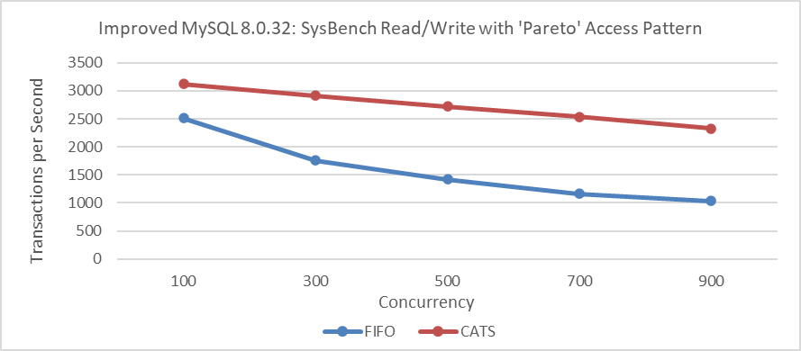

Figure 7-10. Impact of CATS on throughput at various concurrency levels.

From the figure, it can be seen that the throughput of the CATS algorithm significantly exceeds that of the FIFO algorithm. To compare these two algorithms in terms of user response time, refer to the following figure.

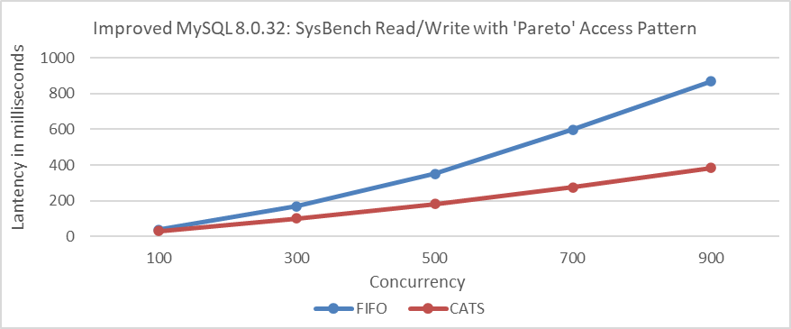

Figure 7-11. Impact of CATS on response time at various concurrency levels.

From the figure, it can be seen that the CATS algorithm provides significantly better user response times.

Furthermore, comparing deadlock error statistics during the Pareto distribution test process, details can be found in the following figure.

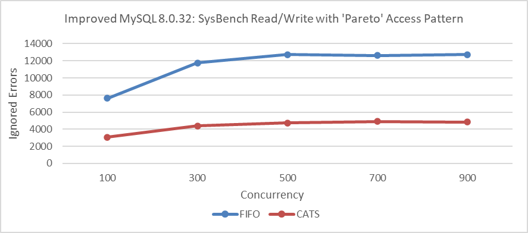

Figure 7-12. Impact of CATS on ignored errors at various concurrency levels.

Comparative analysis shows that the CATS algorithm significantly reduces deadlocks. This reduction in deadlocks likely plays a key role in improving performance. The theoretical basis for this correlation is as follows [8]:

*Under a high-contention setting, the throughput of the target system will be determined by the concurrency control mechanism of the target system: systems which can release locks earlier or reduce the number of aborts will have advantages in such a setting.*

The above test results align closely with MySQL's official findings. The following two figures, based on official tests [57], demonstrate the significant effectiveness of the CATS algorithm.

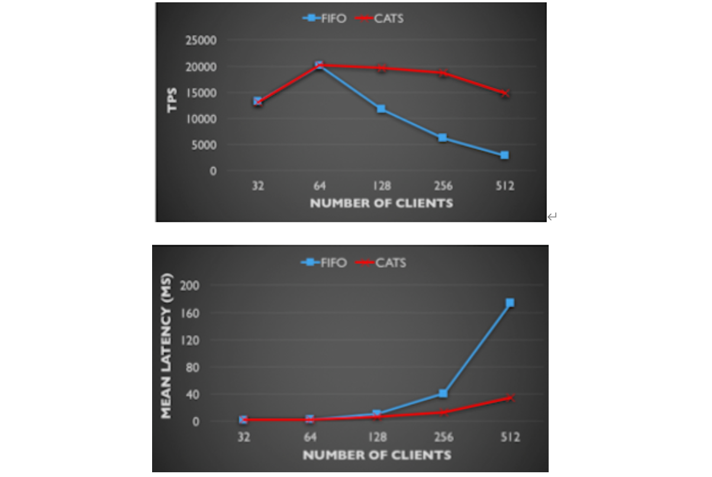

Figure 7-13. Comparison of CATS and FIFO in TPS and mean latency: insights from the MySQL blog.

Additionally, MySQL's official requirements for implementing the CATS algorithm are stringent. Specific details are provided in the following figure:

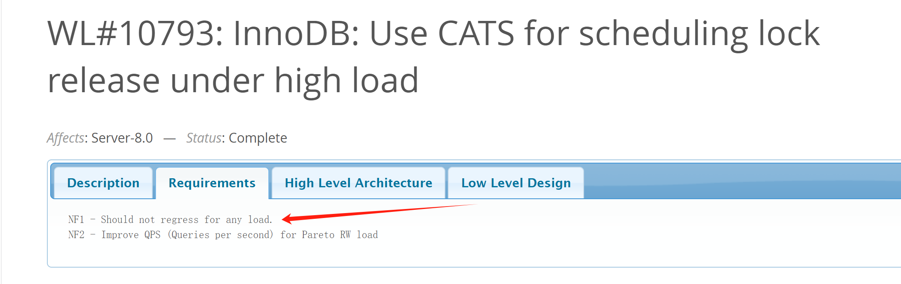

Figure 7-14. Requirements of the official worklog for CATS.

Therefore, with the adoption of the CATS algorithm, performance degradation should be absent in all scenarios. It seems like things end here, but the summary in the CATS algorithm's paper [24] raises some doubts. Details are provided in the following figure:

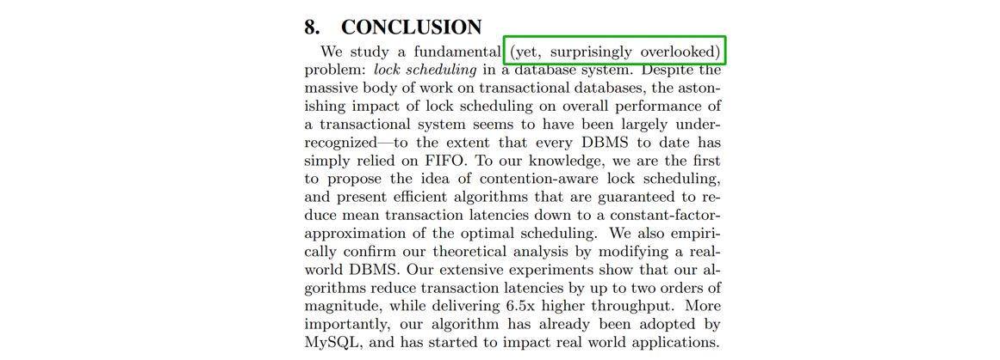

Figure 7-15. Doubts about the CATS paper.

From the information above, it can be inferred that either the industry has overlooked potential flaws in FIFO, or the paper's assessment is flawed, and FIFO does not have the serious problems suggested. This contradiction highlights a critical problem: one of these conclusions must be flawed; both cannot be correct.

Contradictions often present valuable opportunities for in-depth problem analysis and resolution. They highlight areas where existing understanding may be challenged or where new insights can be gained.

This time, testing on the improved MySQL 8.0.27 revealed significant bottlenecks under severe conflicts. The *perf* screenshot is shown in the following figure:

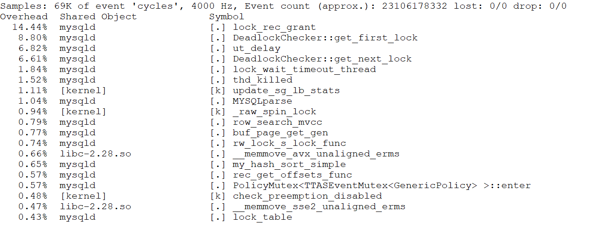

Figure 7-16. The *perf* screenshot highlighting deadlock problems.

Based on the figure, the bottleneck seems to be related to deadlock problems. The MySQL error log file shows numerous error logs, with a partial screenshot provided below:

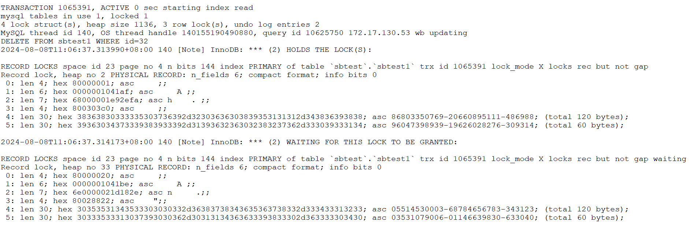

Figure 7-17. Partial screenshot of numerous error logs.

Continuing the analysis of the corresponding code, the specifics are as follows:

```c++
void Deadlock_notifier::notify(const ut::vector<const trx_t *> &trxs_on_cycle,
                               const trx_t *victim_trx) {
  ut_ad(locksys::owns_exclusive_global_latch());
  start_print();
  const auto n = trxs_on_cycle.size();
  for (size_t i = 0; i < n; ++i) {
    const trx_t *trx = trxs_on_cycle[i];
    const trx_t *blocked_trx = trxs_on_cycle[0 < i ? i - 1 : n - 1];
    const lock_t *blocking_lock =
        lock_has_to_wait_in_queue(blocked_trx->lock.wait_lock, trx);
    ut_a(blocking_lock);
    print_title(i, "TRANSACTION");
    print(trx, 3000);
    print_title(i, "HOLDS THE LOCK(S)");
    print(blocking_lock);
    print_title(i, "WAITING FOR THIS LOCK TO BE GRANTED");
    print(trx->lock.wait_lock);
  }
  const auto victim_it =
      std::find(trxs_on_cycle.begin(), trxs_on_cycle.end(), victim_trx);
  ut_ad(victim_it != trxs_on_cycle.end());
  const auto victim_pos = std::distance(trxs_on_cycle.begin(), victim_it);
  ut::ostringstream buff;
  buff << "*** WE ROLL BACK TRANSACTION (" << (victim_pos + 1) << ")\n";
  print(buff.str().c_str());
  DBUG_PRINT("ib_lock", ("deadlock detected"));
  ...
  lock_deadlock_found = true;
}
```

From the code analysis, it's clear that deadlocks lead to a substantial amount of log output. The ignored errors observed during testing are connected to these deadlocks. The CATS algorithm helps reduce the number of ignored errors, resulting in fewer log outputs. This problem can be consistently reproduced.

Given this context, several considerations emerge:

1.  **Impact on Performance Testing:** The extensive error logs and the resulting disruptions could potentially skew the performance evaluation, leading to inaccurate assessments of the system's capabilities.
2.  **Effectiveness of the CATS Algorithm:** The performance improvement of the CATS algorithm may need re-evaluation. If the extensive output of error logs significantly impacts performance, its actual effectiveness may not be as high as initially believed.

Remove all logs from the **Deadlock_notifier::notify** function, recompile MySQL, and perform SysBench read-write tests under Pareto distribution. Details are provided in the following figure:

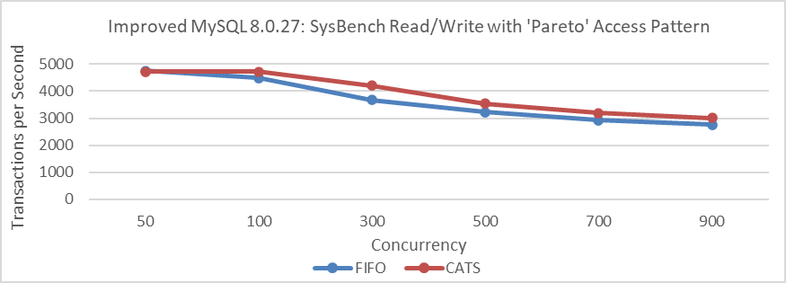

Figure 7-18. Impact of CATS on throughput at various concurrency levels for improved MySQL 8.0.27 after eliminating interference.

From the figure, it is evident that there has been a significant change in throughput comparison. In scenarios with severe conflicts, the CATS algorithm slightly outperforms the FIFO algorithm, but the difference is minimal and much less pronounced than in previous tests. Note that these tests were conducted on the improved MySQL 8.0.27.

Let's conduct performance comparison tests on the improved MySQL 8.0.32, with deadlock log interference removed, using Pareto distribution.

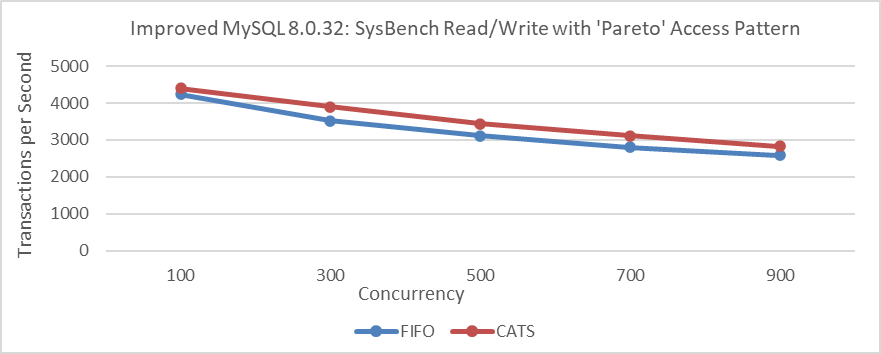

Figure 7-19. Impact of CATS on throughput at various concurrency levels for improved MySQL 8.0.32 after eliminating interference.

From the figure, it is evident that removing the interference results in only a slight performance difference. This small variation makes it understandable why the severity of FIFO scheduling problems may be difficult to notice. The perceived bias from CATS authors and MySQL officials likely stems from the extensive log output interference caused by deadlocks.

Using the same 32 warehouses as in the CATS algorithm paper, TPC-C tests were conducted at various concurrency levels. MySQL was based on the improved MySQL 8.0.27, and BenchmarkSQL was modified to support 100 concurrent transactions per warehouse.

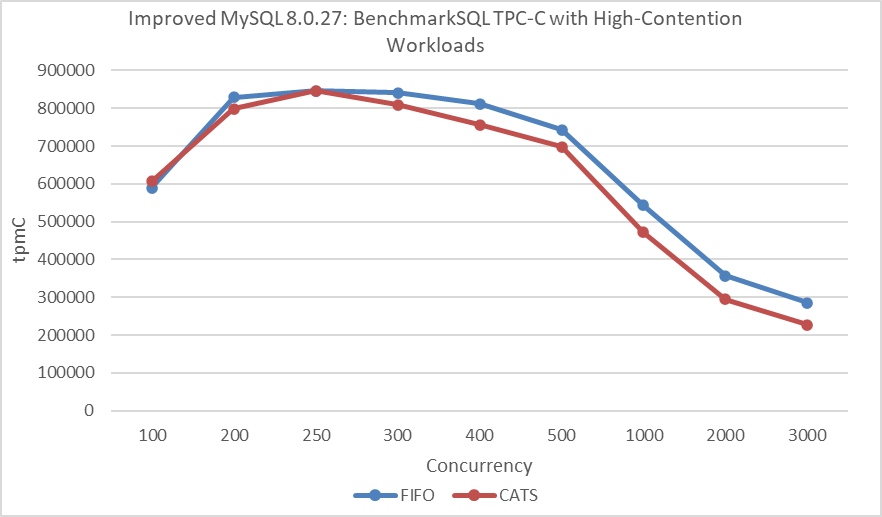

Figure 7-20. Impact of CATS on throughput at different concurrency levels under NUMA after eliminating interference, according to the CATS paper.

From the figure, it's evident that the CATS algorithm performs worse than the FIFO algorithm. To avoid NUMA-related interference, MySQL was bound to NUMA node 0 for a new round of throughput versus concurrency tests.

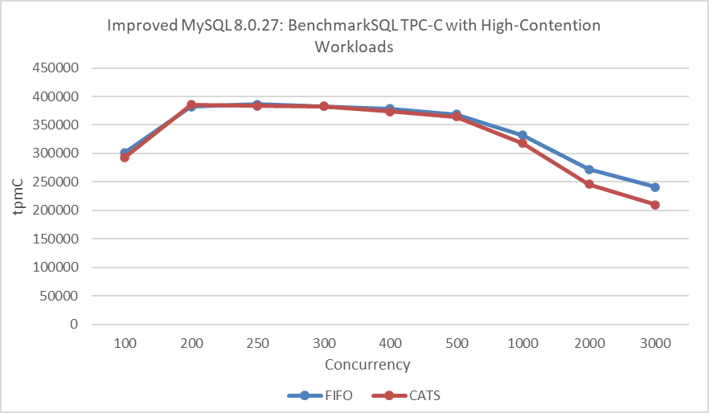

Figure 7-21. Impact of CATS on throughput at different concurrency levels under SMP after eliminating interference, according to the CATS paper.

In this round of testing, the FIFO algorithm continued to outperform the CATS algorithm. The decline in performance of the CATS algorithm in BenchmarkSQL TPC-C testing compared to improvements in SysBench Pareto testing can be attributed to the following reasons:

1.  **Additional Overhead**: The CATS algorithm inherently introduces some extra overhead.
2.  **NUMA Environment Problems**: The CATS algorithm may not perform optimally in NUMA environments.
3.  **Conflict Severity**: The conflict severity in TPC-C testing is less pronounced than in SysBench Pareto testing.
4.  **Different Concurrency Scenarios**: SysBench creates concurrency scenarios that differ significantly from those in BenchmarkSQL.

Finally, standard TPC-C testing was performed again with 1000 warehouses at varying concurrency levels. Specific details are shown in the following figure:


Figure 7-22. Impact of CATS on BenchmarkSQL throughput after eliminating interference.

From the figure, it is evident that there is little difference between the two algorithms in low-conflict scenarios. In other words, the CATS algorithm does not offer significant benefits in situations with fewer conflicts.

Overall, while CATS shows some improvement in Pareto testing, it is less pronounced than expected. The interference from deadlock log outputs during performance testing impacted the results. The CATS algorithm significantly reduces transaction deadlocks, leading to fewer log outputs and less performance degradation compared to the FIFO algorithm. When deadlock logs are suppressed, the difference between these algorithms is minimal, clarifying the confusion surrounding the CATS algorithm's performance.

Database performance testing is inherently complex and error-prone [9]. It cannot be judged by data alone and requires thorough investigation to ensure logical consistency.

## 7.3 Enhancements in MySQL Execution Plans

### 7.3.1 Hash Join Implementation in MySQL

As the name suggests, hashing is central to the hash join algorithm. It builds a hash table from one input table and then processes the other table row by row, using the hash table for lookups.

Hash joins are typically faster and are preferred over the block nested loop algorithm used in earlier MySQL versions. The benefits are substantial, as demonstrated by the practical case below.

In MySQL 5.7, which lacks hash join support, the SQL query relies on traditional join methods, resulting in a longer execution time of 3.82 seconds.

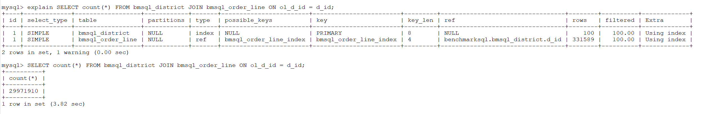

Figure 7-23. Non-hash join performance in MySQL 5.7.

MySQL 8.0 introduced hash join. For the same SQL query, using hash join with hints reduced the execution time to 1.22 seconds, a significant improvement over the 3.82 seconds with traditional methods.

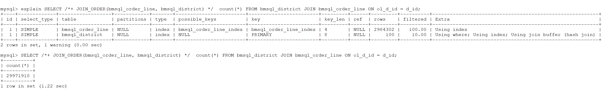

Figure 7-24. Hash join performance in MySQL 8.0.

Notably, hash join in MySQL 8.0 enhances join performance under the following conditions [13]:

1.  No index is available
2.  The query is I/O-bound
3.  A large portion of a table is accessed
4.  There are selective conditions across multiple tables
5.  Increasing join_buffer_size can further improve performance

The introduction of hash join is a significant feature in MySQL 8.0, offering a promising solution for reducing response times.

### 7.3.2 Introduction of Hypergraph Algorithm in MySQL

The hypergraph algorithm was introduced in MySQL 8.0 but is currently only available in debug mode. The following git log provides specific implementation details of the hypergraph algorithm.

```c++
commit b9be77784bf690173522d8db015acf0e72f28f84
Author: Steinar H. Gunderson <steinar.gunderson@oracle.com>
Date:   Wed May 6 16:32:13 2020 +0200

    WL #14070: Hypergraph partitioning algorithm
    
    Implement DPhyp for hypergraph partitioning, a central component of the join
    optimizer. The algorithm enumerates all possible connected sub-hypergraphs
    of the larger join graph, in a bottom-up fashion. (That is, for a given graph G
    with a subgraphs A and B than can further be partitioned respectively into A1/A2
    and B1/B2, A1 and A2 will both be seen before A, which will in turn be seen
    before S. However, there is no guarantee that B1 or B2 is seen before A.)
    
    The algorithm is described in the paper "Dynamic Programming Strikes Back" by
    Neumann and Moerkotte. There is a somewhat extended version of the paper
    (that also contains a few corrections) in Moerkotte's treatise "Building Query
    Compilers". Some critical details are still missing, which we've had to fill in
    ourselves. We don't currently implement the extension to generalized
    hypergraphs, but it should be fairly straightforward to do later.
    
    Since our graphs can never have more than 61 tables, node sets and edge lists
    are implemented using 64-bit bit sets. This allows for a compact representation
    and very fast set manipulation; the algorithm does a fair amount of
    intersections and unions. If we should need extensions to larger graphs later
    (this will require additional heuristics for reducing the search space), we can
    use dynamic bit sets, although at a performance cost.
    
    This is implemented entirely independently of the server; there are no MySQL
    dependencies, short of some shared header files for bit manipulations. It is
    tested using unit tests and microbenchmarks.
    
    Change-Id: I7912c09ab69a17e607ee3b8fb2af2bd7602e54ec
```

From the above, it can be seen that the theoretical foundation for the hypergraph algorithm's implementation is detailed in the paper "Dynamic Programming Strikes Back" [35]. This highlights the high level of complexity involved in its implementation.

A cost-based query optimizer is crucial for the overall performance of a database management system, particularly in finding the optimal join order. Building on the efficient *DPccp* algorithm, which uses dynamic programming, a new algorithm, *DPhyp*, is introduced to handle complex join predicates effectively. By modeling the query graph as a hypergraph and analyzing its connected subgraphs, *DPhyp* improves the optimization of non-inner joins, offering substantial performance gains over previous methods.

With advances in hardware, high-complexity algorithms are becoming practical. Even though some algorithms may not run in polynomial time, modern computers can handle large NP-complete problems efficiently. Dynamic programming techniques, while still exponential, are increasingly viable for moderate instance sizes, often achieving time complexities of O(2^n).

Nevertheless, when using the hypergraph algorithm, the number of tables involved in joins should be kept within reasonable limits to avoid potential performance problems. Performance comparisons were conducted for complex join operations in TPC-C, with and without hypergraph optimization enabled. Detailed results are shown in the following figure:

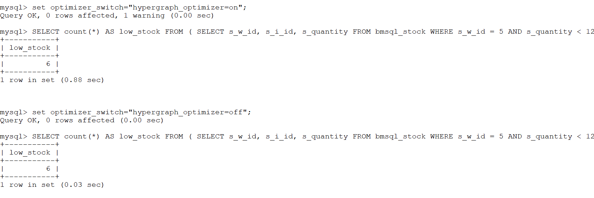

Figure 7-25. Effects of hypergraph algorithms on typical TPC-C SQL workloads.

From the figure, it is evident that enabling the hypergraph algorithm results in an execution time of 0.88 seconds, whereas disabling it reduces the time to 0.03 seconds. This demonstrates the significant performance impact of using the hypergraph algorithm. In many cases, the overhead of the hypergraph can be substantial. If MySQL's default execution plan leads to slow performance, the hypergraph algorithm might offer valuable improvements.

Let's further analyze the performance of the hypergraph algorithm by examining the *perf* flame graph in the following figure.

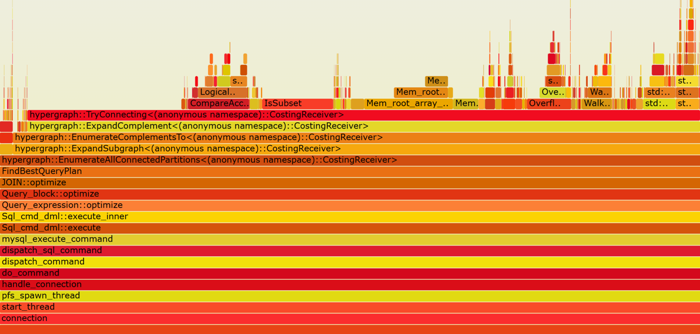

Figure 7-26. A typical flame graph of hypergraph algorithm.

From the figure, it is evident that the hypergraph algorithm (hypergraph\*) consumes a significant amount of computation. Currently operating in single-threaded mode, there is substantial potential for optimizing the hypergraph algorithm.

Due to MySQL's absence of query plan caching, constructing optimal execution plans with the hypergraph algorithm is time-consuming, posing challenges for its effective use in production environments.

Notably, AI can also be utilized for optimizing execution plans, as discussed in section 5.20.2.

## 7.4 Cost Savings with Binlog Compression

Starting with MySQL 8.0.20, binlog compression is supported but disabled by default. It can be enabled with the *binlog_transaction_compression* parameter, and the *zstd* compression level can be adjusted using the *binlog_transaction_compression_level_zstd* parameter, with a default level of 3.

Using a Group Replication cluster within the same data center, the impact of binlog compression on TPC-C throughput and concurrency was examined using BenchmarkSQL. Both primary and secondary nodes were configured with the *binlog_transaction_compression* parameter. Specific test results are shown in the following figure:

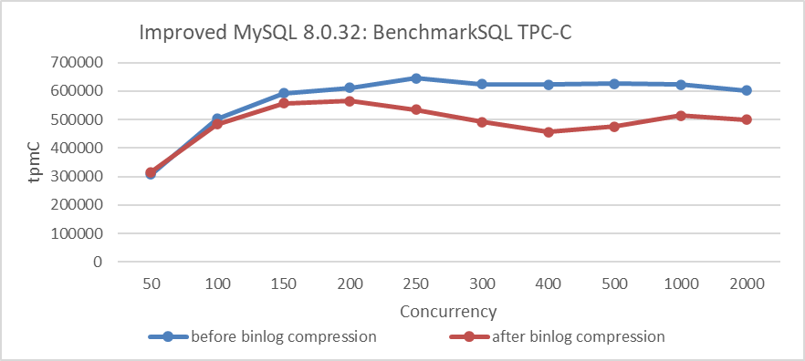

Figure 7-27. Impact of binlog compression on BenchmarkSQL performance.

From the figure, it is evident that enabling binlog compression significantly affects throughput, with noticeable fluctuations.

The next step is to compare binlog sizes before and after compression. Specific details are shown in the following figure:

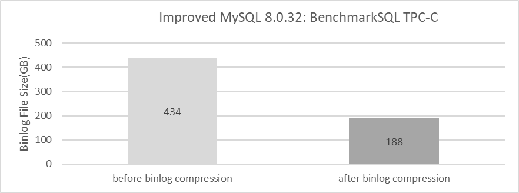

Figure 7-28. Effects of binlog compression after BenchmarkSQL testing.

From the figure, it is evident that binlog compression has a notable positive effect on TPC-C testing. It's worth noting that setting *binlog_row_image=minimal* can significantly reduce binlog size, but it has less impact on performance. Specific details are shown in the following figure:

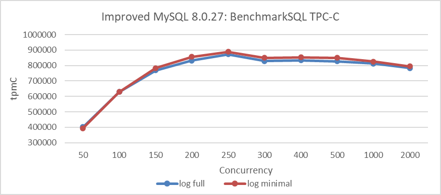

Figure 7-29. Impact of *binlog_row_image=minimal* on BenchmarkSQL performance.

Finally, let's examine the comparison of binlog sizes between *binlog_row_image=minimal* and *binlog_row_image=full*. Specific details are shown in the following figure:

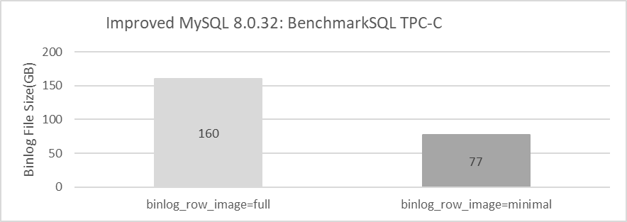

Figure 7-30. Effects of *binlog_row_image=minimal* after BenchmarkSQL testing.

From the figure, it can be seen that setting *binlog_row_image=minimal* can also significantly reduce the size of binlogs.

Overall, MySQL 8.0 offers effective solutions to address the problem of binlogs consuming substantial I/O space. Users can leverage binlog compression and, where feasible, further reduce binlog size by using *binlog_row_image=minimal* to save on storage costs. It's important to note that the compression ratio can vary across different applications.
