# Chapter 8: Refining MySQL 8.0: Next-Level Improvements

This chapter examines optimization opportunities and solutions found in MySQL 8.0 improvements, including SQL layer improvements, InnoDB storage engine enhancements, and transaction throttling mechanisms.

## 8.1 Improvements at the SQL Layer

The performance degradation problem in certain scenarios related to query execution plans was fixed. The mechanism activating user threads in binlog group commit was also improved, further improving efficiency.

### 8.1.1 Solved Performance Degradation in Query Execution Plans

During secondary development on MySQL 8.0.27, TPC-C tests with BenchmarkSQL became unstable. Throughput rapidly declined, complicating optimization. Trust in the official version led to initially overlooking this problem despite testing difficulties.

Only after a user reported a significant performance drop following an upgrade did we begin to take it seriously. The reliable feedback from users indicated that while MySQL 8.0.25 performed well, upgrading to MySQL 8.0.29 led to a substantial decline. This crucial information indicated that there was a performance problem.

Simultaneously, it was confirmed that the performance degradation problem in MySQL 8.0.27 was the same as in MySQL 8.0.29. MySQL 8.0.27 had undergone two scalability optimizations specifically for trx-sys, which theoretically should have increased throughput. Reviewing the impact of latch sharding in trx-sys on performance:

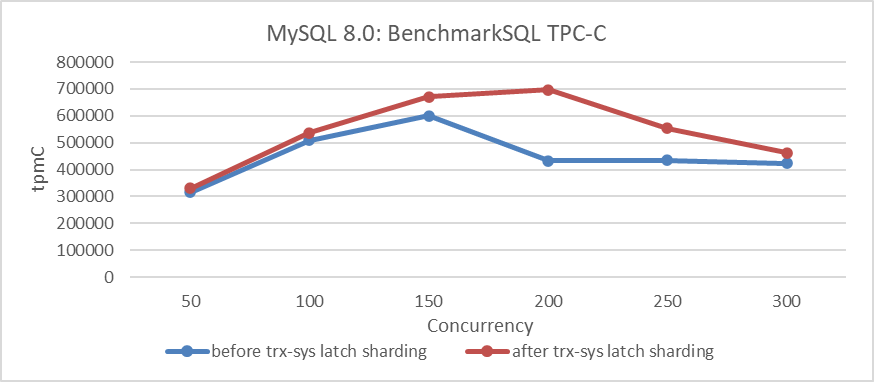

Figure 8-1. Impact of latch sharding in trx-sys under different concurrency levels.

Let's continue examining the comparison of throughput and concurrency between trx-sys latch sharding optimization and the MySQL 8.0.27 release version. Specific details are shown in the following figure:

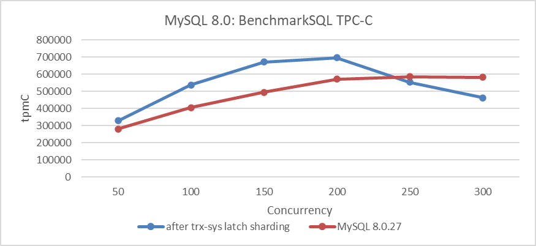

Figure 8-2. Performance degradation in MySQL 8.0.27 release version.

From the figure, it is evident that the performance degradation of the MySQL 8.0.27 release version is significant under low concurrency conditions, with a noticeable drop in peak performance. This aligns with user feedback regarding decreased throughput and is easily reproducible using BenchmarkSQL.

The MySQL 8.0.27 release version already had this problem, whereas the earlier MySQL 8.0.25 release version did not. Using this information, the goal was to identify the specific git commit that caused the performance degradation. Finding the git commit responsible for performance degradation is a complex process that typically involves binary search. After extensive testing, it was initially narrowed down to a specific commit. However, this commit contained tens of thousands of lines of code, making it nearly impossible to pinpoint the exact segment causing the problem. It was later discovered that this commit was a collective merge from a particular branch. This allowed for further breakdown and ultimately identifying the root cause of the problem in the following:

```c++
commit 9a13c1c6971f4bd56d143179ecfb34cca8ecc018
Author: Steinar H. Gunderson <steinar.gunderson@oracle.com>
Date:   Tue Jun 8 15:14:35 2021 +0200
    
    Bug #32976857: REMOVE QEP_TAB_STANDALONE [range optimizer, noclose]
    
    Remove the QEP_TAB dependency from test_quick_select() (ie., the range
    optimizer).
    
    Change-Id: Ie0fcce71dfc813920711c43c3d62635dae0d7d20
```

Using the commit information, two versions were compiled and SQL queries performing exceptionally slow in TPC-C tests were identified. The execution plans of these slow SQL queries were analyzed using *'explain'*. Specific details are shown in the following figure:

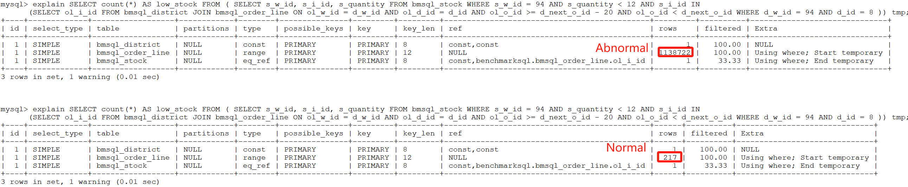

Figure 8-3. Abnormalities indicated by rows in *'explain'*.

From the figure, it can be seen that most of the execution plans are identical, except for the *'rows'* column. In the normal version, the *'rows'* column shows just over 200, whereas in the problematic version, it shows over 1,000,000. After continuously simplifying the SQL, a highly representative SQL query was finally identified. Specific details are shown in the following figure:

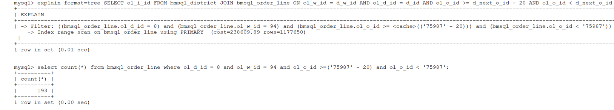

Figure 8-4. Significant discrepancies between SQL execution results and *'explain'* output.

Based on the *Filter* information obtained from '*explain*', the last query shown in the figure was constructed. The figure reveals that while the last query returned only 193 rows, '*explain*' displayed over 1.17 million rows for *'rows'*. This discrepancy highlights a complex problem, as execution plans are not always fully understood by all MySQL developers. Fortunately, identifying the commit responsible for the performance degradation provided a critical foundation for solving the problem. Although solving the problem was relatively straightforward with this information, analyzing the root cause from the SQL statement itself proved to be far more challenging.

Let's continue with an in-depth analysis of this problem. The following figure displays the '*explain*' result for a specific SQL query:

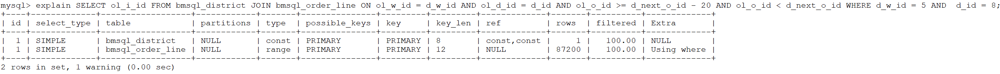

Figure 8-5. Sample SQL query representing the problem.

From the figure, it can be seen that the number of rows is still large, indicating that this SQL query is representative.

Two different debug versions of MySQL were compiled: one with anomalies and one normal. Debug versions were used to capture useful function call relationships through debug traces. When executing the problematic SQL statement on the version with anomalies, the relevant debug trace information is as follows:

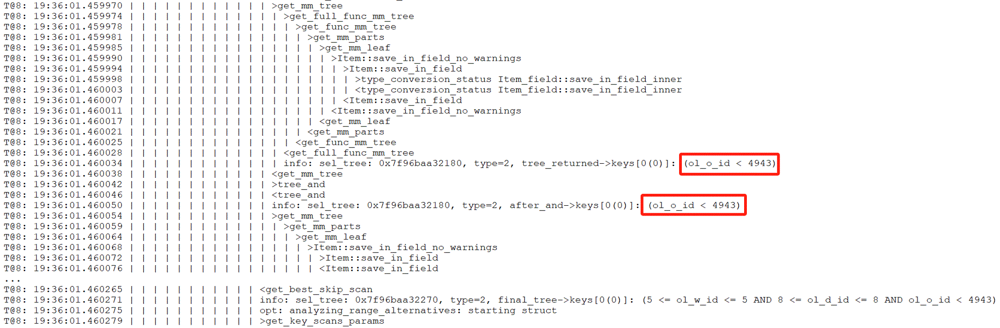

Figure 8-6. Debug trace information for the abnormal version.

Similarly, for the normal version, the relevant debug trace information is as follows:


Figure 8-7. Debug trace information for the normal version.

Comparing the two figures above, it is noticeable that the normal version includes additional content within the green box, indicating that conditions are applied in the normal version, whereas the abnormal version lacks these conditions. To understand why the abnormal version is missing these conditions, it is necessary to add additional trace information in the *get_full_func_mm_tree* function to capture specific details about the cause of this difference.

After adding extra trace information, the debug trace result for the abnormal version is as follows:


Figure 8-8. Supplementary debug trace information for the abnormal version.

The debug trace result for the normal version is as follows:

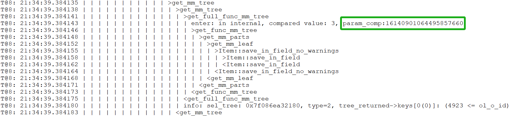

Figure 8-9. Supplementary debug trace information for the normal version.

Upon comparing the two figures above, significant differences are observed. In the normal version, the value of *param_comp* is 16140901064495857660, while in the abnormal version, it is 16140901064495857661, differing by 1. To understand this discrepancy, let's first examine how the *param_comp* value is calculated, as detailed in the following code snippet:

```c++
static SEL_TREE *get_full_func_mm_tree(THD *thd, RANGE_OPT_PARAM *param,
                                       table_map prev_tables,
                                       table_map read_tables,
                                       table_map current_table,
                                       bool remove_jump_scans, Item *predicand,
                                       Item_func *op, Item *value, bool inv) {
  SEL_TREE *tree = nullptr;
  SEL_TREE *ftree = nullptr;
  const table_map param_comp = ~(prev_tables | read_tables | current_table);
  DBUG_TRACE;
  ...
```

From the code, it's evident that *param_comp* is calculated using a bitwise OR operation on three variables, followed by a bitwise NOT operation. The difference of 1 suggests that at least one of these variables differs, helping to narrow down the problem.

The calculation involves three *table_map* variables with lengthy values, making ordinary calculators insufficient and the process too complex to detail here.

The key point is that debug tracing revealed critical differences. Coupled with the information provided by identifying the Git commit responsible for the performance discrepancy, analyzing the root cause is no longer difficult.

Here is the final fix patch, detailed as follows:


Figure 8-10. Final patch for solving performance degradation in query execution plans.

When calling the *test_quick_select* function, reintroduce the *const_table* and *read_tables* variables (related to the previously discussed variables). This ensures that filtering conditions in the execution plan are not overlooked.

After applying the above patch to MySQL 8.0.27, the performance degradation problem was solved. A test comparing TPC-C throughput at various concurrency levels, both before and after applying the patch, was conducted. Specific details are shown in the following figure:


Figure 8-11. Effects of the patch on solving performance degradation.

From the figure, it is evident that after applying the patch, throughput and peak performance have significantly improved under low concurrency conditions. However, under high concurrency conditions, throughput not only failed to increase but actually decreased, likely due to scalability bottlenecks in MVCC ReadView.

After addressing the MVCC ReadView scalability problem, reassess the impact of this patch, as detailed in the figure below:

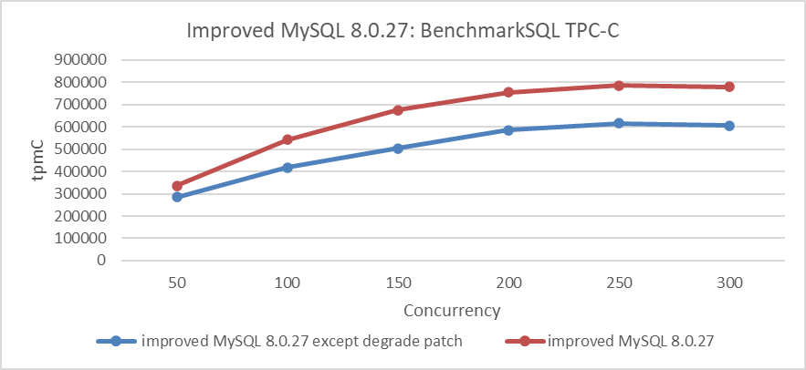

Figure 8-12. Actual effects of the patch after addressing the MVCC ReadView scalability problem.

From the figure, it is evident that this patch has significantly improved MySQL's throughput. This case demonstrates that scalability problems can disrupt certain optimizations. To scientifically assess the effectiveness of an optimization, it is essential to address most scalability problems beforehand to achieve a more accurate evaluation.

Finally, let's examine the results of the long-term stability testing for TPC-C. The following figure shows the results of an 8-hour test under 100 concurrency, with throughput captured at various hours (where 1 ≤ n ≤ 8).

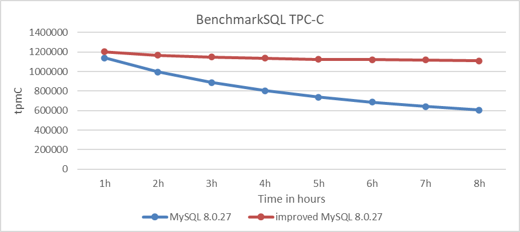

Figure 8-13. Comparison of stability tests: MySQL 8.0.27 vs. improved MySQL 8.0.27.

From the figure, it is evident that after applying the patch, the rate of throughput decline has been significantly mitigated. The MySQL 8.0.27 version experienced a dramatic throughput decline, failing to meet the stability requirements of TPC-C testing. However, after applying the patch, MySQL's performance returned to normal.

Addressing this problem directly presents considerable challenges, particularly for MySQL developers unfamiliar with query execution plans. Using logical reasoning and a systematic approach to identify and address code differences before and after the problem arose is a more elegant problem-solving method, though it is complex.

It is noteworthy that no regression testing problems were encountered after applying the patch, demonstrating high stability and providing a solid foundation for future performance improvements. Currently, MySQL 8.0.38 still hasn't solved this problem, suggesting potential shortcomings in MySQL's testing system. Given the complexity of MySQL databases, users should exercise caution when upgrading and consider using tools like TCPCopy [60] to avoid potential regression testing problems.

### 8.1.2 Improving Binlog Group Commit Scalability

The binlog group commit mechanism is quite complex, and this complexity makes it challenging to identify its inherent performance problems.

First, capture performance problems during the TPC-C test with 500 concurrency using the *perf* tool, as shown in the following figure:

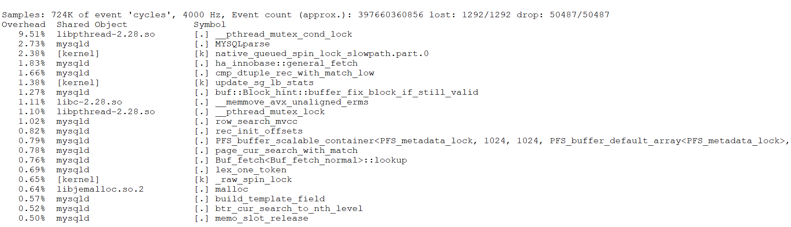

Figure 8-14. *_pthread_mutex_con_lock* bottleneck reveals performance problems.

It is evident that *_pthread_mutex_con_lock* is a significant bottleneck, accounting for approximately 9.5% of the overhead. Although *perf* does not directly pinpoint the exact problem, it indicates the presence of this bottleneck.

To address the problem, an in-depth exploration of MySQL internals was conducted to uncover the factors contributing to this performance bottleneck. A conventional binary search approach with minimal logging was used to identify functions or code segments that incur significant overhead during execution. The minimal logging approach was chosen to reduce performance interference while diagnosing the root cause of the problem. Excessive logging can disrupt performance analysis, and while some may use MySQL's internal mechanisms for troubleshooting, these often introduce substantial performance overhead themselves.

After thorough investigation, the bottleneck was identified within the following code segment.

```c++
  /*
    If the queue was not empty, we're a follower and wait for the
    leader to process the queue. If we were holding a mutex, we have
    to release it before going to sleep.
  */
  if (!leader) {
    CONDITIONAL_SYNC_POINT_FOR_TIMESTAMP("before_follower_wait");
    mysql_mutex_lock(&m_lock_done);
    ... 
    ulonglong start_wait_time = my_micro_time();
    while (thd->tx_commit_pending) {
      if (stage == COMMIT_ORDER_FLUSH_STAGE) {
        mysql_cond_wait(&m_stage_cond_commit_order, &m_lock_done);
      } else {
        mysql_cond_wait(&m_stage_cond_binlog, &m_lock_done);
      }
    }
    ulonglong end_wait_time = my_micro_time();
    ulonglong wait_time = end_wait_time - start_wait_time;
    if (wait_time > 100000) {
        fprintf(stderr, "wait too long:%llu\n", wait_time);
    }
    mysql_mutex_unlock(&m_lock_done);
    return false;
  }
```

Numerous occurrences of 'wait too long' output indicate that the bottleneck has been exposed. To investigate why 'wait too long' is being reported, the logs were added and modified accordingly. See the specific code below:

```c++
 /*
    If the queue was not empty, we're a follower and wait for the
    leader to process the queue. If we were holding a mutex, we have
    to release it before going to sleep.
  */
  if (!leader) {
    CONDITIONAL_SYNC_POINT_FOR_TIMESTAMP("before_follower_wait");
    mysql_mutex_lock(&m_lock_done);
    ...
    ulonglong start_wait_time = my_micro_time();
    while (thd->tx_commit_pending) {
      if (stage == COMMIT_ORDER_FLUSH_STAGE) {
        mysql_cond_wait(&m_stage_cond_commit_order, &m_lock_done);
      } else {
        mysql_cond_wait(&m_stage_cond_binlog, &m_lock_done);
      }
      fprintf(stderr, "wake up thread:%p,total wait time:%llu, stage:%d\n",
              thd, my_micro_time() - start_wait_time, stage);
    }
    ulonglong end_wait_time = my_micro_time();
    ulonglong wait_time = end_wait_time - start_wait_time;
    if (wait_time > 100000) {
        fprintf(stderr, "wait too long:%llu for thread:%p\n", wait_time, thd);
    }
    mysql_mutex_unlock(&m_lock_done);
    return false;
  }
```

 After another round of testing, a peculiar phenomenon was observed: when 'wait too long' messages appeared, the 'wake up thread' logs showed that many user threads were awakened multiple times.

The problem was traced to the *thd->tx_commit_pending* value not changing, causing threads to repeatedly re-enter the wait process. Further inspection reveals the conditions under which this variable becomes false, as illustrated in the following code:

```c++
void Commit_stage_manager::signal_done(THD *queue, StageID stage) {
  mysql_mutex_lock(&m_lock_done);
  for (THD *thd = queue; thd; thd = thd->next_to_commit) {
    thd->tx_commit_pending = false;
    thd->rpl_thd_ctx.binlog_group_commit_ctx().reset();
  }
  /* if thread belong to commit order wake only commit order queue threads */
  if (stage == COMMIT_ORDER_FLUSH_STAGE)
    mysql_cond_broadcast(&m_stage_cond_commit_order);
  else
    mysql_cond_broadcast(&m_stage_cond_binlog);
  mysql_mutex_unlock(&m_lock_done);
}
```

From the code, it is evident that *thd->tx_commit_pending* is set to false in the *signal_done* function. The *mysql_cond_broadcast* function then activates all waiting threads, leading to a situation similar to a thundering herd problem. When all previously waiting user threads are activated, they check if tx_commit_pending has been set to false. If it has, they proceed with processing; otherwise, they continue waiting.

Despite the complexity of the binlog group commit mechanism, a straightforward analysis identifies the root cause: threads that should not be activated are being triggered, leading to unnecessary context switches with each activation.

During one test, additional statistics were collected on the number of times user threads entered the wait state. The details are shown in the following figure:

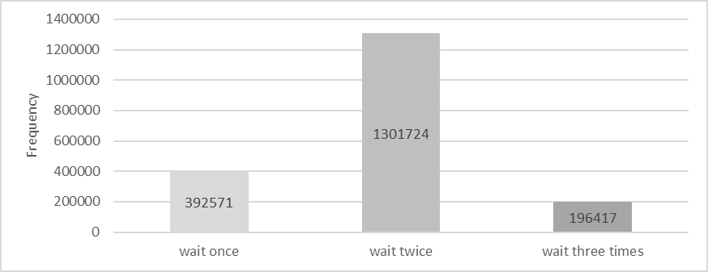

Figure 8-15. Statistics of threads activated 1, 2, 3 times.

Waiting once is normal and indicates 100% efficiency. Waiting twice suggests 50% efficiency, and waiting three times indicates 33.3% efficiency. Based on the figure, the overall activation efficiency is calculated to be 52.7%.

To solve this problem, an ideal solution would be a multicast activation mechanism with 100% efficiency, where user threads with tx_commit_pending set to false are activated together. However, implementing this requires a deep understanding of the complex logic behind binlog group commit.

In this case, a point-to-point activation mechanism is used, achieving 100% efficiency but introducing significant system call overhead. The following figure illustrates the relationship between TPC-C throughput and concurrency before and after optimization.

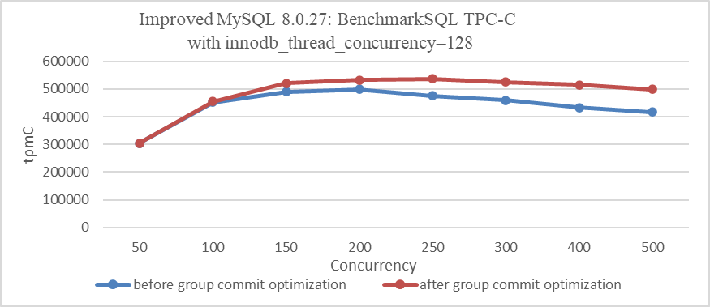

Figure 8-16. Impact of group commit optimization with innodb_thread_concurrency=128.

From the figure, it is evident that with innodb_thread_concurrency=128, the optimization of binlog group commit significantly improves throughput under high concurrency.

It's important to note that this optimization's effectiveness can vary depending on factors such as configuration settings and specific scenarios. However, overall, it notably improves throughput, especially in high concurrency conditions.

Below is the comparison of TPC-C throughput and concurrency before and after optimization using standard configurations:


Figure 8-17. Impact of group commit optimization using standard configurations.

From the figure, it is clear that this optimization is less pronounced compared to the previous one, but it still shows overall improvement. Extensive testing indicates that the worse the scalability of MySQL, the more significant the effectiveness of binlog group commit optimization.

At the same time, the previously identified bottleneck of *_pthread_mutex_con_lock* has been significantly alleviated after optimization, as shown in the following figure:

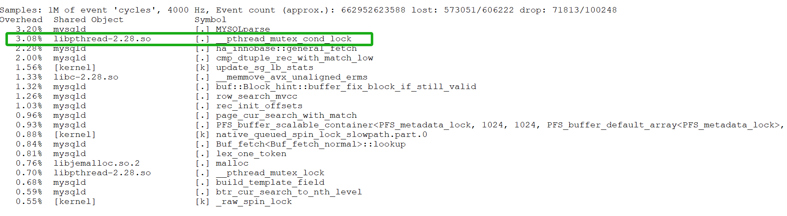

Figure 8-18. Mitigation of *_pthread_mutex_con_lock* bottleneck.

In summary, this optimization helps address scalability problems associated with binlog group commit.

## 8.2 Enhancing the InnoDB Storage Engine

### 8.2.1 MVCC ReadView: Identified Problems

A key component of any MVCC scheme is the mechanism for quickly determining which tuples are visible to which transactions. A transaction's snapshot is created by building a ReadView (RV) vector that holds the TXIDs of all concurrent transactions smaller than the transaction's TXID. The cost of acquiring a snapshot increases linearly with the number of concurrent transactions, even if the transaction only reads tuples written by a single committed transaction, highlighting a known scalability limitation [7].

After understanding the scalability problems with the MVCC ReadView mechanism, let's examine how MySQL implements MVCC ReadView. Under the Read Committed isolation level, during the process of reading data, the InnoDB storage engine triggers the acquisition of the ReadView. A screenshot of part of the ReadView data structure is shown below:

```c++
private:
  // Disable copying
  ReadView(const ReadView &);
  ReadView &operator=(const ReadView &);
private:
  /** The read should not see any transaction with trx id >= this
  value. In other words, this is the "high water mark". */
  trx_id_t m_low_limit_id;
  /** The read should see all trx ids which are strictly
  smaller (<) than this value.  In other words, this is the
  low water mark". */
  trx_id_t m_up_limit_id;
  /** trx id of creating transaction, set to TRX_ID_MAX for free
  views. */
  trx_id_t m_creator_trx_id;
  /** Set of RW transactions that was active when this snapshot
  was taken */
  ids_t m_ids;
  /** The view does not need to see the undo logs for transactions
  whose transaction number is strictly smaller (<) than this value:
  they can be removed in purge if not needed by other views */
  trx_id_t m_low_limit_no;
  ...
```

Here, *m_ids* is a data structure of type *ids_t*, which closely resembles *std::vector*. See the specific explanation below:

```c++
  /** This is similar to a std::vector but it is not a drop
  in replacement. It is specific to ReadView. */
  class ids_t {
    typedef trx_ids_t::value_type;
    /**
    Constructor */
    ids_t() : m_ptr(), m_size(), m_reserved() {}
    /**
    Destructor */
    ~ids_t() { ut::delete_arr(m_ptr); }
    /** Try and increase the size of the array. Old elements are copied across.
    It is a no-op if n is < current size.
    @param n            Make space for n elements */
    void reserve(ulint n);
    ...
```

Algorithm for MVCC ReadView visibility determination, specifically refer to the *changes_visible* function below:

```c++
  /** Check whether the changes by id are visible.
  @param[in]    id      transaction id to check against the view
  @param[in]    name    table name
  @return whether the view sees the modifications of id. */
  [[nodiscard]] bool changes_visible(trx_id_t id,
                                     const table_name_t &name) const {
    ut_ad(id > 0);
    if (id < m_up_limit_id || id == m_creator_trx_id) {
      return (true);
    }
    check_trx_id_sanity(id, name);
    if (id >= m_low_limit_id) {
      return (false);
    } else if (m_ids.empty()) {
      return (true);
    }
    const ids_t::value_type *p = m_ids.data();
    return (!std::binary_search(p, p + m_ids.size(), id));
 }
```

From the code, it can be seen that the visibility algorithm works efficiently when concurrency is low. However, as concurrency increases, the efficiency of using binary search to determine visibility significantly decreases, particularly in NUMA environments.

### 8.2.2 Solutions for Enhancing MVCC ReadView Scalability

There are two fundamental approaches to improving scalability here [58]:

*First, finding an algorithm that improves the complexity, so that each additional connection does not increase the snapshot computation costs linearly.*

*Second, perform less work for each connection, hopefully reducing the total time taken so much that even at high connection counts the total time is still small enough to not matter much (i.e. reduce the constant factor).*

For the first solution, adopting a multi-version visibility algorithm based on Commit Sequence Numbers (CSN) offers benefits [7]: *the cost of taking snapshots can be reduced by converting snapshots into CSNs instead of maintaining a transaction ID list.* Specifically, under the Read Committed isolation level, there's no need to replicate an active transaction list for each read operation, thereby improving scalability.

Considering the complexity of implementation, this book opts for the second solution, which directly modifies the MVCC ReadView data structure to mitigate MVCC ReadView scalability problems.

### 8.2.3 Improvements to the MVCC ReadView Data Structure

In the ReadView structure, the original approach used a vector to store the list of active transactions. Now, it has been changed to the following data structure:

```c++
class ReadView {
 ...
 private:
  // Disable copying
  ReadView &operator=(const ReadView &);
 public:
  bool skip_view_list{false};
 private:
  unsigned char top_active[MAX_TOP_ACTIVE_BYTES];
  trx_id_t m_short_min_id;
  trx_id_t m_short_max_id;
  bool m_has_short_actives;
  /** The read should not see any transaction with trx id >= this
  value. In other words, this is the "high water mark". */
  trx_id_t m_low_limit_id;
  /** The read should see all trx ids which are strictly
  smaller (<) than this value.  In other words, this is the low water mark". */
  trx_id_t m_up_limit_id;
  /** trx id of creating transaction, set to TRX_ID_MAX for free views. */
  trx_id_t m_creator_trx_id;
  /** Set of RW transactions that was active when this snapshot
  was taken */
  ids_t m_long_ids;
  ...
```

Furthermore, corresponding code modifications were made in the related interface functions, as changes to the data structure necessitate adjustments to the internal code within these functions.

This new MVCC ReadView data structure can be seen as a hybrid data structure, as shown in the following figure.

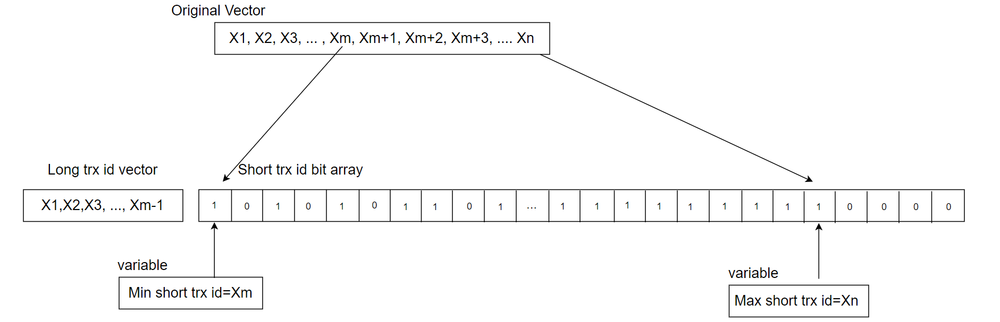

Figure 8-19. A new hybrid data structure suitable for active transaction list in MVCC ReadView.

For a more detailed explanation, please refer to Chapter 4.2.8 on hybrid data structures.

Typically, online transactions are short rather than long, and transaction IDs increase continuously. To leverage these characteristics, a hybrid data structure is used: a static array for consecutive short transaction IDs and a vector for long transactions. With a 2048-byte array, up to 16,384 consecutive active transaction IDs can be stored, each bit representing a transaction ID.

The minimum short transaction ID is used to differentiate between short and long transactions. IDs smaller than this minimum go into the long transaction vector, while IDs equal to or greater than it are placed in the short transaction array. For an ID in changes_visible, if it is below the minimum short transaction ID, a direct query is made to the vector, which is efficient due to the generally small number of long transactions. If the ID is equal to or above the minimum short transaction ID, a bitwise query is performed, with a time complexity of O(1), compared to the previous O(log n) complexity. This improvement enhances efficiency and reduces cache migration between NUMA nodes, as O(1) queries typically complete within a single CPU time slice.

In addition to the previously mentioned transformation, similar modifications were applied to the global transaction active list. The original data structure used for this list is shown in the following code snippet:

```c++
  /** Array of Read write transaction IDs for MVCC snapshot. A ReadView would
  take a snapshot of these transactions whose changes are not visible to it.
  We should remove transactions from the list before committing in memory and
  releasing locks to ensure right order of removal and consistent snapshot. */
  trx_ids_t rw_trx_ids;
```

Now it has been changed to the following data structure:

```c++
  /** Array of Read write transaction IDs for MVCC snapshot. A ReadView would
  take a snapshot of these transactions whose changes are not visible to it.
  We should remove transactions from the list before committing in memory and
  releasing locks to ensure right order of removal and consistent snapshot. */
  trx_ids_t long_rw_trx_ids;
  unsigned char short_rw_trx_ids_bitmap[MAX_SHORT_ACTIVE_BYTES];
  int short_rw_trx_valid_number;
  trx_id_t min_short_valid_id;
  trx_id_t max_short_valid_id
```

In the *short_rw_trx_ids_bitmap* structure, *MAX_SHORT_ACTIVE_BYTES* is set to 65536, theoretically accommodating up to 524,288 consecutive short transaction IDs. If the limit is exceeded, the oldest short transaction IDs are converted into long transactions and stored in *long_rw_trx_ids*. Global long and short transactions are distinguished by *min_short_valid_id*: IDs smaller than this value are treated as global long transactions, while IDs equal to or greater are considered global short transactions.

During the copying process from the global active transaction list, the *short_rw_trx_ids_bitmap* structure, which uses only one bit per transaction ID, allows for much higher copying efficiency compared to the native MySQL solution. For example, with 1000 active transactions, the native MySQL version would require copying at least 8000 bytes, whereas the optimized solution may only need a few hundred bytes. This results in a significant improvement in copying efficiency.

After implementing these modifications, performance comparison tests were conducted to evaluate the effectiveness of the MVCC ReadView optimization. The figure below shows a comparison of TPC-C throughput with varying concurrency levels, before and after modifying the MVCC ReadView data structure.


Figure 8-20. Performance comparison before and after adopting the new hybrid data structure in NUMA.

From the figure, it is evident that this transformation primarily optimized scalability and improved MySQL's peak throughput in NUMA environments. Further performance comparisons before and after optimization can be analyzed using tools like *perf*. Below is a screenshot from *perf* at 300 concurrency, prior to optimization:

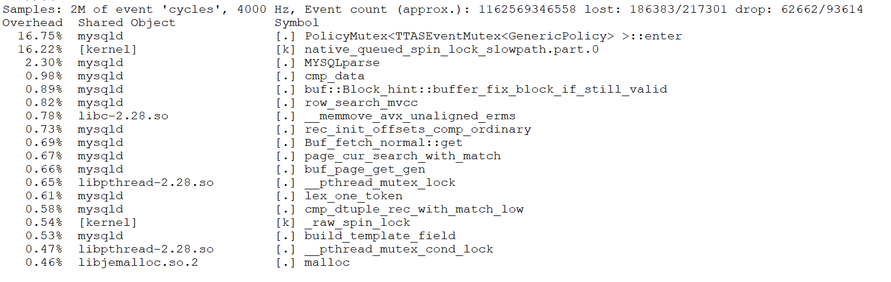

Figure 8-21. Latch-related bottleneck observed in *perf* screenshot.

From the figure, it can be seen that the first two bottlenecks were significant, accounting for approximately 33% of the overhead. After optimization, the *perf* screenshot at 300 concurrency is as follows:

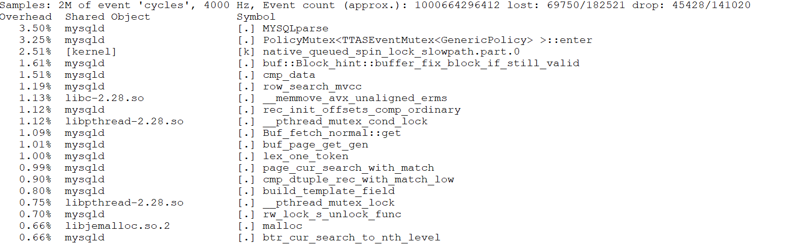

Figure 8-22. Significant alleviation of latch-related bottleneck.

After optimization, as shown in the screenshot above, the proportions of the previous top two bottlenecks have been significantly reduced.

Why does changing the MVCC ReadView data structure significantly enhance scalability? This is because accessing these structures involves acquiring a global latch. Optimizing the data structure accelerates access to critical resources, reducing concurrency conflicts and minimizing cache migration across NUMA nodes.

The native MVCC ReadView uses a vector to store the list of active transactions. In high-concurrency scenarios, this list can become large, leading to a larger working set. In NUMA environments, both querying and replication can become slower, potentially causing a single CPU time slice to miss its deadline and resulting in significant context-switching costs. The theoretical basis for this aspect is as follows [21]:

*Context-switches that occur in the middle of a logical operation evict a possibly larger working set from the cache. When the suspended thread resumes execution, it wastes time restoring the evicted working set.*

Throughput improvement under the ARM architecture is evaluated next. Details are shown in the following figure:

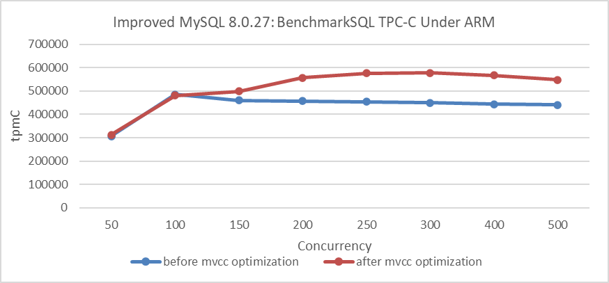

Figure 8-23. Throughput improvement under the ARM architecture.

From the figure, it is evident that there is also a significant improvement under the ARM architecture. Extensive test data confirms that the MVCC ReadView optimization yields clear benefits in NUMA environments, regardless of whether the architecture is ARM or x86.

How much improvement can this optimization achieve in a SMP environment?

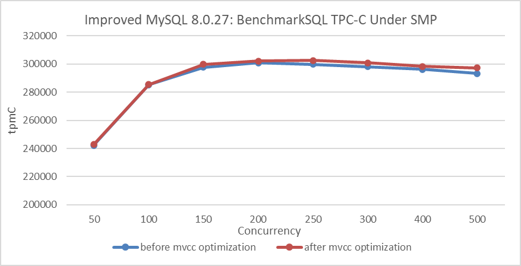

Figure 8-24. Performance comparison before and after adopting the new hybrid data structure in SMP.

From the figure, it can be observed that after binding to NUMA node 0, the improvement from the MVCC ReadView optimization is not significant. This suggests that the optimization primarily enhances scalability in NUMA architectures.

In practical MySQL usage, preventing excessive user threads from entering the InnoDB storage engine can significantly reduce the size of the global active transaction list. This transaction throttling mechanism complements the MVCC ReadView optimization effectively, improving overall performance. Combined with double latch avoidance, discussed in the next section, the TPC-C test results in the following figure clearly demonstrate these improvements.

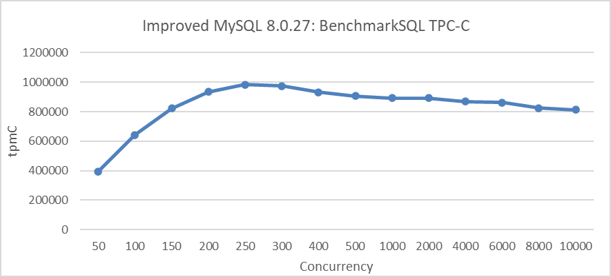

Figure 8-25. Maximum TPC-C throughput in BenchmarkSQL with transaction throttling mechanisms.

### 8.2.4 Avoiding Double Latch Problems

During testing after the MVCC ReadView optimization, a noticeable decline in throughput was observed under extremely high concurrency conditions. The specific details are shown in the following figure:

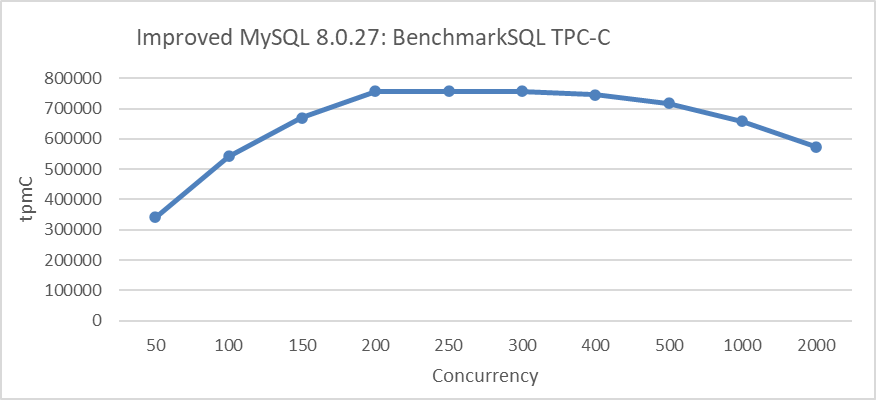

Figure 8-26. Performance degradation at concurrency Levels exceeding 500.

From the figure, it can be seen that throughput significantly decreases once concurrency exceeds 500. The problem was traced to frequent acquisitions of the *trx-sys* latch, as shown in the code snippet below:

```c++
    } else if (trx->isolation_level <= TRX_ISO_READ_COMMITTED &&
               MVCC::is_view_active(trx->read_view)) {
      mutex_enter(&trx_sys->mutex);
      trx_sys->mvcc->view_close(trx->read_view, true);
      mutex_exit(&trx_sys->mutex);
    }
```

The other code snippet is shown below:

```c++
  if (lock_type != TL_IGNORE && trx->n_mysql_tables_in_use == 0) {
    trx->isolation_level =
        innobase_trx_map_isolation_level(thd_get_trx_isolation(thd));
    if (trx->isolation_level <= TRX_ISO_READ_COMMITTED &&
        MVCC::is_view_active(trx->read_view)) {
      /* At low transaction isolation levels we let
      each consistent read set its own snapshot */
      mutex_enter(&trx_sys->mutex);
      trx_sys->mvcc->view_close(trx->read_view, true);
      mutex_exit(&trx_sys->mutex);
    }
  }
```

InnoDB introduces a global trx-sys latch during the view close process, impacting scalability under high concurrency. To address this, an attempt was made to remove the global latch. One of the modifications is shown in the code snippet below:

```c++
   } else if (trx->isolation_level <= TRX_ISO_READ_COMMITTED &&
               MVCC::is_view_active(trx->read_view)) {
      trx_sys->mvcc->view_close(trx->read_view, false);
}
```

The other modification is shown in the code snippet below:

```c++
  if (lock_type != TL_IGNORE && trx->n_mysql_tables_in_use == 0) {
    trx->isolation_level =
        innobase_trx_map_isolation_level(thd_get_trx_isolation(thd));
    if (trx->isolation_level <= TRX_ISO_READ_COMMITTED &&
        MVCC::is_view_active(trx->read_view)) {
      /* At low transaction isolation levels we let
      each consistent read set its own snapshot */
      trx_sys->mvcc->view_close(trx->read_view, false);
    }
  }
```

Using the MVCC ReadView optimized version, compare TPC-C throughput before and after the modifications. Details are shown in the following figure:

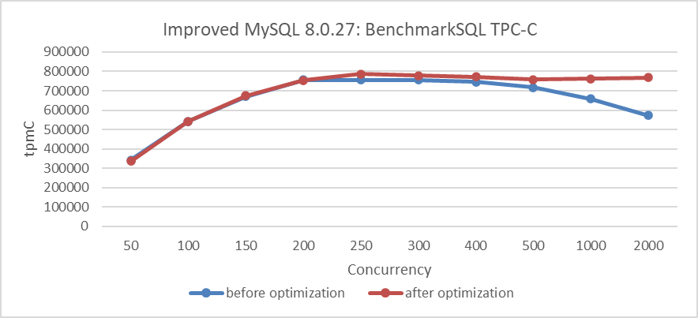

Figure 8-27. Performance improvement after eliminating the double latch bottleneck.

From the figure, it is evident that the modifications significantly improved scalability under high-concurrency conditions. To understand the reasons for this improvement, let's use the *perf* tool for further investigation. Below is the *perf* screenshot at 2000 concurrency before the modifications:

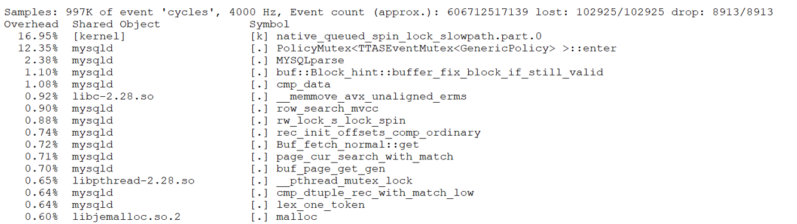

Figure 8-28. Latch-related bottleneck observed in *perf* screenshot.

From the figure, it is evident that the latch-related bottlenecks are quite pronounced. After the code modifications, here is the *perf* screenshot at 3000 concurrency:

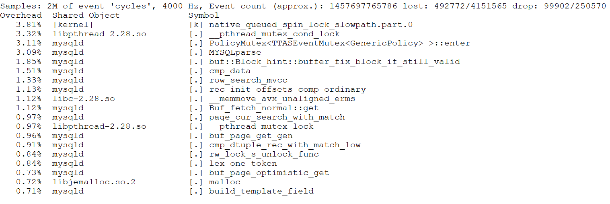

Figure 8-29. Significant alleviation of latch-related bottleneck.

Even with higher concurrency, such as 3000, the bottlenecks are not pronounced. This suggests that the optimizations have effectively alleviated the latch-related performance problems, improving scalability under extreme conditions.

Excluding the global latch before and after the *view_close* function call improves scalability, while including it severely degrades scalability under high concurrency. Although the *view_close* function operates efficiently within its critical section, frequent acquisition of the globally used trx-sys latch—employed throughout the trx-sys subsystem—leads to significant contention and head-of-line blocking, referred to as the 'double latch' problem. Notably, removing the latch from the final stage or using a new latch can significantly mitigate this problem.

### 8.2.5 Explaining the Super-Linear Performance Phenomenon

Section 2.1 describes super-linear scaling in throughput observed during SysBench read-write tests in an x86 NUMA environment. Following improvements to the InnoDB storage engine, the current investigation examines whether this super-linear scaling effect remains. Tests were conducted in the same environment using the improved version of MySQL. The results of individual SysBench tests for MySQL instance 1 and MySQL instance 2 are shown in the following figure:

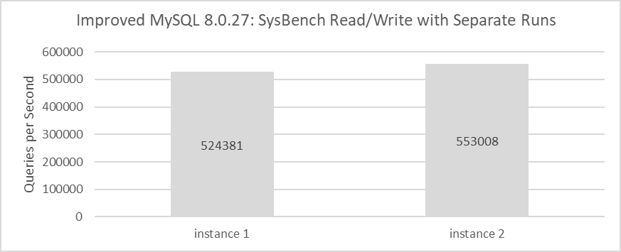

Figure 8-30. Throughput of MySQL running separately after MVCC optimization.

The throughput for each instance has significantly improved, with MySQL instance 1 achieving 524,381 QPS and MySQL instance 2 reaching 553,008 QPS. Combined, they deliver 1,077,389 QPS, substantially surpassing the previous 328,168 QPS.

SysBench is used to simultaneously evaluate the read-write performance of these two instances, as illustrated in the figure below.

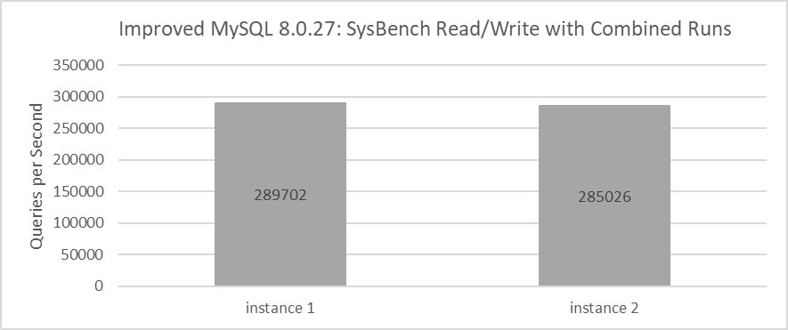

Figure 8-31. Throughput of MySQL running together after MVCC optimization.

From the figure, one instance achieves a throughput of 289,702 QPS while the other reaches 285,026 QPS. The combined throughput of both MySQL instances totals 574,728 QPS, closely aligning with the 546,429 QPS observed with the MySQL release version. This illustrates the Linux operating system's role in effectively scheduling multiple processes in NUMA environments.

From the data, it's evident that the total throughput of two MySQL instances running simultaneously is significantly lower than the throughput of each instance running individually. For detailed statistical comparisons, refer to the figure below:

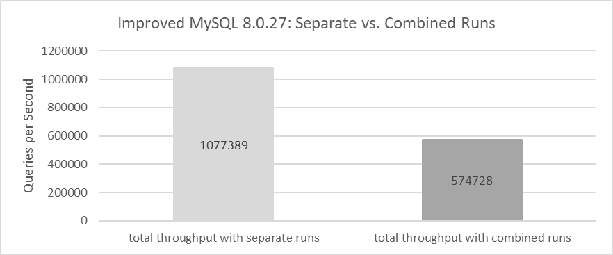

Figure 8-32. Total throughput of running separately vs. running together after MVCC optimization.

After enhancements to the InnoDB storage engine, the super-linear scaling problem has been solved, revealing that the underlying cause in the MySQL release version was a poorly designed MVCC mechanism within InnoDB. This design flaw amplified problems in NUMA environments, resulting in the observed super-linear scaling effect.

## 8.3 Transaction Throttling Mechanism

According to the paper "Staring into the Abyss: An Evaluation of Concurrency Control with One Thousand Cores" [22], centralized databases, including MySQL, struggle to fully utilize hundreds of CPU cores.

To address scalability problems, traditional approaches use thread pools to restrict the number of CPU cores a database utilizes. This book introduces a transaction throttling mechanism that limits the number of threads accessing the transaction system, offering an alternative method to mitigate scalability challenges.

### 8.3.1 Percona Thread Pool

In general, a thread pool in traditional MySQL serves two main purposes:

1.  **Mitigating Short Connection Storms**: By managing and reusing threads, the thread pool helps prevent system overload during sudden spikes in short-lived connections.
2.  **Enhancing Scalability**: Thread pools improve scalability, particularly in high-contention scenarios, by enabling MySQL to more effectively utilize available CPU cores.

Using Percona's thread pool as a case study, let's examine the cost-effectiveness of thread pools in improving MySQL scalability. The following figure compares throughput and concurrency before and after implementing a thread pool with the improved version of MySQL.

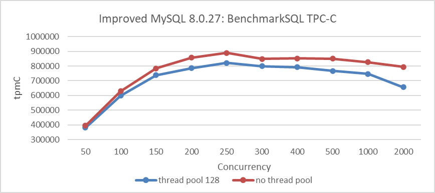

Figure 8-33. Enabling the Percona thread pool led to a noticeable decrease in throughput.

From the figure, it is evident that throughput decreases after adopting the thread pool. This decline is attributed to the high inherent cost of the Percona thread pool. Moreover, with the improved version of MySQL already achieving significant scalability improvements, the additional benefits of the Percona thread pool in improving scalability for TPC-C applications are limited.

For MySQL versions with poor scalability, the thread pool remains valuable in addressing scalability problems. As demonstrated in Chapter 1, the use of the thread pool significantly alleviated scalability problems in MySQL 5.7.

Based on extensive testing, after solving most of MySQL's scalability problems, it was observed that while the Percona thread pool can still be effective in managing short-lived connections and high contention scenarios, its overall effectiveness diminishes and it may even hinder performance in other contexts.

### 8.3.2 Transaction Throttling Mechanism

Centralized databases struggle to fully utilize hundreds of CPU cores due to limitations in their transaction systems. To address this, transaction throttling mechanisms are becoming increasingly important.

MySQL has introduced a "Max Transaction Limit" feature in its thread pool to mitigate performance degradation [31]. This feature limits the number of concurrent transactions, improving throughput by reducing data locks and deadlocks on heavily loaded systems. This approach can inspire similar mechanisms that increase throughput in high-concurrency scenarios without relying solely on traditional thread pools.

For MySQL, the specific process figure for transaction throttling is as follows:

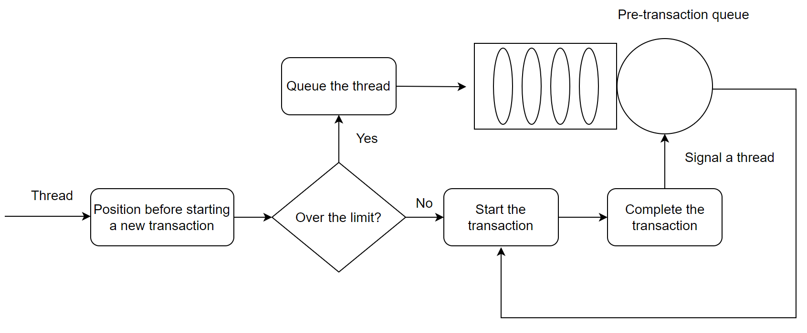

Figure 8-34. New transaction throttling mechanism In MySQL.

Before starting a new transaction, check if the number of concurrent transactions exceeds the limit. If it does, the transaction enters a waiting state. Otherwise, it proceeds into the transaction system. After a transaction completes execution, a user thread from the waiting list is activated to continue executing another transaction.

After implementing this transaction throttling mechanism, MySQL's scalability is validated. The following figure illustrates the relationship between TPC-C throughput and concurrency when using the throttling mechanism compared to using the Percona thread pool.

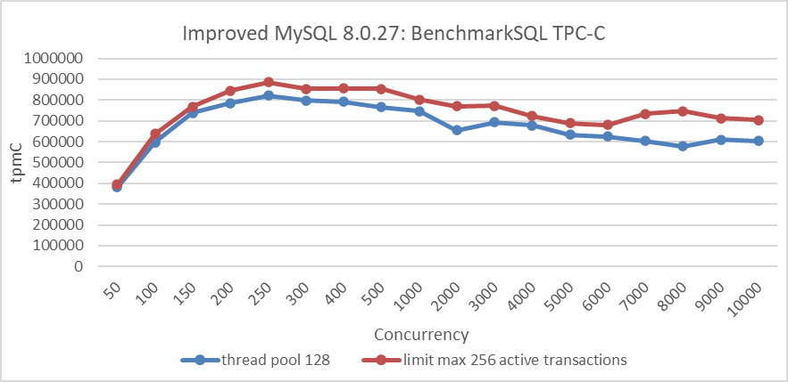

Figure 8-35. Impact of the transaction throttling mechanism.

From the figure, it can be seen that the throttling approach is superior to the Percona thread pool approach, and this superiority is comprehensive.

The following figure depicts the TPC-C scalability stress test conducted after implementing transaction throttling. The test was performed in a scenario with NUMA BIOS disabled, limiting entry of up to 512 user threads into the transaction system.


Figure 8-36. Maximum TPC-C throughput in BenchmarkSQL with transaction throttling mechanisms.

From the figure, it can be seen that throughput is more stable. This stability is primarily due to disabling NUMA in the BIOS, which improves memory access efficiency and enhances overall system stability.

However, transaction throttling is not a panacea and has its limitations:

-   When the maximum number of transactions are executing concurrently, new transactions must wait until existing transactions are completed. If all concurrent transactions consist of long-running queries, it may appear as if the MySQL system is stalled [31].

It's worth noting that the specifics of how transaction throttling is implemented, and its flexibility, are areas where AI can demonstrate its usefulness.

[Next](Chapter9.md)
