# Chapter 9: Major Enhancements in Group Replication

## 9.1 Major Design Flaws in Group Replication

Group Replication was initially designed before SSDs became widely adopted. Introducing I/O operations at the Paxos layer could significantly impact performance, so the initial design did not consider persisting Paxos logs to disk.

Group Replication adopted a conflict detection method based on certification databases to achieve concurrent control in distributed environments, aiming to support write operations on any MySQL node. This approach overlooked the inherent characteristics of single-node writes in MySQL, resulting in Group Replication's single-primary throughput being inferior to semisynchronous replication.

In designing Group Replication for multi-primary scenarios, strict adherence to the principles of state machine replication, where the operation sequence should be consistent across all nodes, was not strictly followed. This led to eventual inconsistency problems in some scenarios with Group Replication's multi-primary setup.

When a MySQL secondary replay gets stuck or its I/O storage fills up, eventually all Group Replication nodes will be affected, with the possibility of most nodes experiencing Out Of Memory (OOM) problems. While Group Replication aims to solve high availability problems, it should also ensure its own high availability, preventing the entire cluster from becoming unavailable due to problems with a single MySQL secondary.

These design flaws are typically only effectively discovered through exposure to problems. Group Replication's logic is highly complex, making it challenging to directly identify problems from the code alone.

### 9.1.1 Lack of Durability: Paxos Not Committed to Disk

Below is Meta company engineers' view on Group Replication [42]:

*Another significant and deliberate choice was to not use Group Replication offered by MySQL 5.7 onwards. While there are significant advancements offered by the protocol (such as the multi-primary mode), using Group Replication in our deployment presented significant challenges. It is based on a variant of Paxos which does not use a persistent log. Entries are written to the log only after they are considered committed via in-memory consensus rounds. The leader election algorithm is local and deterministic. It also doesn't consider lag when choosing a new leader and brief network blips trigger a computationally expensive recovery algorithm. This option could have worked but not without excessive engineering effort to fix the drawbacks.*

The main problem with Group Replication, as outlined in the above content, is the lack of persistence in Paxos messages. The initial design background includes:

1. Suboptimal SSD hardware performance.

2. Paxos log persistence not meeting the requirements for Group Replication with multiple primaries.

   Without persistent storage in certification databases, Group Replication cannot use Paxos message persistence for crash recovery. After MySQL restarts, there is no corresponding certification database, making continued processing of persisted Paxos messages prone to inconsistent states.

Based on Group Replication single-primary mode using SSDs, SysBench write-only tests were used to examine the impact of adding Paxos persistence on throughput. Please refer to the specific figure below:

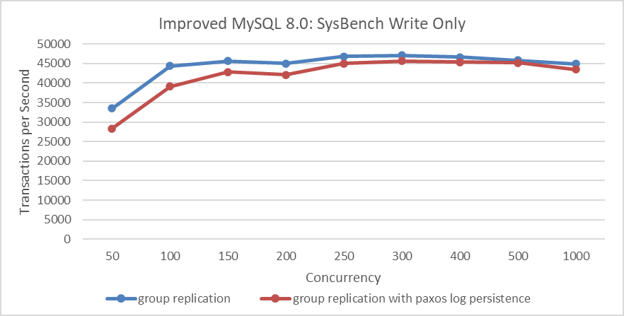

Figure 9-1. Performance overhead of Paxos log persistence in SysBench write-only tests.

From the figure, it can be seen that after adding Paxos persistence, there is a slight decrease in performance under low concurrency, which is an expected result. However, under high concurrency, the difference is not significant. This is because, under high concurrency, Paxos uses a batching mechanism that allows multiple transaction records to be logged into the Paxos instance together, thereby reducing I/O pressure.

Next, let's examine the comparative response times.

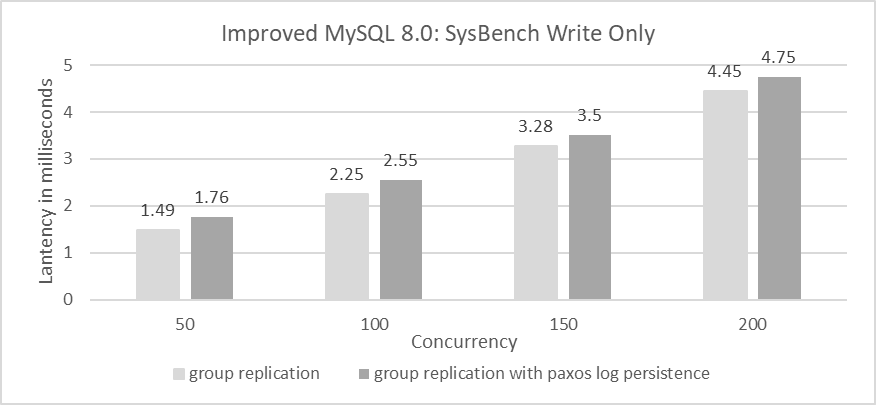

Figure 9-2. After adding Paxos log persistence, the average response time in SysBench write-only tests increased.

The figure shows response times for 50 to 200 concurrent scenarios. The increase in average response time with Paxos log persistence is acceptable. SysBench write-only tests stress Group Replication significantly, while TPC-C tests, due to their read operations, reduce the write pressure on Group Replication. For comparisons based on Group Replication in single-primary mode, using SSDs, and BenchmarkSQL for TPC-C throughput at various concurrency levels, please refer to the figure below.

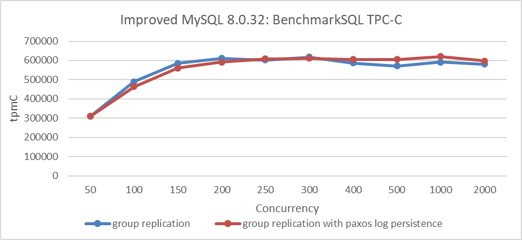

Figure 9-3. Performance overhead of Paxos log persistence in BenchmarkSQL tests.

The figure shows that, at low concurrency levels, the version with Paxos log persistence has slightly lower throughput, though the impact is much smaller compared to SysBench write-only tests. Based on the results of the various tests, it can be concluded that, under current SSD hardware conditions, employing Paxos log persistence is a viable solution.

### 9.1.2 Applying the Barrel Principle to Certification Databases

Conflict detection using the certification database is part of Optimistic Concurrency Control (OCC). OCC allows multiple transactions to read and update data concurrently without blocking, by maintaining transaction histories and checking for conflicts before committing. If conflicts are detected, one of the transactions is rolled back. While OCC avoids lock waits, it can incur significant penalties during actual conflicts, similar to two-phase locking (2PL), but with rollbacks instead of lock waits. OCC performs well with infrequent conflicts but suffers from excessive rollbacks and retries when conflicts are frequent, making it less effective in such scenarios [59].

In multi-primary Group Replication, each MySQL node can write independently, necessitating global concurrency control. MySQL uses the certification database for this, implementing OCC to decide transaction commits or rollbacks. However, in cases of severe write conflicts, OCC may result in numerous rollbacks, indicating its ineffectiveness in high-conflict scenarios.

Let's continue by examining the data structure used by the MySQL certification database:

```c++
typedef std::unordered_map<
      std::string, Gtid_set_ref *, std::hash<std::string>,
      std::equal_to<std::string>,
      Malloc_allocator<std::pair<const std::string, Gtid_set_ref *>>>
      Certification_info;
  ...
  /**
    Certification database.
  */
  Certification_info certification_info;
```

The certification database uses an *unordered_map* from the C++ Standard Template Library (STD), which is a hash table. This database stores information about transaction write operations, where each key is a base64-encoded string representing a row, and each value contains the GTID and related information used for replay calculations. The following code demonstrates how to insert a row into the certification database.

```c++
bool Certifier::add_item(const char *item, Gtid_set_ref *snapshot_version,
                         int64 *item_previous_sequence_number) {
  DBUG_TRACE;
  mysql_mutex_assert_owner(&LOCK_certification_info);
  bool error = true;
  std::string key(item);
  Certification_info::iterator it = certification_info.find(key);
  snapshot_version->link();
  if (it == certification_info.end()) {
    std::pair<Certification_info::iterator, bool> ret =
        certification_info.insert(
            std::pair<std::string, Gtid_set_ref *>(key, snapshot_version));
    error = !ret.second;
  } else {
    *item_previous_sequence_number =
        it->second->get_parallel_applier_sequence_number();
    if (it->second->unlink() == 0) delete it->second;
    it->second = snapshot_version;
    error = false;
  }
  ...
  return error;
}
```

As updates become more frequent, the certification database grows larger. To promptly clean up outdated information, Group Replication uses a barrel principle. For instance, if the slowest node's executed GTID is A, then information in the certification database with GTIDs less than or equal to A can be cleaned up.

Next, review the *perf* screenshots taken during Group Replication operation below.

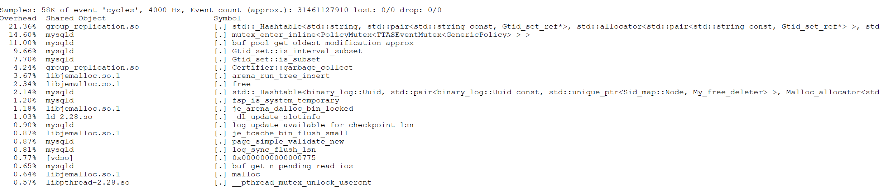

Figure 9-4. A bottleneck revealed in hash table operations.

The figure reveals a bottleneck in operating the hash table. Cleaning the certification database is akin to garbage collection; transactions must wait while this cleaning occurs, involving extensive memory deallocation. Queueing theory indicates that this latency significantly impacts transaction processing speed. The figure below illustrates the relationship between throughput and concurrency for Group Replication and semisynchronous replication.

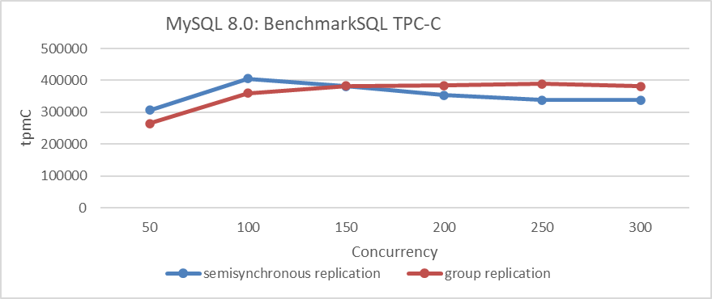

Figure 9-5. Performance comparison between semisynchronous replication and Group Replication.

The figure shows that the peak throughput of Group Replication is lower than that of semisynchronous replication.

What kind of Group Replication do users need? Given that Group Replication is designed for high availability services, its high availability features should not significantly impact performance. Users expect Group Replication to provide true high availability while also offering better performance compared to semisynchronous replication.

### 9.1.3 Lack of Strict Adherence to State Machine Replication Mechanisms

A well-known method for implementing fault-tolerant distributed systems with strong consistency is state-machine replication. This technique orders and propagates operations to all servers, which then execute them sequentially. All copies of the state machine start from the same initial state, transition through the same succession of states, and produce the same sequence of outputs. State-machine replication ensures strong consistency among replicas, enabling a distributed service to appear as a coherent, centralized service while retaining distributed advantages.

The key to state-machine replication is that all copies start from the same initial state, transition through the same states, and produce the same outputs [41]. Any deviation from this rule is non-compliant and difficult to detect, often only revealing problems in corner cases. All nodes must execute in the same sequence, with identical transactions and underlying data.

In the Group Replication multi-primary architecture, a rule violation occurs: *CT_CERTIFICATION_MESSAGE* messages are not placed into the applier queue, leading to a non-uniform processing order. Below is the function *handle_certifier_data* that prematurely processes *CT_CERTIFICATION_MESSAGE* messages.

```c++
void Plugin_gcs_events_handler::handle_certifier_message(
    const Gcs_message &message) const {
  if (this->applier_module == nullptr) {
    LogPluginErr(ERROR_LEVEL,
                 ER_GRP_RPL_MISSING_GRP_RPL_APPLIER); /* purecov: inspected */
    return;                                           /* purecov: inspected */
  }
  Certifier_interface *certifier =
      this->applier_module->get_certification_handler()->get_certifier();
  const unsigned char *payload_data = nullptr;
  size_t payload_size = 0;
  Plugin_gcs_message::get_first_payload_item_raw_data(
      message.get_message_data().get_payload(), &payload_data, &payload_size);
  if (certifier->handle_certifier_data(payload_data,
                                       static_cast<ulong>(payload_size),
                                       message.get_origin())) {
    LogPluginErr(
        ERROR_LEVEL,
        ER_GRP_RPL_CERTIFIER_MSSG_PROCESS_ERROR); /* purecov: inspected */
  }
}
```

Handling *CT_CERTIFICATION_MESSAGE* messages prematurely can lead to inconsistencies in the certification database data that different nodes' OCC rely on, potentially resulting in eventual data inconsistencies. While this problem may not be easy to detect, it is relatively straightforward to reproduce under specific conditions.

The specific details of reproduction are as follows: in a Group Replication multi-primary scenario, distribute write pressure evenly across all MySQL nodes using a load balancer (such as LVS). Given sufficient write conflicts, it is possible to reproduce inconsistencies in the final state of state machine replication.

Based on extensive testing, placing certification messages into the applier queue for unified processing can eliminate the aforementioned data inconsistency problem.

### 9.1.4 Group Replication Lacks Built-in High Availability

Group Replication can face collective failure scenarios in the following situations:

1.  If the I/O space of a MySQL secondary becomes full, causing replay to block, it can trigger a cascade effect across the cluster.
2.  If replay stops on a MySQL secondary for any reason, effectively reducing its throughput to zero, the overall throughput of the cluster eventually drops to zero, according to the barrel principle.

Group Replication is designed for high availability, but these problems can make the entire cluster system unavailable. Therefore, addressing the high availability problems inherent to Group Replication is essential to provide users with better high availability.

## 9.2 The Problems with Paxos Variant Algorithms

### 9.2.1 Why Hasn't the Raft Protocol Been Adopted?

Raft is a consensus algorithm equivalent to Multi-Paxos in fault tolerance and performance. Designed to improve understandability, Raft is described in detail to meet practical system needs. Unlike Paxos, Raft reduces state space and divides consensus into leader election, log replication, and safety phases. It achieves consensus through an elected leader and is not Byzantine fault-tolerant. Only servers with the most up-to-date data can become leaders, and it includes a mechanism for changing cluster membership using overlapping majorities to ensure safety [42].

When designing Group Replication, the goal was to support both single-primary and multi-primary modes. Adopting Raft or Multi-Paxos protocols wouldn't effectively support Group Replication's multi-primary mode. Hence, a variant of Paxos with multiple leaders, the Mencius algorithm, was chosen.

### 9.2.2 The Problems with Implementing Mencius in Group Replication

Group Replication employs Mencius, a multi-leader state machine replication protocol derived from Paxos, at its core. Mencius is novel in that it not only partitions sequence numbers but also addresses key performance problems like adapting to changing client loads and asymmetric network bandwidth.

Mencius achieves this by using a simplified version of consensus called simple consensus. This allows servers with low client load to skip their turns without needing majority agreement. By opportunistically piggybacking SKIP messages on other messages, Mencius enables servers to skip turns with minimal communication and computation overhead, allowing it to efficiently adapt to client and network load variance [32].

Unfortunately, Group Replication did not adhere to the above design. The cost of waiting for SKIP information remains significant, leading to Group Replication experiencing potential throughput fluctuations and longer-than-expected response times, especially in cross-datacenter deployment scenarios.

### 9.2.3 Why Add Its Own Implementation of Multi-Paxos?

Given that MySQL introduced a new Multi-Paxos algorithm in addition to the existing Mencius algorithm, this indicates either an inadequacy in the Mencius implementation or inherent problems with the Mencius algorithm itself.

Regarding the Mencius algorithm, the following aspects are particularly noteworthy [32]:

*By opportunistically piggybacking SKIP messages on other messages, Mencius allows servers to skip turns with little or no communication and computation overhead. This allows Mencius to adapt inexpensively to client and network load variance.*

It can be inferred that the Mencius algorithm performs well even under severe leader imbalance, as both theoretical validation and practical evidence support this. Therefore, the problems are likely due to an inadequate implementation of the Mencius algorithm.

When there are no theoretical problems with the Mencius algorithm, introducing a new Multi-Paxos algorithm is not an elegant solution and brings several challenges:

1.  **High Maintenance Cost**: Maintaining and testing two sets of codebases doubles the workload for this part.
2.  **Regression Testing Challenges**: In practice, the new algorithm has led to several regression problems, some of which are difficult to address.
3.  **Partial Problem-Solving**: The new algorithm may only partially address the requirements. In Group Replication's single-primary mode, it might not be universally applicable, as consistent read and write operations require all nodes to continuously communicate information.

## 9.3 The Specific Implementation of Paxos Skip Optimization

First, let's investigate the performance problems of the MySQL Mencius algorithm implementation. The following figure illustrates the network interaction status when the Mencius algorithm operates stably with a network delay of 10ms:


Figure 9-6. Insights into the Mencius protocol from packet capture data.

The green box in the figure indicates that the time interval between two consecutive Paxos instances reached 24ms. This suggests that the Mencius algorithm in MySQL is not aligned with a single Round-trip Time (RTT) in its implementation.

Next, let's refer to the Mencius algorithm paper *"State Machine Replication for Wide Area Networks"* [54]. The specific details of the network testing environment are as follows:


From the green box, it is evident that the network latency tested in the paper is RTT=100ms. Let's now examine the relevant information on Paxos processing provided in the paper.

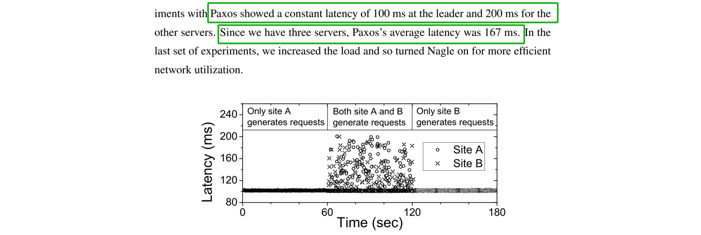

Figure 9-7. Consensus mechanism of the Mencius protocol as indicated in the Mencius paper.

Based on the figure, it can be inferred that if only one node generates a request, the Mencius protocol consensus requires 100ms, equivalent to one round-trip time (RTT). This indicates that from the Group Replication primary node's perspective, Mencius consensus can be achieved within a single RTT. With the theoretical feasibility clarified, the following discussion will focus on optimizing Group Replication's Mencius communication.

The theoretical basis for optimizing Mencius includes [32]:

*Skipping is the core technique that makes Mencius efficient.*

The specific Paxos network interaction diagram after Paxos skip optimization is shown in the following figure:

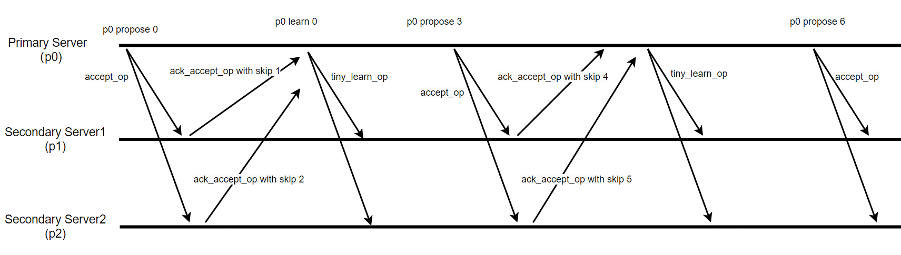

Figure 9-8. Mechanism of Paxos skip optimization.

When a Paxos node receives an *accept_op* message from the Paxos leader and has no messages to propose itself, it can include skip information when sending the *ack_accept_op* message. This informs other nodes that the current node will not propose any messages in this round. During normal stable operation, every *accept_op* message can be handled this way by Paxos nodes.

In the specific implementation, the impact of pipelining must also be considered. During the Paxos skip optimization process, it is necessary to record these skip actions to avoid interference between communications of different Paxos instances.

Finally, under a network delay scenario of 10ms, evaluating the effectiveness of Paxos skip optimization shows significant benefits. Here is a comparison of TPC-C throughput at different concurrency levels before and after Paxos skip optimization:

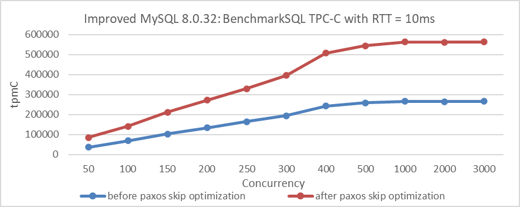

Figure 9-9. Impact of Paxos skip optimization on BenchmarkSQL tests with 10ms latency.

From the figure, it's clear that Paxos skip optimization significantly improves performance with a 10ms network latency. Extensive TPC-C testing confirms that this optimization improves performance for Group Replication, whether using a single primary or multiple primaries, and supports consistent reads and writes.

Paxos skip optimization reduces code complexity by an order of magnitude compared to Multi-Paxos implementations with a single leader. It also minimizes regression testing problems and simplifies maintenance.

Overall, leveraging theoretical and logical solutions elegantly addresses this problem more effectively than the current native MySQL implementation.

## 9.4 Optimized Design for Using Group Replication in Single-Primary Mode

Based on the feasibility of Paxos log persistence, a design architecture for Group Replication single-primary mode could be structured as follows:

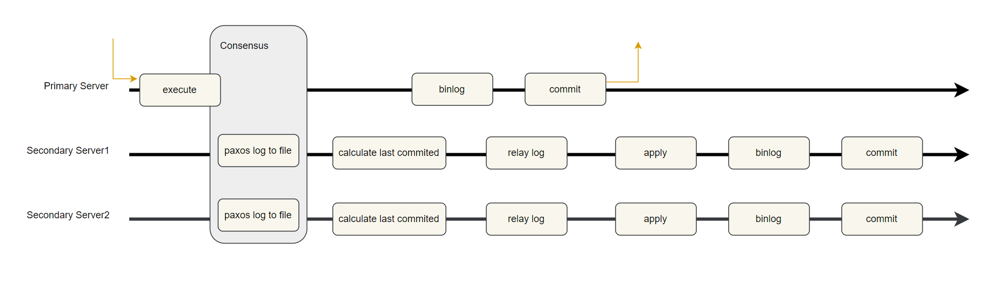

Figure 9-10. Redesigned Group Replication single-primary mode with Paxos log persistence.

When a transaction is committed, it undergoes Paxos communication, achieving consensus only after being persisted in the Paxos log. Once consensus is reached, the primary server proceeds with operations such as writing the transaction to the binary log and performing the commit. Meanwhile, secondary servers handle tasks like calculating the last_committed value for replay, writing transaction events to the relay log, and replaying transactions.

The need for secondary servers to calculate the last_committed value in Group Replication arises because the primary server has not reached the binlog stage before engaging in low-level Paxos communication. Thus, the last_committed value is not yet available. Secondary servers calculate the last_committed value from writeset information in the certification database, allowing Group Replication to achieve high parallel replay.

After MySQL secondaries calculate last_committed, the next step is to write transaction events to the relay log. To speed up writing to disk, batching technology should be used, with careful planning required for its implementation.

Enhancing replay speed is crucial for:

-   **Rapid Failover**: Faster replay ensures quicker failover.
-   **Improved Data Freshness**: Faster replay increases the chances of accessing the most current data.

With these aspects addressed, the design for Group Replication in single-primary mode is complete, laying the groundwork for a high-performance, highly available system with rapid failover and efficient state machine replication.

### 9.4.1 Paxos Log Persistence

The most critical foundation for Paxos log persistence feasibility [30]:

*In order to get additional throughput in a concurrent system, it is possible to batch a collection of values submitted by different application threads into a single Paxos instance.*

By using batching technology, multiple transactions can be grouped into a single Paxos instance. After reaching consensus, the transaction data can be written to disk together, significantly reducing I/O pressure. With advances in SSD technology, achieving state machine replication without data loss is entirely feasible.

### 9.4.2 Bypass Conflict Detection

Traditional certification databases use a lot of memory, especially when there is a speed mismatch between the primary and secondaries, leading to increased queue wait times due to extensive memory allocation and deallocation. In NUMA environments, frequent cross-NUMA memory allocation worsens performance.

In Group Replication single-primary mode, it is feasible to bypass conflict detection in the certification database. Conflict detection is mainly used in:

1.  Group Replication multi-primary mode.
2.  During a Group Replication single-primary switchover when the new primary is still replaying transactions while receiving new user requests.

For Group Replication in single-primary mode, only the second scenario needs to be considered, while mechanisms like 'before on primary failover' ensure the new primary completes transaction replay before accepting new requests. Accelerating the replay process on MySQL secondaries can help reduce user wait times.

### 9.4.3 Quickly Calculate the Required last_committed Value for Replay

First, let's clarify the terms "*sequence_number*" and "*last_committed*":

-   **sequence_number**: This is an automatically incremented value used to track the order of transactions during Group Replication operation. Each transaction is assigned a unique *sequence_number* during operation.
-   **last_committed**: This value indicates the sequence number of the last committed transaction that a new transaction depends on. For a transaction to proceed during replay on a MySQL secondary, the transaction must wait until the one with a *sequence_number* equal to *last_committed* has been fully replayed.

For example, in the transaction highlighted in the green box below, with *sequence_number=12759* and *last_committed=12757*, the *last_committed=12757* indicates that the transaction with *sequence_number=12759* must wait until the transaction with *sequence_number=12757* has been fully replayed before it can proceed.

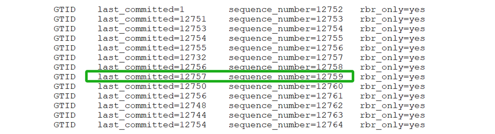

Figure 9-11. Typical examples of *sequence_number* and *last_committed*.

Once *sequence_number* and *last_committed* are understood, the calculation of the *last_committed* value can be explored. Typically, this value is derived from the transaction's writeset, which details the rows modified by the transaction. Each row in the writeset is represented by a key corresponding to a table row. In the writeset:

-   For update operations, there are two elements with the same key.
-   For insert and delete operations, there is one element.
-   The writeset for DDL transactions is empty, indicating that DDL operations must be replayed serially.

In Group Replication, when processing a transaction's writeset, the applier thread examines the certification database for transactions that have modified the same records as those in the writeset. If such transactions are found, the applier thread determines the latest *sequence_number* that is smaller than the current transaction's *sequence_number*, which becomes the transaction's *last_committed* value. This ensures transactions are replayed in the correct order to maintain data consistency.

Before diving deeper into the analysis, let's review what the applier thread does:

1.  Calculating *last_committed* based on the certification database.
2.  Writing transaction events to the relay log file.

Below is a flame graph generated from capturing performance data of the applier thread:

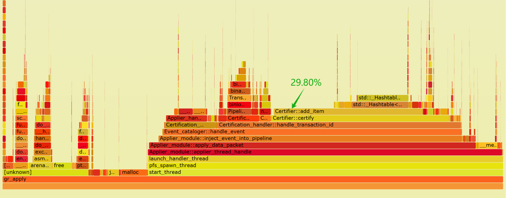

Figure 9-12. Flame graph of performance data for the applier thread.

From the flame graph, it is evident that the *'add_item'* operation in the certification database consumes 29.80% of the computation time, with half of this time spent on hash table operations. The inefficiency of the hash table results in high CPU resource consumption for calculating last_committed, and delays in writing transaction events to disk.

To address this bottleneck and improve disk write performance, the hash table's overhead must be reduced. Since direct improvements to the hash table are challenging, a new data structure is necessary.

Based on the design of Group Replication in single-primary mode, a redesigned data structure has been developed to replace the previous hash table approach in the certification database. This new structure aims to eliminate delays in calculating last_committed and ensure timely writing of transaction events to disk. See the specific code below for the new data structure:

```c++
#define REPLAY_CAL_HASH_ITEMS (REPLAY_CAL_HASH_ITEM / 8)
#define MAX_RELATIVE_SEQUENCE_NUMBER 65535
#define REPLAY_CAL_ARRAY 65536
#define REPLAY_CAL_HASH_ITEM 4088
typedef struct {
  int number;
  int size;
  unsigned char values[REPLAY_CAL_HASH_ITEM];
} replay_cal_hash_item;

class Certifier : public Certifier_interface {
 ...
 private:
  replay_cal_hash_item replayed_cal_array[REPLAY_CAL_ARRAY];
 ...
```

To store the information necessary for calculating *last_committed*, a static array named *replayed_cal_array* is used. This array contains 65,536 elements, each representing a bucket slot with a *replay_cal_hash_item*. The *replay_cal_hash_item* structure includes:

-   **number**: Indicates the current count of elements within the *replay_cal_hash_item*, tracking how many elements are in use.
-   **size**: Specifies the maximum capacity of the *replay_cal_hash_item*, defining the upper limit of elements it can accommodate.
-   **values**: An array of 4,088 unsigned char elements that stores data.

The **values** member is used to store 511 entries, with each entry occupying 8 bytes. Each entry consists of:

-   **Key Value**: 6 byte.
-   **Relative Sequence Number**: 2 bytes.

For specific details, refer to the figure below:

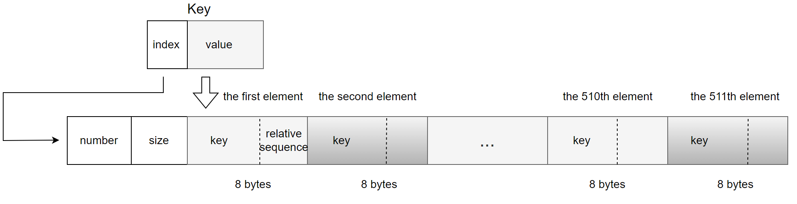

Figure 9-13. A new data structure suitable for calculating last_committed.

The *key* undergoes base64 conversion into an 8-byte integer. This 8-byte integer is divided as follows:

-   **Index for replayed_cal_array**: The first two bytes serve as an index for the *replayed_cal_array*.
-   **Value**: The remaining six bytes are stored in the first six bytes of each 8-byte entry.

Regarding the storage of *sequence_number*:

-   Only the relative value of the *sequence_number* is stored, calculated as the current *sequence_number* minus a base sequence value.
-   Instead of requiring 8 bytes, this relative *sequence_number* needs only 2 bytes.
-   This 2-byte relative *sequence_number* is stored in the last two bytes of each 8-byte entry.

This setup optimizes storage by using a compact representation of the *key* and storing only the necessary relative *sequence_number*, ensuring efficient memory use within the *replay_cal_hash_item* structure.

The algorithm based on the new data structure is illustrated in the figure below, highlighting the following key points:

1.  Fully utilizes the characteristics of *keys* and the monotonic increase of *sequence* numbers, compressing storage space effectively, resulting in very high memory usage efficiency for the new data structure.
2.  Sets an upper limit on the stored information. Once the threshold is exceeded, a process similar to checkpointing is triggered, and the current transaction is set for serial replay.
3.  The content of the new data structure is relatively small, with a high cache hit rate. Moreover, within *replay_cal_hash_item*, the *values* are stored contiguously, making it very cache-friendly.

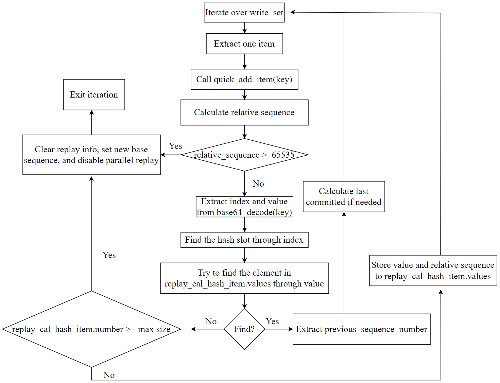

Figure 9-14. A new algorithm suitable for calculating last_committed.

It should be noted that the new data structure occupies a memory footprint of 256MB (65536 \* 4096 bytes), which is significantly smaller compared to the several gigabytes or even tens of gigabytes typically required by traditional certification databases during benchmarking. This modest memory usage lays a solid foundation for optimizing the performance of the entire applier thread.

After optimization, the applier thread has significantly accelerated its computation of the last_committed value, resulting in a considerable improvement in the overall processing speed of the applier thread. The following is a flame graph generated by capturing *perf* data of the applier thread using the improved version.

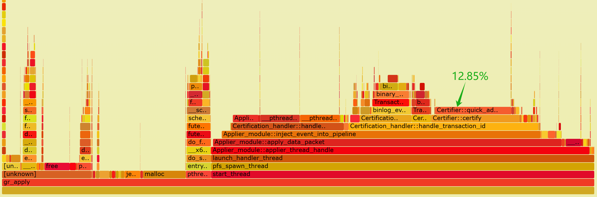

Figure 9-15. Flame graph of performance data for the applier thread after optimization.

From the graph, it can be observed that the CPU processing overhead for *Certifier::certify* has significantly reduced. Specifically, *quick_add_item* now accounts for only 12.85% of the overhead, whereas previously, when throughput was lower, *add_item* consumed 29.80%. This highlights a significant performance improvement achieved by adopting the new data structure.

Based on extensive TPC-C testing statistics, the following optimization conclusions can be drawn: Before optimization, the applier thread's disk throughput supported approximately 500,000 tpmC. After optimization, with more CPU time available to process disk writes, the applier thread's disk throughput now supports approximately 1,000,000 tpmC.

This improvement not only enhances the overall processing capability of the applier thread but also accelerates the cleaning of outdated writeset information. According to tests, each cleaning operation now takes milliseconds. As a result, it effectively mitigates the performance fluctuations inherent in native Group Replication, further improving stability.

From this case study, the reasons for performance improvement can be summarized as follows:

1.  **Static Array for Values**: Using a static array for *values* in *replay_cal_hash_item* enhances search efficiency due to contiguous memory access, making it very cache-friendly.
2.  **Reduced Data Storage**: The amount of stored data has been significantly reduced. Previously, it might have required gigabytes of storage, whereas now it only requires 256MB. Smaller memory footprints generally lead to higher efficiency.
3.  **Fixed Memory Space**: The allocated memory space is fixed and does not require dynamic allocation. Previous frequent memory allocations and deallocations were detrimental to high performance due to the synchronous nature of memory operations.
4.  **Efficient Certification Cleanup**: Certification cleanup can achieve millisecond-level performance. During certification cleanup, only zeroing operations are needed for the *number* values among the 65,536 *replay_cal_hash_item* items.

By implementing a better data structure based on Group Replication's single-primary mode to achieve the same last_committed calculation functionality, the applier thread's maximum processing capability can be significantly enhanced, and performance fluctuations can be eliminated.

### 9.4.4 Batch Write Mechanism for Relay logs

The transactional event logging to disk is one of the two main tasks of the applier thread. The efficiency of this logging directly impacts the usability of Group Replication. If the logging process is inefficient, the applier queue size will continuously increase according to queueing theory. Let's examine the optimized main process of the applier thread, as shown in the figure below:


Figure 9-16. The optimized main process of the applier thread.

The batch write mechanism refers to an improvement over the native MySQL version, where events were flushed to disk individually. Now, events from at least the same transaction are flushed together, significantly reducing the number of I/O flush operations. If the apply queue size exceeds a specified threshold, events from a batch of transactions are flushed together, further reducing the frequency of I/O flush calls.

The batch write mechanism, tested with TPC-C benchmarks, initially improved disk write speed from just over 200,000 tpmC to 500,000 tpmC. With further enhancements in last_committed replay calculations from the previous section, this speed can be pushed to around 1,000,000 tpmC, effectively solving problems related to excessive applier queue growth caused by delays in disk writes.

### 9.4.5 Comparing Performance with Traditional Group Replication

The figure below compares TPC-C throughput against concurrency levels in different modes. The deployment setup is as follows: Both MySQL primary and secondary are deployed on the same machine, with NUMA binding isolation to prevent computational interference. Separate SSDs are used for the primary and secondary to ensure no I/O operation interference.

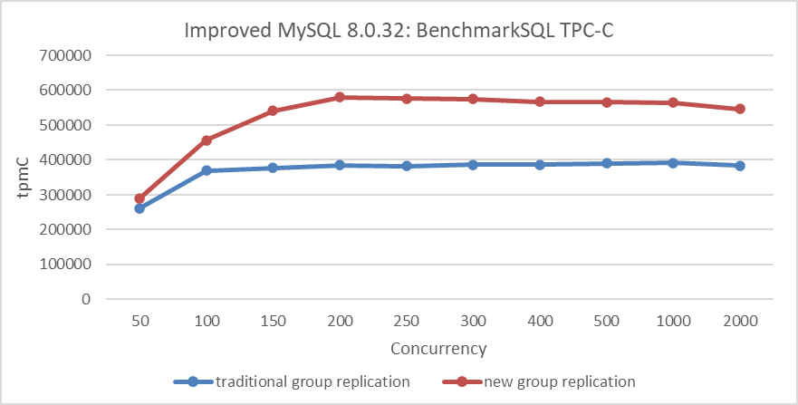

Figure 9-17. Effects of the new Group Replication single-primary mode design.

From the figure, it is evident that the new Group Replication single-primary mode design comprehensively outperforms the traditional mode of Group Replication.

## 9.5 How to Mitigate Performance Fluctuations in Group Replication?

### 9.5.1 Enhancing the Fail Detection Mechanism

Accurately detecting node failure is challenging due to the FLP impossibility result, which states that consensus is impossible in a purely asynchronous system if even one process can fail. The difficulty arises because a server can't distinguish if another server has failed or is just "very slow" when it receives no messages [32]. Fortunately, most practical systems are not purely asynchronous, so the FLP result doesn't apply. To circumvent this, additional assumptions about system synchrony are made, allowing for the design of protocols that maintain safety and provide liveness under certain conditions. One common method is to use an inaccurate local failure detector.


Figure 9-18. The asynchronous message passing model borrowed from the Mencius paper.

The figure above illustrates the asynchronous message passing model. Each failure detector monitors servers and maintains a list of suspected faulty servers. These detectors can make mistakes, such as suspecting a running server has crashed. If later corrected, the server can be removed from the suspected list. Protocols using failure detectors must always ensure safety despite these errors and guarantee progress when the detectors remain accurate for long periods.

Group Replication's failure detection mechanism identifies and expels non-communicating members. This increases the likelihood of the group containing a majority of functioning members, ensuring correct client request processing. All group members regularly exchange messages. If a member doesn't receive messages from another for 5 seconds, it suspects that member. If suspicion is not solved, the member is expelled. The expelled member remains unaware of its status and sees other members as unreachable. If it reconnects, it learns of its expulsion through an updated membership view.

After understanding the above content, let's analyze common types of view change events:

1. **Node is Killed**

   In a Linux system, when a node is killed, the TCP layer typically sends a reset (RST) packet to notify other nodes of the connection problem. Paxos communication can use this RST packet to identify the node's termination. However, MySQL does not handle this specifically and relies on the standard timeout mechanism.

2. **Node is Network-Partitioned**

   Detecting whether a node is network-partitioned or simply slow is challenging. In such cases, timeout mechanisms are used, as it is difficult to definitively distinguish between these situations.

3. **Node is Gracefully Taken Offline**

   Normally, informing other nodes by sending a command should be straightforward. However, MySQL has not managed this aspect well.

4. **Adding a new node to the cluster**

   Adding a new node requires consensus and involves a final installation view synchronization. Although some performance fluctuations are expected, severe fluctuations indicate poor handling of the node addition process.

Whenever a change that needs replication occurs, the group must achieve consensus. This applies to regular transactions, group membership changes, and certain internal messaging to maintain group consistency. Consensus requires a majority of group members to agree on a decision. Without a majority, the group cannot progress and blocks because it cannot secure a quorum.

Quorum may be lost due to multiple involuntary failures, causing a majority of servers to be abruptly removed. In a group of 5 servers, if 3 servers become unresponsive simultaneously, the majority is lost, which prevents reaching quorum.

Conversely, if servers exit the group voluntarily, they can instruct the group to reconfigure itself. A server leaving the group notifies others, allowing proper reconfiguration. This maintains membership consistency and recalculates the majority. For example, if 3 out of 5 servers leave one by one, informing the group, the membership can adjust from 5 to 2 while securing quorum during the process [13].

After understanding the working mechanism of view change, one can then examine how MySQL handles it.

In cases of node failure or network partitioning, MySQL's handling approach is similar. Testing was conducted with one MySQL secondary killed. Details of the test can be seen in the following figure.

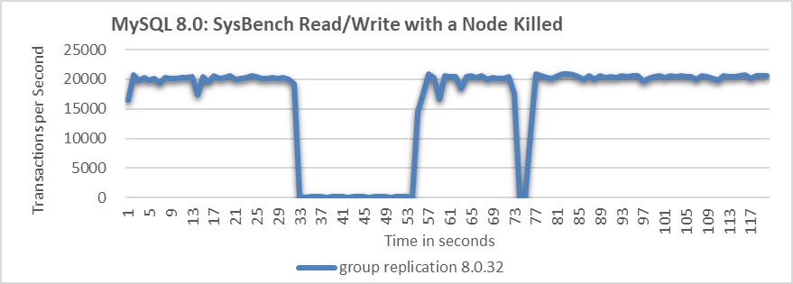

Figure 9-19. Significant throughput fluctuations when a node is killed.

From the figure, it is evident that when the MySQL secondary is killed, the MySQL primary's throughput fluctuates significantly, with a drop to zero lasting over 20 seconds. Ideally, in a three-node cluster, if one node is killed, the remaining two nodes should still form a majority, preventing a prolonged zero-throughput problem. This suggests that MySQL may not effectively manage the majority quorum and fail detection mechanisms.

When a MySQL secondary is gracefully taken offline, the throughput typically behaves as follows:

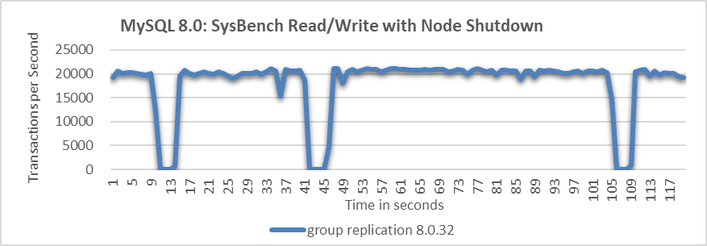

Figure 9-20. Throughput drops to zero at intervals when a node is shut down.

The figure shows that allowing a MySQL node to be gracefully taken offline causes throughput to drop to zero at several points, indicating problems with the fail detection mechanism.

What will happen when adding a MySQL node in Group Replication?

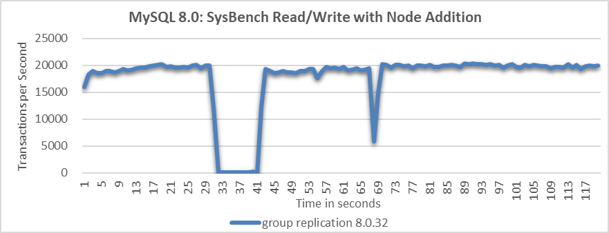

Figure 9-21. Throughput drop of approximately 10 seconds when a node is added.

From the figure, it is evident that the node addition process resulted in a throughput drop of approximately 10 seconds. This indicates that MySQL did not handle the node addition process effectively.

To address these problems in Group Replication, improving the probing mechanism is crucial for enhancing fault detection accuracy. Without this improvement, throughput can be significantly disrupted, making further performance enhancements challenging.

Regarding the probe mechanism, the following improvements have been made.

1. **Ensure Fair Execution for Probe Coroutines**

   During the processing of large transactions, the Paxos protocol handles substantial writeset data, monopolizing the processing resources of the single-threaded coroutine model. This leaves limited opportunities for the probe detection coroutine to update critical information. As a result, outdated probe data can lead to incorrect judgments, as observed in section 1.2.5.

   To address this, the solution is to amortize data processing by splitting large transactions into multiple stages. This approach ensures that the probe detection coroutine gets more equitable opportunities to execute and update information promptly, enhancing the accuracy of fault detection.

2. **Improved Wakeup Delay Function**

   Check the **wakeup_delay** function in MySQL, as shown in the code below:

   ```c++
   static double wakeup_delay(double old) {
     double const minimum_threshold = 0.1;
   #ifdef EXECUTOR_TASK_AGGRESSIVE_NO_OP  
     double const maximum_threshold = 1.0;
   #else   
     double const maximum_threshold = 20.0;
   #endif /* EXECUTOR_TASK_AGGRESSIVE_NO_OP */
     double retval = 0.0;
     if (0.0 == old) {
       double m = median_time();
       double const fuzz = 5.0;
       IFDBG(D_BUG, FN; NDBG(m, f));
       // Guard against unreasonable estimates of median consensus time
       if (m <= 0.0) m = minimum_threshold;
       if (m > maximum_threshold / fuzz) m = (maximum_threshold / fuzz) / 2.0;
       retval = minimum_threshold + fuzz * m + m * xcom_drand48();
     } else {
       retval = old * 1.4142136; /* Exponential backoff */
     } 
     /* If we exceed maximum, choose a random value in the max/2..max interval */
     if (retval > maximum_threshold) {
       double const low = maximum_threshold / 2.0;
       retval = low + xcom_drand48() * (maximum_threshold - low);
     }
     IFDBG(D_BUG, FN; NDBG(retval, f));
     return retval;
   }
   ```

   From the code, it is evident that the calculated delay time is too rigid. This inflexibility is a key reason for performance fluctuations, as the primary may wait too long after a node exits. To address this, adjusting the relevant constants based on the environment is essential for adapting to complex and variable network conditions.

3. **Split the wakeup_delay function to adapt to different environments**

   For example, when checking if propose messages have been accepted, utilize the original *wakeup_delay* function, as shown in the code below:

   ```c++
         while (!finished(ep->p)) { /* Try to get a value accepted */
           /* We will wake up periodically, and whenever a message arrives */
           TIMED_TASK_WAIT(&ep->p->rv, ep->delay = wakeup_delay(ep->delay));
           ...
   ```

   In the function *get_xcom_message*, the *wakeup_delay_for_perf* function is used, as shown in the code below:

   ```c++
     DECL_ENV
     ...
     while (!finished(*p)) {
       ...
       if (!((*p)->force_delivery)) {
         ep->delay = wakeup_delay_for_perf(ep->delay, 0.003);
       } else {
         ep->delay = wakeup_delay_for_perf(ep->delay, 0.1);
       }
       IFDBG(D_NONE, FN; NDBG(ep->delay, f));
       TIMED_TASK_WAIT(&(*p)->rv, ep->delay);
       *p = get_cache(msgno);
       dump_debug_exec_state();
     }
     FINALLY
     IFDBG(D_NONE, FN; SYCEXP(msgno); PTREXP(*p); NDBG(ep->wait, u);
           SYCEXP(msgno));
     TASK_END;
   }
   ```

   In the *wakeup_delay_for_perf* function, a more aggressive strategy can be employed, such as reducing the waiting time further.

4. Incorporate the Round-trip time (RTT) from the network into the wakeup_delay.

   The purpose of this is to enhance the accuracy of network probing activities.

5. Distinguish between node being killed and network partition.

   In Linux systems, when a node is killed, TCP sends reset packets to the other nodes in the cluster, helping distinguish between node terminations and network partition faults. Integrating information about abnormal node terminations into Paxos' decision-making logic allows for more accurate judgments, addressing the problem of prolonged throughput drops experienced during abrupt node terminations.

With the implementation of the above mechanism, probing accuracy has been significantly enhanced. Combined with the forthcoming degradation mechanism, this ensures relatively stable throughput even under abnormal conditions.

### 9.5.2 Leverage the Degradation Mechanism to Address Prolonged Waiting Problems

The degradation mechanism employs a majority-based approach to make decisions when a node becomes unresponsive after a short delay. While this mechanism is not new and is already part of Mencius interaction, MySQL has not effectively leveraged it to handle exceptional situations.

One drawback of the degradation mechanism is that it increases network interactions, including the prepare phase, leading to a performance decrease. However, its advantage lies in significantly improving throughput compared to how MySQL handles faults. In theory, as long as network latency between majority nodes is low, the degradation mechanism can be highly effective.

The following figure compares the throughput of SysBench read-write tests before and after improvements, following node being killed.

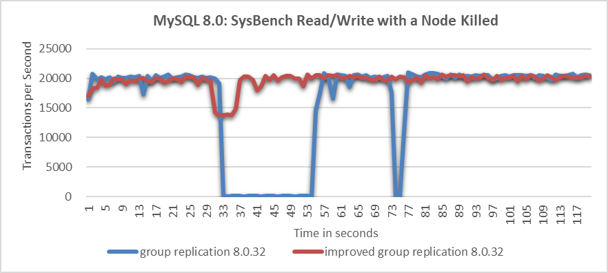

Figure 9-22. Significant throughput improvement observed when a node is killed.

From the figure, it's evident that the native Group Replication experiences prolonged throughput drops, which are unacceptable to users. In the improved Group Replication, throughput decreases from 20,000 to 14,000 transactions per second due to the degradation process. Although this decrease is noticeable, users consider it acceptable as it represents a significant improvement over the native Group Replication.

Let's continue to examine the throughput comparison over time before and after improvements following the normal shutdown of a particular node, as shown in the following figure:


Figure 9-23. Significant throughput improvement observed when a node is closed.

From the figure, it's clear that the improved Group Replication provides much more stable throughput compared to the native version. Although minor fluctuations occur during view changes due to internal synchronization, the improved Group Replication's throughput performance is deemed acceptable by users. In contrast, the frequent throughput drops in the native Group Replication are considered unacceptable.

Once again, comparing the throughput over time before and after improvements in the scenario of adding a MySQL secondary to the cluster, as shown in the following figure:

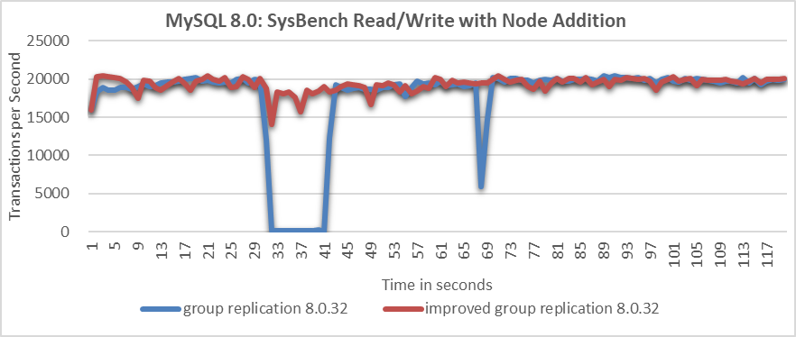

Figure 9-24. Significant throughput improvement observed when adding a node to cluster.

From the figure, it is evident that the native Group Replication experiences throughput drops of around 10 seconds, whereas the improved Group Replication shows only a slight decrease in throughput with minimal impact on performance.

Overall, the problems with native Group Replication in abnormal scenarios can be effectively solved.

### 9.5.3 Mitigating Performance Fluctuations in the XCom Cache

The Mencius algorithm uses a catch-up mechanism for lagging replicas. If a process detects an undecided instance from the past and the leader's correctness is confirmed via heartbeats, it should query other processes to learn the decision.

XCom, the group communication engine for Group Replication, includes a cache for storing Paxos instance messages and metadata. This cache aids in recovering missed messages for nodes that rejoin after communication failures. If messages are no longer in the cache, nodes must exit the cluster and undergo a costly traditional recovery. Thus, the XCom cache should be large enough to optimize recovery efficiency while considering memory constraints [13].

MySQL uses dynamic memory allocation to adjust the XCom cache size. While this approach appears advantageous, testing revealed that the XCom cache led to performance fluctuations.

Let's examine the expand_lru function responsible for XCom cache memory allocation, as detailed in the code below:

```c++
static void expand_lru() {
  uint64_t i;
  for (i = 0; i < BUCKETS; i++) { 
    lru_machine *l = (lru_machine *)xcom_calloc(1, sizeof(lru_machine));
    link_init(&l->lru_link, TYPE_HASH("lru_machine"));
    link_into(&l->lru_link, &probation_lru);
    init_pax_machine(&l->pax, l, null_synode);
    cache_length++;
  }
}
```

The *expand_lru* function allocates memory based on the number of *BUCKETS*. A large number of *BUCKETS* can lead to significant overhead. Next, let's determine the specific size of *BUCKETS*.

The definition of *BUCKETS* is as follows.

```c++
static size_t length_increment = INCREMENT;
static size_t size_decrement = INCREMENT / 10;
#define BUCKETS length_increment
```

*BUCKETS* corresponds to *length_increment*, which is defined by *INCREMENT*. Let's proceed to examine the definition of *INCREMENT*.

```c++
#define MIN_LENGTH MIN_CACHE_SIZE /* Also Default value */
#define INCREMENT MIN_LENGTH      /* Total number of slots to add/remove */
```

*INCREMENT* is equivalent to *MIN_LENGTH*, and *MIN_LENGTH* is defined by *MIN_CACHE_SIZE*. Finally, the definition of *MIN_CACHE_SIZE* is located as follows:

```c++
enum {
  EVENT_HORIZON_MIN = 10, 
  EVENT_HORIZON_MAX = 200,
  MAX_BATCH_SIZE = 0x3fffffff, /* Limit batch size to sensible ? amount */
  MAX_BATCH_APP_DATA = 5000,   /* Limit nr. of batched elements */
  MAX_DEAD = 10, 
  PROPOSERS = 10,              /* The number of proposers on one node */
  MIN_CACHE_SIZE = 250000,     /* Minimum cache size */
  DEFAULT_CACHE_LIMIT = 1000000000UL /* Reasonable initial cache limit */
};
```

*MIN_CACHE_SIZE* is set to 250,000, making *BUCKETS* 250,000 as well. Consequently, the *expand_lru* function performs 250,000 memory allocation calls. Given that memory allocation is a blocking system call, this extensive number of calls can introduce delays ranging from tens to hundreds of milliseconds. Log analysis was previously conducted to assess the overhead of performing 250,000 memory allocation calls, as illustrated in the figure below.

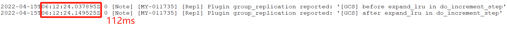

Figure 9-25. Overhead of 250,000 memory allocation calls on a typical machine.

The 250,000 memory allocation calls took 112ms. Additionally, the XCom cache experiences batch memory release problems, which can also cause performance delays. While the duration of these delays varies with machine performance, delays of tens of milliseconds are typical. Such fluctuations can lead to unexpected blocking of many user commits for tens of milliseconds, significantly impacting the user experience.

To address this problem, various configuration options�high-end, mid-range, and low-end�have been provided. These options involve selecting appropriate sizes for fixed static arrays, which eliminate the problems associated with batch memory allocation and release. The benefits of this new mechanism include:

1.  Cache-friendly with high performance.
2.  Elimination of performance fluctuations on the XCom cache side.

### 9.5.4  A New Strategy for Multi-Primary Certification Database cleanup

In Group Replication's single-primary mode, a mechanism was implemented to quickly calculate the *last_committed* value during replay, reducing significant performance fluctuations caused by certification database cleanup. However, in multi-primary Group Replication, conflict detection via the certification database is unavoidable, limiting flexibility in managing performance fluctuations. To address these challenges, a load-spreading strategy was adopted to mitigate the impact of significant performance variations.

The following figure shows the relationship between the throughput of SysBench read/write tests over time in a Group Replication multi-primary scenario.


Figure 9-26. Performance fluctuation in Group Replication.

The figure demonstrates a notable throughput fluctuation every 60 seconds, reflecting instability. This instability arises from the need to clean the certification database at regular intervals, which necessitates acquiring a global latch. This process causes the MySQL primary to pause, resulting in sudden performance drops.

The certification database consumes significant memory, and prolonged cleaning processes lead to stalls. Reducing the cleaning cycle period from 60 seconds to 10 seconds isn't a one-size-fits-all solution. In environments with large transaction processing, a 10-second cycle might be insufficient, causing overlapping cleaning cycles that worsen performance problems.

Based on extensive practice and experience, addressing the problem effectively involves:

1.  **Strict Adherence to State Machine Replication**: Following the state machine replication mechanism closely, as outlined in section 9.1.3, ensures consistency in handling transactions.
2.  **Reducing GTID Broadcast Interval**: Decreasing the interval of GTID (Global Transaction Identifier) broadcast to sub-second levels.
3.  **Enhancing Transaction Parallel Replay**: Improving the efficiency of parallel transaction replay on MySQL secondaries, especially for large transactions, reduces memory consumption and mitigates the effects of the 'barrel principle,' leading to better performance and reduced impact of performance fluctuations.

By implementing these steps, it becomes feasible to reduce the cleaning cycle from 60 seconds to sub-second intervals. This approach enables each cleaning operation to manage smaller data volumes, thereby reducing sudden performance drops and stabilizing throughput. The following figure shows the relationship between SysBench read/write test throughput over time after applying the amortization approach.


Figure 9-27. Eliminated performance fluctuations in improved Group Replication.

From the figure, it is evident that after optimizing this part of the logic, sudden performance drops have been eliminated. Overall, the solution implemented here exemplifies the application of the amortization principle, effectively distributing and reducing the impact of the cleaning operations.

### 9.5.5 Flow Control Avoidance in Group Replication Single-Primary Mode

In Group Replication, the flow control mechanism synchronizes MySQL secondaries with the primary node's pace, preventing the primary from outpacing the secondaries and avoiding performance problems like Out-Of-Memory (OOM) situations.

To avoid the impact of Group Replication flow control in a single-primary setup, consider the following strategies:

1.  **Accelerate MySQL Secondary Replay Speed**: Improve the replay speed of transactions on MySQL secondaries, especially for large transactions. This helps ensure that secondaries can keep up with the primary node, reducing the need for flow control interventions.
2.  **Increase Relay Log Writing Speed**: Speed up the process of writing to the relay log to prevent the applier queue from growing excessively due to delays in writing to disk. This prevents a surge in memory usage, which can trigger flow control mechanisms.

By implementing these two strategies in a single-primary Group Replication setup, the flow control mechanism imposed by Group Replication can be effectively avoided.

## 9.6 The Complexity Problem of View Change

When there are changes in the membership of nodes within a Group Replication cluster, corresponding view change events occur. These view change events also require consensus among a majority of Paxos participants.

### 9.6.1 Theoretical Foundation

To achieve high availability, incoming payloads should be replicated to multiple nodes in the same order. This distribution reduces the burden on the primary secondary, allowing another secondary to quickly take over if the primary fails, while preserving the original log order even after recovery [43].

Each reign of different members is assigned a unique view number, establishing a total ordering. The system progresses through a series of views, with view changes occurring whenever members change. Multiple proposals from different views are ordered by their view numbers, with a lower view number indicating an earlier occurrence.

In Group Replication, view change is a synchronous process that helps address the FLP impossibility problem but introduces new performance jitter problems.

### 9.6.2 The Problem of Simultaneous Multiple View Changes

The following figure shows the situations of different network partition failures [6]:


Figure 9-28. The types of network partitions.

Network partitions can be categorized into complete, partial, and simplex types. When these partitions intersect with other failures or commands triggering view changes, it creates complex concurrency challenges. Currently, Group Replication lacks effective isolation measures to handle these problems.

Here are some common concurrent view change problems:

1.  **force_members Command**: This command is incompatible with view changes triggered by network jitter. Use it cautiously, especially during severe network instability.
2.  **Rapid Node Restarts**: Nodes restarting too quickly can cause view confusion if they rejoin before being fully removed. Group Replication attempts to address this, but the problem persists.
3.  **Simultaneous Node Additions**: Adding multiple nodes at once can lead to view problems.
4.  **Install View Process Failures**: New failures during the Install view process can freeze the entire cluster.

Some view change problems are challenging to mitigate and require significant effort to solve, especially due to the lack of theoretical support in this area.

For the problem where a MySQL node attempts to rejoin the Group Replication cluster before its information is fully removed, potentially causing view inconsistencies, a solution involves measures similar to TCP's timewait mechanism:

1.  When the Group Replication cluster detects that a node is about to be removed (using remove_node_type), it informs the Paxos layer to temporarily prevent the node from rejoining.
2.  After the node removal process is complete, typically following the install view operation, the Paxos layer is notified that the node can proceed with reapplying to join the cluster.

This careful process helps minimize view-related problems from premature node reentry.

Currently, problems related to concurrent view changes (problems 2 and 3) have been addressed, but problems 1 and 4 remain complex and are planned for future resolution.

### 9.6.3 Synchronization Problems with the Install View

The view change process is more complex than typical Paxos interactions. Once consensus is reached on a view change within the Group Replication cluster, the cluster must undergo a synchronous "install view" process. This strong synchronization can cause the entire cluster to freeze if problems arise during the installation.

## 9.7 Consistency Problems in Group Replication

### 9.7.1 Read Consistency During Primary Switch in Group Replication

In a single-primary group, in the event of a primary failover when a secondary is promoted to primary, the new primary can either be made available to application traffic immediately, regardless of how large the replication backlog is, or alternatively access to it can be restricted until the backlog has been applied [13].

Consistency during failover includes:

-   **RW Transactions**: Wait for all preceding transactions to complete before being applied, ensuring synchronization only affects RO transactions.
-   **RO Transactions**: Wait for preceding transactions to complete before execution, ensuring they read the latest data.

New transactions on a newly elected primary are held until the backlog is applied, guaranteeing that clients see the latest values. This approach prioritizes consistency but may introduce delays depending on the backlog size.

To elegantly solve the problem of reading dirty data during the primary switch process, the following measures can be implemented:

1.  **Accelerate Replay Speed**: Enhance the replay speed of MySQL secondaries to ensure they catch up with the primary as quickly as possible. This minimizes the window during which stale data might be read.
2.  **Optimized Leader Election**: During leader election, choose the node with the fastest replay progress among MySQL secondaries. This reduces the waiting time for the primary switch, ensuring a quicker transition and more up-to-date data availability.

### 9.7.2 Consistency Problems in Write Operations

The 'after' mechanism in Group Replication aims for near-complete synchronization between the MySQL primary and secondaries, achieving strong synchronization. This requires synchronization at both the Paxos and replay levels, leading to longer user response times. Users opting for this strong synchronization should be aware of the following risks:

1.  Performance fluctuations.
2.  User commit response times may not meet performance requirements.

The 'after' mechanism is currently immature; during testing, many instances have shown MySQL nodes remaining in a recovering state for extended periods. The root cause lies in the adoption of a new ticket mechanism to address the 'after' problem, which is overly complex and insufficiently effective.

In practical applications, it is not recommended to use strong consistency writes based on the 'after' mechanism. Although this mechanism ensures no data loss, the CAP theorem dictates that such mechanisms do not guarantee availability.

This book prefers and recommends mechanisms based on Paxos log persistence. These mechanisms not only offer lower and more predictable response times but also far surpass the scalability of the 'after' mechanism. The following figure compares the throughput of TPC-C with concurrency levels between the strong synchronization mechanism based on 'after' and the Paxos log persistence mechanism.

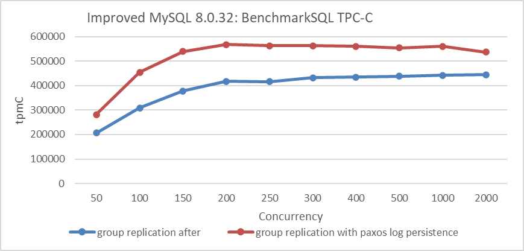

Figure 9-29. Group Replication with Paxos Log Persistence vs. Strong Synchronization Mechanism.

From the figure, it can be seen that the mechanism based on Paxos log persistence significantly outperforms the strong synchronization mechanism based on 'after'.

## 9.8 Comparison of Group Replication with Other Replication Mechanisms

### 9.8.1 Comparison Tests Under Different Network Latency Conditions

A MySQL cluster can be deployed in various environments, and understanding the pros and cons of each helps in making informed decisions. Performance comparisons under different network latency conditions were conducted for four solutions: asynchronous replication, semisynchronous replication, Group Replication, and Group Replication with Paxos log persistence, using an improved version of MySQL.

The following figure compares the throughput of SysBench read/write tests with varying concurrency levels under different replication schemes in a 1ms network latency scenario:

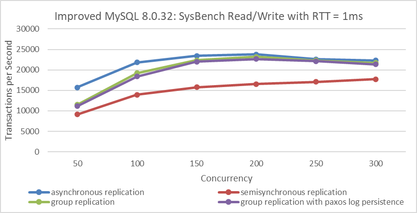

Figure 9-30. Throughput comparison of SysBench Read/Write tests with varying concurrency levels under different replication schemes at 1ms network latency.

Asynchronous replication offers the best throughput since it does not require MySQL secondary ACK confirmation, but it cannot guarantee high availability. Group Replication, by achieving consensus at the in-memory Paxos layer and ensuring transaction batch consensus, provides significant advantages and demonstrates much better performance compared to semisynchronous mechanisms. Group Replication with Paxos log persistence shows similar performance to Group Replication, benefiting from batch processing of Paxos entries and enhanced SSD hardware performance.

Semisynchronous replication, on the other hand, processes events sequentially. Since a transaction involves multiple events, it leads to high CPU processing delays. According to queueing theory, the wait time in semisynchronous replication is significantly higher compared to other solutions, resulting in poorer throughput.

The following figure illustrates the comparison of response times for the 4 solutions across different concurrency levels.

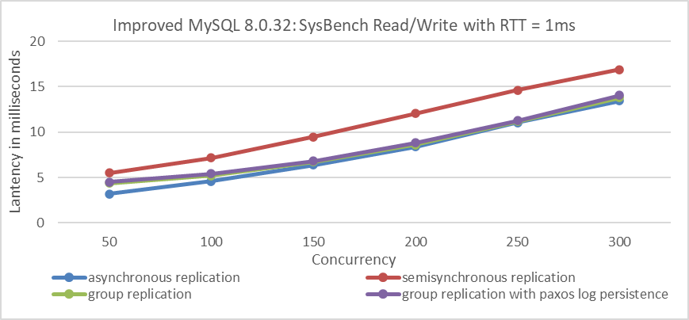

Figure 9-31. Response time comparison of SysBench Read/Write tests with varying concurrency levels under different replication schemes at 1ms network latency.

From the figure, it is clear that semisynchronous replication exhibits the worst response time, while asynchronous replication shows the best performance, which is consistent with expectations.

When network latency is increased to 10ms, the following figure illustrates the specific performance comparisons:


Figure 9-32. Throughput comparison of SysBench Read/Write tests with varying concurrency levels under different replication schemes at 10ms network latency.

From the figure, it is clear that asynchronous replication offers the best throughput. It achieves significantly higher throughput and maintains relatively stable response times despite network latency, making it a preferred choice for deployments across cities or regions.

In scenarios with long network latencies (10ms), the processing delay of MySQL secondaries is less of a bottleneck for both semisynchronous replication and Group Replication. However, semisynchronous replication lags behind Group Replication in throughput due to its less efficient event processing mechanism.

At the same time, a comparison was made among the 4 different solutions in terms of response time.

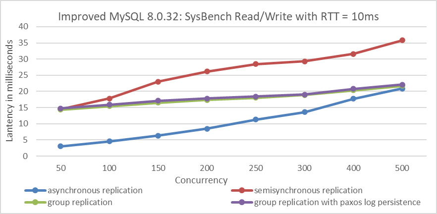

Figure 9-33. Response time comparison of SysBench Read/Write tests with varying concurrency levels under different replication schemes at 10ms network latency.

From the figure, it is clear that at low concurrency levels, asynchronous replication has the lowest response time. However, as concurrency increases, the performance gap between asynchronous replication and Group Replication narrows. Semisynchronous replication consistently shows the highest response times among all solutions. Theoretically, Group Replication with Paxos log persistence could fully replace semisynchronous replication, offering improved performance while retaining the high availability benefits of Group Replication.

### 9.8.2 Group Replication with Paxos Log Persistence vs. Other Replication Methods

In the same data center environment, TPC-C tests using BenchmarkSQL were performed to compare the throughput against concurrency levels for semisynchronous replication, Group Replication with Paxos log persistence, and asynchronous replication. Specific details are illustrated in the following figure:

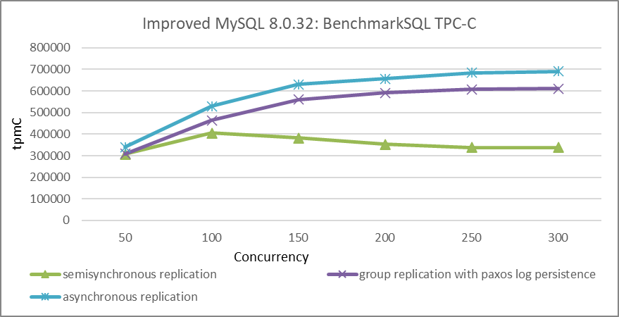

Figure 9-34. Throughput comparison of BenchmarkSQL tests with varying concurrency levels under different replication schemes.

From the figure, it is evident that in the same data center environment, asynchronous replication achieves the highest throughput, though the difference compared to Group Replication is not substantial. The trade-off of some performance for higher availability with Group Replication is often worthwhile. Compared to Group Replication with Paxos log persistence, semisynchronous replication significantly lags in performance.

In terms of ease of use, semisynchronous replication is simpler, especially with fewer MySQL instances. However, as the number of instances increases, managing semisynchronous replication becomes more complex due to the potential for more corner cases and failures.

## 9.9 Scalability of Group Replication

The Paxos algorithm's dependence on majority agreement slows decision-making, as each decision requires round trips to many participants [29]. This communication and synchronization cost introduces significant overhead, resulting in lower request rates for state-machine replication compared to non-replicated systems.

After reviewing the content, use the modified tpcc-mysql tool to compare the throughput between a standalone server and a Group Replication setup. This comparison will help assess the limits of Group Replication's capabilities.

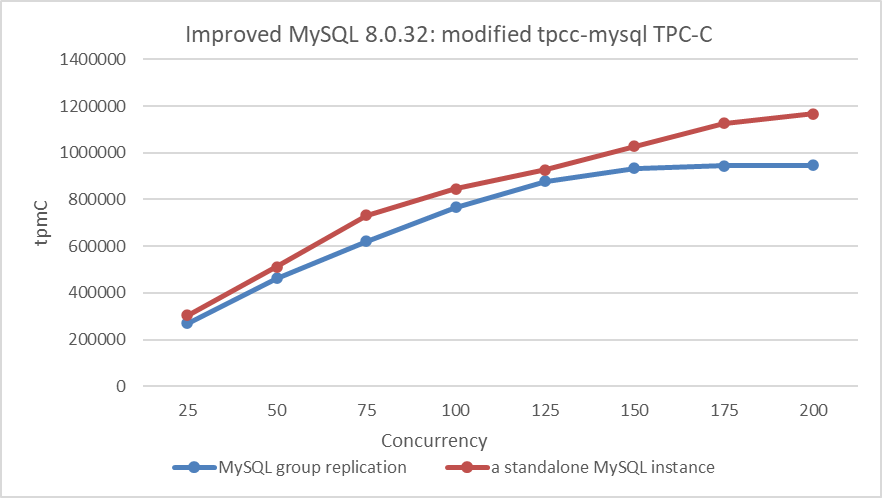

Figure 9-35. The limits of Group Replication's capabilities.

From the figure, it is clear that there is still potential for improving the throughput of a standalone MySQL instance. Group Replication adds extra queue delays, with throughput peaking at 200 concurrency. Further increases in throughput are challenging given the current hardware environment.

Group Replication faces a throughput ceiling influenced by hardware capabilities, the synchronization cost of Paxos, and the single-threaded processing limits of XCom. In contrast, standalone MySQL shows better scalability and achieves higher throughput.

Involving most participants in each decision places a high load on the network between participants and the leader. As a result, systems are often limited to five or seven participants, as each additional participant substantially decreases overall performance [29].

How does Group Replication's scalability fare with increasing numbers of nodes? Due to the underlying Paxos communication being based on a single-threaded model, adding more nodes theoretically weakens processing capability. In the same data center environment, cluster tests were conducted with 3 nodes, 5 nodes, 7 nodes, and 9 nodes as shown in the figure below:

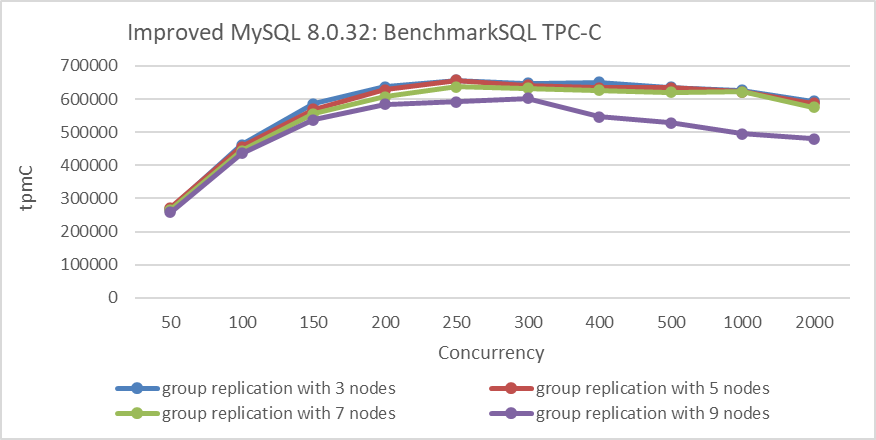

Figure 9-36. Scalability of Group Replication across different node configurations.

From the figure, it can be seen that the throughput of the 7-node cluster is still acceptable, but there is a significant drop in throughput with 9 nodes compared to 7 nodes. These tests were conducted in the same data center environment, which may not represent all scenarios. However, it highlights a concern: as the number of nodes increases, the scalability of Group Replication may be affected.
