# Preface

## Who This Book Is For?

When software professionals encounter complex problems, they often face contradictions and struggle to find solutions. To overcome these challenges, it's crucial to view tough problems as opportunities for significant rewards. Embracing difficult challenges can lead to valuable insights and breakthroughs.

With 20 years of problem-solving experience, most challenging problems in server-side software can be solved through systematic logical analysis. Despite its global prominence, MySQL faces a variety of problems. The journey in addressing these MySQL problems has enriched understanding and led to the development of unique insights, which inspired the writing of this book.

This book uses MySQL challenges as case studies to explore problem analysis and resolution strategies. Readers will gain a deeper appreciation for logical reasoning, data structures, algorithms, and more through practical examples and insightful discussions.

This book covers the following topics:

1.  **Logical Reasoning for MySQL**: Techniques for analyzing complex MySQL problems using logical reasoning.
2.  **Computer Science Fundamentals**: Fundamentals of computer science relevant to MySQL.
3.  **MySQL Internals**: An introduction to the basics of MySQL core components.
4.  **Performance Testing**: Methods for scientifically testing MySQL performance.
5.  **MySQL 8.0 Improvements**: Key improvements in MySQL 8.0 compared to MySQL 5.7.
6.  **MySQL Improvements**: Further optimizations in a standalone MySQL instance.
7.  **Group Replication Advancements**: Notable enhancements in MySQL Group Replication.
8.  **Secondary Replay improvements**: Optimizations in MySQL's secondary replay.
9.  **Performance Optimization Techniques**: Strategies for optimizing MySQL applications.

**Focus of the Book:**

Building on the goal of enhancing MySQL scalability, this book explores various optimization strategies to increase throughput, reduce response times, and ensure that MySQL secondaries closely match the performance of the primary server, thereby achieving high availability failover with very little delay in most scenarios.

**Target Audience:**

1.  **Quality-Focused Developers**: Individuals committed to high-quality software development.
2.  **Problem Solvers**: Those interested in tackling complex software problems.
3.  **MySQL Enthusiasts**: Readers looking to understand MySQL from the ground up.
4.  **Testing Practitioners**: Users keen on mastering effective testing techniques.
5.  **Software Architects**: Those designing large-scale software systems.
6.  **Performance Engineers**: Engineers struggling with performance optimization.
7.  **Computer Science Students**: Learners aiming to strengthen their foundational knowledge.
8.  **MySQL Researchers**: Researchers conducting studies based on MySQL.

## Outline of This Book

Part 1 focuses entirely on MySQL-related problems. Chapter 1 explores how users approach and solve challenging MySQL problems. Chapter 2 focuses on mysterious problems in MySQL 8.0.

Part 2 primarily covers the fundamental knowledge related to problem-solving. Chapter 3 emphasizes the importance of logical reasoning skills in addressing MySQL challenges effectively. Chapter 4 provides practical computer fundamentals essential for understanding MySQL problems. Chapter 5 introduces MySQL kernel basics, laying the groundwork for subsequent problem-solving discussions. Chapter 6 covers scientific methods for testing MySQL.

Part 3 primarily focuses on the analysis and improvement of specific problems. Chapter 7 highlights notable optimizations in MySQL 8.0. Chapter 8 examines improvements for solving problems specific to MySQL 8.0. Chapter 9 discusses enhancements in MySQL Group Replication, while Chapter 10 focuses on improvements in MySQL secondary replay. Together, these chapters not only boost MySQL performance but also lay the foundation for achieving a high availability cluster.

Part 4 primarily analyzes performance improvements from the perspective of MySQL users. Chapter 11 presents techniques to improve MySQL 8.0 application performance without code changes.

Part 5 is the concluding summary. Chapter 12 outlines future directions for MySQL improvements and concludes the book.

## References and Further Reading

This book focuses on analyzing and solving MySQL problems, so a certain level of computer science background is recommended. To support understanding and maintain continuity, key terminology is included in the "Glossary" section of the appendix. For those lacking a foundation in MySQL, please refer to the related content in the appendix or consult dedicated MySQL books.

## Special Terminology Explanation

1.  **Balanced Replay Speed**

    For MySQL secondary replay, this defines balanced replay speed where the MySQL secondary matches the primary under normal circumstances. When the speed is at or below the balanced replay speed, there is no significant lag in transaction replay progress on the secondary. However, if the speed exceeds this threshold, the secondary begins to lag behind the primary in transaction replay progress.

2.  **Dual One**

    Specifically refers to two major configurations in MySQL: *sync_binlog=1* and *innodb_flush_log_at_trx_commit=1*.

3.  **MySQL Secondary Replay**

    This term represents the common replay process for asynchronous replication, semisynchronous replication, and Group Replication. In this book, 'MySQL primary' is consistently used to represent the MySQL source, and 'MySQL secondary' to represent the MySQL replica.

## Deployment Supplementary Explanation

When deploying MySQL for testing, it is preferable to match the test environment as closely as possible to the production environment, unless certain configurations significantly interfere with performance analysis. Below are specific declarations related to MySQL deployment during the testing process:

1.  Mainstream servers used are all NUMA architecture servers.
2.  Servers are generally x86 architecture.
3.  SSD hardware disks are used.
4.  All tests are conducted on the Linux operating system.
5.  MySQL standalone tests typically use version 8.0.27, while MySQL cluster tests generally use version 8.0.32.
6.  Improvements to MySQL are referred to as improved MySQL or modified MySQL.
7.  The transaction isolation level in TPC-C tests is *Read Committed*.
8.  The storage engine used for transactions is InnoDB.
9.  The **binlog_format** parameter is set to row-based format.
10. MySQL, whether primary or secondary, uses GTID (Global Transaction Identifier).
11. Cluster settings include *replica_preserve_commit_order=on*.
12. Unless stated otherwise, TPC-C tests are generally based on partitioned large tables.

## How to Contact Us

For configurations, patches, and additional information related to this book, please visit our webpage: <https://github.com/advancedmysql/>.

Email [wangbin579@gmail.com](mailto:wangbin579@gmail.com) to comment or ask technical questions about this book.

## Acknowledgments

This book meticulously organizes a wealth of ideas and knowledge contributed by numerous individuals, encompassing insights from both academic research and industrial practice. In computing, there is a natural inclination towards the latest innovations, yet our historical foundations offer valuable lessons. This book references dozens of articles, blog posts, documentation, and other resources, making it an invaluable learning resource for me. I am profoundly grateful to the authors for their generous contributions of knowledge.

Several individuals have been crucial in the writing of this book by reviewing drafts and offering feedback. I am especially grateful for the contributions of Hongshen Wang, Jinrong Ye, Riyao Gao, and Haitao Gao. Naturally, I take full responsibility for any remaining errors or contentious opinions in this book.

Finally, my deepest gratitude to my family, whose unwavering support has been indispensable throughout this nearly two-month writing journey. You’re the best.

# Part1 Problems

This part focuses entirely on MySQL-related problems. Chapter 1 explores how users approach and solve challenging MySQL problems. Chapter 2 focuses on mysterious problems in MySQL 8.0.

# Chapter 1: Traditional Methods for Solving MySQL Problems

## 1.1 Current State of Solving MySQL Problems

Solving problems related to MySQL usage is generally straightforward and involves gathering information and applying logical reasoning, making these problems typically resolvable. However, tackling inherent problems within MySQL itself proves significantly more complex. Fortunately, MySQL users are resourceful and have devised various solutions, such as implementing thread pools to mitigate scalability challenges.

To effectively solve the myriad problems of MySQL, relying solely on peripheral fixes and patches is inadequate. It's essential to delve into the core nature of these problems and comprehensively address them to achieve meaningful progress. For example, MySQL Group Replication has persistently struggled with instability. Despite robust development efforts, the ongoing challenge lies in adopting the correct problem-solving approach, resulting in difficulties in reducing bugs.

## 1.2 How Are MySQL Problems Solved?

Here are some classic problems listed, along with typical resolutions in real-world MySQL usage scenarios.

### 1.2.1 Addressing Scalability Problems in MySQL 5.7

The following figure illustrates the relationship between TPC-C throughput and concurrency in MySQL 5.7.39 under a specific configuration. This includes setting the transaction isolation level to Read Committed and adjusting the *innodb_spin_wait_delay* parameter to mitigate throughput degradation.


Figure 1-1. Scalability problems in MySQL 5.7.39 during BenchmarkSQL testing.

From the figure, it is evident that scalability problems significantly limit the increase in MySQL throughput. For example, after 100 concurrency, the throughput begins to decline. Due to MySQL's historical scalability challenges, Percona even open-sourced a thread pool to address these problems. The following figure illustrates the relationship between TPC-C throughput and concurrency after configuring the Percona thread pool.


Figure 1-2. Percona thread pool mitigates scalability problems in MySQL 5.7.39.

For MySQL 5.7.39, the thread pool effectively mitigates the decline in throughput degradation, although it also slightly reduces peak throughput due to inherent overhead costs. This overhead becomes more noticeable when comparing performance at lower concurrency levels.

As MySQL 8.0 versions improve scalability, the effectiveness of the thread pool in mitigating throughput degradation diminishes. Subsequent chapters will provide real-world cases to substantiate this observation.

### 1.2.2 Enhancing Join Performance in MySQL

Due to the absence of hash join support in MySQL 5.7, the following statistical SQL query took 3.82 seconds to execute.


Figure 1-3. Non-hash join performance in MySQL 5.7.

In MySQL 8.0, the introduction of hash joins in the execution plan has improved join performance. For the same SQL query mentioned earlier, specifying hash join through comments reduced the execution time to just 1.22 seconds, a significant improvement from the previously observed 3.82 seconds.


Figure 1-4. Hash join performance in MySQL 8.0.

This illustrates the improvement in join execution introduced in MySQL 8.0, highlighting one of its key advancements.

### 1.2.3 Challenges of MySQL Semisynchronous Replication in Large-Scale Deployments

Since the introduction of the Paxos protocol, an increasing number of databases have adopted state machine replication to construct a highly available cluster.

The Paxos protocol relies on a majority-based mechanism rooted in set theory to achieve consensus. For instance, in a cluster with 3 MySQL nodes, 2 nodes can form a majority. If these 2 nodes reach consensus, the system can operate continuously. Theoretically, adherence to this majority-based mechanism should prevent divergence or split-brain problems under any anomaly.

Raft, another widely used protocol, is essentially a simplified version of the Paxos protocol. The following section describes Meta's implementation of MySQL high availability using the Raft protocol [38], which simplifies traditional high availability processes.

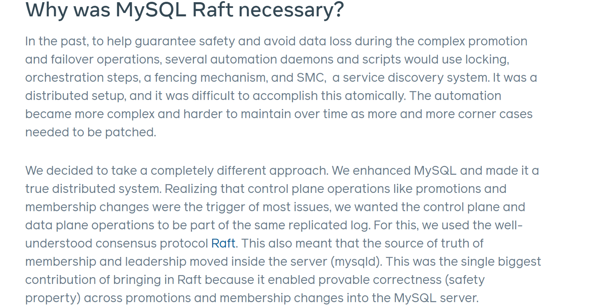

Figure 1-5. Reasons Meta uses raft.

Meta's case study demonstrates that the new solution based on the Raft protocol simplifies high availability challenges. Raft is often viewed as a streamlined version of the Paxos protocol. Similarly, a Group Replication solution based on the Paxos protocol, if implemented correctly, could also offer an elegant solution.

### 1.2.4 Majority-Based Mechanism Performance and Its Accuracy

With the transaction isolation level set to Read Committed, simulations based on Group Replication were conducted under various network latency conditions.

The deployment setup of Group Replication is illustrated as follows: On machine A, two MySQL instances are deployed—one serving as the primary and the other as the secondary. These two instances form the majority and communicate via localhost. Machine B hosts a third instance deployed as a member of the cluster, with a network latency of X milliseconds.

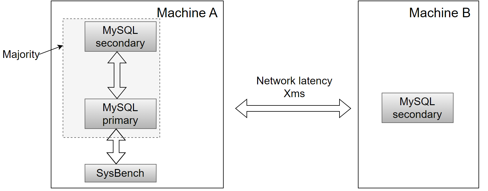

Figure 1-6. Deployment diagram for majority-based mechanism performance testing.

In theory, with a majority-based mechanism, a cluster of 3 nodes only needs responses from 2 nodes to provide results to the client. By this logic, local SysBench tests should demonstrate very high efficiency.

Throughput comparisons over time have been conducted for machine B in scenarios within the same data center and across data centers with latencies of 10ms, 100ms, and 1000ms. Specific results are illustrated in the following figure.


Figure 1-7. Performance testing results of the default multi-leader Paxos algorithm.

From the figure, it is evident that under the default mode of Group Replication, throughput across data centers deviates significantly from theoretical expectations. For example, in scenarios with 10ms network latency, the cluster's throughput decreases to one-fifth of its original level. To address this discrepancy, starting with MySQL 8.0.27, the *group_replication_paxos_single_leader* option was introduced. Enabling this option utilizes the single leader Paxos algorithm instead of the default multi-leader Paxos algorithm.

After configuring Group Replication to use the single leader Paxos algorithm, tests were conducted under the same conditions using the SysBench testing tool. The test results are as follows.


Figure 1-8. Performance testing results of the single-leader Paxos algorithm.

From the figure, it is evident that the results of the single leader mode are significantly better than previous results. However, the drawback is that the single leader mode can only function in MySQL's single-primary mode, and its application scope is limited, unable to be applied in scenarios requiring strong consistency for read and write operations.

Is this modification to the underlying Paxos algorithm truly the optimal solution? This will be explored in depth in the following chapters.

### 1.2.5 Group Replication: Localhost Deployment Reports Unreachable

Deploying Group Replication with two nodes on the same machine, where communication between these nodes occurs via localhost, theoretically should not encounter network-related jitter, packet loss, or problems with unreachable peers under normal conditions.

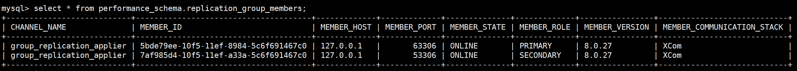

Figure 1-9. Localhost deployment relationships displayed by Performance Schema.

During TPC-C data loading tests with BenchmarkSQL under normal pressure, the MySQL error logs revealed multiple instances of the primary and secondary nodes reporting each other as unreachable.

Here is a partial screenshot of the error log from the MySQL primary:

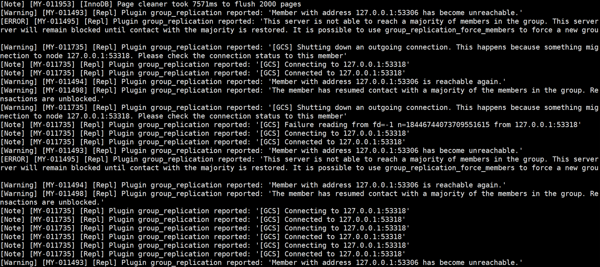

Figure 1-10. A partial screenshot of the error log from the MySQL primary.

Here is a partial screenshot of the error log from the MySQL secondary:

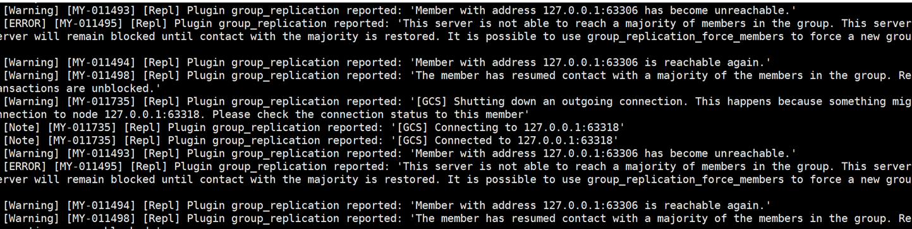

Figure 1-11. A partial screenshot of the error log from the MySQL secondary.

From these logs, warnings indicating 'has become unreachable' are evident. Under normal conditions, frequent 'unreachable' reports in a localhost scenario like this are unexpected. Blaming the network for Group Replication's delayed problem handling isn't optimal. Future chapters will explore enhancements to the network probing mechanism to address these false reporting problems.

## 1.3 Summary

This chapter analyzed how users approach solving MySQL problems. MySQL 8.0 has made strides in improvement, notably in mitigating scalability problems and introducing support for hash joins, which is a positive development. However, there remain numerous unsolved problems, both longstanding and newly emerging. Effectively addressing MySQL problems demands a thorough understanding of the problems and relevant theories; otherwise, the understanding may be incomplete.

The next chapter will demonstrate the considerable challenge of solving obscure MySQL problems through various case studies. It necessitates a broad knowledge base and extensive logical reasoning to pinpoint the root causes of these problems.

# Chapter 2: Mysterious MySQL Problems

MySQL, the most popular open-source database software with a history spanning several decades, is renowned for its simplicity and user-friendly nature, making it a cornerstone choice among internet companies. Despite its widespread adoption, MySQL faces a variety of challenges.

This chapter introduces nine puzzling MySQL problems or phenomena that serve as examples and lay the groundwork for deeper exploration in subsequent topics.

## 2.1 SysBench Read-Write Test Demonstrates Super-Linear Throughput Growth

In the MySQL 8.0.27 release version, for example, in a NUMA environment on x86 architecture, using SysBench to remotely test MySQL's read-write capabilities. The MySQL transaction isolation level is set to Read Committed. MySQL instances 1 and 2 are deployed on the same machine, with a testing duration of 60 seconds. The results of separate SysBench tests for MySQL instance 1 and instance 2 are shown in the following figure.


Figure 2-1. Throughput of MySQL running separately.

The throughput of each instance is modest, with figures of 172,781 QPS and 155,387 QPS respectively. When combined, the two instances achieve a total throughput of 328,168 QPS. When using SysBench to simultaneously test the read and write capabilities of these two instances, the obtained throughputs are 271,232 QPS and 275,197 QPS respectively.


Figure 2-2. Throughput of MySQL running together.

The combined throughput of the two MySQL instances is 546,429 QPS. This data demonstrates that when these two MySQL instances share the same machine, the combined throughput is significantly higher than the sum of their individual throughputs when run separately. For detailed statistical comparisons, please refer to the following figure.


Figure 2-3. Total throughput of running separately vs. running together.

In terms of mathematical logic, if the total throughput when running two instances together is roughly equal to the sum of the throughputs when running them separately, it represents a linear relationship. If the combined throughput exceeds this sum, it suggests a super-linear relationship.

What drives super-linear relationships? Does MySQL exhibit super-linear behavior? Understanding this requires a deep dive into computer fundamentals and advanced MySQL concepts.

## 2.2 Unexpected Decline in TPC-C Throughput After Applying PGO

Profile-guided optimization (PGO) is a well-established technique for improving compile-time optimization decisions. Profile information is collected through instrumentation or sampling of the executable, and this data is used to optimize the executables it was gathered from [45]. Despite its effectiveness, PGO has not been widely adopted by software projects due to its cumbersome dual-compilation model. Nevertheless, PGO remains a highly valuable optimization technique to consider for improving MySQL performance, as it theoretically has the potential to significantly improve MySQL's efficiency.

The following diagram illustrates the application of PGO to higher versions of MySQL 8.0.

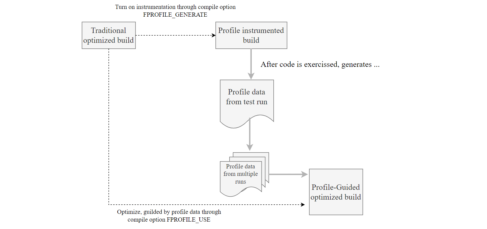

Figure 2-4. Using PGO in higher versions of MySQL 8.0: a step-by-step guide.

From the diagram, the Profile-Guided Optimization (PGO) mechanism involves several steps:

1.  Initially, compile a specific version of MySQL with the compilation option *"-DFPROFILE_GENERATE=ON"*.
2.  Start this MySQL version and capture training data by running performance tests such as TPC-C, which helps collect performance metrics.
3.  After completing the training phase, perform a second compilation with the option *"-DFPROFILE_USE=ON"*. During this compilation, the compiler automatically utilizes the gathered statistical data to optimize conditional branches and related aspects, significantly improving the performance of the resulting MySQL executable.

The following figure illustrates the relationship between throughput and concurrency before and after applying PGO to MySQL 8.0.27.


Figure 2-5. Performance comparison tests before and after using PGO in MySQL 8.0.27.

Based on the figure, it's evident that PGO leads to notable improvements in MySQL throughput at lower concurrency levels. However, beyond 150 concurrency, both the overall throughput and peak performance show a decline.

Does PGO primarily benefit low-concurrency scenarios, or are there additional factors limiting its effectiveness? This question delves into queueing theory and system architecture. Further exploration of practical computer fundamentals will provide deeper insights into this matter.

## 2.3 Adverse Effects of Thread Pool on MySQL After Scalability Enhancements

After applying various scalability patches to MySQL 8.0.27, it's crucial to evaluate whether the Percona thread pool still effectively addresses scalability problems. The following figure depicts the results of TPC-C testing on a standalone MySQL instance using BenchmarkSQL. The deep blue line indicates the configuration with the Percona thread pool enabled (thread pool size = 128), while the deep red line represents the configuration with the thread pool disabled. The test covered concurrency levels ranging from 50 to 2000, utilizing a database with 1000 warehouses.


Figure 2-6. Enabling the Percona thread pool resulted in a significant reduction in throughput compared to when it was disabled.

From the figure, it is clear that enabling the Percona thread pool clearly led to a significant decrease in throughput compared to having it disabled. Notably, even without the thread pool enabled, MySQL 8.0 showed a marked improvement in scalability compared to MySQL 5.7. This suggests that the additional benefit of using the Percona thread pool for improving TPC-C testing was limited. Moreover, the Percona thread pool mechanism itself introduces overhead, which is reflected in the figure's results.

It's important to acknowledge that the Percona thread pool remains valuable in scenarios involving frequent connection creation and severe contention. However, the key question remains: what exactly contributed to such significant improvements in MySQL scalability? Future chapters will explore these mysteries further.

## 2.4 In MySQL 8.0, TPC-C Throughput Drops Too Quickly

The standards for long-term TPC-C testing are as follows: the TPC-C benchmark requires that the database run for at least eight hours with jitters less than 2% in two hours [14].

Based on MySQL 8.0.27, long-term TPC-C testing was conducted using the BenchmarkSQL tool. Below are the BenchmarkSQL testing parameters:

```
warehouses=1000
loadWorkers=100
terminals=200
warehouses-begin=1
warehouses-end=1000
//To run specified transactions per terminal- runMins must equal zero
runTxnsPerTerminal=0
//To run for specified minutes- runTxnsPerTerminal must equal zero
runMins=480
//Number of total transactions per minute
limitTxnsPerMin=0
//Set to true to run in 4.x compatible mode. Set to false to use the
//entire configured database evenly.
terminalWarehouseFixed=false
//The following five values must add up to 100
//The default percentages of 45, 43, 4, 4 & 4 match the TPC-C spec
newOrderWeight=45
paymentWeight=43
orderStatusWeight=4
deliveryWeight=4
stockLevelWeight=4
```

From the above, it can be seen that there are 1000 warehouses, with a concurrency of 200, and terminalWarehouseFixed is set to false. This setting enables each transaction to use a different warehouse ID every time, thereby accessing data across all warehouses.

The following figure illustrates the throughput over time during long-term testing. The TPC-C throughput shows a decline rate that significantly surpasses expectations, nearing a 50% decrease.


Figure 2-7. Performance degradation exposed during BenchmarkSQL testing of MySQL 8.0.27.

This problem was identified during testing using BenchmarkSQL and may not necessarily occur with other TPC-C testing tools. As of the current version, MySQL 8.0.38, the problem of rapid throughput decline has not been fully solved. Subsequent chapters will delve into detailed explanations of the underlying causes of this problem.

## 2.5 Repeatable Read Surprisingly Outperforms Read Committed

Transaction isolation is fundamental to database processing, represented by the 'I' in the ACID acronym. The isolation level determines the balance between performance and the reliability, consistency, and predictability of results when multiple transactions concurrently make changes and queries. Commonly used isolation levels are Read Committed, Repeatable Read, and Serializable. By default, InnoDB uses Repeatable Read.

InnoDB employs distinct locking strategies for each isolation level, impacting query locking behavior under concurrent conditions. Depending on the isolation level, queries may need to wait for locks currently held by other sessions before execution begins [13]. There's a common perception that stricter isolation levels can degrade performance. How does MySQL perform in practical scenarios?

Tests were conducted across Serializable, Repeatable Read (RR), and Read Committed (RC) isolation levels using two benchmark types: SysBench uniform and pareto tests. The SysBench uniform test simulates low-conflict scenarios, while the SysBench pareto test models high-conflict situations. Due to excessive deadlock logs generated during the SysBench pareto test, which significantly interfered with performance analysis, these logs were suppressed by modifying the source code to ensure fair testing conditions. Moreover, the MySQL testing program utilized a modified version for accuracy, rather than the original version.

The figure below presents results from the SysBench uniform test, where concurrency increases from 50 to 800 in doubling increments. Given the few conflicts in this test type, there is little variation in throughput among the three transaction isolation levels at low concurrency levels. However, beyond 400 concurrency, the throughput of the Serializable isolation level exhibits a notable decline.


Figure 2-8. SysBench read-write performance comparison with low conflicts under different isolation levels.

Below 400 concurrency, the differences are minor because of fewer conflicts in the uniform test. With fewer conflicts, the impact of lock strategies under different transaction isolation levels is reduced. However, Read Committed is mainly constrained by frequent acquisition of MVCC ReadView, resulting in performance inferior to Repeatable Read.

Continuing with the SysBench test under pareto distribution conditions, specific comparative test results can be seen in the following figure.


Figure 2-9. SysBench read-write performance comparison with high conflicts under different isolation levels.

The figure clearly illustrates that in scenarios with significant conflicts, performance differences due to lock strategies under different transaction isolation levels are pronounced. As anticipated, higher transaction isolation levels generally exhibit lower throughput, particularly under severe conflict conditions.

In scenarios with few conflicts, performance is primarily constrained by the overhead of acquiring ReadView in MVCC. This is because, under the Read Committed isolation level, MySQL must copy the entire active transaction list each time it reads from the global active transaction list, whereas under Repeatable Read, it only needs to obtain a copy of the active transaction list at the start of the transaction.

In summary, in low-conflict tests like SysBench uniform, the overhead of MVCC ReadView is the predominant bottleneck, outweighing lock overhead. Consequently, Repeatable Read performs better than Read Committed. Conversely, in high-conflict tests like SysBench pareto, lock overhead becomes the primary bottleneck, resulting in Read Committed outperforming Repeatable Read.

## 2.6 Group Replication Throughput Lower Than Semisynchronous Replication

During Group Replication operation, a certification database is maintained. Regular cleanup of outdated certification information is crucial to manage memory usage efficiently. However, this cleanup process involves acquiring a global latch, temporarily pausing MySQL primary execution until the certification information is cleared.

In contrast, traditional semisynchronous replication requires the MySQL secondary to process a substantial amount of relay log event information. Only after these relay log events are written to disk can the secondary send acknowledgment (ack) information back to the MySQL primary. This process includes network interactions, handling numerous relay log events, and disk flushes, resulting in relatively longer response times for semisynchronous replication.

Overall, with semisynchronous replication, the MySQL primary must wait for acknowledgment from the MySQL secondary after relay log events are written to disk before it can proceed. In contrast, Group Replication continues processing once consensus is achieved at the Paxos layer, without waiting for log writes at that layer. Theoretically, Group Replication can achieve higher throughput.

In the scenario of a two-node cluster, TPC-C throughput comparisons based on concurrency were conducted between Group Replication and semisynchronous replication. Please refer to the following figure for details.


Figure 2-10. Performance comparison between Group Replication and semisynchronous replication.

The figure indicates that under low concurrency, semisynchronous replication outperforms Group Replication, whereas Group Replication shows superior performance under high concurrency. Semisynchronous replication reaches its peak performance at 100 concurrency, whereas Group Replication peaks at 250 concurrency but offers lower peak performance than semisynchronous replication. These test results are unexpected. What could be the problem?

The root problem lies in the certification database mechanism used by Group Replication, which is absent in semisynchronous replication. This mechanism involves substantial memory allocation and deallocation, significantly limiting throughput improvement. Despite not requiring Paxos log persistence, this bottleneck negates the advantages of Group Replication. It is clear that the implementation of the certification database mechanism poses the primary performance challenge for Group Replication.

## 2.7 Modified Group Replication Outperforms Semisynchronous Replication

Group Replication has been extensively enhanced while addressing scalability problems in MySQL 8.0.32. To validate these improvements, simultaneous testing of semisynchronous replication and Group Replication with Paxos log persistence was conducted. The deployment setup included two-node configurations for both semisynchronous and Group Replication, hosted on the same machine with independent SSDs and NUMA binding to isolate each node. Specifically, the MySQL primary utilized NUMA nodes 0 to 2, while the MySQL secondary utilized NUMA node 3. All settings, except those directly related to semisynchronous or Group Replication configurations, remained identical.

The following figure shows the throughput comparison of semisynchronous replication and Group Replication with Paxos log persistence under different concurrency levels.


Figure 2-11. Performance comparison between Group Replication with Paxos log persistence and semisynchronous replication.

Both employ persistence mechanisms, with Group Replication utilizing Paxos log persistence and semisynchronous replication utilizing relay log persistence. Due to these distinct mechanisms, Group Replication with Paxos log persistence demonstrates significantly superior performance compared to semisynchronous replication.

Meta Company has implemented a MySQL high availability solution based on Raft. According to tests conducted by Meta Company developers, the performance of the Raft-based improved version is comparable to that of semisynchronous replication. For specific details, refer to the figure below [42].


Figure 2-12. Throughput comparison borrowed from Meta paper.

In theory, Group Replication can leverage a batching-based disk persistence mechanism, eliminating the need to process binlog events during disk writes, thereby achieving higher expected throughput. Future chapters will delve into detailed discussions on modifying Group Replication and examining specific factors contributing to the scalability challenges of native semisynchronous replication.

## 2.8 SysBench Shows No Effect, TPC-C Performs Well

The specifics of the lock-sys optimization in MySQL 8.0 are detailed below:

```c++
commit 1d259b87a63defa814e19a7534380cb43ee23c48
Author: Jakub Łopuszański <jakub.lopuszanski@oracle.com>
Date:   Wed Feb 5 14:12:22 2020 +0100
    WL#10314 - InnoDB: Lock-sys optimization: sharded lock_sys mutex
    
    The Lock-sys orchestrates access to tables and rows. Each table, and each row,
    can be thought of as a resource, and a transaction may request access right for
    a resource. As two transactions operating on a single resource can lead to 
    problems if the two operations conflict with each other, Lock-sys remembers
    lists of already GRANTED lock requests and checks new requests for conflicts in
    which case they have to start WAITING for their turn.
    
    Lock-sys stores both GRANTED and WAITING lock requests in lists known as queues.
    To allow concurrent operations on these queues, we need a mechanism to latch
    these queues in safe and quick fashion.
    
    In the past a single latch protected access to all of these queues. 
    This scaled poorly, and the management of queues become a bottleneck.
    
    In this WL, we introduce a more granular approach to latching.
```

This represents a scalability improvement in MySQL 8.0 by addressing the global latch bottleneck and optimizing lock scheduling in InnoDB. To validate the effectiveness of this lock-sys optimization, refer to the specific test results illustrated in the figure below using SysBench read-write tests.


Figure 2-13. Comparison of SysBench read-write tests before and after lock-sys optimization.

It's surprising that after implementing the lock-sys optimization, the throughput decreased, which was unexpected. To mitigate interference from NUMA compatibility problems in MySQL code, the MySQL running instance was bound to NUMA node 0 (similar to an SMP environment). The test results are as follows.


Figure 2-14. Comparison of SysBench read-write tests before and after lock-sys optimization under SMP.

The figure shows that the difference before and after optimization is minimal, almost negligible. This suggests that during the testing process, the effectiveness of the lock-sys optimization is overshadowed by other factors, resulting in distorted test results. However, binding to NUMA node 0 reduced interference from other bottlenecks, narrowing the performance gap. It also indicates that the lock-sys optimization has limited impact on SysBench standard read-write tests.

Using BenchmarkSQL for TPC-C testing, the results are as follows:


Figure 2-15. Comparison of BenchmarkSQL tests before and after lock-sys optimization.

The figure demonstrates a noticeable improvement from the lock-sys optimization. However, it raises questions as to why SysBench testing shows no effect while BenchmarkSQL testing does. Understanding the differences between these two tools and important considerations during testing will be thoroughly discussed in upcoming chapters.

## 2.9 Is Disabling NUMA Really Beneficial for MySQL?

The impact of disabling NUMA on the MySQL primary was initially tested. The deployment setup was as follows: BenchmarkSQL high-pressure stress tests were conducted on two x86 machines with identical hardware configurations. One machine had NUMA disabled in the BIOS, while the other had NUMA enabled. The comparison of TPC-C throughput versus concurrency is illustrated in the figure below.


Figure 2-16. Significantly improved TPC-C throughput by disabling NUMA in the BIOS.

The figure demonstrates that disabling NUMA on x86 machines significantly improves TPC-C throughput. This improvement stems from the favorable memory allocation mechanism after disabling NUMA in the BIOS, particularly beneficial for applications like MySQL primary servers.

Now, does disabling NUMA also benefit MySQL secondary replay? Using the same machines mentioned earlier for testing, the setup details are as follows: in the environment where NUMA is disabled in the BIOS, NUMA binding cannot be utilized, allowing all memory to be utilized. Conversely, in the environment where NUMA is enabled in the BIOS, MySQL secondaries are bound to NUMA node 0. The following figure illustrates the balanced replay speeds tested in these different environments.


Figure 2-17. Comparison of balanced replay speed before and after disabling NUMA in the BIOS.

The figure reveals that disabling NUMA at the BIOS level results in a balanced replay speed of only around 570,000 tpmC, primarily due to the unsolved NUMA unfriendliness problems with MySQL secondaries. In contrast, enabling NUMA and binding MySQL secondaries to a single NUMA node can achieve a balanced replay speed exceeding 810,000 tpmC. This test highlights the disadvantage of disabling NUMA at the BIOS level for MySQL secondary replay efficiency. Effective MySQL secondary replay with NUMA disabled necessitates addressing these NUMA unfriendliness problems, as failure to do so significantly reduces efficiency. The upcoming Chapter 10 on improving MySQL secondary replay will provide a detailed examination of these NUMA unfriendliness problems.

## 2.10 Summary

This chapter delves into classic and intricate MySQL problems, which pose significant challenges for analysis. The resolution of these problems begins with a detailed logical analysis, as outlined in the following chapter. Addressing and solving these problems necessitates a profound understanding of computer fundamentals and MySQL internals. Computer fundamentals encompass a broad range of topics including computer architecture, data structures, algorithms, operating systems, computer networks, compilers, queueing theory, and distributed systems theory, among others. These topics will be thoroughly explored in Chapter 4. Chapter 5 will focus specifically on MySQL internals.

# Part2 Basics

This part primarily covers the fundamental knowledge related to problem-solving. Chapter 3 emphasizes the importance of logical reasoning skills in addressing MySQL challenges effectively. Chapter 4 provides practical computer fundamentals essential for understanding MySQL problems. Chapter 5 introduces MySQL kernel basics, laying the groundwork for subsequent problem-solving discussions. Chapter 6 covers scientific methods for testing MySQL.

# Chapter 3: How to Solve Software Problems Effectively

When encountering challenging problems, software professionals often rely on experience to find solutions. However, especially with the numerous MySQL problems discussed in this book, it is challenging to identify the root cause of problems based solely on experience. Therefore, scientific methods are needed to analyze and solve these problems.

This chapter discusses how to analyze and solve problems from two different levels: strategy and tactics [1].

## 3.1 Analysis Strategies

There are many analysis strategies, including psychological strategies, simplification strategies, pattern-finding strategies, strategies to increase reproducibility, and strategies to find key evidence.

### 3.1.1 Psychological Strategies

Many people often feel overwhelmed by problems, especially when they seem mysterious or difficult to solve. When they encounter such challenges, their first instinct is to seek help from others if they cannot solve them on their own. However, relying solely on others can hinder the opportunity to develop and strengthen one's own logical thinking skills through problem-solving.

When faced with difficulties, particularly those that seem complex, it is crucial to approach them with confidence. These challenges can serve as opportunities to unlock one's potential and enhance problem-solving abilities. MySQL, as a complex database software, presents numerous such challenges.

Firstly, encountering these challenges leads to a deeper understanding of MySQL over time. Secondly, they offer invaluable opportunities to tackle complex problems, thereby improving developers' problem-solving capabilities. Lastly, the historical problems associated with MySQL are invaluable; without them, books like this one would not exist. Each challenge contributes to expanding our knowledge base and refining our approach to solving MySQL-related problems.

### 3.1.2 Simplification Strategies

When a problem occurs and reproducing the original conditions is very complex, it's essential to simplify the reproduction environment step by step. This approach allows you to check if the problem still occurs. If it does, you continue simplifying until the problem no longer manifests. This strategy significantly simplifies the difficulty of problem analysis. For instance, when troubleshooting problems with a MySQL cluster, begin by checking if the problem occurs on a single MySQL instance. If it does, there's no need to set up the entire cluster; you can troubleshoot using the single instance.

### 3.1.3 Pattern-finding Strategies

When a problem recurs, it often reveals underlying characteristics, facilitating the statistical aggregation of patterns and regularities associated with it. This data supports problem reproduction and inference-making. For instance, after PGO, instead of increasing, peak performance decreased. Testing at various concurrency levels showed a significant decline under high concurrency, with improvement observed at lower levels. This insight lays the groundwork for addressing subsequent problems and reinforces confidence in PGO's potential to improve throughput in high concurrency scenarios.

### 3.1.4 Strategies to Increase Reproducibility

Many problems are environment-specific, often manifesting sporadically, especially under high concurrency. The challenge lies in addressing these infrequent occurrences, which may happen just once every few months. Increasing the frequency of problem reproduction—from every few months to every few hours or minutes—significantly simplifies their resolution.

How can this be achieved? Capturing patterns in problem occurrence is crucial. For example, when addressing simultaneous failures in Group Replication that sporadically freeze views, analyzing statistical patterns reveals critical insights. These problems often cluster around specific thresholds. Adjusting lower-level communication timeout settings to align with network interruption durations enables more frequent problem reproduction. Once these critical factors are understood, the likelihood of reproducing problems increases significantly, laying a solid foundation for effective problem resolution.

Therefore, the ability to reproduce problems often proves crucial in solving challenging problems. Improving the reproducibility by capturing the characteristics of problem recurrence is key to expediting problem resolution.

### 3.1.5 Strategies to Find Key Evidence

Sometimes, revealing the characteristics of a problem directly is challenging; it necessitates creating conditions that fully manifest the problem. Let's revisit the figure below, using PGO as an example.


Figure 3-1. Performance comparison tests before and after using PGO in MySQL 8.0.27.

PGO (Profile-Guided Optimization) is effective in improving throughput under low concurrency. However, there is a strong belief that interference from other factors in high concurrency scenarios limits PGO's ability to achieve its intended effectiveness.

Based on the above analysis, binding the MySQL instance to NUMA node 0 allowed us to explore whether PGO can achieve its performance potential in an SMP environment. For specific comparative test results, please refer to the following figure:


Figure 3-2. Performance comparison tests before and after using PGO in MySQL 8.0.27 under SMP.

From the figure, binding to a single NUMA node demonstrates that PGO significantly improves performance across all concurrency scenarios shown. This finding underscores PGO's ability to boost MySQL throughput, establishing a strong basis for improving performance in NUMA environments.

Regarding the sharp decline in TPC-C throughput discussed in section 2.4, users encountered this problem during regression testing after upgrading to MySQL 8.0.29. Notably, this performance drop was absent in MySQL 8.0.25. User feedback on this discrepancy is pivotal, greatly facilitating the resolution process.

## 3.2 Logical Thinking

At the core of programming lies problem-solving. Logical reasoning empowers programmers to break down complex problems into manageable components and devise practical solutions by analyzing requirements, understanding relationships between elements, and planning logically and efficiently. This structured approach enables programmers to think critically and innovate creatively [56]. Logical reasoning is crucial in computer engineering for creating justifiable inferences. Enhanced use of logical thinking in workplaces boosts productivity by refining decision-making and minimizing errors. Rooted in sequential thought, logic underpins all systematic analysis, solution design, error correction, and performance optimization in programming. It utilizes deductive, inductive, abductive reasoning, and reductio ad absurdum to gather key evidence, identify contradictions, and ensure software reliability

### 3.2.1 Deductive Reasoning

Deductive reasoning involves deriving conclusions from premises, often structured as syllogisms. A syllogism typically comprises a major premise, a minor premise, and a conclusion. For instance:

-   Major premise: All cluster databases cannot simultaneously meet the three requirements of CAP (consistency, availability, and partition tolerance).
-   Minor premise: Group Replication is a type of cluster database.
-   Conclusion: Therefore, Group Replication also cannot meet the three requirements of CAP.

Given Group Replication's inability to meet these requirements, it should be chosen based on user-specific needs rather than attempting to satisfy all criteria.

Here's another example:

-   Major premise: Asynchronous network systems struggle to differentiate between slow response and system outage.
-   Minor premise: TCP communication relies on asynchronous networks.
-   Conclusion: Thus, TCP communication systems also encounter challenges in distinguishing between slow response and actual system failure.

Due to these challenges, TCP design must incorporate specific features such as robust timeout mechanisms and support for idempotency.

### 3.2.2 Inductive Reasoning

Inductive reasoning extrapolates from specific instances to general conclusions. For instance:

-   On x86 NUMA platforms, native MySQL 8.0.32 shows poor scalability under the Read Committed isolation level.
-   On ARM NUMA platforms, native MySQL 8.0.32 similarly demonstrates poor scalability under the Read Committed isolation level.

Therefore, on various NUMA platforms, native MySQL 8.0.32 consistently exhibits poor scalability under the Read Committed isolation level. Inductive reasoning is crucial for problem analysis and holds practical significance across diverse applications.

### 3.2.3 Abductive Reasoning

Abductive reasoning, also known as backward reasoning, involves deriving the best explanation from observed facts. It is a widely employed method in solving programming problems, especially when symptoms are evident but the underlying cause is unclear. For example, after optimizing MySQL with PGO (Profile-Guided Optimization), if throughput peaks decrease rather than increase, abductive reasoning may reveal that poor MySQL handling in NUMA environments is causing this outcome.

### 3.2.4 Reductio ad Absurdum

"Reductio ad absurdum" is a method of disproving a proposition by demonstrating that its logical conclusion leads to an absurd or contradictory outcome. This approach aims to show that a statement or hypothesis must be false because accepting it would result in an illogical or unacceptable result. It is a common method used to refute arguments, characterized by the strategy of "*retreating to advance*", where introducing absurdity exposes flaws in reasoning.

For example, Group Replication often reports network unreachable errors. To verify the reliability of these error messages, consider them accurate. However, deploying Group Replication in a controlled localhost environment, where external network access isn't necessary, should not result in the same network errors. Yet, during the normal TPC-C data loading process, frequent network unreachable errors persist. This inconsistency indicates that the error messages cannot be relied upon.

### 3.2.5 Utilizing Various Methods Comprehensively

The challenges in software problem-solving differ significantly from those in mathematical problems, often influenced by human misjudgments and numerous external factors, leading to frequent errors in judgment. The theoretical foundation in this area is relatively underdeveloped, heightening the complexity of problem-solving.

Utilizing logical thinking methods is crucial for solving complex programming problems. These methods often necessitate synthesizing diverse approaches to address challenges, occasionally incorporating probability information.

## 3.3 Tactics for Solving Problems

Strategies themselves rarely directly solve problems; more powerful methods are needed to solve them.

### 3.3.1 Balancing Different Options

Once the root cause of the problem is identified, there are often multiple options to choose from, requiring a careful balance of their pros and cons. For example, when addressing the poor compatibility of InnoDB with NUMA, there are two solutions: the first is latch-free modification, which is complex, error-prone, and costly to maintain; the second is improving the speed of accessing critical latch resources, a simpler solution but not a definitive fix as it still exhibits problems under extremely high concurrency. Given the need to maintain compatibility with MySQL's official releases during modification, the second option was chosen, which was a prudent decision. As for scalability problems under high concurrency, implementing transaction throttling mechanisms can improve performance comparable to latch-free solutions.

### 3.3.2 Decompose the Problem

Complex problems often bring multiple associated problems that can significantly interfere with analysis and judgment. To effectively solve such problems, it's crucial to eliminate these disturbances, simplify the problem, and minimize the risk of misjudgment. For instance, when optimizing the Paxos algorithm in Group Replication, addressing other performance problems beforehand is essential to accurately gauge the impact of Paxos algorithm optimization.

Once all disturbances are eliminated, if the core problem remains overly complex, decomposing it further becomes necessary. An example of redo log optimization is shown in the figure below:


Figure 3-3. Description of the official worklog for redo log optimization.

To address the scalability problems of redo log, developers have subdivided this problem into the following sub-problems:


Figure 3-4. Requirements of the official worklog for redo log optimization.

This involves latch-free concurrent writing to the log buffer, dedicated threads for handling write and flush processes, and so on.

### 3.3.3 Seeking Theoretical Support

In the process of enhancing Group Replication, rooted in State Machine Replication (SMR) theory, it's crucial to begin by acquiring a substantial amount of theoretical knowledge through thorough paper reviews. This approach fosters a deeper understanding and maintains clarity throughout the enhancement process, ensuring a comprehensive grasp of the concepts and preventing deviation from the intended path.

The book "Designing Data-Intensive Applications" discusses theory very well, specifically as follows [28]:

*Although the theoretical papers and proofs are not always easy to understand, and sometimes make unrealistic assumptions, they are incredibly valuable for informing practical work in this field: they help us reason about what can and cannot be done, and help us find the counterintuitive ways in which distributed systems are often flawed. If you have the time, the references are well worth exploring.*

It is worth mentioning that this book includes a large amount of scholarly material as the basis for deductive reasoning and theoretical support.

### 3.3.4 Logic-based Testing

To assess the performance improvement potential of a new feature, rigorous iterative testing and validation across various perspectives and environments are essential. Reliable conclusions ensure predictable outcomes in subsequent tests. Any deviations observed during validation must be thoroughly investigated to identify potential interfering factors.

For instance, consider the thread pool mechanism's impact on performance, particularly under high-concurrency testing conditions. Previous validations on MySQL 5.7 demonstrated significant throughput improvements with the thread pool. However, subsequent modifications in MySQL 8.0 have revealed a different scenario. Case studies in Chapter 2.3 indicate a negative scalability impact of the Percona thread pool. MySQL's official technical blog reports a decline in the thread pool's effectiveness over time [31].


When conducting performance comparison tests, it's crucial to eliminate human errors such as changes in the environment or configurations. To mitigate this problem, repeating the initial test and comparing its results with those of the first test can help identify significant changes. If there are no noticeable differences, it suggests that the intermediate tests are relatively reliable. For example, incorporating an additional test, depicted in the following figure, to compare its performance variance from the initial test.


Figure 3-5. Additional test for comparing performance variance from the initial test.

Repeating the initial test can significantly mitigate problems of testing uncertainty and environmental contamination. However, this alone is not sufficient; it's also necessary to explain any abnormal results from each test. If an explanation cannot be provided and the problem is reproducible, it often presents a new opportunity for optimization.

For instance, during TPC-C testing, an anomaly in throughput was observed, which was later found to be due to omitting the use of jemalloc. It was discovered that performance was actually better without jemalloc. Extensive testing uncovered that MySQL's jemalloc 3.6 did not deliver optimal performance, prompting exploration into alternative jemalloc versions. These tests underscored the significant influence of memory allocation tools on overall performance.

## 3.4 Principles of Logical Reasoning

Here are principles of logical reasoning [15], which can provide some assistance in how to conduct logical inference:

```
1.  ask for reasons before accepting a conclusion,
2.  give an argument to support your conclusion,
3.  design your reasons to imply the conclusion,
4.  recognize the value of having more relevant information,
5.  weigh the pros and cons,
6.  consider the possible courses of action,
7.  look at the consequences of these various courses of action,
8.  evaluate the consequences,
9.  consider the probabilities that those various consequences will actually occur,
10.  delay making important decisions when practical,
11.  assess what is said in light of the situation,
12.  use your background knowledge and common sense in drawing conclusions,
13.  remember that extraordinary statements require extraordinarily good evidence,
14.  defer to the expert,
15.  remember that firmer conclusions require better reasons,
16.  be consistent in your own reasoning,
17.  be on the lookout for inconsistency in the reasoning of yourself and others,
18.  check to see whether explanations fit all the relevant facts,
19.  you can make your opponent's explanation less believable by showing that there are 
     alternative explanations that haven't been ruled out,
20.  stick to the subject,
21.  don't draw a conclusion until you’ve gotten enough evidence.
```

## 3.5 Logical Reasoning: Key to Solving Complex Problems

Many complex software problems arise from confusion in information and logic. To resolve these, it's crucial to clarify the logical relationships through precise data and systematic reasoning to trace the root cause. Harnessing this logical approach can significantly enhance a programmer's problem-solving skills.

While data structures and algorithms are central to programming, solving programmatic problems goes beyond merely being familiar or proficient in them. It requires logical reasoning skills. Therefore, the content of this chapter forms the foundation for subsequent topics.

## 3.6 The Difference Between Solving Difficult Problems and Doing Exercises

During exercises, essential information is typically provided, allowing students to apply textbook knowledge and logical reasoning to find solutions. This process helps develop problem-solving skills. However, upon entering the workforce and facing real programming challenges, individuals often feel unprepared. Schools rarely teach how to handle complex problems in programs like MySQL, leaving beginners bewildered and unsure where to start or how to find necessary information.

Complex problems can make programmers feel as if they are encountering supernatural phenomena, especially when the information they obtain is conflicting or misleading. In practice, solving challenging programming problems is markedly different from solving exercise problems. Even skilled teams may spend months sifting through distracting information to identify the root cause, which can lead to increasing frustration.

The main similarity between solving exercises and addressing real-world problems is logical reasoning. The difference lies in information accessibility: exercises provide essential details upfront, while real-world problems require reasoning to uncover crucial, often obscured information. This process involves distinguishing truth from falsehood, filtering out distractions, and identifying genuinely relevant conditions for effective problem-solving.

In many cases, the difficulty of obtaining critical problem-solving information far surpasses the challenge of solving the problem itself.

## 3.7 Common Problem-Solving Frameworks

In the software industry, when faced with problems, the initial instinct is often to check if others have encountered similar problems. However, during the problem-solving process, individuals frequently rely on personal experience to propose solutions, sometimes without a solid foundation. Suspicions may point to network faults or configuration problems, prompting various actions that may only temporarily alleviate the problem without addressing its root cause. Both questioners and solvers often prioritize quick fixes, potentially neglecting the crucial role of logical reasoning.

Consider a real-life scenario: a DBA conducting MySQL performance tests uncovers unstable and low throughput. They provide details on CPU, memory, and configurations, noting thread-level IO with significant dirty page activity but omitting specific IO device information. Speculation about network problems is dismissed through DBA-conducted tests. Suggestions regarding spin delay configuration are similarly disproven. Such speculative approaches prove inefficient, failing to uncover underlying problems.

Professional problem-solving necessitates logical deduction based on observed phenomena to systematically narrow down the problem's scope. This involves analyzing usage patterns across varying levels of concurrency, attempting to replicate problems on different machine types, and reviewing past software versions for similar problems. These insights contribute to precise logical reasoning.

Returning to the DBA's case study, binding NUMA nodes on a high-spec machine adjusted CPU and memory resources to match user hardware specifications, while maintaining a high-spec disk. Tests subsequently demonstrated significantly improved and stable throughput. Ultimately, the critical problem was pinpointed to disparities in IO devices. This method effectively identifies root causes instead of relying solely on experiential or speculative methods.

Effective software problem-solving relies on logical reasoning. Below is a figure illustrating a common problem-solving framework.


Figure 3-6. A general framework for solving program problems.

The figure integrates logical reasoning and information retrieval. Maintaining logical thinking ensures each step's reliability. Without it, one risks falling into traps that hinder effective software problem-solving.

# Chapter 4: Fundamentals of Computer Science

To effectively address MySQL's myriad problems, a solid foundation in computer science is indispensable. MySQL not only encapsulates a wealth of computer science principles but also presents learners with diverse challenges, offering valuable practical experience. This chapter centers on essential computer science fundamentals necessary for solving MySQL problems. The emphasis is on applying this foundational knowledge in practical scenarios, rather than theoretical teaching.

## 4.1 System Architecture

System architecture defines the high-level structure of a software or hardware system, detailing its components, their interrelationships, and how they collaborate to fulfill system objectives.

### 4.1.1 SMP

In an SMP (Symmetric Multiprocessing) system, multiple tightly-coupled processors share all resources such as bus, memory, and I/O system. This architecture facilitates equal access to memory, peripherals, and the operating system across all CPUs without distinction, emphasizing shared resource utilization among processors.

The following is a typical SMP architecture diagram.


Figure 4-1. A typical SMP architecture.

In this setup, access to local L1 and L2 caches is extremely fast, and the overhead of CPU switching is minimal compared to NUMA architecture. SMP architecture typically supports moderate throughput under normal conditions. However, it is the inability of SMP to scale effectively for higher throughput demands that led to the development of NUMA architecture.

### 4.1.2 NUMA

In the era of increasingly multicore systems, memory hierarchy is evolving towards non-uniform distributed architectures. Non-uniform memory architecture (NUMA) systems, which offer superior scalability compared to SMP counterparts, feature multiple memory nodes distributed throughout the system. Each node is physically adjacent to a subset of cores, but the entire physical address space of all nodes is globally visible, allowing cores to access memory locally or remotely. Consequently, data access times are non-uniform and vary based on data location. Accessing data from a remote node can lead to performance degradation due to latency and interconnect contention if many cores access large amounts of data remotely. These problems can be mitigated by co-locating threads with their data whenever possible, facilitated by NUMA-aware scheduling algorithms.

The throughput of the cross-chip interconnect is typically lower than that of on-chip memory controllers. Remote memory accesses that traverse this interconnect also experience higher latencies compared to local memory accesses. Due to the diversity in their memory interfaces, these multiprocessors are categorized as NUMA systems. The performance impact of remote memory accesses can be significant; in current implementations, the NUMA factor can result in up to a 2X slowdown for certain applications.

NUMA nodes are interconnected within the same physical server. When a CPU needs to access remote memory, it incurs a wait time. This limitation is fundamental to why NUMA servers struggle to achieve linear performance scalability as CPUs increase [52].

Here is the classic architecture figure of NUMA.


Figure 4-2. A typical NUMA architecture.

Access within the same NUMA node can be compared to a specialized form of SMP access, where its efficiency primarily comes from reduced CPU switching costs within the NUMA node. However, a drawback is that memory bandwidth within the same NUMA node can quickly become a bottleneck, constraining scalability. Accessing memory between different NUMA nodes involves higher costs, but it offers greater overall memory bandwidth. Effectively managing memory access in a NUMA environment poses a significant challenge.

The figure below illustrates the comparison results of TPC-C tests across different concurrency levels. The dark blue curve shows tests conducted with NUMA node 0 fixed, while the deep red curve represents tests utilizing all 4 NUMA nodes of the machine. The testing employed an improved version of MySQL, operating with 1000 warehouses and using the widely adopted Read Committed transaction isolation level.


Figure 4-3. Performance Comparison in SMP vs. NUMA.

In the scenario where NUMA node 0 is bound, the throughput versus concurrency curve is notably smooth. Even under high concurrency, there is only a slight decline in throughput, indicating low thread context switching costs. However, throughput consistently remains below 400,000 tpmC due to significant limitations in memory bandwidth, characteristic of traditional SMP architecture.

In contrast, when utilizing all NUMA nodes, the throughput curve is relatively worse. This is attributed to reduced memory efficiency and increased context switching costs when accessing across NUMA nodes, resulting in less stable throughput. Nevertheless, scalability is greatly improved, with peak throughput increasing by 123% compared to using a single NUMA node.

Using 4 NUMA nodes does not result in four times the throughput; instead, it is approximately 2.x times that of a single NUMA node. This non-linear scaling is inherent to NUMA architecture and is compounded by MySQL's challenges in linear scalability.

MySQL's difficulties in achieving linear scalability arise from several factors, including the Read Committed transaction isolation mechanism based on MVCC ReadView. This involves copying a global ReadView to a local one, leading to contention among threads for global ReadView updates. Moreover, in NUMA environments, frequent cross-NUMA node accesses are necessary, further complicating scalability.

Many pieces of code are not suitable for NUMA environments. For example, frequent latch contention in critical sections can lead to frequent cross-NUMA node context switches. Slow operations within critical sections can cause inefficient program execution due to frequent cache migrations across NUMA nodes.

To achieve optimal performance on NUMA systems [4], the following strategies are crucial:

1.  Maximize the proportion of memory accesses routed to local nodes.
2.  Balance traffic across nodes and interconnect links.

An unbalanced distribution of memory requests can significantly increase memory access latency on overloaded controllers, sometimes reaching up to 1000 cycles compared to approximately 200 cycles on non-overloaded controllers.

While Microsoft SQL Server and Oracle DBMS are NUMA-aware, MySQL is not [5]. Therefore, large-scale applications like MySQL, which lack NUMA awareness, offer significant optimization potential in NUMA environments.

Interestingly, for MySQL, disabling NUMA can potentially improve performance. According to a case study in Section 2.9, disabling NUMA configuration in the BIOS improved performance for the MySQL primary. This adjustment impacts memory allocation strategies, leading to more consistent memory access between NUMA nodes. This aligns with optimization strategy 2 mentioned above, benefiting MySQL's throughput and stability.

### 4.1.3 X86 Architecture

X86 uses a complex system called CISC (Complex Instruction Set Computing). This can do a lot of tasks at once but makes the processor more complicated and expensive to create. X86 architectures allow more direct interaction with memory, facilitating a depth of computational tasks at the expense of higher power consumption [45]. Overall, x86 has higher performance capabilities, ideal for demanding computational tasks.

For mainstream NUMA machines utilizing the x86 architecture, please refer to the figure below for an analysis of memory access overhead between different NUMA nodes on a specific machine:


Figure 4-4. Node distances in a typical x86 architecture.

From the figure, it is evident that under the x86 architecture, the access overhead is 10 units for accessing the local node and 21 units for accessing remote NUMA nodes. Below are the TPC-C test results of improved MySQL 8.0.27 with BenchmarkSQL:


Figure 4-5. Performance comparison under different NUMA bindings in a typical x86 architecture.

Under the x86 architecture, the addition of each NUMA node results in a noticeable increase in high-concurrency throughput. This highlights the robust performance capabilities of x86 architecture in effectively managing memory access across NUMA nodes, thereby leveraging its full potential for high-performance computing.

### 4.1.4 ARM Architecture

Historically, ARM processors have prioritized power efficiency, dominating the mobile systems market, whereas x86 processors have led in high-performance computing. The primary distinction between ARM and x86 processors lies in their instruction sets: ARM utilizes the RISC (Reduced Instruction Set Computing) architecture, which simplifies instructions to enhance speed and energy efficiency. This simplicity makes ARM ideal for battery-powered devices like smartphones [47]. In contrast, x86 employs the CISC (Complex Instruction Set Computing) architecture, which supports a wider range of complex operations but typically consumes more power.

Regarding memory handling, ARM processors focus on register-based processing to minimize direct memory access, thereby improving energy efficiency. In contrast, x86 architectures allow for more direct interaction with memory, enabling a broader range of computational tasks at the cost of higher power consumption. Servers based on ARM architecture are renowned for their low power consumption and cost-effectiveness. However, they generally exhibit lower overall performance compared to x86 architecture and may have limitations in memory access scalability.

For mainstream NUMA machines utilizing the ARM architecture, please refer to the figure below to observe the memory access overhead between different NUMA nodes on a specific machine:


Figure 4-6. Node distances in a typical ARM architecture.

The memory access overhead between different NUMA nodes under the ARM architecture is notably more complex and varies significantly compared to the x86 architecture.

Here are the test results on an ARM machine, using MySQL code and configuration similar to those on an x86 machine, with approximately the same settings, including 1000 warehouses.


Figure 4-7. Performance comparison under different NUMA bindings in a typical ARM architecture.

From the figure, it is evident that binding NUMA node 0 and 1 significantly improves throughput. However, adding NUMA node 2 does not noticeably improve throughput, primarily due to NUMA node distances inherent in the ARM architecture. Extensive testing has revealed that MySQL demonstrates better scalability on x86 architecture compared to ARM.

## 4.2 Data Structure

This section explores the fundamental data structures in MySQL, encompassing arrays, linked lists, queues, heaps, hash tables, red-black trees, B+ trees, and hybrid data structures. These data structures do not inherently possess advantages or disadvantages; their effectiveness depends on their application tailored to specific system architectures and the characteristics of practical data.

### 4.2.1 Array

An array consists of elements arranged in a specific order, typically of the same type. Elements are accessed via an integer index to specify the required item. Arrays are usually implemented with contiguous memory allocation and can be either fixed-length or resizable [45]. In MySQL, arrays commonly used include dynamic vectors and fixed-length arrays, with the choice depending on specific needs. Vectors can dynamically resize, while fixed-length arrays have a predetermined size.

In the MySQL InnoDB storage engine, MVCC ReadView uses a data structure similar to a vector to store the transaction IDs of all active transactions. This dynamic array supports varying lengths, adapting to changes in the active transaction list despite size fluctuations. For the Read Committed transaction isolation level, each read operation utilizes its own ReadView.

Here are some details about the ReadView object.

```c++
private:
  // Disable copying
  ReadView(const ReadView &);
  ReadView &operator=(const ReadView &);
 private:
  /** The read should not see any transaction with trx id >= this
  value. In other words, this is the "high water mark". */
  trx_id_t m_low_limit_id;
  /** The read should see all trx ids which are strictly
  smaller (<) than this value.  In other words, this is the
  low water mark". */
  trx_id_t m_up_limit_id;
  /** trx id of creating transaction, set to TRX_ID_MAX for free
  views. */
  trx_id_t m_creator_trx_id;
  /** Set of RW transactions that was active when this snapshot
  was taken */
  ids_t m_ids;
  /** The view does not need to see the undo logs for transactions
  whose transaction number is strictly smaller (<) than this value:
  they can be removed in purge if not needed by other views */
  trx_id_t m_low_limit_no;
```

The variable *m_ids* is a data structure of type *ids_t*, which closely resembles *std::vector*. For more details, see below:

```c++
  /** This is similar to a std::vector but it is not a drop
  in replacement. It is specific to ReadView. */
  class ids_t {
    typedef trx_ids_t::value_type;
    /**
    Constructor */
    ids_t() : m_ptr(), m_size(), m_reserved() {}
    /**
    Destructor */
    ~ids_t() { ut::delete_arr(m_ptr); }
    /** Try and increase the size of the array. Old elements are copied across.
    It is a no-op if n is < current size.
    @param n            Make space for n elements */
    void reserve(ulint n);
```

Do fixed-length arrays have practical value? In MySQL, buffer pool chunks are organized using fixed-length arrays. Details are provided below:

```c++
/** @brief The buffer pool structure.
NOTE! The definition appears here only for other modules of this
directory (buf) to see it. Do not use from outside! */
struct buf_pool_t {
  ...
  /** Number of buffer pool chunks */
  volatile ulint n_chunks;
  /** New number of buffer pool chunks */
  volatile ulint n_chunks_new;
  /** buffer pool chunks */
  buf_chunk_t *chunks;
  /** old buffer pool chunks to be freed after resizing buffer pool */
  buf_chunk_t *chunks_old;
  /** Current pool size in pages */
  ulint curr_size;
  /** Previous pool size in pages */
  ulint old_size;
  /** Size in pages of the area which the read-ahead algorithms read
  if invoked */
  page_no_t read_ahead_area;
```

Above, the array name and type are defined, while below, dynamic memory allocation is carried out based on the array's member type.

```c++
 buf_pool->chunks = reinterpret_cast<buf_chunk_t *>(ut::zalloc_withkey(
        UT_NEW_THIS_FILE_PSI_KEY, buf_pool->n_chunks * sizeof(*chunk)));
```

From a practical standpoint, leveraging fixed-length arrays can offer substantial performance benefits. Their stability prevents performance fluctuations due to memory reallocation, and their cache-friendliness further improves efficiency. Subsequent chapters will include several examples where the use of fixed-length arrays significantly improves performance or alleviates performance bottlenecks.

### 4.2.2 Linked List

A linked list (or simply "list") is a linear collection of data elements, called nodes, where each node contains a value and a reference to the next node in the sequence. The primary advantage of linked lists over arrays is their efficiency in inserting and removing elements without relocating the entire list. However, operations like random access to a specific element are generally slower with linked lists compared to arrays [45].

MySQL commonly uses the list from the standard library, which typically implements a doubly linked list to facilitate easy insertion and deletion, though it often suffers from poor query performance. In mainstream NUMA architectures, linked lists are generally inefficient for querying due to non-contiguous memory access patterns. Consequently, linked lists are best suited as auxiliary data structures or for scenarios involving smaller data volumes.

Below is the list data structure used by *undo*. As the *undo* list grows longer, MVCC efficiency is significantly reduced.

```c++
  using Recs = std::list<rec_t, mem_heap_allocator<rec_t>>;
  ...
  /** Undo recs to purge */
  Recs *recs;
```

To address this problem, some databases adopt centralized storage for undo history versions, which significantly reduces the cost of garbage collection.

### 4.2.3 Queue

In computer science, a queue is a collection of entities organized in a sequence, where entities can be added at one end and removed from the other. The operation of adding an element to the rear is called enqueue, while removing an element from the front is called dequeue. This makes a queue a first-in-first-out (FIFO) data structure, meaning the first element added will be the first one removed. In other words, elements are processed in the order they are added.

Queues are linear data structures, or sequential collections, and are commonly used in computer programs. They can be implemented using circular buffers or linked lists. In MySQL, queues are often encapsulated with additional functionalities, such as synchronized queues and double-ended queues, for FIFO processing needs. For instance, the *incoming* member shown below uses a synchronized queue to store Group Replication’s applier packets, serving as a cache for data related to Paxos network interactions and relay log disk writes. This buffering helps manage data when relay log writing lags behind.

```c++
  /* The incoming event queue */
  Synchronized_queue<Packet *> *incoming;
```

Double-ended queues are commonly used in various applications. For instance, MySQL utilizes *std::deque* to implement a general-purpose *mem_root_deque*. Details are provided below:

```c++
/**
  A (partial) implementation of std::deque allocating its blocks on a MEM_ROOT.
  This class works pretty much like an std::deque with a Mem_root_allocator,
  and used to be a forwarder to it. However, libstdc++ has a very complicated
  implementation of std::deque, leading to code blowup (e.g., operator[] is
  23 instructions on x86-64, including two branches), and we cannot easily use
  libc++ on all platforms. This version is instead:
   - Optimized for small, straight-through machine code (few and simple
     instructions, few branches).
   - Optimized for few elements; in particular, zero elements is an important
     special case, much more so than 10,000.
  ...
 */
template <class Element_type>
class mem_root_deque {
```


### 4.2.4 Heap

In computer science, a heap is a tree-based data structure that maintains the heap property and is typically implemented using an array [45]. It serves as an efficient implementation of the abstract data type known as a priority queue. Priority queues are often referred to as "heaps" regardless of their underlying implementation. In a heap, the element with the highest (or lowest) priority is always at the root. However, unlike a sorted structure, a heap is partially ordered.

Heaps are particularly useful when there is a need to repeatedly access and remove the element with the highest or lowest priority, or when insertions and removals of the root node occur frequently. Priority queues, which are frequently implemented with heaps, are also used in MySQL. For instance, in MySQL 8.0.34, the data structure *purge_pg_t* (detailed below) utilizes the *priority_queue* from the standard library to efficiently find the oldest transaction ID.

```c++
typedef std::priority_queue<
    TrxUndoRsegs, std::vector<TrxUndoRsegs, ut::allocator<TrxUndoRsegs>>,
    TrxUndoRsegs>
purge_pq_t;
```

From a mathematical perspective, heap data structures have a balanced tree structure with minimal theoretical tree levels. However, in modern architectures, they present notable drawbacks. Heaps have a non-sequential access pattern, moving from the root to the leaves, which is not cache-friendly. This makes heaps suitable for relatively small datasets but less efficient as data scales up. Inefficient cache access may explain why heap-based algorithms, like *heap sort*, don't outperform *quicksort* in average performance, despite their theoretical advantages.

### 4.2.5 Hash Table

A hash table, also known as a hash map, is a data structure designed for fast value retrieval based on keys. It uses a hashing function to map keys to indices in an array, allowing for average constant-time access. Hash tables are commonly used in dictionaries, caches, and database indexing. Despite their efficiency, hash collisions can degrade performance, and techniques such as chaining and open addressing are used to manage them.

The primary advantage of hash tables is their rapid query speed, but they can be less cache-friendly due to the dispersed memory pointers stored in hash slots. This dispersion can lead to inefficiencies during frequent access operations.

In MySQL, hash tables are widely used, leveraging both STL types like *unordered_set* and *unordered_map*, as well as custom-designed hash tables tailored to specific use cases. For instance, the *hash_table_t* data type, used in the buffer pool for page management, exemplifies such specialized implementations.

```c++
  /** Hash table of buf_page_t or buf_block_t file pages, buf_page_in_file() ==
  true, indexed by (space_id, offset).  page_hash is protected by an array of
  mutexes. */
  hash_table_t *page_hash;
```

The data members of *hash_table_t* are as follows:

```c++
/* The hash table structure */
class hash_table_t {
 public:
  hash_table_t(size_t n) {
    const auto prime = ut::find_prime(n);
    cells = ut::make_unique<hash_cell_t[]>(prime);
    set_n_cells(prime);

    /* Initialize the cell array */
    hash_table_clear(this);
  }
  ~hash_table_t() { ut_ad(magic_n == HASH_TABLE_MAGIC_N); }
  /** Returns number of cells in cells[] array.
   If type==HASH_TABLE_SYNC_RW_LOCK it can be used:
  - without any latches to peek a value, before hash_lock_[sx]_confirm
  - when holding S-latch for at least one n_sync_obj to get the "real" value
  @return value of n_cells
  */
  size_t get_n_cells() { return n_cells.load(std::memory_order_relaxed); }
  /** Returns a helper class for calculating fast modulo n_cells.
   If type==HASH_TABLE_SYNC_RW_LOCK it can be used:
  - without any latches to peek a value, before hash_lock_[sx]_confirm
  - when holding S-latch for at least one n_sync_obj to get the "real" value */
  const ut::fast_modulo_t get_n_cells_fast_modulo() {
    return n_cells_fast_modulo.load();
  }
  ...
```

The certification database of Group Replication uses the *std::unordered_map* hash table to handle a large volume of certification information.

```c++
  typedef std::unordered_map<
      std::string, Gtid_set_ref *, std::hash<std::string>,
      std::equal_to<std::string>,
      Malloc_allocator<std::pair<const std::string, Gtid_set_ref *>>>
      Certification_info;
  ...
  /**
    Certification database.
  */
  Certification_info certification_info;
```

Despite utilizing efficient data structures like hash tables, the certification database faces performance challenges due to frequent access to elements. This problem arises because the memory access pattern in the certification database is non-contiguous, leading to inefficient memory access. Consequently, while hash tables offer advantages, they are not always the optimal choice for performance in this context.

### 4.2.6 Red-Black Tree

In computer science, a red-black tree is a self-balancing binary search tree known for efficient storage and retrieval of ordered data. Each node in a red-black tree has an additional "color" bit, typically red or black, which helps maintain the tree's balanced structure. MySQL frequently uses the *map* from the STL (Standard Template Library), which implements a red-black tree to preserve order. In contrast, *unordered_map* in the STL is a hash table and does not maintain order, which is why it is called an "unordered map".

The Pages below illustrates the use of a map data structure for efficient lookup, modification, and sequential traversal.

```c++
 /* Assuming a page size, read the space_id from each page and store it
  in a map. Find out which space_id is agreed on by majority of the
  pages.  Choose that space_id. */
  for (uint32_t page_size = UNIV_ZIP_SIZE_MIN; page_size <= UNIV_PAGE_SIZE_MAX;
       page_size <<= 1) {
    /* map[space_id] = count of pages */
    typedef std::map<space_id_t, ulint, std::less<space_id_t>,
                     ut::allocator<std::pair<const space_id_t, ulint>>>
        Pages;
    Pages verify;
    ulint page_count = 64;
    ulint valid_pages = 0;
    /* Adjust the number of pages to analyze based on file size */
    while ((page_count * page_size) > file_size) {
      --page_count;
}
```

MySQL has also implemented a red-black tree tailored to its specific needs. For instance, the code snippet below shows *SEL_ROOT*, a red-black tree utilized to store key ranges.

```c++
/**
  A graph of (possible multiple) key ranges, represented as a red-black
  binary tree. There are three types (see the Type enum); if KEY_RANGE,
  we have zero or more SEL_ARGs, described in the documentation on SEL_ARG.
  As a special case, a nullptr SEL_ROOT means a range that is always true.
  This is true both for keys[] and next_key_part.
*/
class SEL_ROOT {
 ...
  /**
    Insert the given node into the tree, and update the root.
    @param key The node to insert.
  */
  void insert(SEL_ARG *key);
  /**
    Delete the given node from the tree, and update the root.
    @param key The node to delete. Must exist in the tree.
  */
  void tree_delete(SEL_ARG *key);
  /**
    Find best key with min <= given key.
    Because of the call context, this should never return nullptr to get_range.
    @param key The key to search for.
  */
  SEL_ARG *find_range(const SEL_ARG *key) const;
  ...
```

Generally, red-black trees offer advantages such as low insertion and update costs and support for sequential traversal. However, their non-sequential memory access can reduce cache efficiency, making them less ideal for high-performance, compute-intensive tasks.

### 4.2.7 B+ Tree

A B+ tree is an m-ary tree characterized by a large number of children per node, including a root, internal nodes, and leaves. The root may either be a leaf or a node with two or more children [45].

B+ trees excel in block-oriented storage contexts, such as filesystems, due to their high fanout (typically around 100 or more pointers per node). This high fanout reduces the number of I/O operations needed to locate an element, making B+ trees especially efficient when data cannot fit into memory and must be read from disk.

InnoDB employs B+ trees for its indexing, leveraging their ability to ensure a fixed maximum number of reads based on the tree's depth, which scales efficiently. For specific details on B+ tree implementation in MySQL, refer to the file *btr/btr0btr.cc*.

### 4.2.8 Hybrid Data Structure

In various application scenarios, relying on a single data structure may not always yield optimal performance. Combining different data structures can often lead to significant improvements. For instance, in MySQL, the MVCC ReadView initially uses a dynamic array (*vector*) to maintain the active transaction list, utilizing binary search for querying. However, in high-concurrency environments, this list can grow excessively, making it less efficient in NUMA environments. To mitigate this problem, a hybrid approach is employed: recent transactions are stored in a static array for quick access, while long-running transactions are placed in a dynamic array. This dual-array strategy, managed by multiple variables, improves access speed and efficiency. For further details, see below:


Figure 4-8. A new hybrid data structure suitable for active transaction list in MVCC ReadView.

To better illustrate the concept of hybrid data structures, consider the following example:


Figure 4-9. A detailed example for the new hybrid data structure for active transaction list.

The active transaction list length is 17, with each transaction ID requiring 8 bytes. Storing this using a dynamic array (vector) would necessitate at least 17 \* 8 = 136 bytes. By switching to a hybrid data structure, most transaction IDs are stored in a static array using a 3-byte bit representation, while a dynamic array holds two transaction IDs (1 and 3), occupying 16 bytes. Additionally, two auxiliary variables consume 16 bytes. Consequently, the hybrid data structure totals 3 + 16 + 16 = 35 bytes, which is 101 bytes less than the original approach.

Regarding query efficiency, the hybrid data structure offers substantial improvements. For instance, to check if transaction ID=24 is in the active transaction list:

-   In the original approach, a binary search is needed, with a time complexity of O(log n).
-   With the hybrid structure, using the minimum short transaction ID as a baseline allows direct querying through the static data, achieving a time complexity of O(1).

In NUMA environments, as shown in the figure below, it can be seen that simply changing the data structure can significantly increase the throughput of TPC-C under high-concurrency conditions, greatly alleviating scalability problems related to MVCC ReadView.


Figure 4-10. Performance improvement with new hybrid data structure in NUMA.

## 4.3 Algorithm

This section covers various problem-solving algorithms in MySQL, including search algorithms, sorting algorithms, greedy algorithms, dynamic programming, amortized analysis, and the Paxos series of algorithms.

### 4.3.1 Search Algorithm

In computer science, a search algorithm is designed to locate information within a specific data structure or search space [45].

MySQL commonly employs several search algorithms, including binary search, red-black tree search, B+ tree search, and hash search. Binary search is effective for searching datasets without special characteristics or when dealing with smaller datasets. For instance, binary search is used to determine if a record is visible in the active transaction list, as detailed below:

```c++
/** Check whether the changes by id are visible.
  @param[in]    id      transaction id to check against the view
  @param[in]    name    table name
  @return whether the view sees the modifications of id. */
  [[nodiscard]] bool changes_visible(trx_id_t id,
                                     const table_name_t &name) const {
    ut_ad(id > 0);
    if (id < m_up_limit_id || id == m_creator_trx_id) {
      return (true);
    }
    check_trx_id_sanity(id, name);
    if (id >= m_low_limit_id) {
      return (false);
    } else if (m_ids.empty()) {
      return (true);
    }
    const ids_t::value_type *p = m_ids.data();
    return (!std::binary_search(p, p + m_ids.size(), id));
  }
```

The B+ tree search, implemented in *btr/btr0btr.cc*, is a well-established method ideal for indexing scenarios. Hash lookup, another prevalent search method in MySQL, is frequently used, such as in Group Replication for certification databases, as detailed below:

```c++
bool Certifier::add_item(const char *item, Gtid_set_ref *snapshot_version,
                         int64 *item_previous_sequence_number) {
  DBUG_TRACE;
  mysql_mutex_assert_owner(&LOCK_certification_info);
  bool error = true;
  std::string key(item);
  Certification_info::iterator it = certification_info.find(key);
  snapshot_version->link();
  if (it == certification_info.end()) {
    std::pair<Certification_info::iterator, bool> ret =
        certification_info.insert(
            std::pair<std::string, Gtid_set_ref *>(key, snapshot_version));
    error = !ret.second;
  } else {
    *item_previous_sequence_number =
        it->second->get_parallel_applier_sequence_number();
    if (it->second->unlink() == 0) delete it->second;
    it->second = snapshot_version;
    error = false;
  }
  ...
  return error;
}
```

The choice of search algorithm is flexible and usually adjusted based on performance bottlenecks. For example, the hash-based search algorithm mentioned earlier became the primary bottleneck in the Group Replication applier thread operations, as illustrated by the specific performance flame graph below:


Figure 4-11. An example of bottlenecks in hash-based search algorithm.

The figure shows that hash search in *Certify::add_item* accounts for half of the total time, highlighting a significant bottleneck. This suggests the need to explore alternative search algorithms. Further details on potential solutions are discussed in the following chapters.

### 4.3.2 Sorting Algorithm

In computer science, a sorting algorithm arranges elements of a list into a specific order, with the most frequently used orders being numerical and lexicographical, either ascending or descending. Efficient sorting is crucial for optimizing the performance of other algorithms, such as search and merge algorithms, which require sorted input data [45].

Commonly used sorting algorithms do not inherently have a distinction of superiority or inferiority; each serves its own purpose. For example, consider *std::sort* from the C++ Standard Library. It employs different sorting algorithms based on the data's characteristics. When the data is mostly ordered, it uses *insertion sort*. See details below:

```c++
// sort
template <typename _RandomAccessIterator, typename _Compare>
_GLIBCXX20_CONSTEXPR inline void __sort(_RandomAccessIterator __first,
                                        _RandomAccessIterator __last,
                                        _Compare __comp) {
  if (__first != __last) {
    std::__introsort_loop(__first, __last, std::__lg(__last - __first) * 2,
                          __comp);
    std::__final_insertion_sort(__first, __last, __comp);
  } 
}
```

*Insertion sort* is used in cases where the data is mostly ordered because it has a time complexity close to linear in such scenarios. More importantly, *insertion sort* accesses data sequentially, which significantly improves cache efficiency. This cache-friendly nature makes insertion sort highly suitable for sorting small amounts of data.

For instance, in the *std::sort* function, when calling the *__introsort_loop* function, if the number of elements is less than or equal to 16, sorting is skipped, and control returns to the *sort* function. The *sort* function then utilizes *insertion sort* for sorting.

```c++
/**
   *  @doctodo
   *  This controls some aspect of the sort routines.
  */
  enum { _S_threshold = 16 };
/// This is a helper function for the sort routine.
template <typename _RandomAccessIterator, typename _Size, typename _Compare>
_GLIBCXX20_CONSTEXPR void __introsort_loop(_RandomAccessIterator __first,
                                           _RandomAccessIterator __last,
                                           _Size __depth_limit,
                                           _Compare __comp) {
  while (__last - __first > int(_S_threshold)) {
    if (__depth_limit == 0) {
      std::__partial_sort(__first, __last, __last, __comp);
      return;
    }   
    --__depth_limit;
    _RandomAccessIterator __cut =
        std::__unguarded_partition_pivot(__first, __last, __comp);
    std::__introsort_loop(__cut, __last, __depth_limit, __comp);
    __last = __cut;
  } 
}
```

Within the *__introsort_loop* function, if the recursion depth exceeds a threshold, the *partial_sort* function, which is based on *heap* data structures and offers stable performance, is utilized. Overall, the main part of *__introsort_loop* employs an improved version of *quicksort*, eliminating left recursion and reducing the overhead of function calls.

Discussing sorting algorithms is essential not only because MySQL extensively uses these standard library sort algorithms but also to draw insights on optimization strategies from their implementations. This involves selecting different algorithms based on specific circumstances to leverage their respective strengths, thereby improving the overall performance of the algorithm.

In MySQL code, similar optimization principles are applied. For instance, in the *sort_buffer* function, when the *key_len* value is small, it uses the *Mem_compare* function, which is suitable for short keys. When *prefilter_nth_element* \> 0, it employs *nth_element* (similar to the partitioning idea of *quicksort*), selecting the required elements for subsequent sorting.

```c++
size_t Filesort_buffer::sort_buffer(Sort_param *param, size_t num_input_rows,
                                    size_t max_output_rows) {
  ...
  if (num_input_rows <= 100) {
    if (key_len < 10) {
      param->m_sort_algorithm = Sort_param::FILESORT_ALG_STD_SORT;
      if (prefilter_nth_element) {
        nth_element(it_begin, it_begin + max_output_rows - 1, it_end,
                    Mem_compare(key_len));
        it_end = it_begin + max_output_rows;
      }
      sort(it_begin, it_end, Mem_compare(key_len));
      ...
      return std::min(num_input_rows, max_output_rows);
    }
    param->m_sort_algorithm = Sort_param::FILESORT_ALG_STD_SORT;
    if (prefilter_nth_element) {
      nth_element(it_begin, it_begin + max_output_rows - 1, it_end,
                  Mem_compare_longkey(key_len));
      it_end = it_begin + max_output_rows;
    }
    sort(it_begin, it_end, Mem_compare_longkey(key_len));
    ...
    return std::min(num_input_rows, max_output_rows);
  }
  param->m_sort_algorithm = Sort_param::FILESORT_ALG_STD_STABLE;
  // Heuristics here: avoid function overhead call for short keys.
  if (key_len < 10) {
    if (prefilter_nth_element) {
      nth_element(it_begin, it_begin + max_output_rows - 1, it_end,
                  Mem_compare(key_len));
      it_end = it_begin + max_output_rows;
    }
    stable_sort(it_begin, it_end, Mem_compare(key_len));
    ...
  } else {
    ...
  }
  return std::min(num_input_rows, max_output_rows);
}
```

In general, when using sorting algorithms, the key principles are flexibility in application and cache-friendliness. By considering the algorithm's complexity, one can find the most suitable sorting algorithm.

### 4.3.3 Greedy Algorithm

A greedy algorithm follows the heuristic of making the locally optimal choice at each stage. Although it often does not produce an optimal solution for many problems, it can yield locally optimal solutions that approximate a globally optimal solution within a reasonable amount of time.

One of the most challenging problems in generating an execution plan based on SQL is selecting the join order. Currently, MySQL's execution plan uses a straightforward greedy algorithm for join order, which performs well in certain scenarios. See the details below for more information:

```c++
/**
  Find a good, possibly optimal, query execution plan (QEP) by a greedy search.
  ...
  @note
    The following pseudocode describes the algorithm of 'greedy_search':
    @code
    procedure greedy_search
    input: remaining_tables
    output: pplan;
    {
      pplan = <>;
      do {
        (t, a) = best_extension(pplan, remaining_tables);
        pplan = concat(pplan, (t, a));
        remaining_tables = remaining_tables - t;
      } while (remaining_tables != {})
      return pplan;
    }
  ...
*/
bool Optimize_table_order::greedy_search(table_map remaining_tables) {
```

Determining the optimal join order is an NP-hard problem, making it prohibitively costly in terms of computational resources for complex joins. Consequently, MySQL uses a greedy algorithm. Although this approach may not always yield the absolute best join order, it balances computational efficiency with decent overall performance.

In some join operations, the greedy algorithm's join order selection can result in poor performance, which may explain why users occasionally criticize MySQL's performance.

### 4.3.4 Dynamic Programming

Dynamic programming simplifies a complex problem by breaking it down into simpler sub-problems recursively. A problem exhibits optimal substructure if it can be solved optimally by solving its sub-problems and combining their solutions. Additionally, if sub-problems are nested within larger problems and dynamic programming methods are applicable, there is a relationship between the larger problem's value and the sub-problems' values. Two key attributes for applying dynamic programming are optimal substructure and overlapping sub-problems [45].

In the context of execution plan optimization, MySQL 8.0 has explored using dynamic programming algorithms to determine the optimal join order. This approach can greatly improve the performance of complex joins, though it remains experimental in its current implementation.

It is important to note that, due to potentially inaccurate cost estimation, the join order determined by dynamic programming algorithms may not always be the true optimal solution. Dynamic programming algorithms often provide the best plan but can have high computational overhead and may suffer from large costs due to incorrect cost estimation [55]. For a deeper understanding of the complex mechanisms involved, readers can refer to the paper "Dynamic Programming Strikes Back".

### 4.3.5 Amortized Analysis

In computer science, amortized analysis is a method for analyzing an algorithm's complexity, specifically how much of a resource, such as time or memory, it takes to execute. The motivation for amortized analysis is that considering the worst-case runtime can be overly pessimistic. Instead, amortized analysis averages the running times of operations over a sequence [45].

This section discusses applying amortized analysis to address MySQL problems. While it differs from traditional amortized analysis, the underlying principles are similar and find many practical applications in addressing MySQL performance problems. For example, during the refactoring of Group Replication, significant jitter was observed when cleaning up outdated certification database information in multi-primary scenarios. The figure below shows read-write tests in MySQL’s multi-primary mode with Group Replication, using SysBench at 100 concurrency levels over 300 seconds.


Figure 4-12. Performance fluctuation in MySQL Group Replication.

To address this problem, an amortization strategy was adopted for cleaning up outdated certification database information. See the specific details in the following figure:


Figure 4-13. Eliminated performance fluctuations in enhanced MySQL Group Replication.

MySQL experienced severe performance fluctuations primarily due to cleaning outdated certification database information every 60 seconds. After redesigning the strategy to clean every 0.2 seconds, resulting in performance fluctuations on the order of milliseconds (ms), these fluctuations became imperceptible during testing. The improved version of MySQL has eliminated sudden performance drops, mainly by applying the amortized approach to reduce significant fluctuations.

It is important to note that cleaning every 0.2 seconds requires each MySQL node to promptly send its GTID information at intervals of approximately 0.2 seconds. This high-frequency sending is challenging to meet using traditional Multi-Paxos algorithms because these algorithms typically require leader stability over a period of time. Therefore, a single-leader based Multi-Paxos algorithm struggles to handle sudden performance drops effectively, as the underlying algorithm lacks support for such frequent operations.

### 4.3.6 Paxos

Maintaining consistency among replicas in the face of arbitrary failures has been a major focus in distributed systems for several decades. While naive solutions may work for simple cases, they often fail to provide a general solution. Paxos is a family of protocols designed to achieve consensus among unreliable or fallible processors. Consensus involves agreeing on a single result among multiple participants, a task that becomes challenging when failures or communication problems arise. The Paxos family is widely regarded as the only proven solution for achieving consensus with three or more replicas, as it addresses the general problem of reaching agreement among 2F + 1 replicas while tolerating up to F failures. This makes Paxos a fundamental component of State Machine Replication (SMR) and one of the simplest algorithms for ensuring high availability in clustered environments [26].

The mathematical foundation of Paxos is rooted in set theory, specifically the principle that the intersection of a majority of sets must be non-empty. This principle is key to solving high availability problems in complex scenarios.

However, the pure Paxos protocol often falls short in meeting practical business needs, particularly in environments with significant network latency. To address this, various strategies and enhancements have been developed, leading to several Paxos variants, such as Multi-Paxos, Raft, and Mencius in Group Replication. The following figure illustrates an idealized sequence of Multi-Paxos, where a stable leader allows a proposal message to achieve consensus and return a result to the user within a single Round-trip Time (RTT) [45].

```
Client      Servers
   X-------->|  |  |  Request
   |         X->|->|  Accept!(N,I+1,W)
   |         X<>X<>X  Accepted(N,I+1)
   |<--------X  |  |  Response
   |         |  |  |
```

Starting with MySQL 8.0.27, Group Replication incorporates two Paxos variant algorithms: Mencius and the traditional Multi-Paxos. Mencius was designed to address the challenge of multiple leaders in Paxos and was initially developed for wide-area network applications. It allows each node to directly send propose messages, enabling any MySQL secondary to communicate with the cluster at any time without burdening a single Paxos leader. This approach supports consistency in reads and writes and improves the multi-primary functionality of Group Replication. In contrast, the Multi-Paxos algorithm employs a single-leader approach. Non-leader nodes must request a sequence number from the leader before sending messages to the cluster. Frequent requests to the leader can create a bottleneck, potentially limiting performance.

To achieve high throughput with either Mencius or Multi-Paxos, leveraging batching and pipelining technologies is essential. These optimizations, commonly used in state machine replication [49], significantly enhance performance. For instance, the figure below illustrates how batching improves Group Replication throughput in local area network scenarios.


Figure 4-14. Effect of batching on Paxos algorithm performance in LAN environments.

## 4.4 Operating system

An operating system (OS) is system software that manages computer hardware and software resources and provides common services for computer programs [45].

MySQL is primarily deployed on the Linux operating system. To maintain focus, the discussions here are based on scenarios within the Linux operating system environment. This includes CPU scheduling, process and thread models, staged models, memory allocation, and system calls, all of which are closely related to MySQL performance.

### 4.4.1 CPU Scheduling

The job of allocating CPU time to different tasks within an operating system is known as CPU scheduling. The organizational structure of Linux CPUs is illustrated in the figure below [53].


Figure 4-15. Linux CPU scheduling.

Based on the hardware layout of physical cores, the Linux scheduler maintains hierarchically ordered scheduling domains. Basic scheduling domains consist of processes running on physically adjacent cores, such as those on the same chip. Higher-level scheduling domains group these basic domains, such as chips on the same motherboard.

The Linux scheduler operates as a multi-queue scheduler, meaning that each logical host CPU has its own run queue of processes waiting to be executed. Each virtual CPU is queued in one of these run queues. Moving a virtual CPU from one run queue to another is referred to as CPU migration. The scheduler may decide to migrate a virtual CPU when the estimated wait time is too long, the current run queue is full, or another run queue needs to be filled.

Migrating a virtual CPU within the same scheduling domain incurs less cost compared to moving it to a different domain due to the proximity of caches between cores. The Linux scheduler uses detailed information about migration costs between different scheduling domains or CPUs to determine if a migration is beneficial.

Understanding CPU scheduling details is crucial for diagnosing MySQL performance problems. A key question is whether Linux's scheduling mechanisms can effectively manage thousands of concurrent threads in MySQL. Since MySQL operates on a thread-based model, it’s important to assess how the Linux scheduler handles such a high volume of threads. Does it simply allocate CPU time evenly among them?

Consider a scenario where there are *N* user threads and *C* CPU cores, with each core supporting dual hyper-threading. Ideally, without considering context switch overhead, each user thread should receive the following CPU execution time per second. 
$$
\frac{2C}{N}
$$
As *N* increases, the average CPU allocation per thread decreases. For example, if *N=100000* and *C=3*, each thread would only receive about 60 microseconds of CPU time per second. Given that context switches typically incur costs in the tens of microseconds range, a significant portion of CPU time would be lost to context switching, thereby reducing overall CPU efficiency.

As the number of user threads increases, the Linux scheduler struggles to manage CPU time effectively, resulting in inefficiencies and performance degradation due to frequent context switches. To address this, the system enforces a minimum execution granularity, ensuring that each process runs for at least 100 microseconds before being preempted. This approach minimizes the inefficiencies of short scheduling intervals. The Completely Fair Scheduler (CFS) uses this minimum granularity to prevent excessive switching costs as the number of runnable processes grows.

At the same time, increasing the number of CPU cores ensures that each user thread receives sufficient execution time. Coupled with maintaining a minimum execution granularity, the cost of context switching can be significantly mitigated.

Next, let's examine the cost of thread blocking. The disadvantage of blocking is the cost of context switching—typically 12-20 microseconds—which must be performed twice per lock handoff (once to sleep, and again to wake) [3]. In general, under the condition of maintaining minimum execution times, the cost of context switching compared to current mainstream hardware environments is already quite minimal. Therefore, employing blocking methods has practical value.

Further examining how Linux CPU schedules threads for running programs, specifics can be seen in the figure below:


Figure 4-16. How Linux CPU schedules threads for running programs.

The smaller the number, the higher the priority level. The scheduler prioritizes threads with higher priority levels, and after a thread's time slice expires, it is placed in the "expired" queue.

MySQL internal threads can be in different states such as running, waiting for I/O, or waiting for locks. Threads waiting for disk I/O are placed into the corresponding disk wait queue and are not scheduled by the Linux scheduler into the active or expired queues.


Figure 4-17. Linux CPU scheduling of threads waiting for I/O.

This means that these threads waiting for I/O have little impact on other active threads. In MySQL, transaction lock waits function similarly to I/O waits—threads voluntarily block themselves and wait to be activated, which is generally manageable in cases where conflicts are not severe.

It is worth mentioning that it is advisable to avoid having a large number of threads waiting for the same global latch or lock, as this can lead to frequent context switches. In NUMA environments, it can also cause frequent cache migrations, thereby affecting MySQL's scalability.

With the increasing number of CPU cores and larger memory sizes available today, the impact of thread creation costs on MySQL has become smaller. Except for special scenarios such as short connection applications, MySQL can handle a large number of threads given sufficient memory. The key is to limit the number of active threads running concurrently. In theory, MySQL can support thousands of concurrent threads.

Using principles of CPU scheduling, MySQL implements transaction throttling mechanisms, such as limiting the number of threads entering the InnoDB transaction system. This ensures that the concurrency of transactions remains manageable. Too many threads entering InnoDB can lead to latch contention, significantly reducing efficiency.

The following figure illustrates the use of transaction throttling mechanisms to limit a maximum of 512 threads entering the InnoDB storage engine, depicting MySQL's single-instance throughput from 50 to 10,000 concurrency.


Figure 4-18. Maximum TPC-C throughput in BenchmarkSQL with transaction throttling mechanisms.

As illustrated in the figure, TPC-C throughput exceeds 800,000 tpmC even at 10,000 concurrency, showing only a slight decrease from the peak value.

### 4.4.2 Process Model

In Linux, processes and threads are fundamental to multitasking and parallel execution. A process is an independent execution unit with its own memory space, while a thread is a smaller execution unit within a process, sharing its memory space.

**Key differences include:**

-   **Memory Consumption:** Processes require separate memory space, making them more memory-intensive compared to threads, which share the memory of their parent process. A process typically consumes around 10 megabytes, whereas a thread uses about 1 megabyte.
-   **Concurrency Handling:** Given the same amount of memory, systems can support significantly more threads than processes. This makes threads more suitable for applications requiring high concurrency.

When building a concurrent database system, memory efficiency is critical. MySQL's use of a thread-based model offers an advantage over traditional PostgreSQL's process-based model, particularly in high concurrency scenarios. While PostgreSQL's model can lead to higher memory consumption, MySQL's threading model is more efficient in handling large numbers of concurrent connections.

Additionally, although Nginx uses a multi-process model, it achieves scalability through asynchronous programming techniques.

### 4.4.3 Thread Model

For MySQL, the thread-based model is advantageous over the process model due to its theoretical support for tens of thousands of concurrent threads. However, the paper "A Case for Staged Database Systems" highlights some shortcomings of this model [21].

**Challenges of the Thread-Based Model:**

1.  **Cache Performance:** The thread-based execution model often results in poor cache performance with multiple clients.
2.  **Complexity:** The monolithic design of modern DBMS software leads to complex, hard-to-maintain systems.

**Pitfalls of Thread-Based Concurrency:**

1.  **Thread Management:** There is no optimal number of preallocated worker threads for varying workloads. Too many threads can waste resources, while too few restrict concurrency.
2.  **Context Switching:** Context switches during operations can evict a large working set from the cache, causing delays when the thread resumes.
3.  **Cache Utilization:** Round-robin scheduling does not consider the benefit of shared cache contents, leading to inefficiencies.

Despite ongoing improvements in operating systems, the thread model continues to face significant challenges in optimization.

In MySQL, a significant problem occurs when a large number of threads enter the InnoDB transaction system. This increases latch contention and extends the MVCC ReadView global active transaction list, causing frequent cache migrations. This problem is especially pronounced in ultra-high concurrency scenarios. For example, the figure below shows how Group Replication throughput varies with concurrency in a network environment with 10ms latency.


Figure 4-19. Maximum thread scalability of Group Replication under 10ms network latency.

At 5000 concurrency, throughput remains relatively stable. However, beyond this point, throughput declines sharply. In extremely high concurrency scenarios, severe latch conflicts and frequent cache migrations significantly reduce MySQL's efficiency.

### 4.4.4 Staged Model

The staged model is a specialized type of thread model that minimizes some of the drawbacks associated with handling numerous concurrent threads. This model involves breaking the database system into distinct modules, each encapsulated into self-contained stages interconnected through queues. By addressing both hardware and software challenges, the staged model provides effective solutions to the limitations of traditional DBMS designs [21].

**Benefits of the Staged Model**

1.  **Targeted Thread Allocation**: Each stage allocates worker threads based on its specific functionality and I/O frequency, rather than the number of concurrent clients. This approach allows for more precise thread management tailored to the needs of different database tasks, compared to a generic thread pool size.
2.  **Voluntary Thread Yielding**: Instead of preempting a thread arbitrarily, a stage thread voluntarily yields the CPU at the end of its stage code execution. This reduces cache eviction during the shrinking phase of the working set, minimizing the time needed to restore it. This technique can also be adapted to existing database architectures.
3.  **Exploiting Stage Affinity**: The thread scheduler focuses on tasks within the same stage, which helps to exploit processor cache affinity. The initial task brings common data structures and code into higher cache levels, reducing cache misses for subsequent tasks.
4.  **CPU Binding Efficiency**: The singular nature of thread operations in the staged model allows for improved efficiency through CPU binding, which is especially effective in NUMA environments.

The staged model is extensively used in MySQL for tasks such as secondary replay, Group Replication, and improvements to the Redo log in MySQL 8.0. However, it is not well-suited for handling user requests due to increased response times caused by various queues. MySQL primary servers prioritize low latency and high throughput for user-facing operations, while tasks like secondary replay, which do not interact directly with users, can afford higher latency in exchange for high throughput.

The figure below illustrates the processing flow of Group Replication. In this design, Group Replication is divided into multiple subprocesses connected through queues. This staged approach offers several benefits, including:

-   **High Efficiency**: By breaking down tasks into discrete stages, Group Replication can process tasks more effectively.
-   **Cache-Friendly Access**: The design minimizes cache misses by ensuring that related tasks are executed in sequence.
-   **Pipelined Processing**: Tasks are handled in a pipelined manner, allowing for improved throughput


Figure 4-20. MySQL Group Replication protocol.

In the staged model, using a single thread can become a bottleneck when processing large amounts of data. For instance, in the apply replay process shown in the figure, the thread is responsible for both CPU-intensive tasks, such as reading and decoding the relay log, and for scheduling and coordination. This can significantly hinder the performance of MySQL secondary replay, limiting its ability to process data efficiently and quickly.

### 4.4.5 Memory Allocation

The Linux memory management subsystem oversees virtual memory, demand paging, and memory allocation for both kernel structures and user programs. Memory hot-spots often arise from improper data initialization [4], especially under the default first-touch policy, which can lead to uneven memory distribution across NUMA nodes. To mitigate this, initialize data in the computation-partition where it will be used.

Modern CPUs generate high memory request rates that can overwhelm the interconnect or memory controller. NUMA systems, with their numerous hardware threads, face scalability problems due to concurrent memory allocation requests. Solutions include overriding the memory allocator, defining thread placement and affinity schemes, and adjusting OS configurations. Efficient memory allocators are particularly beneficial in NUMA systems where performance penalties from inefficient memory or cache use can be significant.

Linux prioritizes local node allocation and minimizes thread migrations across nodes using scheduling domains. This reduces inter-domain migrations but may affect load balance and performance. To optimize memory usage:

1.  Identify memory-intensive threads.
2.  Distribute them across memory domains.
3.  Migrate memory with threads.

Understanding these memory management principles is crucial for diagnosing and solving MySQL performance problems. Linux aims to reduce process interference by minimizing CPU switches and cache migrations across NUMA nodes.

The figure below illustrates a comparative experiment. The deep blue curve shows the total throughput of running four MySQL instances on a NUMA system without node binding. In contrast, the deep red curve represents the total throughput when each MySQL instance is bound to different NUMA nodes. This latter setup reflects the ideal throughput, as it minimizes CPU scheduling interference between MySQL instances.


Figure 4-21. Comparing ideal NUMA scheduling with actual Linux scheduling of multiple instances.

Based on the figure, it's evident that while the operating system strives to approach the ideal throughput under low concurrency, the gap widens as concurrency increases. This widening gap occurs because memory scheduling becomes more complex with a higher number of threads.

For MySQL applications, effectively utilizing NUMA-based memory allocation is crucial. Test results indicate that for TPC-C type workloads, disabling NUMA at the BIOS level can improve throughput for MySQL primary servers. This improvement is due to the more favorable memory allocation configuration provided by this setup for MySQL primary and similar applications.

### 4.4.6 System Call

Traditionally, the performance cost of system calls is primarily due to mode switch time. This time includes executing the system call instruction in user mode, transitioning to kernel mode, and eventually returning to user mode. Modern processors handle this mode switch as a processor exception, which involves flushing the user-mode pipeline, saving registers to the kernel stack, changing the protection domain, and directing execution to the exception handler. After this, a return from exception is needed to resume execution in user mode [17].

Frequent system calls can significantly impact MySQL's performance. For example, Percona's thread pool relies on system calls that introduce significant overhead, potentially reducing some of the performance gains from the thread pool.

## 4.5 Compiler Theory

Compiler Theory is a crucial computer science course that covers the fundamental principles and methods of compiler construction. It includes topics such as language and grammar, lexical analysis, syntax analysis, syntax-directed translation, intermediate code generation, memory management, code optimization, and target code generation. Central to the course is the finite state machine.

### 4.5.1 Finite State Machine

A finite state machine (FSM) is a mathematical model used to represent a finite number of states, transitions, and actions within a system. FSMs are essential in various fields such as compilers, network protocols, and game engines, where they describe complex systems, algorithms, and event responses. The core concept of FSMs is state transition, which defines the relationships and actions between different states.

In MySQL, FSMs play a crucial role in lexical and syntax analysis, as well as in Group Replication. For example, in Group Replication, FSMs help manage decisions during Paxos handling, such as whether to continue processing or to exit with an error if memory allocation fails. Typically, if a state cannot continue processing, it exits with an error to prevent Byzantine faults.

FSMs are also used in TCP/IP protocols to detect abnormal states. For instance, a high number of *CLOSE WAIT* states on server-side TCP connections can indicate that many connections have not been closed properly.

### 4.5.2 MySQL Parser

The MySQL Parser, implemented in C/C++, uses GNU Bison and Flex for parsing SQL queries. Flex generates tokens, while Bison handles syntax parsing. SQL parsing is crucial for operations like read/write evaluations by MySQL proxy and translating SQL into syntax trees.

With the increase in CPU core count, the CPU overhead for MySQL parsing has become a smaller proportion of overall usage. This reduction in overhead might explain why MySQL 8.0 removed the query cache.

### 4.5.3 PGO

Profile-guided optimization (PGO) is a compiler technique that improves program performance by using profiling data from test runs of the instrumented program. Rather than relying on programmer-supplied frequency information, PGO leverages profile data to optimize the final generated code, focusing on frequently executed areas of the program. This method reduces reliance on heuristics and can improve performance, provided the profiling data accurately represents typical usage scenarios.

Extensive practice has shown that MySQL's large codebase is especially well-suited for PGO. However, the effectiveness of PGO can be influenced by I/O storage devices and network latency. On systems with slower I/O devices, like hard drives, I/O becomes the primary bottleneck, limiting PGO's performance gains due to Amdahl's Law. In contrast, on systems with faster I/O devices such as SSDs, PGO can lead to substantial performance improvements. Network latency also affects PGO effectiveness, with higher latency generally reducing the benefits.

In summary, while MySQL 8.0's PGO capabilities can greatly improve computational performance, the actual improvement depends on the balance between computational and I/O bottlenecks in the server setup. The following figure demonstrates that with SSD hardware configuration and NUMA binding, PGO can significantly improve the performance of MySQL.


Figure 4-22. Performance comparison tests before and after using PGO in MySQL 8.0.27 under SMP.

## 4.6 Queueing Theory

Queueing theory is the mathematical study of waiting lines or queues, used to predict queue lengths and waiting times [45]. It is widely applied in computer science and information technology. For example, in networking, routers and switches rely on queues to manage packet transmission. By applying queueing theory, designers can optimize these systems for responsive performance and efficient resource utilization. Although queueing theory is not specifically designed to improve software performance, it serves as a model for evaluating system efficiency by examining how resources, both physical and logical, are utilized. According to queueing theory, almost any resource can be viewed as a queue, and bottleneck resources can be analyzed this way to better understand their characteristics.

### 4.6.1 Single Queue Bottleneck

The following figure depicts a scenario where MySQL primary and MySQL secondary form a two-node cluster under a network latency of 10ms.


Figure 4-23. Testing architecture for Group Replication with pure Paxos protocol

The cluster's Paxos algorithm employs a modified Mencius approach, removing batching and pipelining, making it similar to pure Paxos. Tests were conducted at various concurrency levels under a network latency of 10ms, as illustrated in the following figure:


Figure 4-24. Results of testing Group Replication with pure Paxos protocol

In a WAN testing scenario, the throughput remains nearly constant across different concurrency levels—50, 100, or 150—because the time MySQL takes to process TPC-C transactions is negligible compared to the network latency of 10ms. This network latency dominates the overall transaction time, making the impact of concurrency changes relatively insignificant.

The throughput calculation formula in such scenarios simplifies to:

$$
tpmTOTAL ≈ 60 × \frac{1}{N e t w o r k \  L a t e n c y} = 60 × \frac{1}{0 . 0 1} = 6000
$$

$$
tpmC≈tpmTOTAL×0.45=6000×0.45=2700
$$

This closely matches the test results above, where 0.45 is an empirical factor derived from extensive testing that represents the ratio of tpmC to tpmTOTAL. The tests indicate that, under a 10ms network latency with no additional bottlenecks, throughput remains consistent across different concurrency levels. This consistency is due to the serial nature of Paxos communication, as batching and pipelining are not employed. Confirmation of these findings is supported by packet capture analysis.


Figure 4-25. Insights into the pure Paxos protocol from packet capture data.

In the figure, the network latency between the two Paxos instances is approximately 10ms, matching the exact network delay. Numerous examples suggest that pure Paxos communication is inherently serial. In scenarios where network latency is the predominant factor, it acts as a single queue bottleneck. Consequently, regardless of concurrency levels, the throughput of pure Paxos is limited by this network latency.

### 4.6.2 Multiple Queue Bottlenecks

A complex program often involves multiple queues, and unless one queue dominates, several bottlenecks can exist simultaneously. The figure below illustrates a basic server queue model with a single CPU and two disks. When the CPU is busy, requests are queued, and the same happens when accessing the disks. In this model, queueing theory can be applied to calculate the server's throughput capacity.


Figure 4-26. A basic server queue model with single CPU and dual Disks.

In modern NUMA environments with abundant CPUs and cross-NUMA access interference, directly calculating system throughput using queueing theory can be challenging. For instance, the following figure illustrates the latch queue model of MySQL 5.7.


Figure 4-27. The latch queue model in MySQL 5.7.

This involves the latch queue bottlenecks within the InnoDB storage engine, a significant scalability problem in MySQL 5.7. In this queue model, addressing individual bottlenecks alone is insufficient to solve scalability problems, and accurately assessing the impact of these queue bottlenecks on throughput remains challenging.

### 4.6.3 The Mutual Influence Between Different Queue Bottlenecks

The following figure is a simplified example of a multi-queue model in a NUMA environment.


Figure 4-28. A multi-queue model in a NUMA Environment.

In the case of 100 concurrent threads, the latch1 queue can handle 2,000 requests per second. However, with 500 concurrent threads, its throughput drops to only 200 requests per second. This discrepancy arises because increased conflicts lead to significant context switching, causing cache content to migrate across NUMA nodes, which sharply reduces memory access efficiency. As concurrency rises, this inefficiency grows, leading to a notable decline in throughput.

Under normal conditions, with 100 concurrent threads passing through latch1, 10 threads typically proceed to latch2 and another 10 to latch3. Both latch2 and latch3 can handle 300 requests per second with 10 concurrent threads, meaning that no bottlenecks are encountered.

When 500 concurrent threads interact with latch1, the increased conflicts result in fewer requests successfully passing through, leading to reduced throughput. After identifying and optimizing latch1 (as shown in the figure below), its throughput capacity increased significantly: it can now handle 1,000 requests per second with 500 concurrent threads. This optimization has effectively mitigated the previous performance degradation caused by latch1 conflicts.


Figure 4-29. A multi-queue model mitigating latch1 bottleneck in NUMA environments.

With 500 concurrent threads reaching the latch1 queue, the improved processing efficiency allows 50 threads to progress to latch2 and another 50 to latch3. However, severe conflicts at both latch2 and latch3 reduce their processing capacities to just 25 and 30 requests per second, respectively. This disrupts the balance of latch2 and latch3 queues, which were stable before optimizing latch1.

In the scenario of multi-queue bottlenecks, optimizing one bottleneck may not necessarily lead to an increase in overall throughput; it could potentially even decrease throughput. Real-life examples of this include instances where Profile-Guided Optimization (PGO) led to decreased throughput under high concurrency, illustrating this phenomenon.

Let's review again the throughput situation under high concurrency after applying PGO:


Figure 4-30. Performance comparison tests before and after using PGO in MySQL 8.0.27.

Profile-Guided Optimization (PGO) accelerates CPU computation efficiency, enabling a larger number of threads to enter the latch queue earlier under high concurrency. This exacerbates latch conflicts compared to the pre-optimization state, leading to decreased throughput. Interestingly, when PGO is disabled, throughput decreases under low concurrency but increases under high concurrency. This counterintuitive phenomenon is common when multi-queue bottlenecks coexist.

Let's examine the performance comparison before and after redo log optimization:


Figure 4-31. Performance comparison tests before and after redo log optimization in MySQL 8.0.

The figure shows that performance improves under low concurrency but decreases under high concurrency. This repeatedly tested phenomenon indicates that not all optimizations show immediate results; eliminating disturbances is crucial to observe true effectiveness. These problems often occur in NUMA environments, so mitigating NUMA compatibility problems is essential to avoid misjudgments in performance optimization. Developers' reliance on data can overlook the real reasons for performance declines, leading to missed optimization opportunities.

### 4.6.4 The Relationship Between Resource Utilization and Response Time

According to queueing theory, as resource utilization increases, average response time also increases, and as utilization approaches 100%, average response time deteriorates sharply. The following figure shows concurrent tests on CPU resources using SysBench, displaying the relationship between average response time and CPU utilization. Initially, the average response time increases slowly. However, around 60% CPU utilization, the curve sharply rises, reaching over 13 milliseconds at 96% utilization.


Figure 4-32. Relationship between average response time and CPU utilization.

If resources are depleted, such as running out of memory, the machine's response time can become very slow. Therefore, controlling resource utilization is essential. According to queueing theory, for MySQL OLTP systems, maintaining response times requires keeping utilization within certain limits. Finding the optimal utilization point is crucial to maintain efficiency, which is the basis of transaction throttling theory. While queueing theory doesn't directly solve problems, it provides guidance for performance optimization and deepens the understanding of system performance.

### 4.6.5 Transaction Throttling Mechanism

To prevent performance degradation, controlling resource usage is crucial. For MySQL OLTP applications, managing concurrency entering the transaction system is key due to multiple latch queue bottlenecks and the replication of global active transaction lists.

A practical transaction throttling mechanism for MySQL is as follows:

1.  Before entering the transaction system, check if the number of concurrent processing threads exceeds the limit.
2.  If the limit is exceeded, block the user thread until other threads activate this thread.
3.  If the limit is not exceeded, allow the thread to proceed with processing within the transaction system.
4.  Upon transaction completion, activate the first transaction in the waiting queue.

This approach helps maintain performance by controlling concurrency and managing resource usage effectively. The following figure illustrates the relationship between TPC-C throughput and concurrency under transaction throttling conditions, with 1000 warehouses.


Figure 4-33. Maximum TPC-C throughput in BenchmarkSQL with transaction throttling mechanisms.

From the figure, it is evident that implementing transaction throttling mechanisms significantly improves MySQL's scalability.

## 4.7 Computer Networking

Computer networking can be considered a branch of computer science, computer engineering, and telecommunications, as it relies on the theoretical and practical application of these disciplines. The field has been shaped by numerous technological developments and historical milestones [45].

In schools, networking courses often teach the theory, but they don't usually show students how to actually analyze and solve network problems. Consequently, when problems arise, many feel lost and lack the logical thinking skills needed for effective problem-solving. While network knowledge can be acquired at any time, identifying the correct approach to problem-solving requires extensive practice. A correct approach ensures smooth problem resolution, whereas a wrong direction can significantly increase the difficulty of solving problems.

This section discusses common theories, techniques, network partitioning, and logical reasoning used to address MySQL-related problems in the context of networking.

### 4.7.1 FLP Impossibility Theory

In a fully asynchronous message-passing distributed system with potential process crash failures, the 1985 FLP impossibility result by Fischer, Lynch, and Paterson proves that achieving consensus with a deterministic algorithm is impossible. However, practitioners often disregard this result because real systems usually exhibit some level of synchrony. The worst-case scheduling scenarios posited by the FLP result are unlikely to occur in practice, except in adversarial situations like an intelligent denial-of-service attack [46].

The FLP impossibility theorem is valuable in problem-solving as it highlights the challenge of distinguishing between lost and delayed messages in a network. In practice, while message delays are typically bounded, delays in systems like MySQL can be prolonged, making it difficult to tell if a node's information is lost or simply delayed. Misjudgments here can lead to errors, such as Group Replication incorrectly reporting nodes as unreachable.

The Mencius algorithm used in Group Replication addresses the FLP impossibility by using a failure detector oracle to bypass the result. Like Paxos, it relies on the failure detector only for liveness. Mencius requires that eventually, all and only faulty servers are suspected by the failure detector. This can be achieved by implementing failure detectors with exponentially increasing timeouts [32].

To avoid the problems posed by the FLP impossibility, careful design is needed. TCP, for example, addresses this with timeout retransmission and idempotent design, ensuring that even if duplicate messages are received due to transmission errors, they can be safely discarded.

### 4.7.2 TCP/IP Protocol Stack

The Internet protocol suite, commonly known as TCP/IP, organizes the set of communication protocols used in the Internet and similar computer networks [45]. It provides end-to-end data communication, specifying how data should be packetized, addressed, transmitted, routed, and received. The suite is divided into four abstraction layers, each classifying related protocols based on their networking scope:

1.  **Link Layer**: Handles communication within a single network segment (link).
2.  **Internet Layer**: Manages internetworking between independent networks.
3.  **Transport Layer**: Facilitates host-to-host communication.
4.  **Application Layer**: Enables process-to-process data exchange for applications.

An implementation of these layers for a specific application forms a protocol stack. The TCP/IP protocol stack is one of the most widely used globally, having operated successfully for many years since its design. The following figure illustrates how a client program interacts with a MySQL Server using the TCP/IP protocol stack.


Figure 4-34. A client program interacts with a MySQL Server using the TCP/IP protocol stack.

Due to the layered design of the TCP/IP protocol stack, a client program typically interacts only with the local TCP to access a remote MySQL server. This design is elegant in its simplicity:

1.  **Client-Side TCP**: Handles sending SQL queries end-to-end to the remote MySQL server. It manages retransmission if packets are lost.
2.  **Server-Side TCP**: Receives the SQL queries from the client-side TCP and forwards them to the MySQL server application. After processing, it sends the response back through its TCP stack.
3.  **Routing and Forwarding**: TCP uses the IP layer for routing and forwarding, while the IP layer relies on the data link layer for physical transmission within the same network segment.

Although TCP ensures reliable transmission, it cannot guarantee that messages will always reach their destination due to potential network anomalies. For example, SQL requests might be blocked by a network firewall, preventing them from reaching the MySQL server. In such cases, the client application might not receive a response, leading to uncertainty about whether the request was processed or still in transit.

To address these problems, additional tools like packet capture can help determine if SQL requests have reached the MySQL server, thereby clarifying the situation.

### 4.7.3 TCP State Machine

The following figure depicts the classic TCP state machine used for transitions between TCP states.


Figure 4-35. Classic TCP state machine overview.

A flexible understanding of state transitions is crucial for troubleshooting MySQL network problems. For example:

-   **CLOSE_WAIT State**: A large number of *CLOSE_WAIT* states on the server indicates that the application did not close connections promptly or failed to initiate the close process, causing connections to linger in this state.
-   **SYN_RCVD State**: Numerous *SYN_RCVD* states may suggest a SYN flood attack, where an excessive number of SYN requests overwhelm the server’s capacity to handle them effectively.

Understanding these state transitions helps in diagnosing and addressing network-related problems more effectively.

### 4.7.4 Will Data Content Be Corrupted During Network Transmission?

Many software professionals analyzing MySQL network problems often suspect data corruption during transmission, leading to questions about TCP reliability.

In the TCP/IP protocol stack, IP networks are unreliable, while TCP ensures reliability. How does TCP ensure reliable transmission to the user program? There are two main scenarios: packet loss and data corruption. When facing packet loss in an IP network, TCP employs a mechanism called timeout and retransmission. According to the FLP impossibility theorem, even if intermediate devices introduce delays, retransmitted data packets, including those from before, are likely to reach the destination. TCP achieves idempotency in receiving information based on sequence numbers and payload lengths, effectively solving problems caused by packet loss and delay. For data corruption, TCP uses checksum verification. If a discrepancy is detected, corrupted data is discarded, and the sender retransmits the data.

However, TCP transmission is not immune to security risks. Checksum verification is provided, but it can't ensure security against intentional tampering by intermediate devices that alter both payload and checksum simultaneously. This is why TLS/SSL protocols were developed to enhance data security, though they can complicate problem analysis in typical situations.

### 4.7.5 Batching and Pipelining

Paxos is a widely used state machine replication protocol, and its performance can be significantly enhanced through batching and pipelining optimizations. However, tuning these optimizations for optimal performance can be complex, as their effectiveness is influenced by various factors including network latency and bandwidth, node speeds, and application properties.

Below is a comparison test in LAN environments using BenchmarkSQL for TPC-C. There are 1000 warehouses, and concurrency ranges from 50 to 2000. Deep blue represents throughput without batching, while deep red represents throughput with batching.


Figure 4-36. Effect of batching on Paxos algorithm performance in LAN environments.

From the figure, it is clear that batching significantly increases throughput under high concurrency. In a LAN environment, does pipelining also have a similar effect? The following figure presents comparative tests conducted without batching to evaluate whether pipelining alone can also substantially boost throughput.


Figure 4-37. Effect of pipelining on Paxos algorithm performance in LAN environments.

From the figure, it is clear that while pipelining does improve TPC-C throughput in LAN environments, the improvement is relatively modest. Interestingly, in LAN environments with batching already enabled, adding pipelining offers little additional benefit, as shown in the following figure.


Figure 4-38. Effect of pipelining on batched Paxos algorithm performance in LAN environments.

How does pipelining perform in WAN environments? Let's explore its impact. The following figure shows the throughput of 1000 concurrency under different numbers of pipelining, with a network latency of 10ms and Paxos algorithm enabling batching.


Figure 4-39. Effect of pipelining on batched Paxos algorithm performance in WAN environments.

From the figure, it is clear that with just one pipelining, throughput is relatively low at 60,051 tpmC. With ten pipelinings, throughput increases significantly to 476,783 tpmC. However, increasing the pipelining to twenty shows little difference compared to having 10 pipelinings.

Let's continue delving into batching in WAN environments. The following figure shows the comparison of throughput for 1000 concurrency before and after enabling batching, with pipelining disabled and a network latency of 10ms.


Figure 4-40. Effect of batching on Paxos algorithm performance in WAN environments.

From the figure, it is evident that with both pipelining and batching disabled, throughput drops to just 2833 tpmC. This figure reflects the performance of the pure Paxos algorithm in WAN environments, where throughput is notably low.

Why does pure Paxos perform poorly in WAN environments? Refer to the packet capture details in the following figure for insights.


Figure 4-41. Insights into the pure Paxos protocol from packet capture data.

From the figure, it is evident that the delay between two Paxos instances is around 10ms, matching the network latency. The low throughput of pure Paxos stems from its serial interaction nature, where network latency primarily determines throughput.

In general, the test conclusions of pipelining and batching are consistent with the conclusions in the following paper [48]:


Figure 4-42. Impact of pipelining and batching on Paxos performance.

### 4.7.6 Impact of Network Latency on Performance

Network latency critically affects MySQL performance. In a localhost test case with 1000 warehouses, the MySQL instance bound to NUMA nodes 0, 1, and 2, and BenchmarkSQL on NUMA node 3, latency's impact on throughput is examined across concurrency levels of 50, 100, and 150.


Figure 4-43. Impact of network latency on performance.

Testing in a localhost scenario can significantly reduce network latency. From the figure, it can be seen that reducing network latency has a noticeable impact on MySQL throughput, reaching 800,000 tpmC at 150 concurrency. Higher concurrency was not tested because MySQL throughput was nearing its bottleneck with the utilization of three NUMA nodes. This bottleneck would interfere with assessing the impact of network latency on throughput.

### 4.7.7 Network Partition

Network partitioning is a network failure that splits members into groups, preventing direct communication between groups [45].

Network partitioning can be categorized into three main types [6], as shown in the figure below.


Figure 4-44. Network partitioning types.

The figure categorizes network partitions into three types:

1.  **Complete Network Partition (a)**: Two partitions are completely disconnected from each other, widely recognized as a complete network partition.
2.  **Partial Network Partition (b)**: Group 1 and Group 2 are disconnected from each other, but Group 3 can still communicate with both. This is termed a partial network partition.
3.  **Simplex Network Partition (c)**: Communication is possible in one direction but not the other, known as a simplex network partition.

The most complex type is the partial network partition. Partial partitions isolate a set of nodes from some, but not all, nodes in the cluster, leading to a confusing system state where nodes disagree on whether a server is up or down. These disagreements are poorly understood and tested, even by expert developers [6].

For high-availability components like Group Replication, testing is extremely challenging. Without theoretical support, one might not even consider that network partitions come in three types. The second and third types of scenarios are generally the most problematic because they are often either untested or not thoroughly tested. Networks are complex, and diagnosing problems, especially with network partitions, can be especially challenging. However, there is logic behind it, and solving network partition problems typically requires gathering information and logical reasoning.

### 4.7.8 RDMA

Remote Direct Memory Access (RDMA) enables direct memory access between two computers without involving the operating system, cache, or storage. Unlike traditional IP communication, RDMA bypasses kernel intervention, reducing CPU overhead. The RDMA protocol allows the host adapter to place network packets directly into the application's memory space, bypassing kernel processing and copying. This requires applications to implement the InfiniBand Verbs API.

While RDMA significantly reduces TCP processing latency and increases MySQL throughput in LAN scenarios, its effectiveness is limited in cross-datacenter environments due to network latency. Additionally, the high cost of modifying MySQL limits RDMA's adoption in practical use cases.

### 4.7.9 The Importance of Packet Capture Information

Due to the complexity of network problems and the lack of effective information support for software professionals, there is a continuous risk of misjudgment and falling into traps of obscure problems. To effectively solve MySQL-related network problems, reliable and accurate information is essential for confidently moving towards a successful resolution. Mastering packet capture analysis is crucial for tackling these obscure network problems and can often play a decisive role in the resolution process.

To capture packets specifically for MySQL interactions, the following command can be used, assuming 3306 is MySQL's listening port:

```
tcpdump -i any tcp and port 3306 -s 250 -w mysql.pcap -v
```

For more advanced features, refer to the *tcpdump* documentation for detailed commands. While solving complex network problems can be challenging, packet capture itself remains relatively straightforward.

### 4.7.10 Logical Reasoning in Network Problems

Many software professionals lack in-depth knowledge of TCP/IP logic reasoning, which often leads to misidentifying problems as mysterious problems. Some are discouraged by the complexity of TCP/IP networking literature, while others are misled by confusing details in Wireshark. For instance, a DBA facing performance problems might misinterpret packet capture data in Wireshark, erroneously concluding that TCP retransmissions are the cause.


Figure 4-45. Packet capture screenshot provided by DBA suspecting retransmission problems.

Since retransmission is suspected, it's essential to understand its nature. Retransmission fundamentally involves timeout retransmission. To confirm if retransmission is indeed the cause, time-related information is necessary, which is not provided in the screenshot above. After requesting a new screenshot from the DBA, the timestamp information was included.


Figure 4-46. Packet capture screenshots with time information added.

When analyzing network packets, timestamp information is crucial for accurate logical reasoning. A time difference in the microsecond range between two duplicate packets suggests either a timeout retransmission or duplicate packet capture. In a typical LAN environment with a Round-trip Time (RTT) of around 100 microseconds, where TCP retransmissions require at least one RTT, a retransmission occurring at just 1/100th of the RTT likely indicates duplicate packet capture rather than an actual timeout retransmission.

Another classic case illustrates the importance of logical reasoning in network problem analysis.

One day, one business developer came rushing over, saying that a scheduled script using the MySQL database middleware had failed in the early morning hours with no response. Upon hearing about the problem, I checked the error logs of the MySQL database middleware but found no valuable clues. So, I asked the developers if they could reproduce the problem, knowing that once reproducible, a problem becomes easier to solve.

The developers tried multiple times to reproduce the problem but were unsuccessful. However, they made a new discovery: they found that executing the same SQL queries during the day resulted in different response times compared to the early morning. They suspected that when the SQL response was slow, the MySQL database middleware was blocking the session and not returning results to the client.

Based on this insight, the database operations team were asked to modify the script's SQL to simulate a slow SQL response. As a result, the MySQL database middleware returned the results without encountering the hang problem seen in the early morning hours.

For a while, the root cause couldn't be identified, and developers discovered a functional problem with the MySQL database middleware. Therefore, developers and DBA operations became more convinced that the MySQL database middleware was delaying responses. In reality, these problems were not related to the response times of the MySQL database middleware.

From the events of the first day, the problem did indeed occur. Everyone involved tried to pinpoint the cause, making various guesses, but the true reason remained elusive.

The next day, developers reported that the script problem reoccurred in the early morning, yet they couldn't reproduce it during the day. Developers, feeling pressured as the script was soon to be used online, complained about the situation. My only suggestion was for them to use the script during the day to avoid problems in the early morning. With all suspicions focused on the MySQL database middleware, it was challenging to analyze the problem from other perspectives.

As a developer responsible for the MySQL database middleware, such mysterious problems cannot be easily overlooked. Ignoring them could impact subsequent use of the MySQL database middleware, and there is also pressure from leadership to solve the problem promptly. Finally, it was decided to implement a low-cost packet capture analysis solution: during the execution of the script in the early morning, packet captures would be performed on the server to analyze what was happening at that time. The goal was to determine if the MySQL database middleware either failed to send a response at all or if it did send a response that the client script did not receive. Once it could be confirmed that the MySQL database middleware did send a response, the problem would not be attributed to the MySQL database middleware developers.

On the third day, developers reported that the early morning problem did not recur, and packet capture analysis confirmed that the problem did not occur. After careful consideration, it seemed unlikely that the problem was solely with the MySQL database middleware: frequent occurrences in the early morning and rare occurrences during the day were puzzling. The only course of action was to wait for the problem to occur again and analyze it based on the packet captures.

On the fourth day, the problem did not surface again.

However, on the fifth day, the problem finally reappeared, bringing hope for resolution.

The packet capture files are numerous. First, ask the developers to provide the timestamp when the problem occurred, then search through the extensive packet capture data to identify the SQL query that caused the problem. The final result is as follows:


Figure 4-47. Key packet information captured for problem resolution.

From the packet capture content above (captured from the server), it appears that the SQL query was sent at 3 AM. The MySQL database middleware took 630 seconds (03:10:30.899249-03:00:00.353157) to return the SQL response to the client, indicating that the MySQL database middleware did indeed respond to the SQL query. However, just 238 microseconds later (03:10:30.899487-03:10:30.899249), the server's TCP layer received a reset packet, which is suspiciously quick. It's important to note that this reset packet cannot be immediately assumed to be from the client.

Firstly, it is necessary to confirm who sent the reset packet—either it was sent by the client or by an intermediate device along the way. Since packet capture was performed only on the server side, information about the client's packet situation is not available. By analyzing the packet capture files from the server side and applying logical reasoning, the aim is to identify the root cause of the problem.

If the assumption is made that the client sent a reset, it would imply that the client's TCP layer no longer recognizes the TCP state of this connection—transitioning from an established state to a nonexistent one. This change in TCP state would notify the client application of a connection problem, causing the client script to immediately error out. However, in reality, the client script is still waiting for the response to come back. Therefore, the assumption that the client sent a reset does not hold true—the client did not send a reset. The client's connection is still active, but on the server side, the corresponding connection has been terminated by the reset.

Who sent the reset, then? The primary suspect is Amazon's cloud environment. Based on this packet capture analysis, the DBA operations queried Amazon customer service and received the following information:


Figure 4-48. Final response from Amazon customer service.

Customer service's response aligns with the analysis results, indicating that Amazon's ELB (Elastic Load Balancer, similar to LVS) forcibly terminated the TCP session. According to their feedback, if a response exceeds the 350-second threshold (as observed in the packet capture as 630 seconds), Amazon's ELB device sends a reset to the responding party (in this case, the server). The client scripts deployed by the developers did not receive the reset and mistakenly assumed the server connection was still active. Official recommendations for such problems include using TCP keepalive mechanisms to mitigate these problems.

With the official response obtained, the problem was considered fully solved.

This specific case illustrates how online problems can be highly complex, requiring the capture of critical information—in this instance, packet capture data—to understand the situation as it occurred. Through logical reasoning and the application of reductio ad absurdum, the root cause was identified.

## 4.8 Performance Optimization

Optimizing code performance requires logical reasoning. Programmers must analyze efficiency, evaluate trade-offs, and make informed decisions to improve performance. This helps identify bottlenecks, optimize algorithms, and efficiently use resources [56]. Inefficient code sequences, or performance bugs, cause significant degradation and resource waste, reducing throughput, increasing latency, and frustrating users, leading to financial losses. Diagnosing these bugs is challenging due to non-fail-stop symptoms, often requiring months of expert effort [62].

### 4.8.1 Performance Optimization Flowchart

For performance optimization, the process can be simplified into the following flowchart [40]:


Figure 4-49. Performance optimization flowchart.

When assessing a new performance optimization feature, first test its impact in an SMP environment. If there is no improvement in an SMP environment but an overall improvement in a NUMA environment, the feature may be related to scalability. Conduct theoretical analysis to understand the improvement mechanism. If it can be theoretically explained, the optimization is valid; if not, it is likely ineffective. If the feature doesn't improve performance, look for new optimization opportunities through extensive testing and comparisons. Both performance gains and losses can reveal potential optimization areas. For instance, if a new memory allocation tool causes a performance drop, this indicates its significant impact, necessitating finding the optimal tool. Upon identifying substantial optimization opportunities, evaluate the trade-offs to determine the best method. For example, if PGO decreases throughput under high concurrency, this presents an optimization opportunity. Solutions might include reducing processing time in critical sections through better data structures and algorithms or completely eliminating latches, which involves extensive code modifications and complex logic, making maintenance challenging.

If optimization opportunities are still not captured, redesign may be necessary. For example, Group Replication adopts an architecture based on the "bucket principle", as illustrated in the figure below:


Figure 4-50. Illustration of the "bucket principle".

The "bucket principle" refers to a barrel made up of multiple staves of wood, where the amount of water it can hold is determined by its shortest stave, not the longest. For Group Replication, according to the "bucket principle", performance is determined by the slowest node in the cluster, often leading to performance that falls short of semisynchronous replication. Without altering the design, finding optimization points becomes difficult. Therefore, a redesign of Group Replication is necessary to fully address the performance deficiencies inherent in the certification database based on the "bucket principle".

### 4.8.2 Throughput vs. Response Time

Throughput and response time have a generally reciprocal but subtly complex relationship [33]. Throughput focuses on resource utilization, examining how effectively server resources process tasks. Response time emphasizes user request responsiveness, impacting user experience.

In performance optimization, two main goals are:

1.  **Optimal response time:** Minimize waiting for task completion.
2.  **Maximal throughput:** Handle as many simultaneous tasks as possible.

These goals are contradictory: optimizing for response time requires minimizing system load, while optimizing for throughput requires maximizing it. Balancing these conflicting objectives is key to effective performance optimization.

Analyzing the relationship between MySQL semisynchronous throughput and concurrency using the SysBench tool, as illustrated in the figure below, provides insight into how these metrics interact in testing environments.


Figure 4-51. Semisynchronous throughput vs. concurrency relationship using SysBench.

The figure shows that throughput peaks at 500 concurrency. Similarly, the subsequent figure indicates that response time also peaks at 500 concurrency.


Figure 4-52. Semisynchronous response time vs. concurrency relationship using SysBench.

It is common to observe that high throughput is accompanied by high response times. With increasing computational resources, resource utilization efficiency may decrease and throughput may still gradually increase. Pursuing higher throughput without considering quality and efficiency is shortsighted. Instead, finding the optimal balance between response time and throughput is crucial.

This balance point, known as the "knee", represents the optimal load level where throughput is maximized with minimal negative impact on response times. For systems handling randomly timed service requests, exceeding the knee value can lead to severe fluctuations in response times and throughput due to minor changes in load. Thus, managing load to remain below the knee value is essential [33].

For the semisynchronous test mentioned above, both throughput and response time are favorable at 100 concurrency. Implementing a transaction throttling mechanism can effectively limit MySQL's maximum concurrent transactions to 100.

### 4.8.3 Amdahl's Law

In computer architecture, Amdahl's Law provides a formula to predict the theoretical speedup in latency for a task with a fixed workload when system resources are improved [45].

Although Amdahl's Law theoretically holds, it often struggles to explain certain phenomena in the practical performance improvement process of MySQL. For instance, the same program shows a 10% improvement in SMP environments but a 50% improvement in NUMA environments. Measurements were conducted in SMP environments where the optimized portion, accounting for 20% of execution time, was improved by a factor of 2 through algorithm improvements. According to Amdahl's Law, the theoretical improvement should be calculated as follows: 
$$
\frac{1}{0.8 + (\frac {0.2} {2}) } = \frac{1}{0.8 + 0.1 } = \frac{1}{0.9 } ≈ 1.11 \ times
$$
In practice, the 10% improvement in SMP environments aligns with theoretical expectations. However, the 50% improvement in NUMA environments significantly exceeds these predictions. This discrepancy is not due to a flaw in the theory or an error but rather because performance improvements in NUMA environments cannot be directly compared with those in SMP environments. Amdahl's Law is applicable strictly within the same environment.

Accurate measurement data is also challenging to obtain [11]. Developers typically use tools like *perf* to identify bottlenecks. The larger the bottleneck displayed by *perf*, the greater the potential for improvement. However, some bottlenecks are distributed or spread out, making it difficult to pinpoint them using *perf* and, consequently, challenging to identify optimization opportunities. For example, Profile-Guided Optimization (PGO) may not highlight specific bottlenecks causing poor performance in *perf*, yet PGO can still significantly improve performance.

Taking the optimization of the MVCC ReadView data structure as an example illustrates the challenges in statistical measurements by tools. As depicted in the following figure, this optimization demonstrates substantial improvements in throughput under high concurrency scenarios.


Figure 4-53. Performance comparison before and after adopting the new hybrid data structure.

Let's continue to analyze the *perf* statistics before optimizing the MVCC ReadView data structure with 300 concurrency, as shown in the specific figure below


Figure 4-54. The *perf* statistics before optimizing the MVCC ReadView data structure.

*Perf* analysis reveals that the first and second bottlenecks together account for about 33% of the total. After optimizing the MVCC ReadView, this percentage drops to approximately 5.7%, reflecting a reduction of about 28%, or up to 30% considering measurement fluctuations. According to Amdahl's Law, theoretical performance improvement could be up to around 43%. However, actual throughput has increased by 53%.


Figure 4-55. The *perf* statistics after optimizing the MVCC ReadView data structure.

Based on extensive testing, it is concluded that the root cause of discrepancies lies in the inherent inaccuracies of *perf* statistics. Amdahl's Law itself does not cause misunderstandings under ideal conditions. However, due to measurement errors and human mistakes, applying this law to directly assess performance improvements requires caution. Additionally, Amdahl's Law may vary with changes in the environment.

### 4.8.4 Performance Modeling

MySQL's complexity makes performance modeling challenging, but focusing on specific subsystems can offer valuable insights into performance problems. For instance, when modeling the performance of major latches in MySQL 5.7, it's found that executing a transaction (with a transaction isolation level of Read Committed) involves certain operations:

-   **Read Operations:** Pass through the trx-sys subsystem, potentially involving global latch queueing.
-   **Write Operations:** Go through the lock-sys subsystem, which involves global latch queueing for lock scheduling.
-   **Redo Log Operations:** Write operations require updates to the redo log subsystem, which also involves global latch queueing.


Figure 4-56. The latch queue model in MySQL 5.7.

In MySQL 5.7, poor scalability is mainly due to intense global latch contention among the **trx-sys**, **lock-sys**, and **redo log** subsystems. For instance, the TPC-C performance test, illustrated in the figure below, reveals poor scalability.


Figure 4-57. Scalability problems in MySQL 5.7.39 during BenchmarkSQL testing.

### 4.8.5 Challenges in the Limitations of Performance Analysis Tools

When facing performance problems in a program, the typical approach is to use a profiler to identify hot methods and optimize them to improve performance. If the expected improvements are not realized, the usual suspects are poor memory system interactions or hardware misunderstandings, but the profiler is rarely questioned [12].

Conventional wisdom suggests that PMU sampling provides more reliable results for hot procedures (those with more samples) while colder procedures (with fewer samples) tend to be noisier. This discrepancy arises due to the inherent delays, or "skid", between the PMU overflow interrupt and signal delivery to the performance tool. This problem is prevalent across various architectures, including x86 and ARM, and is a significant source of measurement inaccuracies. In out-of-order processors, the delay in PMU counter overflow interrupts can be particularly pronounced [11].

Profiling alone may not suffice to pinpoint the root cause of performance problems, especially those with complex propagation or computation time wastage at function boundaries. Therefore, performance tools should be used strategically: when a clear bottleneck is identified, a deep analysis should be conducted to address it. However, the absence of an obvious bottleneck does not rule out the existence of underlying problems; alternative methods may be necessary to uncover them.

For instance, Profile-Guided Optimization (PGO) might not highlight optimization opportunities in *perf* tools, yet it can still result in substantial performance gains by comprehensively optimizing computational code. Similarly, the trx-sys subsystem may exhibit severe latch bottlenecks due to poorly designed data structures that extend critical section durations. This problem, initially rooted in data structure design, can escalate into intense latch contention, creating a cascading effect.

### 4.8.6 Mitigating Scalability Problems

Saturated latches degrade multithreaded application performance, causing scalability collapse, particularly on oversubscribed systems (more threads than hardware cores). As threads circulate through a saturated latch, overall performance fades or drops abruptly due to competition over shared system resources like computing cores and last level cache (LLC). Increased threads lead to cache pressure, cache misses, and resource consumption by waiting threads, further exacerbating contention.

To address these scalability problems, consider the following measures:

-   Improve critical resource access speed.
-   Use latch sharding to reduce conflicts.
-   Minimize unnecessary wake-up processes.
-   Implement latch-free mechanisms.
-   Design the architecture thoughtfully.
-   Implement transaction throttling Mechanism.

#### 4.8.6.1 Improve Critical Resource Access Speed

Using a hybrid data structure to improve MVCC ReadView reduces time spent in critical sections, significantly improving MySQL's scalability in NUMA environments. The figure 4.10 demonstrates that speeding up access to critical sections within the trx-sys substantially increases high-concurrency throughput in NUMA environments.

#### 4.8.6.2 Latch Sharding to Reduce Latch Conflicts

In MySQL 8.0, latch sharding was implemented for the lock-sys to reduce latch overhead in the lock scheduling subsystem. The figure below compares performance before and after this improvement


Figure 4-58. Comparison of BenchmarkSQL tests before and after lock-sys optimization.

#### 4.8.6.3 Minimize Unnecessary Wake-up Processes

Binlog group commit adopts an inefficient activation mechanism, resulting in an problem similar to the thundering herd problem. When all waiting threads are activated, only some continue processing while others continue to wait. This leads to the activation of many unnecessary threads, causing significant CPU resource wastage.

The following figure shows the throughput comparison before and after optimizing binlog group commit:


Figure 4-59. Impact of group commit optimization with innodb_thread_concurrency=128.

From the figure, it can be seen that optimizing this activation mechanism has noticeably improved throughput under high-concurrency conditions. For more detailed information, please refer to Section 8.1.2.

#### 4.8.6.4 Latch-Free Processing

MySQL redo log optimization uses latch-free processing to significantly enhance the scalability of the redo log and greatly improve the performance of concurrent writes. The following figure shows the TPC-C throughput comparison before and after redo log optimization. There is a noticeable improvement in low-concurrency scenarios. However, in high-concurrency situations, throughput decreases instead of increasing, mainly due to mutual interference among multi-queue bottlenecks.


Figure 4-60. Comparison of BenchmarkSQL tests before and after redo log optimization.

For more detailed information, please refer to Section 7.1.1.

#### 4.8.6.5 Implement Transaction Throttling Mechanism

This part is detailed in Chapter 8.3.

#### 4.8.6.6 Design the Architecture Thoughtfully

Architecture design needs to consider long-term needs to avoid difficult future redesigns. For example, MySQL secondaries face numerous design problems, performing poorly in NUMA environments and suffering from architectural shortcomings that delay relay log file handling. These problems, compounded by historical problems, make improving MySQL secondary replay quite difficult.

### 4.8.7 Optimize Response Time

Only after significantly alleviating scalability problems can response times for user requests be effectively reduced under high-concurrency conditions. Here are the methods to achieve reduced response times.

#### 4.8.7.1 Optimize Data Structures and Algorithms

When addressing performance bottlenecks, leveraging the power of data structures and algorithms is often necessary. In performance analysis, if problems stemming from data structures are identified, significant gains can be achieved by optimizing based on the data's characteristics. Such optimizations tend to be relatively straightforward; for example, optimizing the MVCC ReadView data structure is a typical case.

Regarding algorithms, optimization opportunities are generally hard to find in mature modules. However, in less mature modules, numerous opportunities for optimization often exist. For instance, within Group Replication, there are many opportunities for algorithmic improvements. Two classic examples include optimizing the Paxos algorithm and improving the search algorithm in the last committed replay calculation, which will be detailed in subsequent chapters.

#### 4.8.7.2 Emphasize Cache Friendliness

Cache has a significant impact on performance, and maintaining cache-friendliness primarily involves the following principles:

1.  **Sequential Memory Access:** Access memory data sequentially whenever possible. Sequential access benefits cache efficiency. For example, algorithms like direct insertion sort, which operate on small data sets, are highly cache-friendly.
2.  **Avoid False Sharing:** False sharing occurs when different threads modify parts of the same cache line simultaneously, leading to frequent cache invalidations and performance degradation. This often happens when different members of the same struct are modified by different threads concurrently.

False sharing is a well-known problem in multiprocessor systems, causing performance degradation in multi-threaded programs running in such environments. The figure below shows an example of false sharing.


Figure 4-61. Illustrative example of false sharing.

Threads 0 and 1 update variables adjacent to each other on the same cache line. Although each thread modifies different variables, the cache line is invalidated with each iteration. Specifically, when CPU 1 writes a new value, it invalidates CPU 0's cache, causing a write-back to main memory. Similarly, when CPU 0 updates its variable, it invalidates CPU 1's cache by writing back CPU 1's cache line to main memory. If both CPUs repeatedly write new values to their variables, constant invalidations will occur between their caches and main memory. This significantly increases main memory access and causes substantial delays due to the high latency in data transfers between memory hierarchy levels [36].

In MySQL code, specific preventive measures have been implemented to address cache false sharing problems. For example, cache padding improvements for the Performance Schema are detailed in the following git log description.

```c++
commit 4d46b7560a4d91c85d10ef68ee349e4b1b4a7e17
Author: Marc Alff <marc.alff@oracle.com>
Date:   Fri Nov 8 20:58:48 2013 +0100
    Bug#17766582 PERFORMANCE SCHEMA OVERHEAD IN PFS_LOCK

    This fix is a general cleanup for code involving atomic operations in the
    performance schema, to reduce overhead and improve code clarity.

    Changes implemented:
    ...
    Added missing PFS_cacheline_uint32 to atomic counters,
    to enforce no false sharing happens.
    
    This is a performance improvement.
```

Removing these cache padding optimizations, as shown in the figure below, serves as the version before cache optimization.


Figure 4-62. Partial reversion of cache padding optimizations.

The performance before and after cache optimization is compared to determine if there is a noticeable difference. For accurate results, MySQL should be started with the Performance Schema enabled during the tests.


Figure 4-63. Comparison of BenchmarkSQL tests before and after cache optimization.

From the figure, it is evident that the cache padding optimizations show minimal impact under low concurrency conditions but do have an effect under high concurrency. It's worth noting that MySQL has implemented cache padding optimizations in multiple places, and the cumulative performance improvement can be significant.

#### 4.8.7.3 PGO

This part is detailed in Chapter 11.1.

#### 4.8.7.4 Using better memory allocation tools

In NUMA environments, effective memory allocation tools are crucial for performance, both for MySQL primary and secondaries. For more detailed information, please refer to Section 11.3.

#### 4.8.7.5 Reduce Network Latency

For more detailed information, please refer to Section 4.7.6.

#### 4.8.7.6 Summary

To optimize response times, not only can the general techniques discussed above be employed, but also business-specific optimizations can be made. For example, for MySQL, optimizing indexes can reduce response times. Detailed information on this can be found in the next chapter.

### 4.8.8 Tail Behavior of Response Time: Challenges for SLAs

Another important metric is the tail behavior of response time, defined as the probability that the response time exceeds a certain level x, or P{T \> x}. Understanding this behavior is crucial for setting Service Level Agreements (SLAs), where a company might ensure that response times stay below x with 95% probability. Unfortunately, deriving tail behavior is often difficult [10].

Reducing response times at very high percentiles is challenging because they are easily affected by random events outside of your control, and the benefits are diminishing. Queueing delays contribute significantly to high-percentile response times. A server's limited parallel processing capacity (e.g., limited by CPU cores) means a few slow requests can hold up subsequent ones, causing head-of-line blocking. Even fast subsequent requests will appear slow to the client due to the wait. Therefore, it's essential to measure response times on the client side.

### 4.8.9 Performance Problems in NUMA Systems

NUMA architectures are commonly used in multi-socket systems to scale memory bandwidth. However, without a NUMA-aware design, programs can experience significant performance degradation due to inter-socket bandwidth contention [12].

MySQL performs poorly in NUMA environments: transactions with the Read Committed isolation level suffer, and MySQL secondary replay is severely impacted by intense latch contention. These problems will be addressed in subsequent chapters.

### 4.8.10 Performance Gains Aren't Always Additive

Performance optimization is complex; the improvements from various optimizations do not simply add up. Apart from the non-additive performance case discussed in section 4.7.5, here is an additional example. The following figure shows the performance improvement of MySQL before optimizing MVCC ReadView, with the MySQL spin delay set to 20. There is a significant increase in throughput under high concurrency conditions.


Figure 4-64. Comparison of BenchmarkSQL tests before and after spin delay optimization.

Here is the improvement in MVCC ReadView optimization itself, as shown in the figure below. It can be seen that there is a more pronounced increase in throughput under high concurrency conditions.


Figure 4-65. Comparison of BenchmarkSQL tests before and after MVCC optimization.

The following figure illustrates the combined effect of these two optimizations on the TPC-C throughput as concurrency increases.


Figure 4-66. Comparison of BenchmarkSQL tests before and after spin delay optimization with MVCC improvements.

From the figure, it can be observed that after setting the MySQL spin delay parameter to 20, the throughput is similar to that with the default MySQL spin delay of 6. The MySQL spin delay parameter uses busy-waiting to reduce thread NUMA cross-node switches in critical sections. With fewer opportunities for NUMA cross-node switches in critical sections due to MVCC ReadView optimization, the effect of the MySQL spin delay parameter naturally diminishes.

## 4.9 Distributed Theory

A MySQL cluster functions as a distributed database, governed by principles of distributed theory such as the CAP theorem and consistency.

### 4.9.1 CAP Theorem

A distributed database has three very desirable properties:

1\. Tolerance towards Network Partition

2\. Consistency

3\. Availability

The CAP theorem states: You can have at most two of these properties for any shared-data system

Theoretically there are three options:

1.  Forfeit Partition Tolerance

    The system does not have a defined behavior in case of a network partition.

2.  Forfeit Consistency

    In case of partition data can still be used, but since the nodes cannot communicate with each other there is no guarantee that the data is consistent.

3.  Forfeit Availability

    Data can only be used if its consistency is guaranteed, which implies the need for pessimistic locking. This requires locking any updated object until the update has been propagated to all nodes. In the event of a network partition, it may take a considerable amount of time for the database to return to a consistent state, thereby compromising the guarantee of high availability.

Forfeiting Partition Tolerance is not feasible in realistic environments, as network partitions are inevitable. Therefore, it becomes necessary to make a choice between Availability and Consistency [20].

The proof process of the CAP theorem is a typical example of logical reasoning. The specific proof process is described below [20]:

```
First Gilbert and Lynch defined the three properties:

1. Consistency (atomic data objects) 
A total order must exist on all operations such that each operation looks as if it were completed at a single instance. For distributed shared memory this means (among other things) that all read operations that occur after a write operation completes must return the value of this (or a later) write operation. 

2. Availability 
Every request received by a non-failing node must result in a response. This means, any algorithm used by the service must eventually terminate. 

3. Partition Tolerance 
The network is allowed to lose arbitrarily many messages sent from one node to another. 

With this definition, the theorem was proven by contradiction:

Assume all three criteria (atomicity, availability and partition tolerance) are fulfilled. Since any network with at least two nodes can be divided into two disjoint, non-empty sets {G1,G2}, we define our network as such. An atomic object o has the initial value v0. We define a1 as part of an execution consisting of a single write on the atomic object to a value v1 ≠ v0 in G1. Assume a1 is the only client request during that time. Further, assume that no messages from G1 are received in G2, and vice versa. 

Because of the availability requirement we know that a1 will complete, meaning that the object o now has value v1 in G1.

Similarly a2 is part of an execution consisting of a single read of o in G2. During a2 again no messages from G2 are received in G1 and vice versa. Due to the availability requirement we know that a2 will complete.

If we start an execution consisting of a1 and a2, G2 only sees a2 since it does not receive any messages or requests concerning a1. Therefore the read request from a2 still must return the value v0. But since the read request starts only after the write request ended, the atomicity requirement is violated, which proves that we cannot guarantee all three requirements at the same time. q.e.d.
```

Understanding the CAP theorem lays a foundation for comprehending problems in distributed systems. For instance, in a Group Replication cluster, achieving strong consistency on every node may require sacrificing availability. The "after" mechanism of Group Replication can meet this requirement. Conversely, prioritizing availability means that during network partitions, MySQL secondaries might read stale data since distributed consistency in reads cannot be guaranteed.

### 4.9.2 Read Consistency

MySQL secondaries can handle read tasks, but they may not keep up with the pace of the MySQL primary. This can lead to problems with read consistency.

In a distributed environment, the paper "Replicated Data Consistency Explained Through Baseball" [37] describes various types of read operation consistency. Below is a detailed outline of common types of read operation consistency.


Figure 4-67. Common types of read operation consistency.

The figure describes the three most common types of consistency: strong consistency, read-your-writes consistency, and eventual consistency. The pattern observed is that the stronger the consistency, the poorer the performance, and the lower the availability.

When reading data from multiple MySQL secondaries, various consistency read problems can easily arise. These can be mitigated using MySQL proxies. For instance, for the same user session, read operations can be directed to a single MySQL secondary. If the data on that MySQL secondary is not up-to-date, the operation waits, thus avoiding typical consistency read problems.

MySQL has made significant efforts to ensure consistent reads in clustered environments. During MySQL secondary replay, it is crucial to maintain the transaction commit order consistent with the relay log entry order. This means that a transaction can only commit once all preceding transactions have been committed. The **replica_preserve_commit_order** parameter in MySQL helps enforce this constraint.

To effectively mitigate consistency read problems, MySQL secondaries should ideally keep up with the pace of the MySQL primary. If the MySQL primary and its secondaries operate at similar speeds, users can quickly access the most recent data from the secondaries. Therefore, combining fast replay on MySQL secondaries with addressing consistency read problems can significantly ease these challenges.

### 4.9.3 Consensus

For decades, the Paxos algorithm has been synonymous with distributed consensus. Despite its widespread deployment in production systems, Paxos is often misunderstood and proves to be heavyweight, unscalable, and unreliable in practice. Extensive research has been conducted to better understand the algorithm, optimize its performance, and mitigate its limitations [29]. Over time, numerous variants of Paxos have emerged, each tailored to different application scenarios based on majority-based consensus. It is important to keep these variants distinct.

For example, Group Replication in MySQL supports both single-primary and multi-primary modes, requiring consistent read and write operations in single-primary mode. This necessitates a multi-leader Paxos algorithm for consensus. The MySQL's original Mencius algorithm faced performance problems in certain scenarios, leading to the introduction of a single-leader Multi-Paxos algorithm to address these concerns. Maintaining two different variants of the Paxos algorithm simultaneously poses challenges in code maintenance, and numerous regression problems discovered later have validated this viewpoint.

### 4.9.4 Distributed Transaction

In MySQL, the XA protocol can be used to implement the two-phase commit protocol, ensuring atomicity in distributed environments. Many database products use XA to implement distributed transactions with various transaction isolation levels. However, response times in this context are often not ideal.

As highlighted in "Designing Data-Intensive Applications" [28]: "XA has poor fault tolerance and performance characteristics, which severely limit its usefulness." MySQL XA transactions not only negatively impact response times but also pose challenges for MySQL secondary replay. The second phase of an XA transaction depends on the first phase, affecting concurrent replay on MySQL secondaries, as different phases must proceed serially.

Therefore, it is advisable for MySQL users to avoid XA transactions when possible. It's important to note that while the XA two-phase commit protocol bears some similarities to Paxos algorithms, the XA protocol cannot utilize batching techniques and requires all participants to agree before proceeding with subsequent operations.

## 4.10 Database Fundamentals

Database management platforms are expected to provide application programmers with an abstraction of ACID transactions, freeing them from concerns about anomalies that might arise from concurrency or failure [19]. This section provides a brief introduction to the fundamentals of general relational databases. Advanced fundamentals of MySQL will be covered in the next chapter.

### 4.10.1 Relational Model and SQL Language

The relational model, based on predicate logic and set theory, is a fundamental data model in databases. SQL (Structured Query Language) is a highly successful programming language, simplifying database interaction by allowing users to specify their requirements without needing to understand the underlying implementation.

The relational model and SQL are elegantly designed. Their invention required significant imagination to use a relational model and SQL for solving data storage problems, as is common today. Their success is largely due to their scalability and ease of use.

SQL is relatively easy to use and widely accepted in database systems. However, it lacks some complex processing patterns (e.g., iterative training) compared to other high-level machine learning languages. Fortunately, SQL can be extended to support AI models, and user-friendly tools can be designed to support AI models in SQL statements [55].

Using AI to generate SQL queries is also a promising direction for the continued development of SQL.

### 4.10.2 Database Security

Security and ease of use often present a trade-off for users, requiring corresponding decisions based on their needs. To enhance security, MySQL utilizes TLS/SSL encrypted communication, ensuring that client-server interactions are encrypted. This increases security but adds complexity to problem analysis. For instance, analyzing encrypted SQL content captured using packet sniffing tools can be challenging.

### 4.10.3 Database Integrity

Database integrity refers to the logical consistency, correctness, validity, and compatibility of data within a database. It is ensured through various integrity constraints, making database integrity design synonymous with the design of these constraints.

For a standalone MySQL instance, maintaining database integrity is relatively straightforward compared to implementing it in Group Replication multi-primary mode. For instance, as noted in [13], Group Replication does not support the following features.


### 4.10.4 SQL Rewrite

Many database users, especially those in the cloud, may not write high-quality SQL queries. SQL rewriters aim to transform these queries into more efficient forms, such as pushing down filters or transforming nested queries into join queries [55]. Transforming SQL queries into equivalent high-quality versions is thus a very meaningful endeavor.

### 4.10.5 SQL Injection

SQL injection is a common and harmful vulnerability to databases. Attackers can exploit this vulnerability to modify or view data beyond their privileges by bypassing authentication or interfering with SQL statements, resulting in actions such as retrieving hidden data, subverting application logic, and performing union attacks [55].

For MySQL, preventing SQL injection involves several strategies. Besides using encrypted communication, users could employ prepared statements to avoid SQL injection. Prepared statements ensure that SQL code is separated from data inputs, significantly reducing the risk of injection attacks.

### 4.10.6 The Significant Impact of Indexes on Performance

In DBMS, indexes are vital for speeding up query execution, and selecting appropriate indexes is crucial for achieving high performance [55]. Below are the additional indexes created for BenchmarkSQL TPC-C testing, on top of the default indexes:

```
create index bmsql_oorder_index on bmsql_oorder (o_c_id);
```

The additional indexes are created to improve TPC-C throughput. The figure below shows the relationship between TPC-C throughput and concurrency before and after index addition.


Figure 4-68. Comparison of BenchmarkSQL tests before and after index addition.

From the figure, it can be seen that establishing an effective index can significantly improve MySQL TPC-C throughput.

### 4.10.7 State-Machine Replication

The most general approach to providing a highly available service is to use a replicated state machine architecture. With a deterministic service, the state and function are replicated across servers, and an unbounded sequence of consensus instances agrees upon the commands executed. This approach offers strong consistency guarantees and is broadly applicable [32].

State-machine replication is a well-established method for fault tolerance. It replicates a service on multiple servers, maintaining availability despite server failures. However, it has two performance limitations: it introduces overhead in response time due to the need to totally order commands, and service throughput cannot be increased by adding more replicas.

Group Replication is an implementation of state-machine replication. Extensive fixes and improvements have been made based on native MySQL, significantly enhancing stability and performance. Subsequent chapters will detail these improvements to Group Replication.

## 4.11 Software Architecture Design

Common software architectures include layered architecture, primary-secondary/multi-primary architecture, and event-driven architecture. A standalone MySQL instance processing employs a layered architecture, while a cluster utilizes either primary-secondary or multi-primary architecture. At the lower level of communication, Paxos employs an event-driven architecture. Therefore, MySQL can be described as a hybrid of multiple architectural styles.

### 4.11.1 Layered Architecture

Layered architecture is a widely adopted architectural style that separates different concerns into layers to address varying requirements independently. For example, the TCP/IP protocol stack is one of the most successful layered architectures, widely used in the Internet domain. MySQL itself is based on a layered architecture, enabling it to support various types of storage engines. The processing model of Group Replication similarly follows a layered architecture, as depicted in the diagram [13].


Figure 4-69. Group Replication plugin block diagram.

MySQL Server interacts with the Group Replication plugin through API calls. When a transaction needs to go through the Group Replication process, MySQL Server sends the transaction information to a designated queue via the Group Communication System API. Subsequently, the user thread enters a wait state, waiting for activation by threads responsible for Group Replication. The underlying Paxos layer (referred to as the Group Communication Engine in the diagram) is responsible for broadcasting the queue contents to group members. Once consensus is reached through the Paxos protocol, the upper layers are notified to proceed with further processing.

How is the scalability of this architecture? The following figure illustrates the relationship between Group Replication throughput and concurrency. Additionally, transaction throttling mechanisms are utilized to improve the scalability of InnoDB under scenarios with 2000+ concurrency, ensuring that too many user threads do not enter the InnoDB transaction system.


Figure 4-70. Group Replication TPC-C throughput in BenchmarkSQL with transaction throttling mechanisms.

From the figure, it can be seen that the architecture of Group Replication exhibits good inherent scalability, as the throughput does not sharply decrease with an increase in the number of threads.

### 4.11.2 Primary-Secondary/Multi-Primary Architecture

MySQL asynchronous replication, semisynchronous replication, and Group Replication single-primary all employ primary-secondary architectures. In MySQL, the primary executes transactions while the secondary replays them, and there is no need for synchronous coordination of writes between the primary and the secondary.

In a Group Replication multi-primary architecture, although transactions can be executed on any node, there are several known shortcomings:

1.  Lack of a global transaction manager.
2.  Limited transaction isolation levels.
3.  Potential for traffic skew under heavy write pressure.

According to user feedback, users often utilize Group Replication multi-primary in the following ways:

1.  They require that transactions between nodes do not conflict with each other.
2.  Despite being multi-primary, transactions are executed on only one node to avoid the overhead of switching primaries.

The following figure shows SysBench's read-write performance over time, where each node accesses the same database and handles both read and write tasks.


Figure 4-71. Group Replication throughput in SysBench read-write tests over time.

From the figure, it can be seen that the read-write tests between nodes coexist relatively harmoniously. The following figure shows SysBench write-only tests over time, where the Group Replication multi-primary architecture exhibits unstable throughput.


Figure 4-72. Group Replication throughput in SysBench write only tests over time.

Next, let's continue to examine the testing scenario in the Group Replication multi-primary architecture, where transactions between nodes do not conflict. Testing is conducted on primary one for Database one and on primary two for Database two. This setup ensures that transactions executed by primary one and primary two have no possibility of conflict. The specific results are shown in the following figure:


Figure 4-73. Group Replication throughput in SysBench write only tests: high concurrency and no conflicts over time.

From the figure, it can be seen that even without conflicts between transactions on different nodes, there is still throughput skew. The "primary one" node is primarily replaying transactions, severely limiting its capacity to accept new transactions.

Notably, these tests were conducted with 100 concurrency. Reducing the pressure to 10 concurrency alleviates the uneven traffic skew, as shown in the figure below.


Figure 4-74. Group Replication throughput in SysBench write only tests: low concurrency and no conflicts over time.

The tests indicate that the scalability of the Group Replication multi-primary architecture is problematic and can only support small-scale traffic.

### 4.11.3 Event-Driven Architecture

Based on event-driven architecture, common in web servers like Nginx, Percona's thread pool can be seen as a rough approximation of event-driven systems. However, event-driven architecture isn't free—it incurs overhead from system calls, and this additional overhead constitutes the cost of using a thread pool.

MySQL's underlying Paxos communication can also be viewed as asynchronous event-driven. This communication operates in a single-threaded mode, requiring the avoidance of any synchronous communication processes. Unfortunately, MySQL has gradually violated these principles in its ongoing feature expansion, leading to throughput problems in certain scenarios due to prolonged synchronous processes dropping to zero. For problems related to Group Replication synchronization, refer to the highlighted code snippet below.

```c++
/* Try to connect to another node */
static int dial(server *s) {
  DECL_ENV
  int dummy;
  ENV_INIT
  END_ENV_INIT
  END_ENV;
  TASK_BEGIN
  IFDBG(D_BUG, FN; STRLIT(" dial "); NPUT(get_nodeno(get_site_def()), u);
        STRLIT(s->srv); NDBG(s->port, u));
  // Delete old connection
  reset_connection(s->con);
  X_FREE(s->con);
  s->con = nullptr;
  s->con = open_new_connection(s->srv, s->port, 1000); // synchronous call
  if (!s->con) {
    s->con = new_connection(-1, nullptr);
  }
```

## 4.12 Software Testing

### 4.12.1 The Importance of Testing for MySQL Developers

Testing and development are inseparable for MySQL developers. Due to the complex internal mechanisms of MySQL, external testers often struggle to grasp its logic and typically can only conduct black-box testing. Given MySQL's complexity, as many test cases as possible are generally required to reduce the workload of regression testing. Therefore, MySQL developers need to understand how to effectively utilize test cases to test their own programs.

### 4.12.2 Balancing Test Cases and Development Efficiency

Not every problem necessitates designing test cases; sometimes, the complexity of designing test cases exceeds that of fixing the code. For example, with Paxos-based communication within MySQL, there are no specific test cases, primarily relying on extensive manual testing by developers.

The principle of test case design should be to provide test cases where the cost is reasonable, avoiding them where the cost is excessive. Balancing this relationship effectively improves development efficiency.

It's worth noting that the test cases for Group Replication have been found to be too lax, leading to significant challenges in regression testing after refactoring. Excessive and lax test cases can consume substantial development time, making it difficult to determine whether the problem lies with the test cases themselves or with the refactored code.

### 4.12.3 Ensuring Consistency in the Testing Environment

Testing results can fluctuate due to various environmental factors, necessitating consistent environments to ensure fairness. The introduction of SSDs has significantly reduced MySQL's I/O wait times; however, if SSD performance degradation is not monitored during testing, results may diverge from expectations. Using commands such as ***fstrim -a*** can mitigate SSD degradation effects, ensuring tests are less affected.

Linux operating systems utilize I/O caching, which can lead to variability in test results, especially over long intervals between tests. Therefore, it's advisable to minimize the time gap between two tests and repeat the initial test to assess fluctuations. If significant, the test results may become invalid.

In this book, testing tools like BenchmarkSQL or SysBench are typically employed. BenchmarkSQL increases data volume over time, so for fairness and comparability of performance, tests commence after database refactoring to ensure reproducibility of results.

### 4.12.4 How to Test Efficiently?

The most efficient testing method is to utilize real online traffic for evaluation directly. However, this can be too risky for databases. A safer approach is to replicate online traffic into a dedicated testing environment.

In Oracle, Database Replay enables testing a system with real production workloads, helping identify potential problems before implementing changes on the production system. Any workload period can be captured with little overhead and used to drive a test system, maintaining the concurrency and load characteristics of the real workload. Maintaining these characteristics is crucial, as current testing solutions often lack synchronization based on data dependencies. Without proper synchronization, the workload does not perform as required, leading to poor coverage and inadequate load, leaving many problems undetected. Database Replay's data-based synchronization makes testing realistic and helps discover potential problems [34].

In MySQL, a common strategy involves taking a MySQL secondary instance offline for testing, configuring the necessary cluster, and replicating online MySQL requests to this new testing primary. The closer the testing primary resembles the production environment, the more accurate the test results. There are various methods to replicate online MySQL requests. This book recommends the open-source tool TCPCopy [60]. By using TCPCopy, many online problems have been successfully mitigated, laying a solid foundation for MySQL proxy enhancements [61]. For testing a MySQL cluster, replicating online requests to the testing system using TCPCopy allows us to evaluate whether the modifications achieve the expected outcomes, such as performance improvements, and robustness.

### 4.12.5 Is Testing About Discovering Problems or Verifying Them?

Testing serves not only to verify known problems but also to uncover new ones. Verification of problems is the initial step to ensure that the software behaves as expected. Subsequently, the focus shifts to actively discovering potential problems within the program, preempting their discovery by testers. Adopting this strategy during the process of improving MySQL fundamentally ensures the quality of MySQL modifications. Practical experience has validated this approach as highly effective. Where possible, replicating online traffic for testing provides a robust means to identify potential problems within the software, further enhancing its overall quality.

# Chapter 5: MySQL Internals

To address the numerous problems inherent in MySQL, it is essential to have a solid foundation of knowledge related to MySQL. This chapter provides detailed explanations of MySQL core fundamentals.

## 5.1 The "Storage Stack" of InnoDB

The following figure depicts the InnoDB storage stack from a developer's perspective. The upper layer primarily consists of the SQL layer, while the lower layer comprises the InnoDB storage engine layer with transaction capabilities. Interaction between the SQL layer and the InnoDB storage engine layer occurs through interfaces. The InnoDB storage engine primarily includes the transaction layer and the mini-transaction layer. InnoDB interacts with the operating system through system functions, and the operating system interacts with the hardware.


Figure 5-1. The InnoDB Storage Stack.

In the InnoDB storage engine, changes are applied through mini-transactions (mtr), which enable atomic modifications across multiple pages. This approach maintains data consistency during concurrent transactions and database anomalies. Since a single transaction often involves changes to multiple pages, mini-transactions ensure page-level consistency, meaning a single transaction typically comprises multiple mini-transactions.

The figure below illustrates the function call stack relationship between transactions and mini-transactions, showing how transactions use mini-transactions to execute low-level operations.


Figure 5-2. Call stack relationship between transactions and mini-transactions.

It should be emphasized that the transaction layer and the mini-transaction layer together implement the functionality of a complete transaction.

## 5.2 Transactions

The ACID model outlines key database design principles essential for business data and mission-critical applications. MySQL, with components like the InnoDB storage engine, adheres closely to the ACID model to ensure data integrity and prevent corruption during exceptional conditions such as software crashes and hardware failures. Relying on ACID-compliant features eliminates the need for custom consistency checking and crash recovery mechanisms. However, in cases where additional safeguards exist, ultra-reliable hardware is used, or minor data loss or inconsistency is acceptable, MySQL settings can be adjusted to trade some ACID reliability for increased performance or throughput [13].

To implement a transaction, the following ACID properties must be satisfied:

1.  **Atomicity**: Ensures "all or nothing" semantics, meaning either all operations of a transaction are completed, or none are. This aspect mainly involves InnoDB transactions.
2.  **Consistency**: Requires every transaction to maintain the predetermined integrity rules of the database, transforming it from one consistent state to another. Consistency is ensured by the DBMS and involves internal InnoDB processing to protect data from crashes.
3.  **Isolation**: Prevents transactions from interfering with each other, ensuring incomplete transactions are not visible to others. Isolation is primarily managed through InnoDB transactions and the isolation level applied to each transaction.
4.  **Durability**: Guarantees that once a transaction is committed, it remains so, even in the event of a crash. This aspect involves MySQL software features and the hardware configuration, and it is the most complex to provide specific guidelines for.

In the InnoDB storage engine:

-   **Transaction Layer**:
    -   **Atomicity, Consistency, and Isolation**: Achieved through locks and ReadView.
    -   **Cross-Engine Atomic Commits**: Implemented using XA Two-Phase Commit (2PC), ensuring atomicity between SQL layer binlogs and InnoDB redo logs, forming the basis for crash recovery.
-   **Mini-Transaction Layer**:
    -   **Atomic, Consistent, and Durable Modifications**: Managed through interactions with redo/undo logs across multiple pages, supporting crash recovery.

Overall, atomicity, consistency, and durability are jointly achieved through both the mini-transaction and transaction layers, while isolation is mainly managed at the transaction layer.

In InnoDB, each transaction is assigned a transaction ID that strictly increases in chronological order. Transaction IDs are generated not only by external transactions but also by various internal operations within MySQL, such as GTID updates triggering internal transactions for persistence.

## 5.3 Concurrency Control

High-performance transactional systems require concurrent transactions to meet performance demands. Without concurrency control, these systems cannot provide correct results or maintain consistent databases [45].

Concurrency control allows end-users to access a database simultaneously while maintaining the illusion that each transaction runs independently on a dedicated system, ensuring atomicity and isolation.

Two-phase locking (2PL) was the first proven method for ensuring the correct execution of concurrent transactions in a database system. Under 2PL, transactions must acquire locks on database elements before reading or writing them. A transaction needs a read lock to read an element and a write lock to modify it.

Online Transaction Processing (OLTP) systems rely on concurrency control protocols to ensure the serializability of concurrently executed transactions. When two parallel transactions attempt to access the same data item, the concurrency control protocol coordinates their accesses to maintain serializability. Different protocols achieve this in various ways. Locking-based protocols, such as two-phase locking (2PL), associate a lock with each data item. A transaction must acquire all necessary locks (shared or exclusive) before releasing any. Validation-based protocols, such as optimistic concurrency control (OCC), execute a transaction with potentially stale or uncommitted data and validate for serializability before committing [51].

It is worth noting that concurrency control is only one of the several aspects of a DBMS that affects scalability [51].

## 5.4 Transaction Isolation Level

Transaction isolation is fundamental to database processing. Isolation, the "I" in ACID, balances performance, reliability, consistency, and reproducibility when multiple transactions occur simultaneously [45]. In InnoDB, the traditional four transaction isolation levels are implemented, focusing here on Repeatable Read (RR), Read Committed (RC), and Serializable levels.

MySQL's default isolation level is Repeatable Read. In this level, a ReadView is obtained at the start of the transaction, ensuring consistent data reads throughout. The mechanism uses transaction ID information from ReadView to fetch the specified data version from the undo log, maintaining data consistency.

The most commonly used isolation level in MySQL is Read Committed, which is also Oracle's default. All TPC-C tests in this book use the Read Committed level. In Read Committed, each read operation in a transaction acquires a corresponding ReadView, potentially resulting in different data for identical reads if concurrent modifications occur.

Serializable isolation provides the strongest form of isolation, similar to serial execution. However, Serializable isolation does not mandate serial execution; transactions can execute in parallel if they do not conflict.

## 5.5 MVCC

Due to performance and other considerations, databases rarely implement isolation levels based solely on locks. The MVCC + lock method is the most popular implementation, as it allows read requests without locking.

Under MVCC (Multi-Version Concurrency Control), each write operation creates a new version of a tuple, tagged with the transaction's timestamp. The DBMS maintains a list of versions for each element, determining which version a transaction will access during read operations. This ensures a serializable ordering of operations and prevents the rejection of read operations due to overwritten data.

InnoDB, a multi-version storage engine, keeps old versions of changed rows to support concurrency and rollback. This information is stored in undo tablespaces within rollback segments, which contain insert and update undo logs. Insert undo logs are needed only for transaction rollbacks and can be discarded upon commit. Update undo logs are used for consistent reads and can be discarded only when no transaction requires them for building an earlier version of a row.

Regularly committing transactions, including those with consistent reads, is recommended to prevent the rollback segment from growing excessively and filling up the undo tablespace in which it resides [13].

## 5.6 InnoDB Architecture

The following diagram illustrates the in-memory and on-disk structures that comprise the InnoDB storage engine architecture.


Figure 5-3. InnoDB Architecture borrowed from the official MySQL documentation.

**In-Memory Structures**

1.  **Buffer Pool**:
    -   Caches table and index data in main memory, allowing frequently accessed data to be read directly from memory, speeding up processing.
    -   Divided into pages to hold multiple rows, managed using a linked list and a variation of the least recently used (LRU) algorithm.
    -   Key aspect of MySQL tuning for efficient high-volume read operations.
2.  **Log Buffer**:
    -   Holds data to be written to the log files on disk, periodically flushed to disk.
    -   A larger log buffer allows large transactions to run without writing redo log data to disk before committing, reducing disk I/O.
    -   Controlled by the **innodb_flush_log_at_trx_commit** variable.

**On-Disk Structures**

1.  **Doublewrite Buffer**:
    -   An intermediate storage area where pages from the buffer pool are written before their final position in InnoDB data files.
    -   Ensures recovery from partial writes due to system crashes or unexpected shutdowns.
    -   Efficient as it doesn’t double the I/O overhead despite data being written twice.
2.  **Redo Log**:
    -   Disk-based structure used for crash recovery, correcting data from incomplete transactions.
    -   Encodes changes from SQL statements or low-level API calls; replayed automatically during initialization after a crash.
    -   Optimizes random writes into sequential log writes (ARIES algorithm) [2], improving performance.
    -   Redo log files are crucial for acknowledging transaction completion.
3.  **Undo Log**:
    -   Part of undo log segments within rollback segments, residing in undo tablespaces and the global temporary tablespace.
    -   Essential for transaction rollbacks and MVCC (Multi-Version Concurrency Control) reads.

By effectively managing these structures, InnoDB achieves a balance of high reliability and performance.

## 5.7 Log Manager

The log manager is a critical component of modern DBMSs, often prone to bottlenecks due to its centralized design and dependence on I/O. Long flush times, log-induced latch contention, and contention for log buffers in main memory all impact scalability, with no single bottleneck solely responsible for suboptimal performance. Modern systems can achieve transaction rates of 100 ktps or higher, exacerbating the log bottleneck. Existing research offers partial solutions to these bottlenecks, but none provide a fully scalable log manager for today's multicore hardware [3].

The log manager was a major scalability bottleneck in MySQL 5.7. However, MySQL 8.0 underwent significant restructuring in this area, leading to substantial improvements in scalability.

## 5.8 Lock Scheduling Algorithms

In computing, scheduling is the action of assigning resources to perform tasks [45]. Scheduling algorithms are resource allocation strategies determined by the system's needs, such as FIFO (First In, First Out), Round Robin, and Shortest Job First (SJF). These algorithms are used in operating systems, databases, and networks.

MySQL 5.7 utilized the classic FIFO lock scheduling algorithm. Later versions, starting with MySQL 8.0.20, adopted the CATS (Contention-Aware Transaction Scheduling) lock scheduling algorithm. The purpose of this change was to improve the overall efficiency of MySQL operations and improve throughput.

Let's analyze the CATS algorithm used in MySQL 8.0. The core idea of the CATS algorithm is to prioritize locks for transactions with higher weighted costs when locks are released. The figure below illustrates the principle mechanism of CATS [57]. Despite transaction t1 having a deeper subgraph, CATS allocates the lock to t2 because completing t2 allows triggering more concurrent transactions to execute.


Figure 5-4. Lock scheduling example borrowed from the Paper 'Contention-Aware Lock Scheduling for Transactional Databases'.

The CATS algorithm theoretically has significant effectiveness in scenarios with severe lock contention. It has shown some impact in SysBench Pareto distribution test scenarios, but the exact extent of its effectiveness depends on specific circumstances.

Chapter 7 will subsequently provide a detailed discussion of the CATS scheduling algorithm.

## 5.9 Binlog File

MySQL improves its versatility by introducing binlog files at the SQL layer to record transaction modifications, facilitating data replication and disaster recovery. For MySQL transactions, changes are first written to the binlog files and then to the redo log files, with atomicity ensured through the XA Two-Phase Commit (2PC) mechanism.

Binlog files are crucial for data replication and high availability, supporting asynchronous replication, semisynchronous replication, and Group Replication.

This book focuses on row-based binlog, where transactions are stored as events.

With the advent of fast solid-state drives and techniques like group commit, the impact of log flush I/O times has lessened.

## 5.10 Group Commit Mechanism

MySQL introduced the binlog group commit mechanism to reduce the number of disk I/O operations by combining multiple binlog flush operations when multiple transactions are committed simultaneously. This approach reduces disk I/O by postponing log access to stable storage, gathering multiple commits in memory, and issuing a single write and flush for a set of transactions.

Group commit strategies improve disk performance by aggregating multiple log flush requests into a single I/O operation, reducing the frequency of disk accesses. However, group commit does not eliminate unwanted context switches, as transactions block pending notification from the log rather than blocking directly on I/O requests [3]. Efficient activation mechanisms are needed to reduce context switches, but the current MySQL implementation is inefficient. This problem will be thoroughly explored in Chapter 8.

## 5.11 Execution Plan

An execution plan details how a SQL statement is executed after optimization by the MySQL query optimizer. Depending on the table structure, indexes, and WHERE clause conditions, the optimizer considers various techniques to perform efficient lookups. Queries on large tables can be executed without reading all rows, and joins can be performed without comparing every row combination.

The MySQL query optimizer is designed for simple, OLTP-type queries and has limitations with complex queries. For instance, join order optimization in practical applications uses only left-deep plans and a greedy algorithm. The figure below illustrates MySQL query optimization and execution architecture [44]. The Parser and Solver layers handle syntax checking, name resolution, access control, data types, and string collations. During the Prepare phase, logical transformations occur, such as merging derived tables, predicate pushdown, and converting subqueries.


Figure 5-5. MySQL query optimization and execution architecture borrowed from the Paper 'Integrating the Orca Optimizer into MySQL'.

Cost-based Optimization, which is limited to one SELECT block at a time, determines the best join order, join method, and table access method. The optimizer generally considers only left-deep plans and performs aggregation after all tables are joined. Plan Refinement involves pushing selection conditions into tables and indexes, avoiding sorts if index scans deliver sorted rows, and adding aggregations, group-level filtering, and row limit enforcement.

Heuristics might miss the optimal plan, leading to higher execution times. Join Order Optimization has been extensively studied, with parallel approaches developed for multicore architectures. Due to the NP-hard nature of join order optimization, heuristic solutions and limited search spaces are used.

In general, there is still a lot of optimization potential in MySQL's execution plans. MySQL continues to explore new approaches, which have been reflected in MySQL 8.0.

## 5.12 Partitioning

Partitioning allows you to distribute table data across a file system based on rules you define, effectively storing different parts of a table as separate tables in various locations. This division, governed by a partitioning function, can use modulus, range or list matching, internal hashing, or linear hashing. The function, specified by the user, takes a user-supplied expression as its parameter, which can be a column value, a function acting on one or more column values, or a set of column values [13].

The benefits of using partitioning are as follows:

1.  Enabling storage of more data than a single disk or file system partition can hold.
2.  Simplifying data management by allowing easy removal of obsolete data through dropping partitions, and facilitating the addition of new data by adding partitions.
3.  Optimizing queries by limiting searches to specific partitions that contain relevant data.

MySQL partitioning not only offers these benefits but also reduces latch contention for large tables under high concurrency. The following figure shows the impact on TPC-C throughput after partitioning a large table in BenchmarkSQL.


Figure 5-6. Comparison of BenchmarkSQL tests before and after partitioning.

The figure shows that partitioning has minimal impact under low concurrency. However, when concurrency exceeds 150, partitioning significantly improves throughput by alleviating latch conflicts in large tables.

Unless stated otherwise, all TPC-C tests in this book use partitioned large tables. Each table has its own latch, and partitioning employs latch sharding to reduce latch conflicts under high concurrency, preventing latch contention from affecting performance tests on large tables.

## 5.13 Coordination Avoidance

Minimizing coordination between concurrently executing operations is crucial for maximizing scalability, availability, and performance in database systems. However, coordination-free execution can compromise application correctness and consistency. While serializable transactions maintain correctness, they are not necessary for all applications and can limit scalability [25].

## 5.14 Disaster Recovery

Disaster recovery ensures a database can be brought back online after an outage. For MySQL, this involves timely flushing of binlog and redo logs, as well as writing to the doublewrite buffer to prevent recovery problems caused by damaged data pages.

## 5.15 Idempotence

Database code that creates or alters tables and routines should be idempotent to avoid problems if applied multiple times. Idempotence prevents duplicate data creation during sync failures by recording progress by batch, rather than by individual record. When a sync is interrupted, the process must often restart at the beginning of the last batch, leading to reprocessing some data.

Here's an example of MySQL secondary replay. In the following code snippet, MySQL achieves idempotence during the replay process on the secondary.

```c++
  const bool skip_transaction = is_already_logged_transaction(thd);
  if (gtid_next_list == nullptr) {
    if (skip_transaction) {
      skip_statement(thd);
      return GTID_STATEMENT_SKIP;
    }     
    return GTID_STATEMENT_EXECUTE;
  } else {
```

The *is_already_logged_transaction* function is called to determine if a transaction has already been executed. If it has, *skip_transaction* is set to true. Consequently, the subsequent process immediately returns *GTID_STATEMENT_SKIP*, halting further replay of the transaction.

## 5.16 Thread Pool

MySQL executes statements using one thread per client connection. As the number of connections increases beyond a certain threshold, performance degrades. The following figure shows the TPC-C throughput versus concurrency testing for MySQL 5.7.36.


Figure 5-7. TPC-C throughput vs. concurrency in MySQL 5.7.36.

After a concurrency level of 75, the throughput sharply declines, confirming the above conclusion.

Thread pooling reuses a fixed number of threads to handle multiple client connections, reducing overhead and avoiding contention and context switching [31]. The MySQL thread pool separates user connections from threads. Each user connection no longer has a dedicated OS thread. Instead, the thread pool consists of thread groups, with a default of *n* groups. User connections are assigned to a thread group in a round-robin fashion. Each thread group manages a subset of connections, with one or more threads executing queries from those connections.


Figure 5-8. Thread pool model borrowed from the MySQL blog.

The Percona thread pool was widely used in MySQL 5.7, but with MySQL 8.0's improved scalability, its role has diminished. MySQL 8.0 introduced new thread pool modes designed to prevent performance degradation as user connections increase. The "Max Transaction Limit" feature limits the number of concurrently executing transactions, which improves overall throughput by reducing data locks and deadlocks on heavily loaded systems [31]. Thus, controlling user thread entry into the InnoDB storage engine is key to alleviating MySQL scalability problems.

## 5.17 Traditional Cluster

Traditional MySQL cluster relies on asynchronous and semisynchronous replication, which are straightforward and easy for maintenance personnel to manage.

### 5.17.1 Asynchronous Replication

Traditional MySQL replication uses a simple source to replica approach, with the primary applying transactions and then asynchronously sending them to the secondaries to be applied. This shared-nothing system ensures all servers have a full copy of the data by default [13].

Asynchronous replication offers better write scalability but at the cost of lower data coherence. The following figure is the flowchart of asynchronous replication [13]. The primary continues executing without waiting for acknowledgment from the secondary, resulting in user SQL query response times comparable to a single server. However, this can lead to data loss if the primary fails before the secondary has received the latest data.


Figure 5-9. MySQL asynchronous replication borrowed from the official MySQL documentation.

When asynchronous replication is used, if the primary fails and a new leader is chosen, unreplicated writes from the old leader may be lost. This can cause conflicts and durability problems. Often, the solution is to discard the old leader’s unreplicated writes, which may not meet clients’ durability expectations. If both leaders accept writes without conflict resolution, there’s a risk of both nodes shutting down if not properly managed [28].

### 5.17.2 Semisynchronous Replication

To address data loss in asynchronous replication, MySQL introduced semisynchronous replication. With semisynchronous replication, a transaction commit requires the corresponding binlog to be delivered to at least one MySQL secondary before proceeding. This ensures that at least one secondary has the most recent data.

In MySQL semisynchronous replication, the secondary sends an ACK reply to the primary only after the relay log is written to disk. The primary waits for at least one ACK reply before continuing the transaction. This introduces extra latency from network time, as well as the secondary processing binlog events and writing them to disk.

In traditional high availability setups, semisynchronous replication can be cumbersome and complex. Meta, for instance, has highlighted these problems in their implementation of high availability based on the Raft protocol [38].

Since semisynchronous replication alone doesn't fully address high availability problems, many third-party tools have emerged, and MySQL has introduced Group Replication.

### 5.17.3 How Scalable is Semisynchronous Replication?

Here is the relevant code showing the process semisynchronous replication goes through before sending an ACK response:

```c++
      while (!io_slave_killed(thd, mi)) {
        ulong event_len;
        ...
        THD_STAGE_INFO(thd, stage_waiting_for_source_to_send_event);
        event_len = read_event(mysql, &rpl, mi, &suppress_warnings);
        ...
        THD_STAGE_INFO(thd, stage_queueing_source_event_to_the_relay_log);
        event_buf = (const char *)mysql->net.read_pos + 1;
        ...
        if (RUN_HOOK(binlog_relay_io, after_read_event,
                     (thd, mi, (const char *)mysql->net.read_pos + 1, event_len,
                      &event_buf, &event_len))) {
          mi->report(ERROR_LEVEL, ER_REPLICA_FATAL_ERROR,
                     ER_THD(thd, ER_REPLICA_FATAL_ERROR),
                     "Failed to run 'after_read_event' hook");
          goto err;
        }
        ...
        QUEUE_EVENT_RESULT queue_res = queue_event(mi, event_buf, event_len);
        if (queue_res == QUEUE_EVENT_ERROR_QUEUING) {
          mi->report(ERROR_LEVEL, ER_REPLICA_RELAY_LOG_WRITE_FAILURE,
                     ER_THD(thd, ER_REPLICA_RELAY_LOG_WRITE_FAILURE),
                     "could not queue event from source");
          goto err;
        }
        ...
        if (RUN_HOOK(binlog_relay_io, after_queue_event,
                     (thd, mi, event_buf, event_len, synced))) {
          mi->report(ERROR_LEVEL, ER_REPLICA_FATAL_ERROR,
                     ER_THD(thd, ER_REPLICA_FATAL_ERROR),
                     "Failed to run 'after_queue_event' hook");
          goto err;  
        } 
        ...
        thd->mem_root->ClearForReuse();
      } 
```

In the binlog file, a transaction consists of multiple events. For a TPC-C transaction, it is normal to have dozens of events. Each event goes through processes like *read event*, *after_read_event*, *queue event*, and *after_queue_event*. The more events a transaction contains, the longer the processing time, and all these events are processed by a single thread. This limitation in single-threaded processing, coupled with event-based handling, means that semisynchronous replication has limited computational capacity and poor scalability.

The following figure shows the TPC-C throughput versus concurrency testing for semisynchronous replication. It can be observed that the scalability of semisynchronous replication is very weak, far inferior to that of refactored Group Replication.


Figure 5-10. Performance comparison between Group Replication with Paxos log persistence and semisynchronous replication.

## 5.18 Group Replication

For continuous operation, a business requires high availability of its databases. To ensure continuous availability, a database must be fault-tolerant and robust to withstand failures. These qualities are achieved by Group Replication [13].

### 5.18.1 Why Implement Group Replication?

Asynchronous and semisynchronous replication cannot fully address high availability complexities. To achieve high availability, MySQL uses state machine replication based on the Paxos algorithm, known as Group Replication. This method theoretically solves the high availability problems that other replication methods cannot. Despite its potential, Group Replication faces numerous challenges, which is why it hasn't gained widespread popularity.

### 5.18.2 Why Was Mencius Initially Adopted?

Mencius is a multi-leader state machine replication protocol derived from Paxos [32]. It is designed to achieve high throughput under high client load and low latency under low client load, adapting to changing network and client environments. Mencius partitions the sequence of consensus protocol instances among servers, amortizing the leader load and increasing throughput when CPU-bound. It also fully utilizes available bandwidth and reduces latency by allowing clients to use a local server as the leader. Due to these advantages, Mencius aligns with the multi-primary mode design of Group Replication, where each MySQL node can perform write operations at any time, and was initially adopted by MySQL.

### 5.18.3 Why Introduce the Single-Leader Multi-Paxos Algorithm?

The single leader Multi-Paxos algorithm has the following characteristics [13]:

-   It relies on a single leader to choose the request sequence.
-   This simplicity results in high throughput and low latency for clients near the leader but higher latency for clients further away.
-   The leader becomes a bottleneck, limiting throughput and creating an unbalanced communication pattern that underutilizes available network bandwidth.

MySQL introduced the single leader Multi-Paxos algorithm to improve performance and resilience in single-primary mode, especially when some secondary members are unreachable [13].

Tests in cross-datacenter scenarios show that using the single leader Multi-Paxos algorithm significantly improves Group Replication performance in single-primary mode. However, it has the drawback of high latency for other nodes needing to send data, as they must obtain the request sequence from the leader.

### 5.18.4 Does Group Replication Lose Data?

Group Replication implements state machine replication but does not inherently include durable state machine replication, meaning Paxos messages are not persisted. This design choice implies that while consensus can be reached within the cluster, data loss is possible in extreme cases. For instance, if all Group Replication nodes crash simultaneously and the MySQL primary cannot be restarted, the cluster formed by the remaining nodes may lose transaction data that had not been written to disk.

### 5.18.5 Will Group Replication Outperform Semisynchronous Replication?

The Mencius algorithm theoretically enables Group Replication to reach in-memory consensus, bypassing the need to parse transaction events at the Paxos layer. Additionally, batching mechanisms can merge several transactions into a single message for Paxos communication. Based on this, the throughput of Group Replication is expected to surpass that of semisynchronous replication.

### 5.18.6 Is a Single Thread Sufficient for Underlying Paxos Communication?

Paxos operates serially, but with pipelining and batching, it significantly improves throughput. Therefore, even with multi-threaded Paxos communication, Group Replication's overall system throughput is generally unaffected. However, large transactions can overwhelm a single thread, making multiple threads necessary to reduce wait times and speed up processing. In summary, while a single thread is sufficient for typical transactions, handling a large volume of large transactions may require multiple threads.

### 5.18.7 Paxos Single Leader vs. Group Replication Single-Primary Mode

Group Replication uses two Paxos variants: single leader Multi-Paxos and multiple leader Mencius. In single-primary mode, only one node handles transactional updates, while in multi-primary mode, all nodes can perform updates. The figure below illustrates the relationship between these algorithms and Group Replication's application modes:


Figure 5-11. Relationship between Paxos variant algorithms and Group Replication modes.

In single-primary mode, both the Mencius algorithm and the single-leader Multi-Paxos algorithm can be used. However, in multi-primary mode, only the Mencius algorithm is applicable. This is because using the single-leader Multi-Paxos algorithm in multi-primary mode would severely degrade performance, as every non-leader node would need to request sequences from the leader node.

Group Replication in single-primary mode adopts the single-leader Multi-Paxos algorithm, assuming the leader node primarily sends messages while non-leader nodes have minimal roles. This allows efficient use of the single-leader Multi-Paxos algorithm, ensuring effective coordination and consensus among nodes.

### 5.18.8 Is Single Leader Multi-Paxos Universally Applicable in Single-Primary Mode?

In Group Replication's single-primary mode, consistent read operations require each MySQL node to send 'before' messages, while consistent write operations require 'after' messages. Using the single-leader Multi-Paxos algorithm in this context would significantly degrade performance.

The following figure illustrates SysBench's throughput for 100 concurrent read/write operations over time, with MySQL configured for strong consistency writes using the "after" mechanism.


Figure 5-12. Performance of strong consistency writes using the "after" mechanism under single leader Paxos variant.

From the figure, it can be observed that after adopting the single leader Multi-Paxos, the throughput of MySQL's primary with strong consistency writes is significantly low. The following figure shows a partial screenshot of SysBench test results, indicating an average response time of 73ms.


Figure 5-13. Partial screenshot of SysBench test results using the "after" mechanism under single leader Paxos variant.

Users reading official documentation might assume that the single leader Multi-Paxos algorithm can accelerate access. However, in reality, this algorithm is not suitable for consistent read/write operations.

## 5.19 MySQL Secondary Replay

### 5.19.1 Introduction to MySQL Secondary Replay

MySQL supports primary/secondary replication, typically using log shipping. In this setup, a primary instance generates logs for transactions, which are then shipped to one or more secondary instances. The secondaries replay these logs to mirror the primary's state, but may lag behind, affecting read-only queries' accuracy [16].

As server failures become common, replication for high availability is crucial. However, the need for high concurrency in transaction processing on multicore systems conflicts with traditional replication methods. This tension can lead to secondaries falling behind under heavy primary loads, increasing the risk of data loss or requiring throttling of the primary, thus impacting performance.

### 5.19.2 The Difference Between Replay and Transaction Execution

In MySQL’s row-based logging, each operation is a log event. Row changes are recorded as insert, update, or delete events. These row events, along with transaction start and end events, define transaction boundaries. Insert events log new row images, update events log both before and after row images, and delete events log deleted row images.

During transactions, the primary writes updates to the log, which the secondary then fetches and replays. Secondaries can handle more read requests than the primary because replaying updates incurs only about half the workload of executing the original query. Additionally, read queries on the primary can conflict with update transactions, causing slowdowns, which supports dispatching read requests to secondaries [16].

### 5.19.3 The Role of Speeding Up MySQL Secondary Replay

The faster the MySQL secondary replay speed, the lower the likelihood of reading stale data from the MySQL secondary. For Group Replication, the speed of MySQL secondary replay is closely tied to high availability. If the MySQL secondary replay speed is fast enough, during a high availability switch, the new primary can immediately start serving new requests. Otherwise, it typically needs to wait until MySQL secondary replay is completed before it can serve new requests.

### 5.19.4 The Architecture of MySQL Secondary Replay

The architecture of MySQL secondary replay is shown in the figure below:


Figure 5-14. MySQL secondary replay architecture.

Asynchronous and semisynchronous replication both utilize an IO thread to read and store transaction events into the relay log. When Group Replication operates normally, it uses the applier thread to store applier events into the relay log. The SQL thread is crucial for MySQL secondary replay, responsible for parsing events and scheduling them. During MySQL secondary replay, multiple workers handle the replay process, each with its own worker queue where the SQL thread places pending events.

For MySQL secondary replay, the SQL thread acts not only as the scheduler but also reads and parses transaction events from the relay log files. When the relay log volume is small, the SQL thread can manage, but as the relay log grows, the SQL thread becomes the primary bottleneck. It struggles to keep up with the workload of parsing events and managing scheduling tasks. Moreover, the SQL thread encounters waiting situations under the following conditions:

1.  Each worker queue has a fixed size with no adjustable parameters. If a transaction contains numerous events (e.g., large transactions), the worker queue quickly fills up, causing the SQL thread to wait.
2.  If there aren't enough workers available, the SQL thread waits.
3.  If the SQL thread finds a new transaction with a last committed value greater than the minimum logical timestamp (low-water-mark) of committed transactions (LWM value), it also needs to wait.

For example, the following code snippet illustrates how the SQL thread enters a waiting state when the worker queue is full.

```c++
  // possible WQ overfill
  while (worker->running_status == Slave_worker::RUNNING && !thd->killed &&
         (ret = worker->jobs.en_queue(job_item)) ==
             Slave_jobs_queue::error_result) {
    thd->ENTER_COND(&worker->jobs_cond, &worker->jobs_lock,
                    &stage_replica_waiting_worker_queue, &old_stage);
    worker->jobs.overfill = true;
    worker->jobs.waited_overfill++;
    rli->mts_wq_overfill_cnt++;
    // wait if worker queue is full
    mysql_cond_wait(&worker->jobs_cond, &worker->jobs_lock);
    mysql_mutex_unlock(&worker->jobs_lock);
    thd->EXIT_COND(&old_stage);
    mysql_mutex_lock(&worker->jobs_lock);
  }
```

Here is another example of code where the SQL thread needs to wait if it detects a newly started transaction with a last committed value greater than the currently calculated LWM value:

```c++
bool Mts_submode_logical_clock::wait_for_last_committed_trx(
    Relay_log_info *rli, longlong last_committed_arg) {
  THD *thd = rli->info_thd;
  ...
  if ((!rli->info_thd->killed && !is_error) &&
      !clock_leq(last_committed_arg, get_lwm_timestamp(rli, true))) {
    PSI_stage_info old_stage;
    struct timespec ts[2];
    set_timespec_nsec(&ts[0], 0);
    assert(rli->gaq->get_length() >= 2);  // there's someone to wait
    thd->ENTER_COND(&rli->logical_clock_cond, &rli->mts_gaq_LOCK,
                    &stage_worker_waiting_for_commit_parent, &old_stage);
    do {
      // wait if LWM is less than last committed
      mysql_cond_wait(&rli->logical_clock_cond, &rli->mts_gaq_LOCK);
    } while ((!rli->info_thd->killed && !is_error) &&
             !clock_leq(last_committed_arg, estimate_lwm_timestamp()));
    min_waited_timestamp.store(SEQ_UNINIT);  // reset waiting flag
    mysql_mutex_unlock(&rli->mts_gaq_LOCK);
    thd->EXIT_COND(&old_stage);
    set_timespec_nsec(&ts[1], 0);
    rli->mts_total_wait_overlap += diff_timespec(&ts[1], &ts[0]);
  } else {
    min_waited_timestamp.store(SEQ_UNINIT);
    mysql_mutex_unlock(&rli->mts_gaq_LOCK);
  }
  return rli->info_thd->killed || is_error;
}
```

Therefore, the SQL thread is often busy and encounters many waiting situations, which is actually one of the main reasons for slow MySQL secondary replay.

## 5.20 The Integration of AI with Databases

Traditional database design relies on empirical methods and specifications, requiring human involvement (e.g., DBAs) for tuning and maintenance. AI techniques alleviate these limitations by exploring more design space than humans and replacing heuristics to solve complex problems. The existing AI techniques for optimizing databases can be categorized as follows [55].

### 5.20.1 Learning-based Database Configuration

1.  **Knob Tuning**

    Databases have numerous knobs that need to be tuned by DBAs for different scenarios. This approach is not scalable for millions of cloud database instances. Recently, learning-based techniques have been used to automatically tune these knobs, exploring more combinations and recommending high-quality settings, often outperforming DBAs.

2.  **Index/View Advisor**

    Indexes and views are essential for high performance, traditionally managed by DBAs. Given the vast number of column/table combinations, recommending and building appropriate indexes/views is costly. Recently, learning-based approaches have emerged to automate the recommendation and maintenance of indexes and views.

3.  **SQL Rewriter**

    Many SQL programmers struggle to write high-quality queries, necessitating rewrites for performance improvement. For example, nested queries may be rewritten as joins for optimization. Existing methods use rule-based strategies, relying on predefined rules, which are limited by the quality and scalability of the rules. Deep reinforcement learning can be used to select and apply rules effectively.

### 5.20.2 Learning-based Database Optimization

1.  **Cardinality/Cost Estimation**

    Traditional database optimizers struggle to capture correlations between different columns/tables, leading to suboptimal cost and cardinality estimations. Recently, deep learning techniques have been proposed to improve these estimations by using neural networks to better capture correlations.

2.  **Join Order Selection**

    SQL queries can have millions or even billions of possible execution plans. Efficiently finding a good plan is crucial, but traditional optimizers struggle with large tables due to the high cost of exploring vast plan spaces. Deep reinforcement learning methods have been developed to automatically select efficient plans.

3.  **End-to-End Optimizer**

    A comprehensive optimizer must consider cost/cardinality estimation, join order, indexes, and views. Learning-based optimizers use deep neural networks to optimize SQL queries holistically, improving overall query performance.

### 5.20.3 Learning-based Database Design

Traditional databases are designed by architects based on experience, which limits the exploration of design spaces. Recently, learning-based self-design techniques have emerged [55]:

1.  **Learned indexes**: These reduce index size and improve performance.
2.  **Learned data structure design**: Different data structures suit different environments (e.g., hardware, read/write applications). Data structure alchemy creates an inference engine to recommend and design suitable structures.
3.  **Learning-based Transaction Management**: Traditional techniques focus on protocols like OCC, PCC, MVCC, 2PC. New studies use AI to predict and schedule transactions, balancing conflict rates and concurrency by learning from data patterns and predicting future workload trends.

### 5.20.4 Learning-based Database Monitoring

Database monitoring captures runtime metrics such as read/write latency and CPU/memory usage, alerting administrators to anomalies like performance slowdowns and attacks. Traditional methods rely on administrators to monitor activities and report problems, which is inefficient. Machine learning techniques optimize this process by determining when and how to monitor specific metrics.

### 5.20.5 Learning-based Database Security

Traditional database security techniques, such as data masking and auditing, rely on user-defined rules and cannot automatically detect unknown vulnerabilities. AI-based algorithms address this by:

1.  **Sensitive Data Discovery**: Automatically identifying sensitive data using machine learning.
2.  **Anomaly Detection**: Monitoring database activities to detect vulnerabilities.
3.  **Access Control**: Automatically estimating data access actions to prevent data leaks.
4.  **SQL Injection Prevention**: Using deep learning to analyze user behavior and identify SQL injection attacks.

### 5.20.6 Performance Prediction

Query performance prediction is crucial for meeting service level agreements (SLAs), especially for concurrent queries. Traditional methods focus only on logical I/O metrics, neglecting many resource-related features, leading to inaccurate results.

Marcus et al. used deep learning to predict query latency under concurrency, accounting for interactions between child/parent operators and parallel plans. However, their pipeline structure caused information loss and failed to capture operator-to-operator relations like data sharing and conflict features.

To address this, Zhou et al. proposed a method using graph embedding. They modeled concurrent queries with a graph where vertices represent operators and edges capture operator correlations (e.g., data passing, access conflicts, resource competition). A graph convolution network was used to embed the workload graph, extract performance-related features, and predict performance based on these features [55].

### 5.20.7 AI Challenges

AI models require large-scale, high-quality, diversified training data for optimal performance, but obtaining such data in AI4DB is challenging due to security concerns and reliance on DBAs. For instance, in database knob tuning, training samples depend on DBA experience, making it difficult to gather sufficient samples. Effective models also need data covering various scenarios, hardware environments, and workloads, necessitating methods that perform well with small training datasets.

Adaptability is a major challenge, including adapting to dynamic data updates, different datasets, new hardware environments, and other database systems [55]. Key questions include:

-   How to adapt a trained model (e.g., optimizer, cost estimation) to other datasets?
-   How to adapt a model to different hardware environments?
-   How to adapt a model across different databases?
-   How to support dynamic data updates?

Model convergence is crucial. If a model doesn’t converge, alternative solutions are needed to avoid delays and inaccuracies, such as in knob tuning where non-converged models can’t provide reliable online suggestions.

Traditional OLAP focuses on relational data analytics, but big data introduces new types like graph, time-series, and spatial data. New techniques are required to analyze these multi-model data types and integrate AI with DB techniques for enhanced analytics, such as image analysis.

Transaction modeling and scheduling are critical for OLTP systems due to potential conflicts between transactions. Learning techniques can optimize OLTP queries, like consistent snapshots. However, efficient models are needed to instantly model and schedule transactions across multiple cores and machines.

### 5.20.8 AI Summary

Integrating AI into MySQL offers many impactful opportunities and is a primary focus for future development.

## 5.21 How MySQL Internals Work in a Pipeline Fashion?

Database engines like MySQL excel at medium concurrency, interleaving the execution of many transactions, most of which are idle at any given moment [3]. However, as the number of cores per chip increases with Moore’s law, MySQL must exploit high parallelism to benefit from new hardware. Despite high concurrency in workloads, internal bottlenecks often prevent MySQL from achieving the needed parallelism.

MySQL's internal operations follow a pipelining approach, where each component functions methodically. To ensure correctness, MySQL uses latches and locks to prevent interference between concurrent operations. For crash-safe recovery, MySQL employs mechanisms like redo log, undo log, idempotence, and double write.

To support concurrent read and write operations, MySQL implements transaction isolation levels and MVCC. These mechanisms enable efficient handling of concurrent operations.

To mitigate single-server failure risks, MySQL uses clustering and high availability solutions. Some operations, such as redo log flushing and MVCC ReadView replication, are serialized. Fast execution of these processes supports high throughput, but slow serialization can hinder scalability.

MySQL manages various processes, including SQL parsing, execution plan generation, redo log writing, transaction subsystem operations, lock subsystem operations, binlog group commit, and network interactions. Effective throughput is achieved when these processes are handled by different threads without overlap. However, thread aggregation in a serialized process can lead to conflicts and performance problems.

Optimizing MySQL's efficiency involves faster response times, reduced CPU consumption, and enhanced scalability.

## 5.22 Why MySQL Needs to Support High Concurrency?

The inability to achieve high throughput is primarily due to the constraints of guaranteeing ACID. More cores lead to more concurrent transactions accessing the same contended data, requiring serialized access to ensure isolation. The maximum throughput of a database system depends on factors like hardware and software implementation. While better hardware and software can improve performance, throughput is fundamentally limited by contended operations. Contended operations vary with transaction isolation levels, multiversioning capabilities, and operation commutativity. Regardless, some operations will always require serialization, limiting throughput. Adding more processors only increases throughput if additional transactions do not conflict with existing ones [23].

In high-conflict scenarios, linear scalability of throughput is unachievable. However, scalability improves in low conflict scenarios, as evidenced by TPC-C tests with numerous warehouses. In practical MySQL operations, short bursts of high concurrency are common. Supporting high concurrency helps maintain MySQL stability during runtime.

Subsequently, the significance of supporting high concurrency specifically for TPC-C testing is analyzed. The figure below illustrates the relationship between throughput and concurrency for MySQL 5.7.39 under a 1ms thinking time scenario. In this context, 1ms thinking time means the user waits 1ms before sending the next request after receiving the response from the previous one.


Figure 5-15. MySQL 5.7.39 pool scalability with 1ms thinking time.

From the figure, it can be observed that under a 1ms thinking time scenario, the throughput of MySQL 5.7.39 increases linearly at low concurrency levels. However, once it reaches 250 concurrency, the throughput sharply declines.

The following figure shows the relationship between throughput and concurrency for improved MySQL 8.0.27 under the same 1ms thinking time scenario:


Figure 5-16. Excellent scalability of improved MySQL 8.0.27 with 1ms thinking time.

From the figure, it can be seen that the peak throughput is reached at 1000 concurrency, and this peak significantly exceeds the peak of MySQL 5.7.39 version.

High concurrency support in MySQL is not only crucial for scenarios with thinking time but also essential for deployments across multiple cities (geographically distributed deployments).

The following figure illustrates the relationship between throughput and concurrency for improved MySQL 8.0.27 under different network latency scenarios.


Figure 5-17. Excellent scalability of improved MySQL 8.0.27 under different network latencies.

In scenarios with network latency in the tens of microseconds range for localhost access, peak throughput is achieved at 250 concurrency. With a network latency of 5ms, peak throughput is reached at 500 concurrency, and with a 10ms latency, it requires 1000 concurrency.

Therefore, enhancing MySQL's scalability is highly meaningful. In low-conflict scenarios, enhancing scalability significantly improves throughput and has profound implications across various application contexts. However, in high-conflict situations, transaction throttling strategies are necessary to mitigate scalability problems.

## 5.23 Understanding MySQL Cluster Scalability

First, let's examine the scalability of asynchronous replication. The following figure illustrates the relationship between throughput and concurrency for both a standalone MySQL instance and asynchronous replication.


Figure 5-18. Excellent scalability of MySQL asynchronous replication.

From the figure, it can be seen that with asynchronous replication, the MySQL secondary does not significantly impact the throughput of the MySQL primary.

Let's now examine the scalability of semisynchronous replication. For example, the following figure illustrates the relationship between throughput and concurrency for semisynchronous replication.


Figure 5-19. Poor scalability of MySQL semisynchronous replication.

From the figure, it is clear that the throughput of semisynchronous replication struggles to increase further. After reaching 100 concurrency, the throughput gradually declines, suggesting a barrier that limits additional scaling. For more details, please refer to section 5.17.3.

Finally, let's examine the scalability of Group Replication. Before delving into that, it's important to understand the performance drawbacks of state machine replication [41], as explained below:

*However, the communication and synchronization cost of agreement entails that state-machine replication adds a considerable overhead to the system’s performance, i.e., typical state-machine replication request rates are lower than the request rates of non-replicated systems.*

Subsequently, the maximum scalability of Group Replication is tested, including the implementation of transaction throttling mechanisms to ensure that only a specified number of threads can access the transaction system.

The following figure shows the relationship between Group Replication throughput and concurrency:


Figure 5-20. Excellent scalability of improved Group Replication with transaction throttling mechanisms.

When throughput peaks at 250 concurrency and then slowly declines, it clearly demonstrates that Group Replication exhibits excellent scalability under the transaction throttling mechanism. Compared to semisynchronous replication, Group Replication's design is significantly superior.

It is important to note that transaction throttling is implemented to manage the broad range of concurrency. An excessive number of transactions entering the InnoDB storage engine can degrade performance and interfere with the evaluation of Group Replication's scalability.

## 5.24 MySQL Problem Diagnosis

Bugs are an inevitable part of programming. Logical reasoning is crucial for identifying and fixing these bugs. It involves systematically analyzing the code, diagnosing the causes of problems, and devising a plan to address them based on logical deductions and inferences. This approach helps programmers debug and troubleshoot in a structured and effective manner [56].

In addition to the commonly used GDB debugging, another approach is to use logging to assist in troubleshooting problems. There will be case studies introducing this method in the subsequent chapters.

Besides the methods mentioned above, MySQL itself also provides several debugging solutions, which are described as follows:

1）MySQL is compiled with debug mode enabled, and trace output can be added in the command terminal (refer to the example below).

```
set global debug= 'd:T:t:i:o,/tmp/mysql.trace';
```

Executing specific SQL statements will output MySQL's internal function call relationships to the trace file, as shown in the   example below:


Trace information is very helpful for understanding how MySQL operates, but this method is only suitable for scenarios with very low traffic volume.

2）The Performance Schema collects statistics on various types of information, including memory usage information, locks, and statistics on condition variables, among others.


The figure above uses Performance Schema to perform statistical analysis on mutexes and other elements, making it easy to identify which ones incur higher costs.

## 5.25 The Significant Differences Between BenchmarkSQL and SysBench

Using the case of optimizing lock-sys as an example, this section evaluates the significant differences between the SysBench tool and BenchmarkSQL in MySQL performance testing.

First, use SysBench's standard read/write tests to evaluate the optimization of lock-sys.


Figure 5-21. Comparison of SysBench read-write tests before and after lock-sys optimization.

From the figure, it can be observed that after optimization, the overall performance of the SysBench tests has actually decreased.

Next, using BenchmarkSQL to test this optimization, the results are shown in the following figure.


Figure 5-22. Comparison of BenchmarkSQL tests before and after lock-sys optimization.

From the figure, it can be seen that the results of BenchmarkSQL's TPC-C test indicate that the lock-sys optimization is effective. Why does such a significant difference occur? Let's analyze the differences in characteristics between these testing tools to understand why their tests differ.

SysBench RW testing is characterized by its speed and simplicity with SQL queries. Under the same concurrency conditions, SysBench typically handles fewer concurrent transactions compared to BenchmarkSQL. Therefore, in the face of latch queue bottlenecks like lock-sys, high concurrency in SysBench may equate to low concurrency in BenchmarkSQL. Consequently, lock-sys optimizations may not have a significant impact in scenarios where BenchmarkSQL operates at lower concurrency levels.

BenchmarkSQL, a widely used TPC-C testing tool, distributes user threads more evenly across various modules, reducing susceptibility to aggregation effects. In high-concurrency situations, optimizing lock-sys can significantly reduce latch conflicts and minimize impact on other queues, thereby improving throughput. BenchmarkSQL's TPC-C testing is better suited for uncovering deeper concurrency problems in MySQL compared to SysBench.

This analysis uses deductive reasoning to explore the differences between SysBench and BenchmarkSQL. It demonstrates that poor performance in SysBench tests does not necessarily indicate poor performance in production environments, and vice versa. This discrepancy arises because SysBench test environments often differ significantly from real-world production environments. Consequently, SysBench test results should be used for scenario-specific performance comparisons rather than as comprehensive indicators of production capabilities.

It is worth noting that the main basis for performance testing and comparison in this book, mainly based on TPC-C, is as follows [50]:

*TPC benchmark C also known as TPC-C which is the leading online transaction processing (OLTP) benchmark has been used to perform the comparison.*

In this book, BenchmarkSQL is predominantly used for TPC-C testing. This choice is based not only on BenchmarkSQL's representative TPC-C testing capabilities but also on its higher alignment with real-world online environments.

# Chapter 6: How to Scientifically Test MySQL Performance?

Performance benchmarking is commonly used to compare different systems or algorithms in both scientific literature and industrial publications. Although performance measurements might seem objective, various factors can influence benchmark results, intentionally or accidentally, favoring one system over another. There is a fundamental conflict of interest in performance benchmarking, especially when evaluations are made against previous versions or competitors' systems. Some results, often referred to as "benchmarketing", misrepresent performance data. Fair performance benchmarking is challenging, and it's easy to misrepresent data, either by accident or on purpose [9].

This book explores common pitfalls in MySQL performance benchmarking and describes how to avoid them to ensure fair performance comparisons.

## 6.1 Common Pitfalls

This section discusses common pitfalls encountered when performing performance comparisons.

### 6.1.1 Non-Reproducibility

Reproducibility is a cornerstone of scientific research, allowing others to verify results and identify errors. Without reproducibility, claims and numbers in experiments cannot be validated. Conducting reproducible experiments is relatively straightforward and cost-effective compared to larger scientific studies. However, many database research papers lack reproducibility due to closed-source code, undisclosed data, or proprietary systems.

To enable reproducibility, all configuration parameters must be provided, including minor details like the operating system, server installation, version, setup, and configuration flags. Additionally, source code for any algorithms or implementations should be made available [9].

Most tests in this book will include source code, MySQL configuration files, testing tool details, hardware specifications, and OS versions to ensure reproducibility and verification of the test results.

### 6.1.2 Failure To Optimize

Benchmarks are commonly used to compare systems or assess the effectiveness of new algorithms. Typically, experiments involve comparing a newly proposed system against an existing one to demonstrate superior performance.

This setup, however, can disincentivize proper optimization of the existing system, as poor performance of the current system can make the new system appear better. This problem is significant for systems that depend on proper configuration, as an improperly configured system can perform much worse than a well-configured one.

Optimizing a DBMS for a specific workload is complex and often requires expertise. Even minor optimizations can improve fairness in performance comparisons. Following optimization guidelines for benchmarks or involving representatives from the compared systems can also help achieve more accurate results [9].

For performance testing in this book, the following strategies are applied:

1.  **Conduct Pre- and Post-Optimization Comparisons:** Where feasible, perform performance comparisons before and after optimization, aiming for minimal variation.
2.  **Match Configuration Parameters:** Align configuration parameters as closely as possible with the production environment.
3.  **Conduct Performance Comparisons on Identical Hardware**: Perform tests on the same x86 machine in a NUMA environment with identical configurations. Reinitialize MySQL data directories and clean SSDs (via TRIM) to avoid interference. Test across a range of concurrency levels to assess throughput and determine whether optimizations improve performance or scalability.
4.  **Repeat Testing with NUMA Node Binding**: After binding to NUMA node 0, repeat the tests to compare performance in an SMP environment.
5.  **Test on x86 Machines with NUMA Disabled**: Conduct comparative performance testing on x86 machines with identical hardware but with NUMA disabled (in the BIOS).
6.  **Evaluate Performance on ARM Machines**: Test comparative performance on ARM machines in a NUMA environment with similar MySQL configurations.
7.  **Verify Consistency with Different Tools**: Use various testing tools to compare results and ensure consistency. For example, employ BenchmarkSQL and modified versions of tpcc-mysql for TPC-C testing.
8.  **Assess Performance Under Varying Network Latency**: Examine performance effects under different network latency conditions.
9.  **Test Performance with Different "Thinking Time" Scenarios**: Evaluate how performance varies with different "thinking time" scenarios to gauge consistency.
10. **Perform Closed-Loop Testing**: Ensure no interference during testing by repeating the initial tests and comparing results with the first round. Small differences in test results indicate that the environment is relatively stable.
11. **Verify Bottleneck Interference**: Confirm whether interference from other bottlenecks under high concurrency has distorted the performance comparison.
12. **Analyze Theoretical Basis and Anomalies**: Evaluate whether the performance optimization has a theoretical basis and if any anomalies can be explained. Analyze the type of optimization, its general applicability, and which environments benefit most. Investigate anomalies to determine their causes.

### 6.1.3 Overly-specific Tuning

These problems can be mitigated by conducting a range of experiments beyond standardized benchmarks. While standardized benchmarks provide a useful baseline, some systems may be heavily optimized for them, reducing their effectiveness for comparison. Thus, additional queries should be tested and measured [9].

To address these problems, MySQL configuration should meet the following criteria:

1.  **Minimize Impact of Configuration Parameters**: Ensure parameters, like buffer pool size, do not hinder other optimizations.
2.  **Use Default Configurations**: Apply default settings for uncertain parameters, such as spin delay.
3.  **Match Production Configurations**: Align test settings with production configurations, e.g., sync_binlog=1 and innodb_flush_log_at_trx_commit=1.

To overcome the limitations of single-type testing, employ a variety of test scenarios. For TPC-C, include tests with varying conflict severity, thinking time, and network latency. For SysBench, use tests with Pareto distributions, read/write, and write-only operations.

These strategies ensure a comprehensive evaluation of MySQL performance optimizations under various conditions, resulting in more robust and reliable results.

### 6.1.4 Cold vs. Hot Runs

It's crucial to differentiate between 'hot' and 'cold' runs. Cold runs, which occur when relevant data is being loaded from persistent storage and queries are being parsed, are typically slower than hot runs where data is already cached. Performance measurements for cold and hot runs should be recorded and reported separately due to these differences [9].

For TPC-C testing, all test operations follow a standardized process to ensure consistency, and tests are conducted in an environment free from human interference. Additionally, to mitigate performance disturbances caused by different environments, closed-loop testing is employed to maximize the reliability of the test results as much as possible.

### 6.1.5 Cold vs. Warm Runs

Measuring cold runs requires caution to avoid accidentally recording warm runs. Proper measurement involves more than just restarting the database server and running a query, as operating systems may cache data in memory. The correct method is to stop the database server, clear all OS caches, restart the server, and then run the queries

An evaluation test was conducted to assess these impacts. For instance, the following figure compares TPC-C throughput and concurrency before and after clearing the cache.


Figure 6-1. Comparison of BenchmarkSQL tests before and after clearing the cache.

From the figure, it can be observed that the throughput after clearing the cache is indeed lower compared to the previous throughput.

To mitigate such problems, closed-loop testing was employed, which effectively detects anomalies in the environment.

### 6.1.6 Human Error

When evaluating the performance of a newly designed algorithm, it is crucial to verify the correctness of the implementation to avoid overlooking bugs that may produce incorrect results. A bug might lead to performance metrics being based on faulty outcomes, potentially making the algorithm appear more efficient due to, for example, less data being processed. This problem is compounded if the benchmark is not reproducible, as incorrect implementations may be mistakenly accepted as valid.

Additionally, a program might work correctly for specific datasets but fail in general cases due to problems like inadequate overflow handling or hardcoding dataset properties. Always verify that the program produces correct results by comparing outputs against reference answers from benchmark specifications and checking results with varying data [9].

For performance testing, it's essential to consider whether optimization results are influenced by other factors. For example, in MySQL 8.0 with the CATS lock scheduling algorithm, the performance evaluation was affected by extensive deadlock logs output by MySQL.

## 6.2 Comprehensive Testing

Performance testing is an extremely complex process. Only through comprehensive testing and analysis can errors during the testing process be minimized, allowing for a scientific assessment of the value of an optimization.

### 6.2.1 Testing with Multiple Tools

SysBench, BenchmarkSQL, and a modified tpcc-mysql tool are primarily used for testing. SysBench tests read/write, write-only, and Pareto distribution scenarios. BenchmarkSQL is used for TPC-C testing across various concurrency levels. The modified tpcc-mysql tool tests MySQL under extreme conditions.

### 6.2.2 Identifying Contention-Intensive Tests

The more concurrent threads accessing the same data, the greater the contention. SysBench Pareto distribution tests are considered high-contention, while SysBench uniform distribution tests are low-contention. In modified BenchmarkSQL, testing with 1000 warehouses represents low contention, while testing with 10 warehouses under the same concurrency level indicates high contention.

### 6.2.3 Understanding TPC-C Testing Characteristics

The TPC-C benchmark is the gold standard for database concurrency control in both research and industry [25].

Experiment settings can significantly impact evaluation results. In TPC-C:

-   Introducing wait time makes experiments I/O intensive.
-   Removing wait time makes experiments CPU/memory intensive.
-   Reducing the number of warehouses makes experiments contention intensive.

TPC-C can stress test almost every key component of a computer system, but this versatility poses challenges for fair comparisons between different systems [8].

At a high level, the following factors reduce contention:

-   More warehouses
-   Fewer cross-warehouse transactions
-   Fewer workers/users per warehouse
-   Adding wait time
-   Short or no I/Os within a critical section

In low-contention settings, throughput is limited by the system's slowest component:

-   Disk I/O if data exceeds DRAM size
-   Network I/O if using traditional TCP stack and data fits in DRAM
-   Centralized sequencers or global dependency graphs may also cause scalability bottlenecks

Conversely, the following factors increase contention:

-   Fewer warehouses
-   More cross-warehouse transactions
-   More workers/users per warehouse
-   No wait time
-   Long I/Os within a critical section

In high-contention settings, throughput is determined by the concurrency control mechanism. Systems that can release locks earlier or reduce aborts will have advantages [8].

The following figure shows the relationship between TPC-C throughput and concurrency for different numbers of warehouses. The dark blue curve represents 100 warehouses, while the deep red curve represents 1000 warehouses. The figure illustrates that throughput for 100 warehouses is significantly lower than for 1000 warehouses due to more severe contention in the former scenario.


Figure 6-2. More warehouses indicate less severe contention.

### 6.2.4 Incorporating Thinking Time in Testing

TPC-C includes a wait time, simulating user behavior with keying and think times before each transaction. Each warehouse has ten terminals, one per district, allowing a maximum of ten concurrent transactions per warehouse. The vanilla TPC-C does not allow tuning these parameters, except for the number of warehouses.

Due to the wait time and the ten concurrent user limit per warehouse, the maximal throughput per warehouse is limited. To achieve higher throughput, many warehouses must be used, which is why systems like OceanBase and Oracle use millions of warehouses. For workloads storing large data with low throughput per GB, SSDs can meet throughput requirements more cost-effectively than DRAM, aligning with the hardware configurations of OceanBase and Oracle. Thus, vanilla TPC-C is an I/O intensive benchmark with low contention, as long wait times and limited concurrent users per warehouse mean low simultaneous access probability.

Most research addresses contentions, necessitating the removal of wait time for higher throughput and contention levels per warehouse. Fewer warehouses are used to maintain contention. TPC-C numbers with and without wait time are not comparable due to stress testing different system components [8].

TPC-C testing with a 1ms thinking time (pause before requests) is shown in the following figure, illustrating the throughput-concurrency relationship.


Figure 6-3. Impact of 1ms thinking time on throughput.

From the figure, it can be observed that with a 1ms thinking time, the peak throughput is achieved at 1000 concurrency, whereas in normal TPC-C testing, the peak is reached at 250 concurrency. Testing with thinking time introduces significant differences compared to regular BenchmarkSQL testing and also requires MySQL to have better scalability.

### 6.2.5 Impact of I/O on Testing

A fully-featured database system must handle network I/Os for protocols like 2PC, data replication, or Paxos, and disk I/Os for data persistence. Many studies omit these I/Os, raising questions about their impact.

Results may vary with hardware and implementation, but generally, TCP alone can support millions of transactions per second if only one packet is needed per TPC-C transaction. However, adding protocols like 2PC and replication increases packet requirements significantly. For instance, standard Paxos replication to three replicas requires at least four packets per transaction, which can overwhelm the TCP stack and become a bottleneck for high transaction rates.

Network and disk latency also impact throughput in contended workloads. Longer latencies in critical sections will reduce maximum throughput, with I/O latency having a more significant effect.

However, no solution is perfect: RDMA, for example, involves costly hardware and complex software and does not significantly aid in geo-distributed environments [8].

### 6.2.6 Long-Term Stability Testing

According to the TPC-C benchmark, the database must operate in a steady state for eight hours and exceed two hours in the performance collection phase. Additionally, the benchmark requires the database to maintain less than 2% jitter over two hours of testing [14].

To meet these stability requirements in MySQL testing, the following measures were implemented:

1.  Regularly cleaning the binlog to prevent SSD performance degradation due to I/O space constraints.
2.  Utilizing a larger number of warehouses.
3.  Adding indexes.
4.  Deploying multiple SSDs.

Following these measures, TPC-C testing was performed using BenchmarkSQL. The figure below illustrates the stability test comparison between MySQL 8.0.27 and the improved MySQL 8.0.27.


Figure 6-4. Comparison of stability tests: MySQL 8.0.27 vs. improved MySQL 8.0.27.

From the figure, it is evident that although MySQL and the improved MySQL start with similar throughput, the throughput of MySQL decreases more rapidly over time than expected, while the improved MySQL remains significantly more stable.

Additionally, comparisons were made for the improved MySQL at different concurrency levels. The figure below shows the throughput over time: the deep blue curve represents 100 concurrency, while the deep red curve represents 200 concurrency.


Figure 6-5. Stability test comparison: 100 vs. 200 concurrency.

From the figure, it can be observed that throughput is more stable at 100 concurrency. At 200 concurrency, the increased data processing leads to a faster decline in throughput, as the larger database scale on a single server results in slower access times.

The following figure compares the size of MySQL database files after completing an 8-hour test at 100 and 200 concurrency levels.


Figure 6-6. Database size comparison: 100 vs. 200 concurrency after 8 hours.

From the figure, it is evident that at 200 concurrency, the database size is significantly larger than at 100 concurrency. Generally, higher throughput tends to reduce stability, and various factors influence stability testing, making broad generalizations challenging.

### 6.2.7 Online Traffic Testing

Performance testing often fails to reflect real-world use cases and is typically reported with insufficient detail for replication or drawing accurate conclusions [39].

TCPCopy [60] can capture a production workload and replay it on a test system, preserving the exact timing, concurrency, and transaction characteristics of the original workload. This allows for testing the impact of system changes without affecting the production environment.

The following figure illustrates the mechanism of replicating MySQL traffic from the online system to the MySQL testing system.


Figure 6-7. Mechanism for replicating MySQL traffic from production to testing systems.

Testing real-world online traffic is crucial for MySQL, as it effectively reveals potential problems such as performance stability, memory leaks, and the robustness of new MySQL versions.

# Part3 Analyzing and Addressing MySQL Problems

This part focuses on analyzing and addressing specific problems. Chapter 7 highlights notable optimizations in MySQL 8.0, while Chapter 8 examines improvements for solving problems specific to MySQL 8.0. Chapter 9 discusses enhancements in MySQL Group Replication, and Chapter 10 covers improvements in MySQL secondary replay. Together, these chapters enhance MySQL performance and lay the groundwork for achieving a high-availability cluster.

# Chapter 7: Key Improvements of MySQL 8.0 Over MySQL 5.7

MySQL 8.0 has introduced substantial improvements over MySQL 5.7. It not only enhances functionality and adds support for hash joins in execution plans but, more importantly, greatly improves scalability. These advancements lay a solid foundation for future improvements.

## 7.1 Scaling Up: InnoDB Improvements

Early open-source DBMS code often used a coarse-grained latch for the entire kernel. In contrast, InnoDB has adopted a more refined approach, employing separate latches for different kernel components, such as the lock manager and buffer pool [19].

MySQL 8.0 introduced additional improvements to enhance the scalability of the InnoDB storage engine. Here are the related improvements:

1.  **Redo Log Optimization:** Enhancements to the redo log have facilitated subsequent performance improvements.
2.  **Lock-sys Latch Sharding:** The lock-sys latch has been sharded, akin to read-write locks, to improve transactional locking.
3.  **Trx-sys Latch Splitting and Sharding:** While contention for latches persists, optimizations in trx-sys lay a strong foundation for future improvements in MVCC ReadView.

These significant scalability improvements will be discussed in detail below.

### 7.1.1 Redo Log Optimization

Write-ahead logging is a fundamental, omnipresent component in ARIES-style concurrency and recovery, and it represents a significant potential bottleneck, especially in OLTP workloads making frequent small changes to data. Two logging-related impediments to database system scalability are identified, each challenging different levels of the software architecture [3]:

1.  The high volume of small-sized I/O requests may saturate the disk.
2.  Contention arises as transactions serialize access to in-memory log data structures.

The above potential bottlenecks are reflected in MySQL 5.7. Detailed information on redo log optimization can be found in "*MySQL 8.0: New Lock-Free, Scalable WAL Design*", where the complexity lies in how the sequential order of Log Sequence Numbers (LSN) is ensured in the new design. The article also highlights the following improvements [27]:

*We have introduced dedicated threads for particular tasks related to the redo log writes. User threads no longer do writes to the redo files themselves. They simply wait when they need redo flushed to disk and it is not flushed yet.*

This improvement completely changed the previous mechanism and laid a solid foundation for scalability. The following git log details the specific optimizations made to the redo log.

```c++
commit 6be2fa0bdbbadc52cc8478b52b69db02b0eaff40
Author: Paweł Olchawa <pawel.olchawa@oracle.com>
Date:   Wed Feb 14 09:33:42 2018 +0100
    
    WL#10310 Redo log optimization: dedicated threads and concurrent log buffer.

    0. Log buffer became a ring buffer, data inside is no longer shifted.
    1. User threads are able to write concurrently to log buffer. 
    2. Relaxed order of dirty pages in flush lists - no need to synchronize
       the order in which dirty pages are added to flush lists.
    3. Concurrent MTR commits can interleave on different stages of commits.
    4. Introduced dedicated log threads which keep writing log buffer: 
        * log_writer: writes log buffer to system buffers,
        * log_flusher: flushes system buffers to disk.
       As soon as they finished writing (flushing) and there is new data to 
       write (flush), they start next write (flush).
    5. User threads no longer write / flush log buffer to disk, they only
       wait by spinning or on event for notification. They do not have to 
       compete for the responsibility of writing / flushing.
    6. Introduced a ring buffer of events (one per log-block) which are used
       by user threads to wait for written/flushed redo log to avoid:
        * contention on single event
        * false wake-ups of all waiting threads whenever some write/flush
          has finished (we can wake-up only those waiting in related blocks)
    7. Introduced dedicated notifier threads not to delay next writes/fsyncs:
        * log_write_notifier: notifies user threads about written redo,
        * log_flush_notifier: notifies user threads about flushed redo.
    8. Master thread no longer has to flush log buffer.
    ...
    30. Mysql test runner received a new feature (thanks to Marcin):
        --exec_in_background.
    Review: RB#15134
    Reviewers:
        - Marcin Babij <marcin.babij@oracle.com>,
        - Debarun Banerjee <debarun.banerjee@oracle.com>.
    Performance tests:
        - Dimitri Kravtchuk <dimitri.kravtchuk@oracle.com>,
        - Daniel Blanchard <daniel.blanchard@oracle.com>,
        - Amrendra Kumar <amrendra.x.kumar@oracle.com>.
    QA and MTR tests:
        - Vinay Fisrekar <vinay.fisrekar@oracle.com>.
```

The new mechanism employs dedicated threads to flush redo log files, supports concurrent writes to the log buffer, removes global latches in the code, and introduces latch-free processing, significantly enhancing scalability.

A test comparing TPC-C throughput with different levels of concurrency before and after optimization was conducted. Specific details are shown in the following figure:


Figure 7-1. Impact of redo log optimization under different concurrency levels.

The results in the figure show a significant improvement in throughput at low concurrency levels but a decrease at high concurrency levels. This decrease can be attributed to two potential reasons:

1.  **Unsolved Foundational Flaws:** During the transformation process, foundational problems may not have been fully addressed.
2.  **Interference from Multiple Queue Bottlenecks:** Problems similar to multi-queue bottlenecks interfering with each other may arise. Although performance in some areas has improved, other bottlenecks have worsened under high concurrency.

Extensive research suggests that the optimization should theoretically enhance throughput. The redo log optimization uses a group commit-like mechanism to reduce I/O overhead. Instead of immediately flushing redo log contents, user threads write to a log buffer and wait, while a dedicated thread batches and flushes the log to disk, notifying user threads when the process is complete. This approach is expected to significantly decrease I/O operations under high concurrency. Therefore, the most likely cause of performance problems is exacerbated bottlenecks in other queues.

Implementing redo log optimization is highly challenging, and without it, achieving throughput levels in the millions of tpmC would be nearly impossible.

Extensive testing revealed that the optimizations performed well under low concurrency conditions and significantly accelerated the TPC-C data loading process. Specific details are shown in the following figure:


Figure 7-2. Impact of redo log optimization for TPC-C data loading time.

The TPC-C data loading process involves large transactions of up to 100MB. Previously, loading 1000 warehouses took 77 minutes, but with the optimization, it now takes only 16 minutes. This demonstrates that redo log optimization is highly effective for handling large transactions.

To assess the true value of this optimization, scalability enhancements were applied to MySQL 5.7.36. This process involved first applying the trx-sys patch, followed by the lock-sys patch, to evaluate the extent of throughput improvement. Specific details are shown in the following figure:


Figure 7-3. Indirect impact of redo log optimization.

From the figure, it can be seen that after applying the trx-sys and lock-sys scalability patches, MySQL 5.7.36 experienced an improvement in throughput. However, it did not fundamentally solve scalability problems, especially when compared to the improved MySQL 8.0.27 version. The gap remains significant. To identify the bottleneck at 250 concurrency, the following screenshot from the *perf* tool can be examined.


Figure 7-4. Screenshot from the *perf* tool at 250 concurrency.

From the figure, it is evident that the bottleneck is **prepare_write**, which precisely corresponds to the bottleneck of writing redo log buffer in MySQL 5.7.36 version.

```c++
/** Prepare to write the mini-transaction log to the redo log buffer.
@return number of bytes to write in finish_write() */
ulint mtr_t::Command::prepare_write() {
  switch (m_impl->m_log_mode) {
    case MTR_LOG_SHORT_INSERTS:
      ut_d(ut_error);
      /* fall through (write no redo log) */
      [[fallthrough]];
    case MTR_LOG_NO_REDO:
    case MTR_LOG_NONE:
      ut_ad(m_impl->m_log.size() == 0);
      return 0;
    case MTR_LOG_ALL:
      break;
    default:
      ut_d(ut_error);
      ut_o(return 0);
  }
  ...
```

Let's analyze this function by examining its call stack relationship.


Figure 7-5. Call stack relationship revealing bottleneck in redo log writing.

The figure clearly shows that the bottleneck lies in redo log writing. Without the redo log optimization patch, the scalability problems in MySQL 5.7.36 cannot be fundamentally solved, underscoring the significant impact of redo log optimization.

Does redo log optimization currently have any side effects? Test data indicates that under low concurrency conditions, the number of flush operations increases significantly. Using SysBench read-write tests, the relationship between the average number of I/O flushes per transaction and concurrency was statistically analyzed. Specific details are shown in the following figure:


Figure 7-6. Side effects of redo log optimization at low concurrency: more I/O flushes.

From the figure, it can be observed that with 3 concurrent read-write operations, each transaction averages over 9 flushes, while at 200 concurrency, it decreases to around 1 flush per transaction. These average flush counts can be further optimized, but it requires finding a balance: timely flushing activates user threads more quickly but incurs higher I/O overhead, whereas delaying flushing reduces I/O costs but may increase user response times.

### 7.1.2 Optimizing Lock-Sys Through Latch Sharding

In MySQL 5.7, the lock system experienced significant latch contention problems, which severely impacted throughput under high concurrency. During transaction execution, frequent locking and unlocking operations require acquiring a global latch. When many user threads compete for this global latch, MySQL's scalability becomes a major concern.

Lock-sys optimization is the second major improvement made in MySQL 8.0. The following git log describes the specific details of the lock-sys optimization.

```c++
commit 1d259b87a63defa814e19a7534380cb43ee23c48
Author: Jakub Łopuszański <jakub.lopuszanski@oracle.com>
Date:   Wed Feb 5 14:12:22 2020 +0100
    
    WL#10314 - InnoDB: Lock-sys optimization: sharded lock_sys mutex

    The Lock-sys orchestrates access to tables and rows. Each table, and each row,
    can be thought of as a resource, and a transaction may request access right for
    a resource. As two transactions operating on a single resource can lead to
    problems if the two operations conflict with each other, Lock-sys remembers
    lists of already GRANTED lock requests and checks new requests for conflicts in
    which case they have to start WAITING for their turn.
    
    Lock-sys stores both GRANTED and WAITING lock requests in lists known as queues.
    To allow concurrent operations on these queues, we need a mechanism to latch
    these queues in safe and quick fashion.
    
    In the past a single latch protected access to all of these queues.
    This scaled poorly, and the managment of queues become a bottleneck.
    In this WL, we introduce a more granular approach to latching.
    
    Reviewed-by: Pawel Olchawa <pawel.olchawa@oracle.com>
    Reviewed-by: Debarun Banerjee <debarun.banerjee@oracle.com>
      RB:23836

```

Sharding the global latch theoretically can significantly improve scalability under high concurrency situations. Based on the program before and after optimizing with lock-sys, using BenchmarkSQL to compare TPC-C throughput with concurrency, the specific results are as shown in the following figure:


Figure 7-7. Impact of lock-sys optimization under different concurrency levels.

From the figure, it can be seen that optimizing lock-sys significantly improves throughput under high concurrency conditions, while the effect is less pronounced under low concurrency due to fewer conflicts.

### 7.1.3 Latch Splitting in trx-sys

The trx-sys subsystem in MySQL, closely related to MVCC, primarily involves read operations. Improvements to redo log and lock-sys are mainly associated with write operations.

MySQL 5.7 utilized a global latch to synchronize various operations within trx-sys. To enhance read capabilities, it was crucial to address this latch bottleneck. However, the intertwined logic made modification challenging.

In MySQL 8.0, the global latch was initially split. A new latch was introduced for the *serialization_list*, allowing bypass of the global latch and reducing the contention pressure on it. The following git log describes the specific details of these optimizations.

```c++
commit e66d48b0c73d5fec278f81784bd5697502990263
Author: Paweł Olchawa <pawel.olchawa@oracle.com>
Date:   Mon Mar 1 15:52:30 2021 +0100
    
    BUG#27933068 USE DIFFERENT MUTEX TO PROTECT TRX_SYS->SERIALISATION_LIST
    
    This is an optimization patch, which reduces contention on the trx_sys_t::mutex
    by introducing a new mutex - the trx_sys_t::serialisation_mutex.
    
    The new mutex protects the trx_sys_t::serialisation_list and replaces the
    trx_sys_t::mutex when trx->no is being assigned.
    
    This is a modified version of the contribution patch which was created by Zhai Weixiang.
    Modifications:
    1. Periodical write of max_trx_id to the transaction system header page is modified.
    2. The trx_get_serial_no() is called when we do not hold trx_sys_t::mutex.
    3. Members in trx_sys_t are rearranged, so they are grouped by mutex that protects them.
    4. The new mutex received its own latch_id.
    5. InnoDB relies on rw_trx_max_id instead of max_trx_id in few places.
    6. The min_active_id is updated only when it really changes.
    
    RB: 19712
    Reviewed-by: Debarun Banerjee debarun.banerjee@oracle.com

```

Based on this optimization before and after, using BenchmarkSQL to compare TPC-C throughput with concurrency, the specific results are shown in the following figure:


Figure 7-8. Impact of latch splitting in trx-sys under different concurrency levels.

From the figure, it can be seen that the optimization is effective at 150 concurrency. However, beyond 200 concurrency, throughput not only fails to increase but actually decreases. This decline at high concurrency levels is primarily due to interference from other queue bottlenecks.

### 7.1.4 Latch Sharding for trx-sys

In MySQL 8.0, further scalability improvements are made to the trx-sys subsystem. The *rw_trx_set* has been divided into shards, each with its own latch. This significantly reduces global latch contention for read operations. The following git log describes the specific details of these optimizations.

```c++
commit bc95476c0156070fd5cedcfd354fa68ce3c95bdb
Author: Paweł Olchawa <pawel.olchawa@oracle.com>
Date:   Tue May 25 18:12:20 2021 +0200
    
    BUG#32832196 SINGLE RW_TRX_SET LEADS TO CONTENTION ON TRX_SYS MUTEX
    
    1. Introduced shards, each with rw_trx_set and dedicated mutex.
    2. Extracted modifications to rw_trx_set outside its original critical sections
       (removal had to be extracted outside trx_erase_lists).
    3. Eliminated allocation on heap inside TrxUndoRsegs.
    4. [BUG-FIX] The trx->state and trx->start_time became converted to std::atomic<>
       fields to avoid risk of torn reads on egzotic platforms.
    5. Added assertions which ensure that thread operating on transaction has rights
       to do so (to show there is no possible race condition).
    
    RB: 26314
    Reviewed-by: Jakub Łopuszański jakub.lopuszanski@oracle.com
```

Based on these optimizations before and after, using BenchmarkSQL to compare TPC-C throughput with concurrency, the specific results are as shown in the following figure:


Figure 7-9. Impact of latch sharding in trx-sys under different concurrency levels.

From the figure, it can be seen that this improvement significantly enhances TPC-C throughput, reaching its peak at 200 concurrency. It is worth noting that the impact diminishes at 300 concurrency, primarily due to ongoing scalability problems in the trx-sys subsystem related to MVCC ReadView. This problem will be discussed further in the next chapter.

### 7.1.5 Summary

The series of scalability improvements mentioned above have laid a solid foundation for achieving high throughput in MySQL. Without these changes, subsequent improvements would lose their significance. Therefore, MySQL 8.0 has made significant advancements in scalability.

## 7.2 Evaluating Performance Gains in MySQL Lock Scheduling Algorithms

Scheduling is crucial in computer system design. The right policy can significantly reduce mean response time without needing faster machines, effectively improving performance for free. Scheduling also optimizes other metrics, such as user fairness and differentiated service levels, ensuring some job classes have lower mean delays than others [24].

MySQL 8.0 uses the Contention-Aware Transaction Scheduling (CATS) algorithm to prioritize transactions waiting for locks. When multiple transactions compete for the same lock, CATS determines the priority based on scheduling weight, calculated by the number of transactions a given transaction blocks. The transaction blocking the most others gets higher priority; if weights are equal, the longest waiting transaction goes first.

A deadlock occurs when multiple transactions cannot proceed because each holds a lock needed by another, causing all involved to wait indefinitely without releasing their locks.

After understanding the MySQL lock scheduling algorithm, let's examine how this algorithm affects throughput. Before testing, it is necessary to understand the previous FIFO algorithm and how to restore it. For relevant details, refer to the git log explanations provided below.

```c++
This WL improves the implementation of CATS to the point where the FCFS will be redundant (as often slower, and easy to "emulate" by setting equal schedule weights in CATS), so it removes FCFS from the code, further simplifying the lock_sys's logic.
```

Based on the above prompt, restoring the FIFO lock scheduling algorithm in MySQL is straightforward. Subsequently, throughput was tested using SysBench Pareto distribution scenarios with varying concurrency levels in the improved MySQL 8.0.32. Details are provided in the following figure.


Figure 7-10. Impact of CATS on throughput at various concurrency levels.

From the figure, it can be seen that the throughput of the CATS algorithm significantly exceeds that of the FIFO algorithm. To compare these two algorithms in terms of user response time, refer to the following figure.


Figure 7-11. Impact of CATS on response time at various concurrency levels.

From the figure, it can be seen that the CATS algorithm provides significantly better user response times.

Furthermore, comparing deadlock error statistics during the Pareto distribution test process, details can be found in the following figure.


Figure 7-12. Impact of CATS on ignored errors at various concurrency levels.

Comparative analysis shows that the CATS algorithm significantly reduces deadlocks. This reduction in deadlocks likely plays a key role in improving performance. The theoretical basis for this correlation is as follows [8]:

*Under a high-contention setting, the throughput of the target system will be determined by the concurrency control mechanism of the target system: systems which can release locks earlier or reduce the number of aborts will have advantages in such a setting.*

The above test results align closely with MySQL's official findings. The following two figures, based on official tests [57], demonstrate the significant effectiveness of the CATS algorithm.


Figure 7-13. Comparison of CATS and FIFO in TPS and mean latency: insights from the MySQL blog.

Additionally, MySQL's official requirements for implementing the CATS algorithm are stringent. Specific details are provided in the following figure:


Figure 7-14. Requirements of the official worklog for CATS.

Therefore, with the adoption of the CATS algorithm, performance degradation should be absent in all scenarios. It seems like things end here, but the summary in the CATS algorithm's paper [24] raises some doubts. Details are provided in the following figure:


Figure 7-15. Doubts about the CATS paper.

From the information above, it can be inferred that either the industry has overlooked potential flaws in FIFO, or the paper's assessment is flawed, and FIFO does not have the serious problems suggested. This contradiction highlights a critical problem: one of these conclusions must be flawed; both cannot be correct.

Contradictions often present valuable opportunities for in-depth problem analysis and resolution. They highlight areas where existing understanding may be challenged or where new insights can be gained.

This time, testing on the improved MySQL 8.0.27 revealed significant bottlenecks under severe conflicts. The *perf* screenshot is shown in the following figure:


Figure 7-16. The *perf* screenshot highlighting deadlock problems.

Based on the figure, the bottleneck seems to be related to deadlock problems. The MySQL error log file shows numerous error logs, with a partial screenshot provided below:


Figure 7-17. Partial screenshot of numerous error logs.

Continuing the analysis of the corresponding code, the specifics are as follows:

```c++
void Deadlock_notifier::notify(const ut::vector<const trx_t *> &trxs_on_cycle,
                               const trx_t *victim_trx) {
  ut_ad(locksys::owns_exclusive_global_latch());
  start_print();
  const auto n = trxs_on_cycle.size();
  for (size_t i = 0; i < n; ++i) {
    const trx_t *trx = trxs_on_cycle[i];
    const trx_t *blocked_trx = trxs_on_cycle[0 < i ? i - 1 : n - 1];
    const lock_t *blocking_lock =
        lock_has_to_wait_in_queue(blocked_trx->lock.wait_lock, trx);
    ut_a(blocking_lock);
    print_title(i, "TRANSACTION");
    print(trx, 3000);
    print_title(i, "HOLDS THE LOCK(S)");
    print(blocking_lock);
    print_title(i, "WAITING FOR THIS LOCK TO BE GRANTED");
    print(trx->lock.wait_lock);
  }
  const auto victim_it =
      std::find(trxs_on_cycle.begin(), trxs_on_cycle.end(), victim_trx);
  ut_ad(victim_it != trxs_on_cycle.end());
  const auto victim_pos = std::distance(trxs_on_cycle.begin(), victim_it);
  ut::ostringstream buff;
  buff << "*** WE ROLL BACK TRANSACTION (" << (victim_pos + 1) << ")\n";
  print(buff.str().c_str());
  DBUG_PRINT("ib_lock", ("deadlock detected"));
  ...
  lock_deadlock_found = true;
}
```

From the code analysis, it’s clear that deadlocks lead to a substantial amount of log output. The ignored errors observed during testing are connected to these deadlocks. The CATS algorithm helps reduce the number of ignored errors, resulting in fewer log outputs. This problem can be consistently reproduced.

Given this context, several considerations emerge:

1.  **Impact on Performance Testing:** The extensive error logs and the resulting disruptions could potentially skew the performance evaluation, leading to inaccurate assessments of the system's capabilities.
2.  **Effectiveness of the CATS Algorithm:** The performance improvement of the CATS algorithm may need re-evaluation. If the extensive output of error logs significantly impacts performance, its actual effectiveness may not be as high as initially believed.

Remove all logs from the **Deadlock_notifier::notify** function, recompile MySQL, and perform SysBench read-write tests under Pareto distribution. Details are provided in the following figure:


Figure 7-18. Impact of CATS on throughput at various concurrency levels for improved MySQL 8.0.27 after eliminating interference.

From the figure, it is evident that there has been a significant change in throughput comparison. In scenarios with severe conflicts, the CATS algorithm slightly outperforms the FIFO algorithm, but the difference is minimal and much less pronounced than in previous tests. Note that these tests were conducted on the improved MySQL 8.0.27.

Let's conduct performance comparison tests on the improved MySQL 8.0.32, with deadlock log interference removed, using Pareto distribution.


Figure 7-19. Impact of CATS on throughput at various concurrency levels for improved MySQL 8.0.32 after eliminating interference.

From the figure, it is evident that removing the interference results in only a slight performance difference. This small variation makes it understandable why the severity of FIFO scheduling problems may be difficult to notice. The perceived bias from CATS authors and MySQL officials likely stems from the extensive log output interference caused by deadlocks.

Using the same 32 warehouses as in the CATS algorithm paper, TPC-C tests were conducted at various concurrency levels. MySQL was based on the improved MySQL 8.0.27, and BenchmarkSQL was modified to support 100 concurrent transactions per warehouse.


Figure 7-20. Impact of CATS on throughput at different concurrency levels under NUMA after eliminating interference, according to the CATS paper.

From the figure, it’s evident that the CATS algorithm performs worse than the FIFO algorithm. To avoid NUMA-related interference, MySQL was bound to NUMA node 0 for a new round of throughput versus concurrency tests.


Figure 7-21. Impact of CATS on throughput at different concurrency levels under SMP after eliminating interference, according to the CATS paper.

In this round of testing, the FIFO algorithm continued to outperform the CATS algorithm. The decline in performance of the CATS algorithm in BenchmarkSQL TPC-C testing compared to improvements in SysBench Pareto testing can be attributed to the following reasons:

1.  **Additional Overhead**: The CATS algorithm inherently introduces some extra overhead.
2.  **NUMA Environment Problems**: The CATS algorithm may not perform optimally in NUMA environments.
3.  **Conflict Severity**: The conflict severity in TPC-C testing is less pronounced than in SysBench Pareto testing.
4.  **Different Concurrency Scenarios**: SysBench creates concurrency scenarios that differ significantly from those in BenchmarkSQL.

Finally, standard TPC-C testing was performed again with 1000 warehouses at varying concurrency levels. Specific details are shown in the following figure:


Figure 7-22. Impact of CATS on BenchmarkSQL throughput after eliminating interference.

From the figure, it is evident that there is little difference between the two algorithms in low-conflict scenarios. In other words, the CATS algorithm does not offer significant benefits in situations with fewer conflicts.

Overall, while CATS shows some improvement in Pareto testing, it is less pronounced than expected. The interference from deadlock log outputs during performance testing impacted the results. The CATS algorithm significantly reduces transaction deadlocks, leading to fewer log outputs and less performance degradation compared to the FIFO algorithm. When deadlock logs are suppressed, the difference between these algorithms is minimal, clarifying the confusion surrounding the CATS algorithm's performance.

Database performance testing is inherently complex and error-prone [9]. It cannot be judged by data alone and requires thorough investigation to ensure logical consistency.

## 7.3 Enhancements in MySQL Execution Plans

### 7.3.1 Hash Join Implementation in MySQL

As the name suggests, hashing is central to the hash join algorithm. It builds a hash table from one input table and then processes the other table row by row, using the hash table for lookups.

Hash joins are typically faster and are preferred over the block nested loop algorithm used in earlier MySQL versions. The benefits are substantial, as demonstrated by the practical case below.

In MySQL 5.7, which lacks hash join support, the SQL query relies on traditional join methods, resulting in a longer execution time of 3.82 seconds.


Figure 7-23. Non-hash join performance in MySQL 5.7.

MySQL 8.0 introduced hash join. For the same SQL query, using hash join with hints reduced the execution time to 1.22 seconds, a significant improvement over the 3.82 seconds with traditional methods.


Figure 7-24. Hash join performance in MySQL 8.0.

Notably, hash join in MySQL 8.0 enhances join performance under the following conditions [13]:

1.  No index is available
2.  The query is I/O-bound
3.  A large portion of a table is accessed
4.  There are selective conditions across multiple tables
5.  Increasing join_buffer_size can further improve performance

The introduction of hash join is a significant feature in MySQL 8.0, offering a promising solution for reducing response times.

### 7.3.2 Introduction of Hypergraph Algorithm in MySQL

The hypergraph algorithm was introduced in MySQL 8.0 but is currently only available in debug mode. The following git log provides specific implementation details of the hypergraph algorithm.

```c++
commit b9be77784bf690173522d8db015acf0e72f28f84
Author: Steinar H. Gunderson <steinar.gunderson@oracle.com>
Date:   Wed May 6 16:32:13 2020 +0200

    WL #14070: Hypergraph partitioning algorithm
    
    Implement DPhyp for hypergraph partitioning, a central component of the join
    optimizer. The algorithm enumerates all possible connected sub-hypergraphs
    of the larger join graph, in a bottom-up fashion. (That is, for a given graph G
    with a subgraphs A and B than can further be partitioned respectively into A1/A2
    and B1/B2, A1 and A2 will both be seen before A, which will in turn be seen
    before S. However, there is no guarantee that B1 or B2 is seen before A.)
    
    The algorithm is described in the paper “Dynamic Programming Strikes Back” by
    Neumann and Moerkotte. There is a somewhat extended version of the paper
    (that also contains a few corrections) in Moerkotte's treatise “Building Query
    Compilers”. Some critical details are still missing, which we've had to fill in
    ourselves. We don't currently implement the extension to generalized
    hypergraphs, but it should be fairly straightforward to do later.
    
    Since our graphs can never have more than 61 tables, node sets and edge lists
    are implemented using 64-bit bit sets. This allows for a compact representation
    and very fast set manipulation; the algorithm does a fair amount of
    intersections and unions. If we should need extensions to larger graphs later
    (this will require additional heuristics for reducing the search space), we can
    use dynamic bit sets, although at a performance cost.
    
    This is implemented entirely independently of the server; there are no MySQL
    dependencies, short of some shared header files for bit manipulations. It is
    tested using unit tests and microbenchmarks.
    
    Change-Id: I7912c09ab69a17e607ee3b8fb2af2bd7602e54ec
```

From the above, it can be seen that the theoretical foundation for the hypergraph algorithm's implementation is detailed in the paper "Dynamic Programming Strikes Back" [35]. This highlights the high level of complexity involved in its implementation.

A cost-based query optimizer is crucial for the overall performance of a database management system, particularly in finding the optimal join order. Building on the efficient *DPccp* algorithm, which uses dynamic programming, a new algorithm, *DPhyp*, is introduced to handle complex join predicates effectively. By modeling the query graph as a hypergraph and analyzing its connected subgraphs, *DPhyp* improves the optimization of non-inner joins, offering substantial performance gains over previous methods.

With advances in hardware, high-complexity algorithms are becoming practical. Even though some algorithms may not run in polynomial time, modern computers can handle large NP-complete problems efficiently. Dynamic programming techniques, while still exponential, are increasingly viable for moderate instance sizes, often achieving time complexities of O(2^n).

Nevertheless, when using the hypergraph algorithm, the number of tables involved in joins should be kept within reasonable limits to avoid potential performance problems. Performance comparisons were conducted for complex join operations in TPC-C, with and without hypergraph optimization enabled. Detailed results are shown in the following figure:


Figure 7-25. Effects of hypergraph algorithms on typical TPC-C SQL workloads.

From the figure, it is evident that enabling the hypergraph algorithm results in an execution time of 0.88 seconds, whereas disabling it reduces the time to 0.03 seconds. This demonstrates the significant performance impact of using the hypergraph algorithm. In many cases, the overhead of the hypergraph can be substantial. If MySQL's default execution plan leads to slow performance, the hypergraph algorithm might offer valuable improvements.

Let's further analyze the performance of the hypergraph algorithm by examining the *perf* flame graph in the following figure.


Figure 7-26. A typical flame graph of hypergraph algorithm.

From the figure, it is evident that the hypergraph algorithm (hypergraph\*) consumes a significant amount of computation. Currently operating in single-threaded mode, there is substantial potential for optimizing the hypergraph algorithm.

Due to MySQL's absence of query plan caching, constructing optimal execution plans with the hypergraph algorithm is time-consuming, posing challenges for its effective use in production environments.

Notably, AI can also be utilized for optimizing execution plans, as discussed in section 5.20.2.

## 7.4 Cost Savings with Binlog Compression

Starting with MySQL 8.0.20, binlog compression is supported but disabled by default. It can be enabled with the *binlog_transaction_compression* parameter, and the *zstd* compression level can be adjusted using the *binlog_transaction_compression_level_zstd* parameter, with a default level of 3.

Using a Group Replication cluster within the same data center, the impact of binlog compression on TPC-C throughput and concurrency was examined using BenchmarkSQL. Both primary and secondary nodes were configured with the *binlog_transaction_compression* parameter. Specific test results are shown in the following figure:


Figure 7-27. Impact of binlog compression on BenchmarkSQL performance.

From the figure, it is evident that enabling binlog compression significantly affects throughput, with noticeable fluctuations.

The next step is to compare binlog sizes before and after compression. Specific details are shown in the following figure:


Figure 7-28. Effects of binlog compression after BenchmarkSQL testing.

From the figure, it is evident that binlog compression has a notable positive effect on TPC-C testing. It's worth noting that setting *binlog_row_image=minimal* can significantly reduce binlog size, but it has less impact on performance. Specific details are shown in the following figure:


Figure 7-29. Impact of *binlog_row_image=minimal* on BenchmarkSQL performance.

Finally, let's examine the comparison of binlog sizes between *binlog_row_image=minimal* and *binlog_row_image=full*. Specific details are shown in the following figure:


Figure 7-30. Effects of *binlog_row_image=minimal* after BenchmarkSQL testing.

From the figure, it can be seen that setting *binlog_row_image=minimal* can also significantly reduce the size of binlogs.

Overall, MySQL 8.0 offers effective solutions to address the problem of binlogs consuming substantial I/O space. Users can leverage binlog compression and, where feasible, further reduce binlog size by using *binlog_row_image=minimal* to save on storage costs. It’s important to note that the compression ratio can vary across different applications.

# Chapter 8: Refining MySQL 8.0: Next-Level Improvements

This chapter examines optimization opportunities and solutions found in MySQL 8.0 improvements, including SQL layer improvements, InnoDB storage engine enhancements, and transaction throttling mechanisms.

## 8.1 Improvements at the SQL Layer

The performance degradation problem in certain scenarios related to query execution plans was fixed. The mechanism activating user threads in binlog group commit was also improved, further improving efficiency.

### 8.1.1 Solved Performance Degradation in Query Execution Plans

During secondary development on MySQL 8.0.27, TPC-C tests with BenchmarkSQL became unstable. Throughput rapidly declined, complicating optimization. Trust in the official version led to initially overlooking this problem despite testing difficulties.

Only after a user reported a significant performance drop following an upgrade did we begin to take it seriously. The reliable feedback from users indicated that while MySQL 8.0.25 performed well, upgrading to MySQL 8.0.29 led to a substantial decline. This crucial information indicated that there was a performance problem.

Simultaneously, it was confirmed that the performance degradation problem in MySQL 8.0.27 was the same as in MySQL 8.0.29. MySQL 8.0.27 had undergone two scalability optimizations specifically for trx-sys, which theoretically should have increased throughput. Reviewing the impact of latch sharding in trx-sys on performance:


Figure 8-1. Impact of latch sharding in trx-sys under different concurrency levels.

Let's continue examining the comparison of throughput and concurrency between trx-sys latch sharding optimization and the MySQL 8.0.27 release version. Specific details are shown in the following figure:


Figure 8-2. Performance degradation in MySQL 8.0.27 release version.

From the figure, it is evident that the performance degradation of the MySQL 8.0.27 release version is significant under low concurrency conditions, with a noticeable drop in peak performance. This aligns with user feedback regarding decreased throughput and is easily reproducible using BenchmarkSQL.

The MySQL 8.0.27 release version already had this problem, whereas the earlier MySQL 8.0.25 release version did not. Using this information, the goal was to identify the specific git commit that caused the performance degradation. Finding the git commit responsible for performance degradation is a complex process that typically involves binary search. After extensive testing, it was initially narrowed down to a specific commit. However, this commit contained tens of thousands of lines of code, making it nearly impossible to pinpoint the exact segment causing the problem. It was later discovered that this commit was a collective merge from a particular branch. This allowed for further breakdown and ultimately identifying the root cause of the problem in the following:

```c++
commit 9a13c1c6971f4bd56d143179ecfb34cca8ecc018
Author: Steinar H. Gunderson <steinar.gunderson@oracle.com>
Date:   Tue Jun 8 15:14:35 2021 +0200
    
    Bug #32976857: REMOVE QEP_TAB_STANDALONE [range optimizer, noclose]
    
    Remove the QEP_TAB dependency from test_quick_select() (ie., the range
    optimizer).
    
    Change-Id: Ie0fcce71dfc813920711c43c3d62635dae0d7d20
```

Using the commit information, two versions were compiled and SQL queries performing exceptionally slow in TPC-C tests were identified. The execution plans of these slow SQL queries were analyzed using *'explain'*. Specific details are shown in the following figure:


Figure 8-3. Abnormalities indicated by rows in *'explain'*.

From the figure, it can be seen that most of the execution plans are identical, except for the *'rows'* column. In the normal version, the *'rows'* column shows just over 200, whereas in the problematic version, it shows over 1,000,000. After continuously simplifying the SQL, a highly representative SQL query was finally identified. Specific details are shown in the following figure:


Figure 8-4. Significant discrepancies between SQL execution results and *'explain'* output.

Based on the *Filter* information obtained from '*explain*', the last query shown in the figure was constructed. The figure reveals that while the last query returned only 193 rows, '*explain*' displayed over 1.17 million rows for *'rows'*. This discrepancy highlights a complex problem, as execution plans are not always fully understood by all MySQL developers. Fortunately, identifying the commit responsible for the performance degradation provided a critical foundation for solving the problem. Although solving the problem was relatively straightforward with this information, analyzing the root cause from the SQL statement itself proved to be far more challenging.

Let's continue with an in-depth analysis of this problem. The following figure displays the '*explain*' result for a specific SQL query:


Figure 8-5. Sample SQL query representing the problem.

From the figure, it can be seen that the number of rows is still large, indicating that this SQL query is representative.

Two different debug versions of MySQL were compiled: one with anomalies and one normal. Debug versions were used to capture useful function call relationships through debug traces. When executing the problematic SQL statement on the version with anomalies, the relevant debug trace information is as follows:

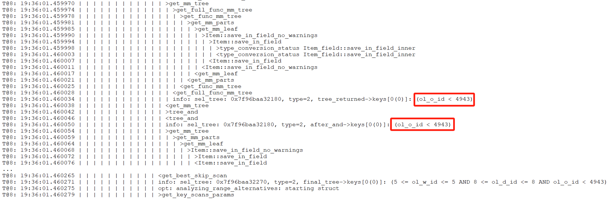

Figure 8-6. Debug trace information for the abnormal version.

Similarly, for the normal version, the relevant debug trace information is as follows:


Figure 8-7. Debug trace information for the normal version.

Comparing the two figures above, it is noticeable that the normal version includes additional content within the green box, indicating that conditions are applied in the normal version, whereas the abnormal version lacks these conditions. To understand why the abnormal version is missing these conditions, it is necessary to add additional trace information in the *get_full_func_mm_tree* function to capture specific details about the cause of this difference.

After adding extra trace information, the debug trace result for the abnormal version is as follows:


Figure 8-8. Supplementary debug trace information for the abnormal version.

The debug trace result for the normal version is as follows:


Figure 8-9. Supplementary debug trace information for the normal version.

Upon comparing the two figures above, significant differences are observed. In the normal version, the value of *param_comp* is 16140901064495857660, while in the abnormal version, it is 16140901064495857661, differing by 1. To understand this discrepancy, let's first examine how the *param_comp* value is calculated, as detailed in the following code snippet:

```c++
static SEL_TREE *get_full_func_mm_tree(THD *thd, RANGE_OPT_PARAM *param,
                                       table_map prev_tables,
                                       table_map read_tables,
                                       table_map current_table,
                                       bool remove_jump_scans, Item *predicand,
                                       Item_func *op, Item *value, bool inv) {
  SEL_TREE *tree = nullptr;
  SEL_TREE *ftree = nullptr;
  const table_map param_comp = ~(prev_tables | read_tables | current_table);
  DBUG_TRACE;
  ...
```

From the code, it’s evident that *param_comp* is calculated using a bitwise OR operation on three variables, followed by a bitwise NOT operation. The difference of 1 suggests that at least one of these variables differs, helping to narrow down the problem.

The calculation involves three *table_map* variables with lengthy values, making ordinary calculators insufficient and the process too complex to detail here.

The key point is that debug tracing revealed critical differences. Coupled with the information provided by identifying the Git commit responsible for the performance discrepancy, analyzing the root cause is no longer difficult.

Here is the final fix patch, detailed as follows:


Figure 8-10. Final patch for solving performance degradation in query execution plans.

When calling the *test_quick_select* function, reintroduce the *const_table* and *read_tables* variables (related to the previously discussed variables). This ensures that filtering conditions in the execution plan are not overlooked.

After applying the above patch to MySQL 8.0.27, the performance degradation problem was solved. A test comparing TPC-C throughput at various concurrency levels, both before and after applying the patch, was conducted. Specific details are shown in the following figure:


Figure 8-11. Effects of the patch on solving performance degradation.

From the figure, it is evident that after applying the patch, throughput and peak performance have significantly improved under low concurrency conditions. However, under high concurrency conditions, throughput not only failed to increase but actually decreased, likely due to scalability bottlenecks in MVCC ReadView.

After addressing the MVCC ReadView scalability problem, reassess the impact of this patch, as detailed in the figure below:


Figure 8-12. Actual effects of the patch after addressing the MVCC ReadView scalability problem.

From the figure, it is evident that this patch has significantly improved MySQL's throughput. This case demonstrates that scalability problems can disrupt certain optimizations. To scientifically assess the effectiveness of an optimization, it is essential to address most scalability problems beforehand to achieve a more accurate evaluation.

Finally, let's examine the results of the long-term stability testing for TPC-C. The following figure shows the results of an 8-hour test under 100 concurrency, with throughput captured at various hours (where 1 ≤ n ≤ 8).


Figure 8-13. Comparison of stability tests: MySQL 8.0.27 vs. improved MySQL 8.0.27.

From the figure, it is evident that after applying the patch, the rate of throughput decline has been significantly mitigated. The MySQL 8.0.27 version experienced a dramatic throughput decline, failing to meet the stability requirements of TPC-C testing. However, after applying the patch, MySQL's performance returned to normal.

Addressing this problem directly presents considerable challenges, particularly for MySQL developers unfamiliar with query execution plans. Using logical reasoning and a systematic approach to identify and address code differences before and after the problem arose is a more elegant problem-solving method, though it is complex.

It is noteworthy that no regression testing problems were encountered after applying the patch, demonstrating high stability and providing a solid foundation for future performance improvements. Currently, MySQL 8.0.38 still hasn't solved this problem, suggesting potential shortcomings in MySQL's testing system. Given the complexity of MySQL databases, users should exercise caution when upgrading and consider using tools like TCPCopy [60] to avoid potential regression testing problems.

### 8.1.2 Improving Binlog Group Commit Scalability

The binlog group commit mechanism is quite complex, and this complexity makes it challenging to identify its inherent performance problems.

First, capture performance problems during the TPC-C test with 500 concurrency using the *perf* tool, as shown in the following figure:


Figure 8-14. *_pthread_mutex_con_lock* bottleneck reveals performance problems.

It is evident that *_pthread_mutex_con_lock* is a significant bottleneck, accounting for approximately 9.5% of the overhead. Although *perf* does not directly pinpoint the exact problem, it indicates the presence of this bottleneck.

To address the problem, an in-depth exploration of MySQL internals was conducted to uncover the factors contributing to this performance bottleneck. A conventional binary search approach with minimal logging was used to identify functions or code segments that incur significant overhead during execution. The minimal logging approach was chosen to reduce performance interference while diagnosing the root cause of the problem. Excessive logging can disrupt performance analysis, and while some may use MySQL's internal mechanisms for troubleshooting, these often introduce substantial performance overhead themselves.

After thorough investigation, the bottleneck was identified within the following code segment.

```c++
  /*
    If the queue was not empty, we're a follower and wait for the
    leader to process the queue. If we were holding a mutex, we have
    to release it before going to sleep.
  */
  if (!leader) {
    CONDITIONAL_SYNC_POINT_FOR_TIMESTAMP("before_follower_wait");
    mysql_mutex_lock(&m_lock_done);
    ... 
    ulonglong start_wait_time = my_micro_time();
    while (thd->tx_commit_pending) {
      if (stage == COMMIT_ORDER_FLUSH_STAGE) {
        mysql_cond_wait(&m_stage_cond_commit_order, &m_lock_done);
      } else {
        mysql_cond_wait(&m_stage_cond_binlog, &m_lock_done);
      }
    }
    ulonglong end_wait_time = my_micro_time();
    ulonglong wait_time = end_wait_time - start_wait_time;
    if (wait_time > 100000) {
        fprintf(stderr, "wait too long:%llu\n", wait_time);
    }
    mysql_mutex_unlock(&m_lock_done);
    return false;
  }
```

Numerous occurrences of 'wait too long' output indicate that the bottleneck has been exposed. To investigate why 'wait too long' is being reported, the logs were added and modified accordingly. See the specific code below:

```c++
 /*
    If the queue was not empty, we're a follower and wait for the
    leader to process the queue. If we were holding a mutex, we have
    to release it before going to sleep.
  */
  if (!leader) {
    CONDITIONAL_SYNC_POINT_FOR_TIMESTAMP("before_follower_wait");
    mysql_mutex_lock(&m_lock_done);
    ...
    ulonglong start_wait_time = my_micro_time();
    while (thd->tx_commit_pending) {
      if (stage == COMMIT_ORDER_FLUSH_STAGE) {
        mysql_cond_wait(&m_stage_cond_commit_order, &m_lock_done);
      } else {
        mysql_cond_wait(&m_stage_cond_binlog, &m_lock_done);
      }
      fprintf(stderr, "wake up thread:%p,total wait time:%llu, stage:%d\n",
              thd, my_micro_time() - start_wait_time, stage);
    }
    ulonglong end_wait_time = my_micro_time();
    ulonglong wait_time = end_wait_time - start_wait_time;
    if (wait_time > 100000) {
        fprintf(stderr, "wait too long:%llu for thread:%p\n", wait_time, thd);
    }
    mysql_mutex_unlock(&m_lock_done);
    return false;
  }
```

 After another round of testing, a peculiar phenomenon was observed: when 'wait too long' messages appeared, the 'wake up thread' logs showed that many user threads were awakened multiple times.

The problem was traced to the *thd->tx_commit_pending* value not changing, causing threads to repeatedly re-enter the wait process. Further inspection reveals the conditions under which this variable becomes false, as illustrated in the following code:

```c++
void Commit_stage_manager::signal_done(THD *queue, StageID stage) {
  mysql_mutex_lock(&m_lock_done);
  for (THD *thd = queue; thd; thd = thd->next_to_commit) {
    thd->tx_commit_pending = false;
    thd->rpl_thd_ctx.binlog_group_commit_ctx().reset();
  }
  /* if thread belong to commit order wake only commit order queue threads */
  if (stage == COMMIT_ORDER_FLUSH_STAGE)
    mysql_cond_broadcast(&m_stage_cond_commit_order);
  else
    mysql_cond_broadcast(&m_stage_cond_binlog);
  mysql_mutex_unlock(&m_lock_done);
}
```

From the code, it is evident that *thd->tx_commit_pending* is set to false in the *signal_done* function. The *mysql_cond_broadcast* function then activates all waiting threads, leading to a situation similar to a thundering herd problem. When all previously waiting user threads are activated, they check if tx_commit_pending has been set to false. If it has, they proceed with processing; otherwise, they continue waiting.

Despite the complexity of the binlog group commit mechanism, a straightforward analysis identifies the root cause: threads that should not be activated are being triggered, leading to unnecessary context switches with each activation.

During one test, additional statistics were collected on the number of times user threads entered the wait state. The details are shown in the following figure:


Figure 8-15. Statistics of threads activated 1, 2, 3 times.

Waiting once is normal and indicates 100% efficiency. Waiting twice suggests 50% efficiency, and waiting three times indicates 33.3% efficiency. Based on the figure, the overall activation efficiency is calculated to be 52.7%.

To solve this problem, an ideal solution would be a multicast activation mechanism with 100% efficiency, where user threads with tx_commit_pending set to false are activated together. However, implementing this requires a deep understanding of the complex logic behind binlog group commit.

In this case, a point-to-point activation mechanism is used, achieving 100% efficiency but introducing significant system call overhead. The following figure illustrates the relationship between TPC-C throughput and concurrency before and after optimization.


Figure 8-16. Impact of group commit optimization with innodb_thread_concurrency=128.

From the figure, it is evident that with innodb_thread_concurrency=128, the optimization of binlog group commit significantly improves throughput under high concurrency.

It's important to note that this optimization's effectiveness can vary depending on factors such as configuration settings and specific scenarios. However, overall, it notably improves throughput, especially in high concurrency conditions.

Below is the comparison of TPC-C throughput and concurrency before and after optimization using standard configurations:


Figure 8-17. Impact of group commit optimization using standard configurations.

From the figure, it is clear that this optimization is less pronounced compared to the previous one, but it still shows overall improvement. Extensive testing indicates that the worse the scalability of MySQL, the more significant the effectiveness of binlog group commit optimization.

At the same time, the previously identified bottleneck of *_pthread_mutex_con_lock* has been significantly alleviated after optimization, as shown in the following figure:


Figure 8-18. Mitigation of *_pthread_mutex_con_lock* bottleneck.

In summary, this optimization helps address scalability problems associated with binlog group commit.

## 8.2 Enhancing the InnoDB Storage Engine

### 8.2.1 MVCC ReadView: Identified Problems

A key component of any MVCC scheme is the mechanism for quickly determining which tuples are visible to which transactions. A transaction's snapshot is created by building a ReadView (RV) vector that holds the TXIDs of all concurrent transactions smaller than the transaction's TXID. The cost of acquiring a snapshot increases linearly with the number of concurrent transactions, even if the transaction only reads tuples written by a single committed transaction, highlighting a known scalability limitation [7].

After understanding the scalability problems with the MVCC ReadView mechanism, let's examine how MySQL implements MVCC ReadView. Under the Read Committed isolation level, during the process of reading data, the InnoDB storage engine triggers the acquisition of the ReadView. A screenshot of part of the ReadView data structure is shown below:

```c++
private:
  // Disable copying
  ReadView(const ReadView &);
  ReadView &operator=(const ReadView &);
private:
  /** The read should not see any transaction with trx id >= this
  value. In other words, this is the "high water mark". */
  trx_id_t m_low_limit_id;
  /** The read should see all trx ids which are strictly
  smaller (<) than this value.  In other words, this is the
  low water mark". */
  trx_id_t m_up_limit_id;
  /** trx id of creating transaction, set to TRX_ID_MAX for free
  views. */
  trx_id_t m_creator_trx_id;
  /** Set of RW transactions that was active when this snapshot
  was taken */
  ids_t m_ids;
  /** The view does not need to see the undo logs for transactions
  whose transaction number is strictly smaller (<) than this value:
  they can be removed in purge if not needed by other views */
  trx_id_t m_low_limit_no;
  ...
```

Here, *m_ids* is a data structure of type *ids_t*, which closely resembles *std::vector*. See the specific explanation below:

```c++
  /** This is similar to a std::vector but it is not a drop
  in replacement. It is specific to ReadView. */
  class ids_t {
    typedef trx_ids_t::value_type;
    /**
    Constructor */
    ids_t() : m_ptr(), m_size(), m_reserved() {}
    /**
    Destructor */
    ~ids_t() { ut::delete_arr(m_ptr); }
    /** Try and increase the size of the array. Old elements are copied across.
    It is a no-op if n is < current size.
    @param n            Make space for n elements */
    void reserve(ulint n);
    ...
```

Algorithm for MVCC ReadView visibility determination, specifically refer to the *changes_visible* function below:

```c++
  /** Check whether the changes by id are visible.
  @param[in]    id      transaction id to check against the view
  @param[in]    name    table name
  @return whether the view sees the modifications of id. */
  [[nodiscard]] bool changes_visible(trx_id_t id,
                                     const table_name_t &name) const {
    ut_ad(id > 0);
    if (id < m_up_limit_id || id == m_creator_trx_id) {
      return (true);
    }
    check_trx_id_sanity(id, name);
    if (id >= m_low_limit_id) {
      return (false);
    } else if (m_ids.empty()) {
      return (true);
    }
    const ids_t::value_type *p = m_ids.data();
    return (!std::binary_search(p, p + m_ids.size(), id));
 }
```

From the code, it can be seen that the visibility algorithm works efficiently when concurrency is low. However, as concurrency increases, the efficiency of using binary search to determine visibility significantly decreases, particularly in NUMA environments.

### 8.2.2 Solutions for Enhancing MVCC ReadView Scalability

There are two fundamental approaches to improving scalability here [58]:

*First, finding an algorithm that improves the complexity, so that each additional connection does not increase the snapshot computation costs linearly.*

*Second, perform less work for each connection, hopefully reducing the total time taken so much that even at high connection counts the total time is still small enough to not matter much (i.e. reduce the constant factor).*

For the first solution, adopting a multi-version visibility algorithm based on Commit Sequence Numbers (CSN) offers benefits [7]: *the cost of taking snapshots can be reduced by converting snapshots into CSNs instead of maintaining a transaction ID list.* Specifically, under the Read Committed isolation level, there's no need to replicate an active transaction list for each read operation, thereby improving scalability.

Considering the complexity of implementation, this book opts for the second solution, which directly modifies the MVCC ReadView data structure to mitigate MVCC ReadView scalability problems.

### 8.2.3 Improvements to the MVCC ReadView Data Structure

In the ReadView structure, the original approach used a vector to store the list of active transactions. Now, it has been changed to the following data structure:

```c++
class ReadView {
 ...
 private:
  // Disable copying
  ReadView &operator=(const ReadView &);
 public:
  bool skip_view_list{false};
 private:
  unsigned char top_active[MAX_TOP_ACTIVE_BYTES];
  trx_id_t m_short_min_id;
  trx_id_t m_short_max_id;
  bool m_has_short_actives;
  /** The read should not see any transaction with trx id >= this
  value. In other words, this is the "high water mark". */
  trx_id_t m_low_limit_id;
  /** The read should see all trx ids which are strictly
  smaller (<) than this value.  In other words, this is the low water mark". */
  trx_id_t m_up_limit_id;
  /** trx id of creating transaction, set to TRX_ID_MAX for free views. */
  trx_id_t m_creator_trx_id;
  /** Set of RW transactions that was active when this snapshot
  was taken */
  ids_t m_long_ids;
  ...
```

Furthermore, corresponding code modifications were made in the related interface functions, as changes to the data structure necessitate adjustments to the internal code within these functions.

This new MVCC ReadView data structure can be seen as a hybrid data structure, as shown in the following figure.


Figure 8-19. A new hybrid data structure suitable for active transaction list in MVCC ReadView.

For a more detailed explanation, please refer to Chapter 4.2.8 on hybrid data structures.

Typically, online transactions are short rather than long, and transaction IDs increase continuously. To leverage these characteristics, a hybrid data structure is used: a static array for consecutive short transaction IDs and a vector for long transactions. With a 2048-byte array, up to 16,384 consecutive active transaction IDs can be stored, each bit representing a transaction ID.

The minimum short transaction ID is used to differentiate between short and long transactions. IDs smaller than this minimum go into the long transaction vector, while IDs equal to or greater than it are placed in the short transaction array. For an ID in changes_visible, if it is below the minimum short transaction ID, a direct query is made to the vector, which is efficient due to the generally small number of long transactions. If the ID is equal to or above the minimum short transaction ID, a bitwise query is performed, with a time complexity of O(1), compared to the previous O(log n) complexity. This improvement enhances efficiency and reduces cache migration between NUMA nodes, as O(1) queries typically complete within a single CPU time slice.

In addition to the previously mentioned transformation, similar modifications were applied to the global transaction active list. The original data structure used for this list is shown in the following code snippet:

```c++
  /** Array of Read write transaction IDs for MVCC snapshot. A ReadView would
  take a snapshot of these transactions whose changes are not visible to it.
  We should remove transactions from the list before committing in memory and
  releasing locks to ensure right order of removal and consistent snapshot. */
  trx_ids_t rw_trx_ids;
```

Now it has been changed to the following data structure:

```c++
  /** Array of Read write transaction IDs for MVCC snapshot. A ReadView would
  take a snapshot of these transactions whose changes are not visible to it.
  We should remove transactions from the list before committing in memory and
  releasing locks to ensure right order of removal and consistent snapshot. */
  trx_ids_t long_rw_trx_ids;
  unsigned char short_rw_trx_ids_bitmap[MAX_SHORT_ACTIVE_BYTES];
  int short_rw_trx_valid_number;
  trx_id_t min_short_valid_id;
  trx_id_t max_short_valid_id
```

In the *short_rw_trx_ids_bitmap* structure, *MAX_SHORT_ACTIVE_BYTES* is set to 65536, theoretically accommodating up to 524,288 consecutive short transaction IDs. If the limit is exceeded, the oldest short transaction IDs are converted into long transactions and stored in *long_rw_trx_ids*. Global long and short transactions are distinguished by *min_short_valid_id*: IDs smaller than this value are treated as global long transactions, while IDs equal to or greater are considered global short transactions.

During the copying process from the global active transaction list, the *short_rw_trx_ids_bitmap* structure, which uses only one bit per transaction ID, allows for much higher copying efficiency compared to the native MySQL solution. For example, with 1000 active transactions, the native MySQL version would require copying at least 8000 bytes, whereas the optimized solution may only need a few hundred bytes. This results in a significant improvement in copying efficiency.

After implementing these modifications, performance comparison tests were conducted to evaluate the effectiveness of the MVCC ReadView optimization. The figure below shows a comparison of TPC-C throughput with varying concurrency levels, before and after modifying the MVCC ReadView data structure.


Figure 8-20. Performance comparison before and after adopting the new hybrid data structure in NUMA.

From the figure, it is evident that this transformation primarily optimized scalability and improved MySQL's peak throughput in NUMA environments. Further performance comparisons before and after optimization can be analyzed using tools like *perf*. Below is a screenshot from *perf* at 300 concurrency, prior to optimization:


Figure 8-21. Latch-related bottleneck observed in *perf* screenshot.

From the figure, it can be seen that the first two bottlenecks were significant, accounting for approximately 33% of the overhead. After optimization, the *perf* screenshot at 300 concurrency is as follows:


Figure 8-22. Significant alleviation of latch-related bottleneck.

After optimization, as shown in the screenshot above, the proportions of the previous top two bottlenecks have been significantly reduced.

Why does changing the MVCC ReadView data structure significantly enhance scalability? This is because accessing these structures involves acquiring a global latch. Optimizing the data structure accelerates access to critical resources, reducing concurrency conflicts and minimizing cache migration across NUMA nodes.

The native MVCC ReadView uses a vector to store the list of active transactions. In high-concurrency scenarios, this list can become large, leading to a larger working set. In NUMA environments, both querying and replication can become slower, potentially causing a single CPU time slice to miss its deadline and resulting in significant context-switching costs. The theoretical basis for this aspect is as follows [21]:

*Context-switches that occur in the middle of a logical operation evict a possibly larger working set from the cache. When the suspended thread resumes execution, it wastes time restoring the evicted working set.*

Throughput improvement under the ARM architecture is evaluated next. Details are shown in the following figure:


Figure 8-23. Throughput improvement under the ARM architecture.

From the figure, it is evident that there is also a significant improvement under the ARM architecture. Extensive test data confirms that the MVCC ReadView optimization yields clear benefits in NUMA environments, regardless of whether the architecture is ARM or x86.

How much improvement can this optimization achieve in a SMP environment?


Figure 8-24. Performance comparison before and after adopting the new hybrid data structure in SMP.

From the figure, it can be observed that after binding to NUMA node 0, the improvement from the MVCC ReadView optimization is not significant. This suggests that the optimization primarily enhances scalability in NUMA architectures.

In practical MySQL usage, preventing excessive user threads from entering the InnoDB storage engine can significantly reduce the size of the global active transaction list. This transaction throttling mechanism complements the MVCC ReadView optimization effectively, improving overall performance. Combined with double latch avoidance, discussed in the next section, the TPC-C test results in the following figure clearly demonstrate these improvements.


Figure 8-25. Maximum TPC-C throughput in BenchmarkSQL with transaction throttling mechanisms.

### 8.2.4 Avoiding Double Latch Problems

During testing after the MVCC ReadView optimization, a noticeable decline in throughput was observed under extremely high concurrency conditions. The specific details are shown in the following figure:


Figure 8-26. Performance degradation at concurrency Levels exceeding 500.

From the figure, it can be seen that throughput significantly decreases once concurrency exceeds 500. The problem was traced to frequent acquisitions of the *trx-sys* latch, as shown in the code snippet below:

```c++
    } else if (trx->isolation_level <= TRX_ISO_READ_COMMITTED &&
               MVCC::is_view_active(trx->read_view)) {
      mutex_enter(&trx_sys->mutex);
      trx_sys->mvcc->view_close(trx->read_view, true);
      mutex_exit(&trx_sys->mutex);
    }
```

The other code snippet is shown below:

```c++
  if (lock_type != TL_IGNORE && trx->n_mysql_tables_in_use == 0) {
    trx->isolation_level =
        innobase_trx_map_isolation_level(thd_get_trx_isolation(thd));
    if (trx->isolation_level <= TRX_ISO_READ_COMMITTED &&
        MVCC::is_view_active(trx->read_view)) {
      /* At low transaction isolation levels we let
      each consistent read set its own snapshot */
      mutex_enter(&trx_sys->mutex);
      trx_sys->mvcc->view_close(trx->read_view, true);
      mutex_exit(&trx_sys->mutex);
    }
  }
```

InnoDB introduces a global trx-sys latch during the view close process, impacting scalability under high concurrency. To address this, an attempt was made to remove the global latch. One of the modifications is shown in the code snippet below:

```c++
   } else if (trx->isolation_level <= TRX_ISO_READ_COMMITTED &&
               MVCC::is_view_active(trx->read_view)) {
      trx_sys->mvcc->view_close(trx->read_view, false);
}
```

The other modification is shown in the code snippet below:

```c++
  if (lock_type != TL_IGNORE && trx->n_mysql_tables_in_use == 0) {
    trx->isolation_level =
        innobase_trx_map_isolation_level(thd_get_trx_isolation(thd));
    if (trx->isolation_level <= TRX_ISO_READ_COMMITTED &&
        MVCC::is_view_active(trx->read_view)) {
      /* At low transaction isolation levels we let
      each consistent read set its own snapshot */
      trx_sys->mvcc->view_close(trx->read_view, false);
    }
  }
```

Using the MVCC ReadView optimized version, compare TPC-C throughput before and after the modifications. Details are shown in the following figure:


Figure 8-27. Performance improvement after eliminating the double latch bottleneck.

From the figure, it is evident that the modifications significantly improved scalability under high-concurrency conditions. To understand the reasons for this improvement, let's use the *perf* tool for further investigation. Below is the *perf* screenshot at 2000 concurrency before the modifications:


Figure 8-28. Latch-related bottleneck observed in *perf* screenshot.

From the figure, it is evident that the latch-related bottlenecks are quite pronounced. After the code modifications, here is the *perf* screenshot at 3000 concurrency:


Figure 8-29. Significant alleviation of latch-related bottleneck.

Even with higher concurrency, such as 3000, the bottlenecks are not pronounced. This suggests that the optimizations have effectively alleviated the latch-related performance problems, improving scalability under extreme conditions.

Excluding the global latch before and after the *view_close* function call improves scalability, while including it severely degrades scalability under high concurrency. Although the *view_close* function operates efficiently within its critical section, frequent acquisition of the globally used trx-sys latch—employed throughout the trx-sys subsystem—leads to significant contention and head-of-line blocking, referred to as the 'double latch' problem. Notably, removing the latch from the final stage or using a new latch can significantly mitigate this problem.

### 8.2.5 Explaining the Super-Linear Performance Phenomenon

Section 2.1 describes super-linear scaling in throughput observed during SysBench read-write tests in an x86 NUMA environment. Following improvements to the InnoDB storage engine, the current investigation examines whether this super-linear scaling effect remains. Tests were conducted in the same environment using the improved version of MySQL. The results of individual SysBench tests for MySQL instance 1 and MySQL instance 2 are shown in the following figure:


Figure 8-30. Throughput of MySQL running separately after MVCC optimization.

The throughput for each instance has significantly improved, with MySQL instance 1 achieving 524,381 QPS and MySQL instance 2 reaching 553,008 QPS. Combined, they deliver 1,077,389 QPS, substantially surpassing the previous 328,168 QPS.

SysBench is used to simultaneously evaluate the read-write performance of these two instances, as illustrated in the figure below.


Figure 8-31. Throughput of MySQL running together after MVCC optimization.

From the figure, one instance achieves a throughput of 289,702 QPS while the other reaches 285,026 QPS. The combined throughput of both MySQL instances totals 574,728 QPS, closely aligning with the 546,429 QPS observed with the MySQL release version. This illustrates the Linux operating system's role in effectively scheduling multiple processes in NUMA environments.

From the data, it's evident that the total throughput of two MySQL instances running simultaneously is significantly lower than the throughput of each instance running individually. For detailed statistical comparisons, refer to the figure below:


Figure 8-32. Total throughput of running separately vs. running together after MVCC optimization.

After enhancements to the InnoDB storage engine, the super-linear scaling problem has been solved, revealing that the underlying cause in the MySQL release version was a poorly designed MVCC mechanism within InnoDB. This design flaw amplified problems in NUMA environments, resulting in the observed super-linear scaling effect.

## 8.3 Transaction Throttling Mechanism

According to the paper "Staring into the Abyss: An Evaluation of Concurrency Control with One Thousand Cores" [22], centralized databases, including MySQL, struggle to fully utilize hundreds of CPU cores.

To address scalability problems, traditional approaches use thread pools to restrict the number of CPU cores a database utilizes. This book introduces a transaction throttling mechanism that limits the number of threads accessing the transaction system, offering an alternative method to mitigate scalability challenges.

### 8.3.1 Percona Thread Pool

In general, a thread pool in traditional MySQL serves two main purposes:

1.  **Mitigating Short Connection Storms**: By managing and reusing threads, the thread pool helps prevent system overload during sudden spikes in short-lived connections.
2.  **Enhancing Scalability**: Thread pools improve scalability, particularly in high-contention scenarios, by enabling MySQL to more effectively utilize available CPU cores.

Using Percona's thread pool as a case study, let's examine the cost-effectiveness of thread pools in improving MySQL scalability. The following figure compares throughput and concurrency before and after implementing a thread pool with the improved version of MySQL.


Figure 8-33. Enabling the Percona thread pool led to a noticeable decrease in throughput.

From the figure, it is evident that throughput decreases after adopting the thread pool. This decline is attributed to the high inherent cost of the Percona thread pool. Moreover, with the improved version of MySQL already achieving significant scalability improvements, the additional benefits of the Percona thread pool in improving scalability for TPC-C applications are limited.

For MySQL versions with poor scalability, the thread pool remains valuable in addressing scalability problems. As demonstrated in Chapter 1, the use of the thread pool significantly alleviated scalability problems in MySQL 5.7.

Based on extensive testing, after solving most of MySQL's scalability problems, it was observed that while the Percona thread pool can still be effective in managing short-lived connections and high contention scenarios, its overall effectiveness diminishes and it may even hinder performance in other contexts.

### 8.3.2 Transaction Throttling Mechanism

Centralized databases struggle to fully utilize hundreds of CPU cores due to limitations in their transaction systems. To address this, transaction throttling mechanisms are becoming increasingly important.

MySQL has introduced a "Max Transaction Limit" feature in its thread pool to mitigate performance degradation [31]. This feature limits the number of concurrent transactions, improving throughput by reducing data locks and deadlocks on heavily loaded systems. This approach can inspire similar mechanisms that increase throughput in high-concurrency scenarios without relying solely on traditional thread pools.

For MySQL, the specific process figure for transaction throttling is as follows:


Figure 8-34. New transaction throttling mechanism In MySQL.

Before starting a new transaction, check if the number of concurrent transactions exceeds the limit. If it does, the transaction enters a waiting state. Otherwise, it proceeds into the transaction system. After a transaction completes execution, a user thread from the waiting list is activated to continue executing another transaction.

After implementing this transaction throttling mechanism, MySQL's scalability is validated. The following figure illustrates the relationship between TPC-C throughput and concurrency when using the throttling mechanism compared to using the Percona thread pool.


Figure 8-35. Impact of the transaction throttling mechanism.

From the figure, it can be seen that the throttling approach is superior to the Percona thread pool approach, and this superiority is comprehensive.

The following figure depicts the TPC-C scalability stress test conducted after implementing transaction throttling. The test was performed in a scenario with NUMA BIOS disabled, limiting entry of up to 512 user threads into the transaction system.


Figure 8-36. Maximum TPC-C throughput in BenchmarkSQL with transaction throttling mechanisms.

From the figure, it can be seen that throughput is more stable. This stability is primarily due to disabling NUMA in the BIOS, which improves memory access efficiency and enhances overall system stability.

However, transaction throttling is not a panacea and has its limitations:

-   When the maximum number of transactions are executing concurrently, new transactions must wait until existing transactions are completed. If all concurrent transactions consist of long-running queries, it may appear as if the MySQL system is stalled [31].

It's worth noting that the specifics of how transaction throttling is implemented, and its flexibility, are areas where AI can demonstrate its usefulness.

# Chapter 9: Major Enhancements in Group Replication

## 9.1 Major Design Flaws in Group Replication

Group Replication was initially designed before SSDs became widely adopted. Introducing I/O operations at the Paxos layer could significantly impact performance, so the initial design did not consider persisting Paxos logs to disk.

Group Replication adopted a conflict detection method based on certification databases to achieve concurrent control in distributed environments, aiming to support write operations on any MySQL node. This approach overlooked the inherent characteristics of single-node writes in MySQL, resulting in Group Replication's single-primary throughput being inferior to semisynchronous replication.

In designing Group Replication for multi-primary scenarios, strict adherence to the principles of state machine replication, where the operation sequence should be consistent across all nodes, was not strictly followed. This led to eventual inconsistency problems in some scenarios with Group Replication's multi-primary setup.

When a MySQL secondary replay gets stuck or its I/O storage fills up, eventually all Group Replication nodes will be affected, with the possibility of most nodes experiencing Out Of Memory (OOM) problems. While Group Replication aims to solve high availability problems, it should also ensure its own high availability, preventing the entire cluster from becoming unavailable due to problems with a single MySQL secondary.

These design flaws are typically only effectively discovered through exposure to problems. Group Replication's logic is highly complex, making it challenging to directly identify problems from the code alone.

### 9.1.1 Lack of Durability: Paxos Not Committed to Disk

Below is Meta company engineers' view on Group Replication [42]:

*Another significant and deliberate choice was to not use Group Replication offered by MySQL 5.7 onwards. While there are significant advancements offered by the protocol (such as the multi-primary mode), using Group Replication in our deployment presented significant challenges. It is based on a variant of Paxos which does not use a persistent log. Entries are written to the log only after they are considered committed via in-memory consensus rounds. The leader election algorithm is local and deterministic. It also doesn’t consider lag when choosing a new leader and brief network blips trigger a computationally expensive recovery algorithm. This option could have worked but not without excessive engineering effort to fix the drawbacks.*

The main problem with Group Replication, as outlined in the above content, is the lack of persistence in Paxos messages. The initial design background includes:

1.  Suboptimal SSD hardware performance.
2.  Paxos log persistence not meeting the requirements for Group Replication with multiple primaries.

    Without persistent storage in certification databases, Group Replication cannot use Paxos message persistence for crash recovery. After MySQL restarts, there is no corresponding certification database, making continued processing of persisted Paxos messages prone to inconsistent states.

Based on Group Replication single-primary mode using SSDs, SysBench write-only tests were used to examine the impact of adding Paxos persistence on throughput. Please refer to the specific figure below:


Figure 9-1. Performance overhead of Paxos log persistence in SysBench write-only tests.

From the figure, it can be seen that after adding Paxos persistence, there is a slight decrease in performance under low concurrency, which is an expected result. However, under high concurrency, the difference is not significant. This is because, under high concurrency, Paxos uses a batching mechanism that allows multiple transaction records to be logged into the Paxos instance together, thereby reducing I/O pressure.

Next, let's examine the comparative response times.


Figure 9-2. After adding Paxos log persistence, the average response time in SysBench write-only tests increased.

The figure shows response times for 50 to 200 concurrent scenarios. The increase in average response time with Paxos log persistence is acceptable. SysBench write-only tests stress Group Replication significantly, while TPC-C tests, due to their read operations, reduce the write pressure on Group Replication. For comparisons based on Group Replication in single-primary mode, using SSDs, and BenchmarkSQL for TPC-C throughput at various concurrency levels, please refer to the figure below.


Figure 9-3. Performance overhead of Paxos log persistence in BenchmarkSQL tests.

The figure shows that, at low concurrency levels, the version with Paxos log persistence has slightly lower throughput, though the impact is much smaller compared to SysBench write-only tests. Based on the results of the various tests, it can be concluded that, under current SSD hardware conditions, employing Paxos log persistence is a viable solution.

### 9.1.2 Applying the Barrel Principle to Certification Databases

Conflict detection using the certification database is part of Optimistic Concurrency Control (OCC). OCC allows multiple transactions to read and update data concurrently without blocking, by maintaining transaction histories and checking for conflicts before committing. If conflicts are detected, one of the transactions is rolled back. While OCC avoids lock waits, it can incur significant penalties during actual conflicts, similar to two-phase locking (2PL), but with rollbacks instead of lock waits. OCC performs well with infrequent conflicts but suffers from excessive rollbacks and retries when conflicts are frequent, making it less effective in such scenarios [59].

In multi-primary Group Replication, each MySQL node can write independently, necessitating global concurrency control. MySQL uses the certification database for this, implementing OCC to decide transaction commits or rollbacks. However, in cases of severe write conflicts, OCC may result in numerous rollbacks, indicating its ineffectiveness in high-conflict scenarios.

Let's continue by examining the data structure used by the MySQL certification database:

```c++
typedef std::unordered_map<
      std::string, Gtid_set_ref *, std::hash<std::string>,
      std::equal_to<std::string>,
      Malloc_allocator<std::pair<const std::string, Gtid_set_ref *>>>
      Certification_info;
  ...
  /**
    Certification database.
  */
  Certification_info certification_info;
```

The certification database uses an *unordered_map* from the C++ Standard Template Library (STD), which is a hash table. This database stores information about transaction write operations, where each key is a base64-encoded string representing a row, and each value contains the GTID and related information used for replay calculations. The following code demonstrates how to insert a row into the certification database.

```c++
bool Certifier::add_item(const char *item, Gtid_set_ref *snapshot_version,
                         int64 *item_previous_sequence_number) {
  DBUG_TRACE;
  mysql_mutex_assert_owner(&LOCK_certification_info);
  bool error = true;
  std::string key(item);
  Certification_info::iterator it = certification_info.find(key);
  snapshot_version->link();
  if (it == certification_info.end()) {
    std::pair<Certification_info::iterator, bool> ret =
        certification_info.insert(
            std::pair<std::string, Gtid_set_ref *>(key, snapshot_version));
    error = !ret.second;
  } else {
    *item_previous_sequence_number =
        it->second->get_parallel_applier_sequence_number();
    if (it->second->unlink() == 0) delete it->second;
    it->second = snapshot_version;
    error = false;
  }
  ...
  return error;
}
```

As updates become more frequent, the certification database grows larger. To promptly clean up outdated information, Group Replication uses a barrel principle. For instance, if the slowest node's executed GTID is A, then information in the certification database with GTIDs less than or equal to A can be cleaned up.

Next, review the *perf* screenshots taken during Group Replication operation below.


Figure 9-4. A bottleneck revealed in hash table operations.

The figure reveals a bottleneck in operating the hash table. Cleaning the certification database is akin to garbage collection; transactions must wait while this cleaning occurs, involving extensive memory deallocation. Queueing theory indicates that this latency significantly impacts transaction processing speed. The figure below illustrates the relationship between throughput and concurrency for Group Replication and semisynchronous replication.


Figure 9-5. Performance comparison between semisynchronous replication and Group Replication.

The figure shows that the peak throughput of Group Replication is lower than that of semisynchronous replication.

What kind of Group Replication do users need? Given that Group Replication is designed for high availability services, its high availability features should not significantly impact performance. Users expect Group Replication to provide true high availability while also offering better performance compared to semisynchronous replication.

### 9.1.3 Lack of Strict Adherence to State Machine Replication Mechanisms

A well-known method for implementing fault-tolerant distributed systems with strong consistency is state-machine replication. This technique orders and propagates operations to all servers, which then execute them sequentially. All copies of the state machine start from the same initial state, transition through the same succession of states, and produce the same sequence of outputs. State-machine replication ensures strong consistency among replicas, enabling a distributed service to appear as a coherent, centralized service while retaining distributed advantages.

The key to state-machine replication is that all copies start from the same initial state, transition through the same states, and produce the same outputs [41]. Any deviation from this rule is non-compliant and difficult to detect, often only revealing problems in corner cases. All nodes must execute in the same sequence, with identical transactions and underlying data.

In the Group Replication multi-primary architecture, a rule violation occurs: *CT_CERTIFICATION_MESSAGE* messages are not placed into the applier queue, leading to a non-uniform processing order. Below is the function *handle_certifier_data* that prematurely processes *CT_CERTIFICATION_MESSAGE* messages.

```c++
void Plugin_gcs_events_handler::handle_certifier_message(
    const Gcs_message &message) const {
  if (this->applier_module == nullptr) {
    LogPluginErr(ERROR_LEVEL,
                 ER_GRP_RPL_MISSING_GRP_RPL_APPLIER); /* purecov: inspected */
    return;                                           /* purecov: inspected */
  }
  Certifier_interface *certifier =
      this->applier_module->get_certification_handler()->get_certifier();
  const unsigned char *payload_data = nullptr;
  size_t payload_size = 0;
  Plugin_gcs_message::get_first_payload_item_raw_data(
      message.get_message_data().get_payload(), &payload_data, &payload_size);
  if (certifier->handle_certifier_data(payload_data,
                                       static_cast<ulong>(payload_size),
                                       message.get_origin())) {
    LogPluginErr(
        ERROR_LEVEL,
        ER_GRP_RPL_CERTIFIER_MSSG_PROCESS_ERROR); /* purecov: inspected */
  }
}
```

Handling *CT_CERTIFICATION_MESSAGE* messages prematurely can lead to inconsistencies in the certification database data that different nodes' OCC rely on, potentially resulting in eventual data inconsistencies. While this problem may not be easy to detect, it is relatively straightforward to reproduce under specific conditions.

The specific details of reproduction are as follows: in a Group Replication multi-primary scenario, distribute write pressure evenly across all MySQL nodes using a load balancer (such as LVS). Given sufficient write conflicts, it is possible to reproduce inconsistencies in the final state of state machine replication.

Based on extensive testing, placing certification messages into the applier queue for unified processing can eliminate the aforementioned data inconsistency problem.

### 9.1.4 Group Replication Lacks Built-in High Availability

Group Replication can face collective failure scenarios in the following situations:

1.  If the I/O space of a MySQL secondary becomes full, causing replay to block, it can trigger a cascade effect across the cluster.
2.  If replay stops on a MySQL secondary for any reason, effectively reducing its throughput to zero, the overall throughput of the cluster eventually drops to zero, according to the barrel principle.

Group Replication is designed for high availability, but these problems can make the entire cluster system unavailable. Therefore, addressing the high availability problems inherent to Group Replication is essential to provide users with better high availability.

## 9.2 The Problems with Paxos Variant Algorithms

### 9.2.1 Why Hasn't the Raft Protocol Been Adopted?

Raft is a consensus algorithm equivalent to Multi-Paxos in fault tolerance and performance. Designed to improve understandability, Raft is described in detail to meet practical system needs. Unlike Paxos, Raft reduces state space and divides consensus into leader election, log replication, and safety phases. It achieves consensus through an elected leader and is not Byzantine fault-tolerant. Only servers with the most up-to-date data can become leaders, and it includes a mechanism for changing cluster membership using overlapping majorities to ensure safety [42].

When designing Group Replication, the goal was to support both single-primary and multi-primary modes. Adopting Raft or Multi-Paxos protocols wouldn't effectively support Group Replication's multi-primary mode. Hence, a variant of Paxos with multiple leaders, the Mencius algorithm, was chosen.

### 9.2.2 The Problems with Implementing Mencius in Group Replication

Group Replication employs Mencius, a multi-leader state machine replication protocol derived from Paxos, at its core. Mencius is novel in that it not only partitions sequence numbers but also addresses key performance problems like adapting to changing client loads and asymmetric network bandwidth.

Mencius achieves this by using a simplified version of consensus called simple consensus. This allows servers with low client load to skip their turns without needing majority agreement. By opportunistically piggybacking SKIP messages on other messages, Mencius enables servers to skip turns with minimal communication and computation overhead, allowing it to efficiently adapt to client and network load variance [32].

Unfortunately, Group Replication did not adhere to the above design. The cost of waiting for SKIP information remains significant, leading to Group Replication experiencing potential throughput fluctuations and longer-than-expected response times, especially in cross-datacenter deployment scenarios.

### 9.2.3 Why Add Its Own Implementation of Multi-Paxos?

Given that MySQL introduced a new Multi-Paxos algorithm in addition to the existing Mencius algorithm, this indicates either an inadequacy in the Mencius implementation or inherent problems with the Mencius algorithm itself.

Regarding the Mencius algorithm, the following aspects are particularly noteworthy [32]:

*By opportunistically piggybacking SKIP messages on other messages, Mencius allows servers to skip turns with little or no communication and computation overhead. This allows Mencius to adapt inexpensively to client and network load variance.*

It can be inferred that the Mencius algorithm performs well even under severe leader imbalance, as both theoretical validation and practical evidence support this. Therefore, the problems are likely due to an inadequate implementation of the Mencius algorithm.

When there are no theoretical problems with the Mencius algorithm, introducing a new Multi-Paxos algorithm is not an elegant solution and brings several challenges:

1.  **High Maintenance Cost**: Maintaining and testing two sets of codebases doubles the workload for this part.
2.  **Regression Testing Challenges**: In practice, the new algorithm has led to several regression problems, some of which are difficult to address.
3.  **Partial Problem-Solving**: The new algorithm may only partially address the requirements. In Group Replication’s single-primary mode, it might not be universally applicable, as consistent read and write operations require all nodes to continuously communicate information.

## 9.3 The Specific Implementation of Paxos Skip Optimization

First, let’s investigate the performance problems of the MySQL Mencius algorithm implementation. The following figure illustrates the network interaction status when the Mencius algorithm operates stably with a network delay of 10ms:


Figure 9-6. Insights into the Mencius protocol from packet capture data.

The green box in the figure indicates that the time interval between two consecutive Paxos instances reached 24ms. This suggests that the Mencius algorithm in MySQL is not aligned with a single Round-trip Time (RTT) in its implementation.

Next, let’s refer to the Mencius algorithm paper *"State Machine Replication for Wide Area Networks"* [54]. The specific details of the network testing environment are as follows:


From the green box, it is evident that the network latency tested in the paper is RTT=100ms. Let’s now examine the relevant information on Paxos processing provided in the paper.


Figure 9-7. Consensus mechanism of the Mencius protocol as indicated in the Mencius paper.

Based on the figure, it can be inferred that if only one node generates a request, the Mencius protocol consensus requires 100ms, equivalent to one round-trip time (RTT). This indicates that from the Group Replication primary node's perspective, Mencius consensus can be achieved within a single RTT. With the theoretical feasibility clarified, the following discussion will focus on optimizing Group Replication's Mencius communication.

The theoretical basis for optimizing Mencius includes [32]:

*Skipping is the core technique that makes Mencius efficient.*

The specific Paxos network interaction diagram after Paxos skip optimization is shown in the following figure:


Figure 9-8. Mechanism of Paxos skip optimization.

When a Paxos node receives an *accept_op* message from the Paxos leader and has no messages to propose itself, it can include skip information when sending the *ack_accept_op* message. This informs other nodes that the current node will not propose any messages in this round. During normal stable operation, every *accept_op* message can be handled this way by Paxos nodes.

In the specific implementation, the impact of pipelining must also be considered. During the Paxos skip optimization process, it is necessary to record these skip actions to avoid interference between communications of different Paxos instances.

Finally, under a network delay scenario of 10ms, evaluating the effectiveness of Paxos skip optimization shows significant benefits. Here is a comparison of TPC-C throughput at different concurrency levels before and after Paxos skip optimization:


Figure 9-9. Impact of Paxos skip optimization on BenchmarkSQL tests with 10ms latency.

From the figure, it’s clear that Paxos skip optimization significantly improves performance with a 10ms network latency. Extensive TPC-C testing confirms that this optimization improves performance for Group Replication, whether using a single primary or multiple primaries, and supports consistent reads and writes.

Paxos skip optimization reduces code complexity by an order of magnitude compared to Multi-Paxos implementations with a single leader. It also minimizes regression testing problems and simplifies maintenance.

Overall, leveraging theoretical and logical solutions elegantly addresses this problem more effectively than the current native MySQL implementation.

## 9.4 Optimized Design for Using Group Replication in Single-Primary Mode

Based on the feasibility of Paxos log persistence, a design architecture for Group Replication single-primary mode could be structured as follows:


Figure 9-10. Redesigned Group Replication single-primary mode with Paxos log persistence.

When a transaction is committed, it undergoes Paxos communication, achieving consensus only after being persisted in the Paxos log. Once consensus is reached, the primary server proceeds with operations such as writing the transaction to the binary log and performing the commit. Meanwhile, secondary servers handle tasks like calculating the last_committed value for replay, writing transaction events to the relay log, and replaying transactions.

The need for secondary servers to calculate the last_committed value in Group Replication arises because the primary server has not reached the binlog stage before engaging in low-level Paxos communication. Thus, the last_committed value is not yet available. Secondary servers calculate the last_committed value from writeset information in the certification database, allowing Group Replication to achieve high parallel replay.

After MySQL secondaries calculate last_committed, the next step is to write transaction events to the relay log. To speed up writing to disk, batching technology should be used, with careful planning required for its implementation.

Enhancing replay speed is crucial for:

-   **Rapid Failover**: Faster replay ensures quicker failover.
-   **Improved Data Freshness**: Faster replay increases the chances of accessing the most current data.

With these aspects addressed, the design for Group Replication in single-primary mode is complete, laying the groundwork for a high-performance, highly available system with rapid failover and efficient state machine replication.

### 9.4.1 Paxos Log Persistence

The most critical foundation for Paxos log persistence feasibility [30]:

*In order to get additional throughput in a concurrent system, it is possible to batch a collection of values submitted by different application threads into a single Paxos instance.*

By using batching technology, multiple transactions can be grouped into a single Paxos instance. After reaching consensus, the transaction data can be written to disk together, significantly reducing I/O pressure. With advances in SSD technology, achieving state machine replication without data loss is entirely feasible.

### 9.4.2 Bypass Conflict Detection

Traditional certification databases use a lot of memory, especially when there is a speed mismatch between the primary and secondaries, leading to increased queue wait times due to extensive memory allocation and deallocation. In NUMA environments, frequent cross-NUMA memory allocation worsens performance.

In Group Replication single-primary mode, it is feasible to bypass conflict detection in the certification database. Conflict detection is mainly used in:

1.  Group Replication multi-primary mode.
2.  During a Group Replication single-primary switchover when the new primary is still replaying transactions while receiving new user requests.

For Group Replication in single-primary mode, only the second scenario needs to be considered, while mechanisms like 'before on primary failover' ensure the new primary completes transaction replay before accepting new requests. Accelerating the replay process on MySQL secondaries can help reduce user wait times.

### 9.4.3 Quickly Calculate the Required last_committed Value for Replay

First, let's clarify the terms "*sequence_number*" and "*last_committed*":

-   **sequence_number**: This is an automatically incremented value used to track the order of transactions during Group Replication operation. Each transaction is assigned a unique *sequence_number* during operation.
-   **last_committed**: This value indicates the sequence number of the last committed transaction that a new transaction depends on. For a transaction to proceed during replay on a MySQL secondary, the transaction must wait until the one with a *sequence_number* equal to *last_committed* has been fully replayed.

For example, in the transaction highlighted in the green box below, with *sequence_number=12759* and *last_committed=12757*, the *last_committed=12757* indicates that the transaction with *sequence_number=12759* must wait until the transaction with *sequence_number=12757* has been fully replayed before it can proceed.


Figure 9-11. Typical examples of *sequence_number* and *last_committed*.

Once *sequence_number* and *last_committed* are understood, the calculation of the *last_committed* value can be explored. Typically, this value is derived from the transaction's writeset, which details the rows modified by the transaction. Each row in the writeset is represented by a key corresponding to a table row. In the writeset:

-   For update operations, there are two elements with the same key.
-   For insert and delete operations, there is one element.
-   The writeset for DDL transactions is empty, indicating that DDL operations must be replayed serially.

In Group Replication, when processing a transaction's writeset, the applier thread examines the certification database for transactions that have modified the same records as those in the writeset. If such transactions are found, the applier thread determines the latest *sequence_number* that is smaller than the current transaction's *sequence_number*, which becomes the transaction's *last_committed* value. This ensures transactions are replayed in the correct order to maintain data consistency.

Before diving deeper into the analysis, let's review what the applier thread does:

1.  Calculating *last_committed* based on the certification database.
2.  Writing transaction events to the relay log file.

Below is a flame graph generated from capturing performance data of the applier thread:


Figure 9-12. Flame graph of performance data for the applier thread.

From the flame graph, it is evident that the *'add_item'* operation in the certification database consumes 29.80% of the computation time, with half of this time spent on hash table operations. The inefficiency of the hash table results in high CPU resource consumption for calculating last_committed, and delays in writing transaction events to disk.

To address this bottleneck and improve disk write performance, the hash table's overhead must be reduced. Since direct improvements to the hash table are challenging, a new data structure is necessary.

Based on the design of Group Replication in single-primary mode, a redesigned data structure has been developed to replace the previous hash table approach in the certification database. This new structure aims to eliminate delays in calculating last_committed and ensure timely writing of transaction events to disk. See the specific code below for the new data structure:

```c++
#define REPLAY_CAL_HASH_ITEMS (REPLAY_CAL_HASH_ITEM / 8)
#define MAX_RELATIVE_SEQUENCE_NUMBER 65535
#define REPLAY_CAL_ARRAY 65536
#define REPLAY_CAL_HASH_ITEM 4088
typedef struct {
  int number;
  int size;
  unsigned char values[REPLAY_CAL_HASH_ITEM];
} replay_cal_hash_item;

class Certifier : public Certifier_interface {
 ...
 private:
  replay_cal_hash_item replayed_cal_array[REPLAY_CAL_ARRAY];
 ...
```

To store the information necessary for calculating *last_committed*, a static array named *replayed_cal_array* is used. This array contains 65,536 elements, each representing a bucket slot with a *replay_cal_hash_item*. The *replay_cal_hash_item* structure includes:

-   **number**: Indicates the current count of elements within the *replay_cal_hash_item*, tracking how many elements are in use.
-   **size**: Specifies the maximum capacity of the *replay_cal_hash_item*, defining the upper limit of elements it can accommodate.
-   **values**: An array of 4,088 unsigned char elements that stores data.

The **values** member is used to store 511 entries, with each entry occupying 8 bytes. Each entry consists of:

-   **Key Value**: 6 byte.
-   **Relative Sequence Number**: 2 bytes.

For specific details, refer to the figure below:


Figure 9-13. A new data structure suitable for calculating last_committed.

The *key* undergoes base64 conversion into an 8-byte integer. This 8-byte integer is divided as follows:

-   **Index for replayed_cal_array**: The first two bytes serve as an index for the *replayed_cal_array*.
-   **Value**: The remaining six bytes are stored in the first six bytes of each 8-byte entry.

Regarding the storage of *sequence_number*:

-   Only the relative value of the *sequence_number* is stored, calculated as the current *sequence_number* minus a base sequence value.
-   Instead of requiring 8 bytes, this relative *sequence_number* needs only 2 bytes.
-   This 2-byte relative *sequence_number* is stored in the last two bytes of each 8-byte entry.

This setup optimizes storage by using a compact representation of the *key* and storing only the necessary relative *sequence_number*, ensuring efficient memory use within the *replay_cal_hash_item* structure.

The algorithm based on the new data structure is illustrated in the figure below, highlighting the following key points:

1.  Fully utilizes the characteristics of *keys* and the monotonic increase of *sequence* numbers, compressing storage space effectively, resulting in very high memory usage efficiency for the new data structure.
2.  Sets an upper limit on the stored information. Once the threshold is exceeded, a process similar to checkpointing is triggered, and the current transaction is set for serial replay.
3.  The content of the new data structure is relatively small, with a high cache hit rate. Moreover, within *replay_cal_hash_item*, the *values* are stored contiguously, making it very cache-friendly.


Figure 9-14. A new algorithm suitable for calculating last_committed.

It should be noted that the new data structure occupies a memory footprint of 256MB (65536 \* 4096 bytes), which is significantly smaller compared to the several gigabytes or even tens of gigabytes typically required by traditional certification databases during benchmarking. This modest memory usage lays a solid foundation for optimizing the performance of the entire applier thread.

After optimization, the applier thread has significantly accelerated its computation of the last_committed value, resulting in a considerable improvement in the overall processing speed of the applier thread. The following is a flame graph generated by capturing *perf* data of the applier thread using the improved version.


Figure 9-15. Flame graph of performance data for the applier thread after optimization.

From the graph, it can be observed that the CPU processing overhead for *Certifier::certify* has significantly reduced. Specifically, *quick_add_item* now accounts for only 12.85% of the overhead, whereas previously, when throughput was lower, *add_item* consumed 29.80%. This highlights a significant performance improvement achieved by adopting the new data structure.

Based on extensive TPC-C testing statistics, the following optimization conclusions can be drawn: Before optimization, the applier thread's disk throughput supported approximately 500,000 tpmC. After optimization, with more CPU time available to process disk writes, the applier thread's disk throughput now supports approximately 1,000,000 tpmC.

This improvement not only enhances the overall processing capability of the applier thread but also accelerates the cleaning of outdated writeset information. According to tests, each cleaning operation now takes milliseconds. As a result, it effectively mitigates the performance fluctuations inherent in native Group Replication, further improving stability.

From this case study, the reasons for performance improvement can be summarized as follows:

1.  **Static Array for Values**: Using a static array for *values* in *replay_cal_hash_item* enhances search efficiency due to contiguous memory access, making it very cache-friendly.
2.  **Reduced Data Storage**: The amount of stored data has been significantly reduced. Previously, it might have required gigabytes of storage, whereas now it only requires 256MB. Smaller memory footprints generally lead to higher efficiency.
3.  **Fixed Memory Space**: The allocated memory space is fixed and does not require dynamic allocation. Previous frequent memory allocations and deallocations were detrimental to high performance due to the synchronous nature of memory operations.
4.  **Efficient Certification Cleanup**: Certification cleanup can achieve millisecond-level performance. During certification cleanup, only zeroing operations are needed for the *number* values among the 65,536 *replay_cal_hash_item* items.

By implementing a better data structure based on Group Replication's single-primary mode to achieve the same last_committed calculation functionality, the applier thread's maximum processing capability can be significantly enhanced, and performance fluctuations can be eliminated.

### 9.4.4 Batch Write Mechanism for Relay logs

The transactional event logging to disk is one of the two main tasks of the applier thread. The efficiency of this logging directly impacts the usability of Group Replication. If the logging process is inefficient, the applier queue size will continuously increase according to queueing theory. Let's examine the optimized main process of the applier thread, as shown in the figure below:


Figure 9-16. The optimized main process of the applier thread.

The batch write mechanism refers to an improvement over the native MySQL version, where events were flushed to disk individually. Now, events from at least the same transaction are flushed together, significantly reducing the number of I/O flush operations. If the apply queue size exceeds a specified threshold, events from a batch of transactions are flushed together, further reducing the frequency of I/O flush calls.

The batch write mechanism, tested with TPC-C benchmarks, initially improved disk write speed from just over 200,000 tpmC to 500,000 tpmC. With further enhancements in last_committed replay calculations from the previous section, this speed can be pushed to around 1,000,000 tpmC, effectively solving problems related to excessive applier queue growth caused by delays in disk writes.

### 9.4.5 Comparing Performance with Traditional Group Replication

The figure below compares TPC-C throughput against concurrency levels in different modes. The deployment setup is as follows: Both MySQL primary and secondary are deployed on the same machine, with NUMA binding isolation to prevent computational interference. Separate SSDs are used for the primary and secondary to ensure no I/O operation interference.


Figure 9-17. Effects of the new Group Replication single-primary mode design.

From the figure, it is evident that the new Group Replication single-primary mode design comprehensively outperforms the traditional mode of Group Replication.

## 9.5 How to Mitigate Performance Fluctuations in Group Replication?

### 9.5.1 Enhancing the Fail Detection Mechanism

Accurately detecting node failure is challenging due to the FLP impossibility result, which states that consensus is impossible in a purely asynchronous system if even one process can fail. The difficulty arises because a server can't distinguish if another server has failed or is just "very slow" when it receives no messages [32]. Fortunately, most practical systems are not purely asynchronous, so the FLP result doesn't apply. To circumvent this, additional assumptions about system synchrony are made, allowing for the design of protocols that maintain safety and provide liveness under certain conditions. One common method is to use an inaccurate local failure detector.


Figure 9-18. The asynchronous message passing model borrowed from the Mencius paper.

The figure above illustrates the asynchronous message passing model. Each failure detector monitors servers and maintains a list of suspected faulty servers. These detectors can make mistakes, such as suspecting a running server has crashed. If later corrected, the server can be removed from the suspected list. Protocols using failure detectors must always ensure safety despite these errors and guarantee progress when the detectors remain accurate for long periods.

Group Replication's failure detection mechanism identifies and expels non-communicating members. This increases the likelihood of the group containing a majority of functioning members, ensuring correct client request processing. All group members regularly exchange messages. If a member doesn't receive messages from another for 5 seconds, it suspects that member. If suspicion is not solved, the member is expelled. The expelled member remains unaware of its status and sees other members as unreachable. If it reconnects, it learns of its expulsion through an updated membership view.

After understanding the above content, let's analyze common types of view change events:

1.  **Node is Killed**

    In a Linux system, when a node is killed, the TCP layer typically sends a reset (RST) packet to notify other nodes of the connection problem. Paxos communication can use this RST packet to identify the node’s termination. However, MySQL does not handle this specifically and relies on the standard timeout mechanism.

2.  **Node is Network-Partitioned**

    Detecting whether a node is network-partitioned or simply slow is challenging. In such cases, timeout mechanisms are used, as it is difficult to definitively distinguish between these situations.

3.  **Node is Gracefully Taken Offline**

    Normally, informing other nodes by sending a command should be straightforward. However, MySQL has not managed this aspect well.

4.  **Adding a new node to the cluster**

    Adding a new node requires consensus and involves a final installation view synchronization. Although some performance fluctuations are expected, severe fluctuations indicate poor handling of the node addition process.

Whenever a change that needs replication occurs, the group must achieve consensus. This applies to regular transactions, group membership changes, and certain internal messaging to maintain group consistency. Consensus requires a majority of group members to agree on a decision. Without a majority, the group cannot progress and blocks because it cannot secure a quorum.

Quorum may be lost due to multiple involuntary failures, causing a majority of servers to be abruptly removed. In a group of 5 servers, if 3 servers become unresponsive simultaneously, the majority is lost, which prevents reaching quorum.

Conversely, if servers exit the group voluntarily, they can instruct the group to reconfigure itself. A server leaving the group notifies others, allowing proper reconfiguration. This maintains membership consistency and recalculates the majority. For example, if 3 out of 5 servers leave one by one, informing the group, the membership can adjust from 5 to 2 while securing quorum during the process [13].

After understanding the working mechanism of view change, one can then examine how MySQL handles it.

In cases of node failure or network partitioning, MySQL's handling approach is similar. Testing was conducted with one MySQL secondary killed. Details of the test can be seen in the following figure.


Figure 9-19. Significant throughput fluctuations when a node is killed.

From the figure, it is evident that when the MySQL secondary is killed, the MySQL primary's throughput fluctuates significantly, with a drop to zero lasting over 20 seconds. Ideally, in a three-node cluster, if one node is killed, the remaining two nodes should still form a majority, preventing a prolonged zero-throughput problem. This suggests that MySQL may not effectively manage the majority quorum and fail detection mechanisms.

When a MySQL secondary is gracefully taken offline, the throughput typically behaves as follows:


Figure 9-20. Throughput drops to zero at intervals when a node is shut down.

The figure shows that allowing a MySQL node to be gracefully taken offline causes throughput to drop to zero at several points, indicating problems with the fail detection mechanism.

What will happen when adding a MySQL node in Group Replication?


Figure 9-21. Throughput drop of approximately 10 seconds when a node is added.

From the figure, it is evident that the node addition process resulted in a throughput drop of approximately 10 seconds. This indicates that MySQL did not handle the node addition process effectively.

To address these problems in Group Replication, improving the probing mechanism is crucial for enhancing fault detection accuracy. Without this improvement, throughput can be significantly disrupted, making further performance enhancements challenging.

Regarding the probe mechanism, the following improvements have been made.

1.  **Ensure Fair Execution for Probe Coroutines**

    During the processing of large transactions, the Paxos protocol handles substantial writeset data, monopolizing the processing resources of the single-threaded coroutine model. This leaves limited opportunities for the probe detection coroutine to update critical information. As a result, outdated probe data can lead to incorrect judgments, as observed in section 1.2.5.

    To address this, the solution is to amortize data processing by splitting large transactions into multiple stages. This approach ensures that the probe detection coroutine gets more equitable opportunities to execute and update information promptly, enhancing the accuracy of fault detection.

2. **Improved Wakeup Delay Function**

   Check the **wakeup_delay** function in MySQL, as shown in the code below:

   ```c++
   static double wakeup_delay(double old) {
     double const minimum_threshold = 0.1;
   #ifdef EXECUTOR_TASK_AGGRESSIVE_NO_OP  
     double const maximum_threshold = 1.0;
   #else   
     double const maximum_threshold = 20.0;
   #endif /* EXECUTOR_TASK_AGGRESSIVE_NO_OP */
     double retval = 0.0;
     if (0.0 == old) {
       double m = median_time();
       double const fuzz = 5.0;
       IFDBG(D_BUG, FN; NDBG(m, f));
       // Guard against unreasonable estimates of median consensus time
       if (m <= 0.0) m = minimum_threshold;
       if (m > maximum_threshold / fuzz) m = (maximum_threshold / fuzz) / 2.0;
       retval = minimum_threshold + fuzz * m + m * xcom_drand48();
     } else {
       retval = old * 1.4142136; /* Exponential backoff */
     } 
     /* If we exceed maximum, choose a random value in the max/2..max interval */
     if (retval > maximum_threshold) {
       double const low = maximum_threshold / 2.0;
       retval = low + xcom_drand48() * (maximum_threshold - low);
     }
     IFDBG(D_BUG, FN; NDBG(retval, f));
     return retval;
   }
   ```

   From the code, it is evident that the calculated delay time is too rigid. This inflexibility is a key reason for performance fluctuations, as the primary may wait too long after a node exits. To address this, adjusting the relevant constants based on the environment is essential for adapting to complex and variable network conditions.

3. **Split the wakeup_delay function to adapt to different environments**

   For example, when checking if propose messages have been accepted, utilize the original *wakeup_delay* function, as shown in the code below:

   ```c++
         while (!finished(ep->p)) { /* Try to get a value accepted */
           /* We will wake up periodically, and whenever a message arrives */
           TIMED_TASK_WAIT(&ep->p->rv, ep->delay = wakeup_delay(ep->delay));
           ...
   ```
   
   In the function *get_xcom_message*, the *wakeup_delay_for_perf* function is used, as shown in the code below:
   
   ```c++
     DECL_ENV
     ...
     while (!finished(*p)) {
       ...
       if (!((*p)->force_delivery)) {
         ep->delay = wakeup_delay_for_perf(ep->delay, 0.003);
       } else {
         ep->delay = wakeup_delay_for_perf(ep->delay, 0.1);
       }
       IFDBG(D_NONE, FN; NDBG(ep->delay, f));
       TIMED_TASK_WAIT(&(*p)->rv, ep->delay);
       *p = get_cache(msgno);
       dump_debug_exec_state();
     }
     FINALLY
     IFDBG(D_NONE, FN; SYCEXP(msgno); PTREXP(*p); NDBG(ep->wait, u);
           SYCEXP(msgno));
     TASK_END;
   }
   ```
   
   In the *wakeup_delay_for_perf* function, a more aggressive strategy can be employed, such as reducing the waiting time further.
   
4.  Incorporate the Round-trip time (RTT) from the network into the wakeup_delay.

    The purpose of this is to enhance the accuracy of network probing activities.

5.  Distinguish between node being killed and network partition.

    In Linux systems, when a node is killed, TCP sends reset packets to the other nodes in the cluster, helping distinguish between node terminations and network partition faults. Integrating information about abnormal node terminations into Paxos' decision-making logic allows for more accurate judgments, addressing the problem of prolonged throughput drops experienced during abrupt node terminations.

With the implementation of the above mechanism, probing accuracy has been significantly enhanced. Combined with the forthcoming degradation mechanism, this ensures relatively stable throughput even under abnormal conditions.

### 9.5.2 Leverage the Degradation Mechanism to Address Prolonged Waiting Problems

The degradation mechanism employs a majority-based approach to make decisions when a node becomes unresponsive after a short delay. While this mechanism is not new and is already part of Mencius interaction, MySQL has not effectively leveraged it to handle exceptional situations.

One drawback of the degradation mechanism is that it increases network interactions, including the prepare phase, leading to a performance decrease. However, its advantage lies in significantly improving throughput compared to how MySQL handles faults. In theory, as long as network latency between majority nodes is low, the degradation mechanism can be highly effective.

The following figure compares the throughput of SysBench read-write tests before and after improvements, following node being killed.


Figure 9-22. Significant throughput improvement observed when a node is killed.

From the figure, it’s evident that the native Group Replication experiences prolonged throughput drops, which are unacceptable to users. In the improved Group Replication, throughput decreases from 20,000 to 14,000 transactions per second due to the degradation process. Although this decrease is noticeable, users consider it acceptable as it represents a significant improvement over the native Group Replication.

Let’s continue to examine the throughput comparison over time before and after improvements following the normal shutdown of a particular node, as shown in the following figure:


Figure 9-23. Significant throughput improvement observed when a node is closed.

From the figure, it’s clear that the improved Group Replication provides much more stable throughput compared to the native version. Although minor fluctuations occur during view changes due to internal synchronization, the improved Group Replication's throughput performance is deemed acceptable by users. In contrast, the frequent throughput drops in the native Group Replication are considered unacceptable.

Once again, comparing the throughput over time before and after improvements in the scenario of adding a MySQL secondary to the cluster, as shown in the following figure:


Figure 9-24. Significant throughput improvement observed when adding a node to cluster.

From the figure, it is evident that the native Group Replication experiences throughput drops of around 10 seconds, whereas the improved Group Replication shows only a slight decrease in throughput with minimal impact on performance.

Overall, the problems with native Group Replication in abnormal scenarios can be effectively solved.

### 9.5.3 Mitigating Performance Fluctuations in the XCom Cache

The Mencius algorithm uses a catch-up mechanism for lagging replicas. If a process detects an undecided instance from the past and the leader's correctness is confirmed via heartbeats, it should query other processes to learn the decision.

XCom, the group communication engine for Group Replication, includes a cache for storing Paxos instance messages and metadata. This cache aids in recovering missed messages for nodes that rejoin after communication failures. If messages are no longer in the cache, nodes must exit the cluster and undergo a costly traditional recovery. Thus, the XCom cache should be large enough to optimize recovery efficiency while considering memory constraints [13].

MySQL uses dynamic memory allocation to adjust the XCom cache size. While this approach appears advantageous, testing revealed that the XCom cache led to performance fluctuations.

Let’s examine the expand_lru function responsible for XCom cache memory allocation, as detailed in the code below:

```c++
static void expand_lru() {
  uint64_t i;
  for (i = 0; i < BUCKETS; i++) { 
    lru_machine *l = (lru_machine *)xcom_calloc(1, sizeof(lru_machine));
    link_init(&l->lru_link, TYPE_HASH("lru_machine"));
    link_into(&l->lru_link, &probation_lru);
    init_pax_machine(&l->pax, l, null_synode);
    cache_length++;
  }
}
```

The *expand_lru* function allocates memory based on the number of *BUCKETS*. A large number of *BUCKETS* can lead to significant overhead. Next, let’s determine the specific size of *BUCKETS*.

The definition of *BUCKETS* is as follows.

```c++
static size_t length_increment = INCREMENT;
static size_t size_decrement = INCREMENT / 10;
#define BUCKETS length_increment
```

*BUCKETS* corresponds to *length_increment*, which is defined by *INCREMENT*. Let's proceed to examine the definition of *INCREMENT*.

```c++
#define MIN_LENGTH MIN_CACHE_SIZE /* Also Default value */
#define INCREMENT MIN_LENGTH      /* Total number of slots to add/remove */
```

*INCREMENT* is equivalent to *MIN_LENGTH*, and *MIN_LENGTH* is defined by *MIN_CACHE_SIZE*. Finally, the definition of *MIN_CACHE_SIZE* is located as follows:

```c++
enum {
  EVENT_HORIZON_MIN = 10, 
  EVENT_HORIZON_MAX = 200,
  MAX_BATCH_SIZE = 0x3fffffff, /* Limit batch size to sensible ? amount */
  MAX_BATCH_APP_DATA = 5000,   /* Limit nr. of batched elements */
  MAX_DEAD = 10, 
  PROPOSERS = 10,              /* The number of proposers on one node */
  MIN_CACHE_SIZE = 250000,     /* Minimum cache size */
  DEFAULT_CACHE_LIMIT = 1000000000UL /* Reasonable initial cache limit */
};
```

*MIN_CACHE_SIZE* is set to 250,000, making *BUCKETS* 250,000 as well. Consequently, the *expand_lru* function performs 250,000 memory allocation calls. Given that memory allocation is a blocking system call, this extensive number of calls can introduce delays ranging from tens to hundreds of milliseconds. Log analysis was previously conducted to assess the overhead of performing 250,000 memory allocation calls, as illustrated in the figure below.


Figure 9-25. Overhead of 250,000 memory allocation calls on a typical machine.

The 250,000 memory allocation calls took 112ms. Additionally, the XCom cache experiences batch memory release problems, which can also cause performance delays. While the duration of these delays varies with machine performance, delays of tens of milliseconds are typical. Such fluctuations can lead to unexpected blocking of many user commits for tens of milliseconds, significantly impacting the user experience.

To address this problem, various configuration options—high-end, mid-range, and low-end—have been provided. These options involve selecting appropriate sizes for fixed static arrays, which eliminate the problems associated with batch memory allocation and release. The benefits of this new mechanism include:

1.  Cache-friendly with high performance.
2.  Elimination of performance fluctuations on the XCom cache side.

### 9.5.4  A New Strategy for Multi-Primary Certification Database cleanup

In Group Replication's single-primary mode, a mechanism was implemented to quickly calculate the *last_committed* value during replay, reducing significant performance fluctuations caused by certification database cleanup. However, in multi-primary Group Replication, conflict detection via the certification database is unavoidable, limiting flexibility in managing performance fluctuations. To address these challenges, a load-spreading strategy was adopted to mitigate the impact of significant performance variations.

The following figure shows the relationship between the throughput of SysBench read/write tests over time in a Group Replication multi-primary scenario.


Figure 9-26. Performance fluctuation in Group Replication.

The figure demonstrates a notable throughput fluctuation every 60 seconds, reflecting instability. This instability arises from the need to clean the certification database at regular intervals, which necessitates acquiring a global latch. This process causes the MySQL primary to pause, resulting in sudden performance drops.

The certification database consumes significant memory, and prolonged cleaning processes lead to stalls. Reducing the cleaning cycle period from 60 seconds to 10 seconds isn't a one-size-fits-all solution. In environments with large transaction processing, a 10-second cycle might be insufficient, causing overlapping cleaning cycles that worsen performance problems.

Based on extensive practice and experience, addressing the problem effectively involves:

1.  **Strict Adherence to State Machine Replication**: Following the state machine replication mechanism closely, as outlined in section 9.1.3, ensures consistency in handling transactions.
2.  **Reducing GTID Broadcast Interval**: Decreasing the interval of GTID (Global Transaction Identifier) broadcast to sub-second levels.
3.  **Enhancing Transaction Parallel Replay**: Improving the efficiency of parallel transaction replay on MySQL secondaries, especially for large transactions, reduces memory consumption and mitigates the effects of the 'barrel principle,' leading to better performance and reduced impact of performance fluctuations.

By implementing these steps, it becomes feasible to reduce the cleaning cycle from 60 seconds to sub-second intervals. This approach enables each cleaning operation to manage smaller data volumes, thereby reducing sudden performance drops and stabilizing throughput. The following figure shows the relationship between SysBench read/write test throughput over time after applying the amortization approach.


Figure 9-27. Eliminated performance fluctuations in improved Group Replication.

From the figure, it is evident that after optimizing this part of the logic, sudden performance drops have been eliminated. Overall, the solution implemented here exemplifies the application of the amortization principle, effectively distributing and reducing the impact of the cleaning operations.

### 9.5.5 Flow Control Avoidance in Group Replication Single-Primary Mode

In Group Replication, the flow control mechanism synchronizes MySQL secondaries with the primary node's pace, preventing the primary from outpacing the secondaries and avoiding performance problems like Out-Of-Memory (OOM) situations.

To avoid the impact of Group Replication flow control in a single-primary setup, consider the following strategies:

1.  **Accelerate MySQL Secondary Replay Speed**: Improve the replay speed of transactions on MySQL secondaries, especially for large transactions. This helps ensure that secondaries can keep up with the primary node, reducing the need for flow control interventions.
2.  **Increase Relay Log Writing Speed**: Speed up the process of writing to the relay log to prevent the applier queue from growing excessively due to delays in writing to disk. This prevents a surge in memory usage, which can trigger flow control mechanisms.

By implementing these two strategies in a single-primary Group Replication setup, the flow control mechanism imposed by Group Replication can be effectively avoided.

## 9.6 The Complexity Problem of View Change

When there are changes in the membership of nodes within a Group Replication cluster, corresponding view change events occur. These view change events also require consensus among a majority of Paxos participants.

### 9.6.1 Theoretical Foundation

To achieve high availability, incoming payloads should be replicated to multiple nodes in the same order. This distribution reduces the burden on the primary secondary, allowing another secondary to quickly take over if the primary fails, while preserving the original log order even after recovery [43].

Each reign of different members is assigned a unique view number, establishing a total ordering. The system progresses through a series of views, with view changes occurring whenever members change. Multiple proposals from different views are ordered by their view numbers, with a lower view number indicating an earlier occurrence.

In Group Replication, view change is a synchronous process that helps address the FLP impossibility problem but introduces new performance jitter problems.

### 9.6.2 The Problem of Simultaneous Multiple View Changes

The following figure shows the situations of different network partition failures [6]:


Figure 9-28. The types of network partitions.

Network partitions can be categorized into complete, partial, and simplex types. When these partitions intersect with other failures or commands triggering view changes, it creates complex concurrency challenges. Currently, Group Replication lacks effective isolation measures to handle these problems.

Here are some common concurrent view change problems:

1.  **force_members Command**: This command is incompatible with view changes triggered by network jitter. Use it cautiously, especially during severe network instability.
2.  **Rapid Node Restarts**: Nodes restarting too quickly can cause view confusion if they rejoin before being fully removed. Group Replication attempts to address this, but the problem persists.
3.  **Simultaneous Node Additions**: Adding multiple nodes at once can lead to view problems.
4.  **Install View Process Failures**: New failures during the Install view process can freeze the entire cluster.

Some view change problems are challenging to mitigate and require significant effort to solve, especially due to the lack of theoretical support in this area.

For the problem where a MySQL node attempts to rejoin the Group Replication cluster before its information is fully removed, potentially causing view inconsistencies, a solution involves measures similar to TCP's timewait mechanism:

1.  When the Group Replication cluster detects that a node is about to be removed (using remove_node_type), it informs the Paxos layer to temporarily prevent the node from rejoining.
2.  After the node removal process is complete, typically following the install view operation, the Paxos layer is notified that the node can proceed with reapplying to join the cluster.

This careful process helps minimize view-related problems from premature node reentry.

Currently, problems related to concurrent view changes (problems 2 and 3) have been addressed, but problems 1 and 4 remain complex and are planned for future resolution.

### 9.6.3 Synchronization Problems with the Install View

The view change process is more complex than typical Paxos interactions. Once consensus is reached on a view change within the Group Replication cluster, the cluster must undergo a synchronous "install view" process. This strong synchronization can cause the entire cluster to freeze if problems arise during the installation.

## 9.7 Consistency Problems in Group Replication

### 9.7.1 Read Consistency During Primary Switch in Group Replication

In a single-primary group, in the event of a primary failover when a secondary is promoted to primary, the new primary can either be made available to application traffic immediately, regardless of how large the replication backlog is, or alternatively access to it can be restricted until the backlog has been applied [13].

Consistency during failover includes:

-   **RW Transactions**: Wait for all preceding transactions to complete before being applied, ensuring synchronization only affects RO transactions.
-   **RO Transactions**: Wait for preceding transactions to complete before execution, ensuring they read the latest data.

New transactions on a newly elected primary are held until the backlog is applied, guaranteeing that clients see the latest values. This approach prioritizes consistency but may introduce delays depending on the backlog size.

To elegantly solve the problem of reading dirty data during the primary switch process, the following measures can be implemented:

1.  **Accelerate Replay Speed**: Enhance the replay speed of MySQL secondaries to ensure they catch up with the primary as quickly as possible. This minimizes the window during which stale data might be read.
2.  **Optimized Leader Election**: During leader election, choose the node with the fastest replay progress among MySQL secondaries. This reduces the waiting time for the primary switch, ensuring a quicker transition and more up-to-date data availability.

### 9.7.2 Consistency Problems in Write Operations

The 'after' mechanism in Group Replication aims for near-complete synchronization between the MySQL primary and secondaries, achieving strong synchronization. This requires synchronization at both the Paxos and replay levels, leading to longer user response times. Users opting for this strong synchronization should be aware of the following risks:

1.  Performance fluctuations.
2.  User commit response times may not meet performance requirements.

The 'after' mechanism is currently immature; during testing, many instances have shown MySQL nodes remaining in a recovering state for extended periods. The root cause lies in the adoption of a new ticket mechanism to address the 'after' problem, which is overly complex and insufficiently effective.

In practical applications, it is not recommended to use strong consistency writes based on the 'after' mechanism. Although this mechanism ensures no data loss, the CAP theorem dictates that such mechanisms do not guarantee availability.

This book prefers and recommends mechanisms based on Paxos log persistence. These mechanisms not only offer lower and more predictable response times but also far surpass the scalability of the 'after' mechanism. The following figure compares the throughput of TPC-C with concurrency levels between the strong synchronization mechanism based on 'after' and the Paxos log persistence mechanism.


Figure 9-29. Group Replication with Paxos Log Persistence vs. Strong Synchronization Mechanism.

From the figure, it can be seen that the mechanism based on Paxos log persistence significantly outperforms the strong synchronization mechanism based on 'after'.

## 9.8 Comparison of Group Replication with Other Replication Mechanisms

### 9.8.1 Comparison Tests Under Different Network Latency Conditions

A MySQL cluster can be deployed in various environments, and understanding the pros and cons of each helps in making informed decisions. Performance comparisons under different network latency conditions were conducted for four solutions: asynchronous replication, semisynchronous replication, Group Replication, and Group Replication with Paxos log persistence, using an improved version of MySQL.

The following figure compares the throughput of SysBench read/write tests with varying concurrency levels under different replication schemes in a 1ms network latency scenario:


Figure 9-30. Throughput comparison of SysBench Read/Write tests with varying concurrency levels under different replication schemes at 1ms network latency.

Asynchronous replication offers the best throughput since it does not require MySQL secondary ACK confirmation, but it cannot guarantee high availability. Group Replication, by achieving consensus at the in-memory Paxos layer and ensuring transaction batch consensus, provides significant advantages and demonstrates much better performance compared to semisynchronous mechanisms. Group Replication with Paxos log persistence shows similar performance to Group Replication, benefiting from batch processing of Paxos entries and enhanced SSD hardware performance.

Semisynchronous replication, on the other hand, processes events sequentially. Since a transaction involves multiple events, it leads to high CPU processing delays. According to queueing theory, the wait time in semisynchronous replication is significantly higher compared to other solutions, resulting in poorer throughput.

The following figure illustrates the comparison of response times for the 4 solutions across different concurrency levels.


Figure 9-31. Response time comparison of SysBench Read/Write tests with varying concurrency levels under different replication schemes at 1ms network latency.

From the figure, it is clear that semisynchronous replication exhibits the worst response time, while asynchronous replication shows the best performance, which is consistent with expectations.

When network latency is increased to 10ms, the following figure illustrates the specific performance comparisons:


Figure 9-32. Throughput comparison of SysBench Read/Write tests with varying concurrency levels under different replication schemes at 10ms network latency.

From the figure, it is clear that asynchronous replication offers the best throughput. It achieves significantly higher throughput and maintains relatively stable response times despite network latency, making it a preferred choice for deployments across cities or regions.

In scenarios with long network latencies (10ms), the processing delay of MySQL secondaries is less of a bottleneck for both semisynchronous replication and Group Replication. However, semisynchronous replication lags behind Group Replication in throughput due to its less efficient event processing mechanism.

At the same time, a comparison was made among the 4 different solutions in terms of response time.


Figure 9-33. Response time comparison of SysBench Read/Write tests with varying concurrency levels under different replication schemes at 10ms network latency.

From the figure, it is clear that at low concurrency levels, asynchronous replication has the lowest response time. However, as concurrency increases, the performance gap between asynchronous replication and Group Replication narrows. Semisynchronous replication consistently shows the highest response times among all solutions. Theoretically, Group Replication with Paxos log persistence could fully replace semisynchronous replication, offering improved performance while retaining the high availability benefits of Group Replication.

### 9.8.2 Group Replication with Paxos Log Persistence vs. Other Replication Methods

In the same data center environment, TPC-C tests using BenchmarkSQL were performed to compare the throughput against concurrency levels for semisynchronous replication, Group Replication with Paxos log persistence, and asynchronous replication. Specific details are illustrated in the following figure:


Figure 9-34. Throughput comparison of BenchmarkSQL tests with varying concurrency levels under different replication schemes.

From the figure, it is evident that in the same data center environment, asynchronous replication achieves the highest throughput, though the difference compared to Group Replication is not substantial. The trade-off of some performance for higher availability with Group Replication is often worthwhile. Compared to Group Replication with Paxos log persistence, semisynchronous replication significantly lags in performance.

In terms of ease of use, semisynchronous replication is simpler, especially with fewer MySQL instances. However, as the number of instances increases, managing semisynchronous replication becomes more complex due to the potential for more corner cases and failures.

## 9.9 Scalability of Group Replication

The Paxos algorithm's dependence on majority agreement slows decision-making, as each decision requires round trips to many participants [29]. This communication and synchronization cost introduces significant overhead, resulting in lower request rates for state-machine replication compared to non-replicated systems.

After reviewing the content, use the modified tpcc-mysql tool to compare the throughput between a standalone server and a Group Replication setup. This comparison will help assess the limits of Group Replication's capabilities.


Figure 9-35. The limits of Group Replication's capabilities.

From the figure, it is clear that there is still potential for improving the throughput of a standalone MySQL instance. Group Replication adds extra queue delays, with throughput peaking at 200 concurrency. Further increases in throughput are challenging given the current hardware environment.

Group Replication faces a throughput ceiling influenced by hardware capabilities, the synchronization cost of Paxos, and the single-threaded processing limits of XCom. In contrast, standalone MySQL shows better scalability and achieves higher throughput.

Involving most participants in each decision places a high load on the network between participants and the leader. As a result, systems are often limited to five or seven participants, as each additional participant substantially decreases overall performance [29].

How does Group Replication's scalability fare with increasing numbers of nodes? Due to the underlying Paxos communication being based on a single-threaded model, adding more nodes theoretically weakens processing capability. In the same data center environment, cluster tests were conducted with 3 nodes, 5 nodes, 7 nodes, and 9 nodes as shown in the figure below:


Figure 9-36. Scalability of Group Replication across different node configurations.

From the figure, it can be seen that the throughput of the 7-node cluster is still acceptable, but there is a significant drop in throughput with 9 nodes compared to 7 nodes. These tests were conducted in the same data center environment, which may not represent all scenarios. However, it highlights a concern: as the number of nodes increases, the scalability of Group Replication may be affected.

# Chapter 10: Major Improvements for MySQL Secondary Replay

## 10.1 The Mechanism of MySQL Secondary Replay

MySQL supports primary/secondary replication, typically using log shipping. A replicated MySQL instance consists of a primary and one or more secondaries. Transactions are first executed on the primary. The primary generates logs recording the operations performed by these transactions and ships the log entries to the secondaries. Secondaries replay the log entries in serial order to reach the same state as the primary [16].

It should be noted that the MySQL secondary replay mechanism discussed above refers to replaying transactions in the order they were committed. Transactions that do not conflict with each other before committing can be executed in parallel.

Whether using asynchronous replication, semisynchronous replication, or Group Replication, they all follow the same replay process. MySQL secondary replay must ensure correct replay, support consistent reads, and be fast for high availability. Therefore, the ability of MySQL secondary instances to replay transactions with high quality is crucial for the cluster's performance.

### 10.1.1 Ensuring Replay Correctness

To ensure correct replay, it is necessary to establish dependencies between transactions. If there are conflicts between two transactions, the replay order must be determined—specifically, which transaction should be replayed first and which should follow. These dependencies are based on the transaction order in the binlog or relay log files.

Once the dependencies are established, ensuring the idempotence of replay is crucial. This property is essential, especially in scenarios like crash recovery, to guarantee that transactions can be replayed correctly and consistently without unintended side effects.

To ensure idempotence in GTID-based MySQL secondary replay, see the specific code below:

```c++
  const bool skip_transaction = is_already_logged_transaction(thd);
  if (gtid_next_list == nullptr) {
    if (skip_transaction) {
      skip_statement(thd);
      return GTID_STATEMENT_SKIP;
    }
    return GTID_STATEMENT_EXECUTE;
  } else {
```

Specific details of the *is_already_logged_transaction* function are explained below:

```c++
/**
  Check if current transaction should be skipped, that is, if GTID_NEXT
  was already logged.
  @param  thd    The calling thread.
  @retval true   Transaction was already logged.
  @retval false  Transaction must be executed.
*/
bool is_already_logged_transaction(const THD *thd);
```

Essentially, it checks if the GTID transaction has already been executed and skips it if it has.

Besides establishing the replay relationship between different transactions and maintaining idempotence, MySQL transaction replay also needs to support a retry process. In extreme cases, replay can sometimes cause deadlocks due to conflicting lock strategies. When this happens, the transaction that was killed needs to be replayed again, involving the execution of the retry process.

### 10.1.2 Supporting Consistent Reads

To ensure consistency when reading from a MySQL secondary, consider the following:

1.  **Optimize Replay Speed**: Accelerate transaction replay on the MySQL secondary to reduce the lag behind the primary.
2.  **Preserve Commit Order**: To maintain causality, MySQL secondary commits transactions in the order they are written to the relay log. This is controlled by setting the parameter *replica_preserve_commit_order=on*.
3.  **Read Your Writes Consistency**: To meet the 'read your writes' consistency requirement, check if the GTID of the most recently replayed transaction has reached the specified GTID value. If not, wait until it does. This ensures that reads reflect the most recent writes.

### 10.1.3 Efficiency of MySQL Secondary Replay

The execution process for MySQL secondary replay differs from that of the primary. While secondary replay focuses on executing transaction events and commit operations (primarily dealing with write operations), the primary handles both read and write operations for transaction SQL.

The figure below compares CPU consumption between MySQL primary and secondary during a standard TPC-C test.


Figure 10-1. Secondary CPU consumption significantly lower than primary.

Based on the figure, the following conclusions can be drawn:

1.  **CPU Consumption Comparison**:

    MySQL secondary replay consistently consumes significantly less CPU compared to MySQL primary, regardless of concurrency levels. This is due to:

    -   MySQL secondary replay involves only write operations, avoiding read operations.
    -   Event-based replay enhances execution efficiency.
2.  **Concurrency Impact**:

    The CPU consumption difference between the primary and secondary is smaller at low concurrency but becomes more pronounced at high concurrency. 


The above statistics are based on standard TPC-C test results and do not include large transactions. The following figure compares time consumption during the TPC-C data loading process.


Figure 10-2. Secondary CPU usage is much lower than primary when processing large transactions.

From the figure, it is evident that CPU consumption on the MySQL primary is significantly higher than on the MySQL secondary. This indicates that for data loading, including processing large transactions, the MySQL secondary shows very high execution efficiency. In contrast, there may be further optimization opportunities for handling large transactions on the MySQL primary.

Next, let’s examine the time required for the MySQL primary to load TPC-C data for 1000 warehouses. Specific statistical results are shown in the following figure:


Figure 10-3. Binding MySQL primary to a single NUMA node improves BenchmarkSQL data loading speed.

From the figure, it can be inferred that there is considerable potential for improving NUMA compatibility in handling large transactions on the MySQL primary.

Based on the series of comparative tests, the following conclusions can be drawn:

1.  The efficiency of MySQL secondary replay significantly surpasses that of MySQL primary in handling user transactions.
2.  MySQL primary shows NUMA compatibility problems when handling large transactions.

### 10.1.4 The Theoretical Maximum Replay Speed of MySQL Secondary

The paper "Scalable Replay-Based Replication For Fast Databases" describes the replay barrier [18]:

A big challenge is that the secondary ensures consistency with the primary by replaying the database log in serial order. This replay is hard to perform concurrently, and so the secondary performance may not scale with the primary performance.

The transaction replay process on a MySQL secondary consists of two main stages:

1.  **Replay of Transaction Events:** This involves executing the transaction events received from the primary.
2.  **Commit:** This stage completes the transaction by committing the changes.

Please refer to the figure below for more details.


Figure 10-4. The transaction replay process on a MySQL secondary.

To ensure read consistency, it is crucial that commit operations on MySQL secondaries are executed sequentially. Specifically:

-   **Parallel Replay:** Concurrent transactions can be replayed in parallel if they do not conflict with each other.
-   **Sequential Commit:** During the commit phase, transactions must be committed in the order they were originally executed.

In terms of performance, the queue model for MySQL secondary replay can be simplified as shown in the figure below.


Figure 10-5. The queue model for MySQL secondary replay.

In MySQL secondary replay, multi-queue stages—such as for relay log flushing, transaction event replay (including reading, parsing, and queueing events), and commit operations—restrict the theoretical maximum replay speed. These serialized processes create inherent limits on how quickly the replay can proceed.

## 10.2 Root Cause Analysis of Slow MySQL Replay

### 10.2.1 The queue model for MySQL Secondary Replay

Here further refines the queue model for MySQL secondary replay, as follows:


Figure 10-6. More detailed queue model for MySQL secondary replay.

MySQL secondary replay employs a staged model where different processing stages are interconnected via queues. This model is used consistently across asynchronous replication, semisynchronous replication, and Group Replication.

Initially, the MySQL secondary writes received transaction events to the relay log. The SQL thread then reads these events from the relay log and distributes them to respective worker queues.

Why are these processes of writing and reading relay log events necessary instead of being skipped? If the MySQL secondary cannot keep up with replaying events, the imbalance in the queue causes the queue size to grow larger. Using relay log events on disk leverages files as a queue, avoiding problems like Out-Of-Memory (OOM) that could occur with an in-memory queue.

The speed of the SQL thread needs to be flexible; if it’s too slow, events cannot be replayed in time, and if it’s too fast, unreplayed transactions may accumulate in the worker queues, increasing memory usage overhead. Therefore, flow control may be necessary when needed.

Within the worker queues, MySQL imposes limits on queue sizes, which are not conducive to replaying large transactions efficiently. With modern servers having larger memory capacities, limiting the worker queue size to 16,384 is often insufficient to meet replay demands. To keep up with the pace of the MySQL primary, increasing the worker queue size is essential; otherwise, queues can fill up quickly, causing the SQL thread to wait unnecessarily.

In terms of commit operations during MySQL secondary replay, committing according to the order of entry into the relay log lays the foundation for consistent read operations. This fundamentally distinguishes MySQL secondary replay from the execution of user SQL on the MySQL primary: the primary server needs to parse SQL, generate execution plans, and handle a series of read and write operations, which incurs significant CPU overhead but is not constrained by the queue model mentioned above. In contrast, MySQL secondary replay only needs to replay based on transaction events, resulting in lower CPU overhead, but it is subject to the constraints imposed by the queue model described above.

### 10.2.2 Bottleneck Analysis

In MySQL asynchronous replication, the secondary has two threads: the IO thread reads log entries from the primary and stores them on local disk, while the SQL thread reads the log from the local disk and replays the events. A single thread parses and executes the log, executing log events consecutively. When a row event is parsed, it includes operation types and row images, which are stored as raw bytes. The SQL thread must "unpack" these bytes into fields, requiring knowledge of the table schema before performing operations. This unpacking and examination of log events before sending them to multiple threads for replay is expensive and can become a bottleneck if handled by a single thread [18]. Specifically, unpacking row images consumes a significant amount of CPU resources for the SQL thread, severely constraining MySQL secondary replay performance.

For example, during Group Replication secondary replay, one of the main bottlenecks captured is the SQL thread, specifically seen in the *rpl_rca_sql-0* thread as shown in the figure below.

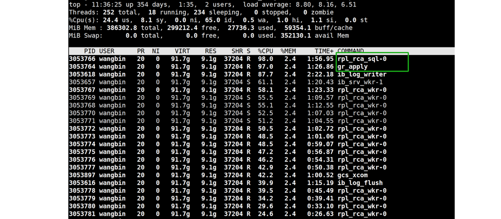

Figure 10-7. Top two CPU-consuming threads in Group Replication secondary replay.

Capturing performance data for the SQL thread and generating a flame graph can provide insights into where the CPU resources are being consumed. Please refer to the graph below for specifics.


Figure 10-8. Bottlenecks identified in the flame graph for the SQL thread.

From the graph, it can be observed that the SQL thread encounters two major bottlenecks. One significant bottleneck is in the event parsing process (as seen in the *binlog_event_deserialize* function in the graph), and the other major bottleneck is in *malloc* calls.

After switching to jemalloc 4.5 as the memory allocation tool, not only did the MySQL secondary replay speed increase, but also the CPU overhead of the SQL thread itself decreased. Please refer to the figure below for details.

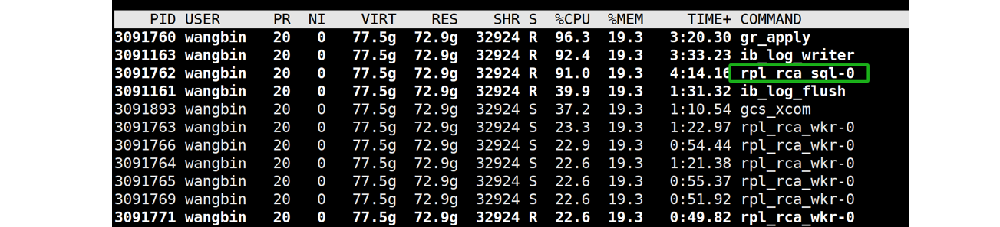

Figure 10-9. Reduced CPU overhead for the SQL thread with improved jemalloc.

Continuing with the new flame graph below, it's evident that the SQL thread has significantly reduced their overhead in terms of memory allocation.


Figure 10-10. Memory bottleneck solved for SQL thread.

From the graph, it's clear that *binlog_event_deserialize* constitutes approximately 45% of the workload. The speed of event parsing directly affects the maximum replay speed. To address this bottleneck, parallelizing event parsing across multiple threads could significantly improve performance.

Once the *binlog_event_deserialize* bottleneck is addressed, the next step is to identify other potential bottlenecks impacting replay speed. Reviewing the relevant source code for the worker queue reveals that its size is limited to 16,384.

```c++
/*
  MTS load-balancing parameter.
  Max length of one MTS Worker queue. The value also determines the size
  of Relay_log_info::gaq (see @c slave_start_workers()).
  It can be set to any value in [1, ULONG_MAX - 1] range.
*/
const ulong mts_slave_worker_queue_len_max = 16384;
```

It's clear that the worker queue can hold a maximum of 16,384 events. While this capacity usually suffices for standard transaction volumes, it becomes inadequate for larger transactions. Extensive testing shows that this limitation significantly restricts replay speeds, especially for tasks like loading TPC-C warehouse data. The following code demonstrates that a full worker queue can block the execution of the SQL thread.

```c++
  // possible WQ overfill
  while (worker->running_status == Slave_worker::RUNNING && !thd->killed &&
         (ret = worker->jobs.en_queue(job_item)) ==
             Slave_jobs_queue::error_result) {
    thd->ENTER_COND(&worker->jobs_cond, &worker->jobs_lock,
                    &stage_replica_waiting_worker_queue, &old_stage);
    worker->jobs.overfill = true;
    worker->jobs.waited_overfill++;
    rli->mts_wq_overfill_cnt++;
    // wait if worker queue is full
    mysql_cond_wait(&worker->jobs_cond, &worker->jobs_lock);
    mysql_mutex_unlock(&worker->jobs_lock);
    thd->EXIT_COND(&old_stage);
    mysql_mutex_lock(&worker->jobs_lock);
  }
```

Large transactions can quickly fill up the worker queue, causing the SQL thread to remain idle and miss the opportunity to replay other transactions efficiently.

Not only does the SQL thread block when the worker queue is full, but it also waits if a transaction pending replay depends on a prior transaction that hasn't finished replaying. For details, see the specific code below:

```c++
bool Mts_submode_logical_clock::wait_for_last_committed_trx(
    Relay_log_info *rli, longlong last_committed_arg) {
  THD *thd = rli->info_thd;
  ...
  if ((!rli->info_thd->killed && !is_error) &&
      !clock_leq(last_committed_arg, get_lwm_timestamp(rli, true))) {
    PSI_stage_info old_stage;
    struct timespec ts[2];
    set_timespec_nsec(&ts[0], 0);
    assert(rli->gaq->get_length() >= 2);  // there's someone to wait
    thd->ENTER_COND(&rli->logical_clock_cond, &rli->mts_gaq_LOCK,
                    &stage_worker_waiting_for_commit_parent, &old_stage);
    do {
      // wait if LWM is less than last committed
      mysql_cond_wait(&rli->logical_clock_cond, &rli->mts_gaq_LOCK);
    } while ((!rli->info_thd->killed && !is_error) &&
             !clock_leq(last_committed_arg, estimate_lwm_timestamp()));
    min_waited_timestamp.store(SEQ_UNINIT);  // reset waiting flag
    mysql_mutex_unlock(&rli->mts_gaq_LOCK);
    thd->EXIT_COND(&old_stage);
    set_timespec_nsec(&ts[1], 0);
    rli->mts_total_wait_overlap += diff_timespec(&ts[1], &ts[0]);
  } else {
    min_waited_timestamp.store(SEQ_UNINIT);
    mysql_mutex_unlock(&rli->mts_gaq_LOCK);
  }
  return rli->info_thd->killed || is_error;
}
```

The code describes a mechanism where the SQL thread waits if the recorded low-water-mark (LWM)—which signifies that a transaction and all prior transactions have been committed—is less than the last committed value of the transaction being replayed. In MySQL, it is the SQL thread that waits, rather than the worker threads. This waiting mechanism significantly restricts the replay speed.

Finally, let's examine the problems related to MySQL secondary replay in a NUMA environment. The following figure shows the test results of MySQL secondary replay:


Figure 10-11. Binding MySQL secondary to a single NUMA node improves replay speed.

Utilizing all NUMA nodes achieves a balanced replay speed of approximately 245,000 tpmC. This means that if the throughput of the MySQL primary exceeds this value, the MySQL secondary generally cannot keep pace.

In contrast, when the MySQL secondary is bound to NUMA node 0, the balanced replay speed increases to 352,000 tpmC, a 43.7% improvement. This improvement is attributed to the significant global latch contention observed during MySQL secondary replay. In a NUMA environment, this contention leads to frequent cache migration between different NUMA nodes, reducing replay efficiency. Binding the MySQL secondary to NUMA node 0 mitigates this inefficiency by avoiding cache migration between NUMA nodes, resulting in a substantial performance improvement.

## 10.3 MySQL Secondary Replay Optimization

### 10.3.1 Parallelization of Transaction Event Parsing

Here, a new model for splitting the SQL thread is implemented.


Figure 10-12. A new model for splitting the SQL thread.

In MySQL, the SQL thread for secondary replay is divided into six threads: one for reading events, four for decoding events, and one for handling scheduling (the scheduling thread). These threads are connected through queues. To manage excessive memory usage, flow control is applied to the event-reading thread when the queue size becomes too large.

Below is the *'top'* screenshot of the MySQL secondary running process.

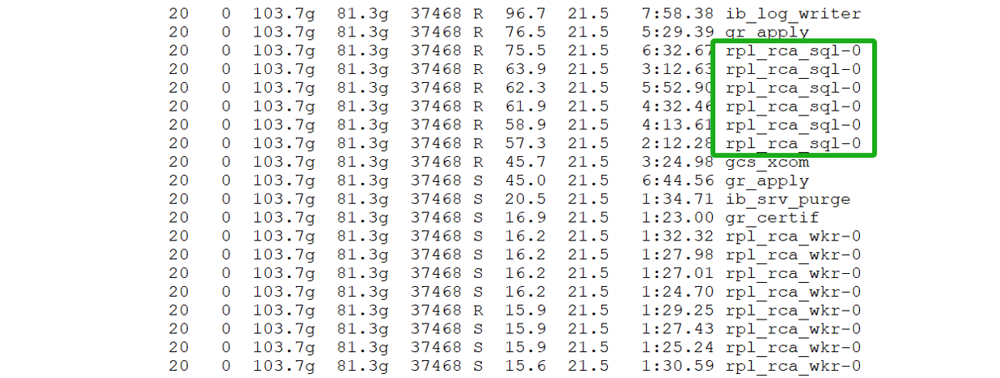

Figure 10-13. SQL thread appears as six separate threads in *'top'* display.

By splitting the SQL thread, the problem of limited processing capacity in a single thread has been solved, effectively eliminating the bottleneck of event parsing.

### 10.3.2 Improving Parallel Replay of Large Transactions

For large transaction replays, the main problem lies in the worker queue being too small, causing frequent waiting for the SQL thread.

To address this problem, a larger queue size can be set, as demonstrated in the code below.

```c++
/*
  MTS load-ballancing parameter.
  Max length of one MTS Worker queue. The value also determines the size
  of Relay_log_info::gaq (see @c slave_start_workers()).
  It can be set to any value in [1, ULONG_MAX - 1] range.
*/
const ulong mts_slave_worker_queue_len_max = 16384 << 6;
```

Increasing the worker queue size by 64 times to 1,048,576 transaction events accommodates large transactions with many events, allowing MySQL secondary to fully utilize its capacity for replaying these large transactions. However, this increase may raise concerns about memory usage. The following figure illustrates the memory consumption of MySQL secondary processes with different worker queue sizes and varying numbers of workers. The horizontal axis represents the number of workers, while the vertical axis shows the actual memory usage of the MySQL secondary process.


Figure 10-14. Memory consumption of MySQL secondary processes with different worker queue sizes and varying numbers of workers.

From the figure, it's evident that the actual memory consumption of MySQL secondary is influenced both by the *worker_queue_len_max* and the number of workers. On high-end machines, the additional memory usage may not be a major concern. However, on lower-end machines, reducing the number of workers can help manage memory consumption more effectively.

Currently, MySQL does not offer a configuration option to adjust the *worker_queue_len_max* parameter. Nonetheless, on high-end machines, this parameter plays a crucial role in improving the replay speed of large transactions.

### 10.3.3 Optimizing the Scheduling Thread Mechanism

If two transactions occurring close together in time modify the same data in MySQL, they can create dependencies during replay on the secondary. Specifically, the *last_committed* value of the latter transaction might match the *sequence_number* of the preceding one. During MySQL secondary replay, if a later transaction depends on a preceding one that hasn’t finished replaying yet, the scheduling thread will block itself. This approach is inefficient because the worker replay thread should ideally handle such waits, not the scheduling thread. The scheduling thread itself has plenty of other tasks to handle, and there's no guarantee that the subsequent transaction couldn't be replayed promptly.

To better understand this problem, consider the following case:


Figure 10-15. Typical examples of *sequence_number* and *last_committed*.

Assuming the MySQL secondary has completed transaction 12756 (*LWM*=12756), when the scheduling thread schedules transaction 12759 (highlighted in the green box in the figure), it finds that the dependent transaction 12757 has not yet completed replay. As a result, the scheduling thread blocks itself until transaction 12757 finishes. Meanwhile, transactions 12760, 12761, 12762, 12763, and 12764 could be allocated to workers for replay. The waiting for transaction 12757 could be handled by the worker replay thread, allowing the scheduling thread to continue with other tasks. This presents an opportunity for optimization.

The following figure illustrates TPC-C tests conducted with BenchmarkSQL at various concurrency levels to evaluate whether the MySQL secondary can match the MySQL primary's speed. The horizontal axis represents the concurrency level, and the vertical axis shows tpmC values. Light gray regions indicate that the MySQL secondary keeps pace with the MySQL primary, while Dark gray regions signify that it does not.


Figure 10-16. If the processing speed of the MySQL primary exceeds the balanced replay speed, the secondaries may not keep up.

From the figure, it's evident that when concurrency reaches 70, the MySQL secondary falls behind the MySQL primary's processing speed. This inefficiency is primarily due to the scheduling thread waiting unnecessarily, which disrupts the normal replay process. The MySQL secondary can keep pace with the primary as long as the throughput is below 245,439 tpmC. However, once this threshold is exceeded, the MySQL secondary struggles to match the primary's speed. Essentially, the MySQL secondary replay cannot support high throughput effectively.

To address this, allowing workers to handle the waiting for **last_committed** transactions independently can completely relieve the scheduling thread. This adjustment provides a solid foundation for future improvements in MySQL secondary replay performance.

### 10.3.4 Effect of Memory Allocation Tools on Replay Performance

Utilizing advanced memory allocation tools can improve the replay speed of MySQL secondaries. The figure below shows the impact of two jemalloc versions on MySQL secondary replay performance under the x86 architecture.


Figure 10-17. Achieve better replay speed with jemalloc 4.5.

From the figure, it is evident that using jemalloc 4.5 markedly improves the replay speed of MySQL secondaries. Under the same conditions, jemalloc 3.6 achieves a balanced replay speed of just over 710,000 tpmC, while jemalloc 4.5 reaches 810,000 tpmC, representing a 14% improvement in performance.

### 10.3.5 Addressing Unfriendliness Problems in NUMA Environments

In a scenario where NUMA is disabled at the BIOS level, the efficiency of the MySQL secondary replay process is evaluated. Refer to the figure below for details.


Figure 10-18. Comparison of balanced replay speed before and after disabling NUMA in the BIOS.

Disabling NUMA in the BIOS leads to a significant decrease in replay speed. While this change affects memory allocation methods, it does not alter the underlying NUMA hardware architecture.

The decision to disable NUMA should be made based on a thorough analysis. Testing on x86 architecture shows that disabling NUMA negatively impacts MySQL secondary replay but may benefit MySQL primary operations. Further investigation into NUMA's incompatibility with MySQL secondary replay could reveal deeper problems within MySQL itself.

Based on MySQL's Performance Schema, statistics on latch operations are gathered. See the results in the following figure:

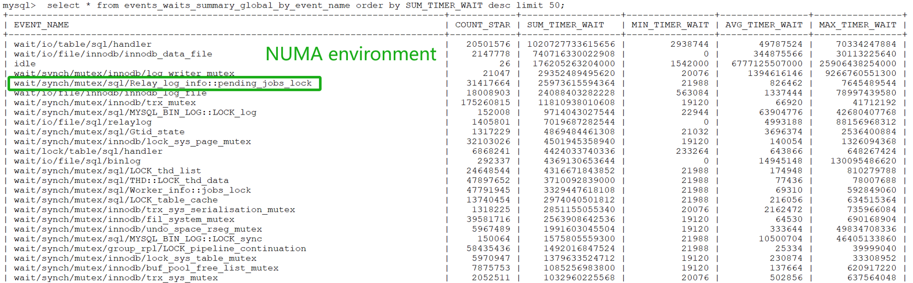

Figure 10-19. The bottleneck of pending_jobs_lock has been exposed in the Performance Schema.

From the figure, it can be seen that in a NUMA environment, *Relay_log_info::pending_jobs_lock* ranks fifth in importance in relation to replay. Binding the MySQL secondary instance to NUMA node 0, the test evaluates whether the Performance Schema statistics change under an SMP environment. The specific test results are shown in the following figure:


Figure 10-20. The bottleneck of pending_jobs_lock has been alleviated in an SMP environment.

From the figure, it can be observed that *Relay_log_info::pending_jobs_lock* has moved to the eighth position, indicating that under the scenario of binding to NUMA node 0, the contention related to *Relay_log_info::pending_jobs_lock* has been alleviated.

In the MySQL source code, the relevant code for *pending_jobs_lock* is frequently invoked in two places. The first occurrence is in the *remove_item_from_jobs* function, as illustrated in the code snippet below:

```c++
/**
  Remove a job item from the given workers job queue. It also updates related
  status.
  param[in] job_item The job item will be removed
  param[in] worker   The worker which job_item belongs to.
  param[in] rli      slave's relay log info object.
 */
static void remove_item_from_jobs(slave_job_item *job_item,
                                  Slave_worker *worker, Relay_log_info *rli) {
  Log_event *ev = job_item->data;
  mysql_mutex_lock(&worker->jobs_lock);
  worker->jobs.de_queue(job_item);
  /* possible overfill */
  if (worker->jobs.get_length() == worker->jobs.capacity - 1 &&
      worker->jobs.overfill == true) {
    worker->jobs.overfill = false;
    // todo: worker->hungry_cnt++;
    mysql_cond_signal(&worker->jobs_cond);
  }
  mysql_mutex_unlock(&worker->jobs_lock);
  /* statistics */
  const auto jobs_length = worker->jobs.get_length();
  /* todo: convert to rwlock/atomic write */
  mysql_mutex_lock(&rli->pending_jobs_lock);
  rli->pending_jobs--;
  rli->mts_pending_jobs_size -= ev->common_header->data_written;
  assert(rli->mts_pending_jobs_size < rli->mts_pending_jobs_size_max);
  ...
```

The other is in the **append_item_to_jobs** function, as shown in the code snippet below:

```c++
/**
   Coordinator enqueues a job item into a Worker private queue.
   @param job_item  a pointer to struct carrying a reference to an event
   @param worker    a pointer to the assigned Worker struct
   @param rli       a pointer to Relay_log_info of Coordinator
   @return false Success.
           true  Thread killed or worker stopped while waiting for
                 successful enqueue.
*/
bool append_item_to_jobs(slave_job_item *job_item, Slave_worker *worker,
                         Relay_log_info *rli) {
  THD *thd = rli->info_thd;
  size_t ret = Slave_jobs_queue::error_result;
  size_t ev_size = job_item->data->common_header->data_written;
  ulonglong new_pend_size;
  PSI_stage_info old_stage;
  assert(thd == current_thd);
  mysql_mutex_lock(&rli->pending_jobs_lock);
  new_pend_size = rli->mts_pending_jobs_size + ev_size;
  bool big_event = (ev_size > rli->mts_pending_jobs_size_max);
  ...
```

The *remove_item_from_jobs* and *append_item_to_jobs* functions primarily utilize the *pending_jobs_lock* latch for managing job queues. The *append_item_to_jobs* function, executed by the scheduling thread, is called once per event to enqueue it into the worker queue. In contrast, *remove_item_from_jobs*, executed by worker threads, is called once per event removal.

In high-throughput scenarios, the scheduling thread frequently calls *append_item_to_jobs* to enqueue events, while numerous worker threads concurrently call *remove_item_from_jobs* to dequeue them. This leads to significant latch contention, as both functions involve acquiring and releasing the latch. With event processing rates reaching several hundred thousand per second, latch contention between the scheduling thread and worker threads may become severe.

Frequent acquisition and release of latches cause context switches. In NUMA environments, these context switches lead to cache migration between NUMA nodes, resulting in decreased replay efficiency.

After addressing the latch bottleneck related to *pending_jobs_lock* and applying the configuration parameters of the online MySQL secondary, the focus shifts to evaluating whether disabling NUMA in the BIOS improves MySQL secondary replay performance. The following figure compares the balanced replay speeds of MySQL secondaries under different NUMA configurations.


Figure 10-21. Disabling NUMA in the BIOS improves MySQL secondary replay speed by addressing the NUMA incompatibility bottleneck.

From the figure, it is evident that after addressing the NUMA incompatibility bottleneck, disabling NUMA in the BIOS on x86 architecture improves the speed of MySQL secondary replay.

### 10.3.6 Impact of 'Dual One' on Replay Performance

'Dual one' refers to the real-time disk flushing of binlog and redo logs, a critical technology for MySQL crash recovery. Testing revealed that 'dual one' significantly affects MySQL secondary replay speeds. The following figure shows that, under identical conditions, disabling 'dual one' increased the balanced replay speed to 810,000 tpmC, while enabling it reduced the replay speed to approximately 700,000 tpmC. Disabling 'dual one' thus led to a 15.7% improvement in replay speed.


Figure 10-22. Achieve better replay speed with 'dual one' closed.

### 10.3.7 Effect of Binlog Row Image Format on Replay Performance

Reducing the size of the binlog theoretically helps improve MySQL replay speed. The following figure shows the comparison between using *binlog_row_image=minimal* and *binlog_row_image=full* in terms of balanced replay speed:


Figure 10-23. Achieve better replay speed with binlog_row_image=minimal.

When using full mode for binlog, MySQL achieves a balanced replay speed of just over 790,000 tpmC. Switching to minimal mode, however, increases this speed to over 890,000 tpmC, representing a significant 13% improvement. This improvement highlights that setting *binlog_row_image=minimal*—which substantially reduces the binlog size—boosts the replay speed of MySQL secondaries. However, it's important to note that this setting may also pose a risk of incomplete data restoration in certain scenarios.

### 10.3.8 Impact of Performance Schema on Replay Performance

Enabling Performance Schema significantly impacts the replay speed of MySQL secondaries due to the extensive interaction with large amounts of memory involved in secondary replay. Here's the flame graph captured after enabling Performance Schema.


Figure 10-24. Substantial overhead from my_malloc calling PFS-related functions.

From the graph, it is evident that the overhead associated with my_malloc calling PFS-related functions is substantial and distributed across multiple areas, highlighting a significant bottleneck. Extensive testing results indicate that enabling Performance Schema has a much greater impact on MySQL secondary replay compared to MySQL primary execution. For more detailed information, refer to Section 11.5.5.

## 10.4 Exploration of Maximum Replay Speed in Group Replication

Using the modified tpcc-mysql, high throughput tests can identify when Group Replication secondaries fall behind MySQL primary. The following figure presents detailed test results. The test setup includes: disabling 'dual one' using jemalloc 4.5, deploying MySQL secondaries and primary on separate machines, setting binlog row image format to minimal, and running the test for 300 seconds.


Figure 10-25. Maximum replay speed in Group Replication.

The figure illustrates the throughput of the MySQL primary at concurrency levels of 100, 150, 200, 300, and 400. In the figure, light gray indicates that the MySQL primary and secondaries are synchronized in speed, while dark gray signifies a slight lag of the MySQL secondaries behind the MySQL primary. Except for the case at 200 concurrency, where a 2-second delay was observed, the MySQL secondaries generally keep pace with the primary.

Notably, maximum replay speed is directly correlated with concurrency. At 150 concurrency, throughput is high with nearly zero delay, whereas at 200 concurrency, throughput is slightly reduced with a 2-second delay.

With better hardware, further improvements in maximum replay speed might be possible, but the test results are already very close to the achievable maximum.

# Part 4 Tuning

This part primarily analyzes performance improvements from the perspective of MySQL users.

# Chapter 11: Performance Tuning

This chapter primarily addresses methods for improving MySQL application performance without altering the MySQL source code.

## 11.1 PGO

Profile-guided optimization (PGO) typically improves program execution efficiency. The following figure illustrates how PGO improves the throughput of a standalone MySQL instance under various concurrency levels, following the resolution of MySQL MVCC ReadView scalability problems.


Figure 11-1. Impact of PGO after solving MVCC ReadView scalability problems.

From the figure, it is evident that PGO has a notable impact.

For MySQL 8.0.27 with PGO, throughput decreases under high concurrency conditions. The specific details are shown in the figure below:


Figure 11-2. Performance comparison tests before and after using PGO in MySQL 8.0.27.

The test results above indicate that PGO for MySQL's improvement requires addressing scalability problems before its full potential can be realized. It should be noted that both comparative tests above were conducted in mainstream NUMA environments. When MySQL is bound to a single NUMA node, creating an SMP environment, the following figure shows the relationship between TPC-C throughput and concurrency levels before and after PGO.


Figure 11-3. Performance comparison tests before and after using PGO in MySQL 8.0.27 under SMP.

From the figure, it can be seen that PGO consistently improves throughput in SMP environments, without decreasing as concurrency levels increase. The following figure compares the performance improvement of PGO between NUMA and SMP environments.


Figure 11-4. Performance of PGO optimization in different environments.

From the figure, it is evident that PGO achieves a maximum performance improvement of up to 30% in SMP environments, whereas in NUMA environments, the performance improvement decreases as concurrency increases. This suggests that PGO has greater potential in SMP environments.

Continuing the analysis, the performance of PGO in a Group Replication cluster environment compared to a single MySQL instance is examined. The following diagram depicts a simplified queue model of Group Replication.


Figure 11-5. A simplified queue model of Group Replication.

Because the network portion cannot be optimized by PGO, the MySQL primary consumes a lower proportion of time compared to a single MySQL instance. According to Amdahl's Law, the performance gains from PGO will be less pronounced compared to those of a standalone MySQL instance. Generally, as network latency increases, the improvement from PGO tends to diminish.

The following figure compares the throughput improvement of a standalone MySQL instance and Group Replication using PGO.


Figure 11-6. PGO Performance Improvement in Group Replication vs. Standalone MySQL.

From the figure, it can be observed that the performance improvement from PGO in a Group Replication cluster environment is generally less than that of a standalone MySQL instance.

In conclusion, PGO can be summarized as follows:

1.  For MySQL, PGO is a worthwhile optimization that theoretically improves performance comprehensively, especially in SMP environments.
2.  In NUMA environments, addressing scalability problems is necessary to achieve significant benefits from PGO.
3.  PGO is less effective in a Group Replication cluster compared to a standalone MySQL instance.

## 11.2 Minimize Network Interactions

To improve MySQL application performance without compromising the correctness of TPC-C testing, modify the SQL interaction method to reduce the number of network interactions between the client and MySQL. This optimization indirectly improves performance.

The following example uses an optimized tpcc-mysql testing tool to determine the maximum throughput supported by Group Replication under specific software and hardware conditions.

```
 [warehouse]: 200
[connection]: 200
    [rampup]: 0 (sec.)
   [measure]: 60 (sec.)
RAMP-UP TIME.(0 sec.)
MEASURING START.
  10, trx: 179372, 95%: 7.134, 99%: 9.097, max_rt: 16.857, 178944|16.256, 17941|5.395, 17932|25.313, 17943|14.180
  20, trx: 181215, 95%: 7.216, 99%: 9.228, max_rt: 20.587, 180703|433.405, 18123|4.086, 18122|29.192, 18124|4.922
  30, trx: 180596, 95%: 7.410, 99%: 9.463, max_rt: 16.930, 180110|16.705, 18061|3.146, 18056|25.658, 18060|7.392
  40, trx: 179032, 95%: 7.594, 99%: 10.575, max_rt: 18.047, 178513|16.862, 17906|3.861, 17900|27.482, 17904|5.724
  50, trx: 173856, 95%: 8.199, 99%: 12.705, max_rt: 31.777, 173412|30.990, 17388|9.501, 17388|37.472, 17385|5.538
  60, trx: 171950, 95%: 8.499, 99%: 13.721, max_rt: 31.584, 171546|31.808, 17200|9.185, 17188|35.098, 17202|13.781
STOPPING THREADS........................................................................................................................................................................................................
<Raw Results>
  [0] sc:481189 lt:584832  rt:0  fl:0 avg_rt: 5.3 (5)
  [1] sc:915412 lt:147816  rt:0  fl:0 avg_rt: 4.4 (5)
  [2] sc:106614 lt:5  rt:0  fl:0 avg_rt: 0.8 (5)
  [3] sc:106586 lt:0  rt:0  fl:0 avg_rt: 11.9 (80)
  [4] sc:106619 lt:0  rt:0  fl:0 avg_rt: 2.1 (20)
 in 60 sec.
<Raw Results2(sum ver.)>
  [0] sc:481239  lt:585014  rt:0  fl:0 
  [1] sc:918008  lt:148245  rt:0  fl:0 
  [2] sc:106622  lt:5  rt:0  fl:0 
  [3] sc:106622  lt:0  rt:0  fl:0 
  [4] sc:106628  lt:0  rt:0  fl:0 
<Constraint Check> (all must be [OK])
 [transaction percentage]
        Payment: 43.41% (>=43.0%) [OK]
   Order-Status: 4.35% (>= 4.0%) [OK]
       Delivery: 4.35% (>= 4.0%) [OK]
    Stock-Level: 4.35% (>= 4.0%) [OK]
 [response time (at least 90% passed)]
      New-Order: 45.14%  [NG] *
        Payment: 86.10%  [NG] *
   Order-Status: 100.00%  [OK]
       Delivery: 100.00%  [OK]
    Stock-Level: 100.00%  [OK]
<TpmC>
                 1066021.000 TpmC   
```

The data indicates that, in the given software and hardware testing environment, Group Replication achieved a peak throughput of 1.066 million tpmC, setting a new record.

This highlights that reducing the number of network interactions with MySQL during application development can significantly improve performance.

## 11.3 Utilize Advanced Memory Allocation Tools

MySQL defaults to using the jemalloc memory allocation tool, specifically version 3.6. Test data indicates that jemalloc 3.6 is not optimal for performance. The following figure shows the throughput improvements of jemalloc 4.5 compared to jemalloc 3.6 on x86 architecture.


Figure 11-7. Jemalloc 4.5 outperforms jemalloc 3.6 in terms of performance.

From the figure, it is evident that jemalloc 4.5 outperforms jemalloc 3.6 in terms of performance.

For MySQL secondary replay, please refer to the figure below:


Figure 11-8. Achieve better replay speed with jemalloc 4.5.

Tests with optimized MySQL replay showed a notable difference between jemalloc 3.6 and jemalloc 4.5. The figure illustrates a significant improvement in balanced replay speed with jemalloc 4.5.

An effective memory allocation tool not only boosts MySQL primary server performance but also improves the replay speed of MySQL secondaries.

## 11.4 Indexes and Performance

Section 4.10.6 provides detailed information on this topic.

## 11.5 Key MySQL Parameters Influencing Performance

Databases feature numerous tunable system parameters that control crucial aspects such as memory allocation, I/O management, and logging. The impact of these parameters can vary greatly depending on the configuration, ranging from significant to minimal effects. This variability is due to the multitude of factors influencing MySQL performance, which complicates the prediction of performance outcomes. However, it is possible to identify specific factors that lead to abnormal throughput. The following sections detail commonly used parameters that affect performance.

### 11.5.1 Impact of 'Dual One' on Performance

The 'dual one' configuration parameters include two parameters: *sync_binlog* and *innodb_flush_log_at_trx_commit*.

The *sync_binlog* parameter is described as follows:


The following configuration controls how often the MySQL Server synchronizes the binary log to disk.


The *innodb_flush_log_at_trx_commit* parameter is described as follows:


The following configuration balances strict ACID compliance for commit operations with the higher performance achievable by rearranging and batching commit-related I/O operations. Adjusting the default value can improve performance but may result in transaction loss in the event of a crash.


It's important to note that with the improved scalability in MySQL 8.0 and optimizations in redo log handling, the effect of disabling 'dual one' settings on throughput for MySQL primary servers in high-concurrency test scenarios has diminished.

Comparative tests were first conducted using MySQL 8.0.27. The figure below illustrates the relationship between throughput and concurrency with 'dual one' enabled and disabled.


Figure 11-9. Achieve better performance with 'dual one' disabled.

Based on the figure, it is evident that with MySQL 8.0.27, disabling 'dual one' significantly improves throughput. However, this performance gain diminishes as concurrency increases.

Based on the improved version of MySQL with PGO, the performance improvement after disabling 'dual one' is less significant, as shown in the figure below:


Figure 11-10. Less performance gain with 'dual one' disabled after addressing scalability bottlenecks in MySQL.

It can also be observed that the extent of performance improvement varies with throughput and is not constant. As scalability bottlenecks in MySQL are addressed, the impact of 'dual one' diminishes.

The impact of 'dual one' on MySQL secondary replay is more pronounced due to mechanisms such as the re*plica_preserve_commit_order* queueing. The figure below compares the balanced replay speeds of MySQL secondaries before and after disabling 'dual one' using an optimized MySQL version.


Figure 11-11. Achieve better replay speed with 'dual one' closed.

Under equivalent conditions, disabling  'dual one' achieved a balanced replay speed of 810,000 tpmC for MySQL secondaries, while enabling ‘dual one’ reduced this speed to approximately 700,000 tpmC. Thus, disabling 'dual one' significantly improves the replay speed of MySQL secondaries.

### 11.5.2 Performance Effects of Disabling Binlog

With binary logging enabled, the server logs all statements that modify data to the binary log, which is utilized for backup and replication purposes. Disabling binlog can theoretically eliminate queue wait times, thereby improving throughput and reducing response times.

The figure below compares TPC-C throughput at identical concurrency levels before and after disabling binlog, using BenchmarkSQL.


Figure 11-12. Achieve better performance with binlog disabled

From the figure, it is evident that disabling binlog noticeably impacts performance.

### 11.5.3 Understanding the Spin Delay Parameter's Effect on Performance

Contending threads must wait for a lock when it’s unavailable. Several waiting policies exist, with unbounded spinning (or busy waiting) being the simplest. In this approach, threads repeatedly check a memory location until the value changes. This method consumes resources and may lead to preemption in an oversubscribed system with more threads than CPUs [3].

**Advantages of Spinning:**

-   In an unloaded system, spinning offers high performance with minimal overhead, as it avoids OS coordination and incurs only a few cache miss latencies per lock handoff. On chip multiprocessors with shared caches, lock acquisition and release latencies can be as low as 150 ns.

**Disadvantages of Spinning:**

-   When the system is loaded, spinning can degrade performance as it reduces the number of processors available for useful work, leading to suboptimal performance when runnable threads exceed hardware contexts. Additionally, since spinning isn’t coordinated with the OS, it doesn’t account for lock holders or spinners in scheduling decisions.

The spin delay parameter helps address NUMA (Non-Uniform Memory Access) compatibility problems. Generally, better MySQL scalability reduces the impact of the spin delay parameter. Conversely, in cases of poor scalability, the spin delay parameter noticeably affects performance, although its effectiveness has an upper limit.

Based on the MySQL 8.0.21 version with lock-sys optimization, the figure below compares TPC-C throughput at various concurrency levels.


Figure 11-13. Achieve better performance with spin delay 20 in MySQL 8.0.21.

The figure shows that setting *spin_delay=20* significantly mitigates the scalability problems of MySQL 8.0.21 with lock-sys optimization. However, in high-concurrency scenarios, the spin delay parameter can substantially increase CPU overhead. According to the paper "Locking Made Easy", simple spinlocks are very efficient under low contention but do not scale well [63].

Further analysis of the spin delay parameter in MySQL versions prior to MVCC ReadView optimization, with PGO compilation, is detailed in the following figure.


Figure 11-14. Achieve better performance with spin delay 20 before MVCC ReadView optimization.

From the figure, it's evident that with the default *spin_delay* parameter set to 6, throughput sharply declines at 200 concurrency. However, setting *spin_delay=20* leads to a substantial improvement in throughput.

Let’s continue with MVCC ReadView optimization to further enhance MySQL scalability. The figure below shows the comparison of throughput between MVCC ReadView optimization and *spin delay=20*:


Figure 11-15. Comparison of throughput between MVCC ReadView optimization and spin delay 20.

From the figure, it can be seen that while spin delay can mitigate scalability problems to some extent, its effect is noticeably less pronounced compared to the benefits of adopting MVCC ReadView optimization.

After MVCC ReadView optimization, the impact of  *spin_delay* was tested again. See the specific results in the figure below:


Figure 11-16. Spin delay 20 has no effect after addressing MVCC ReadView scalability problems.

The figure shows that after addressing MVCC ReadView scalability problems, the impact of the *spin_delay* parameter is minimal.

### 11.5.4 Effect of Binlog Commit Order on Performance

Here’s a brief introduction to the *binlog_order_commits* parameter:


When this variable is enabled on a replication source server (default), transaction commit instructions to storage engines are serialized on a single thread, ensuring transactions commit in the same order as they are written to the binary log. Disabling this variable permits transaction commit instructions to be issued using multiple threads. Used in combination with binary log group commit, this prevents the commit rate of a single transaction being a bottleneck to throughput, and might therefore produce a performance improvement [13].

Based on the MySQL 8.0.27 version, examining whether enabling the *binlog_order_commit* parameter affects TPC-C throughput. See the specific comparison in the figure below:


Figure 11-17. Achieve better performance with binlog_order_commits off before binlog group commit optimization.

From the figure, it can be observed that disabling *binlog_order_commits* results in a noticeable improvement in TPC-C throughput under different concurrency levels.

The following figure is based on the improved MySQL version, optimized with PGO settings. Disabling *binlog_order_commits* shows less pronounced improvement in TPC-C throughput. Addressing problems like the thundering herd problem caused by binlog group commit has improved MySQL efficiency and mitigated the performance degradation observed when *binlog_order_commits* is enabled.


Figure 11-18. Less performance gain with binlog_order_commits off after binlog group commit optimization.

MySQL defaults to enabling *binlog_order_commits*. Notably, disabling *binlog_order_commits* will affect MySQL's clone functionality.

### 11.5.5 Comprehensive Understanding of the Performance Schema on Performance

The Performance Schema helps DBAs tune performance by taking real measurements instead of making guesses. Unfortunately, in NUMA environments, enabling the Performance Schema impacts MySQL's performance, especially affecting MySQL secondary replay. The figure below compares TPC-C throughput across different concurrency levels using BenchmarkSQL to analyze this impact.


Figure 11-19. Achieve better performance with performance_schema off.

From the figure, it can be seen that the Performance Schema has a relatively minor impact on MySQL primary performance, which is generally acceptable to users. However, enabling the Performance Schema significantly affects the replay speed of MySQL secondaries. The following figure shows the change in the replay queue size of Group Replication after enabling the Performance Schema.


Figure 11-20. The replay queue size in Group Replication increases after enabling the Performance Schema.

From the figure, it can be observed that the replay queue size is increasing, indicating that the MySQL secondary is unable to keep up with the processing speed of the MySQL primary. The throughput results after executing on the MySQL primary are as follows:


After the MySQL primary completes execution, here are the performance screenshots captured during the replay process on the MySQL secondary:


Figure 11-21. Significant bottlenecks related to the Performance Schema.

From the highlighted green box, it is apparent that there are significant bottlenecks related to the Performance Schema.

To summarize the test results above: When the MySQL primary achieves a throughput of 500,000 tpmC, the MySQL secondary, with the Performance Schema enabled, shows clear bottlenecks. Additionally, the MySQL secondary cannot keep up with the speed of the MySQL primary during the replay process.

Now, with the Performance Schema disabled, conduct the same concurrency test. See the specific results in the figure below:


Figure 11-22. The replay queue size in Group Replication does not increase after disabling the Performance Schema.

The figure indicates that the number of transactions awaiting replay did not increase significantly over time. The throughput results after MySQL primary completes execution are as follows:


When MySQL primary testing completes, the MySQL secondary also finishes replay nearly simultaneously. This indicates that in mainstream NUMA environments, Performance Schema is highly detrimental to MySQL secondary replay. The NUMA compatibility problems with Performance Schema remain unsolved and will be a focus for future optimization.

### 11.5.6 Effect of Doublewrite on Performance

Here’s a brief introduction to the *innodb_doublewrite* parameter:


The doublewrite buffer is a storage area where InnoDB writes pages from the buffer pool before committing them to the data files. This mechanism ensures data integrity during crash recovery by providing a reliable page copy in case of failures. However, since the default InnoDB page size is 16 KB while file systems can only guarantee atomicity up to 4 KB, only part of the page may be recoverable. Enabling doublewrite helps InnoDB recover the full page by writing it twice.

The impact of enabling doublewrite on performance is assessed using the improved MySQL 8.0.27 with PGO. The figure below shows the effect of disabling doublewrite on TPC-C throughput across different concurrency levels.


Figure 11-23. Achieve higher peak throughput with doublewrite disabled.

From the figure, it is evident that disabling the doublewrite parameter can increase peak throughput. While extensive testing and statistical analysis indicate that this parameter has a limited overall impact on performance, it does help to improve peak throughput. However, disabling doublewrite may compromise recovery safety in the event of a database crash, so it should be used with caution.

### 11.5.7 Effect of Binlog Row Image Format on Performance

Here’s a brief introduction to the *binlog_row_image* parameter:


For MySQL row-based replication, this variable controls how row images are recorded in the binary log [13]. Each row change event consists of two images: a "before" image, which represents the row's state before the change, and an "after" image, which reflects the updated state. Typically, MySQL logs all columns for both images. However, it is possible to log only the necessary columns, which can reduce disk, memory, and network usage.

Based on the improved version of MySQL 8.0.27 with PGO, the impact of the *binlog_row_image* parameter on TPC-C throughput at various concurrency levels is analyzed. See the figure below:


Figure 11-24. Achieve improved throughput with minimal logging.

From the figure, it can be observed that using *binlog_row_image=minimal* provides a moderate improvement in throughput for the MySQL primary, but the increase is not substantial. Regarding MySQL secondary replay, specific details can be found in section 10.3.7.

### 11.5.8 Understanding the Effect of Binlog Compression Settings on Performance

Here’s a brief introduction to the *binlog_transaction_compression* parameter:


When binary log transaction compression is enabled, transaction payloads are compressed and written to the binary log as a single event. These compressed payloads remain compressed in the replication stream and relay logs, reducing storage requirements and saving network bandwidth for both the originator and recipients of the transactions [13].

In a Group Replication cluster within the same data center, with *binlog_transaction_compression* enabled for MySQL primary and secondaries, let’s analyze the effect of binary log compression on TPC-C throughput. Refer to the figure below for detailed results:


Figure 11-25. Binlog compression may negatively impact performance in LAN environments.

From the figure, it is evident that enabling binlog compression results in a significant decrease in throughput for the Group Replication cluster, particularly under high concurrency. This decline occurs when the network benefits from compression are outweighed by the computational costs involved.

To investigate whether increasing network latency could improve throughput after compression, a simulated network latency of 10ms was used. The comparison of TPC-C throughput versus concurrency levels, before and after binlog compression, is shown in the following figure.


Figure 11-26. Binlog compression does not affect performance in WAN environments.

From the figure, it is evident that with a 10ms network latency, the throughput after compression is similar to that before compression. This suggests that increased network latency can help alleviate the performance degradation associated with MySQL compression.

Users should weigh the trade-off between storage cost reduction and performance improvement based on their specific needs.

### 11.5.9 Understanding the Effect of InnoDB Buffer Pool Size on Performance

Here’s a brief introduction to the *innodb_buffer_pool_size* parameter:


The larger buffer pool retains more data in memory, reducing page evictions, I/O operations, and contention within the buffer pool [13].

Based on the improved MySQL 8.0.27 version with PGO, the impact of the *innodb_buffer_pool_size* parameter on TPC-C throughput at various concurrency levels is analyzed. The results, with a warehouse count of 1000, are shown in the figure below.


Figure 11-27. innodb_buffer_pool_size: optimal size is key to performance, not just larger.

From the figure, it is evident that increasing the buffer pool size does not always lead to higher throughput. For 1000 warehouses, occupying around 92GB of I/O space in the test, setting *innodb_buffer_pool_size* to 92GB performs better than setting it to 192GB.

Notably, the *innodb_buffer_pool_size* parameter is well-suited for dynamic adaptive tuning using AI.

## 11.6 Summary

This chapter focuses on optimizing MySQL application performance without modifying MySQL source code. Key methods include using PGO, minimizing network interactions, employing advanced memory allocation tools, and improving indexing and parameter configurations.

The effectiveness of these optimization methods varies depending on the MySQL version, configuration parameters, hardware environment, and specific application characteristics. While a parameter might significantly impact performance in one scenario, its effectiveness may decrease in another. This variability arises from the complex interactions between multiple performance-affecting queues and potential bottlenecks, making performance testing particularly challenging.

# Part 5 Conclusion

This Part provides the concluding summary, outlines future directions for MySQL improvements, and wraps up the book.

# Chapter 12: Future Directions

A solid foundation is essential for advancing MySQL towards more complex objectives. Once scalability and high availability are resolved, the focus could shift to the following development areas.

## 12.1 Improvements to Hypergraph Algorithms

The goal is to make hypergraph algorithms practical while also improving their performance, including exploring parallel approaches for classical dynamic programming algorithms.

## 12.2 Practical Implementation of Paxos Log Persistence Functionality

Currently, Paxos log persistence has been demonstrated to be feasible. Efforts can be made to implement crash recovery based on Paxos logs, thereby making Paxos log persistence truly practical.

## 12.3 Addressing Concurrent View Change Challenges

Currently, Group Replication faces challenging concurrent view change problems. Although these issues occur infrequently, efforts can be made to solve them completely.

## 12.4 Further Improving Scalability

MySQL scalability can be further improved in the following areas:

1.  Eliminating additional latch bottlenecks, particularly in non-partitioned environments.
2.  Improving the stability of long-term performance testing.
3.  Improving MySQL's NUMA-awareness in mainstream NUMA environments.
4.  Addressing Performance Schema's adverse impact on NUMA environments during MySQL secondary replay processes.

## 12.5 Further Improving SQL Performance Under Low Concurrency

MySQL 8.0's performance under low concurrency is significantly worse compared to 5.7, which needs to be corrected to avoid affecting users upgrading to 8.0.

## 12.6 Further Enhancing Performance of Analytical SQL Queries

Currently, MySQL processes individual SQL queries using a single-threaded mode, which can result in excessively long processing times for some statistical queries and significantly impact user experience. Future improvements will focus on implementing multi-threaded processing for statistical SQL queries to reduce processing times and enhance performance.

## 12.7 Improving Binlog File Compression Efficiency and Operational Stability

Reducing user storage costs is a key focus. Optimizing MySQL binlog compression rates and operational stability presents significant potential for improvement, which could lead to substantial benefits.

## 12.8 Advancing MySQL's Management of Large Transactions on the Primary Server

In mainstream NUMA environments, MySQL's primary server efficiency in handling large transactions is suboptimal. This area has significant optimization potential and could become one of the key points for future improvements.

## 12.9 Further Exploring Better Memory Allocation Tools

Currently, jemalloc 4.5 is the best-found memory allocation tool, but it has high memory consumption and instability on ARM architecture. A key future focus could be developing a more efficient and stable memory allocation tool.

## 12.10 Introducing AI into MySQL Systems

Integrating AI with MySQL for automated knob tuning and learning-based database monitoring could be another key focus for the future.

### 12.10.1 Knob Tuning

Integrating AI for parameter optimization can significantly reduce DBA workload. Key parameters suitable for AI-driven optimization include:

1.  Buffer pool size
2.  Spin delay settings
3.  Dynamic transaction throttling limits based on environment
4.  Dynamic XCom cache size adjustment
5.  MySQL secondary worker max queue size
6.  The number of Paxos pipelining instances and the size of batching
7.  Automatic parameter adjustments under heavy load to improve processing capability

### 12.10.2 Learning-based Database Monitoring

AI could optimize database monitoring by determining the optimal times and methods for tracking various database metrics.

## 12.11 Summary

Programming demands strong logical reasoning skills, crucial for problem-solving, algorithm design, debugging, code comprehension, performance optimization, and testing. It helps in analyzing problems, creating solutions, correcting errors, and ensuring software reliability. Developing logical reasoning is essential for programmers to think systematically and build efficient, reliable software [56].

MySQL development often focuses primarily on simple tests using testing tools, which can miss opportunities to discover many problems. Testing MySQL itself is a monumental task, and relying solely on testing tools is insufficient to expose all problems. Optimization varies across different projects, and using real online traffic for optimization is more targeted and meaningful. Therefore, MySQL optimization based on live traffic is highly significant.

MySQL performance optimization heavily relies on mitigating scalability problems. Enhanced versions of MySQL have addressed most scalability problems, establishing a solid foundation for further optimizations. Profile-guided optimization (PGO) is crucial for MySQL, and as scalability problems improve, its importance will continue to grow. Utilizing better memory allocation tools can significantly improve the performance of both the MySQL primary and secondary replay.

We firmly believe that high availability solutions based on Paxos log persistence will be the future trend. Our extensive experience in the long-term transformation of Group Replication has laid a solid foundation for achieving true high availability. The speed of MySQL secondary replay determines the quality of MySQL's high availability. Achieving replay speeds in the range of millions of tpmC is possible but requires persistent effort.

Although MySQL optimization is a long and winding process, we are confident that MySQL will continue to improve over time.

# References

[1] Zeitz, P. (1999). The art and craft of problem solving. New York: John Wiley.

[2] C. Mohan, D.L. Haderle, B. Lindsay, H. Pirahesh, and P. Schwarz. ARIES: A transaction recovery method supporting fine-granularity locking and partial rollbacks using write-ahead logging. ACM TODS, 17 (1): 94--162, 1992.

[3] Johnson, R., et al. Scalability of write-ahead logging on multicore and multisocket hardware. VLDBJ, pp. 239--263, 2012.

[4] Collin McCurdy and Jeffrey Vetter. 2010. Memphis: Finding and fixing NUMA-related performance problems on multi-core platforms. In IEEE International Symposium on Performance Analysis of Systems 8 Software (ISPASS’10). 87--96.

[5] T. Kiefer, B. Schlegel, and W. Lehner. Experimental evaluation of NUMA effects on database management systems. In BTW, 2013.

[6] A. Alquraan, H. Takruri, M. Alfatafta, and S. Al-Kiswany. An analysis of network-partitioning failures in cloud systems. In Proceedings of the 13th USENIX Conference on Operating Systems Design and Implementation, OSDI'18, pages 51--68, Carlsbad, CA, USA, 2018. USENIX Association.

[7] Adnan Alhomssi and Viktor Leis. 2023. Scalable and Robust Snapshot Isolation for High-Performance Storage Engines. Proc. VLDB Endow. 16, 6 (2023), 1426–1438.

[8] Y. Wang, M. Yu, Y. Hui, F. Zhou, Y. Huang, R. Zhu, et al.. 2022. A study of database performance sensitivity to experiment settings, Proceedings of the VLDB Endowment, vol. 15, no. 7.

[9] M. Raasveldt, P. Holanda, T. Gubner, and H. Muhleisen. Fair Benchmarking Considered Difficult: Common Pitfalls In Database Performance Testing. In 7th International Workshop on Testing Database Systems, DBTest, 2:1--2:6, 2018.

[10] M. Harchol-Balter. Performance Modeling and Design of Computer Systems: Queueing Theory in Action. Cambridge University Press, New York, NY, USA, 1st edition, 2013.

[11] Hao Xu, Qingsen Wang, Shuang Song, Lizy Kurian John, and Xu Liu. 2019. Can we trust profiling results? Understanding and fixing the inaccuracy in modern profilers. In Proceedings of the ACM International Conference on Supercomputing. 284–295.

[12] T. Mytkowicz, A. Diwan, M. Hauswirth, and P. F. Sweeney. Evaluating the accuracy of Java profilers. In PLDI, pages 187--197. ACM, 2010.

[13] https://dev.mysql.com/doc/refman/8.0/en/.

[14] Alibaba Cloud. 2019. OceanBase Did Better than Any Other Database in the TPC-C Benchmark. alibaba-cloud.medium.com.

[15] B. H. Dowden, Logical reasoning (California State University, Sacramento, CA, 2019).

[16] C. Hong, D. Zhou, M. Yang, C. Kuo, L. Zhang, and L. Zhou. KuaFu: Closing the parallelism gap in database replication. In Proc. ICDE 2013, pages 1186--1195, 2013.

[17] I. Psaroudakis, T. Scheuer, N. May, and A. Ailamaki. Task scheduling for highly concurrent analytical and transactional main-memory workloads. In ADMS Workshop, 2013.

[18] Dai Qin, Angela Demke Brown, and Ashvin Goel. 2017. Scalable replay-based replication for fast databases. Proceedings of the VLDB Endowment (2017).

[19] H. Jung, H. Han, A. D. Fekete, G. Heiser, and H. Y. Yeom. A scalable lock manager for multicores. In SIGMOD, 2013.

[20] Simon, S.: Brewer’s CAP Theorem. CS341 Distributed Information Systems, University of Basel (HS2012).

[21] Harizopoulos, S. and Ailamaki, A. 2003. A case for staged database systems. In Proceedings of the Conference on Innovative Data Systems Research (CIDR). Asilomar, CA. Harizopoulos, S. and Ailamaki, A. 2003. A case for staged database systems. In Proceedings of the Conference on Innovative Data Systems Research (CIDR). Asilomar, CA.

[22] Xiangyao Yu. An evaluation of concurrency control with one thousand cores. PhD thesis, Massachusetts Institute of Technology, 2015.

[23] K. Ren, J. M. Faleiro, and D. J. Abadi. Design principles for scaling multi-core OLTP under high contention. In Proceedings of the 2016 ACM SIGMOD International Conference on Management of Data, 2016.

[24] B. Tian, J. Huang, B. Mozafari, and G. Schoenebeck. Contention-aware lock scheduling for transactional databases. PVLDB, 11(5), 2018.

[25] Peter Bailis, Alan Fekete, Michael J. Franklin, Ali Ghodsi, Joseph M. Hellerstein, and Ion Stoica. 2014. Coordination avoidance in database systems. Proc. VLDB Endow. 3 (Nov. 2014), 185--196.

[26] J. Rao, E. J. Shekita, and S. Tata. Using paxos to build a scalable, consistent, and highly available datastore. VLDB, 2011.

[27] [Paweł Olchawa](https://dev.mysql.com/blog-archive/?author=Pawe%C5%82%20Olchawa). 2018. MySQL 8.0: New Lock free, scalable WAL design. dev.mysql.com/blog-archive.

[28] Martin Kleppmann. Designing Data-Intensive Applications. English. 1 edition. O’Reilly Media, Jan. 2017. ISBN: 978-1-4493-7332-0.

[29] Heidi Howard. Distributed consensus revised. PhD thesis, University of Cambridge, 2019. URL: https://www.cl.cam.ac.uk/techreports/UCAM-CL-TR-935.pdf.

[30] Chandra, T.D., Griesemer, R., Redstone, J.: Paxos Made Live: An Engineering Perspective. In: Proceedings of the Twenty-sixth Annual ACM Symposium on Principles of Distributed Computing, New York, USA: ACM, pp. 398–407, (2007).

[31] https://dev.mysql.com/blog-archive/the-new-mysql-thread-pool/.

[32] Y. Mao, F. P. Junqueira, and K. Marzullo. Mencius: building efficient replicated state machines for WANs. In Proc. 8th USENIX OSDI, pages 369--384, San Diego, CA, Dec. 2008.

[33] C. Millsap. Thinking Clearly About Performance, Queue, vol. 8, no. 9, pp. 10-20, 2010.

[34] Leonidas Galanis, Supiti Buranawatanachoke, Romain Colle, [Benoît Dageville](https://dblp.org/pid/59/847.html), Karl Dias, Jonathan Klein, Stratos Papadomanolakis, Leng Leng Tan, Venkateshwaran Venkataramani, Yujun Wang, and Graham Wood. 2008. Oracle Database Replay. In Proceedings of the 2008 ACM SIGMOD International Conference on Management of Data. 1159--1170.

[35] G. Moerkotte and T. Neumann. Dynamic programming strikes back. In Proceedings of the 2008 ACM SIGMOD international conference on Management of data, pages 539--552. ACM, 2008.

[36] Suntorn Sae-eung. 2010. Analysis of false cache line sharing effects on multicore cpus, Master's Projects, vol. 01.

[37] D. Terry. Replicated data consistency explained through baseball, Microsoft Technical Report MSR-TR-2011-137, October 2011. To appear in Communications of the ACM, December 2013.

[38] Anirban Rahut, Abhinav Sharma, Yichen Shen, Ahsanul Haque. 2023. Building and deploying MySQL Raft at Meta. engineering.fb.com.

[39] Taipalus T. Database management system performance comparisons: A systematic survey. Published online January 3, 2023. Accessed July 31, 2023. http://arxiv.org/abs/2301.01095.

[40] Holger Pirk. 2022. https://co339.pages.doc.ic.ac.uk/decks/Profiling.pdf.

[41] M Poke. 2019. Algorithms for High-Performance State-Machine Replication. DOCTORAL DISSERTATION. HELMUT SCHMIDT UNIVERSITY.

[42] Ritwik Yadav and Anirban Rahut. 2023. FlexiRaft: Flexible Quorums with Raft. The Conference on Innovative Data Systems Research (CIDR) (2023).

[43] Jung-Sang Ahn, Woon-Hak Kang, Kun Ren, Guogen Zhang, and Sami Ben-Romdhane. 2019. Designing an efficient replicated log store with consensus protocol. In 11th USENIX Workshop on Hot Topics in Cloud Computing (HotCloud 19).

[44] Arunprasad P. Marathe, Shu Lin, Weidong Yu, Kareem El Gebaly, Per-Åke Larson, and Calvin Sun. 2022. Integrating the Orca Optimizer into MySQL. In Proceedings of the 25th International Conference on Extending Database Technology, EDBT 2022, Edinburgh, UK, March 29 - April 1, 2022. OpenProceedings.org, 2:511--2:523.

[45] https://en.wikipedia.org/wiki/.

[46] Urbán, P., Défago, X., Schiper, A.: Chasing the FLP impossibility result in a lan or how robust can a fault tolerant server be? In: 20th IEEE Symp. on Reliable Distributed Systems (SRDS), pp. 190–193. New Orleans, USA (2001).

[47] https://www.candtsolution.com/news_events-detail/what-is-the-difference-between-arm-and-x86/.

[48] N. Santos and A. Schiper. Tuning Paxos for high-throughput with batching and pipelining, in 13th International Conference on Distributed Computing and Networking (ICDCN 2012), Jan. 2012.

[49] J. Kończak, N. Santos, T. Zurkowski, P. T. Wojciechowski, and A. Schiper. JPaxos: state machine replication based on the Paxos protocol. Technical report, EPFL, 2011.

[50] R. N. Avula and C. Zou. Performance evaluation of TPC-C benchmark on various cloud providers, Proc. 11th IEEE Annu. Ubiquitous Comput. Electron. Mobile Commun. Conf. (UEMCON), pp. 226-233, Oct. 2020.

[51] Guna Prasaad, Alvin Cheung, and Dan Suciu. 2018. Improving High Contention OLTP Performance via Transaction Scheduling. https://arxiv.org/abs/1810.01997v1.

[52] Sergey Blagodurov and Alexandra Fedorova. 2011. User-level Scheduling on NUMA Multicore Systems under Linux. In in Proc. of Linux Symposium.

[53] https://www.ibm.com/docs/en/linux-on-systems?topic=management-linux-scheduling.

[54] Yanhua Mao. 2010. State Machine Replication for Wide Area Networks. Doctor of Philosophy in Computer Science. UNIVERSITY OF CALIFORNIA, SAN DIEGO.

[55] Zhou, X., Chai, C., Li, G., Sun, J.: Database meets artificial intelligence: A survey. IEEE Transactions on Knowledge and Data Engineering (2020).

[56] Prince Samuel. 2023. The Role of Logical Reasoning in Programming. medium.com.

[57] Sunny Bains. 2017. Contention-Aware Transaction Scheduling Arriving in InnoDB to Boost Performance. https://dev.mysql.com/blog-archive/.

[58] Andres Freund. 2020. Improving Postgres Connection Scalability: Snapshots. techcommunity.microsoft.com.

[59] J. M. Hellerstein, M. Stonebraker, and J. R. Hamilton. Architecture of a database system. Foundations and Trends in Databases. 1(2) pp. 141--259, 2007.

[60] https://github.com/session-replay-tools/tcpcopy.

[61] <https://github.com/session-replay-tools/cetus>.

[62] Guoliang Jin, Linhai Song, Xiaoming Shi, Joel Scherpelz, and Shan Lu. 2012. Understanding and detecting real-world performance bugs. In ACM SIGPLAN Conference on Programming Language Design and Implementation, PLDI ’12, Beijing, China - June 11 - 16, 2012. 77–88.

[63] Jelena Antic, Georgios Chatzopoulos, Rachid Guerraoui, and Vasileios Trigonakis. 2016. Locking made easy. In Proceedings of the International Middleware Conference (Middleware). 1--14.

# Appendix

## Glossary

This book includes numerous terms. Familiarizing yourself with their meanings in advance will help you better understand the problems discussed.

**1 Achieving Strong Consistency in Read/Write Operations**

MySQL Group Replication ensures strong consistency with two mechanisms:

**Strong Consistency Read (Before Mechanism)**:

A read-write (RW) transaction waits for all prior transactions to complete before being applied. A read-only (RO) transaction waits for all prior transactions before execution. This guarantees that the transaction reads the latest value, affecting only the read latency.

**Strong Consistency Write (After Mechanism):**

A RW transaction waits until its changes are applied to all group members. This ensures that once committed on the local member, any subsequent reads on any member will see the committed value or a more recent one. RO transactions are unaffected.

**2 AI**

Artificial intelligence (AI) enables machines to exhibit intelligent behavior by developing methods and software for perception, learning, and goal-oriented actions. Machine learning (ML), a subset of AI, creates algorithms that learn from data to perform tasks without explicit instructions. Advances in neural networks have significantly improved performance in many areas.

Deep learning, a prominent ML direction, has greatly enhanced fields like computer vision, speech recognition, and natural language processing, thanks to increased computational power (especially GPUs) and extensive training datasets like ImageNet.

In databases, AI can automate operations, tune performance parameters, and construct SQL statements, enhancing efficiency and functionality. MySQL HeatWave combines transactions, analytics, and machine learning into a single managed service.

**3 Algorithms**

Design algorithms are instructions for solving specific problems. Logical reasoning is essential, as it involves creating a logically organized sequence of steps to achieve the desired outcome. Programmers must consider control flow, data flow, and interactions to ensure the algorithm is efficient, correct, and meets requirements.

**4 Balanced Replay Speed**

For MySQL secondary replay, balanced replay speed is the point at which the secondary matches the primary's speed under normal conditions. If the primary's speed is at or below this threshold, there is minimal lag. However, if the primary's speed exceeds this threshold, the secondary begins to lag in transaction replay progress.

**5 Causality**

Causality is the relationship where one event or state (the cause) leads to the production of another event or state (the effect). The cause is partly responsible for the effect, and the effect depends on the cause.

**6 Crash Recovery**

Transactions in a database can be interrupted unexpectedly. If a failure occurs before all changes in a transaction are completed and committed, the database may become inconsistent and unusable. Crash recovery is the process of restoring the database to a consistent and usable state.

**7 Data Structure**

In computer science, a data structure is a data organization, and storage format that is usually chosen for efficient access to data. It consists of data values, their relationships, and the operations that can be performed on them, forming an algebraic structure.

**8 Doublewrite**

The doublewrite buffer is a storage area where InnoDB writes pages from the buffer pool before writing them to their final positions in the data files. If an unexpected failure occurs during a page write, InnoDB can use the copy in the doublewrite buffer to recover the page during crash recovery.

**9 Dual One**

Binlog is a logical log that records transaction modifications for data replication and disaster recovery in MySQL. In contrast, the redo log is a physical log that captures modifications to data pages, essential for recovering committed data after a crash. Both logs are crucial for MySQL crash recovery. To prevent data loss during unexpected failures, 'dual one' protection is essential, which involves ensuring timely disk flushing for both the binlog and redo log.

**10 Fault Tolerance**

Fault tolerance is a system's ability to continue operating correctly despite failures or faults in its components.

**11 GTID**

Global Transaction Identifiers (GTIDs) simplify replication by uniquely identifying each transaction, eliminating the need to refer to log files or positions when setting up new secondaries or handling failovers. With GTID-based replication, tracking transactions directly ensures easy verification of consistency: if all transactions committed on the primary are present on the secondary, consistency is guaranteed.

GTIDs are maintained between primary and secondary, enabling you to trace any transaction's origin through the binary log. Once a transaction with a specific GTID is committed on a server, duplicate transactions with the same GTID are ignored, ensuring that each transaction is applied only once on the secondary, thus preserving consistency.

In this book, MySQL Server is configured with the following settings before running:

```
gtid_mode=ON
enforce_gtid_consistency=ON
```

This configuration ensures that each MySQL node uses GTID, simplifying the process of tracing and troubleshooting problems.

**12 High Availability**

High availability is a network resilience property that ensures an acceptable level of service despite faults and operational challenges.

**13 Idempotence**

Idempotence is a property of certain operations in computer science where applying the operation multiple times has the same effect as applying it once.

**14 Latch vs. Lock: Key Differences**

In computer science, a latch or mutex (short for mutual exclusion) is a synchronization primitive that prevents simultaneous access to state by multiple threads. Locking is a technique used to prevent concurrent access to data in a database, ensuring consistent results.

Latch is similar to mutex, while the lock structure in MySQL is as follows:

```c++
/** Lock struct; protected by lock_sys latches */
struct lock_t {
  /** transaction owning the lock */
  trx_t *trx;
  /** list of the locks of the transaction */
  UT_LIST_NODE_T(lock_t) trx_locks;
  /** Index for a record lock */
  dict_index_t *index;
  /** Hash chain node for a record lock. The link node in a singly
  linked list, used by the hash table. */
  lock_t *hash;
  union {
    /** Table lock */
    lock_table_t tab_lock;
    /** Record lock */
    lock_rec_t rec_lock;
  };
  ...
```

So, what distinguishes these two concepts? Consider this metaphor [19]:

-   A **latch** secures a door, gate, or window in place but does not offer protection against unauthorized access.
-   A **lock**, however, restricts entry to those without the key, ensuring security and control.

In MySQL, a global latch is employed to serialize specific processing procedures. For instance, the following is MySQL's description of the role of a global latch.

```c++
All of the steps above (except 2, as we usually know the page already) are
accomplished with the help of single line:
    locksys::Shard_latches_guard guard{*block_a, *block_b};
And to "stop the world" one can simply x-latch the global latch by using:
    locksys::Global_exclusive_latch_guard guard{};
This class does not expose too many public functions, as the intention is to
rather use friend guard classes, like the Shard_latches_guard demonstrated.
*/
class Latches {
 private:
  using Lock_mutex = ib_mutex_t;
 ...
```

In MySQL, locks are integral to the transaction model, with common types including row locks and table locks. Deadlock detection in MySQL is related to locks, not latches.

Understanding locks is crucial for:

-   Implementing large-scale, busy, or highly reliable database applications
-   Tuning MySQL performance

Familiarity with InnoDB locking and the InnoDB transaction model is essential for these tasks.

It is worth noting that lock objects in MySQL require latch protection to ensure correctness, as seen in the following code.

```c++
/** Grants a lock to a waiting lock request and releases the waiting
transaction. The caller must hold lock_sys latch for the shard containing the
lock, but not the lock->trx->mutex.
@param[in,out]    lock    waiting lock request
 */
static void lock_grant(lock_t *lock) {
  ut_ad(locksys::owns_lock_shard(lock));
  ut_ad(!trx_mutex_own(lock->trx));
  trx_mutex_enter(lock->trx);
  if (lock_get_mode(lock) == LOCK_AUTO_INC) {
    dict_table_t *table = lock->tab_lock.table;
    if (table->autoinc_trx == lock->trx) {
      ib::error(ER_IB_MSG_637) << "Transaction already had an"
                               << " AUTO-INC lock!";
    } else {
      ut_ad(table->autoinc_trx == nullptr);
      table->autoinc_trx = lock->trx;
      ib_vector_push(lock->trx->lock.autoinc_locks, &lock);
    }
  }
  ...
```


**15 Maintaining Transaction Order with replica_preserve_commit_order**

In MySQL, the *replica_preserve_commit_order* configuration ensures that transactions on secondary databases are committed in the same order as they appear in the relay log. This setting lays the foundation for maintaining the causal relationship between transactions: if transaction A commits before transaction B on the primary, transaction A will also commit before transaction B on the secondary. This prevents inconsistencies where transactions could be read in the reverse order on the secondary.

**16 MVCC**

Multiversion Concurrency Control (MVCC) is a non-locking concurrency control method used by database management systems to enable concurrent access to the database.

**17 Network Latency**

Network latency in packet-switched networks is typically measured as round-trip delay time, which includes the latency from source to destination and back. This latency significantly affects the performance of MySQL.

**18 Network Partition**

A network partition divides a computer network into separate subnets, either intentionally for optimization or due to device failures. Distributed software must be partition-tolerant, meaning it should continue to function correctly even when the network is partitioned.

**19 NUMA**

Non-uniform memory access (NUMA) is a computer memory design used in multiprocessing, where the memory access time depends on the memory location relative to the processor. NUMA extends the scaling of symmetric multiprocessing (SMP) architectures. SMP struggles with scalability because it allows only one processor to access memory at a time, leading to bottlenecks. NUMA, now the mainstream server architecture, mitigates these problems. However, binding a MySQL instance to a single NUMA node essentially makes it function as a pure SMP architecture.

**20 OLTP**

Online Transaction Processing (OLTP) refers to database systems used in transaction-oriented applications, such as operational systems. These systems are designed to process and respond to user requests in real-time. This is in contrast to Online Analytical Processing (OLAP), which focuses on data analysis rather than transaction processing.

**21 Paxos Algorithm**

Paxos is a family of protocols for solving consensus in a network of unreliable or fallible processors.

**22 Pipelining**

In computing, pipelining, or pipeline processing, is akin to a manufacturing assembly line where different stages of a process are executed concurrently, even if some stages depend on the completion of others. This approach allows multiple operations to proceed simultaneously, improving overall efficiency and reducing processing time.

**23 PGO**

Profile-Guided Optimization (PGO) is a compiler technique that uses profiling data to improve program runtime performance. As a dynamic optimization method, PGO improves code based on runtime information.

**24 Read Committed Isolation Level**

Put simply, the Read Committed isolation level ensures that any data read during a transaction is committed at the time of reading. It prevents the reader from seeing uncommitted or 'dirty' data. However, it doesn’t guarantee that if the transaction reads the same data again, it will be the same; the data can change after being read.

**25 Replication**

Replication relies on the primary server tracking all database changes (updates, deletes, etc.) in its binary log. This log records all events that alter the database's structure or content from server startup. SELECT statements are not recorded, as they do not modify the database. Replication functions by reading events from the binary log on the primary server and processing them on the secondary server. Events are recorded in various formats within the binary log, depending on the type of event.

**26 Response Time**

In computing, response time measures how long a system takes to respond to a service request, indicating the service's responsiveness.

**27 Row-based Replication**

When using row-based logging, the primary writes events to the binary log that detail changes to individual table rows. Replication to the secondary involves copying these row change events to the secondary, a process known as row-based replication.

**28 State Machine Replication**

In computer science, state machine replication (SMR) is a method for implementing fault-tolerant services by replicating servers and coordinating client interactions with these replicas. In a MySQL Group Replication cluster, SMR is employed using the Paxos algorithm.

**29 Thread Pool**

In computer programming, a thread pool is a design pattern used to achieve concurrent execution. It maintains a pool of threads that are ready to execute tasks as they become available. This approach improves performance by reducing the overhead associated with frequently creating and destroying threads. The number of threads in the pool is adjusted based on the program's computing resources, optimizing task execution and resource utilization.

**30 Throughput**

Throughput measures the number of requests a system processes within a unit of time. Common statistical indicators include:

1.  **Transactions Per Second (TPS):** The number of database transactions performed per second.
2.  **Queries Per Second (QPS):** The number of database queries performed per second.
3.  **tpmC for TPC-C:** The rate of New-Order transactions executed per minute in TPC-C benchmarks.

**31 Thundering Herd**

In computer science, the thundering herd problem occurs when many processes or threads are awakened by an event, but only one can handle it. This leads to excessive competition for resources, potentially freezing the system.

**32 TPC-C**

TPC-C is an OLTP benchmark that measures performance based on the rate of New-Order transactions executed per minute. This rate is reported as the tpmC (transactions per minute C), which serves as the benchmark's primary performance metric.

**33 Transaction**

In a database management system, a transaction is a logical unit of work, often comprising multiple operations. Transactions not only simplify the complexity of application coding but are also one of the core functionalities of database management systems.

**34 Transaction Throttling**

In MySQL, transaction throttling manages high concurrency by limiting the number of user threads entering the transaction system at once. This approach helps reduce system pressure and enhances stability by controlling the load on the system.

**35 View Change**

A view represents the active members of a MySQL Group Replication configuration at a given time. A view change occurs when the group configuration changes, such as when a member joins or leaves, and is communicated to all members simultaneously. Each view is uniquely identified by a view identifier, which is generated with each view change.

## **Testing Tool**

### 1 SysBench

SysBench is a widely used open-source benchmark tool for testing open-source database management systems (DBMSs). It provides a quick assessment of system performance without the need for elaborate benchmark setups. The tool supports various tests, including conventional read-write and write-only tests, as well as conflict-type tests based on Pareto distribution.

SysBench's main advantages are its simplicity, ease of use, and user-friendliness. However, this simplicity can also be a significant drawback. The oversimplification of the testing process may lead to distortions, potentially missing critical problems and failing to accurately represent online processing capabilities. Therefore, while SysBench offers a straightforward approach to benchmarking, it may not fully capture the complexities of database performance.

### 2 TPC-C Testing Tool

The TPC-C benchmark, defined by the Transaction Processing Council, is an OLTP test involving 9 tables with 10 foreign key relationships. All tables, except the Item table, scale in cardinality based on the number of warehouses (W) specified during the initial database load.


This schema is used by five different transactions, each creating varied access patterns:

1.  **Item:** Read-only.
2.  **Warehouse, District, Customer, Stock:** Read/write.
3.  **New-Order:** Insert, read, and delete.
4.  **Order and Order-Line:** Inserts with time-delayed updates, causing rows to become stale and infrequently read.
5.  **History:** Insert-only.

The diverse access patterns of this small schema with a limited number of transactions contribute to TPC-C's ongoing significance as a major database benchmark. In this book, BenchmarkSQL is primarily employed to evaluate TPC-C performance in MySQL.

## How MySQL Processes SQL?

In computer science, the request-response or request-reply model is a fundamental communication method in networks. It involves a computer sending a request for data, and another computer responding to that request. Specifically, this pattern involves a request or sending a message to a replier system, which processes the request and returns a response.

MySQL uses the classic request-response model: clients send SQL queries to the MySQL Server, which processes these queries and sends the responses back to the clients. The following figure illustrates the standard SQL query processing flow in MySQL Server 8.0.


Here’s how MySQL Server processes a SQL request with a detailed example. Suppose a user sends the following SQL statement from a MySQL client to MySQL Server:

```
select name from student where id=1;
```

Before executing the SQL query, MySQL Server first parses the SQL statement using the "parser", which performs two essential tasks:

**1. Lexical Analysis**

MySQL Server scans the SQL string you input and converts it into tokens, identifying keywords and other elements.


**2. Syntax Analysis**

Using the tokens from lexical analysis, the syntax parser checks whether the SQL statement adheres to MySQL syntax rules. Upon successful validation, it constructs an SQL syntax tree. This tree structure helps subsequent modules extract key components like SQL types (e.g., SELECT, INSERT), table names, field names, and conditions from the WHERE clause. For example, the SQL statement provided will generate a syntax tree representing these components:


This captures the core of the parsing process, where MySQL Server uses a Bison parser to build the syntax tree.

After parsing, MySQL Server undertakes several steps to optimize query performance before actual execution begins:

**1. Preprocessor**

The preprocessor performs preliminary tasks such as verifying the existence of tables or fields and expanding wildcard characters like \`\*\` in \`select \*\` to include all table columns.

**2. Query Optimizer**

The query optimizer determines the execution plan for the SQL query. This phase includes:

-   **Logical Query Rewrites:** Transforming queries into logically equivalent forms.
-   **Cost-Based Join Optimization:** Evaluating different join methods to minimize execution cost.
-   **Rule-Based Access Path Selection:** Choosing the best data access paths based on predefined rules.

The query optimizer generates the execution plan, which is then used by the query executor engine.

With the execution plan finalized, the query executor engine starts executing the SQL statement, interacting with the storage engine on a record-by-record basis.

Here are two types of execution processes: full table scan and index query.

**1. Full Table Scan**

Suppose a query is made to retrieve all information about students older than 20:

```
select * from student where age > 20;
```

Since this query condition does not use an index, the optimizer chooses a full table scan by setting the access type to ALL.


The execution process for the executor and storage engine is as follows:

1.  The Server layer calls the storage engine's full scan interface to start reading records from the table.
2.  The executor checks if the age of the retrieved record exceeds 20. Records that meet this condition are dispatched to the network write buffer if there is available space.
3.  The executor requests the next record from the storage engine in a loop. Each record is evaluated against the query conditions, and those that meet the criteria are sent to the network write buffer, provided the buffer is not full.
4.  Once the storage engine has read all records from the table, it notifies the executor that reading is complete.
5.  Upon receiving the completion signal, the executor exits the loop and flushes the query results to the client.

To optimize performance, MySQL minimizes frequent write system calls by checking if the network buffer is full before sending records to the client. Records are sent only when the buffer is full or when the completion signal is received.

**2. Index Query**

Consider the following SQL query:

```
select name from student where id < 3 and name like 'wang%';
```

Before executing this query, add a secondary index on the name field in the student table:

```
alter table student add index index_name(name);
```

The execution plan for this SQL query can be viewed using the *'explain'* statement, which shows that the query now utilizes the newly created index.


The execution process with an index is as follows:

1.  The executor requests the storage engine to locate the first index record matching the query condition (e.g., name LIKE 'wang%').
2.  The storage engine retrieves and returns the matching index record to the Server layer.
3.  The executor checks if the record meets the additional query conditions (e.g., id \< 3).

    If conditions are met, the corresponding name is added to the network buffer, unless it is full. If conditions are not met, the executor skips the record and requests the next one from the storage engine.

4.  This cycle continues as the executor repeatedly requests and evaluates the next index record that matches the query condition until all relevant index records are processed.
5.  Once the storage engine indicates that all relevant index records have been processed, the executor exits the loop and sends the collected results to the client.

Using an index allows the storage engine to quickly locate necessary records, bypassing the need to scan the entire table. In general, this significantly improves execution efficiency and speeds up the query.

## MySQL Architecture

The following picture illustrates the client-server architecture:


MySQL follows the client-server architecture, which divides the system into two main components: Client and Server.

### 1 Client

1.  The client is an application that interacts with the MySQL database server.
2.  It can be a standalone application, a web application, or any program requiring a database.
3.  The client sends SQL queries to the MySQL server for processing.

### 2 Server

1.  The server is the MySQL database management system responsible for storing, managing, and processing data.
2.  It receives SQL queries, processes them, and returns the result sets.
3.  It manages data storage, security, and concurrent access for multiple clients.

The client communicates with the server over the network using the MySQL protocol, enabling multiple clients to interact concurrently. Applications use MySQL connectors to connect to the database server. MySQL also provides client tools, such as the terminal-based MySQL client, for direct interaction with the server.

The MySQL database server includes several daemon processes:

1.  **SQL Interface**: Provides a standardized interface for applications to interact with the database using SQL queries.
2.  **Query Parser**: Analyzes SQL queries to understand their structure and syntax, breaking them down into components for further processing.
3.  **Query Optimizer**: Evaluates various execution plans for a given query and selects the most efficient one to improve performance.

In MySQL, a storage engine is responsible for storage, retrieval, and management of data. MySQL's pluggable storage engine architecture allows selecting different storage engines, such as InnoDB and MyISAM, to meet specific performance and scalability requirements while maintaining a consistent SQL interface.

The file system organizes and stores various file types, including data and index files. MySQL uses log files, such as binary logs and redo logs, to maintain transactional consistency and support recovery mechanisms.

Overall, MySQL follows a client-server architecture where clients send SQL queries to the server for processing. MySQL supports a pluggable storage engine architecture, allowing for the management of data storage and retrieval with various features and performance characteristics.

## MySQL Cluster

The most common way to create a fault-tolerant system is to use redundant components, allowing the system to continue operating if one component fails.

Replication in MySQL copies data from one server (primary) to one or more servers (secondaries), offering several advantages:

1.  **Scale-out solutions**: Spreads the load among multiple secondaries to improve performance. All writes and updates occur on the primary server, while reads can occur on secondaries, enhancing read speed.
2.  **Analytics**: Permits analysis on secondaries without impacting primary performance.
3.  **Long-distance data distribution**: Creates local data copies for remote sites without needing constant access to the primary.

The original synchronization type is one-way asynchronous replication. The advantage of asynchronous replication is that user response time is unaffected by secondaries. However, there is a significant risk of data loss if the primary server fails and secondaries are not fully synchronized.

Semisynchronous replication, in addition to asynchronous replication, requires a commit on the primary server to wait until at least one secondary acknowledges and logs the transaction events. This ensures up-to-date data on secondaries but impacts user response time and introduces high-availability complexities.

Replication introduces significant complexity, as it requires managing multiple servers instead of one. This involves addressing classic distributed systems problems like network partitioning and split-brain scenarios. The main challenge is to coordinate these servers consistently, ensuring they agree on system and data states with each change. Essentially, servers must function as a distributed state machine, either progressing as a single entity or eventually converging to the same state.

MySQL Group Replication provides distributed state machine replication with strong server coordination. Servers within a group automatically maintain a consistent view through a built-in membership service, updating when servers join or leave. If a server fails, the failure detection mechanism alerts the group.

Transaction commits require a majority consensus on the global transaction sequence, ensuring uniform commit or abort decisions. In split-brain scenarios, network partitions halt progress until solved. The Group Communication System (GCS) protocols ensure consistent data replication through failure detection, membership management, and ordered message delivery, all powered by the Paxos algorithm as the core communication engine.

MySQL Group Replication can run in single-primary mode with automatic primary election, allowing only one server to accept updates at a time. Alternatively, advanced users can deploy the group in multi-primary mode, where all servers can accept concurrent updates. However, this requires applications to manage the limitations of such deployments.

Generally, a simpler cluster setup is easier to configure but may become more challenging when problems arise. In contrast, a more complex cluster is harder to configure initially but offers more elegant solutions for handling problems. The choice of replication mechanism should be based on the specific use case.

## Testing Related Materials

Here are the detailed hardware configurations, operating systems, and various test scripts provided to help readers replicate some of the test results presented in this book.

### 1 Hardware Configurations

Intel(R) Xeon(R) Gold 6238 CPU @ 2.10GHz

cache_alignment : 64

cpu MHz : 3700.000

cache size : 30976 KB

Node details in a NUMA environment on x86 architecture:


The disks are all NVMe SSDs.

Unless otherwise specified, most tests are conducted under these hardware conditions.

### 2 Operating System

The operating system kernel version is Linux 5.19.8.

### 3 BenchmarkSQL Script

The script for creating TPC-C tables can be found at the following address:

https://github.com/advancedmysql/mysql_8.0.27/blob/main/tableCreates.sql_base_for_test

The script for creating relevant indexes can be found at the following address:

https://github.com/advancedmysql/mysql_8.0.27/blob/main/indexCreates.sql_base_for_test

The main configuration script for BenchmarkSQL testing is as follows:

```
warehouses=1000
loadWorkers=100
terminals=300
warehouses-begin=1
warehouses-end=1000
//To run specified transactions per terminal- runMins must equal zero
runTxnsPerTerminal=0
//To run for specified minutes- runTxnsPerTerminal must equal zero
runMins=5
//Number of total transactions per minute
limitTxnsPerMin=0
//Set to true to run in 4.x compatible mode. Set to false to use the
//entire configured database evenly.
terminalWarehouseFixed=true
//The following five values must add up to 100
//The default percentages of 45, 43, 4, 4 & 4 match the TPC-C spec
newOrderWeight=45
paymentWeight=43
orderStatusWeight=4
deliveryWeight=4
stockLevelWeight=4
```

From the figure, it can be seen that there are typically 1000 warehouses, and each test lasts for 5 minutes.

### 4 SysBench Script

SysBench testing is quite simple; here are just the key parameters.

SysBench test parameters: *-table_size=1000000 --tables=1*

For tests with low contention, use the parameter *--rand-type=uniform*; for tests with high contention, use the parameter *--rand-type=pareto*.

### 5 Using the tpcc-mysql Script for Benchmarking

Download link for the tpcc-mysql improvement tool: http://www.anysql.net/


How to use the tpcc-mysql tool?

Assuming the username is xxx and the password is yyy, the steps are as follows:

The data loading command is as follows:

```
./tpcc_load -h127.0.0.1 -d tpcc200 -u xxx -p "yyy" -P 3306 -w 200
```

The testing command is as follows:

```
./tpcc_start -h127.0.0.1 -P 3306 -d tpcc200 -u xxx -p "yyy" -w 200 -c 100 -r 0 -l 60 -F 1
```


### 6 Configuration Parameters

Due to numerous tests, only typical configurations are listed here. Special configurations require corresponding parameter modifications.

For specific details on the typical configuration parameters for a standalone MySQL instance, please refer to the following address:

https://github.com/advancedmysql/mysql_8.0.27/blob/main/my.cnf_base_for_test

It should be noted that by default, the tests are conducted under the *Read Committed* transaction isolation level, with *binary logging* enabled, *'dual one'* configuration, and *doublewrite* enabled.

For Group Replication, The primary server configuration parameters in the native MySQL version are as follows:

```
# for mgr
plugin_load_add='group_replication.so'
enforce-gtid-consistency
gtid-mode=on
loose-group_replication_member_expel_timeout=3
loose-group_replication_start_on_boot= OFF
loose-group_replication_group_name="aaaaaaaa-aaaa-aaaa-aaaa-baaaaaaaaaab"
loose-group_replication_local_address=127.0.0.1:63318
loose-group_replication_group_seeds= "127.0.0.1:63318,127.0.0.1:53318,127.0.0.1:43318"
loose-group_replication_member_weight=50
loose-group_replication_flow_control_mode=disabled
slave_parallel_workers=256
slave_parallel_type=LOGICAL_CLOCK
slave_preserve_commit_order=on
```

It should be noted that readers should modify the IP addresses to match their specific environment.

For Group Replication, the configuration parameters for the secondary server in the native MySQL version are as follows:

```
# for mgr
plugin_load_add='group_replication.so'
enforce-gtid-consistency
gtid-mode=on
loose-group_replication_member_expel_timeout=3
loose-group_replication_start_on_boot= OFF
loose-group_replication_group_name="aaaaaaaa-aaaa-aaaa-aaaa-baaaaaaaaaab"
loose-group_replication_local_address=127.0.0.1:53318
loose-group_replication_group_seeds= "127.0.0.1:63318,127.0.0.1:53318,127.0.0.1:43318"
loose-group_replication_member_weight=50
loose-group_replication_flow_control_mode=disabled
slave_parallel_workers=256
slave_parallel_type=LOGICAL_CLOCK
slave_preserve_commit_order=on
```

Regarding the improved Group Replication, the configuration parameters for the primary server are as follows:

```
# for mgr
plugin_load_add='group_replication.so'
enforce-gtid-consistency
gtid-mode=on
loose-group_replication_member_expel_timeout=3
loose-group_replication_start_on_boot= OFF
loose-group_replication_group_name="aaaaaaaa-aaaa-aaaa-aaaa-baaaaaaaaaab"
loose-group_replication_local_address=127.0.0.1:63318
loose-group_replication_group_seeds= "127.0.0.1:63318,127.0.0.1:53318,127.0.0.1:43318"
loose-group_replication_member_weight=50
loose-group_replication_applier_batch_size_threshold=10000
loose-group_replication_single_primary_fast_mode=1
loose-group_replication_flow_control_mode=disabled
loose-group_replication_broadcast_gtid_executed_period=1000
slave_parallel_workers=256
slave_parallel_type=LOGICAL_CLOCK
slave_preserve_commit_order=on
```

The parameter *group_replication_single_primary_fast_mode*=1 disables the traditional database certification mode. For the improved Group Replication, the configuration parameters for the secondary server are as follows:

```
# for mgr
plugin_load_add='group_replication.so'
enforce-gtid-consistency
gtid-mode=on
loose-group_replication_member_expel_timeout=3
loose-group_replication_start_on_boot= OFF
loose-group_replication_group_name="aaaaaaaa-aaaa-aaaa-aaaa-baaaaaaaaaab"
loose-group_replication_local_address=127.0.0.1:53318
loose-group_replication_group_seeds= "127.0.0.1:63318,127.0.0.1:53318,127.0.0.1:43318"
loose-group_replication_member_weight=50
loose-group_replication_applier_batch_size_threshold=10000
loose-group_replication_single_primary_fast_mode=1
loose-group_replication_flow_control_mode=disabled
loose-group_replication_broadcast_gtid_executed_period=1000
slave_parallel_workers=256
slave_parallel_type=LOGICAL_CLOCK
slave_preserve_commit_order=on
```

The details related to semisynchronous replication can be found at the following address:

https://github.com/advancedmysql/mysql_8.0.27/blob/main/semisynchronous.txt

### 7 Source Code Repository

The patch address for "Percona Server for MySQL 8.0.27-18" is as follows:

https://github.com/advancedmysql/mysql_8.0.27/blob/main/book_8.0.27_single.patch

Please note that this patch focuses on optimizing a standalone MySQL instance. The cluster patch will be open-sourced on August 1, 2025.

For a MySQL standalone instance, the patch includes optimizations such as MVCC ReadView enhancements, binlog group commit improvements, and query execution plan optimizations. For cluster versions, the patch adds optimizations for Group Replication and MySQL secondary replay.

## About the Author

In earlier years, Bin Wang worked at an internet company focused on developing high-performance computing and high-concurrency systems. He also contributed to open-source projects like TCPCopy [60] and MySQL Proxy [61], gaining valuable experience in problem-solving, particularly in logical thinking.

After leaving the internet company, he concentrated on MySQL-related development, successfully contributing to projects such as Group Replication, secondary replay, InnoDB storage engines, and query optimization. He has accumulated extensive experience in problem-solving within the MySQL domain.
